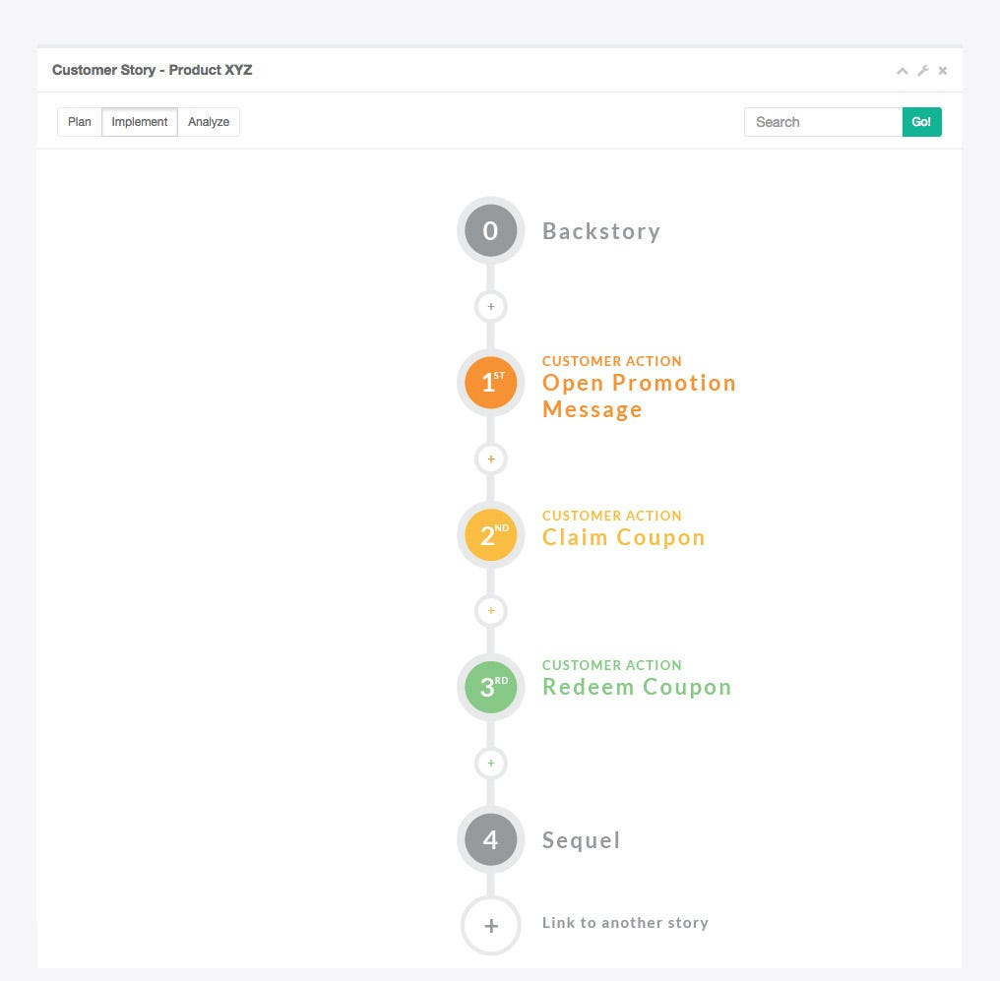
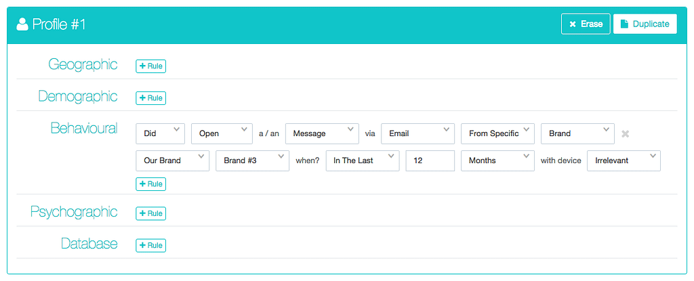
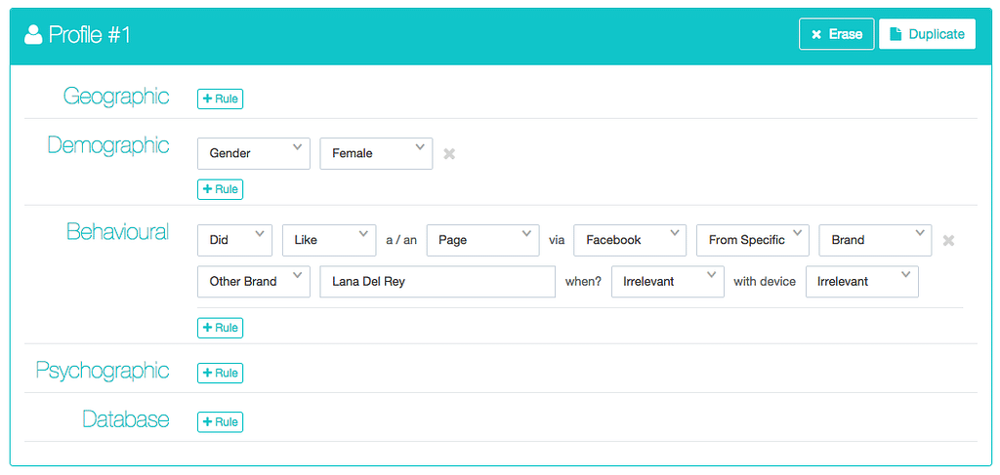
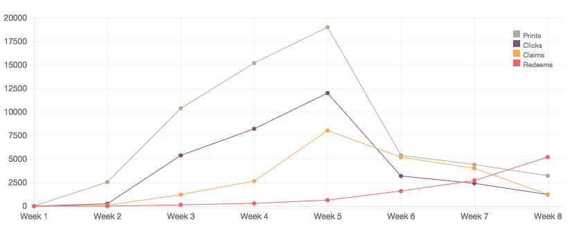
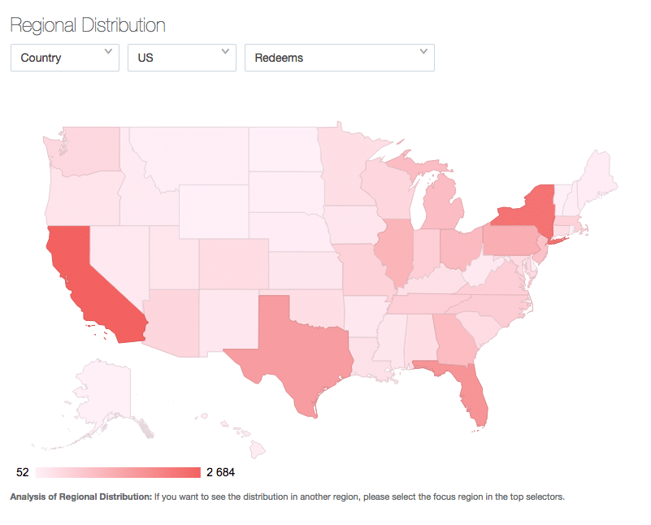
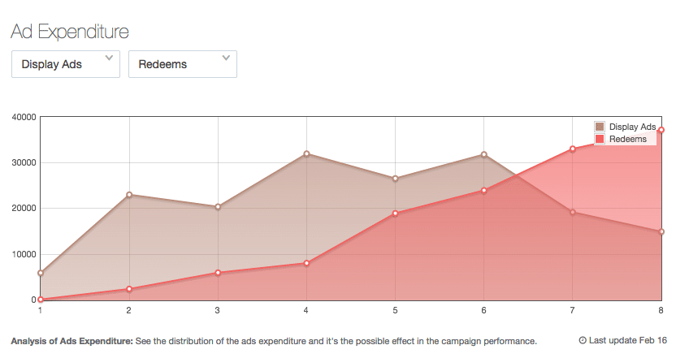
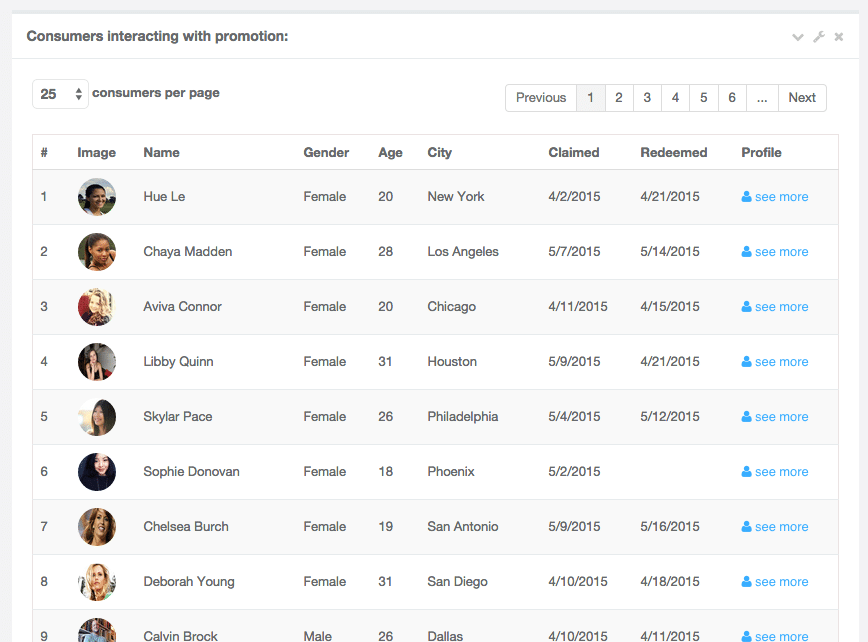

Are You Relevant To Your Customers and Leads?

When we think about the future of marketing we must immediately think about being 100% relevant. Utopia or not, the brands nailing the marketing automation today are already highly relevant to their customers. They are able to deliver the right content at the right time, through the right channel. Well crafted Marketing automation not only enhances ROI but it also raises brand awareness. This means a consumer/customer tends to receive less spam, receiving instead what he wants - when he wants - in the correct context. This applies to both B2C and B2B!

[Hutsi](http://www.hutsi.com/) is a marketing automation AI platform we created. It allows companies to deliver online and offline cross-channel campaigns seamlessly to thousands of customers. Using customer interaction information to constantly adapt campaigns in real-time to each customer. Thus maximizing relevance and ROI.

So, let’s now go through the different key points of the platform:

1. Customer Story
2. Create Engagement Material
3. Advanced Segmentation
4. Proactive Intelligence
5. Advanced Analytics

All the following examples are built around a coupon campaign for an FMCG (Fast-Moving Consumer Goods - known as CPG in the US) company.

Related: [How to Build a Marketplace \[A Startup Case Study\]](https://altar.io/venga-product-bible-ux-ui/)

### 1\. Customer Story

Customer Story is used by the marketer to create on-the-go complex campaign flows that will be experienced by the customers. It is composed of a unidimensional chain of Actions & Triggers across any media on an “if-this, then-that” dynamic.

Although each chain is unidimensional, you can link one story to another. This allows you to create a never-ending story that has a simple, clean and easy to manage interface. Instead of the standard multidimensional chaotic graphs used for marketing automation.

#### Chapters & Triggers

Chapters are the main phases of each campaign. Usually, they are separated from each other with the Key Customer Actions (most relevant interactions from customers within the campaign).

Using the coupon campaign example, if the final goal is “Customer redeeming a voucher”, then the campaign should have the following Key Customer Actions:

- Open Promotion Message
- Claim Coupon
- Redeem Coupon

The Triggers are all the steps that represent interactions from the brand towards the customer. Trying to entice the customer to move to the following chapter.

Importantly, the Triggers can be scheduled or triggered by a Customer Action. In this example, all triggers are interactions from the brand inciting the customer to perform the key actions:

- Open a message
- Claim and Redeem a coupon

Each trigger is created in a very simple and intuitive way, the “if-this, then-that” dynamics.

### 2\. Create Engagement Material

In each step of the customer stories, you can create the engagement materials to reach each customer through each channel. This material can be created via uploaded media or created in the platform directly. The greatest advantage of using direct materials is the seamless integration on the flux. Here is how to create a coupon that, after being created, is immediately ready to claim and redeem.

https://www.youtube.com/watch?v=7RvcPJ44M8E

### In addition, after creating a coupon, all media elements are fully responsive.

The claim/redeem flux is totally structured and tracked inside the platform. All the customers’ claim/redeem actions are gathered by Hutsi. Is the point of sale online or offline?  Here is a flux to give you the answer:

3\. Advanced Segmentation

One of the key points for being relevant to the customer is knowing exactly what to offer each customer through segmentation. Our approach to segmentation on [Hutsi](http://www.hutsi.com/) is possible through two vehicles of intelligence: Human and Machine. To clarify:

- 1. The Machine - makes use of predictive intelligence. In Hutsi’s case, predictive intelligence is the result of the machine learning process to get to know customers’ tastes and habits to engage in a more natural way - creating highly detailed segments. This process will automatically create A/B tests, create the most relevant clusters according to the user’s profile. Or will design an engagement tactic for each user depending on his behaviour’s history.
    2. The Human - depends only on the marketing rationale tailored by the marketer. It is shaped through Hutsi’s User Interface, designed to enhance the marketer’s power. This video shows the process in detail:

https://www.youtube.com/watch?v=URwgH4Vvh30

Here a few examples of segmentation:

  

### **4.** Proactive Intelligence

“Smart Data” is much more useful than “Big Data”. Machine Learning will help you focus on what matters most. 

Proactive intelligence will help the brand to optimise the ROI at each step of a Customer Story. Instead of deciding, for example, “an email will be sent at day one” you can select email, DM and SMS to be sent within the 1st week. Then you just let Hutsi decide the best way to engage with each customer. For example, John S. engages better with email, while his wife has a better reaction to promotions through fancy DM. John's cousin only answers to SMS on working days after 7pm. Hutsi will engage with each customer the way he/she prefers.

There are 3 levels of proactive intelligence:

- - - 1st level, A/B Testing: The customer just signed up with their email. Hutsi knows nothing about this customer and will A/B test.
        - 2nd level, Collective Perception: The customer made some interactions. Hutsi knows enough to attach this customer to a cluster (example: Housewives from California)
        - 3rd level, Friendship Intelligence: The customer made some interactions. Meaning Hutsi already knows enough to interact with them in a dedicated way, delivering only what is relevant, when efficient, through the best channel.

The levels are forward-adjusted depending on how much you learn about each customer. Conversely, they are backwards-adjusted when an assumption taken by the algorithm is not (or stops) having a positive effect.

##### Do you have a brilliant startup idea that you want to bring to life?

From the product and business reasoning to streamlining your MVP to the most important features, our team of product experts and ex-startup founders can help you bring your vision to life.

Let's Talk

### 5\. Advanced Analytics

The analytics are a very important part of the platform. The multi-layered analytics visualization helps the marketer have an in-depth vision of what is happening in real-time with extreme accuracy.

https://www.youtube.com/watch?v=lWPo51lGyC0

#### Overall

Know all the relevant metrics of your campaign at any given moment. Don’t lose sight of the lifeblood of your marketing campaigns and relevance to your customers in terms of:

- Campaign open rates
- Claims
- Redeems
- The velocity at which your customers redeem your campaign

#### Campaign Evolution

You launch your campaign on day one, releasing it to the world. Backtrack the evolution of your campaign in its dimensions throughout all periods:

- Prints
- Clicks
- Claims
- Redemptions

#### Results VS Goals

Let’s face it, marketing is all about results and goals and the fewer raw numbers to crunch the better. That’s why with Hutsi you can set the goals and track the results at each part of the funnel seamlessly.

#### Beautiful Visualization

You will impress your peers every time you report on your campaigns with one of several graphs Hutsi will prepare for you.

#### Social Analytics

Hutsi will have the social impact of your campaign ready at the click of a button. Get to know which gender and which media is being moved the most by your campaign.

#### Location Analytics

Whether your campaign is national or regional you will have clear visibility on where performance is better or worse. As well as where the redeems are happening and a number of location performance analyses.

#### Ad Expenditure

Analyse the relationship of several metrics with your ad expenditure to check the pulse of your ROI.

#### Customer Paths

Customers act differently in different situations therefore the customer paths will change. Get to know just how much. Learn which paths are getting the best results and which ones are getting lousy results. Learn how to be more relevant to your customer and maybe suppress the steps that are creating spam and negative results.

  

#### Customer Profile

Get One-on-One knowledge on the lifeblood of your business: your customers and their habits.

Thanks for reading.
