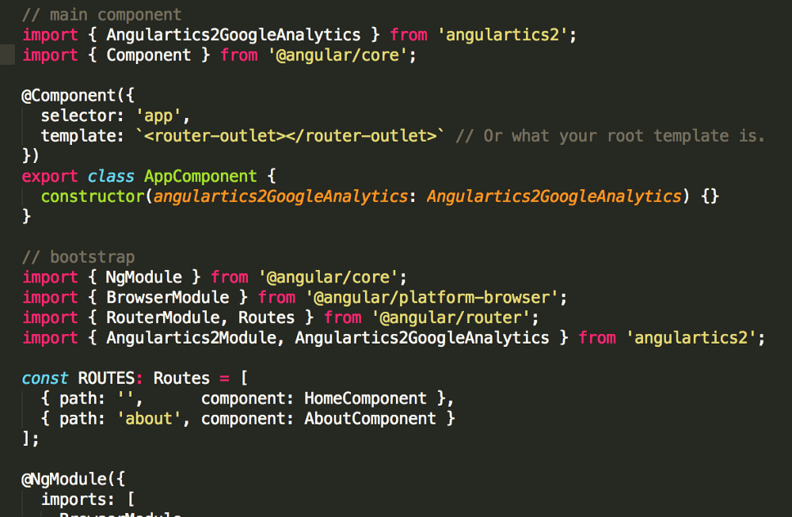

We’ve created the open-source library [Angulartics2](https://github.com/angulartics/angulartics2) to plug into your Angular single-page app (SPA) for analytics integration. It allows you to do event tracking and it is ready to integrate with Google Analytics, Google Tag Manager, Kissmetrics, Mixpanel, Piwik, Segment, Baidu Analytics and Facebook Pixel.

/\*! elementor - v3.19.0 - 28-02-2024 \*/  .elementor-widget-image{text-align:center}.elementor-widget-image a{display:inline-block}.elementor-widget-image a img\[src$=".svg"\]{width:48px}.elementor-widget-image img{vertical-align:middle;display:inline-block}

## Problem

Most analytics providers do not automatically track the browser’s navigation history, making it difficult to track single-page applications (SPAs) like Angular applications.

## Simple Solution

To tackle this problem we developed a simple open-source library called [Angulartics2](https://github.com/angulartics/angulartics2). By plugging [Angulartics2](https://github.com/angulartics/angulartics2) in your Angular apps it will automatically track navigation events and send them to your plugged-in Provider, such as [Google Analytics](https://www.google.com/analytics/analytics/#?modal_active=none).

[Angulartics2](https://github.com/angulartics/angulartics2) also comes with easy ways to send custom events to your providers enabling you to easily send any kind of event such as when your users buy an article or download a file. This is mostly useful for tracking conversion within your apps.

## Diving into some simple code snippets

Plugging [Angulartics2](https://github.com/angulartics/angulartics2) into your Angular app is simple and similar to any other module

You have to import Angulartics2Module.forRoot() into your main module and pass an array with the providers you are using.

Then, in you main component you need to pass each provider to the component constructor function. And that’s it, you now have automatic page tracking.

Make sure you also import the RouterModule into your main module. [Angulartics2](https://github.com/angulartics/angulartics2) uses Router to track your app’s current state.

.elementor-16418 .elementor-element.elementor-element-fa6400f{--display:flex;--flex-direction:column;--container-widget-width:100%;--container-widget-height:initial;--container-widget-flex-grow:0;--container-widget-align-self:initial;--overflow:hidden;--background-transition:0.3s;--border-radius:12px 12px 12px 12px;}.elementor-16418 .elementor-element.elementor-element-283e311{--display:flex;--flex-direction:row;--container-widget-width:initial;--container-widget-height:100%;--container-widget-flex-grow:1;--container-widget-align-self:stretch;--gap:64px 64px;--background-transition:0.3s;}.elementor-16418 .elementor-element.elementor-element-283e311:not(.elementor-motion-effects-element-type-background), .elementor-16418 .elementor-element.elementor-element-283e311 > .elementor-motion-effects-container > .elementor-motion-effects-layer{background-color:#F4FAFE;}.elementor-16418 .elementor-element.elementor-element-283e311, .elementor-16418 .elementor-element.elementor-element-283e311::before{--border-transition:0.3s;}.elementor-16418 .elementor-element.elementor-element-857117e{--display:flex;--flex-direction:row;--container-widget-width:initial;--container-widget-height:100%;--container-widget-flex-grow:1;--container-widget-align-self:stretch;--background-transition:0.3s;}.elementor-16418 .elementor-element.elementor-element-857117e.e-con{--flex-grow:0;--flex-shrink:0;}.elementor-16418 .elementor-element.elementor-element-e6af329 img{width:100%;max-width:100%;height:100%;object-fit:cover;object-position:bottom right;}.elementor-16418 .elementor-element.elementor-element-e6af329{width:100%;max-width:100%;bottom:-44px;}body:not(.rtl) .elementor-16418 .elementor-element.elementor-element-e6af329{right:0px;}body.rtl .elementor-16418 .elementor-element.elementor-element-e6af329{left:0px;}.elementor-16418 .elementor-element.elementor-element-ec0de51{--display:flex;--flex-direction:column;--container-widget-width:100%;--container-widget-height:initial;--container-widget-flex-grow:0;--container-widget-align-self:initial;--gap:24px 24px;--background-transition:0.3s;--padding-block-start:112px;--padding-block-end:112px;--padding-inline-start:0px;--padding-inline-end:44px;}.elementor-16418 .elementor-element.elementor-element-ec0de51.e-con{--flex-grow:1;--flex-shrink:1;}.elementor-16418 .elementor-element.elementor-element-c168e59{--display:flex;--flex-direction:column;--container-widget-width:100%;--container-widget-height:initial;--container-widget-flex-grow:0;--container-widget-align-self:initial;--background-transition:0.3s;}.elementor-16418 .elementor-element.elementor-element-4aeb8ec .elementor-heading-title{font-family:"Poppins", sans-serif;font-size:32px;font-weight:700;}.elementor-16418 .elementor-element.elementor-element-8e0cd20{color:#000000;}@media(min-width:768px){.elementor-16418 .elementor-element.elementor-element-857117e{--width:360px;}}@media(max-width:767px){.elementor-16418 .elementor-element.elementor-element-283e311{--padding-block-start:40px;--padding-block-end:40px;--padding-inline-start:var(--safe-margin);--padding-inline-end:var(--safe-margin);}.elementor-16418 .elementor-element.elementor-element-857117e{--min-height:300px;}body:not(.rtl) .elementor-16418 .elementor-element.elementor-element-e6af329{right:0px;}body.rtl .elementor-16418 .elementor-element.elementor-element-e6af329{left:0px;}.elementor-16418 .elementor-element.elementor-element-e6af329{bottom:-76px;}.elementor-16418 .elementor-element.elementor-element-ec0de51{--padding-block-start:40px;--padding-block-end:0px;--padding-inline-start:0px;--padding-inline-end:0px;}}

/\*! elementor - v3.19.0 - 28-02-2024 \*/  .elementor-heading-title{padding:0;margin:0;line-height:1}.elementor-widget-heading .elementor-heading-title\[class\*=elementor-size-\]>a{color:inherit;font-size:inherit;line-height:inherit}.elementor-widget-heading .elementor-heading-title.elementor-size-small{font-size:15px}.elementor-widget-heading .elementor-heading-title.elementor-size-medium{font-size:19px}.elementor-widget-heading .elementor-heading-title.elementor-size-large{font-size:29px}.elementor-widget-heading .elementor-heading-title.elementor-size-xl{font-size:39px}.elementor-widget-heading .elementor-heading-title.elementor-size-xxl{font-size:59px}

##### Looking for Software Development Services?

/\*! elementor - v3.19.0 - 28-02-2024 \*/  .elementor-widget-text-editor.elementor-drop-cap-view-stacked .elementor-drop-cap{background-color:#69727d;color:#fff}.elementor-widget-text-editor.elementor-drop-cap-view-framed .elementor-drop-cap{color:#69727d;border:3px solid;background-color:transparent}.elementor-widget-text-editor:not(.elementor-drop-cap-view-default) .elementor-drop-cap{margin-top:8px}.elementor-widget-text-editor:not(.elementor-drop-cap-view-default) .elementor-drop-cap-letter{width:1em;height:1em}.elementor-widget-text-editor .elementor-drop-cap{float:left;text-align:center;line-height:1;font-size:50px}.elementor-widget-text-editor .elementor-drop-cap-letter{display:inline-block}

Get straight to the point, jargon-free advice from a tech expert that has been building award-winning Startups for the past 10 years.

Let's Talk

## Tracking custom events

After setting up [Angulartics2](https://github.com/angulartics/angulartics2) you can then easily trigger custom events:

You just need to import **Angulartics2Module.forChild()** in your modules and use **angulartics2On** directive in your templates.

You can also trigger custom events programmatically, by injecting **Angulartics2** service in your components.

[**Angulartics2**](https://github.com/angulartics/angulartics2) is under active development and maintenance and we will be adding new providers based on community’s requests.

We currently support providers for: – [Google Analytics](https://www.google.com/analytics/analytics/#?modal_active=none) – [Google Tag Manager](https://www.google.com/analytics/tag-manager/) – [Kissmetrics](https://www.kissmetrics.com/) – [Mixpanel](https://mixpanel.com/) – [Piwik](https://piwik.org/) – [Segment](https://segment.com/) – [Baidu Analytics](http://tongji.baidu.com/) – [Facebook Pixel](https://www.facebook.com/business/a/facebook-pixel)

As with most good work, this could not be done without the help of great contributors. Many thanks for all the help to [Nathan Walker](https://github.com/NathanWalker), [Jonathan Reyes](https://github.com/jylinman), [Niels Kristian](https://github.com/skovmand), [Roland Oldengarm](https://github.com/rolandoldengarm), [kris](https://github.com/kwv), [Tim Elfelt](https://github.com/timelf123), [Matthew Daniels](https://github.com/MatthewDaniels), [Adam S. Kirschner](https://github.com/hikirsch), [Hongbo Miao](https://github.com/Hongbo-Miao), [Smithi](https://github.com/smith64fx) and [Júlio César](https://github.com/JulioC).
