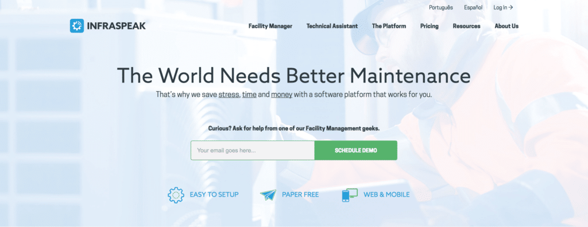
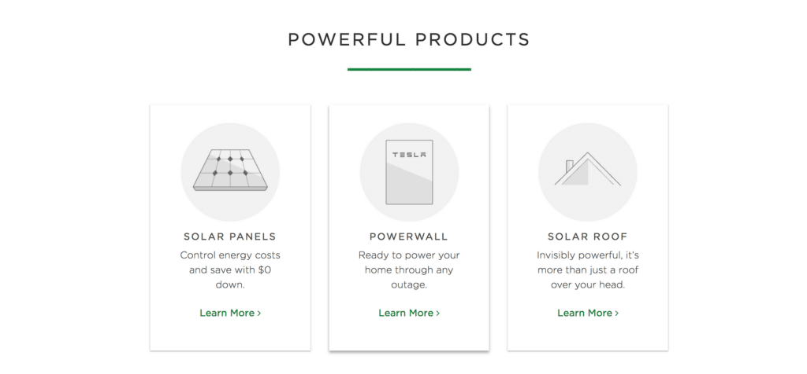
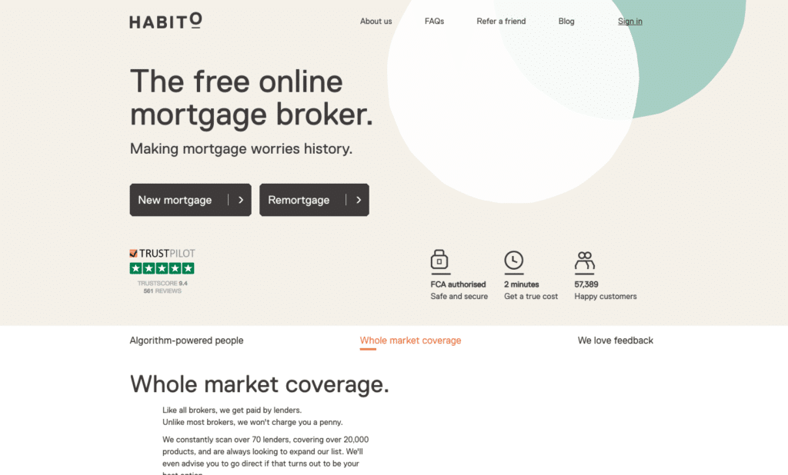
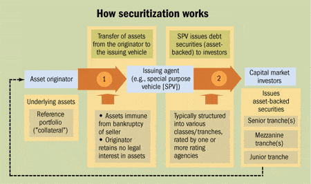

Proptech or Real Estate Technology has had several stages in its yet short-lived existence. The consensus is that soon we will have more startups that will automate several processes in time-consuming and expensive usages. But the truly revolutionary aspect will be the advent of Crypto Securitization.

According to Oxford’s Said Business School [Proptech Report](https://www.sbs.ox.ac.uk/sites/default/files/Press_Office/Images/proptechreport/PropTech%203%20-%20The%20Future%20of%20Real%20Estate.pdf), we are now charging ahead towards new ventures aimed at reaching Proptech 3.0. This could bring along sophisticated asset analytics and even trading capabilities that could make real estate significantly more liquid. To an extent that might make it almost as liquid as financial assets via crypto securitization.

It will be the financial sector (Fintech and Crypto Tech) leading the way and real estate (Proptech) will keep being a use case scenario for many of the novelties coming from them. Some innovations in Proptech, such as deploying smart energy production or consumption analysis will however not be in any way related to Fintech. Hence proving that Proptech is not under the Fintech umbrella but rather at the intersection of different segments.

### PropTech 1.0

Proptech 1.0 is really about the inception of the usage of technology to list and analyse real estate assets. Websites from realtors and aggregators such as [Zillow.com](https://www.zillow.com/) in the US, [Rightmove.co.uk](http://www.rightmove.co.uk/) have been providing essential real estate information leading to customer interest and transaction.

Such information and data hoarding leads naturally towards _elaborate asset radiography._ Allowing for data crunching and increasingly better insights, including, for some listing sites such as Zillow to do their own automated appraisals:

- Professional photos

- Apartment size

- Floor plans

- Year

- State

- 3D Visit

- Price
- Valuation

.elementor-3326 .elementor-element.elementor-element-fa6400f{--display:flex;--flex-direction:column;--container-widget-width:100%;--container-widget-height:initial;--container-widget-flex-grow:0;--container-widget-align-self:initial;--overflow:hidden;--background-transition:0.3s;--border-radius:12px 12px 12px 12px;}.elementor-3326 .elementor-element.elementor-element-283e311{--display:flex;--flex-direction:row;--container-widget-width:initial;--container-widget-height:100%;--container-widget-flex-grow:1;--container-widget-align-self:stretch;--gap:64px 64px;--background-transition:0.3s;}.elementor-3326 .elementor-element.elementor-element-283e311:not(.elementor-motion-effects-element-type-background), .elementor-3326 .elementor-element.elementor-element-283e311 > .elementor-motion-effects-container > .elementor-motion-effects-layer{background-color:#F4FAFE;}.elementor-3326 .elementor-element.elementor-element-283e311, .elementor-3326 .elementor-element.elementor-element-283e311::before{--border-transition:0.3s;}.elementor-3326 .elementor-element.elementor-element-857117e{--display:flex;--flex-direction:row;--container-widget-width:initial;--container-widget-height:100%;--container-widget-flex-grow:1;--container-widget-align-self:stretch;--background-transition:0.3s;}.elementor-3326 .elementor-element.elementor-element-857117e.e-con{--flex-grow:0;--flex-shrink:0;}.elementor-3326 .elementor-element.elementor-element-e6af329 img{width:100%;max-width:100%;height:100%;object-fit:cover;object-position:bottom right;}.elementor-3326 .elementor-element.elementor-element-e6af329{width:100%;max-width:100%;bottom:-44px;}body:not(.rtl) .elementor-3326 .elementor-element.elementor-element-e6af329{right:0px;}body.rtl .elementor-3326 .elementor-element.elementor-element-e6af329{left:0px;}.elementor-3326 .elementor-element.elementor-element-ec0de51{--display:flex;--flex-direction:column;--container-widget-width:100%;--container-widget-height:initial;--container-widget-flex-grow:0;--container-widget-align-self:initial;--gap:24px 24px;--background-transition:0.3s;--padding-block-start:112px;--padding-block-end:112px;--padding-inline-start:0px;--padding-inline-end:44px;}.elementor-3326 .elementor-element.elementor-element-ec0de51.e-con{--flex-grow:1;--flex-shrink:1;}.elementor-3326 .elementor-element.elementor-element-c168e59{--display:flex;--flex-direction:column;--container-widget-width:100%;--container-widget-height:initial;--container-widget-flex-grow:0;--container-widget-align-self:initial;--background-transition:0.3s;}.elementor-3326 .elementor-element.elementor-element-4aeb8ec .elementor-heading-title{font-family:"Poppins", sans-serif;font-size:32px;font-weight:700;}.elementor-3326 .elementor-element.elementor-element-8e0cd20{color:#000000;}@media(min-width:768px){.elementor-3326 .elementor-element.elementor-element-857117e{--width:360px;}}@media(max-width:767px){.elementor-3326 .elementor-element.elementor-element-283e311{--padding-block-start:40px;--padding-block-end:40px;--padding-inline-start:var(--safe-margin);--padding-inline-end:var(--safe-margin);}.elementor-3326 .elementor-element.elementor-element-857117e{--min-height:300px;}body:not(.rtl) .elementor-3326 .elementor-element.elementor-element-e6af329{right:0px;}body.rtl .elementor-3326 .elementor-element.elementor-element-e6af329{left:0px;}.elementor-3326 .elementor-element.elementor-element-e6af329{bottom:-76px;}.elementor-3326 .elementor-element.elementor-element-ec0de51{--padding-block-start:40px;--padding-block-end:0px;--padding-inline-start:0px;--padding-inline-end:0px;}}

##### Building a Startup?

From the product and business reasoning to streamlining your MVP to the most important features, our team of product experts and ex-startup founders can help you bring your vision to life.

Let's Talk

Proptech 2.0

Proptech 1.0 focused on helping the agent or owner make a digital brochure quickly and have it gain visibility. Proptech 2.0, however, is about the universe of ideas and possibilities to disrupt specific processes and segments of the market. Specifically, ones that could benefit from simply transposing existing tech concepts of the Shared Economy, Fintech, Analytics, Smart Building, Energy Efficiency and other technology segments.

A lot of questions are being answered by innovators who had come across simple questions that revolve around maximizing the benefits of owning or living in an apartment. Here are a few common questions that have been answered by an app/startup already:

How Can I Pass On My Home Quickly So I Can Buy Another One ASAP?

[Nested.com](http://nested.com/) is a tech-centric agent in the UK offers an innovative service that advances you a large majority of your home’s appraisal (up to 97%). This enables you to purchase your next home faster while they try to sell yours in the meantime.

How Can I Rent Out A Property To Students Without Arranging Multiple Viewings?

Uniplaces.com is a Portuguese Startup working in 6 countries. It offers a profound snapshot of the room, entire home and user ratings. Allowing students coming from abroad to quickly decide whether to book their 4–10-month stay from a distance. Thus solving the huge issue of sifting through listings that would otherwise be in local room listing websites in the native language and with often poor information.

How Can I Manage All My Commercial Properties In One Place with Deep Analytics and Reporting?

[Infraspeak](https://www.infraspeak.com/) is a Portuguese startup focused on helping professional property and technical managers ditch pen and paper and centralize all data, key indicators and reporting on each of their managed assets.

How Can I Replace Grid Energy with Self-Generated Renewable Energy?

SolarCity (Now part of Tesla) is the US’ leading solar panel producer and deployer. Via solar panels or their latest offering, the solar roof, it finances its customers to buy their solutions and phase out from reliance on the grid’s energy which is more pollutant and expensive over time.

How Can I Order a 3D Home Design Project Seamlessly?

[Space Feeling](https://spacefeeling.com/) (formerly Space-Filling) is a Belgian startup offering professional home 3D design with the latest trends at a fraction of the usual cost (i.e. dozens of thousands). With a mix of automation, sensible architecture and a decorator’s touch this startup works with end customers. It also integrates with agents and real estate developers’ pipelines to create sophisticated design projects and furniture fitting.

How Can I Finance or Refinance My Mortgage Without Going to the Bank?

In Europe, with the full deployment of the Payment Services Directive 2 (PSD2) a lot is due to change. Homeowners will be able to provide lenders with their details quickly online. This will enable them to provide quotes quickly and easy mortgage transfers from your current bank to a more competitive lender that will save you money every month.

[Habito](https://www.habito.com/) in the UK is one of the spearheads in this route towards a more tech approach to finding the best possible loan terms for you.

 Reaching Proptech 3.0

Proptech 2.0 is about a number of startups bringing the latest technological advances started elsewhere into the real estate sector.

Proptech 3.0 will be about radically transforming the transparency and liquidity of this gigantic, but very illiquid, market with (currently beta-stage) innovations in the broader financial sector.

Great transparency and safe transaction mechanisms for investment purposes will enable what, until now, has been the realm of rental/short-rental. The ultimate goal being full transactions done online, remotely as you would with any financial asset. Changing the slow nature of Real Estate transactions that have an annual turnover of less than 0.5%.

_According to Savills, 2016 and the World Bank, the global real estate market is worth $217tr, 75% of which is residential property. Annual real estate trading has averaged $683bn annually since 2007 and reached $900bn in 2015. This represents a turnover of around 0.3–4% of the capital stock._

#### Tech led transparency

On one side there will be a revolution in accessible data such as:

1. Governments providing more official transactional data that had been in a black box.
2. Banks, regulators and statistical authorities providing population, macro and microeconomic data, banking statistics on loan supply and non-performing loans. As well as a host of complementary data via Open Banking protocols and transparency rules.
3. Brokers and listing aggregators providing compiled listing data on prices, rentals, void periods, competition, hyperlocal scoring and analytics.

To efficiently source, crunch and generate relevant giveaways such as automated appraisals and future price predictions there are a number of initiatives, not least [Altar.io](https://altar.io/)’s Real Estate Intelligence Cloud.

More and better-organized information displayed as in comparison to competing opportunities leads to more clarity, confidence and adds to the liquidity of the segment.

#### Tech led Trustless Transactions

The revolution of cryptocurrencies and the blockchain will allow for the crafting of contracts that _identify, hold and trade properties from owner A to new owner B. A process that we will call Crypto Securitization_ over the blockchain (or other alike processes) in a safe, quick and legally binding manner ([Smart Contracts](https://edubirdie.com/blog/ethereum-smart-contracts-work)).

In these contracts, there is no bank, lawyer nor regulator. Rather there is a consensus mechanism overseen by a distributed network of participants that automatically validates transactions via the blockchain technology with encrypted digital certificates that in theory cannot be tampered with. This takes out the need for trust, for the intermediary, the human-led process.

Supporting this mechanism there is a distributed, peer-to-peer, public digital ledger with the history of all assets and transactions done within the blockchain with unique digital identifiers. All transactions are verifiable by anyone, anywhere as everyone has the same access.

This together with the transparency and wealth of information brought by new intelligence solutions brings the possibility of _knowing enough_ and _buying securely_. All done digitally and without intermediaries, thus saving most fees.

Crypto-Securitization of Real Estate Assets

The question is, can this distributed ledger contain official information about a property that is needed to verify the property’s ownership? Such as the deed, mortgage, council tax, outstanding utility bills and others that currently reside in different places. The answer is yes. Each ledger entry has room for such entries, to validate settlements and eventually produce new deeds and even log rent payments or distribute dividends.

/\* widget: Blog: Simple Quote \*/  /\* reset -------------------- \*/  .blog-custom-block \*,  .blog-custom-block ::before,  .blog-custom-block ::after {  box-sizing: border-box;  border-width: 0;  border-style: solid;  border-color: #e5e7eb;  }  /\* vars -------------------- \*/  .blog-custom-block.blog-custom-block\_\_simple-quote {  --color-accent: #0FA4EA;  --color-bg: #F4FAFE;  --color-text-2: #4A4A68;  }  /\* colors -------------------- \*/  .blog-custom-block.blog-custom-block\_\_simple-quote .bg-clr-bg {  background-color: var(--color-bg);  }  .blog-custom-block.blog-custom-block\_\_simple-quote .border-clr-accent {  border-color: var(--color-accent);  }  .blog-custom-block.blog-custom-block\_\_simple-quote .text-clr-text-2 {  color: var(--color-text-2);  }  /\* utils -------------------- \*/  .blog-custom-block.blog-custom-block\_\_simple-quote .flex {  display: flex;  }  .blog-custom-block.blog-custom-block\_\_simple-quote .flex-shrink-0 {  flex-shrink: 0;  }  .blog-custom-block.blog-custom-block\_\_simple-quote .flex-col {  flex-direction: column;  }  .blog-custom-block.blog-custom-block\_\_simple-quote .gap-4 {  gap: 1rem;  }  .blog-custom-block.blog-custom-block\_\_simple-quote .rounded-xl {  border-radius: 0.75rem;  }  .blog-custom-block.blog-custom-block\_\_simple-quote .border-l-6 {  border-left-width: 6px;  }  .blog-custom-block.blog-custom-block\_\_simple-quote .p-8 {  padding: 2rem;  }  .blog-custom-block.blog-custom-block\_\_simple-quote .text-xl {  font-size: 1.25rem;  line-height: 1.75rem;  }  .blog-custom-block.blog-custom-block\_\_simple-quote .italic {  font-style: italic;  } 

**_The_ _possibility that you will be able to document and isolate any small real estate asset’s ownership in a ledger and trade it on the blockchain will mean that any home will become easily negotiable and easily tradeable. Hence it becomes a financial instrument, a security. This will all but transform real estate assets into financial assets via crypto securitization. Traditional securitization requires an issuer (i.e. a bank) as the middleman and the startup costs of this process are in the hundreds of thousands. With Blockchain it should be possible to create Special Purpose Vehicles to own the assets in a seamless process at a small fraction of the current cost._**

 

/\* widget: Blog: Simple Quote \*/  /\* reset -------------------- \*/  .blog-custom-block \*,  .blog-custom-block ::before,  .blog-custom-block ::after {  box-sizing: border-box;  border-width: 0;  border-style: solid;  border-color: #e5e7eb;  }  /\* vars -------------------- \*/  .blog-custom-block.blog-custom-block\_\_simple-quote {  --color-accent: #0FA4EA;  --color-bg: #F4FAFE;  --color-text-2: #4A4A68;  }  /\* colors -------------------- \*/  .blog-custom-block.blog-custom-block\_\_simple-quote .bg-clr-bg {  background-color: var(--color-bg);  }  .blog-custom-block.blog-custom-block\_\_simple-quote .border-clr-accent {  border-color: var(--color-accent);  }  .blog-custom-block.blog-custom-block\_\_simple-quote .text-clr-text-2 {  color: var(--color-text-2);  }  /\* utils -------------------- \*/  .blog-custom-block.blog-custom-block\_\_simple-quote .flex {  display: flex;  }  .blog-custom-block.blog-custom-block\_\_simple-quote .flex-shrink-0 {  flex-shrink: 0;  }  .blog-custom-block.blog-custom-block\_\_simple-quote .flex-col {  flex-direction: column;  }  .blog-custom-block.blog-custom-block\_\_simple-quote .gap-4 {  gap: 1rem;  }  .blog-custom-block.blog-custom-block\_\_simple-quote .rounded-xl {  border-radius: 0.75rem;  }  .blog-custom-block.blog-custom-block\_\_simple-quote .border-l-6 {  border-left-width: 6px;  }  .blog-custom-block.blog-custom-block\_\_simple-quote .p-8 {  padding: 2rem;  }  .blog-custom-block.blog-custom-block\_\_simple-quote .text-xl {  font-size: 1.25rem;  line-height: 1.75rem;  }  .blog-custom-block.blog-custom-block\_\_simple-quote .italic {  font-style: italic;  } 

> **_Securitization is the process through which an issuer creates a_** [**_financial instrument_**](https://www.investopedia.com/terms/f/financialinstrument.asp) **_by combining other financial assets and then marketing different tiers of the repackaged instruments to investors. This process can encompass any type of_** [**_financial asset_**](https://www.investopedia.com/terms/f/financialasset.asp) **_and promotes_** [**_liquidity_**](https://www.investopedia.com/terms/l/liquidity.asp) **_in the marketplace._**

Read More: [Securitization](https://www.investopedia.com/terms/s/securitization.asp)

First experiences are already underway - such as the famed first home purchase online with a smart contract in October 2017 in which [**a man in San Francisco bought an apartment in Kiev for the equivalent of $60k**](https://www.newscientist.com/article/mg23631474-500-a-house-has-been-bought-on-the-blockchain-for-the-first-time/).

The Crypto Securitization technology will take a few years to become mainstream as [it is still at an early stage](http://www.thebanker.com/Transactions-Technology/Why-distributed-ledgers-aren-t-working-yet) and needs the support of regulators to agree on standards (and fees). But the new upcoming legality of blockchain deeds in some pioneering jurisdictions ([such as Sweden’s](https://qz.com/947064/sweden-is-turning-a-blockchain-powered-land-registry-into-a-reality/)new reality) will be one of a more liquid real estate sector with the characteristics of fully-fledged security, in any willing jurisdiction. Assets will be easily transferable, publicly listed and quickly exchangeable for currency or crypto-currency.

.elementor-3329 .elementor-element.elementor-element-f79b780{--display:flex;--flex-direction:column;--container-widget-width:100%;--container-widget-height:initial;--container-widget-flex-grow:0;--container-widget-align-self:initial;--background-transition:0.3s;}.elementor-3329 .elementor-element.elementor-element-aa6dd2a{--display:flex;--flex-direction:column;--container-widget-width:100%;--container-widget-height:initial;--container-widget-flex-grow:0;--container-widget-align-self:initial;--gap:24px 24px;--background-transition:0.3s;--border-radius:12px 12px 12px 12px;--padding-block-start:70px;--padding-block-end:70px;--padding-inline-start:var(--safe-margin);--padding-inline-end:var(--safe-margin);}.elementor-3329 .elementor-element.elementor-element-aa6dd2a:not(.elementor-motion-effects-element-type-background), .elementor-3329 .elementor-element.elementor-element-aa6dd2a > .elementor-motion-effects-container > .elementor-motion-effects-layer{background-color:#29293E;}.elementor-3329 .elementor-element.elementor-element-aa6dd2a, .elementor-3329 .elementor-element.elementor-element-aa6dd2a::before{--border-transition:0.3s;}.elementor-3329 .elementor-element.elementor-element-95ae566{--display:flex;--flex-direction:column;--container-widget-width:100%;--container-widget-height:initial;--container-widget-flex-grow:0;--container-widget-align-self:initial;--background-transition:0.3s;}.elementor-3329 .elementor-element.elementor-element-99ebd14{text-align:center;}.elementor-3329 .elementor-element.elementor-element-99ebd14 .elementor-heading-title{color:var( --e-global-color-eb70be1 );font-family:var( --e-global-typography-0ff79ee-font-family ), sans-serif;font-size:var( --e-global-typography-0ff79ee-font-size );font-weight:var( --e-global-typography-0ff79ee-font-weight );line-height:var( --e-global-typography-0ff79ee-line-height );letter-spacing:var( --e-global-typography-0ff79ee-letter-spacing );word-spacing:var( --e-global-typography-0ff79ee-word-spacing );}.elementor-3329 .elementor-element.elementor-element-0ce57c0{text-align:center;color:var( --e-global-color-eb70be1 );font-size:20px;}.elementor-3329 .elementor-element.elementor-element-28db4d7{--display:flex;--flex-direction:row;--container-widget-width:initial;--container-widget-height:100%;--container-widget-flex-grow:1;--container-widget-align-self:stretch;--justify-content:flex-start;--background-transition:0.3s;}.elementor-3329 .elementor-element.elementor-element-70fbc6a .elementor-field-group{padding-right:calc( 24px/2 );padding-left:calc( 24px/2 );margin-bottom:32px;}.elementor-3329 .elementor-element.elementor-element-70fbc6a .elementor-form-fields-wrapper{margin-left:calc( -24px/2 );margin-right:calc( -24px/2 );margin-bottom:-32px;}.elementor-3329 .elementor-element.elementor-element-70fbc6a .elementor-field-group.recaptcha\_v3-bottomleft, .elementor-3329 .elementor-element.elementor-element-70fbc6a .elementor-field-group.recaptcha\_v3-bottomright{margin-bottom:0;}body.rtl .elementor-3329 .elementor-element.elementor-element-70fbc6a .elementor-labels-inline .elementor-field-group > label{padding-left:8px;}body:not(.rtl) .elementor-3329 .elementor-element.elementor-element-70fbc6a .elementor-labels-inline .elementor-field-group > label{padding-right:8px;}body .elementor-3329 .elementor-element.elementor-element-70fbc6a .elementor-labels-above .elementor-field-group > label{padding-bottom:8px;}.elementor-3329 .elementor-element.elementor-element-70fbc6a .elementor-field-group > label, .elementor-3329 .elementor-element.elementor-element-70fbc6a .elementor-field-subgroup label{color:var( --e-global-color-eb70be1 );}.elementor-3329 .elementor-element.elementor-element-70fbc6a .elementor-field-group > label{font-family:var( --e-global-typography-9730a4e-font-family ), sans-serif;font-size:var( --e-global-typography-9730a4e-font-size );font-weight:var( --e-global-typography-9730a4e-font-weight );line-height:var( --e-global-typography-9730a4e-line-height );letter-spacing:var( --e-global-typography-9730a4e-letter-spacing );word-spacing:var( --e-global-typography-9730a4e-word-spacing );}.elementor-3329 .elementor-element.elementor-element-70fbc6a .elementor-field-type-html{padding-bottom:0px;}.elementor-3329 .elementor-element.elementor-element-70fbc6a .elementor-field-group .elementor-field{color:var( --e-global-color-eb70be1 );}.elementor-3329 .elementor-element.elementor-element-70fbc6a .elementor-field-group .elementor-field, .elementor-3329 .elementor-element.elementor-element-70fbc6a .elementor-field-subgroup label{font-family:var( --e-global-typography-text-font-family ), sans-serif;font-size:var( --e-global-typography-text-font-size );font-weight:var( --e-global-typography-text-font-weight );line-height:var( --e-global-typography-text-line-height );}.elementor-3329 .elementor-element.elementor-element-70fbc6a .elementor-field-group:not(.elementor-field-type-upload) .elementor-field:not(.elementor-select-wrapper){background-color:#3D3D5C;border-color:#65639C;}.elementor-3329 .elementor-element.elementor-element-70fbc6a .elementor-field-group .elementor-select-wrapper select{background-color:#3D3D5C;border-color:#65639C;}.elementor-3329 .elementor-element.elementor-element-70fbc6a .elementor-field-group .elementor-select-wrapper::before{color:#65639C;}.elementor-3329 .elementor-element.elementor-element-70fbc6a .elementor-button{font-family:"Poppins", sans-serif;font-size:14px;font-weight:700;line-height:1.5;}.elementor-3329 .elementor-element.elementor-element-70fbc6a .e-form\_\_buttons\_\_wrapper\_\_button-next{background-color:var( --e-global-color-1e4bfa7 );color:var( --e-global-color-eb70be1 );}.elementor-3329 .elementor-element.elementor-element-70fbc6a .elementor-button\[type="submit"\]{background-color:var( --e-global-color-1e4bfa7 );color:var( --e-global-color-eb70be1 );}.elementor-3329 .elementor-element.elementor-element-70fbc6a .elementor-button\[type="submit"\] svg \*{fill:var( --e-global-color-eb70be1 );}.elementor-3329 .elementor-element.elementor-element-70fbc6a .e-form\_\_buttons\_\_wrapper\_\_button-previous{color:var( --e-global-color-eb70be1 );}.elementor-3329 .elementor-element.elementor-element-70fbc6a .e-form\_\_buttons\_\_wrapper\_\_button-next:hover{color:#ffffff;}.elementor-3329 .elementor-element.elementor-element-70fbc6a .elementor-button\[type="submit"\]:hover{color:#ffffff;}.elementor-3329 .elementor-element.elementor-element-70fbc6a .elementor-button\[type="submit"\]:hover svg \*{fill:#ffffff;}.elementor-3329 .elementor-element.elementor-element-70fbc6a .e-form\_\_buttons\_\_wrapper\_\_button-previous:hover{color:#ffffff;}.elementor-3329 .elementor-element.elementor-element-70fbc6a .elementor-message{font-family:var( --e-global-typography-9730a4e-font-family ), sans-serif;font-size:var( --e-global-typography-9730a4e-font-size );font-weight:var( --e-global-typography-9730a4e-font-weight );line-height:var( --e-global-typography-9730a4e-line-height );letter-spacing:var( --e-global-typography-9730a4e-letter-spacing );word-spacing:var( --e-global-typography-9730a4e-word-spacing );}.elementor-3329 .elementor-element.elementor-element-70fbc6a .elementor-message.elementor-message-success{color:var( --e-global-color-40f63f7 );}.elementor-3329 .elementor-element.elementor-element-70fbc6a .elementor-message.elementor-message-danger{color:var( --e-global-color-8ddb30f );}.elementor-3329 .elementor-element.elementor-element-70fbc6a .elementor-message.elementor-help-inline{color:var( --e-global-color-9acb2f2 );}.elementor-3329 .elementor-element.elementor-element-70fbc6a{--e-form-steps-indicators-spacing:20px;--e-form-steps-indicator-padding:30px;--e-form-steps-indicator-inactive-secondary-color:#ffffff;--e-form-steps-indicator-active-secondary-color:#ffffff;--e-form-steps-indicator-completed-secondary-color:#ffffff;--e-form-steps-divider-width:1px;--e-form-steps-divider-gap:10px;width:100%;max-width:100%;}.elementor-3329 .elementor-element.elementor-element-70fbc6a > .elementor-widget-container{padding:10px 0px 0px 0px;}@media(min-width:768px){.elementor-3329 .elementor-element.elementor-element-aa6dd2a{--content-width:var(--container-md);}}@media(max-width:1024px){.elementor-3329 .elementor-element.elementor-element-99ebd14 .elementor-heading-title{font-size:var( --e-global-typography-0ff79ee-font-size );line-height:var( --e-global-typography-0ff79ee-line-height );letter-spacing:var( --e-global-typography-0ff79ee-letter-spacing );word-spacing:var( --e-global-typography-0ff79ee-word-spacing );}.elementor-3329 .elementor-element.elementor-element-70fbc6a .elementor-field-group > label{font-size:var( --e-global-typography-9730a4e-font-size );line-height:var( --e-global-typography-9730a4e-line-height );letter-spacing:var( --e-global-typography-9730a4e-letter-spacing );word-spacing:var( --e-global-typography-9730a4e-word-spacing );}.elementor-3329 .elementor-element.elementor-element-70fbc6a .elementor-field-group .elementor-field, .elementor-3329 .elementor-element.elementor-element-70fbc6a .elementor-field-subgroup label{font-size:var( --e-global-typography-text-font-size );line-height:var( --e-global-typography-text-line-height );}.elementor-3329 .elementor-element.elementor-element-70fbc6a .elementor-message{font-size:var( --e-global-typography-9730a4e-font-size );line-height:var( --e-global-typography-9730a4e-line-height );letter-spacing:var( --e-global-typography-9730a4e-letter-spacing );word-spacing:var( --e-global-typography-9730a4e-word-spacing );}}@media(max-width:767px){.elementor-3329 .elementor-element.elementor-element-99ebd14 .elementor-heading-title{font-size:var( --e-global-typography-0ff79ee-font-size );line-height:var( --e-global-typography-0ff79ee-line-height );letter-spacing:var( --e-global-typography-0ff79ee-letter-spacing );word-spacing:var( --e-global-typography-0ff79ee-word-spacing );}.elementor-3329 .elementor-element.elementor-element-70fbc6a .elementor-field-group > label{font-size:var( --e-global-typography-9730a4e-font-size );line-height:var( --e-global-typography-9730a4e-line-height );letter-spacing:var( --e-global-typography-9730a4e-letter-spacing );word-spacing:var( --e-global-typography-9730a4e-word-spacing );}.elementor-3329 .elementor-element.elementor-element-70fbc6a .elementor-field-group .elementor-field, .elementor-3329 .elementor-element.elementor-element-70fbc6a .elementor-field-subgroup label{font-size:var( --e-global-typography-text-font-size );line-height:var( --e-global-typography-text-line-height );}.elementor-3329 .elementor-element.elementor-element-70fbc6a .elementor-message{font-size:var( --e-global-typography-9730a4e-font-size );line-height:var( --e-global-typography-9730a4e-line-height );letter-spacing:var( --e-global-typography-9730a4e-letter-spacing );word-spacing:var( --e-global-typography-9730a4e-word-spacing );}}/\* Start custom CSS for form, class: .elementor-element-70fbc6a \*/.elementor-3329 .elementor-element.elementor-element-70fbc6a input {  border-color: #65639C !important;  }  .elementor-3329 .elementor-element.elementor-element-70fbc6a input:is(:focus, :hover) {  border-color: #B9B8CE !important;  }/\* End custom CSS \*/

##### Sign up for our newsletter

Join hundreds of entrepreneurs and business leaders to receive fresh, actionable tech and startup related insights and tips

/\*! elementor-pro - v3.19.0 - 07-02-2024 \*/  .elementor-button.elementor-hidden,.elementor-hidden{display:none}.e-form\_\_step{width:100%}.e-form\_\_step:not(.elementor-hidden){display:flex;flex-wrap:wrap}.e-form\_\_buttons{flex-wrap:wrap}.e-form\_\_buttons,.e-form\_\_buttons\_\_wrapper{display:flex}.e-form\_\_indicators{display:flex;justify-content:space-between;align-items:center;flex-wrap:nowrap;font-size:13px;margin-bottom:var(--e-form-steps-indicators-spacing)}.e-form\_\_indicators\_\_indicator{display:flex;flex-direction:column;align-items:center;justify-content:center;flex-basis:0;padding:0 var(--e-form-steps-divider-gap)}.e-form\_\_indicators\_\_indicator\_\_progress{width:100%;position:relative;background-color:var(--e-form-steps-indicator-progress-background-color);border-radius:var(--e-form-steps-indicator-progress-border-radius);overflow:hidden}.e-form\_\_indicators\_\_indicator\_\_progress\_\_meter{width:var(--e-form-steps-indicator-progress-meter-width,0);height:var(--e-form-steps-indicator-progress-height);line-height:var(--e-form-steps-indicator-progress-height);padding-right:15px;border-radius:var(--e-form-steps-indicator-progress-border-radius);background-color:var(--e-form-steps-indicator-progress-color);color:var(--e-form-steps-indicator-progress-meter-color);text-align:right;transition:width .1s linear}.e-form\_\_indicators\_\_indicator:first-child{padding-left:0}.e-form\_\_indicators\_\_indicator:last-child{padding-right:0}.e-form\_\_indicators\_\_indicator--state-inactive{color:var(--e-form-steps-indicator-inactive-primary-color,#c2cbd2)}.e-form\_\_indicators\_\_indicator--state-inactive \[class\*=indicator--shape-\]:not(.e-form\_\_indicators\_\_indicator--shape-none){background-color:var(--e-form-steps-indicator-inactive-secondary-color,#fff)}.e-form\_\_indicators\_\_indicator--state-inactive object,.e-form\_\_indicators\_\_indicator--state-inactive svg{fill:var(--e-form-steps-indicator-inactive-primary-color,#c2cbd2)}.e-form\_\_indicators\_\_indicator--state-active{color:var(--e-form-steps-indicator-active-primary-color,#39b54a);border-color:var(--e-form-steps-indicator-active-secondary-color,#fff)}.e-form\_\_indicators\_\_indicator--state-active \[class\*=indicator--shape-\]:not(.e-form\_\_indicators\_\_indicator--shape-none){background-color:var(--e-form-steps-indicator-active-secondary-color,#fff)}.e-form\_\_indicators\_\_indicator--state-active object,.e-form\_\_indicators\_\_indicator--state-active svg{fill:var(--e-form-steps-indicator-active-primary-color,#39b54a)}.e-form\_\_indicators\_\_indicator--state-completed{color:var(--e-form-steps-indicator-completed-secondary-color,#fff)}.e-form\_\_indicators\_\_indicator--state-completed \[class\*=indicator--shape-\]:not(.e-form\_\_indicators\_\_indicator--shape-none){background-color:var(--e-form-steps-indicator-completed-primary-color,#39b54a)}.e-form\_\_indicators\_\_indicator--state-completed .e-form\_\_indicators\_\_indicator\_\_label{color:var(--e-form-steps-indicator-completed-primary-color,#39b54a)}.e-form\_\_indicators\_\_indicator--state-completed .e-form\_\_indicators\_\_indicator--shape-none{color:var(--e-form-steps-indicator-completed-primary-color,#39b54a);background-color:initial}.e-form\_\_indicators\_\_indicator--state-completed object,.e-form\_\_indicators\_\_indicator--state-completed svg{fill:var(--e-form-steps-indicator-completed-secondary-color,#fff)}.e-form\_\_indicators\_\_indicator\_\_icon{width:var(--e-form-steps-indicator-padding,30px);height:var(--e-form-steps-indicator-padding,30px);font-size:var(--e-form-steps-indicator-icon-size);border-width:1px;border-style:solid;display:flex;justify-content:center;align-items:center;overflow:hidden;margin-bottom:10px}.e-form\_\_indicators\_\_indicator\_\_icon img,.e-form\_\_indicators\_\_indicator\_\_icon object,.e-form\_\_indicators\_\_indicator\_\_icon svg{width:var(--e-form-steps-indicator-icon-size);height:auto}.e-form\_\_indicators\_\_indicator\_\_icon .e-font-icon-svg{height:1em}.e-form\_\_indicators\_\_indicator\_\_number{width:var(--e-form-steps-indicator-padding,30px);height:var(--e-form-steps-indicator-padding,30px);border-width:1px;border-style:solid;display:flex;justify-content:center;align-items:center;margin-bottom:10px}.e-form\_\_indicators\_\_indicator--shape-circle{border-radius:50%}.e-form\_\_indicators\_\_indicator--shape-square{border-radius:0}.e-form\_\_indicators\_\_indicator--shape-rounded{border-radius:5px}.e-form\_\_indicators\_\_indicator--shape-none{border:0}.e-form\_\_indicators\_\_indicator\_\_label{text-align:center}.e-form\_\_indicators\_\_indicator\_\_separator{width:100%;height:var(--e-form-steps-divider-width);background-color:#babfc5}.e-form\_\_indicators--type-icon,.e-form\_\_indicators--type-icon\_text,.e-form\_\_indicators--type-number,.e-form\_\_indicators--type-number\_text{align-items:flex-start}.e-form\_\_indicators--type-icon .e-form\_\_indicators\_\_indicator\_\_separator,.e-form\_\_indicators--type-icon\_text .e-form\_\_indicators\_\_indicator\_\_separator,.e-form\_\_indicators--type-number .e-form\_\_indicators\_\_indicator\_\_separator,.e-form\_\_indicators--type-number\_text .e-form\_\_indicators\_\_indicator\_\_separator{margin-top:calc(var(--e-form-steps-indicator-padding, 30px) / 2 - var(--e-form-steps-divider-width, 1px) / 2)}.elementor-field-type-hidden{display:none}.elementor-field-type-html{display:inline-block}.elementor-field-type-tel input{direction:inherit}.elementor-login .elementor-lost-password,.elementor-login .elementor-remember-me{font-size:.85em}.elementor-field-type-recaptcha\_v3 .elementor-field-label{display:none}.elementor-field-type-recaptcha\_v3 .grecaptcha-badge{z-index:1}.elementor-button .elementor-form-spinner{order:3}.elementor-form .elementor-button>span{display:flex;justify-content:center;align-items:center}.elementor-form .elementor-button .elementor-button-text{white-space:normal;flex-grow:0}.elementor-form .elementor-button svg{height:auto}.elementor-form .elementor-button .e-font-icon-svg{height:1em}.elementor-select-wrapper .select-caret-down-wrapper{position:absolute;top:50%;transform:translateY(-50%);inset-inline-end:10px;pointer-events:none;font-size:11px}.elementor-select-wrapper .select-caret-down-wrapper svg{display:unset;width:1em;aspect-ratio:unset;fill:currentColor}.elementor-select-wrapper .select-caret-down-wrapper i{font-size:19px;line-height:2}.elementor-select-wrapper.remove-before:before{content:""!important}

   Full Name  Buisness Email  Subscribe

The Outlook

Real Estate Technology (Proptech) is evolving fast. Each day we see bigger and better tools producing advanced insights to help on investment decisions. But the real revolution is yet to come.

#### New questions to be answered with Proptech 3.0

Can I buy/sell now a property on the other side of the world safely online?

Can I receive dividends via property rent payments through the blockchain?

Can I lend to someone backed by their properties for both long and short periods?

Can I rent online and pay online for any rental with my online credentials?

The good news: Transaction costs are due to be significantly reduced from their current standing at 5–10% of asset worth. Owners will have much more liquid assets anywhere, both for sale and rental purposes.

The bad news: Property will have bigger ups and downs quicker as financial assets, in general, are more liquid and respond quicker to optimism and pessimism in the market. For real estate agents, lawyers, notaries and other intermediaries much of what they do can and should be phased out over time which will force a deep rethink of their place in the market just as happened with stockbrokers in the last 20 years.
