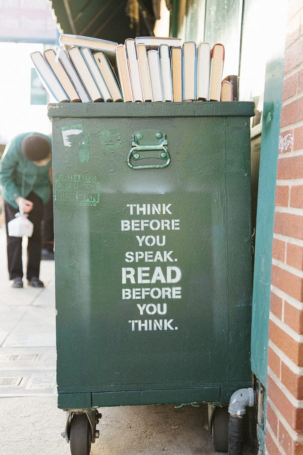

You’re building your tech venture and looking for investors, but it’s still too early to approach Venture Capitalists (VCs). So you decide, instead, to fill your next months’ calendar with meetings with Business Angels.

Great! Business Angels are a group of investors consisting of many amazing professionals who are a positive force for the startup sector’s advancement.

But, as we often see at [Altar.io,](https://altar.io/) too often Founders struggle with Bad Investors. If you want to avoid Bad Business Angels this will help you understand and spot the most common profiles.

Here are the time-waster profiles you should steer clear from as soon as you spot them.

### Bad Business Angels profiles and how to spot them

1. The _Out_ _of Touch_
2. The _Conglomerate Builder_
3. The _Shark_
4. The _Sheep_
5. The _ROI Obsessed_
6. The _Co-Founder_
7. The _Hands-On_

Related: [Startup Series Funding: Everything You Need To Know](https://altar.io/startup-series-funding-everything-you-need-to-know/)

The Out of Touch

This Business Angel is possibly an older manager who had a great career in Telco or Investment Banking. He knows a lot about Management, Supply Chain, Distribution, Finance, even HR but probably never ran his own company, much less a Tech company. He will struggle to understand the dynamics of setting up and launching an online product, a tech workplace and an online distribution platform. Moreover, he will most likely give you bad advice and pushy demands due to his/her “leader” profile.

#### How Do You Spot Them?

Check their CV or quickly ask what’s his/her point of view about your segment. He’ll show he has no knowledge of your specific sector. Steer clear!

### The Strings Attached/Conglomerate Builder

I’ve come across investors who seem to be trying to build a portfolio of companies that will integrate vertically. Let’s say one does media, the other does software development, another does accounting and so forth. This shows that the Angel is worried about reducing risk for the companies rather than maximizing growth with impactful projects and innovative leaders. He will serve you badly.

#### How Do You Spot Them?

During the first conversation, he will most likely talk about how you can save costs by hopping on his bandwagon of companies with “really awesome” developers, accountants, advisors, etc. There might be good intentions but really he will lack skills that matter and if you do get inside, your deep integration with his providers will hurt your chances of raising “smart capital” elsewhere, and he is definitely not smart capital himself.

### The Shark

This is the investor who will sell you his dozens of successes (all non-tech and non-startup businesses). Then he will tell you that with him and his “back-office team” you will stand much better chances of securing distribution deals, access to Chinese factories, media, etc. You will be dazzled and confused as it seems he has no idea that it all simply “does not apply to tech”.

#### How Do You Spot Them?

He doesn’t know tech, he can’t possibly assess your market potential and he knows nothing of your segment. Not only that but he will take a hard bargain approach too, if he finds your business interesting, potentially asking for a discount due to his proven record and added value, instead of a collaborative approach. This is not the angel for you, he belongs to the business of business restructuring. Say goodbye!

### The Sheep

This investor has little self-confidence and knows his money is just money so he will only tag along if people who do know about your business segment do invest, to salvage his record of bad investments. This investor can delay your whole process endlessly until others invest. Do not count on him/her.

#### How Do You Spot Them?

This investor will immediately ask you who is already committing to the round and if no resounding name is included he will ask you politely to talk to investors A, B and C. This investor plays it safe and knows he is only in financially. Of all the bad investors, this is one who might do you less harm but little more good than handing you money for the same terms as you do to great investors. Pray that he abides by your term sheet.

##### Do you have a brilliant startup idea that you want to bring to life?

From the product and business reasoning to streamlining your MVP to the most important features, our team of product experts and ex-startup founders can help you bring your vision to life.

Let's Talk

The ROI Obsessed

If angel investors are jumpy with their investment, you might want to consider running in the opposite direction. If they’re asking how soon they’ll get their investment before they are discussing a term sheet, you know they’re going to be trouble once the funds are out of their grasp.

A quality investor knows that, more often than not, timelines don’t run according to projected benchmarks and a second round of raising capital is more likely to happen than a fast exit or acquisition.

#### How Do You Spot Them?

An investor who asks how quickly you’ll be acquired is naive and going to cause you constant distaste. Most likely he is a newbie and definitely not smart money.

The Co-Founder

There are some angels out there who will only put (a small amount of) money on your project if you make them a co-founder. Their reasoning will be that the hours they’ll put in will be valuable (say $ 1000/hour) and they will then get big investors if you get them on board. And yes they will insist that that’s normal and ask you if you’ve seen “The Social Network” as that was the case with Facebook and Sean Parker. This is not fair and shows that they’re spouting a lot of hot air. If you need a broker you’d search for one.

#### How Do You Spot Them?

He will say your business is amazing and unique and that he would like an innovative approach. He’ll ask for “more skin in the game” and less money because he will easily get it from someone else if you give him 10 or 20% right away. This is not ethical. Just ditch quickly.

### The Hands-On

With far more money than “The Co-Founder” but even more of a nuisance, there is the Hands-On Investor. This is the kind that wants to be the chairman of every invested company, “help” you decide the minutiae of every decision, push down costs with cheaper hires, outsource to India and call for way too many board meetings where he tries to force you to follow his “superior wisdom”, etc. Follow your gut and leave.

#### How Do You Spot Them?

If you are unsure if this is the case of someone with an overwhelming personality, he probably has some invested startups that you can easily track and see how they are faring - likely they won’t be great as no investor should run your business.

.elementor-3329 .elementor-element.elementor-element-f79b780{--display:flex;--flex-direction:column;--container-widget-width:100%;--container-widget-height:initial;--container-widget-flex-grow:0;--container-widget-align-self:initial;--background-transition:0.3s;}.elementor-3329 .elementor-element.elementor-element-aa6dd2a{--display:flex;--flex-direction:column;--container-widget-width:100%;--container-widget-height:initial;--container-widget-flex-grow:0;--container-widget-align-self:initial;--gap:24px 24px;--background-transition:0.3s;--border-radius:12px 12px 12px 12px;--padding-block-start:70px;--padding-block-end:70px;--padding-inline-start:var(--safe-margin);--padding-inline-end:var(--safe-margin);}.elementor-3329 .elementor-element.elementor-element-aa6dd2a:not(.elementor-motion-effects-element-type-background), .elementor-3329 .elementor-element.elementor-element-aa6dd2a > .elementor-motion-effects-container > .elementor-motion-effects-layer{background-color:#29293E;}.elementor-3329 .elementor-element.elementor-element-aa6dd2a, .elementor-3329 .elementor-element.elementor-element-aa6dd2a::before{--border-transition:0.3s;}.elementor-3329 .elementor-element.elementor-element-95ae566{--display:flex;--flex-direction:column;--container-widget-width:100%;--container-widget-height:initial;--container-widget-flex-grow:0;--container-widget-align-self:initial;--background-transition:0.3s;}.elementor-3329 .elementor-element.elementor-element-99ebd14{text-align:center;}.elementor-3329 .elementor-element.elementor-element-99ebd14 .elementor-heading-title{color:var( --e-global-color-eb70be1 );font-family:var( --e-global-typography-0ff79ee-font-family ), sans-serif;font-size:var( --e-global-typography-0ff79ee-font-size );font-weight:var( --e-global-typography-0ff79ee-font-weight );line-height:var( --e-global-typography-0ff79ee-line-height );letter-spacing:var( --e-global-typography-0ff79ee-letter-spacing );word-spacing:var( --e-global-typography-0ff79ee-word-spacing );}.elementor-3329 .elementor-element.elementor-element-0ce57c0{text-align:center;color:var( --e-global-color-eb70be1 );font-size:20px;}.elementor-3329 .elementor-element.elementor-element-28db4d7{--display:flex;--flex-direction:row;--container-widget-width:initial;--container-widget-height:100%;--container-widget-flex-grow:1;--container-widget-align-self:stretch;--justify-content:flex-start;--background-transition:0.3s;}.elementor-3329 .elementor-element.elementor-element-70fbc6a .elementor-field-group{padding-right:calc( 24px/2 );padding-left:calc( 24px/2 );margin-bottom:32px;}.elementor-3329 .elementor-element.elementor-element-70fbc6a .elementor-form-fields-wrapper{margin-left:calc( -24px/2 );margin-right:calc( -24px/2 );margin-bottom:-32px;}.elementor-3329 .elementor-element.elementor-element-70fbc6a .elementor-field-group.recaptcha\_v3-bottomleft, .elementor-3329 .elementor-element.elementor-element-70fbc6a .elementor-field-group.recaptcha\_v3-bottomright{margin-bottom:0;}body.rtl .elementor-3329 .elementor-element.elementor-element-70fbc6a .elementor-labels-inline .elementor-field-group > label{padding-left:8px;}body:not(.rtl) .elementor-3329 .elementor-element.elementor-element-70fbc6a .elementor-labels-inline .elementor-field-group > label{padding-right:8px;}body .elementor-3329 .elementor-element.elementor-element-70fbc6a .elementor-labels-above .elementor-field-group > label{padding-bottom:8px;}.elementor-3329 .elementor-element.elementor-element-70fbc6a .elementor-field-group > label, .elementor-3329 .elementor-element.elementor-element-70fbc6a .elementor-field-subgroup label{color:var( --e-global-color-eb70be1 );}.elementor-3329 .elementor-element.elementor-element-70fbc6a .elementor-field-group > label{font-family:var( --e-global-typography-9730a4e-font-family ), sans-serif;font-size:var( --e-global-typography-9730a4e-font-size );font-weight:var( --e-global-typography-9730a4e-font-weight );line-height:var( --e-global-typography-9730a4e-line-height );letter-spacing:var( --e-global-typography-9730a4e-letter-spacing );word-spacing:var( --e-global-typography-9730a4e-word-spacing );}.elementor-3329 .elementor-element.elementor-element-70fbc6a .elementor-field-type-html{padding-bottom:0px;}.elementor-3329 .elementor-element.elementor-element-70fbc6a .elementor-field-group .elementor-field{color:var( --e-global-color-eb70be1 );}.elementor-3329 .elementor-element.elementor-element-70fbc6a .elementor-field-group .elementor-field, .elementor-3329 .elementor-element.elementor-element-70fbc6a .elementor-field-subgroup label{font-family:var( --e-global-typography-text-font-family ), sans-serif;font-size:var( --e-global-typography-text-font-size );font-weight:var( --e-global-typography-text-font-weight );line-height:var( --e-global-typography-text-line-height );}.elementor-3329 .elementor-element.elementor-element-70fbc6a .elementor-field-group:not(.elementor-field-type-upload) .elementor-field:not(.elementor-select-wrapper){background-color:#3D3D5C;border-color:#65639C;}.elementor-3329 .elementor-element.elementor-element-70fbc6a .elementor-field-group .elementor-select-wrapper select{background-color:#3D3D5C;border-color:#65639C;}.elementor-3329 .elementor-element.elementor-element-70fbc6a .elementor-field-group .elementor-select-wrapper::before{color:#65639C;}.elementor-3329 .elementor-element.elementor-element-70fbc6a .elementor-button{font-family:"Poppins", sans-serif;font-size:14px;font-weight:700;line-height:1.5;}.elementor-3329 .elementor-element.elementor-element-70fbc6a .e-form\_\_buttons\_\_wrapper\_\_button-next{background-color:var( --e-global-color-1e4bfa7 );color:var( --e-global-color-eb70be1 );}.elementor-3329 .elementor-element.elementor-element-70fbc6a .elementor-button\[type="submit"\]{background-color:var( --e-global-color-1e4bfa7 );color:var( --e-global-color-eb70be1 );}.elementor-3329 .elementor-element.elementor-element-70fbc6a .elementor-button\[type="submit"\] svg \*{fill:var( --e-global-color-eb70be1 );}.elementor-3329 .elementor-element.elementor-element-70fbc6a .e-form\_\_buttons\_\_wrapper\_\_button-previous{color:var( --e-global-color-eb70be1 );}.elementor-3329 .elementor-element.elementor-element-70fbc6a .e-form\_\_buttons\_\_wrapper\_\_button-next:hover{color:#ffffff;}.elementor-3329 .elementor-element.elementor-element-70fbc6a .elementor-button\[type="submit"\]:hover{color:#ffffff;}.elementor-3329 .elementor-element.elementor-element-70fbc6a .elementor-button\[type="submit"\]:hover svg \*{fill:#ffffff;}.elementor-3329 .elementor-element.elementor-element-70fbc6a .e-form\_\_buttons\_\_wrapper\_\_button-previous:hover{color:#ffffff;}.elementor-3329 .elementor-element.elementor-element-70fbc6a .elementor-message{font-family:var( --e-global-typography-9730a4e-font-family ), sans-serif;font-size:var( --e-global-typography-9730a4e-font-size );font-weight:var( --e-global-typography-9730a4e-font-weight );line-height:var( --e-global-typography-9730a4e-line-height );letter-spacing:var( --e-global-typography-9730a4e-letter-spacing );word-spacing:var( --e-global-typography-9730a4e-word-spacing );}.elementor-3329 .elementor-element.elementor-element-70fbc6a .elementor-message.elementor-message-success{color:var( --e-global-color-40f63f7 );}.elementor-3329 .elementor-element.elementor-element-70fbc6a .elementor-message.elementor-message-danger{color:var( --e-global-color-8ddb30f );}.elementor-3329 .elementor-element.elementor-element-70fbc6a .elementor-message.elementor-help-inline{color:var( --e-global-color-9acb2f2 );}.elementor-3329 .elementor-element.elementor-element-70fbc6a{--e-form-steps-indicators-spacing:20px;--e-form-steps-indicator-padding:30px;--e-form-steps-indicator-inactive-secondary-color:#ffffff;--e-form-steps-indicator-active-secondary-color:#ffffff;--e-form-steps-indicator-completed-secondary-color:#ffffff;--e-form-steps-divider-width:1px;--e-form-steps-divider-gap:10px;width:100%;max-width:100%;}.elementor-3329 .elementor-element.elementor-element-70fbc6a > .elementor-widget-container{padding:10px 0px 0px 0px;}@media(min-width:768px){.elementor-3329 .elementor-element.elementor-element-aa6dd2a{--content-width:var(--container-md);}}@media(max-width:1024px){.elementor-3329 .elementor-element.elementor-element-99ebd14 .elementor-heading-title{font-size:var( --e-global-typography-0ff79ee-font-size );line-height:var( --e-global-typography-0ff79ee-line-height );letter-spacing:var( --e-global-typography-0ff79ee-letter-spacing );word-spacing:var( --e-global-typography-0ff79ee-word-spacing );}.elementor-3329 .elementor-element.elementor-element-70fbc6a .elementor-field-group > label{font-size:var( --e-global-typography-9730a4e-font-size );line-height:var( --e-global-typography-9730a4e-line-height );letter-spacing:var( --e-global-typography-9730a4e-letter-spacing );word-spacing:var( --e-global-typography-9730a4e-word-spacing );}.elementor-3329 .elementor-element.elementor-element-70fbc6a .elementor-field-group .elementor-field, .elementor-3329 .elementor-element.elementor-element-70fbc6a .elementor-field-subgroup label{font-size:var( --e-global-typography-text-font-size );line-height:var( --e-global-typography-text-line-height );}.elementor-3329 .elementor-element.elementor-element-70fbc6a .elementor-message{font-size:var( --e-global-typography-9730a4e-font-size );line-height:var( --e-global-typography-9730a4e-line-height );letter-spacing:var( --e-global-typography-9730a4e-letter-spacing );word-spacing:var( --e-global-typography-9730a4e-word-spacing );}}@media(max-width:767px){.elementor-3329 .elementor-element.elementor-element-99ebd14 .elementor-heading-title{font-size:var( --e-global-typography-0ff79ee-font-size );line-height:var( --e-global-typography-0ff79ee-line-height );letter-spacing:var( --e-global-typography-0ff79ee-letter-spacing );word-spacing:var( --e-global-typography-0ff79ee-word-spacing );}.elementor-3329 .elementor-element.elementor-element-70fbc6a .elementor-field-group > label{font-size:var( --e-global-typography-9730a4e-font-size );line-height:var( --e-global-typography-9730a4e-line-height );letter-spacing:var( --e-global-typography-9730a4e-letter-spacing );word-spacing:var( --e-global-typography-9730a4e-word-spacing );}.elementor-3329 .elementor-element.elementor-element-70fbc6a .elementor-field-group .elementor-field, .elementor-3329 .elementor-element.elementor-element-70fbc6a .elementor-field-subgroup label{font-size:var( --e-global-typography-text-font-size );line-height:var( --e-global-typography-text-line-height );}.elementor-3329 .elementor-element.elementor-element-70fbc6a .elementor-message{font-size:var( --e-global-typography-9730a4e-font-size );line-height:var( --e-global-typography-9730a4e-line-height );letter-spacing:var( --e-global-typography-9730a4e-letter-spacing );word-spacing:var( --e-global-typography-9730a4e-word-spacing );}}/\* Start custom CSS for form, class: .elementor-element-70fbc6a \*/.elementor-3329 .elementor-element.elementor-element-70fbc6a input {  border-color: #65639C !important;  }  .elementor-3329 .elementor-element.elementor-element-70fbc6a input:is(:focus, :hover) {  border-color: #B9B8CE !important;  }/\* End custom CSS \*/

##### Sign up for our newsletter

Join hundreds of entrepreneurs and business leaders to receive fresh, actionable tech and startup related insights and tips

/\*! elementor-pro - v3.19.0 - 07-02-2024 \*/  .elementor-button.elementor-hidden,.elementor-hidden{display:none}.e-form\_\_step{width:100%}.e-form\_\_step:not(.elementor-hidden){display:flex;flex-wrap:wrap}.e-form\_\_buttons{flex-wrap:wrap}.e-form\_\_buttons,.e-form\_\_buttons\_\_wrapper{display:flex}.e-form\_\_indicators{display:flex;justify-content:space-between;align-items:center;flex-wrap:nowrap;font-size:13px;margin-bottom:var(--e-form-steps-indicators-spacing)}.e-form\_\_indicators\_\_indicator{display:flex;flex-direction:column;align-items:center;justify-content:center;flex-basis:0;padding:0 var(--e-form-steps-divider-gap)}.e-form\_\_indicators\_\_indicator\_\_progress{width:100%;position:relative;background-color:var(--e-form-steps-indicator-progress-background-color);border-radius:var(--e-form-steps-indicator-progress-border-radius);overflow:hidden}.e-form\_\_indicators\_\_indicator\_\_progress\_\_meter{width:var(--e-form-steps-indicator-progress-meter-width,0);height:var(--e-form-steps-indicator-progress-height);line-height:var(--e-form-steps-indicator-progress-height);padding-right:15px;border-radius:var(--e-form-steps-indicator-progress-border-radius);background-color:var(--e-form-steps-indicator-progress-color);color:var(--e-form-steps-indicator-progress-meter-color);text-align:right;transition:width .1s linear}.e-form\_\_indicators\_\_indicator:first-child{padding-left:0}.e-form\_\_indicators\_\_indicator:last-child{padding-right:0}.e-form\_\_indicators\_\_indicator--state-inactive{color:var(--e-form-steps-indicator-inactive-primary-color,#c2cbd2)}.e-form\_\_indicators\_\_indicator--state-inactive \[class\*=indicator--shape-\]:not(.e-form\_\_indicators\_\_indicator--shape-none){background-color:var(--e-form-steps-indicator-inactive-secondary-color,#fff)}.e-form\_\_indicators\_\_indicator--state-inactive object,.e-form\_\_indicators\_\_indicator--state-inactive svg{fill:var(--e-form-steps-indicator-inactive-primary-color,#c2cbd2)}.e-form\_\_indicators\_\_indicator--state-active{color:var(--e-form-steps-indicator-active-primary-color,#39b54a);border-color:var(--e-form-steps-indicator-active-secondary-color,#fff)}.e-form\_\_indicators\_\_indicator--state-active \[class\*=indicator--shape-\]:not(.e-form\_\_indicators\_\_indicator--shape-none){background-color:var(--e-form-steps-indicator-active-secondary-color,#fff)}.e-form\_\_indicators\_\_indicator--state-active object,.e-form\_\_indicators\_\_indicator--state-active svg{fill:var(--e-form-steps-indicator-active-primary-color,#39b54a)}.e-form\_\_indicators\_\_indicator--state-completed{color:var(--e-form-steps-indicator-completed-secondary-color,#fff)}.e-form\_\_indicators\_\_indicator--state-completed \[class\*=indicator--shape-\]:not(.e-form\_\_indicators\_\_indicator--shape-none){background-color:var(--e-form-steps-indicator-completed-primary-color,#39b54a)}.e-form\_\_indicators\_\_indicator--state-completed .e-form\_\_indicators\_\_indicator\_\_label{color:var(--e-form-steps-indicator-completed-primary-color,#39b54a)}.e-form\_\_indicators\_\_indicator--state-completed .e-form\_\_indicators\_\_indicator--shape-none{color:var(--e-form-steps-indicator-completed-primary-color,#39b54a);background-color:initial}.e-form\_\_indicators\_\_indicator--state-completed object,.e-form\_\_indicators\_\_indicator--state-completed svg{fill:var(--e-form-steps-indicator-completed-secondary-color,#fff)}.e-form\_\_indicators\_\_indicator\_\_icon{width:var(--e-form-steps-indicator-padding,30px);height:var(--e-form-steps-indicator-padding,30px);font-size:var(--e-form-steps-indicator-icon-size);border-width:1px;border-style:solid;display:flex;justify-content:center;align-items:center;overflow:hidden;margin-bottom:10px}.e-form\_\_indicators\_\_indicator\_\_icon img,.e-form\_\_indicators\_\_indicator\_\_icon object,.e-form\_\_indicators\_\_indicator\_\_icon svg{width:var(--e-form-steps-indicator-icon-size);height:auto}.e-form\_\_indicators\_\_indicator\_\_icon .e-font-icon-svg{height:1em}.e-form\_\_indicators\_\_indicator\_\_number{width:var(--e-form-steps-indicator-padding,30px);height:var(--e-form-steps-indicator-padding,30px);border-width:1px;border-style:solid;display:flex;justify-content:center;align-items:center;margin-bottom:10px}.e-form\_\_indicators\_\_indicator--shape-circle{border-radius:50%}.e-form\_\_indicators\_\_indicator--shape-square{border-radius:0}.e-form\_\_indicators\_\_indicator--shape-rounded{border-radius:5px}.e-form\_\_indicators\_\_indicator--shape-none{border:0}.e-form\_\_indicators\_\_indicator\_\_label{text-align:center}.e-form\_\_indicators\_\_indicator\_\_separator{width:100%;height:var(--e-form-steps-divider-width);background-color:#babfc5}.e-form\_\_indicators--type-icon,.e-form\_\_indicators--type-icon\_text,.e-form\_\_indicators--type-number,.e-form\_\_indicators--type-number\_text{align-items:flex-start}.e-form\_\_indicators--type-icon .e-form\_\_indicators\_\_indicator\_\_separator,.e-form\_\_indicators--type-icon\_text .e-form\_\_indicators\_\_indicator\_\_separator,.e-form\_\_indicators--type-number .e-form\_\_indicators\_\_indicator\_\_separator,.e-form\_\_indicators--type-number\_text .e-form\_\_indicators\_\_indicator\_\_separator{margin-top:calc(var(--e-form-steps-indicator-padding, 30px) / 2 - var(--e-form-steps-divider-width, 1px) / 2)}.elementor-field-type-hidden{display:none}.elementor-field-type-html{display:inline-block}.elementor-field-type-tel input{direction:inherit}.elementor-login .elementor-lost-password,.elementor-login .elementor-remember-me{font-size:.85em}.elementor-field-type-recaptcha\_v3 .elementor-field-label{display:none}.elementor-field-type-recaptcha\_v3 .grecaptcha-badge{z-index:1}.elementor-button .elementor-form-spinner{order:3}.elementor-form .elementor-button>span{display:flex;justify-content:center;align-items:center}.elementor-form .elementor-button .elementor-button-text{white-space:normal;flex-grow:0}.elementor-form .elementor-button svg{height:auto}.elementor-form .elementor-button .e-font-icon-svg{height:1em}.elementor-select-wrapper .select-caret-down-wrapper{position:absolute;top:50%;transform:translateY(-50%);inset-inline-end:10px;pointer-events:none;font-size:11px}.elementor-select-wrapper .select-caret-down-wrapper svg{display:unset;width:1em;aspect-ratio:unset;fill:currentColor}.elementor-select-wrapper .select-caret-down-wrapper i{font-size:19px;line-height:2}.elementor-select-wrapper.remove-before:before{content:""!important}

   Full Name  Buisness Email  Subscribe

### Final Thoughts

Rely on referrals first, from your friends in the sector who are having good experiences with their investors.

A great investor will know about your vertical, help you reach higher, introduce you to talents, distributors, other friendly investors and of course question your thinking process and critical decisions BUT never steering you from your course, make you buy from specific suppliers, etc.

Good investors have a great deal of common sense and good values — they are in for the long term, so your gut will quickly tell you if you are speaking to one of the types of time-wasters above.
