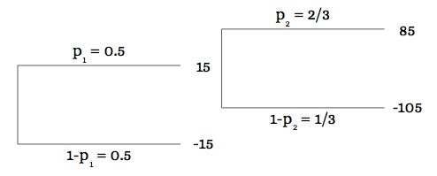
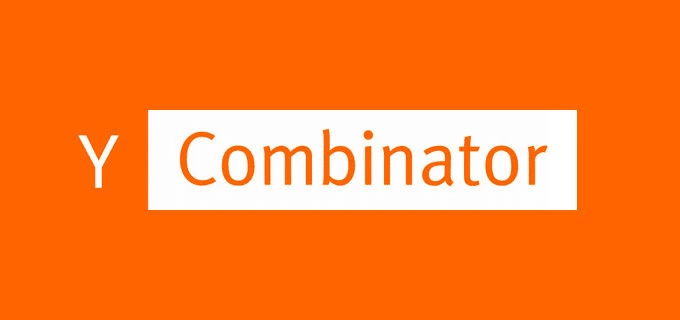

Looking to raise money and struggling to figure out your startup valuation?

Valuations are created as a negotiation between the two parties (founding team and investors) on the ratio between the investment sought and the percentage of equity that founders want (and are able) to give out. Of course, they will still be crafted that way, but this approach tries to replicate the behaviour of a tech startup and proposes practical valuation ranges.

Here’s the summary of the key points that will be approached in order to outline the model:

1. Founders and Investors’ ability to undertake certain investments or not: The Managerial Flexibility
2. Model’s adaptation to a tech startup environment
3. Application of the Real Option Model
4. Practical Spreadsheet

### The Managerial Flexibility

An opportunity gets undertaken if market trends, industry movements and startup metrics run in the desired direction; it gets discarded if the feeling about the future is not crystal clear or if it predicts unfavourable performance.

We can say that you hold “options” in your hands: options to make, or not make, certain investments.

In modern financial literature, those “options” have been assimilated to financial options. The right to undertake a real investment has been shaped as a call option while the right to sell something, as for example the opportunity to make a spinoff of a branch, has been summarised in a put option. Even the Earn-Out and Claw-Back clauses have been modelled as financial options.

However “Real Options” differ from “Financial Options”. The latter are simply traded securities. Their parameters rely on a stochastic process of the underlying price - where only the market has the capability to affect it.

Conversely “Real Options” involve the founders’ and investors’ behaviour: you have the capability to understand and learn what is happening and the ability to shape your decisions. That is the so-called “Managerial Flexibility”.

The two following diagrams explain “Managerial Flexibility”. The possibility to learn how the market reacts from the implementation of a small pivot investment. Then adjusting further actions - basing the decision on the outcome of the analysis. This “flexibility” can be seen as “room for manoeuvre”. Being within this “room for manoeuvre” means that the consequences of the further actions do not affect prior outcomes that arose before the last were implemented. In order to understand that, let me state the simplest decision tree:

Given the bigger potential loss and the two exact probabilities, the Expected Value of this business initiative is negative (-10).

Now let me move further with this more complicated tree:

Notice that the potential gain or loss is the same as in the previous figure, 100 on the upside and -120 on the downside; the Expected Value, however, changes:

What is this feature that turns a bad investment into a (potentially) good investment? Such a feature is composed of two elements. The first one involves a small investment, which allows for learning.

The negative result at this first phase is an indicator of the money-losing nature of the investment: you will probably abandon the opportunity. Founders learn from the market and consequently act, having the flexibility to increase the upside and decrease the potential downside. In the real world framework, a company decides to update knowledge and information to exploit business initiative while reducing danger. This is called adaptive behaviour.

#### The Valuation of the Managerial Flexibility

This managerial flexibility bases its nature on the “option” to do something, therefore calls and puts replicate it in the proper way.

We are in front of a problem: dynamic optimisation of the evolution of uncertainty in the value of real assets. Stochastic processes could then be implied, with the optimal policy detected through a partial differential equation - where appropriate boundary conditions reflect the initial and terminal payoff characteristics.

In most of the cases, a closed-form of mathematical solutions is not suitable for the calculation. Numerical processes, such as the Monte Carlo simulation or Variance Reduction Techniques, are implied instead. For a better understanding of a “real process”, we should discretise the stochastic models through, for example, binomial lattices. A binomial lattice is a probability tree with binary decision branches, where the underlying price (in our case the project value) can go up (by factor 𝑢) or down (by factor 𝑑).

The binomial lattices involve several paths that conduct to the same outcome, and that reduces the number of nodes in the lattice. Unfortunately, a process that involves binomial lattices could be non-intuitive, especially for more complex investment decisions that involve real assets with many simultaneous options.

The typical solution for this kind of issue involves the computation of replicating portfolios at each node; that, of course, involves the concept of complete markets - where the payoff of traded securities can replicate the behaviour of the underlying asset at different times.

##### Do you have a brilliant startup idea that you want to bring to life?

From the product and business reasoning to streamlining your MVP to the most important features, our team of product experts and ex-startup founders can help you bring your vision to life.

Let's Talk

Adaptation to a Tech Startup Valuation

Startup valuation is complicated - because in most of the cases (maybe all) the replication securities do not exist because the market is then incomplete.

The application of decision analysis seems intuitive and natural because decision trees are often used to give managerial flexibility a real value.

Smith and Nau (“Valuing risky projects: Option pricing theory and decision analysis” – 1995) studied the relationship between option pricing theory and decision analysis. They demonstrated that the two yields are the same when the model is correctly applied. Their paper enhances a model where the two approaches (option valuation and decision analysis) are integrated, but it distinguishes two different sources of risks:

- Market Risk - which can be hedged by traded securities and valued using option pricing theory.
- Private Risk - which is project-specific and could be valued with decision trees analysis.

The model proposed by [Smith & Nau](https://faculty.fuqua.duke.edu/~rnau/Valuing_Risky_Projects.pdf) is the most suitable for assessing the value of an early-stage company. It divides the sources of risks into market-driven risks and private-driven risks. However, in order to make it more suitable for a tech startup valuation, we should apply some particular changes to it.

In early-stage startups the market-driven and private-driven risks are melted together since the private-risks, such as the business model risks or the “value proposition risks”, are affected by market variables too.

Let us take the Airbnb example in order to explain the idea:

Airbnb’s value proposition is to fix the travel market accommodations’ industry. The assumptions behind are the following:

1. Hotels leave you disconnected from the City and its culture
2. Price is an important concern for customers booking travel online
3. No easy way exists to book a room with local or become a host.

From reading this, it’s easy to realize that the amount of private risk is as much as the amount of market risk. The first point is clearly a private risk because it depends directly on the company’s business model and value proposition: customers have to accept to stay in some strangers’ places.

The second is clearly linked to tradable market security: the price of accommodation is something that depends on the customers’ demand of that commodity. The third assumption is again representative of private-driven risk source.

Let’s apply the following changes to the model:

- We need to lead away from the random walk assumption. Since those changes and the nature of the asset class cannot be shaped on a normal curve. It follows that the random return is not normally distributed. We need to find a way to avoid the calculation on the standard deviation - since at this stage it is not meaningful at all. The solution for this case is given by the nature and evolution of the business. The uncertainty is embedded in the computation of the ranges of probability that affect the model.
- The unavailability of the variance leads to another problem to solve. We cannot use 𝑢 and 𝑑 in order to set the walk of the underlying. We have studied the Cost of Acquisition (CPA) and the Customer Lifetime Value (CLV) of paying users. Then the growth path is based on the ability of the Company to achieve the biggest portion of the so-called Total Addressable Market.
- Rather than adjusting the discount rate, I make an amendment to the probabilities; the discount rate is set as the risk-free rate (𝑟). The probabilities are risk-neutral probabilities. The assets are priced as if they were in a risk-neutral environment. With this new method, the problem is no longer to find the right discount rate, but to find the right risk-neutral probabilities instead; fortunately, they could be available from market data - or from the theoretical stochastic process of the project value.
- Then the cash flows are not the best proxy to use when valuing a tech start-up. Instead, the Customer Lifetime Value is more representative of what we are looking for, so the value of the Company. Multiplying the Net Customer Lifetime Value (CLV net of Cost per Acquisition) with the expected number of people representative of the addressable market, we find the right value to insert in our decision tree analysis. The key figure here is the size of the market in which we want to address our product. The value of the Company is then defined as follows:

Where TAM portion(t) represents the size of the Market that we can achieve at each time t.

r is the risk-free rate. We do not use the risk-adjusted rate because all the risks are embedded in the computation of the probabilities.

Related: [Startup Series Funding: Everything You Need To Know](https://altar.io/startup-series-funding-everything-you-need-to-know/)

Real Options Valuation Model

#### Assumptions adopted in the model:

1. YCombinator’s experience is a true proxy of global startup reality.
2. Each business, after 7 years, ends in the following scenarios:
    1. Extremely Successful (>$40 Mln Valuation)
    2. Successful (>10, <$40 Mln Valuation)
    3. Failure ($0 Valuation)
3. If a start-up does not receive funding, it will not be able to grow, and so it will fail
4. The “Global and Regional” scenarios involve the same risk-neutral probabilities
5. The Startup, before being recognised as successful, goes through two funding rounds, the “Seed” and the “Series”.

#### How the model works

In the adopted model, each node is represented with a red square or green square. The red square stands for a decision in the entrepreneur’s hands whereas the green identifies an event affected by probabilities and conditional probabilities.

The calculations under the green nodes (3a and 3b) are made up through involving the different probabilities that affect the different branches that start from such node; the value is then discounted at the risk-free rate.

The option values in these nodes have been calculated in the following way:

Where 𝑝1 represents the probability to build an “Extremely Successful” Business; 𝑝2 stands for the probability that includes all the risks affecting the founders that are in the process to build a “Successful” Business. 1 − 𝑝1 − 𝑝2 is the probability of failure.

The first branch, however, considers an event with two possible outcomes: a successful or unsuccessful funding round. In this case, the formula applied is the following:

Where 𝑝1 represents the probability to successfully carry out the investment round, whereas 𝑝2 stands for the probability of not getting funded.

The Company’s value, “regulated” by a red square node, is instead assessed taking the maximum value between the two outcomes of the two branches that were born in such node.

Moving forward, as soon as the whole picture becomes clearer, you can upload the more realistic numbers (in relation to the growth policies that founders put in place) in the model discovering what is the best strategy to grow. After this, you can decide whether or not to:

- Sell the company to the “best” acquirer
- To list it publically on a Stock Exchange
- Keep the profitable business private
- To shut down the business because the market situation suggests to stop - instead of moving further and lose much more money

.elementor-3329 .elementor-element.elementor-element-f79b780{--display:flex;--flex-direction:column;--container-widget-width:100%;--container-widget-height:initial;--container-widget-flex-grow:0;--container-widget-align-self:initial;--background-transition:0.3s;}.elementor-3329 .elementor-element.elementor-element-aa6dd2a{--display:flex;--flex-direction:column;--container-widget-width:100%;--container-widget-height:initial;--container-widget-flex-grow:0;--container-widget-align-self:initial;--gap:24px 24px;--background-transition:0.3s;--border-radius:12px 12px 12px 12px;--padding-block-start:70px;--padding-block-end:70px;--padding-inline-start:var(--safe-margin);--padding-inline-end:var(--safe-margin);}.elementor-3329 .elementor-element.elementor-element-aa6dd2a:not(.elementor-motion-effects-element-type-background), .elementor-3329 .elementor-element.elementor-element-aa6dd2a > .elementor-motion-effects-container > .elementor-motion-effects-layer{background-color:#29293E;}.elementor-3329 .elementor-element.elementor-element-aa6dd2a, .elementor-3329 .elementor-element.elementor-element-aa6dd2a::before{--border-transition:0.3s;}.elementor-3329 .elementor-element.elementor-element-95ae566{--display:flex;--flex-direction:column;--container-widget-width:100%;--container-widget-height:initial;--container-widget-flex-grow:0;--container-widget-align-self:initial;--background-transition:0.3s;}.elementor-3329 .elementor-element.elementor-element-99ebd14{text-align:center;}.elementor-3329 .elementor-element.elementor-element-99ebd14 .elementor-heading-title{color:var( --e-global-color-eb70be1 );font-family:var( --e-global-typography-0ff79ee-font-family ), sans-serif;font-size:var( --e-global-typography-0ff79ee-font-size );font-weight:var( --e-global-typography-0ff79ee-font-weight );line-height:var( --e-global-typography-0ff79ee-line-height );letter-spacing:var( --e-global-typography-0ff79ee-letter-spacing );word-spacing:var( --e-global-typography-0ff79ee-word-spacing );}.elementor-3329 .elementor-element.elementor-element-0ce57c0{text-align:center;color:var( --e-global-color-eb70be1 );font-size:20px;}.elementor-3329 .elementor-element.elementor-element-28db4d7{--display:flex;--flex-direction:row;--container-widget-width:initial;--container-widget-height:100%;--container-widget-flex-grow:1;--container-widget-align-self:stretch;--justify-content:flex-start;--background-transition:0.3s;}.elementor-3329 .elementor-element.elementor-element-70fbc6a .elementor-field-group{padding-right:calc( 24px/2 );padding-left:calc( 24px/2 );margin-bottom:32px;}.elementor-3329 .elementor-element.elementor-element-70fbc6a .elementor-form-fields-wrapper{margin-left:calc( -24px/2 );margin-right:calc( -24px/2 );margin-bottom:-32px;}.elementor-3329 .elementor-element.elementor-element-70fbc6a .elementor-field-group.recaptcha\_v3-bottomleft, .elementor-3329 .elementor-element.elementor-element-70fbc6a .elementor-field-group.recaptcha\_v3-bottomright{margin-bottom:0;}body.rtl .elementor-3329 .elementor-element.elementor-element-70fbc6a .elementor-labels-inline .elementor-field-group > label{padding-left:8px;}body:not(.rtl) .elementor-3329 .elementor-element.elementor-element-70fbc6a .elementor-labels-inline .elementor-field-group > label{padding-right:8px;}body .elementor-3329 .elementor-element.elementor-element-70fbc6a .elementor-labels-above .elementor-field-group > label{padding-bottom:8px;}.elementor-3329 .elementor-element.elementor-element-70fbc6a .elementor-field-group > label, .elementor-3329 .elementor-element.elementor-element-70fbc6a .elementor-field-subgroup label{color:var( --e-global-color-eb70be1 );}.elementor-3329 .elementor-element.elementor-element-70fbc6a .elementor-field-group > label{font-family:var( --e-global-typography-9730a4e-font-family ), sans-serif;font-size:var( --e-global-typography-9730a4e-font-size );font-weight:var( --e-global-typography-9730a4e-font-weight );line-height:var( --e-global-typography-9730a4e-line-height );letter-spacing:var( --e-global-typography-9730a4e-letter-spacing );word-spacing:var( --e-global-typography-9730a4e-word-spacing );}.elementor-3329 .elementor-element.elementor-element-70fbc6a .elementor-field-type-html{padding-bottom:0px;}.elementor-3329 .elementor-element.elementor-element-70fbc6a .elementor-field-group .elementor-field{color:var( --e-global-color-eb70be1 );}.elementor-3329 .elementor-element.elementor-element-70fbc6a .elementor-field-group .elementor-field, .elementor-3329 .elementor-element.elementor-element-70fbc6a .elementor-field-subgroup label{font-family:var( --e-global-typography-text-font-family ), sans-serif;font-size:var( --e-global-typography-text-font-size );font-weight:var( --e-global-typography-text-font-weight );line-height:var( --e-global-typography-text-line-height );}.elementor-3329 .elementor-element.elementor-element-70fbc6a .elementor-field-group:not(.elementor-field-type-upload) .elementor-field:not(.elementor-select-wrapper){background-color:#3D3D5C;border-color:#65639C;}.elementor-3329 .elementor-element.elementor-element-70fbc6a .elementor-field-group .elementor-select-wrapper select{background-color:#3D3D5C;border-color:#65639C;}.elementor-3329 .elementor-element.elementor-element-70fbc6a .elementor-field-group .elementor-select-wrapper::before{color:#65639C;}.elementor-3329 .elementor-element.elementor-element-70fbc6a .elementor-button{font-family:"Poppins", sans-serif;font-size:14px;font-weight:700;line-height:1.5;}.elementor-3329 .elementor-element.elementor-element-70fbc6a .e-form\_\_buttons\_\_wrapper\_\_button-next{background-color:var( --e-global-color-1e4bfa7 );color:var( --e-global-color-eb70be1 );}.elementor-3329 .elementor-element.elementor-element-70fbc6a .elementor-button\[type="submit"\]{background-color:var( --e-global-color-1e4bfa7 );color:var( --e-global-color-eb70be1 );}.elementor-3329 .elementor-element.elementor-element-70fbc6a .elementor-button\[type="submit"\] svg \*{fill:var( --e-global-color-eb70be1 );}.elementor-3329 .elementor-element.elementor-element-70fbc6a .e-form\_\_buttons\_\_wrapper\_\_button-previous{color:var( --e-global-color-eb70be1 );}.elementor-3329 .elementor-element.elementor-element-70fbc6a .e-form\_\_buttons\_\_wrapper\_\_button-next:hover{color:#ffffff;}.elementor-3329 .elementor-element.elementor-element-70fbc6a .elementor-button\[type="submit"\]:hover{color:#ffffff;}.elementor-3329 .elementor-element.elementor-element-70fbc6a .elementor-button\[type="submit"\]:hover svg \*{fill:#ffffff;}.elementor-3329 .elementor-element.elementor-element-70fbc6a .e-form\_\_buttons\_\_wrapper\_\_button-previous:hover{color:#ffffff;}.elementor-3329 .elementor-element.elementor-element-70fbc6a .elementor-message{font-family:var( --e-global-typography-9730a4e-font-family ), sans-serif;font-size:var( --e-global-typography-9730a4e-font-size );font-weight:var( --e-global-typography-9730a4e-font-weight );line-height:var( --e-global-typography-9730a4e-line-height );letter-spacing:var( --e-global-typography-9730a4e-letter-spacing );word-spacing:var( --e-global-typography-9730a4e-word-spacing );}.elementor-3329 .elementor-element.elementor-element-70fbc6a .elementor-message.elementor-message-success{color:var( --e-global-color-40f63f7 );}.elementor-3329 .elementor-element.elementor-element-70fbc6a .elementor-message.elementor-message-danger{color:var( --e-global-color-8ddb30f );}.elementor-3329 .elementor-element.elementor-element-70fbc6a .elementor-message.elementor-help-inline{color:var( --e-global-color-9acb2f2 );}.elementor-3329 .elementor-element.elementor-element-70fbc6a{--e-form-steps-indicators-spacing:20px;--e-form-steps-indicator-padding:30px;--e-form-steps-indicator-inactive-secondary-color:#ffffff;--e-form-steps-indicator-active-secondary-color:#ffffff;--e-form-steps-indicator-completed-secondary-color:#ffffff;--e-form-steps-divider-width:1px;--e-form-steps-divider-gap:10px;width:100%;max-width:100%;}.elementor-3329 .elementor-element.elementor-element-70fbc6a > .elementor-widget-container{padding:10px 0px 0px 0px;}@media(min-width:768px){.elementor-3329 .elementor-element.elementor-element-aa6dd2a{--content-width:var(--container-md);}}@media(max-width:1024px){.elementor-3329 .elementor-element.elementor-element-99ebd14 .elementor-heading-title{font-size:var( --e-global-typography-0ff79ee-font-size );line-height:var( --e-global-typography-0ff79ee-line-height );letter-spacing:var( --e-global-typography-0ff79ee-letter-spacing );word-spacing:var( --e-global-typography-0ff79ee-word-spacing );}.elementor-3329 .elementor-element.elementor-element-70fbc6a .elementor-field-group > label{font-size:var( --e-global-typography-9730a4e-font-size );line-height:var( --e-global-typography-9730a4e-line-height );letter-spacing:var( --e-global-typography-9730a4e-letter-spacing );word-spacing:var( --e-global-typography-9730a4e-word-spacing );}.elementor-3329 .elementor-element.elementor-element-70fbc6a .elementor-field-group .elementor-field, .elementor-3329 .elementor-element.elementor-element-70fbc6a .elementor-field-subgroup label{font-size:var( --e-global-typography-text-font-size );line-height:var( --e-global-typography-text-line-height );}.elementor-3329 .elementor-element.elementor-element-70fbc6a .elementor-message{font-size:var( --e-global-typography-9730a4e-font-size );line-height:var( --e-global-typography-9730a4e-line-height );letter-spacing:var( --e-global-typography-9730a4e-letter-spacing );word-spacing:var( --e-global-typography-9730a4e-word-spacing );}}@media(max-width:767px){.elementor-3329 .elementor-element.elementor-element-99ebd14 .elementor-heading-title{font-size:var( --e-global-typography-0ff79ee-font-size );line-height:var( --e-global-typography-0ff79ee-line-height );letter-spacing:var( --e-global-typography-0ff79ee-letter-spacing );word-spacing:var( --e-global-typography-0ff79ee-word-spacing );}.elementor-3329 .elementor-element.elementor-element-70fbc6a .elementor-field-group > label{font-size:var( --e-global-typography-9730a4e-font-size );line-height:var( --e-global-typography-9730a4e-line-height );letter-spacing:var( --e-global-typography-9730a4e-letter-spacing );word-spacing:var( --e-global-typography-9730a4e-word-spacing );}.elementor-3329 .elementor-element.elementor-element-70fbc6a .elementor-field-group .elementor-field, .elementor-3329 .elementor-element.elementor-element-70fbc6a .elementor-field-subgroup label{font-size:var( --e-global-typography-text-font-size );line-height:var( --e-global-typography-text-line-height );}.elementor-3329 .elementor-element.elementor-element-70fbc6a .elementor-message{font-size:var( --e-global-typography-9730a4e-font-size );line-height:var( --e-global-typography-9730a4e-line-height );letter-spacing:var( --e-global-typography-9730a4e-letter-spacing );word-spacing:var( --e-global-typography-9730a4e-word-spacing );}}/\* Start custom CSS for form, class: .elementor-element-70fbc6a \*/.elementor-3329 .elementor-element.elementor-element-70fbc6a input {  border-color: #65639C !important;  }  .elementor-3329 .elementor-element.elementor-element-70fbc6a input:is(:focus, :hover) {  border-color: #B9B8CE !important;  }/\* End custom CSS \*/

##### Sign up for our newsletter

Join hundreds of entrepreneurs and business leaders to receive fresh, actionable tech and startup related insights and tips

/\*! elementor-pro - v3.19.0 - 07-02-2024 \*/  .elementor-button.elementor-hidden,.elementor-hidden{display:none}.e-form\_\_step{width:100%}.e-form\_\_step:not(.elementor-hidden){display:flex;flex-wrap:wrap}.e-form\_\_buttons{flex-wrap:wrap}.e-form\_\_buttons,.e-form\_\_buttons\_\_wrapper{display:flex}.e-form\_\_indicators{display:flex;justify-content:space-between;align-items:center;flex-wrap:nowrap;font-size:13px;margin-bottom:var(--e-form-steps-indicators-spacing)}.e-form\_\_indicators\_\_indicator{display:flex;flex-direction:column;align-items:center;justify-content:center;flex-basis:0;padding:0 var(--e-form-steps-divider-gap)}.e-form\_\_indicators\_\_indicator\_\_progress{width:100%;position:relative;background-color:var(--e-form-steps-indicator-progress-background-color);border-radius:var(--e-form-steps-indicator-progress-border-radius);overflow:hidden}.e-form\_\_indicators\_\_indicator\_\_progress\_\_meter{width:var(--e-form-steps-indicator-progress-meter-width,0);height:var(--e-form-steps-indicator-progress-height);line-height:var(--e-form-steps-indicator-progress-height);padding-right:15px;border-radius:var(--e-form-steps-indicator-progress-border-radius);background-color:var(--e-form-steps-indicator-progress-color);color:var(--e-form-steps-indicator-progress-meter-color);text-align:right;transition:width .1s linear}.e-form\_\_indicators\_\_indicator:first-child{padding-left:0}.e-form\_\_indicators\_\_indicator:last-child{padding-right:0}.e-form\_\_indicators\_\_indicator--state-inactive{color:var(--e-form-steps-indicator-inactive-primary-color,#c2cbd2)}.e-form\_\_indicators\_\_indicator--state-inactive \[class\*=indicator--shape-\]:not(.e-form\_\_indicators\_\_indicator--shape-none){background-color:var(--e-form-steps-indicator-inactive-secondary-color,#fff)}.e-form\_\_indicators\_\_indicator--state-inactive object,.e-form\_\_indicators\_\_indicator--state-inactive svg{fill:var(--e-form-steps-indicator-inactive-primary-color,#c2cbd2)}.e-form\_\_indicators\_\_indicator--state-active{color:var(--e-form-steps-indicator-active-primary-color,#39b54a);border-color:var(--e-form-steps-indicator-active-secondary-color,#fff)}.e-form\_\_indicators\_\_indicator--state-active \[class\*=indicator--shape-\]:not(.e-form\_\_indicators\_\_indicator--shape-none){background-color:var(--e-form-steps-indicator-active-secondary-color,#fff)}.e-form\_\_indicators\_\_indicator--state-active object,.e-form\_\_indicators\_\_indicator--state-active svg{fill:var(--e-form-steps-indicator-active-primary-color,#39b54a)}.e-form\_\_indicators\_\_indicator--state-completed{color:var(--e-form-steps-indicator-completed-secondary-color,#fff)}.e-form\_\_indicators\_\_indicator--state-completed \[class\*=indicator--shape-\]:not(.e-form\_\_indicators\_\_indicator--shape-none){background-color:var(--e-form-steps-indicator-completed-primary-color,#39b54a)}.e-form\_\_indicators\_\_indicator--state-completed .e-form\_\_indicators\_\_indicator\_\_label{color:var(--e-form-steps-indicator-completed-primary-color,#39b54a)}.e-form\_\_indicators\_\_indicator--state-completed .e-form\_\_indicators\_\_indicator--shape-none{color:var(--e-form-steps-indicator-completed-primary-color,#39b54a);background-color:initial}.e-form\_\_indicators\_\_indicator--state-completed object,.e-form\_\_indicators\_\_indicator--state-completed svg{fill:var(--e-form-steps-indicator-completed-secondary-color,#fff)}.e-form\_\_indicators\_\_indicator\_\_icon{width:var(--e-form-steps-indicator-padding,30px);height:var(--e-form-steps-indicator-padding,30px);font-size:var(--e-form-steps-indicator-icon-size);border-width:1px;border-style:solid;display:flex;justify-content:center;align-items:center;overflow:hidden;margin-bottom:10px}.e-form\_\_indicators\_\_indicator\_\_icon img,.e-form\_\_indicators\_\_indicator\_\_icon object,.e-form\_\_indicators\_\_indicator\_\_icon svg{width:var(--e-form-steps-indicator-icon-size);height:auto}.e-form\_\_indicators\_\_indicator\_\_icon .e-font-icon-svg{height:1em}.e-form\_\_indicators\_\_indicator\_\_number{width:var(--e-form-steps-indicator-padding,30px);height:var(--e-form-steps-indicator-padding,30px);border-width:1px;border-style:solid;display:flex;justify-content:center;align-items:center;margin-bottom:10px}.e-form\_\_indicators\_\_indicator--shape-circle{border-radius:50%}.e-form\_\_indicators\_\_indicator--shape-square{border-radius:0}.e-form\_\_indicators\_\_indicator--shape-rounded{border-radius:5px}.e-form\_\_indicators\_\_indicator--shape-none{border:0}.e-form\_\_indicators\_\_indicator\_\_label{text-align:center}.e-form\_\_indicators\_\_indicator\_\_separator{width:100%;height:var(--e-form-steps-divider-width);background-color:#babfc5}.e-form\_\_indicators--type-icon,.e-form\_\_indicators--type-icon\_text,.e-form\_\_indicators--type-number,.e-form\_\_indicators--type-number\_text{align-items:flex-start}.e-form\_\_indicators--type-icon .e-form\_\_indicators\_\_indicator\_\_separator,.e-form\_\_indicators--type-icon\_text .e-form\_\_indicators\_\_indicator\_\_separator,.e-form\_\_indicators--type-number .e-form\_\_indicators\_\_indicator\_\_separator,.e-form\_\_indicators--type-number\_text .e-form\_\_indicators\_\_indicator\_\_separator{margin-top:calc(var(--e-form-steps-indicator-padding, 30px) / 2 - var(--e-form-steps-divider-width, 1px) / 2)}.elementor-field-type-hidden{display:none}.elementor-field-type-html{display:inline-block}.elementor-field-type-tel input{direction:inherit}.elementor-login .elementor-lost-password,.elementor-login .elementor-remember-me{font-size:.85em}.elementor-field-type-recaptcha\_v3 .elementor-field-label{display:none}.elementor-field-type-recaptcha\_v3 .grecaptcha-badge{z-index:1}.elementor-button .elementor-form-spinner{order:3}.elementor-form .elementor-button>span{display:flex;justify-content:center;align-items:center}.elementor-form .elementor-button .elementor-button-text{white-space:normal;flex-grow:0}.elementor-form .elementor-button svg{height:auto}.elementor-form .elementor-button .e-font-icon-svg{height:1em}.elementor-select-wrapper .select-caret-down-wrapper{position:absolute;top:50%;transform:translateY(-50%);inset-inline-end:10px;pointer-events:none;font-size:11px}.elementor-select-wrapper .select-caret-down-wrapper svg{display:unset;width:1em;aspect-ratio:unset;fill:currentColor}.elementor-select-wrapper .select-caret-down-wrapper i{font-size:19px;line-height:2}.elementor-select-wrapper.remove-before:before{content:""!important}

   Full Name  Buisness Email  Subscribe

Probability Assessment

As of [May 28th 2013](http://www.businessinsider.com/startup-odds-of-success-2013-5?IR=T), YCombinator had incubated 511 start-ups. Since it has an acceptance rate of 3–5% (companies that are chosen are given 120k USD in exchange for 7% of equity) we can say that the range of probabilities (0.03, 0.05) is also the success rate of the first fundraising campaign.

Therefore in the up-side branch of the event, there will be a set of \[0.03, 0.05\]. Taking the complementary, the probability of failing at this point is \[0.95, 0.97\].

Let me now highlight the probability assessment for each of the scenarios:

1st Scenario: Extremely Successful

In its experience, YCombinator has incubated 37 start-ups that achieved at least $40 Mln Valuation. The probability of being in this branch is then defined by the upper and the lower bounds involving the range 3%-5% as acceptance rate.

Upper and lower bounds:

- 5% acceptance rate generates a set of 10,220 start-ups (511/0.05). The probability of success is then: 37/10,220 = 0.0036
- 3% acceptance rate generates a set of 17,033 start-ups (511/0.03). The probability of success is then: 37/17,033 = 0.0022

We know that the whole probability of this cluster lies in the range \[0.0022, 0.0036\]. Since the probability of fundraising is included in the range \[0.03, 0.05\], the probability to be Extremely Successful, provided that the company has properly raised money, is defined by the following equations (in order to establish the upper and lower bounds):

0.03 x Upper Bound (Extremely Successful) = 0.0036 → Upper Bound (Extremely Successful) = 0.120

0.05 x Lower Bound (Extremely Successful) = 0.0022 → Lower Bound (Extremely Successful) = 0.044

𝑃\[Extremely Successful\] ∈ \[0.044, 0.12\]

The assumption is that if a startup does not receive any funding it will not be able to grow, and so it will fail. This leads to the computation of the conditional probabilities in a similar way as if the two probabilities (getting funded and being scalable and profitable) were independent. In fact, they are not, of course.

2nd Scenario: Successful

YCombinator has experienced 26 companies that achieved a valuation in the range of £\[10 – 40\] Mln. Remember that the 3% acceptance rate generates a set of 17,033 startups, while the 5% gives us 10,220 start-ups. The rate of success for this cluster is included between 0.0015 and 0.0025.

The computation of the conditional probabilities relies on the following equations:

0.03 x Upper Bound (Successful) = 0.0025 → Upper Bound (Successful) = 0.083

0.05 x Lower Bound (Successful) = 0.0015 → Lower Bound (Successful) = 0.030

𝑃\[Successful\] ∈ \[0.030, 0.083\]

3rd Scenario: The probability of failure at this time is defined by the complementary set of the other two scenarios.

Upper Bound (Failure) = 1 - (Lower Bound (Extremely Successful) - (Lower Bound (Successful) = 0.9260

Lower Bound (Failure) = 1 - (Upper Bound (Extremely Successful) - (Upper Bound (Successful) = 0.7997

𝑃 \[Failure\] ∈ \[0.7967, 0.9260\]

#### Practical Application

The derivative implied in a high-tech startup valuation depends on the nature of the analysis. Here below a brief example about the nature of the derivatives implied in the analysis: if the outcome of the model is addressed to the founders, then the choice of being acquired by someone will be priced as a Short Call. The Acquirer will probably say: “if within one year you demonstrate to double the sales and to set the retention rate to 75% I will buy you out for $x million”. Accepting the agreement, founders give the Acquirer the right to buy the underlying at a future date; they have just sold a call.

The payoff in their hands will be equal to -(S-K) where S represents the future value of the company and K stands for the price that will be paid by the Acquirer to purchase the Company.

On the other hand, if the outcome of the model is addressed to investors, the choice to acquire a company, or to buy some shares, is seen as a Long Call. Here the payoff is represented by the difference between the valuation of the company and the Strike price is set equal to the stake of equity that founders want to maintain at the fundraising event.

I crafted the pricing as if it was towards investors. The fundraising events are represented as Long Call Options, whose payoffs are max(S-K; 0).

Within Options to Expand, K is the stake that founders want to maintain for raising the money needed in order to expand the business. This K is set as a percentage at the fundraising dates. Being a percentage, the Strike Price of the Call Option is different in any branches and at each time.

The Option to Abandon is instead represented by a call option on Equity worth zero; the Strike Price is zero as well, and the payoff cannot be different.

The values, explanatory of the three Options payoffs, now get discounted at the risk-free rate and multiplied with the respective probability.

### Practical Spreadsheet

You can access the spreadsheet through this [link](https://docs.google.com/spreadsheets/d/1iIXHCO-jEbyQf2kT_swNlHWLcO8jD3NC2aPqEhcRkKo/edit#gid=0).

Node 1: the founder decides to run the Seed Round. If the market (pool of investors) approves his project, the fundraising will go well and the startup continues its life. In the opposite case, the investors will not back the company and so it fails.

Node 2: this is a node where the founder has the ability to decide where to put his focus: does he choose to grab a global opportunity or will he be focused to fix a regional issue?

Nodes 3a/3b: the founder runs the Series Round. Here three scenarios open in front of him. The “market” is extremely bullish over the venture and so the project will be pushed through an “extremely successful path”; in this case, a so-called “Option to expand” is embraced. In the second scenario, investors are fairly bullish over the startup and the venture will be canalised through a “successful” path; again, the “Option to expand” is preferred. In the third scenario the founder is not able to complete the round and so the startup fails (accordingly to the assumption); we say that an “Option to abandon” has been exercised.

Nodes 4-a-a / 4-a-b / 4-b-a / 4-b-b: the managerial flexibility gets represented again. Both in the “extremely successful” and “successful” cases, the founder has the option to decide what’s best for the company: an acquisition? An IPO? Or maintaining the profitable business privately?

Endpoints (5): the Company’s Value in each scenario that will be individually assessed by the founder (realistically speaking the Board).

#### Practical tips to use the spreadsheet

Fill the endpoints (5) with the values assessed through the formula NCLV \* TAM portion after 7 years (with different scenarios involved, Global vs. Regional, Ipo vs. Acquisition vs. Private Company’s value).

Also fill the cells B1 – B2 – B3 with the risk-free rate, % of equity that founders plan to sell at Seed Round, % of equity that founders plan to sell at Series Round.

The model, assessing the probabilities, will automatically calculate the investment sought levels that you should be entitled to receive at each round and the post-money valuations as well.

#### Downsides of the model

1. The main downside of the model: it relies on the fact that the input data came from the business plan - and founders can manipulate those values in the way they prefer
2. The model implies only two financing rounds, whereas a startups story is way more complicated
3. The model proposes a generalisation of market and specific risk without studying the granular risks of different industries/business models

In this highly volatile environment, predicting the future is hardly possible even for the major experts: the high rate of well-funded startups’ failure is proof.

But the startup world is fascinating, exciting and probably, something that cannot be too predictable: who would have thought that we would ever have a [car orbiting the earth](https://www.vox.com/science-and-health/2018/2/6/16981856/space-x-tesla-falcon-heavy-live-stream-mars) from space?
