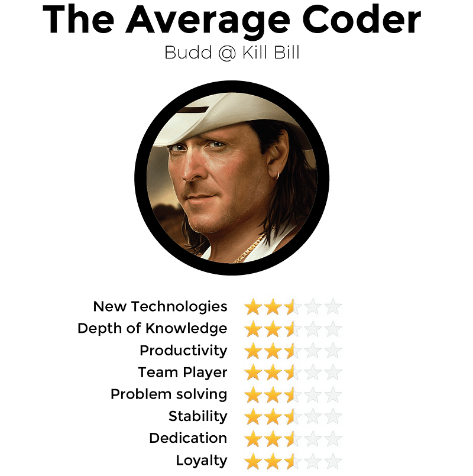
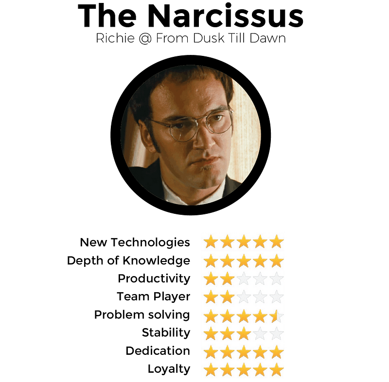
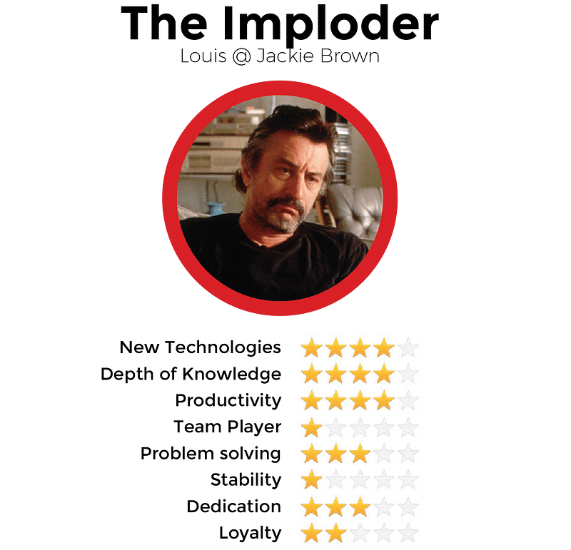
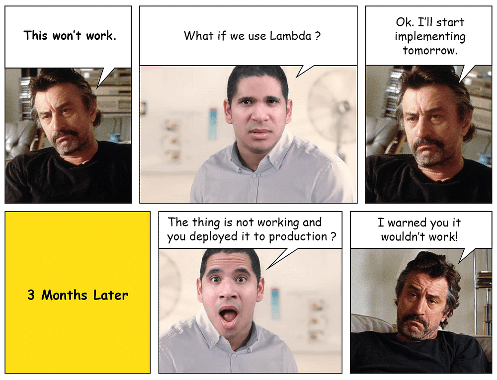

I’ve met many types of developers throughout the years building different products with [Altar.io](https://altar.io/). The one important lesson I’ve learnt along the way is:

/\* widget: Blog: Simple Quote \*/  /\* reset -------------------- \*/  .blog-custom-block \*,  .blog-custom-block ::before,  .blog-custom-block ::after {  box-sizing: border-box;  border-width: 0;  border-style: solid;  border-color: #e5e7eb;  }  /\* vars -------------------- \*/  .blog-custom-block.blog-custom-block\_\_simple-quote {  --color-accent: #0FA4EA;  --color-bg: #F4FAFE;  --color-text-2: #4A4A68;  }  /\* colors -------------------- \*/  .blog-custom-block.blog-custom-block\_\_simple-quote .bg-clr-bg {  background-color: var(--color-bg);  }  .blog-custom-block.blog-custom-block\_\_simple-quote .border-clr-accent {  border-color: var(--color-accent);  }  .blog-custom-block.blog-custom-block\_\_simple-quote .text-clr-text-2 {  color: var(--color-text-2);  }  /\* utils -------------------- \*/  .blog-custom-block.blog-custom-block\_\_simple-quote .flex {  display: flex;  }  .blog-custom-block.blog-custom-block\_\_simple-quote .flex-shrink-0 {  flex-shrink: 0;  }  .blog-custom-block.blog-custom-block\_\_simple-quote .flex-col {  flex-direction: column;  }  .blog-custom-block.blog-custom-block\_\_simple-quote .gap-4 {  gap: 1rem;  }  .blog-custom-block.blog-custom-block\_\_simple-quote .rounded-xl {  border-radius: 0.75rem;  }  .blog-custom-block.blog-custom-block\_\_simple-quote .border-l-6 {  border-left-width: 6px;  }  .blog-custom-block.blog-custom-block\_\_simple-quote .p-8 {  padding: 2rem;  }  .blog-custom-block.blog-custom-block\_\_simple-quote .text-xl {  font-size: 1.25rem;  line-height: 1.75rem;  }  .blog-custom-block.blog-custom-block\_\_simple-quote .italic {  font-style: italic;  } 

> **Don’t look for the perfect developers, look for a balanced team.**

That’s our sweet spot for one reason: there is no such thing as perfection and building a good product is never a one-man-show.

Creating and keeping a balanced dev team is a very challenging art. This is due to these two characteristics of developers:

1. Generally speaking, they are not the most skilled communicators
2. They tend to be fiercely competitive, especially when it comes to tests of intellect.

Related: [Steps to Select The Right Technical Partner To Help You Build a Startup](https://altar.io/finding-the-right-tech-partner-for-your-startup/)

.elementor-12941 .elementor-element.elementor-element-e56f4e6{--display:flex;--flex-direction:column;--container-widget-width:100%;--container-widget-height:initial;--container-widget-flex-grow:0;--container-widget-align-self:initial;--background-transition:0.3s;}.elementor-12941 .elementor-element.elementor-element-f8d1905{--box-background-color:var( --e-global-color-f6f9b04 );--box-border-color:var( --e-global-color-secondary );--box-border-width:1px;--box-border-radius:12px;--box-padding:12px;--header-color:var( --e-global-color-text );--separator-width:0px;--item-text-decoration:underline;--item-text-hover-decoration:underline;--marker-color:var( --e-global-color-primary );--marker-size:5px;}.elementor-12941 .elementor-element.elementor-element-f8d1905 .elementor-toc\_\_spinner{color:var( --e-global-color-secondary );fill:var( --e-global-color-secondary );}.elementor-12941 .elementor-element.elementor-element-f8d1905 .elementor-toc\_\_header, .elementor-12941 .elementor-element.elementor-element-f8d1905 .elementor-toc\_\_header-title{font-family:"Poppins", sans-serif;font-size:2.25rem;font-weight:700;text-transform:capitalize;line-height:1.2;}.elementor-12941 .elementor-element.elementor-element-f8d1905 .elementor-toc\_\_list-item{font-family:var( --e-global-typography-45f602c-font-family ), sans-serif;font-size:var( --e-global-typography-45f602c-font-size );font-weight:var( --e-global-typography-45f602c-font-weight );line-height:var( --e-global-typography-45f602c-line-height );letter-spacing:var( --e-global-typography-45f602c-letter-spacing );word-spacing:var( --e-global-typography-45f602c-word-spacing );}.elementor-12941 .elementor-element.elementor-element-f8d1905 > .elementor-widget-container{padding:32px 32px 32px 32px;}@media(max-width:1024px){.elementor-12941 .elementor-element.elementor-element-f8d1905 .elementor-toc\_\_list-item{font-size:var( --e-global-typography-45f602c-font-size );line-height:var( --e-global-typography-45f602c-line-height );letter-spacing:var( --e-global-typography-45f602c-letter-spacing );word-spacing:var( --e-global-typography-45f602c-word-spacing );}}@media(max-width:767px){.elementor-12941 .elementor-element.elementor-element-f8d1905 .elementor-toc\_\_list-item{font-size:var( --e-global-typography-45f602c-font-size );line-height:var( --e-global-typography-45f602c-line-height );letter-spacing:var( --e-global-typography-45f602c-letter-spacing );word-spacing:var( --e-global-typography-45f602c-word-spacing );}} /\*! elementor-pro - v3.19.0 - 07-02-2024 \*/  .elementor-widget-table-of-contents .elementor-toc\_\_header-title{color:var(--header-color)}.elementor-widget-table-of-contents.elementor-toc--collapsed .elementor-toc\_\_toggle-button--collapse,.elementor-widget-table-of-contents:not(.elementor-toc--collapsed) .elementor-toc\_\_toggle-button--expand{display:none}.elementor-widget-table-of-contents .elementor-widget-container{min-height:var(--box-min-height);border:var(--box-border-width,1px) solid var(--box-border-color,#9da5ae);border-radius:var(--box-border-radius,3px);background-color:var(--box-background-color);transition:min-height .4s;overflow:hidden}.elementor-toc\_\_header{display:flex;align-items:center;justify-content:space-between;padding:var(--box-padding,20px);background-color:var(--header-background-color);border-bottom:var(--separator-width,1px) solid var(--box-border-color,#9da5ae)}.elementor-toc\_\_header-title{font-size:18px;margin:0;color:var(--header-color)}.elementor-toc\_\_toggle-button{cursor:pointer;display:inline-flex}.elementor-toc\_\_toggle-button i{color:var(--toggle-button-color)}.elementor-toc\_\_toggle-button svg{height:1em;width:1em;fill:var(--toggle-button-color)}.elementor-toc\_\_spinner-container{text-align:center}.elementor-toc\_\_spinner{font-size:2em}.elementor-toc\_\_spinner.e-font-icon-svg{height:1em;width:1em}.elementor-toc\_\_body{padding:var(--box-padding,20px);max-height:var(--toc-body-max-height);overflow-y:auto}.elementor-toc\_\_body::-webkit-scrollbar{width:7px}.elementor-toc\_\_body::-webkit-scrollbar-thumb{background-color:#babfc5;border-radius:10px}.elementor-toc\_\_list-wrapper{list-style:none;padding:0}.elementor-toc\_\_list-item{margin-bottom:.5em}.elementor-toc\_\_list-item.elementor-item-active{font-weight:700}.elementor-toc\_\_list-item .elementor-toc\_\_list-wrapper{margin-top:.5em;margin-left:var(--nested-list-indent,1em)}.elementor-toc\_\_list-item-text:hover{color:var(--item-text-hover-color);-webkit-text-decoration:var(--item-text-hover-decoration);text-decoration:var(--item-text-hover-decoration)}.elementor-toc\_\_list-item-text.elementor-item-active{color:var(--item-text-active-color);-webkit-text-decoration:var(--item-text-active-decoration);text-decoration:var(--item-text-active-decoration)}.elementor-toc\_\_list-item-text-wrapper{display:flex;align-items:center}.elementor-toc\_\_list-item-text-wrapper:before,.elementor-toc\_\_list-item-text-wrapper i{margin-right:8px;color:var(--marker-color)}.elementor-toc\_\_list-item-text-wrapper svg{margin-right:8px;fill:var(--marker-color);height:var(--marker-size,.5em);width:var(--marker-size,.5em)}.elementor-toc\_\_list-item-text-wrapper i{font-size:var(--marker-size,.5em)}.elementor-toc\_\_list-item-text-wrapper:before{font-size:var(--marker-size,1em)}.elementor-toc--content-ellipsis .elementor-toc\_\_list-item-text{white-space:nowrap;overflow:hidden;text-overflow:ellipsis}.elementor-toc\_\_list-items--collapsible>.elementor-toc\_\_list-wrapper>.elementor-toc\_\_list-item>.elementor-toc\_\_list-wrapper{display:none}.elementor-toc\_\_heading-anchor{position:absolute}.elementor-toc\_\_body .elementor-toc\_\_list-item-text{color:var(--item-text-color);-webkit-text-decoration:var(--item-text-decoration);text-decoration:var(--item-text-decoration)}.elementor-toc\_\_body .elementor-toc\_\_list-item-text:hover{color:var(--item-text-hover-color);-webkit-text-decoration:var(--item-text-hover-decoration);text-decoration:var(--item-text-hover-decoration)}.elementor-toc\_\_body .elementor-toc\_\_list-item-text.elementor-item-active{color:var(--item-text-active-color);-webkit-text-decoration:var(--item-text-active-decoration);text-decoration:var(--item-text-active-decoration)}ol.elementor-toc\_\_list-wrapper{counter-reset:item}ol.elementor-toc\_\_list-wrapper .elementor-toc\_\_list-item{counter-increment:item}ol.elementor-toc\_\_list-wrapper .elementor-toc\_\_list-item-text-wrapper:before{content:counters(item,".") ". "}

#### Contents

## The Average Coder

The Average Coder is perhaps the most common type of developer. He might sell himself in different ways, but he tends to be average in everything he does – with the exception of gaming. He has average standards and mediocre ambition, he wants a predictable workflow in his backlog to deliver it quietly and he’s not very keen on bug fixing because, in his point of view, that means moving back in his backlog.

#### Comic Situation:

Should you hire this developer? Being the most common archetype, the Average Coder is the easiest to get in the market. Eventually, you’ll be hiring some Average Coders in your team. It’s important, however, that they don’t come aboard until your developer team is at least 20-strong.

Warning if you consider hiring one: [Small teams need commitment](https://hbr.org/1993/03/the-discipline-of-teams-2). This person will never question your decisions or suggestions, which means they are not committed.

Related: [What The Non-Technical Entrepreneur Needs To Know About Tech](https://altar.io/what-the-non-technical-entrepreneur-needs-to-know-about-tech/)

## The Wolf

The Wolf is a dream developer, totally unbalanced and eternally optimistic. You will try to include him in all projects because he’s hyper-productive, codes very quickly and will never deliver less than solid code.

He makes great architecture decisions. He is always aware of the best practices and new technologies. Not only that he also already tried and benchmarked different architectural decisions - before he presents the solution to be adopted.

He is a good team player, talks when necessary and understands and respects business and product decisions. Is he/she a problem solver? Well, you’ll never be worried when one is around because things will be solved. These types of developers also have the rare ability to read your mind and predict your needs, which is kind of weird but indeed handy.

#### Comic Situation:

Should you hire The Wolf? Positively! You should find all the Wolves in town but sadly there aren’t many. Unlike 80% of developers, The Wolf understands business and product priorities - even if they don’t meet his dream roadmap. He’ll try to help as much as possible to get the team together to achieve your goals. Only 1 developer out of 1000 is probably a Wolf. We have a good eye for Wolves, so we proudly have more than a few working at [Altar.io](https://altar.io/).

Warning if you consider hiring one: Wolves are ambitious and constant learners, so their stability and loyalty will quickly disappear if they’re not feeling stimulated with projects or by their peers. They also tend to be optimistic in their judgement of projects and have difficulty saying ‘no’ – so sometimes they’ll accept work and timelines that are nearly impossible to achieve.

 

##### Sign up for our newsletter

Join hundreds of entrepreneurs and business leaders to receive fresh, actionable tech and startup related insights and tips

## The Narcissus

This type of developer is very similar to The Wolf. However, he comes with significant differences that have a tremendous impact – possession of a much bigger ego and poorer communication and team skills.

While most developers are highly competitive, the Narcissus takes it to a higher level. He wants to be recognized as a genius to the point that he often falls in his own trap: he tends to over-engineer simple things to create the “perfect systems” and refuses to compromise. He always refactors code to be fully irrepressible even if this takes 1000% of the expected time and even if it is not exactly what you wanted.

In a nutshell, he goes with Maximus motto: “What we do in life, echoes in eternity!” The best way to manage a Narcissus is to present them with a very specific challenge and discuss the solution in detail. Just like the Wolf, they’ll find the best solution, within budget and in a very reasonable timeframe. He is a nice chap and tends to be smooth with his fellow developers - although he often recreates their code to openly display who’s in charge.

#### Comic Situation:

Should you hire this developer? You should only have one in your team – but you’ll need someone strong enough to keep them in check. But remember he doesn’t like to be controlled because he feels overshadowed.

Warning if you consider hiring one: If you give him big challenges and let him decide alone he will over-engineer as much as he can, because he wants to appear as the one-man-maestro that architectured and executed a masterpiece alone.

## The Idealist

Mickey is an Idealist, he only thinks about solutions in a quintessential form and has a very limited capability to compromise.

He proposes to adopt a new framework/architecture because the project will be more modular and scalable.

He wants to migrate the whole system to this new standard. He will disrespect the fact that it doesn’t have a meaningful community yet. He also won't care that his peers will not know how to work with it.

Discussions about budget and timings will be rebuffed with arguments about how vital it is that their preference is chosen – and that you’d understand why “if you had vision”.

His motto is:

/\* widget: Blog: Simple Quote \*/  /\* reset -------------------- \*/  .blog-custom-block \*,  .blog-custom-block ::before,  .blog-custom-block ::after {  box-sizing: border-box;  border-width: 0;  border-style: solid;  border-color: #e5e7eb;  }  /\* vars -------------------- \*/  .blog-custom-block.blog-custom-block\_\_simple-quote {  --color-accent: #0FA4EA;  --color-bg: #F4FAFE;  --color-text-2: #4A4A68;  }  /\* colors -------------------- \*/  .blog-custom-block.blog-custom-block\_\_simple-quote .bg-clr-bg {  background-color: var(--color-bg);  }  .blog-custom-block.blog-custom-block\_\_simple-quote .border-clr-accent {  border-color: var(--color-accent);  }  .blog-custom-block.blog-custom-block\_\_simple-quote .text-clr-text-2 {  color: var(--color-text-2);  }  /\* utils -------------------- \*/  .blog-custom-block.blog-custom-block\_\_simple-quote .flex {  display: flex;  }  .blog-custom-block.blog-custom-block\_\_simple-quote .flex-shrink-0 {  flex-shrink: 0;  }  .blog-custom-block.blog-custom-block\_\_simple-quote .flex-col {  flex-direction: column;  }  .blog-custom-block.blog-custom-block\_\_simple-quote .gap-4 {  gap: 1rem;  }  .blog-custom-block.blog-custom-block\_\_simple-quote .rounded-xl {  border-radius: 0.75rem;  }  .blog-custom-block.blog-custom-block\_\_simple-quote .border-l-6 {  border-left-width: 6px;  }  .blog-custom-block.blog-custom-block\_\_simple-quote .p-8 {  padding: 2rem;  }  .blog-custom-block.blog-custom-block\_\_simple-quote .text-xl {  font-size: 1.25rem;  line-height: 1.75rem;  }  .blog-custom-block.blog-custom-block\_\_simple-quote .italic {  font-style: italic;  } 

> Discard any language/framework that is > 3 months OR has a community > 300 developers OR > 3 developers in your team heard of it

#### Comic Situation:

Should you hire this developer? These types of developers are always [on top of the latest trends](https://www.forbes.com/sites/quora/2018/03/01/how-to-keep-up-to-date-as-a-software-developer/#1e4eb4776017). They know all the new features of the new versions of all bleeding-edge frameworks. Like the Narcissus, you should only have one of these in a bigger team.

With the correct structure around them, they might make a difference, finding the best architectural option that no one else thought about.

Warning if you consider hiring one: He likes to bring disruption but you’ll need to moderate the speed of new adoption. When you challenge his ideas for change, he’ll endlessly argue with you to try to prove he’s correct: It’s important to remember while the facts and figures they’ll sprout are correct (i.e. faster, more scalable, more modular, etc) it doesn’t necessarily mean it’s a good idea to adopt it at this stage.

Also remember, if you aren’t using the latest – and riskier – technologies, they’ll soon lose interest in the project. If they have the space to shine they will be loyal – but otherwise don’t expect too much commitment to you or the project.

## The Shy One

With their small ego, limited ambition and hatred of the spotlight, this type of developer is the opposite of a Narcissist. If at all possible, he’ll work from home. If he makes it into the office, you’ll find him hidden in a quiet spot you didn’t know existed He will try, desperately, to avoid meetings.

While his work is diligent, it’s bland and unexciting. He will never surprise you neither for the positive or the negative side.

#### Comic Situation:

Should you hire this developer? Personally, I don’t have an opinion about The Shy One because we tend to have strong characters in our team at [Altar.io](https://altar.io/). But if you hire a Shy One, you can be assured of one thing – they won’t bring disorder to your team dynamics or disrupt the workflow or product.

Warning if you consider hiring one: They’re shy by nature and not great communicators. As a result, often what’s delivered will be outside the project’s specifications because they ‘didn’t want to disturb you’.

##### Do you have a brilliant startup idea that you want to bring to life?

From the product and business reasoning to streamlining your MVP to the most important features, our team of product experts and ex-startup founders can help you bring your vision to life.

Let's Talk

## The Hitchhiker

Fast programmer, delivers in half of the time, but never really closes his work. He is the antipode of the puritan, he wants to get things done and see things working. He will hitchhike his way to deliver faster than you could expect. He doesn’t document and he doesn’t follow documentation. He never follows instructions from QA and when he delivers something he doesn’t want to go back to the mess he created. He is a natural fast problem solver and he doesn’t believe in such things as design to scale or thread-safe.

#### Comic Situation:

Should you hire this developer? If your team is strong enough, it’s good to have a Hitchhiker onboard. The best use for them is emergency problem solving and rough prototyping – and they’ll reach their goals far quicker than you originally thought possible. However, everything will have to be refactored afterwards. Knowing how to deal with Hitchhikers – and in particular, placing them in the right team – is something we value at [Altar.io](https://altar.io/).

Warning if you consider hiring one: He will tease the idealist and the puritan on a daily basis. Also, you should never put him alone developing a big feature because he does not follow the standards or documentation. While their code will (somehow) work, it will be difficult for their peers to understand and change.

Hitchhikers are normally loyal by default but highly unstable – the result of which means if they receive a better offer, they’ll be out the door.

Related: [Reasons Why Outsourcing Software Development Fails](https://altar.io/10-reasons-why-outsourcing-software-development-fails/)

## The Imploder

The Imploder tends to be a decent coder, possessing deep knowledge and is a productive worker. The problem is he’s an awful team player. He considers different opinions as a direct challenge to his own bright mind. Therefore he won’t cooperate when the decisions aren’t his and his alone. Disagreeing with The Imploder runs the risk of them (subtly) challenging the role of your management team and the outcome of the project. Their hostility to project managers means they’re often found whispering malicious company gossip in the ears of innocent new recruits.

By their nature, these types of developers are volatile and unpredictable. That’s why in the back of your mind you have the feeling one day they’ll bring a baseball bat into work and start ‘rearranging’ the office computers.

#### Comic Situation:

**Should you hire this developer?  
**NOPE!! The Imploder brings bad vibes and instability to your team and development. Unfortunately, we've had Imploders in at [Altar.io](https://altar.io/). Not to repeat!

## The Safe Player

The Safe Player wants to keep his ass safe – he lives and breathes self-protection. He spends more energy and time ensuring he can’t be blamed in the event of things going wrong, than actually thinking about the best way to do a job. By nature, he'll deliberately make the wrong choice for a product if it means his job is more secure. He also won’t think twice about blaming someone else for his mistakes.

#### Comic Situation:

Should you hire this developer? This person is an extreme version of the worst bureaucratic liar you’ll ever meet – never ever hire a Safe Player. He might be a good coder, but he also brings with him an awful mindset and a culture that can tear apart your team.

How to track these types of developers? I’d suggest asking about problems they’d encountered at previous jobs. Ask for details about how and why it happened. Set them a trap and let them talk about how everyone else but them was to blame.

Related: [How to Build a Successful Minimum Viable Product (MVP) in 3 Steps](https://altar.io/features-inside-mvp-3-steps-know-answer/)

## The Bad Ass

The Bad Ass is like the Average Coder with an extra dimension – he’s eternally grumpy and rude. The effect is you’ll think twice before asking him to do something – and then probably decide it’s not worth the hassle and do it yourself.

#### Comic Situation:

**Do you need this engineer?  
**Clearly NO! While the Average Coder is bearable, this person is dangerous to your business as they create tension among other workers. Remember it is very hard to distinguish an Average Coder from a Bad Ass when recruiting. I have to admit that we previously hired an ‘under the radar’ Bad Ass. As a result, we saw for ourselves how their positive attitude to work when interviewed changed immediately once they started working for us.

Again, the best form of detection is to encourage them to talk about the pitfalls of previous projects and the people they worked with – and listen to their stories.

## The Puritan

Don’t confuse the Puritan with the Idealist. The Puritan is a theory professor, obsessed with rigour and standards. He comes with best intentions to the battles he starts. However 85% of the time they’re simply jeopardising a project’s progress with lectures in standards and process. They’ll needlessly stall meetings by discussing obscure aspects that aren’t – in their eyes –  100% by the book. In short, they have great difficulty distinguishing between a university theory class and a startup.

#### Comic Situation:

Should you hire this developer? Like the Narcissus and Idealist, it’s best to have one when there’s a large team. With the right structure, he might become a vital player. He can work on key things that need a deep level of knowledge. At the moment we don’t have such a structure at [Altar.io](https://altar.io/) that justifies The Puritan (a processualist).

Warning if you consider hiring one:

Remember Puritans aren’t feature coders – their interests are in PM processes, defining standards and complex architectural theorisation.

Related: [Traits to Consider if You Want to Find the Perfect Co-Founder](https://altar.io/intellectual-humility-and-the-7-traits-of-great-co-founders/)

### Wrapping Up

In summary, if you’re hiring or building a team, remember there is no such thing as the perfect developer. What you should be looking for is the most appropriate types of developers for a specific role. Also, keep in mind the need for balance and cohesion within your team.

Glad to help if I can.
