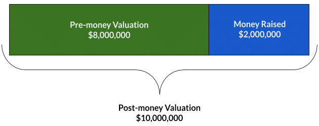
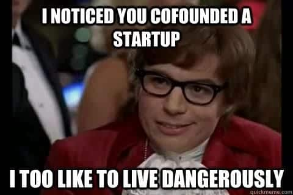
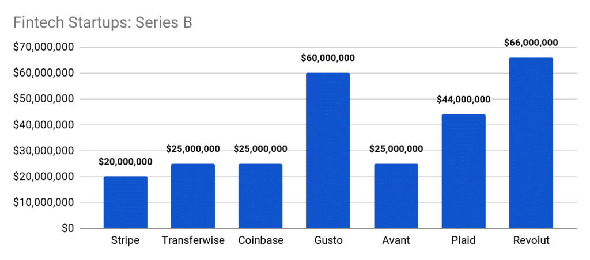
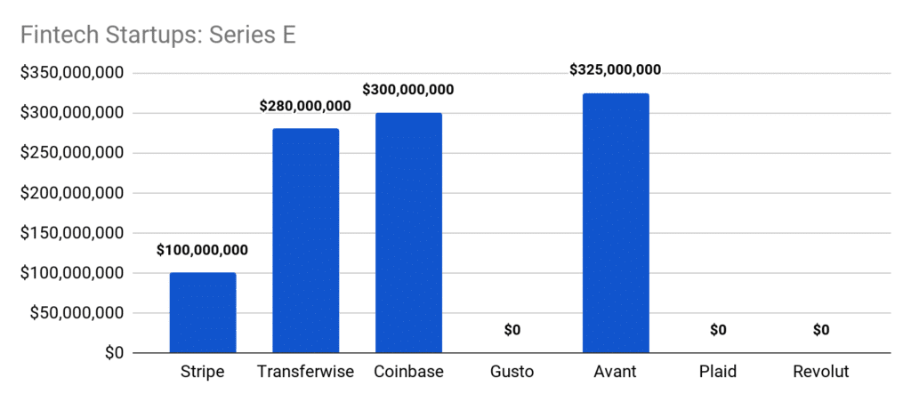

How does Series Funding work? What’s an Angel Investor? How are they different from Venture Capitalist firms? Which stage of series funding is best for my company right now?

Getting funding for your startup can be a daunting task with lots of questions to answer and options to consider.

From ideation to scaling, your company will have several opportunities, known as “funding rounds”, to raise capital from outside investors.

Initially, you will be looking for capital to build the core product.

This won’t be the type of capital you need later on when hiring top talent or marketing your product to the world.

As such, the amounts you can raise will differ from round to round.

Before going through each funding round in-depth I wanted to share a short story to show what can be achieved with the right investors.

I want to talk about Melanie Perkins.

She is the founder of [Canva](https://www.canva.com/), a Unicorn startup valued at $3.2B.

Back in 2006, when she was studying commerce and communications at the University of Western Australia, she got frustrated by how long it took to use the graphic design tools used at the time.

“It could take a whole semester to learn the very basics,” she said in an interview for [BBC News](https://www.bbc.com/news/business-42552367). “Even the simplest tasks, like exporting a high-quality PDF file, could take 22 clicks.”

She turned her problem into a business opportunity. She set out to create an online design tool with as easy a learning curve as possible.

It took her three years of hard work before she got any kind of investment from Silicon Valley.

But in 2013 Canva launched backed by $3M, with former Google Executive Cameron Adams joining as a co-founder — which no doubt helped them secure funding in future rounds.

After all, a big name behind the company means better security for the investors.

In the same year, they secured $6.6M in Seed Funding followed by $21M in 2015 through two rounds of Series A Funding.

They have carried on through rounds of Series B, C and D funding and as of October have managed to secure a total of [$241.6M](https://www.crunchbase.com/organization/canva/funding_rounds/funding_rounds_list#section-funding-rounds) since they launched in 2013.

You may be surprised to see a D there.

It’s not that common to see a startup go through Series D funding and even when it happens it’s often simply a vehicle to boast their valuation — but more on that later.

In a recent interview with [Forbes](https://www.forbes.com/sites/alexkonrad/2019/10/16/canva-3-billion-valuation-after-raise-for-enterprise-push/#4fd700ff24ff) Canva CEO Melanie said: “Canva’s \[Series D\] funding is intended to help Canva hire and invest in research and development for its first push into the enterprise”.

She claimed they’d been holding back on further investment because they’d “been profitable for the last two years,” but changed their mind because they want to “be used by every single enterprise across the globe.”

This is just one of many examples of what you can do when you get funding right. And although it wasn’t easy for Melanie and Canva (remember it took her three years just to get through the door), they wouldn’t be where they are today without it.

So how can you be like Melanie and secure the right investments for your startup?

Well, first you learn how funding works.

## How Does Funding Work?

The first thing you need to know is that getting funding is a long and hard road. According to a DocSend survey, you need to [contact an average](https://www.forbes.com/sites/alejandrocremades/2018/08/05/top-50-angel-investors-based-on-investment-volume-and-successful-exits/#182d85ef7748) of just 58 investors, make 40 meetings, and take just 12.5 weeks to close your funding round.

_Edit__: One of our readers, Karen Melonie Gould, pointed out that due to the COVID-19 situation the average time to close a funding round has increased to 9–12 months._

With that said, let’s start with the two parties involved in funding.

First is you, the entrepreneur, hoping to get funding for your company.

As your business grows you tend to advance through several funding rounds beginning with pre-seed and progressing through Series A, B and then C funding rounds.

And as we saw with Canva a few companies will even carry on to Series D and E rounds depending on their needs.

The second party involved in funding is, you guessed it, the investor(s).

Usually, people who invest in startups do so because they believe in your idea, and they generally support entrepreneurship.

This is why Andreas von Bechtolsheim famously wrote Google their first-ever cheque for $100,000.

Back in ’98, as I’m sure some of you will know, searching the internet wasn’t as easy as it is today. Andreas had this problem himself, he saw Google as a potential solution. [In his own words](https://www.dw.com/en/von-bechtolsheim-i-invested-in-google-to-solve-my-own-problem/a-4557608):

/\* widget: Blog: Simple Quote \*/  /\* reset -------------------- \*/  .blog-custom-block \*,  .blog-custom-block ::before,  .blog-custom-block ::after {  box-sizing: border-box;  border-width: 0;  border-style: solid;  border-color: #e5e7eb;  }  /\* vars -------------------- \*/  .blog-custom-block.blog-custom-block\_\_simple-quote {  --color-accent: #0FA4EA;  --color-bg: #F4FAFE;  --color-text-2: #4A4A68;  }  /\* colors -------------------- \*/  .blog-custom-block.blog-custom-block\_\_simple-quote .bg-clr-bg {  background-color: var(--color-bg);  }  .blog-custom-block.blog-custom-block\_\_simple-quote .border-clr-accent {  border-color: var(--color-accent);  }  .blog-custom-block.blog-custom-block\_\_simple-quote .text-clr-text-2 {  color: var(--color-text-2);  }  /\* utils -------------------- \*/  .blog-custom-block.blog-custom-block\_\_simple-quote .flex {  display: flex;  }  .blog-custom-block.blog-custom-block\_\_simple-quote .flex-shrink-0 {  flex-shrink: 0;  }  .blog-custom-block.blog-custom-block\_\_simple-quote .flex-col {  flex-direction: column;  }  .blog-custom-block.blog-custom-block\_\_simple-quote .gap-4 {  gap: 1rem;  }  .blog-custom-block.blog-custom-block\_\_simple-quote .rounded-xl {  border-radius: 0.75rem;  }  .blog-custom-block.blog-custom-block\_\_simple-quote .border-l-6 {  border-left-width: 6px;  }  .blog-custom-block.blog-custom-block\_\_simple-quote .p-8 {  padding: 2rem;  }  .blog-custom-block.blog-custom-block\_\_simple-quote .text-xl {  font-size: 1.25rem;  line-height: 1.75rem;  }  .blog-custom-block.blog-custom-block\_\_simple-quote .italic {  font-style: italic;  } 

_I cannot claim I foresaw how much \[Google\] would take off, I just thought good search was really, really important. \[…\] So I really invested in the company to solve my own problem which was how to find information on the internet easily_

They will, however, always be looking to gain something back from their investment — besides feeling good about supporting new businesses.

Most investors will expect a financial portion of your startup — and in some cases, a say in how things are done.

Let me take a minute here to introduce you to two of the most common investors you will come across: Venture Capitalists and Angel Investors.

## What is Venture Capital

Venture Capitalists (VCs) are people or firms that invest other people’s money.

They invest in startups and SMEs that are usually high risk but have huge growth potential.

If you get funding from VCs they will be looking for a high return on investment.

This [quote](https://hbr.org/1998/11/how-venture-capital-works) from Harvard Business Review explains it beautifully:

/\* widget: Blog: Simple Quote \*/  /\* reset -------------------- \*/  .blog-custom-block \*,  .blog-custom-block ::before,  .blog-custom-block ::after {  box-sizing: border-box;  border-width: 0;  border-style: solid;  border-color: #e5e7eb;  }  /\* vars -------------------- \*/  .blog-custom-block.blog-custom-block\_\_simple-quote {  --color-accent: #0FA4EA;  --color-bg: #F4FAFE;  --color-text-2: #4A4A68;  }  /\* colors -------------------- \*/  .blog-custom-block.blog-custom-block\_\_simple-quote .bg-clr-bg {  background-color: var(--color-bg);  }  .blog-custom-block.blog-custom-block\_\_simple-quote .border-clr-accent {  border-color: var(--color-accent);  }  .blog-custom-block.blog-custom-block\_\_simple-quote .text-clr-text-2 {  color: var(--color-text-2);  }  /\* utils -------------------- \*/  .blog-custom-block.blog-custom-block\_\_simple-quote .flex {  display: flex;  }  .blog-custom-block.blog-custom-block\_\_simple-quote .flex-shrink-0 {  flex-shrink: 0;  }  .blog-custom-block.blog-custom-block\_\_simple-quote .flex-col {  flex-direction: column;  }  .blog-custom-block.blog-custom-block\_\_simple-quote .gap-4 {  gap: 1rem;  }  .blog-custom-block.blog-custom-block\_\_simple-quote .rounded-xl {  border-radius: 0.75rem;  }  .blog-custom-block.blog-custom-block\_\_simple-quote .border-l-6 {  border-left-width: 6px;  }  .blog-custom-block.blog-custom-block\_\_simple-quote .p-8 {  padding: 2rem;  }  .blog-custom-block.blog-custom-block\_\_simple-quote .text-xl {  font-size: 1.25rem;  line-height: 1.75rem;  }  .blog-custom-block.blog-custom-block\_\_simple-quote .italic {  font-style: italic;  } 

_In return for financing one to two years of a company’s start-up, venture capitalists expect a ten times return of capital over five years._

That can look scary, with an almost “loan-shark” feel to it but it doesn’t change the fact that venture capital is a great option if you want to scale quickly and go huge.

Just bear in mind that they will take a big stake of equity from your company. Depending on the deal they may end up gaining control of your company.

Moreover, the competition for VC deals keeps getting fiercer. If we look at the US alone we see that [VC deal activity has yet again declined in Q1](https://www.cbinsights.com/research/report/venture-capital-q1-2020/) for the third consecutive quarter:

## Angel Investors

Angel Investors (also known as business angels, private investors or seed investors) are a different beast. They are wealthy individuals who use their own money to back ventures.

They invest smaller amounts of money ranging from a few thousand dollars up to a million and are more likely to take bigger risks (like backing startups without a proven track record). Just take a look on [Crunchbase](https://www.crunchbase.com/) at any early-stage investments and you will see Angels on that list.

They are a critical part of the equity funding system and are usually much more accessible for early-stage companies when compared with VCs.

The reason for this is because they can make investment decisions on their own — without having to go through a corporate hierarchy as with a VC firm.

Another pro of working with Angels is that they normally know the industry in which they are investing.

This is great for you.

In knowing your industry, they won’t waste your time with uninformed questions — and they’ll bring their own connections to the table (which is as important as the cash injection) — this is called Smart Money.

This means you will not only get a valuable monetary investment but a trustworthy advisor that can bring knowledge and resources to your company.

So those are the two most common types of investors you will encounter. Before we delve into the series rounds there are a few more basic concepts you need to understand.

I want to talk about Valuation.

Related: [Looking for Investors? Avoid These Types of Bad Business Angels](https://altar.io/looking-investors-avoid-7-types-bad-business-angels/)

Business Valuation

Your companies [valuation](https://altar.io/real-options-model-tech-startups-valuation/) is speculative and will be driven by many factors — including:

- Management
- Proven Track Record
- Market Forces
- Risk

When negotiating your valuation with investors, you and your existing shareholders want a high valuation to retain as much equity as possible.

Whereas investors want a low valuation, so they can get as much equity as possible.

To explain this further you need to know about pre-money and post-money valuations.

## Pre-Money vs. Post Money Valuation

These terms are both used to measure the value of a company, just at different points in the valuation.

Simply put:

Pre-money is the valuation of your business before an investment round.

Post-money is the value of your company after an investment round.

Let me break it down with an example.

Let’s say you and your co-founder incorporate a company. You issue 100,000 shares and divide them equally between you.

Your company starts to become successful and you go to an investor for some additional capital. You aim to raise $2M.

You find a VC and negotiate an investment of $2M for a $10M post-money valuation (the valuation of your company including the $2M investment).

So what does this mean in terms of ownership percentage for you, your co-founder and your new VC?

The VC’s $2M at a $10M post-money valuation gets him 20% of the company. Leaving you and your co-founder with 80% of the company. This is called dilution.

In terms of shares, you and your co-founder will keep your initial 100,000. But you will now issue new shares for the VC.

In this case, your 100,000 shares are now worth 80% of the company. Therefore you will issue 25,000 shares to the VC for their 20% of the company.

As the VC invested $2M for 25,000 shares each share is now worth $80.

For you and your co-founder, this means your 100,000 shares are worth $8,000,000 — the same as your pre-money valuation.

You will meet different investors at different stages of the funding process — with new VC firms opening their doors to you the more successful you become.

Bear in mind that investors at the later stages will season the investment agreements with clauses to look out for. You will have to consider factors such as liquidation & dilution preferences for example.

Now let’s take an in-depth look at each funding round.

##### Do you have a brilliant startup idea that you want to bring to life?

From the product and business reasoning to streamlining your MVP to the most important features, our team of product experts and ex-startup founders can help you bring your vision to life.

Let's Talk

Pre-Seed Funding and Bootstrapping

This is the earliest stage of funding and is rarely mentioned as part of the official equity cycle.

At this point, you and your co-founders will be working with a very small team (or even by yourselves) to develop your initial idea and set up operations.

The money here comes predominantly from bootstrapping — building the company from the ground up but nothing with personal savings and, if you are lucky, income from initial sales.

Other ways of pre-seeding include:

- Taking out a small business loan — in the form of a traditional bank loan or credit card.
- Crowdfunding — on platforms such as [Seedrs](https://www.seedrs.com/), [Kickstarter](https://www.kickstarter.com/) or [Indiegogo](https://www.indiegogo.com/).
- Borrowing from friends & family — often in return for an equity stake or convertible note in the company.

.elementor-3329 .elementor-element.elementor-element-f79b780{--display:flex;--flex-direction:column;--container-widget-width:100%;--container-widget-height:initial;--container-widget-flex-grow:0;--container-widget-align-self:initial;--background-transition:0.3s;}.elementor-3329 .elementor-element.elementor-element-aa6dd2a{--display:flex;--flex-direction:column;--container-widget-width:100%;--container-widget-height:initial;--container-widget-flex-grow:0;--container-widget-align-self:initial;--gap:24px 24px;--background-transition:0.3s;--border-radius:12px 12px 12px 12px;--padding-block-start:70px;--padding-block-end:70px;--padding-inline-start:var(--safe-margin);--padding-inline-end:var(--safe-margin);}.elementor-3329 .elementor-element.elementor-element-aa6dd2a:not(.elementor-motion-effects-element-type-background), .elementor-3329 .elementor-element.elementor-element-aa6dd2a > .elementor-motion-effects-container > .elementor-motion-effects-layer{background-color:#29293E;}.elementor-3329 .elementor-element.elementor-element-aa6dd2a, .elementor-3329 .elementor-element.elementor-element-aa6dd2a::before{--border-transition:0.3s;}.elementor-3329 .elementor-element.elementor-element-95ae566{--display:flex;--flex-direction:column;--container-widget-width:100%;--container-widget-height:initial;--container-widget-flex-grow:0;--container-widget-align-self:initial;--background-transition:0.3s;}.elementor-3329 .elementor-element.elementor-element-99ebd14{text-align:center;}.elementor-3329 .elementor-element.elementor-element-99ebd14 .elementor-heading-title{color:var( --e-global-color-eb70be1 );font-family:var( --e-global-typography-0ff79ee-font-family ), sans-serif;font-size:var( --e-global-typography-0ff79ee-font-size );font-weight:var( --e-global-typography-0ff79ee-font-weight );line-height:var( --e-global-typography-0ff79ee-line-height );letter-spacing:var( --e-global-typography-0ff79ee-letter-spacing );word-spacing:var( --e-global-typography-0ff79ee-word-spacing );}.elementor-3329 .elementor-element.elementor-element-0ce57c0{text-align:center;color:var( --e-global-color-eb70be1 );font-size:20px;}.elementor-3329 .elementor-element.elementor-element-28db4d7{--display:flex;--flex-direction:row;--container-widget-width:initial;--container-widget-height:100%;--container-widget-flex-grow:1;--container-widget-align-self:stretch;--justify-content:flex-start;--background-transition:0.3s;}.elementor-3329 .elementor-element.elementor-element-70fbc6a .elementor-field-group{padding-right:calc( 24px/2 );padding-left:calc( 24px/2 );margin-bottom:32px;}.elementor-3329 .elementor-element.elementor-element-70fbc6a .elementor-form-fields-wrapper{margin-left:calc( -24px/2 );margin-right:calc( -24px/2 );margin-bottom:-32px;}.elementor-3329 .elementor-element.elementor-element-70fbc6a .elementor-field-group.recaptcha\_v3-bottomleft, .elementor-3329 .elementor-element.elementor-element-70fbc6a .elementor-field-group.recaptcha\_v3-bottomright{margin-bottom:0;}body.rtl .elementor-3329 .elementor-element.elementor-element-70fbc6a .elementor-labels-inline .elementor-field-group > label{padding-left:8px;}body:not(.rtl) .elementor-3329 .elementor-element.elementor-element-70fbc6a .elementor-labels-inline .elementor-field-group > label{padding-right:8px;}body .elementor-3329 .elementor-element.elementor-element-70fbc6a .elementor-labels-above .elementor-field-group > label{padding-bottom:8px;}.elementor-3329 .elementor-element.elementor-element-70fbc6a .elementor-field-group > label, .elementor-3329 .elementor-element.elementor-element-70fbc6a .elementor-field-subgroup label{color:var( --e-global-color-eb70be1 );}.elementor-3329 .elementor-element.elementor-element-70fbc6a .elementor-field-group > label{font-family:var( --e-global-typography-9730a4e-font-family ), sans-serif;font-size:var( --e-global-typography-9730a4e-font-size );font-weight:var( --e-global-typography-9730a4e-font-weight );line-height:var( --e-global-typography-9730a4e-line-height );letter-spacing:var( --e-global-typography-9730a4e-letter-spacing );word-spacing:var( --e-global-typography-9730a4e-word-spacing );}.elementor-3329 .elementor-element.elementor-element-70fbc6a .elementor-field-type-html{padding-bottom:0px;}.elementor-3329 .elementor-element.elementor-element-70fbc6a .elementor-field-group .elementor-field{color:var( --e-global-color-eb70be1 );}.elementor-3329 .elementor-element.elementor-element-70fbc6a .elementor-field-group .elementor-field, .elementor-3329 .elementor-element.elementor-element-70fbc6a .elementor-field-subgroup label{font-family:var( --e-global-typography-text-font-family ), sans-serif;font-size:var( --e-global-typography-text-font-size );font-weight:var( --e-global-typography-text-font-weight );line-height:var( --e-global-typography-text-line-height );}.elementor-3329 .elementor-element.elementor-element-70fbc6a .elementor-field-group:not(.elementor-field-type-upload) .elementor-field:not(.elementor-select-wrapper){background-color:#3D3D5C;border-color:#65639C;}.elementor-3329 .elementor-element.elementor-element-70fbc6a .elementor-field-group .elementor-select-wrapper select{background-color:#3D3D5C;border-color:#65639C;}.elementor-3329 .elementor-element.elementor-element-70fbc6a .elementor-field-group .elementor-select-wrapper::before{color:#65639C;}.elementor-3329 .elementor-element.elementor-element-70fbc6a .elementor-button{font-family:"Poppins", sans-serif;font-size:14px;font-weight:700;line-height:1.5;}.elementor-3329 .elementor-element.elementor-element-70fbc6a .e-form\_\_buttons\_\_wrapper\_\_button-next{background-color:var( --e-global-color-1e4bfa7 );color:var( --e-global-color-eb70be1 );}.elementor-3329 .elementor-element.elementor-element-70fbc6a .elementor-button\[type="submit"\]{background-color:var( --e-global-color-1e4bfa7 );color:var( --e-global-color-eb70be1 );}.elementor-3329 .elementor-element.elementor-element-70fbc6a .elementor-button\[type="submit"\] svg \*{fill:var( --e-global-color-eb70be1 );}.elementor-3329 .elementor-element.elementor-element-70fbc6a .e-form\_\_buttons\_\_wrapper\_\_button-previous{color:var( --e-global-color-eb70be1 );}.elementor-3329 .elementor-element.elementor-element-70fbc6a .e-form\_\_buttons\_\_wrapper\_\_button-next:hover{color:#ffffff;}.elementor-3329 .elementor-element.elementor-element-70fbc6a .elementor-button\[type="submit"\]:hover{color:#ffffff;}.elementor-3329 .elementor-element.elementor-element-70fbc6a .elementor-button\[type="submit"\]:hover svg \*{fill:#ffffff;}.elementor-3329 .elementor-element.elementor-element-70fbc6a .e-form\_\_buttons\_\_wrapper\_\_button-previous:hover{color:#ffffff;}.elementor-3329 .elementor-element.elementor-element-70fbc6a .elementor-message{font-family:var( --e-global-typography-9730a4e-font-family ), sans-serif;font-size:var( --e-global-typography-9730a4e-font-size );font-weight:var( --e-global-typography-9730a4e-font-weight );line-height:var( --e-global-typography-9730a4e-line-height );letter-spacing:var( --e-global-typography-9730a4e-letter-spacing );word-spacing:var( --e-global-typography-9730a4e-word-spacing );}.elementor-3329 .elementor-element.elementor-element-70fbc6a .elementor-message.elementor-message-success{color:var( --e-global-color-40f63f7 );}.elementor-3329 .elementor-element.elementor-element-70fbc6a .elementor-message.elementor-message-danger{color:var( --e-global-color-8ddb30f );}.elementor-3329 .elementor-element.elementor-element-70fbc6a .elementor-message.elementor-help-inline{color:var( --e-global-color-9acb2f2 );}.elementor-3329 .elementor-element.elementor-element-70fbc6a{--e-form-steps-indicators-spacing:20px;--e-form-steps-indicator-padding:30px;--e-form-steps-indicator-inactive-secondary-color:#ffffff;--e-form-steps-indicator-active-secondary-color:#ffffff;--e-form-steps-indicator-completed-secondary-color:#ffffff;--e-form-steps-divider-width:1px;--e-form-steps-divider-gap:10px;width:100%;max-width:100%;}.elementor-3329 .elementor-element.elementor-element-70fbc6a > .elementor-widget-container{padding:10px 0px 0px 0px;}@media(min-width:768px){.elementor-3329 .elementor-element.elementor-element-aa6dd2a{--content-width:var(--container-md);}}@media(max-width:1024px){.elementor-3329 .elementor-element.elementor-element-99ebd14 .elementor-heading-title{font-size:var( --e-global-typography-0ff79ee-font-size );line-height:var( --e-global-typography-0ff79ee-line-height );letter-spacing:var( --e-global-typography-0ff79ee-letter-spacing );word-spacing:var( --e-global-typography-0ff79ee-word-spacing );}.elementor-3329 .elementor-element.elementor-element-70fbc6a .elementor-field-group > label{font-size:var( --e-global-typography-9730a4e-font-size );line-height:var( --e-global-typography-9730a4e-line-height );letter-spacing:var( --e-global-typography-9730a4e-letter-spacing );word-spacing:var( --e-global-typography-9730a4e-word-spacing );}.elementor-3329 .elementor-element.elementor-element-70fbc6a .elementor-field-group .elementor-field, .elementor-3329 .elementor-element.elementor-element-70fbc6a .elementor-field-subgroup label{font-size:var( --e-global-typography-text-font-size );line-height:var( --e-global-typography-text-line-height );}.elementor-3329 .elementor-element.elementor-element-70fbc6a .elementor-message{font-size:var( --e-global-typography-9730a4e-font-size );line-height:var( --e-global-typography-9730a4e-line-height );letter-spacing:var( --e-global-typography-9730a4e-letter-spacing );word-spacing:var( --e-global-typography-9730a4e-word-spacing );}}@media(max-width:767px){.elementor-3329 .elementor-element.elementor-element-99ebd14 .elementor-heading-title{font-size:var( --e-global-typography-0ff79ee-font-size );line-height:var( --e-global-typography-0ff79ee-line-height );letter-spacing:var( --e-global-typography-0ff79ee-letter-spacing );word-spacing:var( --e-global-typography-0ff79ee-word-spacing );}.elementor-3329 .elementor-element.elementor-element-70fbc6a .elementor-field-group > label{font-size:var( --e-global-typography-9730a4e-font-size );line-height:var( --e-global-typography-9730a4e-line-height );letter-spacing:var( --e-global-typography-9730a4e-letter-spacing );word-spacing:var( --e-global-typography-9730a4e-word-spacing );}.elementor-3329 .elementor-element.elementor-element-70fbc6a .elementor-field-group .elementor-field, .elementor-3329 .elementor-element.elementor-element-70fbc6a .elementor-field-subgroup label{font-size:var( --e-global-typography-text-font-size );line-height:var( --e-global-typography-text-line-height );}.elementor-3329 .elementor-element.elementor-element-70fbc6a .elementor-message{font-size:var( --e-global-typography-9730a4e-font-size );line-height:var( --e-global-typography-9730a4e-line-height );letter-spacing:var( --e-global-typography-9730a4e-letter-spacing );word-spacing:var( --e-global-typography-9730a4e-word-spacing );}}/\* Start custom CSS for form, class: .elementor-element-70fbc6a \*/.elementor-3329 .elementor-element.elementor-element-70fbc6a input {  border-color: #65639C !important;  }  .elementor-3329 .elementor-element.elementor-element-70fbc6a input:is(:focus, :hover) {  border-color: #B9B8CE !important;  }/\* End custom CSS \*/

##### Sign up for our newsletter

Join hundreds of entrepreneurs and business leaders to receive fresh, actionable tech and startup related insights and tips

/\*! elementor-pro - v3.19.0 - 07-02-2024 \*/  .elementor-button.elementor-hidden,.elementor-hidden{display:none}.e-form\_\_step{width:100%}.e-form\_\_step:not(.elementor-hidden){display:flex;flex-wrap:wrap}.e-form\_\_buttons{flex-wrap:wrap}.e-form\_\_buttons,.e-form\_\_buttons\_\_wrapper{display:flex}.e-form\_\_indicators{display:flex;justify-content:space-between;align-items:center;flex-wrap:nowrap;font-size:13px;margin-bottom:var(--e-form-steps-indicators-spacing)}.e-form\_\_indicators\_\_indicator{display:flex;flex-direction:column;align-items:center;justify-content:center;flex-basis:0;padding:0 var(--e-form-steps-divider-gap)}.e-form\_\_indicators\_\_indicator\_\_progress{width:100%;position:relative;background-color:var(--e-form-steps-indicator-progress-background-color);border-radius:var(--e-form-steps-indicator-progress-border-radius);overflow:hidden}.e-form\_\_indicators\_\_indicator\_\_progress\_\_meter{width:var(--e-form-steps-indicator-progress-meter-width,0);height:var(--e-form-steps-indicator-progress-height);line-height:var(--e-form-steps-indicator-progress-height);padding-right:15px;border-radius:var(--e-form-steps-indicator-progress-border-radius);background-color:var(--e-form-steps-indicator-progress-color);color:var(--e-form-steps-indicator-progress-meter-color);text-align:right;transition:width .1s linear}.e-form\_\_indicators\_\_indicator:first-child{padding-left:0}.e-form\_\_indicators\_\_indicator:last-child{padding-right:0}.e-form\_\_indicators\_\_indicator--state-inactive{color:var(--e-form-steps-indicator-inactive-primary-color,#c2cbd2)}.e-form\_\_indicators\_\_indicator--state-inactive \[class\*=indicator--shape-\]:not(.e-form\_\_indicators\_\_indicator--shape-none){background-color:var(--e-form-steps-indicator-inactive-secondary-color,#fff)}.e-form\_\_indicators\_\_indicator--state-inactive object,.e-form\_\_indicators\_\_indicator--state-inactive svg{fill:var(--e-form-steps-indicator-inactive-primary-color,#c2cbd2)}.e-form\_\_indicators\_\_indicator--state-active{color:var(--e-form-steps-indicator-active-primary-color,#39b54a);border-color:var(--e-form-steps-indicator-active-secondary-color,#fff)}.e-form\_\_indicators\_\_indicator--state-active \[class\*=indicator--shape-\]:not(.e-form\_\_indicators\_\_indicator--shape-none){background-color:var(--e-form-steps-indicator-active-secondary-color,#fff)}.e-form\_\_indicators\_\_indicator--state-active object,.e-form\_\_indicators\_\_indicator--state-active svg{fill:var(--e-form-steps-indicator-active-primary-color,#39b54a)}.e-form\_\_indicators\_\_indicator--state-completed{color:var(--e-form-steps-indicator-completed-secondary-color,#fff)}.e-form\_\_indicators\_\_indicator--state-completed \[class\*=indicator--shape-\]:not(.e-form\_\_indicators\_\_indicator--shape-none){background-color:var(--e-form-steps-indicator-completed-primary-color,#39b54a)}.e-form\_\_indicators\_\_indicator--state-completed .e-form\_\_indicators\_\_indicator\_\_label{color:var(--e-form-steps-indicator-completed-primary-color,#39b54a)}.e-form\_\_indicators\_\_indicator--state-completed .e-form\_\_indicators\_\_indicator--shape-none{color:var(--e-form-steps-indicator-completed-primary-color,#39b54a);background-color:initial}.e-form\_\_indicators\_\_indicator--state-completed object,.e-form\_\_indicators\_\_indicator--state-completed svg{fill:var(--e-form-steps-indicator-completed-secondary-color,#fff)}.e-form\_\_indicators\_\_indicator\_\_icon{width:var(--e-form-steps-indicator-padding,30px);height:var(--e-form-steps-indicator-padding,30px);font-size:var(--e-form-steps-indicator-icon-size);border-width:1px;border-style:solid;display:flex;justify-content:center;align-items:center;overflow:hidden;margin-bottom:10px}.e-form\_\_indicators\_\_indicator\_\_icon img,.e-form\_\_indicators\_\_indicator\_\_icon object,.e-form\_\_indicators\_\_indicator\_\_icon svg{width:var(--e-form-steps-indicator-icon-size);height:auto}.e-form\_\_indicators\_\_indicator\_\_icon .e-font-icon-svg{height:1em}.e-form\_\_indicators\_\_indicator\_\_number{width:var(--e-form-steps-indicator-padding,30px);height:var(--e-form-steps-indicator-padding,30px);border-width:1px;border-style:solid;display:flex;justify-content:center;align-items:center;margin-bottom:10px}.e-form\_\_indicators\_\_indicator--shape-circle{border-radius:50%}.e-form\_\_indicators\_\_indicator--shape-square{border-radius:0}.e-form\_\_indicators\_\_indicator--shape-rounded{border-radius:5px}.e-form\_\_indicators\_\_indicator--shape-none{border:0}.e-form\_\_indicators\_\_indicator\_\_label{text-align:center}.e-form\_\_indicators\_\_indicator\_\_separator{width:100%;height:var(--e-form-steps-divider-width);background-color:#babfc5}.e-form\_\_indicators--type-icon,.e-form\_\_indicators--type-icon\_text,.e-form\_\_indicators--type-number,.e-form\_\_indicators--type-number\_text{align-items:flex-start}.e-form\_\_indicators--type-icon .e-form\_\_indicators\_\_indicator\_\_separator,.e-form\_\_indicators--type-icon\_text .e-form\_\_indicators\_\_indicator\_\_separator,.e-form\_\_indicators--type-number .e-form\_\_indicators\_\_indicator\_\_separator,.e-form\_\_indicators--type-number\_text .e-form\_\_indicators\_\_indicator\_\_separator{margin-top:calc(var(--e-form-steps-indicator-padding, 30px) / 2 - var(--e-form-steps-divider-width, 1px) / 2)}.elementor-field-type-hidden{display:none}.elementor-field-type-html{display:inline-block}.elementor-field-type-tel input{direction:inherit}.elementor-login .elementor-lost-password,.elementor-login .elementor-remember-me{font-size:.85em}.elementor-field-type-recaptcha\_v3 .elementor-field-label{display:none}.elementor-field-type-recaptcha\_v3 .grecaptcha-badge{z-index:1}.elementor-button .elementor-form-spinner{order:3}.elementor-form .elementor-button>span{display:flex;justify-content:center;align-items:center}.elementor-form .elementor-button .elementor-button-text{white-space:normal;flex-grow:0}.elementor-form .elementor-button svg{height:auto}.elementor-form .elementor-button .e-font-icon-svg{height:1em}.elementor-select-wrapper .select-caret-down-wrapper{position:absolute;top:50%;transform:translateY(-50%);inset-inline-end:10px;pointer-events:none;font-size:11px}.elementor-select-wrapper .select-caret-down-wrapper svg{display:unset;width:1em;aspect-ratio:unset;fill:currentColor}.elementor-select-wrapper .select-caret-down-wrapper i{font-size:19px;line-height:2}.elementor-select-wrapper.remove-before:before{content:""!important}

   Full Name  Buisness Email  Subscribe

Seed Funding

The first equity funding stage is Seed funding.

This is where your company needs to gain traction before you run out of runway.

Seed funding is what it says on the tin: the money that plants the “seed” to help the company grow.

Normally this money is used for product development and extending your founding team to complete these tasks.

[Transferwise](https://transferwise.com/pt), for instance, used their [$1.3M of seed funding](https://techcrunch.com/2012/04/17/transferwise-raises-1-3m-from-index-others-for-the-next-disruption-in-money-transfer-crowdsourcing/) to develop their product further (adding USD ($) to their list of supported currencies) as well as expand into new markets.

Potential investors at this stage include:

- You and your co-founder’s pockets
- Friends & Family
- Startup Incubators
- Venture Capital Companies
- Angel Investors

Your company will on average raise between $100,000 and $2M at this stage of funding. Although the numbers can vary massively as you can see in the chart below:

 

Related: [Download Pitch Decks That Helped Companies like Transfewise or Linkedin Raise Millions](https://altar57146.activehosted.com/f/17)

## Series A Funding

At this point in your company’s journey, you’ve made progress on your KPIs — for example, an established user base or making consistent revenue.

At this point, you may decide to take part in Series A funding rounds to further optimise and scale your business.

Like [Coinbase](https://www.coinbase.com/) did.

They used the $5M they raised in their Series A round to focus on their business goals — to make Bitcoin [easier to trade](https://blog.coinbase.com/coinbase-raises-5m-in-series-a-funding-78c6f56c4b78):

“Our goal in raising money is to eliminate \[customer and merchant\] pain points one by one. These include both buying limits, how fast bitcoin is delivered after purchase, and which payments methods can be used. With each point, we hope to make Bitcoin more accessible and usable by the masses.”

At this stage of the series rounds, investors will be looking for a strong strategy and great execution.

The investors at this stage include more “traditional” venture capital firms such as:

- [Sequoia](https://www.sequoiacap.com/)
- [Greylock](https://www.greylockcapital.com/)
- [Accel](https://www.accel.com/)
- [Andreessen Horowitz](https://a16z.com/)
- [Index Ventures](https://www.indexventures.com/)
- [Bessemer Venture Partners](https://www.bvp.com/)
- [Founders Fund](https://foundersfund.com/)
- [GGV Capital](https://www.ggvc.com/)
- [IVP](https://www.ivp.com/)

As well as Crowdfunding and [Angel Investors](https://www.crunchbase.com/hub/angel-investors).

You will be raising anything between $3M and $20M. Here are some more examples:

## Series B Funding

If you get to series B you have already found your product/market fit.

Your product is succeeding and your user base is growing substantially.

What a nice problem you have — you’re struggling to wear multiple hats and keep up with demand.

This is where Series B comes in.

Investors can help with an all-important injection of capital to help you onboard top talent.

Whether that’s in business development, marketing, software development or any other experts your product may need.

[Stripe](https://stripe.com/en-pt) (who now boast a [$35B valuation](https://www.forbes.com/sites/donnafuscaldo/2019/09/19/stripe-now-has-a-pre-money-valuation-of-35-billion/#49be31d62e68)) went through Series B funding back in 2012.

According to [TechCrunch](https://techcrunch.com/2012/07/09/payments-startup-stripe-swipes-20m-from-general-catalyst-sequoia-thiel-and-more/) co-founder [Patrick Collison](https://www.crunchbase.com/person/patrick-collison) planned on using the funding to further hire, in order to handle the startup’s new-found scale.

Typically Series B funding can raise anywhere between $15M and $70M:

Series B tends to feature the same key investors as Series A.

The unique difference here is that Series B attracts a new group of VC firms that specialise in late-stage investments.

## Series C Funding

You’re now a successful company. You’ve got a top-notch user base, you’ve acquired great talents and now you want to conquer the world.

It’s time to get some funding to expand into international markets, develop new products or make some acquisitions.

Or maybe you want to boost your post-money valuation before going for an IPO.

Bank-disrupting fintech [Revolut](https://www.revolut.com/) used their Series C funding (raising an impressive $250M) to expand worldwide and increase its workforce from 350 to 800 employees according to [TechCrunch](https://techcrunch.com/2018/04/25/revolunicorn/).

They were looking to start with the U.S., Canada, Singapore, Hong Kong, and Australia at the time.

This round is where Private Equity Firms and Investment Bankers start to take an interest.

These players aren’t looking for high-risk investments — they leave that to the VCs and Angel Investors.

What they are looking to do is put huge sums of money on a “sure thing” to allow them to secure a leadership position.

Companies at this point tend to raise anything above $50m:

Commonly, Series C funding is the final push to prepare a company for an IPO — or acquisition from a big fish.

However, there are companies that carry on to raise Series D and even Series E funding.

## Series D Funding

There are two reasons why your company would go through Series D funding.

The first? You had a “down round” at Series C.

This means you didn’t hit the expectation you laid out in your series C funding and you’ve raised a lower valuation than in previous rounds.

Companies that have gone through this have a difficult time raising capital at this point as investors trust in their ability to deliver has been put into question.

An unnamed investor told [Business Insider](https://www.businessinsider.com/what-down-rounds-do-to-startups-2013-2) one reason for this is “that \[after a down round\] employees are far less incentivized to work because the value of shares, potential upside opportunity, and general spirit of the company are all diminished.”

But it’s not all bad times in Series D funding.

Many companies go through this round because they have discovered a new opportunity for expansion.

They want to take advantage of it before going for an IPO and need that last boost of capital to get them there.

Alternatively, they just want to stay private for longer than “normal”.

Or they may be regaining their independence after an acquisition just like [Reddit did in 2011](https://news.crunchbase.com/news/the-most-recent-startup-investments-over-250-million-in-2019/).

Despite having been acquired by Condé Nast in 2006 [they announced](https://redditblog.com/2011/09/06/independence/) in September 2011 that they would be returning to independence to better handle their future growth.

Reddit went on to raise $550M in through Series B, C and D and ended their Series D funding round with a huge $3 billion post-money valuation.

Venture Capital Firms are the usual suspects at this round of investment.

The amount raised at this stage ranges drastically based on your companies needs as we can see here:

## Series E Funding

It’s rare for a company to go through Series D funding and even rarer that they see Series E funding.

The reasons for this are the same as in the previous round: They had another down round, they need that little extra juice to push for an IPO or they just want to stay private a little longer.

In the case of fintech giant [Stripe](https://stripe.com/), a [spokesperson for the company](https://www.finextra.com/newsarticle/33291/stripe-raises-100m-at-225bn-valuation) said “Stripe is rapidly scaling internationally, as well as extending our platform into issuing, global fraud prevention, and physical stores with Stripe Terminal. The follow-on funding gives us more leverage in these strategic areas.”

Again the money you raise here differs substantially depending on your companies situation.

## Putting the Fun into Funding

Ok, so I may not have put the fun into funding — that may be an impossible task!

I hope, however, that I have made the funding process a little clearer, and less daunting.

Your company’s risk profiles and maturity levels will differ at each funding stage and you will meet new players along the way.

When you’re seeking investors is always important to remember to look out for the Smart Money (and [avoid the bad ones](https://altar.io/looking-investors-avoid-7-types-bad-business-angels/) like the plague).

A Smart money investor is someone who has the most knowledge, the most experience and the best network in your industry.

They can help you gain exposure to key players in your industry — which will increase your chances of getting key advisors, partnerships, collaborations, customers, suppliers and additional capital.

From Seed funding to Series B, investors will help nurture and develop your ideas. They will then enable you to onboard a great team to make that idea a reality.

Series C investors will support your company and give you the proper capital to fully achieve your companies “endgame” — whether that’s going for an IPO or cashing out completely.

Series D & E will provide you with extra opportunities to boost your valuation or recover your losses from a down round. Or it will simply allow you to stay private for longer.

Congratulations! You now know how series funding works. Check out [this glossary](https://buildd.co/funding-glossary) if you want to do some further reading on funding terms.

Apart from that, all that’s left to do is conquer the world by turning your great idea into a successful company.

Good luck! And thanks for reading.
