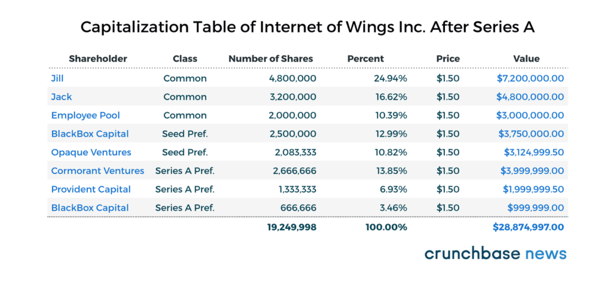

Money, or lack of it, can make or break a startup. Period.

As a startup founder raising capital is about to become an important part of your efforts. A survey by the [Kauffman Firm](https://www.kauffman.org/entrepreneurship/research/kauffman-firm-survey/) estimates that it takes, on average, a minimum of $80K to get your startup through its first year alone. Moreover, depending on the industry, it may take more than that just to get your startup off the ground — as you can see from this [pricing simulator](https://altar.io/pricing/).

Most companies fail to procure startup funding. Partly because it’s extremely difficult, but also because they fail to follow some basic steps. Fundraising requires understanding and a rock-solid approach to succeed. Here I will be taking you through the first steps of your funding journey. Starting with the basic preparation, to working out your funding roadmap and finally, how building your network may be the most valuable tool available to you.

## Methods of Raising Capital For A Startup

There are a plethora of sources of funding available. Giving startup founders many ways to raise capital for a company:

- Business Loans — Around [three-quarters of new startups](https://www.embroker.com/blog/startup-statistics/) rely on a business loan at some point in their life
- Angel Investors —  [Estimates say](https://www.angelcapitalassociation.org/faqs/#How%20many%20angel%20investors%20are%20there%20in%20the%20U.S.) that about 300,000 people have made an angel investment in the last two years in the US alone
- Venture Capitalists — In 2021, [Global VC investment totalled $643B](https://news.crunchbase.com/news/global-vc-funding-unicorns-2021-monthly-recap)
- Family Offices — In 2021, Family offices made up [4.2% of venture capital deals](https://www.bloomberg.com/news/articles/2021-10-07/family-offices-raise-bets-on-startups-in-418-billion-market) (double their share a decade ago.)
- Crowdfunding for Startups — Around [$17.2B is generated every year](https://www.fundera.com/resources/crowdfunding-statistics) from crowdfunding in North America alone.
- ICOs — In the US alone, companies raised [$7.3B through Initial Coin Offerings](https://icobench.com/stats) in 2021

Regardless of who you go to for capital, there are three things you need to give yourself the best chance to get that all-important cash injection.

## How to Raise Funds For A Startup

### Know Your Fundraising Options

Many founders believe there are only three options available when it comes to getting funding:

1. Savings or personal credit (Personal Finance)
2. Investments from friends & family
3. Bank loans

Personal finances & investments from friends & family, in most cases, can only get you so far.

The next avenue most entrepreneurs explore is personal or business loans. To get approved, however, you need to have the necessary collateral — which differs from bank to bank. It’s worth noting here that in the US the federal reserve reported that in 2015 only 38% of startups younger than five years old were approved for loans.

Even if your loan request is approved the high collateral requirements can often put a lot of strain on you personally. It can also slow your startup’s growth as your focus is on keeping up with repayments instead of injecting revenue back into the business.

Therefore, it is important to learn about the wider range of funding sources that are available to you. Whether it’s VCs, Angel Investors, Angel Syndicates, Family Offices or Crowdfunding. The latter of which (crowdfunding) is especially interesting as it bypasses the more traditional lending institutions, allowing accredited and non-accredited investors to invest in startups.

Many municipalities, states and corporations also offer grants to startups. This brings me to my final source of funding companies — Accelerators and Incubators. These facilities (like [Ycombinator](https://www.ycombinator.com/)) not only provide a monetary investment but also guidance and mentorship to help transform your idea into a successful startup.

As explored in [this article](https://altar.io/startup-series-funding-everything-you-need-to-know/), different types of investors are active at different stages of the startup funding process — with the investment agreements and clauses becoming more specific and confusing at the later stages.

### Get Your Foot In The Door

There is one thing that will never change. People with money will always be looking for ways to spend it. And luckily for you, they often choose to spend that money on companies with a potential for great ROIs.

Not so luckily, there is something else that will never change. It’s not what you know but who you know. Gaining access to investors is substantially easier when you know them yourself or have someone make an introduction.

Related: [The List of Most Active Fintech Investors](https://altar.io/ultimate-list-active-150-fintech-investors/)

According to Scott Shane, a business professor at [Case Western Reserve University](https://weatherhead.case.edu/faculty/scott-shane), most early-stage investors won’t look at you twice unless someone they know and trust has brought them the deal. Therefore, it’s no surprise that your personal connections are the most valuable currency you have, and you should nurture and grow your network as much as you can.

Thanks to social media, email and prospecting tools it’s easier than ever to find the [personal information of pretty much anyone](https://aeroleads.com/) you want to talk to. That’s why [personal data is now more valuable than oil](https://www.economist.com/leaders/2017/05/06/the-worlds-most-valuable-resource-is-no-longer-oil-but-data). It’s more about knowing who you need to reach and how to get in touch with them. A warm introduction will always give you a better chance of pitching vs a cold introduction.

### Find Expertise, Not Just Money

Three-quarters of founders who have experienced startup failure believe it was because they lacked expertise. When seeking investment you are forced to think about every aspect of your business strategically. You have to examine the fundamentals and make sure they are rock solid:

- Concept
- Customer/User
- Sales
- Marketing
- Financials
- Processes
- Execution

Once you know where you stand in regards to these factors you will have identified your strengths and weaknesses. You can start to look for the “Smart Money”. A smart money investor is someone who can provide the expertise to strengthen your weakest links.

Bringing on an experienced advisor is, arguably, more important than an injection of capital. You can call on them to provide you with their wider business expertise to help you improve and develop your product.

Above all, this gives you a better chance of success. When the average survival rate for tech companies is around 20%, you should jump at any opportunity to avoid common mistakes. Mentorship from an investor or an incubator is the best way to mitigate your risk.

### Know That The Odds Are Slim

Getting investors to reach into their pockets takes trust. They are investing in you and your team as much as your company. That being said, the number of investments that produce good ROIs for investors is minimal. Harvard Business School Senior Lecturer Shikhar Ghosh found that 30–40% of startups funded by investors ended up liquidating all of their assets. While 25–30% failed completely. He goes on to state “if failure is defined as not delivering the projected return on investment, then 95% of VC companies are failures”.

It is even more important, therefore, that you do everything in your power to put your startup in a powerful position. You need to leverage your network to garner warm introductions to key players in your industry. Before you go out to find your investors, however, you need to create your funding roadmap.

.elementor-3326 .elementor-element.elementor-element-fa6400f{--display:flex;--flex-direction:column;--container-widget-width:100%;--container-widget-height:initial;--container-widget-flex-grow:0;--container-widget-align-self:initial;--overflow:hidden;--background-transition:0.3s;--border-radius:12px 12px 12px 12px;}.elementor-3326 .elementor-element.elementor-element-283e311{--display:flex;--flex-direction:row;--container-widget-width:initial;--container-widget-height:100%;--container-widget-flex-grow:1;--container-widget-align-self:stretch;--gap:64px 64px;--background-transition:0.3s;}.elementor-3326 .elementor-element.elementor-element-283e311:not(.elementor-motion-effects-element-type-background), .elementor-3326 .elementor-element.elementor-element-283e311 > .elementor-motion-effects-container > .elementor-motion-effects-layer{background-color:#F4FAFE;}.elementor-3326 .elementor-element.elementor-element-283e311, .elementor-3326 .elementor-element.elementor-element-283e311::before{--border-transition:0.3s;}.elementor-3326 .elementor-element.elementor-element-857117e{--display:flex;--flex-direction:row;--container-widget-width:initial;--container-widget-height:100%;--container-widget-flex-grow:1;--container-widget-align-self:stretch;--background-transition:0.3s;}.elementor-3326 .elementor-element.elementor-element-857117e.e-con{--flex-grow:0;--flex-shrink:0;}.elementor-3326 .elementor-element.elementor-element-e6af329 img{width:100%;max-width:100%;height:100%;object-fit:cover;object-position:bottom right;}.elementor-3326 .elementor-element.elementor-element-e6af329{width:100%;max-width:100%;bottom:-44px;}body:not(.rtl) .elementor-3326 .elementor-element.elementor-element-e6af329{right:0px;}body.rtl .elementor-3326 .elementor-element.elementor-element-e6af329{left:0px;}.elementor-3326 .elementor-element.elementor-element-ec0de51{--display:flex;--flex-direction:column;--container-widget-width:100%;--container-widget-height:initial;--container-widget-flex-grow:0;--container-widget-align-self:initial;--gap:24px 24px;--background-transition:0.3s;--padding-block-start:112px;--padding-block-end:112px;--padding-inline-start:0px;--padding-inline-end:44px;}.elementor-3326 .elementor-element.elementor-element-ec0de51.e-con{--flex-grow:1;--flex-shrink:1;}.elementor-3326 .elementor-element.elementor-element-c168e59{--display:flex;--flex-direction:column;--container-widget-width:100%;--container-widget-height:initial;--container-widget-flex-grow:0;--container-widget-align-self:initial;--background-transition:0.3s;}.elementor-3326 .elementor-element.elementor-element-4aeb8ec .elementor-heading-title{font-family:"Poppins", sans-serif;font-size:32px;font-weight:700;}.elementor-3326 .elementor-element.elementor-element-8e0cd20{color:#000000;}@media(min-width:768px){.elementor-3326 .elementor-element.elementor-element-857117e{--width:360px;}}@media(max-width:767px){.elementor-3326 .elementor-element.elementor-element-283e311{--padding-block-start:40px;--padding-block-end:40px;--padding-inline-start:var(--safe-margin);--padding-inline-end:var(--safe-margin);}.elementor-3326 .elementor-element.elementor-element-857117e{--min-height:300px;}body:not(.rtl) .elementor-3326 .elementor-element.elementor-element-e6af329{right:0px;}body.rtl .elementor-3326 .elementor-element.elementor-element-e6af329{left:0px;}.elementor-3326 .elementor-element.elementor-element-e6af329{bottom:-76px;}.elementor-3326 .elementor-element.elementor-element-ec0de51{--padding-block-start:40px;--padding-block-end:0px;--padding-inline-start:0px;--padding-inline-end:0px;}}

##### Building a Startup?

From the product and business reasoning to streamlining your MVP to the most important features, our team of product experts and ex-startup founders can help you bring your vision to life.

Let's Talk

4 Steps to Complete Your Funding Roadmap

Your goal when fundraising should be to make the process as efficient and effective as possible. There are four steps that will help you do this:

1. Do The Maths
2. Know What You Want
3. Target the Right Investors
4. Create Your Funding Roadmap and Stick to It

### Step 1: Do The Maths

The first step after deciding to fundraise is to know your numbers back to front. Specifically, you need to identify your:

- Cash-burn rate
- Capital structure
- Capitalisation table

Your cash-burn rate is the amount of money you spend each month to keep the business running. Knowing this figure will help you manage your startup finance and will essentially tell you how much runway you have left (how long before you run out of money).

In a nutshell, the capital structure shows you to whom you owe what in terms of both debt and equity. As well as the order in which each of those stakeholders gets paid back in case of a liquidation event, acquisition or IPO (Initial Public Offering).

Loans to your business can be classified as senior (to be paid back first) or subordinate (to be paid back after the senior loans). According to this [collection agency merchant account](https://mypaymentsavvy.com/difficulty-of-getting-a-merchant-account-for-collections-agency/) firm,  other forms of debt include convertible notes.

Equity in your startup represents the stakeholder’s ability to access portions of a company’s future profits. It takes its form in either common shares or preferred shares. Typically you will issue common shares in your startup early as a simple way to show the value of your company to your co-founders, employees and early investors. Common stock owners will be the last to receive any profits from your startup.

Professional investors will usually insist on preferred shares — which can always be converted to common shares at a later stage in your startup. Preferred shares receive participation preference, however, they usually have no voting rights.

Debt has to be paid off before equity, therefore a debt-heavy startup capital structure is far less attractive to investors. To see how the equity in your company has been allocated (number of shares, preferred or common, etc.) **you need to create a capitalisation (cap) table**.

### Step 2: Know What You Want

Once you have found your cash burn rate, created your capital structure and cap table you are ready to set your specific startup funding goals. Ask yourself:

- What do you want to do next to grow your business?
- How long will it take to do those things?
- How much money will you need to keep operations going during that time?

Once you have identified your goals set a time frame of 12–18 months to complete them, with specific milestones along the way. Then calculate how much money you will need, on top of your current monthly cash burn, to achieve them. Finally, prepare for the worst by augmenting that number by 10–40% to allow for unexpected costs and hurdles as you grow. It’s better to ask investors for more capital than you need. Running out of cash halfway to a milestone will leave investors less than impressed and it could harm your reputation. You can also use your milestones to suggest a range rather than just one specific number.

Once you have figured out how much you want you must figure out how much equity you will sacrifice for that amount. If you set your valuation too low you risk sacrificing more equity than necessary. A good ballpark is between 10–30% dilution in each round — with 30% being the absolute maximum.

Conversely, you want to avoid a high valuation. Although you will retain a lot of equity you also risk a “down round” when you next seek startup investment. This means your company will be valued lower at the next round than it is at this round.

To an investor, a down round is a red flag as it implies your startup is higher risk. Rising valuations show that your startup is moving in an upward trajectory, making you a safer bet. You should always aim for an accurate valuation that is relative to your startup’s current stage.

As Paul Graham founder of YCombinator states in his blog post [_How To Raise Money_](http://paulgraham.com/fr.html):

“There are almost two distinct modes of fundraising: one in which founders who need money knock on doors seeking it, knowing that otherwise, the company will die or at the very least people will have to be fired, and one in which founders who don’t need money take some to grow faster than they could merely on their own revenues.”

The important takeaway here is that funding shouldn’t be used to desperately save your startup from collapse. It should be used to enable your already growing business to progress faster. Those who seek funding from a position of desperation risk losing their company through dilution in the process of trying to save it.

.elementor-3329 .elementor-element.elementor-element-f79b780{--display:flex;--flex-direction:column;--container-widget-width:100%;--container-widget-height:initial;--container-widget-flex-grow:0;--container-widget-align-self:initial;--background-transition:0.3s;}.elementor-3329 .elementor-element.elementor-element-aa6dd2a{--display:flex;--flex-direction:column;--container-widget-width:100%;--container-widget-height:initial;--container-widget-flex-grow:0;--container-widget-align-self:initial;--gap:24px 24px;--background-transition:0.3s;--border-radius:12px 12px 12px 12px;--padding-block-start:70px;--padding-block-end:70px;--padding-inline-start:var(--safe-margin);--padding-inline-end:var(--safe-margin);}.elementor-3329 .elementor-element.elementor-element-aa6dd2a:not(.elementor-motion-effects-element-type-background), .elementor-3329 .elementor-element.elementor-element-aa6dd2a > .elementor-motion-effects-container > .elementor-motion-effects-layer{background-color:#29293E;}.elementor-3329 .elementor-element.elementor-element-aa6dd2a, .elementor-3329 .elementor-element.elementor-element-aa6dd2a::before{--border-transition:0.3s;}.elementor-3329 .elementor-element.elementor-element-95ae566{--display:flex;--flex-direction:column;--container-widget-width:100%;--container-widget-height:initial;--container-widget-flex-grow:0;--container-widget-align-self:initial;--background-transition:0.3s;}.elementor-3329 .elementor-element.elementor-element-99ebd14{text-align:center;}.elementor-3329 .elementor-element.elementor-element-99ebd14 .elementor-heading-title{color:var( --e-global-color-eb70be1 );font-family:var( --e-global-typography-0ff79ee-font-family ), sans-serif;font-size:var( --e-global-typography-0ff79ee-font-size );font-weight:var( --e-global-typography-0ff79ee-font-weight );line-height:var( --e-global-typography-0ff79ee-line-height );letter-spacing:var( --e-global-typography-0ff79ee-letter-spacing );word-spacing:var( --e-global-typography-0ff79ee-word-spacing );}.elementor-3329 .elementor-element.elementor-element-0ce57c0{text-align:center;color:var( --e-global-color-eb70be1 );font-size:20px;}.elementor-3329 .elementor-element.elementor-element-28db4d7{--display:flex;--flex-direction:row;--container-widget-width:initial;--container-widget-height:100%;--container-widget-flex-grow:1;--container-widget-align-self:stretch;--justify-content:flex-start;--background-transition:0.3s;}.elementor-3329 .elementor-element.elementor-element-70fbc6a .elementor-field-group{padding-right:calc( 24px/2 );padding-left:calc( 24px/2 );margin-bottom:32px;}.elementor-3329 .elementor-element.elementor-element-70fbc6a .elementor-form-fields-wrapper{margin-left:calc( -24px/2 );margin-right:calc( -24px/2 );margin-bottom:-32px;}.elementor-3329 .elementor-element.elementor-element-70fbc6a .elementor-field-group.recaptcha\_v3-bottomleft, .elementor-3329 .elementor-element.elementor-element-70fbc6a .elementor-field-group.recaptcha\_v3-bottomright{margin-bottom:0;}body.rtl .elementor-3329 .elementor-element.elementor-element-70fbc6a .elementor-labels-inline .elementor-field-group > label{padding-left:8px;}body:not(.rtl) .elementor-3329 .elementor-element.elementor-element-70fbc6a .elementor-labels-inline .elementor-field-group > label{padding-right:8px;}body .elementor-3329 .elementor-element.elementor-element-70fbc6a .elementor-labels-above .elementor-field-group > label{padding-bottom:8px;}.elementor-3329 .elementor-element.elementor-element-70fbc6a .elementor-field-group > label, .elementor-3329 .elementor-element.elementor-element-70fbc6a .elementor-field-subgroup label{color:var( --e-global-color-eb70be1 );}.elementor-3329 .elementor-element.elementor-element-70fbc6a .elementor-field-group > label{font-family:var( --e-global-typography-9730a4e-font-family ), sans-serif;font-size:var( --e-global-typography-9730a4e-font-size );font-weight:var( --e-global-typography-9730a4e-font-weight );line-height:var( --e-global-typography-9730a4e-line-height );letter-spacing:var( --e-global-typography-9730a4e-letter-spacing );word-spacing:var( --e-global-typography-9730a4e-word-spacing );}.elementor-3329 .elementor-element.elementor-element-70fbc6a .elementor-field-type-html{padding-bottom:0px;}.elementor-3329 .elementor-element.elementor-element-70fbc6a .elementor-field-group .elementor-field{color:var( --e-global-color-eb70be1 );}.elementor-3329 .elementor-element.elementor-element-70fbc6a .elementor-field-group .elementor-field, .elementor-3329 .elementor-element.elementor-element-70fbc6a .elementor-field-subgroup label{font-family:var( --e-global-typography-text-font-family ), sans-serif;font-size:var( --e-global-typography-text-font-size );font-weight:var( --e-global-typography-text-font-weight );line-height:var( --e-global-typography-text-line-height );}.elementor-3329 .elementor-element.elementor-element-70fbc6a .elementor-field-group:not(.elementor-field-type-upload) .elementor-field:not(.elementor-select-wrapper){background-color:#3D3D5C;border-color:#65639C;}.elementor-3329 .elementor-element.elementor-element-70fbc6a .elementor-field-group .elementor-select-wrapper select{background-color:#3D3D5C;border-color:#65639C;}.elementor-3329 .elementor-element.elementor-element-70fbc6a .elementor-field-group .elementor-select-wrapper::before{color:#65639C;}.elementor-3329 .elementor-element.elementor-element-70fbc6a .elementor-button{font-family:"Poppins", sans-serif;font-size:14px;font-weight:700;line-height:1.5;}.elementor-3329 .elementor-element.elementor-element-70fbc6a .e-form\_\_buttons\_\_wrapper\_\_button-next{background-color:var( --e-global-color-1e4bfa7 );color:var( --e-global-color-eb70be1 );}.elementor-3329 .elementor-element.elementor-element-70fbc6a .elementor-button\[type="submit"\]{background-color:var( --e-global-color-1e4bfa7 );color:var( --e-global-color-eb70be1 );}.elementor-3329 .elementor-element.elementor-element-70fbc6a .elementor-button\[type="submit"\] svg \*{fill:var( --e-global-color-eb70be1 );}.elementor-3329 .elementor-element.elementor-element-70fbc6a .e-form\_\_buttons\_\_wrapper\_\_button-previous{color:var( --e-global-color-eb70be1 );}.elementor-3329 .elementor-element.elementor-element-70fbc6a .e-form\_\_buttons\_\_wrapper\_\_button-next:hover{color:#ffffff;}.elementor-3329 .elementor-element.elementor-element-70fbc6a .elementor-button\[type="submit"\]:hover{color:#ffffff;}.elementor-3329 .elementor-element.elementor-element-70fbc6a .elementor-button\[type="submit"\]:hover svg \*{fill:#ffffff;}.elementor-3329 .elementor-element.elementor-element-70fbc6a .e-form\_\_buttons\_\_wrapper\_\_button-previous:hover{color:#ffffff;}.elementor-3329 .elementor-element.elementor-element-70fbc6a .elementor-message{font-family:var( --e-global-typography-9730a4e-font-family ), sans-serif;font-size:var( --e-global-typography-9730a4e-font-size );font-weight:var( --e-global-typography-9730a4e-font-weight );line-height:var( --e-global-typography-9730a4e-line-height );letter-spacing:var( --e-global-typography-9730a4e-letter-spacing );word-spacing:var( --e-global-typography-9730a4e-word-spacing );}.elementor-3329 .elementor-element.elementor-element-70fbc6a .elementor-message.elementor-message-success{color:var( --e-global-color-40f63f7 );}.elementor-3329 .elementor-element.elementor-element-70fbc6a .elementor-message.elementor-message-danger{color:var( --e-global-color-8ddb30f );}.elementor-3329 .elementor-element.elementor-element-70fbc6a .elementor-message.elementor-help-inline{color:var( --e-global-color-9acb2f2 );}.elementor-3329 .elementor-element.elementor-element-70fbc6a{--e-form-steps-indicators-spacing:20px;--e-form-steps-indicator-padding:30px;--e-form-steps-indicator-inactive-secondary-color:#ffffff;--e-form-steps-indicator-active-secondary-color:#ffffff;--e-form-steps-indicator-completed-secondary-color:#ffffff;--e-form-steps-divider-width:1px;--e-form-steps-divider-gap:10px;width:100%;max-width:100%;}.elementor-3329 .elementor-element.elementor-element-70fbc6a > .elementor-widget-container{padding:10px 0px 0px 0px;}@media(min-width:768px){.elementor-3329 .elementor-element.elementor-element-aa6dd2a{--content-width:var(--container-md);}}@media(max-width:1024px){.elementor-3329 .elementor-element.elementor-element-99ebd14 .elementor-heading-title{font-size:var( --e-global-typography-0ff79ee-font-size );line-height:var( --e-global-typography-0ff79ee-line-height );letter-spacing:var( --e-global-typography-0ff79ee-letter-spacing );word-spacing:var( --e-global-typography-0ff79ee-word-spacing );}.elementor-3329 .elementor-element.elementor-element-70fbc6a .elementor-field-group > label{font-size:var( --e-global-typography-9730a4e-font-size );line-height:var( --e-global-typography-9730a4e-line-height );letter-spacing:var( --e-global-typography-9730a4e-letter-spacing );word-spacing:var( --e-global-typography-9730a4e-word-spacing );}.elementor-3329 .elementor-element.elementor-element-70fbc6a .elementor-field-group .elementor-field, .elementor-3329 .elementor-element.elementor-element-70fbc6a .elementor-field-subgroup label{font-size:var( --e-global-typography-text-font-size );line-height:var( --e-global-typography-text-line-height );}.elementor-3329 .elementor-element.elementor-element-70fbc6a .elementor-message{font-size:var( --e-global-typography-9730a4e-font-size );line-height:var( --e-global-typography-9730a4e-line-height );letter-spacing:var( --e-global-typography-9730a4e-letter-spacing );word-spacing:var( --e-global-typography-9730a4e-word-spacing );}}@media(max-width:767px){.elementor-3329 .elementor-element.elementor-element-99ebd14 .elementor-heading-title{font-size:var( --e-global-typography-0ff79ee-font-size );line-height:var( --e-global-typography-0ff79ee-line-height );letter-spacing:var( --e-global-typography-0ff79ee-letter-spacing );word-spacing:var( --e-global-typography-0ff79ee-word-spacing );}.elementor-3329 .elementor-element.elementor-element-70fbc6a .elementor-field-group > label{font-size:var( --e-global-typography-9730a4e-font-size );line-height:var( --e-global-typography-9730a4e-line-height );letter-spacing:var( --e-global-typography-9730a4e-letter-spacing );word-spacing:var( --e-global-typography-9730a4e-word-spacing );}.elementor-3329 .elementor-element.elementor-element-70fbc6a .elementor-field-group .elementor-field, .elementor-3329 .elementor-element.elementor-element-70fbc6a .elementor-field-subgroup label{font-size:var( --e-global-typography-text-font-size );line-height:var( --e-global-typography-text-line-height );}.elementor-3329 .elementor-element.elementor-element-70fbc6a .elementor-message{font-size:var( --e-global-typography-9730a4e-font-size );line-height:var( --e-global-typography-9730a4e-line-height );letter-spacing:var( --e-global-typography-9730a4e-letter-spacing );word-spacing:var( --e-global-typography-9730a4e-word-spacing );}}/\* Start custom CSS for form, class: .elementor-element-70fbc6a \*/.elementor-3329 .elementor-element.elementor-element-70fbc6a input {  border-color: #65639C !important;  }  .elementor-3329 .elementor-element.elementor-element-70fbc6a input:is(:focus, :hover) {  border-color: #B9B8CE !important;  }/\* End custom CSS \*/

##### Sign up for our newsletter

Join hundreds of entrepreneurs and business leaders to receive fresh, actionable tech and startup related insights and tips

/\*! elementor-pro - v3.19.0 - 07-02-2024 \*/  .elementor-button.elementor-hidden,.elementor-hidden{display:none}.e-form\_\_step{width:100%}.e-form\_\_step:not(.elementor-hidden){display:flex;flex-wrap:wrap}.e-form\_\_buttons{flex-wrap:wrap}.e-form\_\_buttons,.e-form\_\_buttons\_\_wrapper{display:flex}.e-form\_\_indicators{display:flex;justify-content:space-between;align-items:center;flex-wrap:nowrap;font-size:13px;margin-bottom:var(--e-form-steps-indicators-spacing)}.e-form\_\_indicators\_\_indicator{display:flex;flex-direction:column;align-items:center;justify-content:center;flex-basis:0;padding:0 var(--e-form-steps-divider-gap)}.e-form\_\_indicators\_\_indicator\_\_progress{width:100%;position:relative;background-color:var(--e-form-steps-indicator-progress-background-color);border-radius:var(--e-form-steps-indicator-progress-border-radius);overflow:hidden}.e-form\_\_indicators\_\_indicator\_\_progress\_\_meter{width:var(--e-form-steps-indicator-progress-meter-width,0);height:var(--e-form-steps-indicator-progress-height);line-height:var(--e-form-steps-indicator-progress-height);padding-right:15px;border-radius:var(--e-form-steps-indicator-progress-border-radius);background-color:var(--e-form-steps-indicator-progress-color);color:var(--e-form-steps-indicator-progress-meter-color);text-align:right;transition:width .1s linear}.e-form\_\_indicators\_\_indicator:first-child{padding-left:0}.e-form\_\_indicators\_\_indicator:last-child{padding-right:0}.e-form\_\_indicators\_\_indicator--state-inactive{color:var(--e-form-steps-indicator-inactive-primary-color,#c2cbd2)}.e-form\_\_indicators\_\_indicator--state-inactive \[class\*=indicator--shape-\]:not(.e-form\_\_indicators\_\_indicator--shape-none){background-color:var(--e-form-steps-indicator-inactive-secondary-color,#fff)}.e-form\_\_indicators\_\_indicator--state-inactive object,.e-form\_\_indicators\_\_indicator--state-inactive svg{fill:var(--e-form-steps-indicator-inactive-primary-color,#c2cbd2)}.e-form\_\_indicators\_\_indicator--state-active{color:var(--e-form-steps-indicator-active-primary-color,#39b54a);border-color:var(--e-form-steps-indicator-active-secondary-color,#fff)}.e-form\_\_indicators\_\_indicator--state-active \[class\*=indicator--shape-\]:not(.e-form\_\_indicators\_\_indicator--shape-none){background-color:var(--e-form-steps-indicator-active-secondary-color,#fff)}.e-form\_\_indicators\_\_indicator--state-active object,.e-form\_\_indicators\_\_indicator--state-active svg{fill:var(--e-form-steps-indicator-active-primary-color,#39b54a)}.e-form\_\_indicators\_\_indicator--state-completed{color:var(--e-form-steps-indicator-completed-secondary-color,#fff)}.e-form\_\_indicators\_\_indicator--state-completed \[class\*=indicator--shape-\]:not(.e-form\_\_indicators\_\_indicator--shape-none){background-color:var(--e-form-steps-indicator-completed-primary-color,#39b54a)}.e-form\_\_indicators\_\_indicator--state-completed .e-form\_\_indicators\_\_indicator\_\_label{color:var(--e-form-steps-indicator-completed-primary-color,#39b54a)}.e-form\_\_indicators\_\_indicator--state-completed .e-form\_\_indicators\_\_indicator--shape-none{color:var(--e-form-steps-indicator-completed-primary-color,#39b54a);background-color:initial}.e-form\_\_indicators\_\_indicator--state-completed object,.e-form\_\_indicators\_\_indicator--state-completed svg{fill:var(--e-form-steps-indicator-completed-secondary-color,#fff)}.e-form\_\_indicators\_\_indicator\_\_icon{width:var(--e-form-steps-indicator-padding,30px);height:var(--e-form-steps-indicator-padding,30px);font-size:var(--e-form-steps-indicator-icon-size);border-width:1px;border-style:solid;display:flex;justify-content:center;align-items:center;overflow:hidden;margin-bottom:10px}.e-form\_\_indicators\_\_indicator\_\_icon img,.e-form\_\_indicators\_\_indicator\_\_icon object,.e-form\_\_indicators\_\_indicator\_\_icon svg{width:var(--e-form-steps-indicator-icon-size);height:auto}.e-form\_\_indicators\_\_indicator\_\_icon .e-font-icon-svg{height:1em}.e-form\_\_indicators\_\_indicator\_\_number{width:var(--e-form-steps-indicator-padding,30px);height:var(--e-form-steps-indicator-padding,30px);border-width:1px;border-style:solid;display:flex;justify-content:center;align-items:center;margin-bottom:10px}.e-form\_\_indicators\_\_indicator--shape-circle{border-radius:50%}.e-form\_\_indicators\_\_indicator--shape-square{border-radius:0}.e-form\_\_indicators\_\_indicator--shape-rounded{border-radius:5px}.e-form\_\_indicators\_\_indicator--shape-none{border:0}.e-form\_\_indicators\_\_indicator\_\_label{text-align:center}.e-form\_\_indicators\_\_indicator\_\_separator{width:100%;height:var(--e-form-steps-divider-width);background-color:#babfc5}.e-form\_\_indicators--type-icon,.e-form\_\_indicators--type-icon\_text,.e-form\_\_indicators--type-number,.e-form\_\_indicators--type-number\_text{align-items:flex-start}.e-form\_\_indicators--type-icon .e-form\_\_indicators\_\_indicator\_\_separator,.e-form\_\_indicators--type-icon\_text .e-form\_\_indicators\_\_indicator\_\_separator,.e-form\_\_indicators--type-number .e-form\_\_indicators\_\_indicator\_\_separator,.e-form\_\_indicators--type-number\_text .e-form\_\_indicators\_\_indicator\_\_separator{margin-top:calc(var(--e-form-steps-indicator-padding, 30px) / 2 - var(--e-form-steps-divider-width, 1px) / 2)}.elementor-field-type-hidden{display:none}.elementor-field-type-html{display:inline-block}.elementor-field-type-tel input{direction:inherit}.elementor-login .elementor-lost-password,.elementor-login .elementor-remember-me{font-size:.85em}.elementor-field-type-recaptcha\_v3 .elementor-field-label{display:none}.elementor-field-type-recaptcha\_v3 .grecaptcha-badge{z-index:1}.elementor-button .elementor-form-spinner{order:3}.elementor-form .elementor-button>span{display:flex;justify-content:center;align-items:center}.elementor-form .elementor-button .elementor-button-text{white-space:normal;flex-grow:0}.elementor-form .elementor-button svg{height:auto}.elementor-form .elementor-button .e-font-icon-svg{height:1em}.elementor-select-wrapper .select-caret-down-wrapper{position:absolute;top:50%;transform:translateY(-50%);inset-inline-end:10px;pointer-events:none;font-size:11px}.elementor-select-wrapper .select-caret-down-wrapper svg{display:unset;width:1em;aspect-ratio:unset;fill:currentColor}.elementor-select-wrapper .select-caret-down-wrapper i{font-size:19px;line-height:2}.elementor-select-wrapper.remove-before:before{content:""!important}

   Full Name  Buisness Email  Subscribe

Step 3: Target the Right Investors

What kind of investor do you want on your dream team? What qualities should they have? What should they bring to your startup? Market expertise? Customer insights? Connections? What weak links do you have that investors could strengthen? Is it purely about greater financial acumen?

These are just some of the questions you need to answer. Above all remember to go after the smart money.

When you have identified the qualities you are looking for you need to look for the investors most suited for your startup’s funding stage. At any level, investors specialise in particular industries and/or regions. Take your time to research them and find the ones best suited to you and your business needs. Here are some questions to have in mind as you start your search:

1. What is their speciality in terms of investing? What size deals do they generally favour?
2. What deals have they already done?
3. How active are they? How many investments do they make a year and how many deals are they currently involved in?
4. How broad is their network? Do they have a history of co-investing in startup companies?
5. How experienced are they? Are they young and hungry to get in on the ground floor of your idea? Or are they a more seasoned investor who can take you under their wing and give you the benefit of 40+ years of business experience?
6. Aside from cash, what benefits can they bring to your table?
7. How likely is it they will be the first to say yes to your offer?
8. How often do they undertake follow-up investments with startups?

Next, you should start reaching out to the investor directly. As you begin talking to them bear in mind you are talking to a potential business partner. This person may be involved in your startup for years to come. Make sure they are the type of person you can imagine working with as well as the skills they can bring.

### Step 4: Create Your Funding Roadmap and Stick to It

Now you are in a position to create a strategic roadmap to put in front of your selected investors for your startup in its current stage. Once you start the process it will become an important activity for the weeks (or months) it takes you to fundraise. And just like marketing, sales, product development, etc. having schedules and benchmarks will help keep you on the right path. Select one person, a co-founder — or CEO, to take point on the fundraising campaign while everyone else keeps focusing on building the business.

Normally startups go through several funding rounds. The first being a seed round, although some startups go through a pre-seed round which commonly involves bootstrapping and investments from family and friends.

At the seed level, you are usually approaching Angel Investors and certain VCs who specialise in early-stage funding rounds. At this point, your startup will most likely be at the pre-revenue stage, therefore, communicating your vision & story for the company and showing off your team.

Once you have completed your seed round some startups opt to go through an early-stage round or Angel Round. At this point, your startup is further along but still not making enough to cover expenses or growth, so you need to seek more capital. As you will be raising more money than at the previous round you should expect it to take six to eight months to reach your monetary goal. Many startups, however, skip this round and go straight to Series A

Both the seed and angel rounds are designed to support your startup while you prove your main idea and get your business on its feet.

At the next funding round, Series A, you should have proven your business concept and validated your main assumption. Investors here are looking for a working product, strong growth potential, expanding client base, proof that you have hit your major milestones up to this point and some kind of profitability (if at all possible). They need to believe that your startup is well on the road to acquisition or IPO.

You will mainly be meeting with VCs at this stage. However, some “super” angels and angel syndicates may be looking to invest. You will be setting a goal to raise anything between $2M-$5M or sometimes more.

It’s important at this stage that you have the right valuation from your previous funding stages. Competition for this funding is fierce and it can take a long time for you to get in front of a VC. I want to underline here that you should get used to hearing “no”. This applies to all funding stages.

If someone does say no, there’s no harm in trying to find out why. This will enable you to address this investor’s concerns before you reach out to the next one — putting you in a more educated, and therefore stronger, position.

### A Few Final Tips on Your Startup’s Funding Roadmap

1. Know when to stop — It’s easy to get caught up in the fundraising process and not knowing when to stop. Either because you are drowning in offers or because you aren’t getting enough. Remember raising capital doesn’t make you successful, building your business does. So once you’ve hit your target put the money to work before trying to raise more.
2. Avoid [tranched investments](https://www.investopedia.com/terms/t/tranches.asp) — If investors try to insist on this, suggest a [convertible note](https://www.investopedia.com/terms/s/senior-convertible-note.asp) as an option.
3. When attempting to raise upwards of $250k you will most likely need investments from more than one source.
4. Don’t reject an offer in the hope that a better one is just around the corner — Deals fall through at every stage of business, from early-stage startups to big corporations. There are no guarantees until that money is safely in your bank account.

Now that you have solid reasoning behind your funding roadmap it’s time to take action and start contacting investors.

## Network Your Way To A Successful Partnership

Strategic networking is the key to your startup’s funding success. You need to find well-connected professionals who can put you in front of the right investors. Your network = your net worth. By growing a diverse network of business relationships if one connection doesn’t lead you to the right resource it’s not a big deal. Instead, you can reach out to the next person on your list of contacts.

Reaching out to investors through their network is much more preferable than cold calling/email. In fact, a lot of investors (especially VCs) will expect you to find them through a mutual contact.

The interconnectivity of the startup investment world has its advantages and disadvantages for you. The upside is that once you secure an investor they will typically share their network with you, opening new doors to new opportunities.

The downside of this interconnected world is that it can be challenging to get your foot in the door. It’s all about getting that personal introduction. Getting it requires some work and creativity on your side.

### What Does Your Current Network Look Like?

As a founder and entrepreneur you probably already have connections with people like you — other founders and entrepreneurs. However, like many founders, you probably lack connections to the VCs & Angel Investors. This is normal, however, the onus is on you to actively seek out high-quality connections and create a mutually beneficial business relationship.

I would recommend adding a “Super-Connector” to your network. Super-Connectors are business professionals who may lack influence when it comes to status and financial wealth. They make up for that however by having wealth of connections in diverse sectors. Super-connectors are valuable to you for their ability to open doors to the people your startup needs.

### How Do You Improve Your Network?

The first step is finding the “right room”. By this, I mean finding professionals in industries related to your startup. Many of these professionals will have information and/or connections that can help you develop your business and find the right investors.

Step two is to find key players in your community and geographic area. Step three is to network with other founders. The fourth step is to seek out people who are centres of influence. And finally, the fifth step is to identify someone you would consider a powerful advocate for you and your startup. Then, consider asking them to be your mentor.

## Connecting With Investors

First and foremost get a warm introduction from someone the investor knows — either personally or through reputation.

### Four Warm Introduction Sources

1. A well-known investor who’s already invested in your startup
2. The founder of a startup that the investor has previously funded
3. Other Angel Investors and VCs
4. Friends or colleagues of the investor.

### Getting to Investors at Conferences

Another way to seek out investors in person is at entrepreneurial conferences, competitions, capital conferences, panels that feature investors and venture fairs run by angel syndicates or VCs.

### LinkedIn and Social Media

We are in an age where reaching out to new people has never been easier, so leverage it. LinkedIn is an ideal platform for this. Search for your ideal investor and you may even come across a mutual connection who you can go to for a warm intro. Moreover, an active social media presence is a great way to enable investors to know more about you.

### Effective Email Strategies

As you network with investors it is very likely at some point you will connect with them via email. Before you do so however be sure to contact them in one of three of the ways below:

- Personal connection at a conference or meeting where you got their business card. Be sure to reference the specific meeting or conference in the subject line of your email.
- Sufficient social media interaction — ensuring the investor knows who you are.
- Lastly, and by far the most preferred way, is when someone has given you the warm introduction via email and copied you in to the conversation.

As far as the body of the email goes. Start with one or two intriguing, but short, sentences about you and your startup. Follow this with a clear succinct request from the investor. Lastly do not ask for money you will potentially ruin any chance at a business relationship.

## Final Thoughts

As you begin this journey, make the fundraising process as efficient and organised as possible. Have facts & figures at hand to show off your company’s potential for a good ROI.

Create a roadmap to show potential investors how you will use their investment to get results — and outline clear milestones along the way.

Finally, target the investors most suited to your business needs — always looking for the smart money investor.

Remember, although the odds may be slim, persistence is the key to success. Be proactive when seeking out and communicating with investors.

This is the first in a series of articles on funding a startup. The next, focusing on the right startup team and the right investors, will be released in a few weeks time. To stay up to date, why not [subscribe to our newsletter](https://altar57146.activehosted.com/f/19) and we’ll send you a heads up when it’s ready. You may also receive other valuable resources with advice on other pain points many founders need to deal with on the journey to success.

P.S. I would like to give a special thank you to [Judy Robinett](https://www.linkedin.com/in/judyrobinett/), whose book was a great inspiration for this article.
