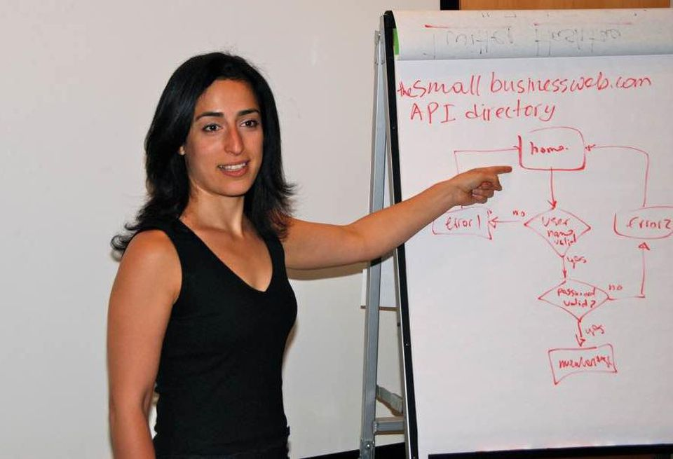

I recently sat down with [Nelly Yusupova](https://www.linkedin.com/in/digitalwoman/), a CTO & Startup Advisor with 18 years of experience in the tech industry. Throughout our conversation, she shared a number of tips and insights on exactly what you should do as a non-technical founder before you begin your search for a technical partner.

To give you just a taste of what’s coming, one question that came up is one of the most contentious points of discussion in the startup world...

Should you hire a CTO to build your startup product or outsource to a software development company?

While there are [pros and cons to both approaches](https://altar.io/whats-the-best-way-to-build-your-startup-cto-freelancers-agency/), Nelly argued that, as an early-stage startup, you should outsource your product development and earn a CTO or technical co-founder.

And, as a Founder and Mentor myself,  I couldn’t agree more.

She talked about how speed and a short time to market are key to a startups success, and that in waiting to find the perfect CTO you could miss your market opportunity.

Furthermore, she pointed out that bringing your MVP to market will actually attract potential CTOs to your company.

/\* widget: Blog: Simple Quote \*/  /\* reset -------------------- \*/  .blog-custom-block \*,  .blog-custom-block ::before,  .blog-custom-block ::after {  box-sizing: border-box;  border-width: 0;  border-style: solid;  border-color: #e5e7eb;  }  /\* vars -------------------- \*/  .blog-custom-block.blog-custom-block\_\_simple-quote {  --color-accent: #0FA4EA;  --color-bg: #F4FAFE;  --color-text-2: #4A4A68;  }  /\* colors -------------------- \*/  .blog-custom-block.blog-custom-block\_\_simple-quote .bg-clr-bg {  background-color: var(--color-bg);  }  .blog-custom-block.blog-custom-block\_\_simple-quote .border-clr-accent {  border-color: var(--color-accent);  }  .blog-custom-block.blog-custom-block\_\_simple-quote .text-clr-text-2 {  color: var(--color-text-2);  }  /\* utils -------------------- \*/  .blog-custom-block.blog-custom-block\_\_simple-quote .flex {  display: flex;  }  .blog-custom-block.blog-custom-block\_\_simple-quote .flex-shrink-0 {  flex-shrink: 0;  }  .blog-custom-block.blog-custom-block\_\_simple-quote .flex-col {  flex-direction: column;  }  .blog-custom-block.blog-custom-block\_\_simple-quote .gap-4 {  gap: 1rem;  }  .blog-custom-block.blog-custom-block\_\_simple-quote .rounded-xl {  border-radius: 0.75rem;  }  .blog-custom-block.blog-custom-block\_\_simple-quote .border-l-6 {  border-left-width: 6px;  }  .blog-custom-block.blog-custom-block\_\_simple-quote .p-8 {  padding: 2rem;  }  .blog-custom-block.blog-custom-block\_\_simple-quote .text-xl {  font-size: 1.25rem;  line-height: 1.75rem;  }  .blog-custom-block.blog-custom-block\_\_simple-quote .italic {  font-style: italic;  } 

It’s about traction. Showing technical stakeholders that this isn’t just an idea. It’s a painkiller and people want it. Look what I’ve already done without you, imagine what we can achieve together.

You can find the full interview below, where Nelly shares how to set yourself for success as you look for a technical partner for your startup.

## Interview with CTO & Startup Tech Advisor Nelly Yusupova

#### Paolo: Nelly, can you start off by telling us a bit about yourself?

**Nelly:** I’m a [CTO, Startup Tech Advisor, Speaker & Entrepreneur](https://www.digitalwoman.com/). My main project is [TechSpeak for Entrepreneurs](https://www.techspeakforentrepreneurs.com/) where I teach non-tech entrepreneurs the entire process for managing development teams and projects as a non-tech entrepreneur who doesn’t know how to code.

I’ve been doing that since 2012. As a result, I work a lot with startups as an outsourced CTO helping them put together their strategies to effectively execute their startup products & services.

#### P: Can you tell us a bit about your tech career?

**N:** I’m a techie now, but I actually come from a very non-tech background. I immigrated to the US from Tajikistan in the early 90s. In college,  I decided to go into computer science because I knew that if I went into computers, I was always going to have a job and make money.

But in fact, I had no concept of what that meant...at the time I thought computer science would just teach me how to use Microsoft Word and Excel really well.

A lot of my work with non-tech entrepreneurs comes from that understanding of the pain of not knowing anything about tech and learning it as an adult. I have that empathy for non-technical entrepreneurs because that’s where I came from.

Growing up, I never thought I was going to be an entrepreneur. I always had that notion that you had to work at a big company to be successful and I was on that path.

But I caught the entrepreneurial bug when I applied and landed an internship at an early stage tech startup, Webgrrls International.  Their mission was to get more women online and the moment I joined them, my career trajectory completely shifted.

The opportunities to learn and the diversity of responsibilities that you can take on in an early-stage startup are incredible and I learned a LOT.

**I was running the entire tech department for the company before I graduated college.**

But I had always wanted to work in big corporate America. Looking for job security, training, big infrastructure and when I went over to big corporate America, I discovered it was not the Shangrila that I thought it was.

The culture shock of doing everything at Webgrrls and then being a small fish in a huge pond was really discouraging for me. 11 months later, I decided to jump back to Webgrrls when they gave me the opportunity to be CTO.  I felt I was way more grounded and could have far more impact, not only on the company where I worked, but also on the lives that we touched as a company.

This was definitely a pivotal moment for my career.  I learned so much on the job.  Not just about tech and how to build and manage teams, but also about business development, marketing and sales.

I basically had to build the product and then sell it.

**I had to understand how all parts of a project fit together. It made me a more well-rounded person and a better CTO.**

In that time I also started speaking and training entrepreneurs at conferences across the country and around the world.  After every conference I spoke at, I had a huddle of entrepreneurs around me sharing their horror stories.

These horror stories were normally around their project getting out of control. It wasn’t uncommon to hear them waste $60k - $100k of their seed funding on bad tech because they didn’t know what they were doing.

At first, I was blaming the developers. I didn’t understand how they could be taking advantage of these poor non-tech entrepreneurs and still stay in business.

But then I realised that some of the entrepreneurs didn’t know the right questions to ask. They didn’t know the process behind properly communicating with development teams. Which meant they couldn’t see the red flags when they appeared.

That’s what led me to create TechSpeak for Entrepreneurs. I wanted to share my process for managing teams and projects so entrepreneurs could minimise the mistakes and ultimately get their power back. I aim to give them the ability to have that conversation and get their startups on the right path from the beginning.

Related: [Critical Steps to Select The Right Technical Partner To Help You Build a Startup](https://altar.io/finding-the-right-tech-partner-for-your-startup/)

#### P: Let’s talk more about TechSpeak. When did that start?

The first TechSpeak I did was in 2012, it was an in-person Bootcamp. For many years I did it as a weekend Bootcamp where entrepreneurs would come and learn from me over two days.

 Post-COVID TechSpeak is completely online. Which gives me a huge opportunity to reach entrepreneurs on a global scale.

Something I’ve found is that TechSpeak can even improve the entrepreneur-software development company relationship.

It makes the agency’s job so much smoother because they’re talking to an entrepreneur that understands their work and processes.

**Until you know what goes into a job, you’re not going to be able to hire the right stakeholder, whether that’s in-house or outsourcing.**

I believe all entrepreneurs, especially CEOs, need to know enough about everything to speak the language and communicate properly. Regardless of if that’s finance, marketing, tech, the list goes on.

And it goes beyond communication. It affects hiring as well. If you know the processes behind every job you’re better equipped to hire the best candidate.

/\* widget: Blog: Expert Tip - Quotes \*/  /\* reset -------------------- \*/  .blog-custom-block \*,  .blog-custom-block ::before,  .blog-custom-block ::after {  box-sizing: border-box;  border-width: 0;  border-style: solid;  border-color: #e5e7eb;  }  /\* vars -------------------- \*/  .blog-custom-block.blog-custom-block\_\_expert-tip {  --color-bg: #F4FAFE;  --color-border: rgb(15 164 234 / 0.50);  --color-text-1: #0F172A;  --color-text-2: #4A4A68;  }  /\* colors -------------------- \*/  .blog-custom-block.blog-custom-block\_\_expert-tip .bg-clr-bg {  background-color: var(--color-bg);  }  .blog-custom-block.blog-custom-block\_\_expert-tip .border-clr-border {  border-color: var(--color-border);  }  .blog-custom-block.blog-custom-block\_\_expert-tip .text-clr-text-1 {  color: var(--color-text-1);  }  .blog-custom-block.blog-custom-block\_\_expert-tip .text-clr-text-2 {  color: var(--color-text-2);  }  /\* utils -------------------- \*/  .blog-custom-block.blog-custom-block\_\_expert-tip .flex {  display: flex;  }  .blog-custom-block.blog-custom-block\_\_expert-tip .flex-shrink-0 {  flex-shrink: 0;  }  .blog-custom-block.blog-custom-block\_\_expert-tip .flex-col {  flex-direction: column;  }  .blog-custom-block.blog-custom-block\_\_expert-tip .gap-4 {  gap: 1rem;  }  .blog-custom-block.blog-custom-block\_\_expert-tip .gap-5 {  gap: 1.25rem;  }  .blog-custom-block.blog-custom-block\_\_expert-tip .rounded-xl {  border-radius: 0.75rem;  }  .blog-custom-block.blog-custom-block\_\_expert-tip .border {  border-width: 1px;  }  .blog-custom-block.blog-custom-block\_\_expert-tip .p-8 {  padding: 2rem;  }  .blog-custom-block.blog-custom-block\_\_expert-tip .text-3xl {  font-size: 1.875rem;  line-height: 2.25rem;  }  .blog-custom-block.blog-custom-block\_\_expert-tip .text-lg {  font-size: 1.125rem;  line-height: 1.75rem;  }  .blog-custom-block.blog-custom-block\_\_expert-tip .font-bold {  font-weight: 700;  } 

Expert Tip

Most startups fail because of some sort of HR dynamic. The vision might be good, the market might be good but if your team can’t execute against it then you’re already one foot in the grave.

[**Yaron Samid**](https://www.linkedin.com/in/yaronsamid/)**, Serial Entrepreneur & Startup Founder**

#### P: As a tech advisor, which entrepreneurial stage are you more focused on?

**N:** With TechSpeak, I focus on early-stage entrepreneurs. From a marketing angle that’s the niche.

That being said, I’ve had people from all walks of life, even founders who had CTOs and a team already in place, take TechSpeak to learn my process so they can optimize theirs.  Once they’ve put my process into action they realise that it’s so much more efficient than what they were doing before.

And for me, having good processes is the most important thing.

**A good process creates transparency throughout the entire project.**

It will help you know exactly when things are going wrong so that you can prevent them from costing you a lot of time. After all, the sooner you fix something, the less money you’re spending on course correction.

**No matter what stage of a company you’re in, you should always be focused on the process and improving that process because that will improve your execution.**

Personally, my goal is to improve my processes by 1% every deploy I do.

##### Looking for Software Development Services?

Get straight to the point, jargon-free advice from a tech expert that has been building award-winning Startups for the past 10 years.

Let's Talk

#### P: Many corporations aren’t very efficient when it comes to executing software projects in a modern way.

#### Do you have corporations coming to you asking for your advice?

**N:** My process is based on lean and agile methodologies – the de facto, modern way to build software products.

Unfortunately, a lot of big corporations are still very much set in their ways.

And often you can’t even blame them. There’s so much bureaucracy around the way they’re structured that it’s very hard for them to move in a new direction.

Having said all of that, I’ve had people from corporations send one or two of their people to come and join a TechSpeak Bootcamp.

This would usually be a Project Manager of a smaller group that they run. Then, once they’ve seen the process many would then invite me to come and speak with their team.

It shows that on a department level, there are people saying you know “we want to change things here”. On a company level, however, I’m not seeing that just yet. It's harder for them.

But that’s a huge advantage for startups.

**Speed is your number one asset as a startup. Startups are able to move much faster than traditional companies thanks to lean and agile.**

Related: [How to Build a Successful Minimum Viable Product (MVP) in 3 Steps](https://altar.io/features-inside-mvp-3-steps-know-answer/#how-to-build-an-mvp-3-steps)

#### P: You’ve led me perfectly to my next question. As you’ve just mentioned when you’re launching a company you need to build the product and get to market quickly.

#### You have multiple options whether it’s a CTO, an agency or hiring a team of freelancers.

#### What’s your take on this decision and what would you say to an entrepreneur trying to make this choice?

**N:** This is the number one question that everyone struggles with. It’s very very hard to find the perfect tech stakeholder.

Fundamentally because technical people who are willing to take a risk on a startup are already building their own product. They don’t need an idea person.

So, the challenge that startups have, is convincing technical stakeholders who have high-paying, secure jobs to take a risk on their startup. A startup with no traction at the ideation stage in an ecosystem where around [two out of ten startups fail in their first year](https://www.investopedia.com/articles/personal-finance/040915/how-many-startups-fail-and-why.asp#:~:text=In%202019%2C%20the%20failure%20rate,70%25%20in%20their%2010th%20year.).

So a lot of founders spend anywhere between [six months to a year, or more](https://altar.io/building-a-startup-without-a-technical-co-founder/), looking for that technical person to no avail. In the meantime, the big risk that they run is they **miss the market opportunity**.

One concept that I teach at TechSpeak that resonates really well with startup founders is the notion of **earning a technical co-founder**.

What you do is you build your MVP and build a community around your idea.  This not only shows off your marketing skills, it proves you’re not just an idea person but you can actually sell and market the product.

To build the MVP, you’re going to want to go with an agency or a team of freelance developers.

This is the fastest way to actually get your idea into the market so that you can get traction and essentially de-risk the opportunity for a potential technical co-founder.

By showing them you’re more than just an idea person, it changes the conversation from “I need you!” to “Here’s a great opportunity!”.

This doesn’t just go for technical stakeholders either. This will also help you get investors. All investors want traction nowadays. They’re not going to give you money unless you have traction.

**Launching your early MVP and gaining traction will really help you attract technical people because you’ve taken the risk out of that opportunity for them.**

And with the ability to communicate with technical stakeholders, you’ll find that you can effectively build an MVP without investing too much of your budget.

But there’s something else you have to do while all this is going on.

Let’s say you hire an agency and they start to build your MVP with a three to a five-month timeline.

Parallel to that, you’re going to start looking for that technical co-founder or CTO.

You’re going to start joining tech communities and building your network. Start to talk to people.

And, hopefully, by the time you start having those conversations your MVP is going to have enough traction that it will be a no brainer for the tech co-founder or CTO to at least consider you.

Related: [How to Find a CTO for Your Startup: The Founder's Guide](https://altar.io/how-to-find-a-cto-for-your-startup-the-founders-guide/)

I get inquiries from people every day, asking me to join their startup.

It only becomes an interesting conversation when they say “Look what we’ve built, and the traction we’ve gained. The market needs this."

**It’s about traction. Showing technical stakeholders that this isn’t just an idea. It’s a painkiller and people want it. Look what I’ve already done without you, imagine what we could achieve together. From a CTO or technical perspective, that’s how you get someone’s attention.**

/\* widget: Blog: Expert Tip - Quotes \*/  /\* reset -------------------- \*/  .blog-custom-block \*,  .blog-custom-block ::before,  .blog-custom-block ::after {  box-sizing: border-box;  border-width: 0;  border-style: solid;  border-color: #e5e7eb;  }  /\* vars -------------------- \*/  .blog-custom-block.blog-custom-block\_\_expert-tip {  --color-bg: #F4FAFE;  --color-border: rgb(15 164 234 / 0.50);  --color-text-1: #0F172A;  --color-text-2: #4A4A68;  }  /\* colors -------------------- \*/  .blog-custom-block.blog-custom-block\_\_expert-tip .bg-clr-bg {  background-color: var(--color-bg);  }  .blog-custom-block.blog-custom-block\_\_expert-tip .border-clr-border {  border-color: var(--color-border);  }  .blog-custom-block.blog-custom-block\_\_expert-tip .text-clr-text-1 {  color: var(--color-text-1);  }  .blog-custom-block.blog-custom-block\_\_expert-tip .text-clr-text-2 {  color: var(--color-text-2);  }  /\* utils -------------------- \*/  .blog-custom-block.blog-custom-block\_\_expert-tip .flex {  display: flex;  }  .blog-custom-block.blog-custom-block\_\_expert-tip .flex-shrink-0 {  flex-shrink: 0;  }  .blog-custom-block.blog-custom-block\_\_expert-tip .flex-col {  flex-direction: column;  }  .blog-custom-block.blog-custom-block\_\_expert-tip .gap-4 {  gap: 1rem;  }  .blog-custom-block.blog-custom-block\_\_expert-tip .gap-5 {  gap: 1.25rem;  }  .blog-custom-block.blog-custom-block\_\_expert-tip .rounded-xl {  border-radius: 0.75rem;  }  .blog-custom-block.blog-custom-block\_\_expert-tip .border {  border-width: 1px;  }  .blog-custom-block.blog-custom-block\_\_expert-tip .p-8 {  padding: 2rem;  }  .blog-custom-block.blog-custom-block\_\_expert-tip .text-3xl {  font-size: 1.875rem;  line-height: 2.25rem;  }  .blog-custom-block.blog-custom-block\_\_expert-tip .text-lg {  font-size: 1.125rem;  line-height: 1.75rem;  }  .blog-custom-block.blog-custom-block\_\_expert-tip .font-bold {  font-weight: 700;  } 

Expert Tip

If you have cash, want to launch fast, and don’t know lots of developers then pay a quality shop to ship.

[**Alexander Jarvis**](https://www.linkedin.com/in/alexanderdjarvis/)**, Startup Mentor & Founder**

#### P:  We’ve seen a lot of literature on what an entrepreneur should be looking for in a CTO or technical co-founder.

#### What we haven’t seen a lot of is what the technical co-founder is looking for in a startup.

#### In your experience, what do you look for in an entrepreneur's profile, what do you value on the business side?

**N:** I think it depends on the CTO and their level of expertise.

Before we dive into this I want to set something straight.

**The role of a CTO varies radically depending on the stage of a startup.**

If you’re in the early stages of a startup and you’re saying you need a CTO, **you don’t.** 

What you’re actually looking for is **a developer who will work for equity**. “CTO” at that stage is just a title. It’s a marketing tool.

#### P: It’s a bit like saying you’re the CEO and you look at the company and there are only two employees.

**N:** Exactly!

In the early stages of a startup, there's probably only one developer and very little management. The big problem that people run into is, as the company grows, the developer is unable to step into the role of a real CTO.

By that I mean, the visionary, the person who possesses not just the tech skills but also the soft skills. People skills, management skills, communication skills to be able to talk to both technical and non-technical stakeholders.

Those really valuable skills that a true CTO should have.

It’s like my career.

**When I started, I had the CTO title, but really I was just a developer. I had to grow into that role.**

Some technical people either:

- Aren’t interested in the management side because all they want to do is write code.
- Or, they can’t grow into that role, because they simply don’t have the soft skills a good manager needs.

You have to make the distinction and the skills you look for in a CTO will vary depending on which stage your startup is in.

So to go back to the original question _“What does a CTO look for in a startup?”_ I would say a lot of it comes down to the technical stakeholders’ experience and where you’re at personally.

For example, if you have a family, you’re very unlikely going to want to work purely for equity. It’s too big of a risk.

Comparatively, if you’re a single person who’s just starting out you’re able to take a bigger risk.

Where that person is in their life is going to dictate what a CTO might look for in a startup. The earlier the startup, the bigger the risk. So, they might ask for different things, they may ask for:

- Salary
- Equity split & salary
- Equity split – and if you’re making them a co-founder you have to give them a bigger split.

These are conversations that need to happen to determine what’s important to the CTO.

Some CTOs are interested in certain types of projects because it’s what they’re passionate about. Let’s say you’re trying to attract a CTO and they’re just not interested in your industry. It’s going to be very hard to convince them to join you. Even if you have traction as we mentioned before.

There are some CTOs who want to work with a certain technology. Again, if you’re not using that technology that they want to use they’re not going to be easy to convince.

Or maybe they’re into deep tech stuff and you’re just using tech as a vehicle, they may not be interested in that. They will probably want a project where they have to work on hard tech problems.

Just like when talking to investors you have to have the right expectations. You’re not going to approach every investor pitching your idea, you have to do the research to find the right one for your project.

The same goes for a CTO.

**Finding a CTO is not just about the right skills, it's about project fit and cultural fit as well. That’s why it’s so difficult.**

And cultural fit shouldn’t be underestimated. You may get through the interview process with a potential CTO and everything looks great on paper. But if they’re not the right cultural fit then you have to say no.

Hiring for cultural fit is especially important for early-stage startups because the early hires are going to be responsible for the first ten hires of your startup which will set the culture of the company.

**If you don’t hire for cultural fit right from the beginning then you’re going to have a tough time getting the culture right.**

It’s not enough to just find someone with the right technical skills because a CTO is much more than that.

#### P: What do you look for in the non-tech founder’s profile?

**N:** Let’s say a founder came to me and they presented me with an opportunity. Unless it’s a life-changing opportunity, it’s going to be a tough ask for me to leave everything I’m doing personally to join their startup.

The second requirement for me is that the founder has to be a rockstar at what they do. By that I mean they have the DNA qualities that I look for:

- Positivity
- Love of learning
- Get it done attitude
- Visionary - ability to see the big picture

Those to me are vital qualities for a founder to have for us to grow together.

They also have to be complementary to my skillset. We can’t be exactly the same.

They have to amplify who I am and I have to be able to do the same for them. Only then can it be a great partnership in my opinion.

Related: [My Experience Building a Tech Startup Without a Technical Co-Founder](https://altar.io/building-a-startup-without-a-technical-co-founder/)

#### P: Now let’s talk a bit about onboarding a software development agency.

#### In your experience, what should entrepreneurs consider as they look for an agency to build their MVP?

**N:** I think an agency that allows for a lot of transparency and also that allows the founder to stay involved in the project.

Some of the agencies that I have experience with want to keep things closed, they don’t want the founder to be involved. That’s a mistake.

An agency that says, “Come in, be involved, join our daily stand-ups”, shows me that the agency isn’t hiding anything.

It not only shows that they’re willing to work with you. It shows that they’re willing to educate you as well. As an entrepreneur, you need to see the inside of the process. So when you finish the agency relationship you understand why the decisions have been made and how they impact the business.

If the agency makes every decision for you then when you move on from the relationship you find yourself in a situation where your new CTO says “We have to recode everything.” Which is ridiculous.

If the entrepreneur or someone from the founding team stays involved in the process and participates and understands the decision-making process. Then they already have the valuable knowledge they need if/when they decide to bring the team in house.

I think that’s the most important thing to think about when working with an agency.

#### P: What other advice do you have for entrepreneurs who’re just starting their journey?

**N:** Become [tech literate](https://altar.io/what-the-non-technical-entrepreneur-needs-to-know-about-tech/).

That’s the number one advice I have for any non-technical founder. Having that knowledge is going to completely transform the way you see and make connections with tech.

All of a sudden things will make sense. You’ll see things in the future that you wouldn’t have been able to see before.

The confidence you get from being tech literate is going to change how other technical people perceive you. You’re going to be able to attract technical people just because you’re able to communicate with tech stakeholders more effectively.

For example, I had someone who attended TechSpeak, who was able to get into an accelerator without the required technical co-founder simply because she was able to confidently communicate how she was going to work with and effectively manage an outsourced team of developers.

So it didn’t matter that she didn’t have a technical team behind her because she had the confidence and knew how the tech was going to be managed and that gave the accelerator enough confidence to accept her. That’s life-changing.

Related: [Founder's Guide: How to Outsource Software Development](https://altar.io/founders-guide-how-to-outsource-software-development-2020/)

#### P: What do you mean by “become tech literate”? What’s the minimum knowledge an entrepreneur requires to be considered tech literate?

**N:**  When I say tech literate I mean in terms of building a product. Become knowledgeable about the web, how things work, what’s behind the scenes? When you click the button on the browser what happens on the backend?

Understand servers, how all of that communication happens. Learn about all the different languages and how they work together. Understand APIs, databases and libraries.

Understand the high levels of what goes on behind the scenes of your product. That’s what will give you the confidence to have those conversations.

So if someone on your technical team says “What do you think about this?” you can respond.

It’s going to take time but it’s well worth the investment. You have to understand the different steps that go into building a product. Then you can set the expectations in your mind and with your team, on how things should work.

#### P: Is it more important to focus on tech literacy or focus on managing people for a non-tech founder?

**N:** I think in the early days you should focus more on tech literacy because there’s very little management. You’re not focusing on building a team at that point and you probably only have two or three people to manage.

At that point management is really being a good person, listening, making sure things are getting done – that’s it.

Management becomes a bigger deal as your team grows. As levels of communication become removed because your team is so much bigger.

When the team is small, management is easier in my mind. But building your product correctly is vital.

So at the start, I would advise focusing on tech literacy – especially if you have no tech knowledge at all.

Understanding the process is going to save you thousands of dollars on getting your product right. It will ensure you build it in a way that will set you up for success.

Then, as you build the product and understand what’s important, it’s going to be easier to delegate and trust the decision making of the people around you. You should stay involved, of course, but you can take a half step back because you understand the inner workings of your product.

I can guarantee that the CEO of Slack doesn’t know every single feature of the product. But in the early days, I’m willing to bet he did. The role of a CEO changes as a startup grows just as the role of a CTO does.

In the early days, you need to be very much involved in the product so it gets to a point where you understand what makes your product unique and why people buy it.

Once the product and business are figured out and your team grows then you’re focused on managing.

Having said all of that, focusing on culture is important from day one. Even defining the five words that become your startups DNA values and hiring everyone based off of that – it’s going to make a big difference.

Then the management of people with those qualities almost doesn’t need to happen when the team is small. Because they’re so much aligned with the work you’re doing.

## Thank You, Nelly

I really appreciate Nelly taking the time out of her busy schedule to share these valuable insights with me.

To know more about Nelly and her work, head over to [DigitalWoman](http://digitalwoman.com/).

## FAQs Around the Topics Explored in This Interview

### Should you hire a CTO to build your MVP?

Hiring a CTO for your startup is the most idyllic option when building a startup. That being said, finding **the right** CTO is an extremely difficult and time-consuming process.

Instead of slowing down your time to market, consider hiring a software development company or a team of freelance developers.

This way you can launch your MVP and start gaining traction and prove yourself in the market. Meanwhile, search for your CTO without rushing the process.

### How can I reduce my time to market as I begin product development?

[Building a Minimum Viable Product (MVP)](https://altar.io/features-inside-mvp-3-steps-know-answer/) is one of the best ways to reduce your time to market and launch quickly.

Building an MVP not only helps reduce your time to market, it also allows you to reduce your costs and ensure your product development is user-centric.

### What’s the role of a CTO in a Startup?

The role of a CTO will vary depending on the stage of your startup. That being said, the [role of the CTO requires more than just good technical, hard skills](https://altar.io/how-to-find-a-cto-for-your-startup-the-founders-guide/).

As your development team grows, your CTO needs to have the soft skills to lead and motivate them.

More than this, it’s essential that your CTO is up to date with the latest technologies, and has a vision for your company's tech needs as your startup grows.

### What’s the difference between a CTO & a Technical Co-Founder?

A Technical Co-Founder is usually someone who has been with you since day zero. Think Steve Jobs and Steve Wozniak. They also usually have a large chunk of the company, and sometimes will own as much as you.

In contrast, a CTO is an early, key hire to the executive team. While they may still be compensated (in part) with equity, it’s very unlikely they will be an equal owner in your company.

### How do I Choose a Software Development Company?

Choosing a software development company is a critical decision for your startup.

To ensure you [choose the right software development company for your startup](https://altar.io/founders-guide-how-to-outsource-software-development-2020/) you need to:

1. Validate the quality of their previous work.
2. Ensure they’re experts in the technology needed to build your product.
3. Make sure they’re quoting an appropriate budget. Remember, if you pay peanuts, you’ll probably get monkeys.
4. Check that they offer flexibility in terms of team size and time allocation.
5. Ensure they demonstrate a desire to be involved and invested in your project.
6. It’s vital that the agency you choose follows Lean, Product-Centric development processes.
7. Make sure they’re clear about the process, roadmap, and how long it will take to achieve your project goals.
8. Communication is vital to a successful partnership with a software development company.
9. It’s important that the agency you choose understands your idea and business vision, and has a working culture that aligns with yours.
10. Finally, you need to ensure that the IP of your product is in your hands, otherwise, you may get stuck into a legal lock-in, where you are unable to bring your development in-house.

### As a Non-Technical Founder, Should I Learn to Code?

As a non-technical founder, you should be focusing on your business vision, growth and strategy. Learning to code is not going to help you move your business forward.

That being said I recommend [learning the basics of tech](https://altar.io/what-the-non-technical-entrepreneur-needs-to-know-about-tech/) so you can follow the conversation with potential tech stakeholders and understand what goes into developing your product.
