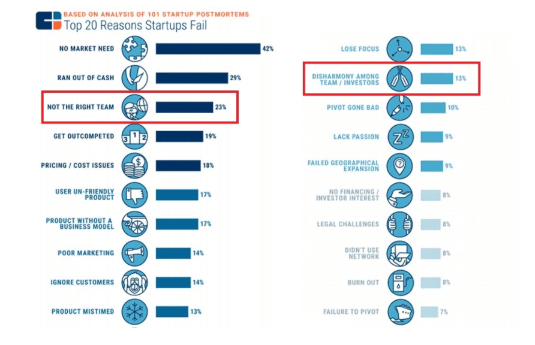

Since leaving the corporate world, and jumping into entrepreneurship I’ve been a founder of three startups.

In that time I’ve seen my fair share of co-founders – both good and bad. Whether it’s in the co-founding teams I’ve built myself, or co-founding teams I meet thanks to the work I do at Altar.io.

Through all of these experiences,  I’ve come to realise that the majority of successful co-founders share several key characteristics.

And while finding someone with all these traits won’t spell success, it will decrease your chances of failure.

 Throughout this article, I’ll dig into these eight traits and share with you why they’re so important.

Before I do that, however, I think it’s important to share three vital “ground rules” I’ve used when I need to find a co-founder

.elementor-12941 .elementor-element.elementor-element-e56f4e6{--display:flex;--flex-direction:column;--container-widget-width:100%;--container-widget-height:initial;--container-widget-flex-grow:0;--container-widget-align-self:initial;--background-transition:0.3s;}.elementor-12941 .elementor-element.elementor-element-f8d1905{--box-background-color:var( --e-global-color-f6f9b04 );--box-border-color:var( --e-global-color-secondary );--box-border-width:1px;--box-border-radius:12px;--box-padding:12px;--header-color:var( --e-global-color-text );--separator-width:0px;--item-text-decoration:underline;--item-text-hover-decoration:underline;--marker-color:var( --e-global-color-primary );--marker-size:5px;}.elementor-12941 .elementor-element.elementor-element-f8d1905 .elementor-toc\_\_spinner{color:var( --e-global-color-secondary );fill:var( --e-global-color-secondary );}.elementor-12941 .elementor-element.elementor-element-f8d1905 .elementor-toc\_\_header, .elementor-12941 .elementor-element.elementor-element-f8d1905 .elementor-toc\_\_header-title{font-family:"Poppins", sans-serif;font-size:2.25rem;font-weight:700;text-transform:capitalize;line-height:1.2;}.elementor-12941 .elementor-element.elementor-element-f8d1905 .elementor-toc\_\_list-item{font-family:var( --e-global-typography-45f602c-font-family ), sans-serif;font-size:var( --e-global-typography-45f602c-font-size );font-weight:var( --e-global-typography-45f602c-font-weight );line-height:var( --e-global-typography-45f602c-line-height );letter-spacing:var( --e-global-typography-45f602c-letter-spacing );word-spacing:var( --e-global-typography-45f602c-word-spacing );}.elementor-12941 .elementor-element.elementor-element-f8d1905 > .elementor-widget-container{padding:32px 32px 32px 32px;}@media(max-width:1024px){.elementor-12941 .elementor-element.elementor-element-f8d1905 .elementor-toc\_\_list-item{font-size:var( --e-global-typography-45f602c-font-size );line-height:var( --e-global-typography-45f602c-line-height );letter-spacing:var( --e-global-typography-45f602c-letter-spacing );word-spacing:var( --e-global-typography-45f602c-word-spacing );}}@media(max-width:767px){.elementor-12941 .elementor-element.elementor-element-f8d1905 .elementor-toc\_\_list-item{font-size:var( --e-global-typography-45f602c-font-size );line-height:var( --e-global-typography-45f602c-line-height );letter-spacing:var( --e-global-typography-45f602c-letter-spacing );word-spacing:var( --e-global-typography-45f602c-word-spacing );}}

#### Contents

## The Ground Rules of Finding a Startup Co-Founder

### Rule #1: Intellectually & Personally Humble People

I truly believe this trait is crucial not only when looking for a co-founder. Instead, this trait should be present in all the people we trust.

Egocentricity can kill a startup.

You need to find people who not only know their strengths but also know their weaknesses. Your co-founder needs to be able to delegate tasks to someone who is better at it than them, as opposed to doing themselves to save their ego.

For example, if I’m building an MVP, I’m not going to code it myself for the sake of my ego. I’m going to delegate to someone who knows how to code because that will lead to a higher chance of a successful startup.

In my experience, it doesn’t matter if you find a co-founder with all of the other traits I will talk about here. If they don’t have this essential one, they simply won’t work out.

The next important point to note is that if you want to find the perfect co-founder, it’s going to take time.

### Rule # 2: Don’t be in a Rush to Find a Co-Founder –  it’s Not a Summer Date

Picture this: you’re excited because of the great two months in front of you.

You’re on Ipanema beach with an ice-cold Caipirinha enjoying the sunset and Kygo’s playlist in the background…

You meet a good-looking person showing off their dancing skills on the patio. Yes! An expert dancer is exactly the kind of person you wanted to spend the summer with.

You start dating, everything is going great, but summer is coming to an end. Naturally, both of you will come back to real life soon.

Have you already planned for that? Of course not, great times make you forget any future problems!

When it comes to your co-founder you’re in exactly the same position as you would be on that beach in Ipanema (maybe minus the Caipirinha).

Everything is exciting, you’re meeting amazing people with great skills. You feel like Zuck Jr.

But it’s important to remember that the first “great dancer” you meet may not be the best co-founder for you.

Co-founding a startup is less like a summer romance, and a lot more like a marriage. You’re going to spend countless hours working right next to this person. Your relationship needs to weather any storm that comes your way.

This brings me to one last important rule before we get to the list:

### Rule #3: Your Best Friend is Not Automatically the Best Co-Founder

I’m not saying don’t launch a business with friends. There are times it can work well.

There are some hurdles here to avoid, however. Firstly, if you want to pursue a business relationship with a friend, do they have the right technical skillset?

Secondly, be honest with yourself. Can your relationship survive the struggles startups face?

If the answer to either of these questions is no, don’t mix friendship and business. Or you may end up harming both.

If the answer to both of these questions is yes, great!

Just ensure you keep everything professional.

Just because they’re your friend doesn’t mean you should ignore the best practices of onboarding a co-founder.

In other words, everything still needs to be in writing – [and you should get a lawyer to help you with this](https://altar.io/expert-interview-startup-lawyers/).

Finally, here are the eight traits you need to consider when looking for a co-founder:

##### Do you have a brilliant startup idea that you want to bring to life?

From the product and business reasoning to streamlining your MVP to the most important features, our team of product experts and ex-startup founders can help you bring your vision to life.

Let's Talk

## 1\. Technical Hard Skills

Any successful startup needs hard skilled people.

It’s vital that you find a co-founder who is great at what they do. The easiest way to find and validate if someone is extremely good is to look for “proven experience.”

By “proven experience” I mean the particular set of skills that are essential to create and grow a healthy business.

It could be four successful startup exits or three IPOs. Of course, few such people exist out there!

More realistically, it could be related to previous experiences in top high-tech firms or other activities successfully carried out in the past:

- A developer could have developed a game from scratch when he was 17 (bear in mind that tech-wise, specific complex sets of skills depend on the type of business);
- A marketer could have grown his blog about NBA players from 0 to 50k visitors per month while at Uni;
- A CEO could have gathered experience as the leader of a successful student association.

My point is, you can build any type of house that you want but you need concrete for the foundation.

If you don’t find a co-founder with the right hard skills, your house won’t endure the first strong gust of wind.

Related: [How to Find a Technical Co-Founder For Your Startup](https://altar.io/how-to-find-a-technical-co-founder-for-your-startup/)

## 2\. Leadership Skills

Not only do you need to find a co-founder who is a rockstar in their field. You need to find a co-founder with the ability to lead.

With any luck, it won’t be long before you are building a team. You and your co-founder will be responsible for inspiring and motivating them.

Good leadership doesn’t just mean getting the job done. Good leadership also sets the tone of the working culture in your startup.

## 3\. Passion & Commitment

Building a startup is rarely smooth sailing. If your co-founder lacks passion, their commitment will wane when the going gets tough.

This will lead to a breakdown in communication, resentment and your business will suffer.

Therefore,  It’s vital that you find a co-founder who’s as passionate about what you’re going to build as you are (or at least a close second).

## 4\. Zero Fear of Failure

The ability to embrace failure is a crucial characteristic of any co-founder. However, to explain this better I first need to define what I mean by  “failure”.

You might say that spending months of hard work on a product that doesn’t attract any customers is a failure. That doesn’t mean, however, that it wasn’t a valuable process. There’s always something you can learn from it.

/\* widget: Blog: Simple Quote \*/  /\* reset -------------------- \*/  .blog-custom-block \*,  .blog-custom-block ::before,  .blog-custom-block ::after {  box-sizing: border-box;  border-width: 0;  border-style: solid;  border-color: #e5e7eb;  }  /\* vars -------------------- \*/  .blog-custom-block.blog-custom-block\_\_simple-quote {  --color-accent: #0FA4EA;  --color-bg: #F4FAFE;  --color-text-2: #4A4A68;  }  /\* colors -------------------- \*/  .blog-custom-block.blog-custom-block\_\_simple-quote .bg-clr-bg {  background-color: var(--color-bg);  }  .blog-custom-block.blog-custom-block\_\_simple-quote .border-clr-accent {  border-color: var(--color-accent);  }  .blog-custom-block.blog-custom-block\_\_simple-quote .text-clr-text-2 {  color: var(--color-text-2);  }  /\* utils -------------------- \*/  .blog-custom-block.blog-custom-block\_\_simple-quote .flex {  display: flex;  }  .blog-custom-block.blog-custom-block\_\_simple-quote .flex-shrink-0 {  flex-shrink: 0;  }  .blog-custom-block.blog-custom-block\_\_simple-quote .flex-col {  flex-direction: column;  }  .blog-custom-block.blog-custom-block\_\_simple-quote .gap-4 {  gap: 1rem;  }  .blog-custom-block.blog-custom-block\_\_simple-quote .rounded-xl {  border-radius: 0.75rem;  }  .blog-custom-block.blog-custom-block\_\_simple-quote .border-l-6 {  border-left-width: 6px;  }  .blog-custom-block.blog-custom-block\_\_simple-quote .p-8 {  padding: 2rem;  }  .blog-custom-block.blog-custom-block\_\_simple-quote .text-xl {  font-size: 1.25rem;  line-height: 1.75rem;  }  .blog-custom-block.blog-custom-block\_\_simple-quote .italic {  font-style: italic;  } 

Building a company is like jumping off a cliff and building an airplane on the way down.

**\- Reid Hoffman**

Entrepreneurship and startups are all about learning.

Building a startup mirrors the behaviour of a living organism: when you’re ill, your body understands there’s a problem and so recreates newer cells.

If you find out that your market needs something slightly different you iterate, you adapt. And startups are great at that!

You should find a co-founder that behaves the same way.

Research. Plan. Execute. Test.

If something turns out to be unsuccessful, then iterate until you find the right one. It may sound a bit “techie”, but try to imagine your lives as startuppers as if you were software within the agile approach. Always iterating, always adapting.

What if your co-founder makes an unsuccessful decision? Not a problem, as a Fast Learner (as we will see in the next section), they will take their experience into the next attempt, and try something different

I believe that accepting failure well is an innate characteristic. Either a person has it or doesn’t. If he/she doesn’t, they should go for a regular job!

Related: [Expert Interview: How to Hire Top Talent in Startups](https://altar.io/expert-interview-how-to-hire-top-talent-in-startups/)

## 5\. Fast Learner

Now if you fail you learn. If you fail often in small tests, you learn fast and you improve quickly.

You should find a co-founder who is comfortable with this process. You will be alone with them, sitting in your office making the main decisions. And believe me, some of them will have to be made quickly.

You will need to embrace situations where you feel like you don’t have a clue how to solve certain problems. If you find a co-founder who’s a fast learner, they will have no problem doing this. They will focus on researching and analysing everything possible to find the best answer.

There is another added benefit of a “fast learner” co-founder. Your co-founder will most likely be an expert in what they do. However, they should also be able to add insights into the other aspects of your business (technology, marketing, sales, etc.)

If they’re a fast learner, they will quickly be able to keep up with the conversation. And before you know it they will have accrued enough knowledge to bring new ideas to the table.

## 6\. Lateral Thinker

You want to find a co-founder who is a trendsetter – not a trend follower.

You want someone who can evaluate and analyse situations and find new opportunities that can prove fruitful.

Just like Henry Ford in 1908. When everyone wanted faster horses, he launched the Model T.

Just like Steve Jobs, who created a smartphone with one single button when everyone was still addicted to Blackberry’s keyboard.

You want a co-founder that thinks like a customer. Every customer wanted (and still wants) faster ways of transportation. And people still want easy-to-use and powerful smartphones.

As [Michael Templeman](https://medium.com/u/a4f331b76ec2) says in his article [How to Be a Trendsetter](https://www.entrepreneur.com/article/250557), “We are all consumers. We all know what we need, like and think is cool. One way to be a trendsetter is to think like a consumer. What products or services would you love to see?”

## 7\. Alignment & Communication

As I’ve already mentioned, you and your co-founder are about to spend a lot of time working with each other, exclusively.

Therefore you need to find a co-founder you can have a conversation with. In the end, **your co-founder is your partner** - it’s important to connect on a personal level.

**Good communication among co-founders is one of the main conditions for startups to live long enough to succeed.**

More than this, you need to be on the same page when it comes to the critical aspects of your startup. By this I mean:

- Product & company roadmap
- Equity split and salary (for both the founding and future employees)
- Working/company culture (both now and in the future)

Once you find a co-founder, you will both be responsible for these aspects as your company grows. And while I’m not saying you need to agree on everything from day one, you need to be aligned on these high-level factors.

This requires trust and transparency. You need to be candid with each other without things descending into an argument.

So talk, talk, talk. And then talk some more! If you’ve found the right co-founder, all conversations will be productive, even if you disagree.

Talk, talk, talk. And then talk some more. All the discussions will lead to success if there is an endpoint.  If you reach it, as a banker would say - good fundamentals.

/\* widget: Blog: Expert Tip \*/  /\* reset -------------------- \*/  .blog-custom-block \*,  .blog-custom-block ::before,  .blog-custom-block ::after {  box-sizing: border-box;  border-width: 0;  border-style: solid;  border-color: #e5e7eb;  }  /\* vars -------------------- \*/  .blog-custom-block.blog-custom-block\_\_expert-tip {  --color-bg: #F4FAFE;  --color-border: rgb(15 164 234 / 0.50);  --color-text-1: #0F172A;  --color-text-2: #4A4A68;  }  /\* colors -------------------- \*/  .blog-custom-block.blog-custom-block\_\_expert-tip .bg-clr-bg {  background-color: var(--color-bg);  }  .blog-custom-block.blog-custom-block\_\_expert-tip .border-clr-border {  border-color: var(--color-border);  }  .blog-custom-block.blog-custom-block\_\_expert-tip .text-clr-text-1 {  color: var(--color-text-1);  }  .blog-custom-block.blog-custom-block\_\_expert-tip .text-clr-text-2 {  color: var(--color-text-2);  }  /\* utils -------------------- \*/  .blog-custom-block.blog-custom-block\_\_expert-tip .flex {  display: flex;  }  .blog-custom-block.blog-custom-block\_\_expert-tip .flex-shrink-0 {  flex-shrink: 0;  }  .blog-custom-block.blog-custom-block\_\_expert-tip .flex-col {  flex-direction: column;  }  .blog-custom-block.blog-custom-block\_\_expert-tip .gap-4 {  gap: 1rem;  }  .blog-custom-block.blog-custom-block\_\_expert-tip .gap-5 {  gap: 1.25rem;  }  .blog-custom-block.blog-custom-block\_\_expert-tip .rounded-xl {  border-radius: 0.75rem;  }  .blog-custom-block.blog-custom-block\_\_expert-tip .border {  border-width: 1px;  }  .blog-custom-block.blog-custom-block\_\_expert-tip .p-8 {  padding: 2rem;  }  .blog-custom-block.blog-custom-block\_\_expert-tip .text-3xl {  font-size: 1.875rem;  line-height: 2.25rem;  }  .blog-custom-block.blog-custom-block\_\_expert-tip .text-lg {  font-size: 1.125rem;  line-height: 1.75rem;  }  .blog-custom-block.blog-custom-block\_\_expert-tip .font-bold {  font-weight: 700;  } 

Expert Tip: Always Issue Equity with Vesting

To bypass any uncertainty when looking for your co-founder, there is one best practice I truly prefer: equity with a vesting period that has a minimum cliff.

The “vesting period” is a period of time in which a person accrues the pre-agreed equity stake if he accomplishes a certain goal (the goal could just be being fully committed within the company). At the end of this period, the co-founder will be fully vested, meaning he will own the totality of the equity initially granted.

The minimum cliff means that the vesting schedule is not enforceable until a certain period of time from whenever it was initially agreed.

Let me state a simple example:

31st December 2020 - You have found your CTO and you’re planning to assign him 40% of your company. This 40% has a vesting period of 4 years and a minimum cliff of 3 months. That means that he will be assigned 10% each year and the vesting schedule will start on the 1st of April 2021.

If he stays in the company, he will be assigned:

- 10% on 1/4/2022
- 10% on 1/4/2023
- 10% on 1/4/2024
- The final 10% on 1/4/2025.

At the end of the four years, he will own the totality of the equity initially granted. Again I would always recommend getting legal counsel to be on the safe side.

Related: [Lessons I've Learned Mentoring and Co-Founding Successful Startups](https://altar.io/lessons-ive-learned-virgin-mentor/)

## 8\. Obsessed with Perfection

You should find a co-founder who is as obsessed with product/service perfection as you are. The main daily focus for both of you will be the product that you’re building.

What do I mean when I say obsessed with perfection? I mean a commitment to making an innovative, disruptive, product that is better than your competitors’ (otherwise why are you doing it?).

Customers are increasingly sceptical of lousy services - and can spot them quicker than you think.

So, if you do something, be sure that all the aspects (UX, UI, Speed, Customer Service, Marketing) are well thought out beforehand and executed flawlessly.

Justine Musk (Elon Musk’s former wife) said:

/\* widget: Blog: Simple Quote \*/  /\* reset -------------------- \*/  .blog-custom-block \*,  .blog-custom-block ::before,  .blog-custom-block ::after {  box-sizing: border-box;  border-width: 0;  border-style: solid;  border-color: #e5e7eb;  }  /\* vars -------------------- \*/  .blog-custom-block.blog-custom-block\_\_simple-quote {  --color-accent: #0FA4EA;  --color-bg: #F4FAFE;  --color-text-2: #4A4A68;  }  /\* colors -------------------- \*/  .blog-custom-block.blog-custom-block\_\_simple-quote .bg-clr-bg {  background-color: var(--color-bg);  }  .blog-custom-block.blog-custom-block\_\_simple-quote .border-clr-accent {  border-color: var(--color-accent);  }  .blog-custom-block.blog-custom-block\_\_simple-quote .text-clr-text-2 {  color: var(--color-text-2);  }  /\* utils -------------------- \*/  .blog-custom-block.blog-custom-block\_\_simple-quote .flex {  display: flex;  }  .blog-custom-block.blog-custom-block\_\_simple-quote .flex-shrink-0 {  flex-shrink: 0;  }  .blog-custom-block.blog-custom-block\_\_simple-quote .flex-col {  flex-direction: column;  }  .blog-custom-block.blog-custom-block\_\_simple-quote .gap-4 {  gap: 1rem;  }  .blog-custom-block.blog-custom-block\_\_simple-quote .rounded-xl {  border-radius: 0.75rem;  }  .blog-custom-block.blog-custom-block\_\_simple-quote .border-l-6 {  border-left-width: 6px;  }  .blog-custom-block.blog-custom-block\_\_simple-quote .p-8 {  padding: 2rem;  }  .blog-custom-block.blog-custom-block\_\_simple-quote .text-xl {  font-size: 1.25rem;  line-height: 1.75rem;  }  .blog-custom-block.blog-custom-block\_\_simple-quote .italic {  font-style: italic;  } 

If you’re not obsessed, then stop what you’re doing and find whatever does obsess you.

## Wrapping Up

This article does not intend to be the recipe for a successful team because, well, there is no recipe.

However, finding a co-founder with the above qualities will undoubtedly increase your chances of success.

Just keep in mind that you probably aren’t going to find someone with all these characteristics on the first try. It will take time, and considerable effort.

But when you find them, it will pay off, as Steve Jobs said:

/\* widget: Blog: Top Quote \*/  /\* reset -------------------- \*/  .blog-custom-block \*,  .blog-custom-block ::before,  .blog-custom-block ::after {  box-sizing: border-box;  border-width: 0;  border-style: solid;  border-color: #e5e7eb;  }  /\* vars -------------------- \*/  .blog-custom-block.blog-custom-block\_\_top-quote {  --color-bg: #F4FAFE;  --color-border: rgb(15 164 234 / 0.50);  --color-text-1: #0F172A;  }  /\* colors -------------------- \*/  .blog-custom-block.blog-custom-block\_\_top-quote .border-clr-border {  border-color: var(--color-border);  }  .blog-custom-block.blog-custom-block\_\_top-quote .bg-clr-bg {  background-color: var(--color-bg);  }  .blog-custom-block.blog-custom-block\_\_simple-quote .text-clr-text-1 {  color: var(--color-text-1);  }  /\* utils -------------------- \*/  .blog-custom-block.blog-custom-block\_\_top-quote .flex {  display: flex;  }  .blog-custom-block.blog-custom-block\_\_top-quote .flex-shrink-0 {  flex-shrink: 0;  }  .blog-custom-block.blog-custom-block\_\_top-quote .flex-col {  flex-direction: column;  }  .blog-custom-block.blog-custom-block\_\_top-quote .items-center {  align-items: center;  }  .blog-custom-block.blog-custom-block\_\_top-quote .gap-4 {  gap: 1rem;  }  .blog-custom-block.blog-custom-block\_\_top-quote .rounded-xl {  border-radius: 0.75rem;  }  .blog-custom-block.blog-custom-block\_\_top-quote .border {  border-width: 1px;  }  .blog-custom-block.blog-custom-block\_\_top-quote .p-8 {  padding: 2rem;  }  .blog-custom-block.blog-custom-block\_\_top-quote .text-center {  text-align: center;  }  .blog-custom-block.blog-custom-block\_\_top-quote .text-2xl {  font-size: 1.5rem;  line-height: 2rem;  }  .blog-custom-block.blog-custom-block\_\_top-quote .font-bold {  font-weight: 700;  } 

Half of what separates successful entrepreneurs from the non-successful ones is pure perseverance.

Good luck!
