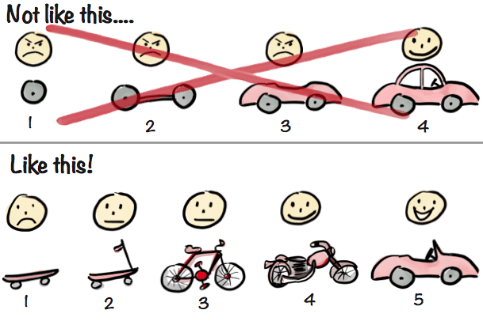

[Uri Levine](https://www.linkedin.com/in/uri-levine/), a serial entrepreneur and founder of Waze, famously coined the phrase:

/\* widget: Blog: Top Quote \*/  /\* reset -------------------- \*/  .blog-custom-block \*,  .blog-custom-block ::before,  .blog-custom-block ::after {  box-sizing: border-box;  border-width: 0;  border-style: solid;  border-color: #e5e7eb;  }  /\* vars -------------------- \*/  .blog-custom-block.blog-custom-block\_\_top-quote {  --color-bg: #F4FAFE;  --color-border: rgb(15 164 234 / 0.50);  --color-text-1: #0F172A;  }  /\* colors -------------------- \*/  .blog-custom-block.blog-custom-block\_\_top-quote .border-clr-border {  border-color: var(--color-border);  }  .blog-custom-block.blog-custom-block\_\_top-quote .bg-clr-bg {  background-color: var(--color-bg);  }  .blog-custom-block.blog-custom-block\_\_simple-quote .text-clr-text-1 {  color: var(--color-text-1);  }  /\* utils -------------------- \*/  .blog-custom-block.blog-custom-block\_\_top-quote .flex {  display: flex;  }  .blog-custom-block.blog-custom-block\_\_top-quote .flex-shrink-0 {  flex-shrink: 0;  }  .blog-custom-block.blog-custom-block\_\_top-quote .flex-col {  flex-direction: column;  }  .blog-custom-block.blog-custom-block\_\_top-quote .items-center {  align-items: center;  }  .blog-custom-block.blog-custom-block\_\_top-quote .gap-4 {  gap: 1rem;  }  .blog-custom-block.blog-custom-block\_\_top-quote .rounded-xl {  border-radius: 0.75rem;  }  .blog-custom-block.blog-custom-block\_\_top-quote .border {  border-width: 1px;  }  .blog-custom-block.blog-custom-block\_\_top-quote .p-8 {  padding: 2rem;  }  .blog-custom-block.blog-custom-block\_\_top-quote .text-center {  text-align: center;  }  .blog-custom-block.blog-custom-block\_\_top-quote .text-2xl {  font-size: 1.5rem;  line-height: 2rem;  }  .blog-custom-block.blog-custom-block\_\_top-quote .font-bold {  font-weight: 700;  } 

Fall in love with the problem, not the solution

I’m sure you’ve heard it before. It’s quite a common expression in the startup scene.

But what about a real-life example from someone who took that motto to heart and built a multi-million dollar startup as a result?

Over the next few minutes, in the latest instalment of our series of interviews, _The Startup Journey_, I’ll guide you through the story of [Ali Halabi](https://www.linkedin.com/in/xalihalabi/).

I’ll explain how this one important rule made him the successful entrepreneur he is today.

In 2013, Ali moved to Istanbul for work.

He instantly fell in love with the city. There was however one thing he couldn’t stand: The amount of traffic he had to deal with on a daily basis.

So just one year after arriving in the city, he left his corporate job and set out to solve the traffic problem.

The solution he came up with was an on-demand carpooling service – Volt.

It was a solution that saw little adoption and eventually failed, never achieving product-market fit.

Had Ali been **focused on his idea** – the solution he came up with – that would’ve been the end of his entrepreneurial journey.

However, failure was just a bump in the road for Ali, because he was **committed to solving the problem** – and, importantly, finding the right solution for those who face it.

So Ali pivoted. Instead of focusing on peer-to-peer carpooling, he focused on a B2B subscription-based travel solution for corporate users.

He called the new startup [Volt Lines](https://www.voltlines.com/?lang=en). The reason why he kept “Volt” in the name was quite relatable: at the time he didn’t want to admit he had failed. But more on that later.

The market instantly found value in Ali’s new solution – and since launching in 2017 the company has achieved over $7.5M in funding.

Throughout our conversation, Ali shared the trials he faced on his journey, as well as actionable advice that any entrepreneur could benefit from.

One piece of advice that stuck out to me was how Ali dealt with the mistakes he made – and what he would do differently looking back.

#### Paolo: Ali, to start out please tell us a bit about yourself and about the company you’re currently running.

**Ali:** So, I'm originally from Beirut, Lebanon.

I came to Istanbul in the summer of 2012 with Procter and Gamble.

I was with P&G for about six years, the last of which I was in Istanbul.

And I loved the city, I loved how massive it is. But, I hated the traffic problem.

I came from a city of 1.5 million people to a city of over 15 million people. It was a massive slap in the face.

I became kind of obsessed with mobility and transportation.

Specifically urban mobility – how people move from point A to point B, especially in a city as massive as Istanbul.

I wanted to use tech to solve the traffic problem. Because the real cause of traffic, I realised, was empty seats. The problem was an inefficient use of vehicles.

It was this idea that started my journey.

So, I quit Procter and Gamble in 2013. Quite an irrational decision from someone who had only lived in the city a year – who still didn’t speak the language.

I started by building [Volt](https://www.linkedin.com/company/volt-ridesharing/), an on-demand carpooling service. It was my first startup, and we launched in 2014.

We were essentially connecting drivers and passengers going in the same direction. It was a similar idea to [BlaBlaCar](https://www.blablacar.com/). The only real difference being they provide the service at an intercity level. We were just focusing on doing it in Istanbul in real-time.

Related: [How a Lot of Rejection and 4 Years in “Stealth Mode” Turned into $21M in Funding \[Founder Story\]](https://altar.io/founder-story-how-rejection-turned-into-21m-in-funding/)

#### P: Istanbul is probably the size of an entire state or region in another country, so it makes sense to focus on just inner-city travel.

**A:** Absolutely. The daily commute here is an average of 30 -40 kilometres – sometimes going up to as much as 100km – which counts as intercity travel in Western Europe.

Sadly, the carpooling model failed due to product-market fit, so I pulled the plug in 2017.

Which left me trying to figure out what to do next.

I ended up jumping from one end of the spectrum to the other. Having focused on C2C with my first startup, my second focused on B2B.

I created a completely new company that focused on corporate transportation.

That’s how [Volt Lines](https://www.linkedin.com/company/voltlines/) was born.

We help corporations offer their employees buses to work. It basically means their commute is free – it’s an added perk for the employee.

But instead of the company buying or renting the buses (which is what they usually do) we are a subscription-based service.

**With Volt Lines, you buy a monthly subscription per employee and they can use any bus on our network. It's like the Netflix of Transportation, the Spotify of buses.**

The result is that the company is not renting a bus that may end up only being half full. Instead, the employee simply uses the mobile app to access the entire Volt Lines network.

They can board buses, they can choose destinations, they can literally go anywhere in the city using these buses.

And since the city has 50,000 buses, the market is so massive that you could eventually build a virtual public transportation network in the city.

We launched in April 2018 and quickly grew. In 2019, we tripled our business. By Q1 2020 we had grown by 40%. And then COVID happened.

And it threw us completely out of our comfort zone, obviously.

Not that tripling a company every year was a comfort zone either. But it threw us into a completely different battle.

Fast forward to today, and we’re seeing the headwinds of the pandemic turning into tailwinds with the rising popularity of the [hybrid office work model](https://www.forbes.com/sites/forbestechcouncil/2021/06/04/going-hybrid-the-future-of-work-is-here/).

We saw that the future of work is not going to be purely working from home. Nor is it going to be five days in the office.

It’s going to be much more flexible under the hybrid model. This means technology is going to play a much bigger role in commuting.

You need a reservation system, dynamic routing that adjusts according to the demand on that specific day. So we built Volt Lines DRT (Demand Responsive Transport).

We only launched this a couple of months ago, we’ve just signed our first major client actually.

We see DRT being the most in-demand part of our service moving forward.

.elementor-3326 .elementor-element.elementor-element-fa6400f{--display:flex;--flex-direction:column;--container-widget-width:100%;--container-widget-height:initial;--container-widget-flex-grow:0;--container-widget-align-self:initial;--overflow:hidden;--background-transition:0.3s;--border-radius:12px 12px 12px 12px;}.elementor-3326 .elementor-element.elementor-element-283e311{--display:flex;--flex-direction:row;--container-widget-width:initial;--container-widget-height:100%;--container-widget-flex-grow:1;--container-widget-align-self:stretch;--gap:64px 64px;--background-transition:0.3s;}.elementor-3326 .elementor-element.elementor-element-283e311:not(.elementor-motion-effects-element-type-background), .elementor-3326 .elementor-element.elementor-element-283e311 > .elementor-motion-effects-container > .elementor-motion-effects-layer{background-color:#F4FAFE;}.elementor-3326 .elementor-element.elementor-element-283e311, .elementor-3326 .elementor-element.elementor-element-283e311::before{--border-transition:0.3s;}.elementor-3326 .elementor-element.elementor-element-857117e{--display:flex;--flex-direction:row;--container-widget-width:initial;--container-widget-height:100%;--container-widget-flex-grow:1;--container-widget-align-self:stretch;--background-transition:0.3s;}.elementor-3326 .elementor-element.elementor-element-857117e.e-con{--flex-grow:0;--flex-shrink:0;}.elementor-3326 .elementor-element.elementor-element-e6af329 img{width:100%;max-width:100%;height:100%;object-fit:cover;object-position:bottom right;}.elementor-3326 .elementor-element.elementor-element-e6af329{width:100%;max-width:100%;bottom:-44px;}body:not(.rtl) .elementor-3326 .elementor-element.elementor-element-e6af329{right:0px;}body.rtl .elementor-3326 .elementor-element.elementor-element-e6af329{left:0px;}.elementor-3326 .elementor-element.elementor-element-ec0de51{--display:flex;--flex-direction:column;--container-widget-width:100%;--container-widget-height:initial;--container-widget-flex-grow:0;--container-widget-align-self:initial;--gap:24px 24px;--background-transition:0.3s;--padding-block-start:112px;--padding-block-end:112px;--padding-inline-start:0px;--padding-inline-end:44px;}.elementor-3326 .elementor-element.elementor-element-ec0de51.e-con{--flex-grow:1;--flex-shrink:1;}.elementor-3326 .elementor-element.elementor-element-c168e59{--display:flex;--flex-direction:column;--container-widget-width:100%;--container-widget-height:initial;--container-widget-flex-grow:0;--container-widget-align-self:initial;--background-transition:0.3s;}.elementor-3326 .elementor-element.elementor-element-4aeb8ec .elementor-heading-title{font-family:"Poppins", sans-serif;font-size:32px;font-weight:700;}.elementor-3326 .elementor-element.elementor-element-8e0cd20{color:#000000;}@media(min-width:768px){.elementor-3326 .elementor-element.elementor-element-857117e{--width:360px;}}@media(max-width:767px){.elementor-3326 .elementor-element.elementor-element-283e311{--padding-block-start:40px;--padding-block-end:40px;--padding-inline-start:var(--safe-margin);--padding-inline-end:var(--safe-margin);}.elementor-3326 .elementor-element.elementor-element-857117e{--min-height:300px;}body:not(.rtl) .elementor-3326 .elementor-element.elementor-element-e6af329{right:0px;}body.rtl .elementor-3326 .elementor-element.elementor-element-e6af329{left:0px;}.elementor-3326 .elementor-element.elementor-element-e6af329{bottom:-76px;}.elementor-3326 .elementor-element.elementor-element-ec0de51{--padding-block-start:40px;--padding-block-end:0px;--padding-inline-start:0px;--padding-inline-end:0px;}}

##### Building a Startup?

From the product and business reasoning to streamlining your MVP to the most important features, our team of product experts and ex-startup founders can help you bring your vision to life.

Let's Talk

#### P: Ali, I have just a few questions to follow up here. One is to understand better what your company does. And the other is a bit of a question about the pivot that you had.

#### The first one is, I understand the Netflix style subscription-based model.

#### On the other side of the coin, do you have an Uber model like everyone can, let's say, apply as a bus driver with their own bus?

#### Or do you own the buses?

**A:** So we are, we are primarily a platform. We do own a few buses so we can be regulated.

To be a regulated bus operator we need to own at least 5% of our fleet.

For the most part, however, it works similarly to the Uber model.

It could be an individual driver signing up as a driver and verifying their profile. Then, if they match our requirements, they can start receiving jobs.

We also have smaller bus operators coming on board and getting jobs from us.

We’re signing bigger companies. Companies who usually only want to talk to big bus operators. So we’re giving these smaller operators access to more passengers.

When corporations start looking at the product, they start seeing the benefit of subscribing to a network. They see they can get a lot more benefits for employees versus renting buses.

And that's really the game-changing dynamic because as more companies sign up in the same area, the more efficient the network becomes and the more lines we can have.

So, we start by picking up, let's say 12 people from a residential area. We drive them on the highway, directly to the business district.

You could be picking up 12 people that work in five different companies, but they all work and live close to each other.

It's a new generation of public transportation that didn't exist before.

Because public transportation is usually a line that has multiple stops along the way. But in our network, pickups and drop-offs are very concentrated - it's a lot more A to B.

#### P: Great. Ali, I want to talk a bit about your first startup, and the pivot you made.

#### What happened with the initial carpooling idea that caused it to fail? Also, what did you take away from that experience?

**A:** The first thing is I think it's a very capital intensive model. That's my theory.

But even that theory is proven wrong by Google.

[Google bought Waze](https://techcrunch.com/2013/06/11/its-official-google-buys-waze-giving-a-social-data-boost-to-its-location-and-mapping-business/?guccounter=1&guce_referrer=aHR0cHM6Ly93d3cuZ29vZ2xlLmNvbS8&guce_referrer_sig=AQAAAL_6Z5atPF7Hae_HW13ZThLmHQUd_X2NO7wZ71gru91AIm1_EW31gXcc2fJG2PimGiO8ROxMfJpbcbMreH_4f-ZIow2lOoa9Do9GZW7FIZTzcpyd5W07i3-AB57xtdO7SuZkzhnPUTHxF3-cJsOVgfGkEhEDgKaH-AVBZt36uhap) in 2013. In  2015, Waze added a carpooling option and even with their resources it never really took off.

I think the fundamental reason is, if you own a car, you just want freedom.

You don't want to wait, you don't want to be diverted. It's about getting there as fast as possible.

You don't want to be stuck to a certain schedule, or a certain plan, etc.

And if you don't own a car, you also can’t always plan, right?

You have two options.

You have on-demand transport – where you hail a taxi or order an Uber.

Or you have scheduled transport – like the bus, tram, metro, etc.

As a consumer, you have to fit into those boxes.

As a provider, scheduled transport requires a high frequency of repetition.

On-demand transport, on the other hand, requires liquidity. It requires a lot of supply and demand in the same place at the same time.

So when you start to account for geolocation, you may have thousands of users but with an on-demand model.

But you end up narrowing it down to 4 or 5 users in the same area all going the same direction.

That’s difficult to pull off – especially in the beginning.

Now, our bet was to gamify both sides, so we gamified the supply.

Because people will keep coming back for the gamification and it will start ramping up.

So, we gave them navigation and gamification. Which, technically, is a difficult thing to do.

As a software company, you guys will know how difficult that is. It took us three years to pull it off. To build a turn by turn navigation app.

It was gamified so you earned points and went up through levels – all those fun aspects of gamification.

It was kind of working, we were growing on the supply side. But you can’t sustain it, especially in our region.

Here, investors immediately look at revenue. If you’re not generating revenue they’re not interested.

**Sure, Instagram was bought for $1B before generating a cent of revenue – but that’s San Francisco. Where we live it may as well be a different planet.**

Simply put, there was no path to generating revenue, so investors weren’t interested. It wasn't sustainable.

A lot of people with the same idea often come to me and ask for advice. I just tell them don’t do it. If Google/Waze can’t pull it off – with their resources and users – it’s a pretty good indicator of whether you should do it.

Having said that, I think it was a great failure because I learned a lot.

Even yesterday, I was talking with an investor. He said to me, “One thing I like about you is that I'm getting six years of your experience for free.”

I learned a lot and he's jumping on that value, basically.

The other issue with the carpooling model was an issue that all C2C businesses have.

You don’t have full control over the user experience. Because it goes beyond the UX of the app.

It's the delivery of the service, which can be very difficult to control.

Whereas in B2B, you have full control over these things. Even in a global pandemic, our revenue was kind of stable.

Of course, we took a hit and revenue dropped but it wasn’t like a lot of C2C or B2C startups that ground to a halt because of lockdowns.

In B2B, you rarely have that issue. You keep going because you have contracts and those contracts come back. The relationship is a lot more stable.

#### P: Great, great, Ali, thank you very much for the explanation and what you said makes sense.

#### And of course, everything you learned from that initial startup, especially pertaining to the transport industry, stuck with you.

#### What challenges did you face when you pivoted from C2C to B2B?

#### In my experience, C2C and B2C are much more marketing driven. Whereas, in B2B, you need to do some business development.

#### How did you go about this aspect in your pivot?

**A:**  So B2B is all about business development and mostly B2B corporate sales. There’s no avoiding it.

Yes, you optimize landing pages, you optimize everything so people can find you quickly.

That ensures you can turn the prospect into a lead, etc.

But really, what it comes down to is building a proper B2B sales pipeline building and managing it.

And then you end up with a sales cycle.

Our sales cycle is around six months. In the pandemic, it dropped to 3.3 months, which is great.

But that was because we designed it that way by adding a lot of smaller customers quickly.

In our case, it’s also about going back to the customers that said no. In our vertical, companies normally do yearly contracts.

So we go after them year after year.

We have customers that rejected us for two years saying “You're too new.” or “We don't know you yet.” who’re now signing contracts with us.

So, the way I see it is that B2B is about customer management. Whether they're existing or non-existent.

In the end, you either win the customer or you learn why they didn't choose you.

Then, in our case, you get another year to work on it.

To make sure that your value proposition is good enough. Or your pricing is good enough. Or you’re providing what they’re looking for so they will choose you next time.

#### Rui: And then there is awareness and recognition as well because they saw you once, they saw you twice, etc.

#### There's perseverance if you're improving the product, if they're seeing added benefits, mostly related to what their comments were, it puts you in a much better position.

**A:** And it causes a snowball effect. In our case, there's a huge network effect.

The bigger the network becomes, the easier it becomes to acquire other customers. Because if I have 90 buses going into your business district, and you have 10 buses, I can easily swallow your 10 buses into my 90.

And then it's just getting better and better. On the other side, you also have the physical buses in the street. So, the logo is seen.

They're continuously getting reminded of you. It’s a slow burn.

That’s the major difference between B2B & B2C.

B2C things tend to explode quickly whereas in B2B things pick up pace slowly but are then a lot more resilient further down the line.

#### Paolo: What was your strategy when you were seeing that the growth was steady – did you hire a B2B salesperson or did you go about it alone?

**A:** I was focused on sales.

We started really small, the team was four or five people and we just focused on getting off the ground.

There was me (with my very bad Turkish) dealing with sales. And, as is often the case with a brand new startup, we got rejected for around eight, nine months before closing our first customer.

In the beginning, it was all me on all fronts.

As a founder, you have to be on the product side, you have to be on the sales side, you have to be on the supply side, etc.

You have to get it to stick basically. Once it sticks, you get angel investment, and then you grow.

In our first year, I think we were growing 50% month on month. Then in year two, we were growing 25% month on month.

Right now, it’s more like 15%-20% month on month.

But I still think it will reach a point where the network effect will compound.

All of this to say, there’s a lot of pushing in the beginning, but it’s all about the value proposition and the network effect.

Related: [Key Product Lessons I Learned Interviewing Successful Entrepreneurs](https://altar.io/key-product-lessons-i-learned-interviewing-successful-entrepreneurs/)

#### P: It makes complete sense. You mentioned that you had four or five people on your team. What roles did they cover?

**A:** Apart from me I had one person in business development.

Then the other four were focused on developing the product for Full stack, Android and iOS.

#### P: Did you outsource any of the development? Or did you build everything in house?

**A:** For Volt Lines, we built everything in house.

For my first startup, I did start with outsourcing. I didn’t have any experience, I didn’t know how to hire or who to hire.

So I outsourced development to a software agency. But again, because of my inexperience, I didn’t really know how to work with them.

I couldn’t comprehend what they were asking for.

I also felt they were expensive, but I now realise that software development talent is just expensive.

Looking back it wasn’t the company, it’s just the price you pay for quality development.

Related: [How to Build a Successful Minimum Viable Product (MVP) in 3 Steps](https://altar.io/features-inside-mvp-3-steps-know-answer/)

#### P: Absolutely, we talk to a lot of entrepreneurs in the same position, trying to balance good quality and affordability when searching for their technical partner.

#### How did you survive those first eight to nine months without any customers?

#### Did you pay everything out of your own pocket – for the team, resources, etc. or did you have some early funding?

**A:** It was completely out of my pocket in the beginning. Then three months in, we onboarded our first angel investor.

At that point, the business model was developed, the product was designed and we’re working on it.

It wasn’t on any App Stores yet. The employer Web app was still in development too.

But what we did have are the designs on [Marvel](https://marvelapp.com/). They showed the concept was pretty well developed. The sales booklet was also ready.

That first Angel Investor saw all of these materials and we raised $50,000.

That kept us moving. Then two months later, we got $20,000 from another angel investor.

That $70k got us through the first seven months.

At that time, I was barely taking a salary as the founder. I was funnelling pretty much everything into the business and paying my team.

Then once we had a couple of investments we started generating revenue here and there. Nothing meaningful, just little bits to get things going.

We were working in this co-working space and we basically started selling seats there.

And it took off from there.

In the beginning, it’s very difficult. It’s very frustrating. You know, seven months of rejections is a lot to take.

Because you keep pushing and pushing but you feel like you come up with nothing.

But then it catches.

Once it clicks and you achieve product-market fit things become slightly easier.

Then, of course, you start dealing with other problems. Finding talent, scaling the organisation, etc.

It’s all about having this mentality where you never really fail. You either win or you learn.

#### P: When did you feel that you really had a business. Was it when that product-market fit clicked? Or was it before that?

**A:** There were multiple, let’s say, pivotal moments that lead to that realisation.

One that sticks out happened six months after launch. We found a business tower with all different companies in the building and we signed them.

That deal alone got us to $1M ARR (Annual Recurring Revenue).

When you’re doing that kind of ARR after six months, it immediately puts you in a different league.

That deal helped us secure more funding, and we were able to continue growing from there.

#### P: How badly has the pandemic affected your growth?

**A:** It’s funny because, in a pandemic, you would think that a corporate transport company would go belly up. Or at least be on the way out.

But actually, with the hybrid model becoming more popular, the need for a smart, flexible transport solution for employees is definitely there.

It shows in our numbers – we doubled our number of customers in 2020.

We added a lot of smaller customers that were trying to escape public transportation.

The bigger accounts switched to work from home during the pandemic.

But, as the number of cases went down, they slowly came back to the office.

And they’re going to continue to do so.

All the big accounts want to sign up for a flexible commuting solution.

This is where I’m now realizing, holy shit, this is gonna go big.

Whereas a year and a half ago I was thinking, holy shit, this is gonna bankrupt us!

We’re now in a position of the right place, right product, at the right time.

Which is easy to look at as luck. But that luck has three years of extremely hard work behind it.

#### Rui: It takes a lot of work and investment to get to that “lucky moment” there’s no doubt there!

#### Now let’s talk a bit about early-stage decisions around your go-to-market.

#### At what point did you start talking to the market about your idea?

**A:** Around May 2017. I didn’t have anything, no product, no team, nothing.

One thing I’ve realised is that ideas on their own don’t mean shit. What really matters is the problem that you’re solving.

Things like, who else is solving it? How are they solving it? Are people paying for it? What premium are they willing to pay to have that solution?

So I started approaching the market and selling Volt Lines to them as if it was already built and ready to go.

And they would say things like: “Yeah it sounds good, but that aspect is unnecessary for me.” Or “I would really like to see this” or “I would be worried about this” etc.

So you start to hear this feedback and you can use it to develop your idea on paper and in wireframes.

The places where you can iterate quickly and cheaply before you start getting into high fidelity designs and actual development

I started selling Volt Lines six months before we actually incorporated the company. Almost a year before we signed our first customer.

#### Rui: The reason why I’m asking is, as you can imagine, we work with many entrepreneurs. And because we try to be an extended team of co-founders – more than just a supplier, we always end up engaging in informal conversations about marketing and funding and sharing the accumulated experience we have.

#### And talking to the market early should be obvious, right?

#### But you would be surprised with the number of founders that think that they need to have the perfect product before going to someone and trying to sell it.

#### Or even sharing the idea with the market, which is a big, big mistake.

**A:** Exactly, and I think that influence comes from big corporations.

As Reid Hoffman says:

/\* widget: Blog: Simple Quote \*/  /\* reset -------------------- \*/  .blog-custom-block \*,  .blog-custom-block ::before,  .blog-custom-block ::after {  box-sizing: border-box;  border-width: 0;  border-style: solid;  border-color: #e5e7eb;  }  /\* vars -------------------- \*/  .blog-custom-block.blog-custom-block\_\_simple-quote {  --color-accent: #0FA4EA;  --color-bg: #F4FAFE;  --color-text-2: #4A4A68;  }  /\* colors -------------------- \*/  .blog-custom-block.blog-custom-block\_\_simple-quote .bg-clr-bg {  background-color: var(--color-bg);  }  .blog-custom-block.blog-custom-block\_\_simple-quote .border-clr-accent {  border-color: var(--color-accent);  }  .blog-custom-block.blog-custom-block\_\_simple-quote .text-clr-text-2 {  color: var(--color-text-2);  }  /\* utils -------------------- \*/  .blog-custom-block.blog-custom-block\_\_simple-quote .flex {  display: flex;  }  .blog-custom-block.blog-custom-block\_\_simple-quote .flex-shrink-0 {  flex-shrink: 0;  }  .blog-custom-block.blog-custom-block\_\_simple-quote .flex-col {  flex-direction: column;  }  .blog-custom-block.blog-custom-block\_\_simple-quote .gap-4 {  gap: 1rem;  }  .blog-custom-block.blog-custom-block\_\_simple-quote .rounded-xl {  border-radius: 0.75rem;  }  .blog-custom-block.blog-custom-block\_\_simple-quote .border-l-6 {  border-left-width: 6px;  }  .blog-custom-block.blog-custom-block\_\_simple-quote .p-8 {  padding: 2rem;  }  .blog-custom-block.blog-custom-block\_\_simple-quote .text-xl {  font-size: 1.25rem;  line-height: 1.75rem;  }  .blog-custom-block.blog-custom-block\_\_simple-quote .italic {  font-style: italic;  } 

Starting a company is like jumping off a cliff and assembling the plane on the way down.

But that’s not how big corporations work.

I came from working in a big corporation, where if you want to build something that flies you need the approval of what feels like 10,000 departments.

It’s gonna take 18 months to have a design approved. Then it needs to go through someone else. Maybe it will see the light of day during your lifetime.

Whereas in a startup, you just have to fake it until you make it. For a B2B business, you just need a presentation, for B2C you just need a landing page.

PowerPoint is the best launchpad when it comes to B2B.

You create a presentation, take it to someone and try to sell it. If they’re interested in buying it, you start building it.

If you’re waiting for everything to be perfect, you’ll never make it out of the door.

It’s like when I talk to entrepreneurs about the concept of MVP. I explain the concept of starting at a skateboard and building until you have a car.

When you build your startup you need to be efficient but you also need to deliver on the value proposition.

**If you’re selling a product that gets you from A to B you can’t just build a wheel and promise that the car will come later.**

So instead, you sell them a skateboard. Sure, it’s not as fancy as a car, but it still gets the user from A to B.

As a founder, if you stay behind closed doors, building the car and waiting for it to be perfect, you’ll be dead in the water.

You’ll run out of money. More than that, you may find out that you’ve spent all this time and money building something nobody wants.

#### R: I couldn’t agree more.

#### It’s critical that you first see if people want and need the solution you’re proposing before you commit to building it.

#### Now let’s change gears: what did a day in your life look like back in 2018?

**A:**  Definitely not an 8 hour day. It was more like a 12 hour day.

A third of that time is spent selling, a third on fundraising and a third growing and managing the team – roughly.

One mistake I see a lot of founders make is not onboarding a product manager early on.

Product management is not just “I have an idea for a screen and I want to put the buttons here.”

You need someone who can translate the idea from business to development – whether you’re using in-house developers or a software development company.

That’s why Volt Lines had a product manager from day one.

#### R: There’s an interesting thing you mentioned there: it wasn’t an 8 hour day, it was a 12 hour day.

#### How did you balance this with your personal life?

**A:** Personal life for me took a major hit in 2017. It’s tough. You really sacrifice your personal life when you decide to build a startup.

Some will tell you it’s a marathon, not a sprint but I would disagree.

It’s a marathon where occasionally you need to start sprinting.

And those sprints pop up and keep coming.

For me, one of those sprints was the pivot from C2C to B2B.

At that moment my marriage fell apart, I pulled the plug on my first startup, I didn’t have a clue what I was going to do next.

Should I become a YouTuber? Maybe I should get into cryptocurrency?

It was that crossroad where I could’ve taken any path. And it’s intense.

So I chose a path and that sprint led me to Volt Lines. By 2018 things were on track with the business, but that intensity is still there.

It’s more like 9 hours a day by that point.

One thing I will say is that, while there’s no time for a personal life per se when you have the right people around you, they understand when you need to sprint.

But at the same time, you shouldn’t be sprinting all the time because it’s not sustainable.

#### Rui: So obviously, we could delve into this topic a lot more. But unfortunately, time is limited.

#### So for now Ali, let’s move on to the finishing questions.

#### What was the biggest lesson you would share with a first-time founder from this experience?

**A:** I would say it’s about both the product and the distribution.

Obviously, the product needs to be reliable. And, as we said, it needs to solve a real problem for your users.

But, honestly, these days, I find myself more interested in distribution.

Distribution includes marketing, sales, everything. It includes a lot of the business development spectrum. Getting the product into the hands of users.

Having the right contacts and the right network really goes a long way when it comes to distribution.

Building that network only happens after you get very comfortable with rejection.

Because to get in front of the right people, you have to be ok with being rejected.

#### R: As a marketer, I deal with that all the time. A lot of entrepreneurs build magnificent assets.

#### But there needs to be a bridge to get people to those assets. Most founders underestimate the importance of distribution.

#### Let’s change gears again. Let’s imagine you could go back in time and start your company again, what would you do differently?

A: Nothing to be honest. All the mistakes I made I needed to make, and I learned from them.

The only thing I wish I had done was to change the brand name properly. People love the name now, from the customers to the drivers.

But for me, it’s always going to come with the baggage of that first startup.

I wish I had the guts to change it, but at the time I didn’t want it to look like I had failed.

I’ve learned to embrace the breaking points because this is where you really grow. This is where you learn.

Otherwise, there’s no way I would be where I am today.

Whether it’s hiring mistakes, judgment mistakes, anything, all of them lead to more development and more learning.

#### R: Can you share one resource that was invaluable to your success? This could be an advisor, a book, a podcast, etc.

**A:** Okay, I’d have to say a one-time mentor we had.

We had one call with him. His advice changed my life.

He probably doesn’t even remember me.

His name is [Uri Levine](https://www.linkedin.com/in/uri-levine/). He is the co-founder of Waze.

That one call we had with him inspired me so much.

It was like talking to God.

The advice he gave me helped me to decide to shut down my first project and try something new.

He told me you should never fall in love with the product. You should never fall in love with a solution. You should fall in love with a problem.

And the problem for me was very clear. It was traffic.

I was not in love with on-demand carpooling. I was in love with solving traffic. And that helped me to walk away from Volt and go out and build Volt Lines, basically.

## Thank You, Ali…

… For taking the time out of your busy schedule to speak with us.

Ali has something in common with many of the entrepreneurs I’ve talked to over the last two years.

Ali didn’t focus on building something. He focused on solving a key problem his users faced.

And when he found a solution that worked, he focused on making it the best solution on the market.
