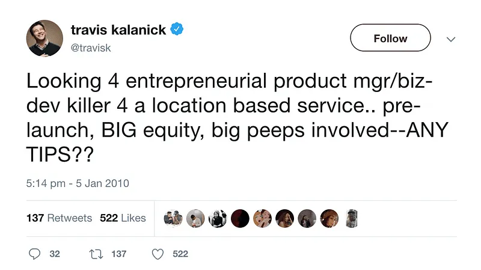

<iframe src="https://w.soundcloud.com/player/?visual=false&amp;url=https%3A%2F%2Fapi.soundcloud.com%2Ftracks%2F919104262&amp;show_artwork=true&amp;maxheight=1000&amp;maxwidth=800&amp;auto_play=false&amp;buying=true&amp;liking=true&amp;download=true&amp;sharing=true&amp;show_comments=true&amp;show_playcount=true&amp;show_user=true&amp;color=E7107E" width="800" height="200" frameborder="no"></iframe>

Building a startup! You have an epiphany and say to yourself:

This is a great idea! How didn’t anyone think of it before? I have to build it! Now!

Fair enough but, as I’m sure you’ve heard, there are many hurdles that can [lead to startup failure](https://www.cbinsights.com/research/startup-failure-reasons-top/) if you're not careful — and you want to be among the founders that avoid them.

Maybe you’ve already read [The Lean Startup.](http://theleanstartup.com/) You're already considering building a Minimum Viable Product (MVP) and getting your idea tested ASAP.

While testing as much as possible (and testing quickly) is vital, should you rush to build the first idea that pops into your mind?

The answers you’re looking for are just a few scrolls away!

In this article, we will cover everything you need to know from the definition of an MVP to the process of building one.

.elementor-12941 .elementor-element.elementor-element-e56f4e6{--display:flex;--flex-direction:column;--container-widget-width:100%;--container-widget-height:initial;--container-widget-flex-grow:0;--container-widget-align-self:initial;--background-transition:0.3s;}.elementor-12941 .elementor-element.elementor-element-f8d1905{--box-background-color:var( --e-global-color-f6f9b04 );--box-border-color:var( --e-global-color-secondary );--box-border-width:1px;--box-border-radius:12px;--box-padding:12px;--header-color:var( --e-global-color-text );--separator-width:0px;--item-text-decoration:underline;--item-text-hover-decoration:underline;--marker-color:var( --e-global-color-primary );--marker-size:5px;}.elementor-12941 .elementor-element.elementor-element-f8d1905 .elementor-toc\_\_spinner{color:var( --e-global-color-secondary );fill:var( --e-global-color-secondary );}.elementor-12941 .elementor-element.elementor-element-f8d1905 .elementor-toc\_\_header, .elementor-12941 .elementor-element.elementor-element-f8d1905 .elementor-toc\_\_header-title{font-family:"Poppins", sans-serif;font-size:2.25rem;font-weight:700;text-transform:capitalize;line-height:1.2;}.elementor-12941 .elementor-element.elementor-element-f8d1905 .elementor-toc\_\_list-item{font-family:var( --e-global-typography-45f602c-font-family ), sans-serif;font-size:var( --e-global-typography-45f602c-font-size );font-weight:var( --e-global-typography-45f602c-font-weight );line-height:var( --e-global-typography-45f602c-line-height );letter-spacing:var( --e-global-typography-45f602c-letter-spacing );word-spacing:var( --e-global-typography-45f602c-word-spacing );}.elementor-12941 .elementor-element.elementor-element-f8d1905 > .elementor-widget-container{padding:32px 32px 32px 32px;}@media(max-width:1024px){.elementor-12941 .elementor-element.elementor-element-f8d1905 .elementor-toc\_\_list-item{font-size:var( --e-global-typography-45f602c-font-size );line-height:var( --e-global-typography-45f602c-line-height );letter-spacing:var( --e-global-typography-45f602c-letter-spacing );word-spacing:var( --e-global-typography-45f602c-word-spacing );}}@media(max-width:767px){.elementor-12941 .elementor-element.elementor-element-f8d1905 .elementor-toc\_\_list-item{font-size:var( --e-global-typography-45f602c-font-size );line-height:var( --e-global-typography-45f602c-line-height );letter-spacing:var( --e-global-typography-45f602c-letter-spacing );word-spacing:var( --e-global-typography-45f602c-word-spacing );}}

#### Contents

## What is an MVP?

Before we dive into the benefits of an MVP and how to build an MVP, I wanted to startup off with a quick definition of MVP.

A Minimum Viable Product (MVP) is exactly what it says on the tin: the simplest version of your product with just enough features to validate your value proposition.

**No one has ever created “X”, I want to build “X” because I think it’ll improve the lives of those who use it**

Or, in the words of the inventor of the startup MVP & author of [The Lean Startup](http://theleanstartup.com/), Eric Reis:

/\* widget: Blog: Simple Quote \*/  /\* reset -------------------- \*/  .blog-custom-block \*,  .blog-custom-block ::before,  .blog-custom-block ::after {  box-sizing: border-box;  border-width: 0;  border-style: solid;  border-color: #e5e7eb;  }  /\* vars -------------------- \*/  .blog-custom-block.blog-custom-block\_\_simple-quote {  --color-accent: #0FA4EA;  --color-bg: #F4FAFE;  --color-text-2: #4A4A68;  }  /\* colors -------------------- \*/  .blog-custom-block.blog-custom-block\_\_simple-quote .bg-clr-bg {  background-color: var(--color-bg);  }  .blog-custom-block.blog-custom-block\_\_simple-quote .border-clr-accent {  border-color: var(--color-accent);  }  .blog-custom-block.blog-custom-block\_\_simple-quote .text-clr-text-2 {  color: var(--color-text-2);  }  /\* utils -------------------- \*/  .blog-custom-block.blog-custom-block\_\_simple-quote .flex {  display: flex;  }  .blog-custom-block.blog-custom-block\_\_simple-quote .flex-shrink-0 {  flex-shrink: 0;  }  .blog-custom-block.blog-custom-block\_\_simple-quote .flex-col {  flex-direction: column;  }  .blog-custom-block.blog-custom-block\_\_simple-quote .gap-4 {  gap: 1rem;  }  .blog-custom-block.blog-custom-block\_\_simple-quote .rounded-xl {  border-radius: 0.75rem;  }  .blog-custom-block.blog-custom-block\_\_simple-quote .border-l-6 {  border-left-width: 6px;  }  .blog-custom-block.blog-custom-block\_\_simple-quote .p-8 {  padding: 2rem;  }  .blog-custom-block.blog-custom-block\_\_simple-quote .text-xl {  font-size: 1.25rem;  line-height: 1.75rem;  }  .blog-custom-block.blog-custom-block\_\_simple-quote .italic {  font-style: italic;  } 

A Minimum Viable Product (MVP) is the version of a new product which allows a team to collect the maximum amount of validated learning about customers with the least effort.

The MVP is the minimum effort to test if your target market will actually adopt your product.

It’s a simple but extremely effective methodology.

## The Origin of the Minimum Viable Product (MVP)

It all started when Eric Ries experienced failure in the startup world. Many months, and many dollars later he was still seeing his colleagues in Silicon Valley failing for the same reason, the features being built into products weren’t being used.

After researching a better solution he found his inspiration in Lean Manufacturing methodology. A process, invented by Toyota, designed to shine a light on what adds value to a product, by reducing features. Or trimming the fat to make it leaner, and removing features that aren’t adding value; only burning money, time and focus.

Ries brought this lean concept from the car industry to the _.com bubble_, baptising it as The Lean Startup Methodology.

The MVP process falls under the Lean umbrella as the first client-facing version of a product.

If you haven’t read The Lean Startup, here’s a quick video that sums it up perfectly:

https://youtu.be/X2YoHFuWkqs

## Benefits of Building an MVP

In today’s business landscape, releasing your product quickly and within budget is a prerequisite to a startup’s success.

Building an MVP has become the de facto process as it allows you to save time & money whilst reducing your risks.

Here’s how building an MVP can benefit you:

### User-Centric Development

Building an MVP forces you to be hyper-focused on solving your users’ key problem.

### Rapid Testing

The quicker you can test your assumptions the quicker you can get to market. Not only this but you will save a considerable amount of energy by using the MVP methodology.

### Reduced Costs

It goes without saying that building part of a product, with only the absolutely essential features, is considerably cheaper than building an all singing all dancing version.

### Market Validation & Protected Credibility

When it comes to building something new you will always be involving other people. From friends & family to investors and other players in your chosen market.

The point is, you build an MVP to test the waters. That way if your product fails it will fail quickly — without spending too much money.

The alternative is pouring any and all budget you have into a product that fails in a year's time anyway  —  no one wants to be this founder.

### Reduced Effort

I’ve seen firsthand entrepreneurs exhausted after giving all of their energy to a full-featured product. If they miss their mark, and the product lacks any kind of adoption, it drains all inspiration from them — leaving them to never want to go down the entrepreneurial path ever again. Using the MVP approach allows you to test the market months before this exhaustion can set in and uninspire you.

### It Beats the Alternative

The alternative is known as the Waterfall Model — building a fully-featured product before validating if people will use your solution.

This is what big corporations and traditional consultants do. It’s also the method that inspired Eric Reis to create a better process.

In my experience, many founders will bring me a laundry list of features to build the first version of their product, despite their awareness of the lean concept and MVP framework.

Unknowingly, they’re trying to build an MBP (Most Beautiful Product), not an MVP; aligning more with the less than optimal  Waterfall Model.

It’s a mistake many founders make, here’s why:

As entrepreneurs, we tend to be completely absorbed in the process of building a product. We’re so emotionally invested in our vision that it’s often difficult to take an objective view on what our users’ will adopt, and what they won’t.

It’s important to avoid this. The best way to do that is to keep the user at the forefront of your mind and follow a structured process to build an MVP.

##### Do you have a brilliant startup idea that you want to bring to life?

From the product and business reasoning to streamlining your MVP to the most important features, our team of product experts and ex-startup founders can help you bring your vision to life.

Let's Talk

## How to Build an MVP: The Process in 3 Steps

This three-step process intends to help you decide:

- Whether or not you should build your startup
- If you should, Which features should be built into your MVP (Minimum Viable Product)

The process is called 123-MVP and we’ve used it with all the [startups we’ve worked with at Altar.io](https://altar.io/work/).

The three steps are:

1. Find your MVP’s Value Proposition
2. Set the Main Assumptions That You Need to Validate
3. Define the Shortest Way to Validate Your Assumptions

While going through the three steps I’ll use Airbnb as an example, to make it more tangible and less theoretical.

Airbnb is one of the most used startups to benchmark the MVP process. Although it’s a commonplace example, it’s the best way to illustrate the process in a real-world example.

### Step One: Find your MVP’s Value Proposition

You don’t want to dedicate months of your life building something useless. You should start by asking:

Is this product really relevant to my target?

This is a critical question when building an MVP; you need to answer it asap.

This structured process will ensure you nail your value proposition and complete the first step in building a successful MVP:

1. What is the problem/pain you’re trying to solve with your product?
2. What is your MVP’sValue Proposition?
3. Who is the main target? Get to know them in terms of demographics, psychology and behaviour in the observed context. Eventually, build UX Personas.
4. How does each target stakeholder deal with the problem today? Carry out a competitor benchmark.
5. Why is your MVP better than the current solution? What differentiates you from the alternatives/your existing competition? \_\_\_(Name of your product) is a\_\_\_\_\_ (a statement of its key benefit/solution)
6. What is your Elevator Pitch? It’s been created for \_\_\_\_ (your stakeholders) who \_\_\_\_ (state their problem). \_\_\_\_ (name of your product) is a\_\_\_\_\_ (a statement of its key benefit/solution). Unlike \_\_\_\_ (the current solution) we \_\_\_\_ (say what differentiates you from the alternatives/your existing competition).

The final output must be an “SSCC” Elevator Pitch = Simple Stupid, Crystal Clear!

If any aspect of your elevator pitch is unclear, go back to step one.

Let’s use Airbnb as a case study for some context:

/\* widget: Blog: Expert Tip \*/  /\* reset -------------------- \*/  .blog-custom-block \*,  .blog-custom-block ::before,  .blog-custom-block ::after {  box-sizing: border-box;  border-width: 0;  border-style: solid;  border-color: #e5e7eb;  }  /\* vars -------------------- \*/  .blog-custom-block.blog-custom-block\_\_expert-tip {  --color-bg: #F4FAFE;  --color-border: rgb(15 164 234 / 0.50);  --color-text-1: #0F172A;  --color-text-2: #4A4A68;  }  /\* colors -------------------- \*/  .blog-custom-block.blog-custom-block\_\_expert-tip .bg-clr-bg {  background-color: var(--color-bg);  }  .blog-custom-block.blog-custom-block\_\_expert-tip .border-clr-border {  border-color: var(--color-border);  }  .blog-custom-block.blog-custom-block\_\_expert-tip .text-clr-text-1 {  color: var(--color-text-1);  }  .blog-custom-block.blog-custom-block\_\_expert-tip .text-clr-text-2 {  color: var(--color-text-2);  }  /\* utils -------------------- \*/  .blog-custom-block.blog-custom-block\_\_expert-tip .flex {  display: flex;  }  .blog-custom-block.blog-custom-block\_\_expert-tip .flex-shrink-0 {  flex-shrink: 0;  }  .blog-custom-block.blog-custom-block\_\_expert-tip .flex-col {  flex-direction: column;  }  .blog-custom-block.blog-custom-block\_\_expert-tip .gap-4 {  gap: 1rem;  }  .blog-custom-block.blog-custom-block\_\_expert-tip .gap-5 {  gap: 1.25rem;  }  .blog-custom-block.blog-custom-block\_\_expert-tip .rounded-xl {  border-radius: 0.75rem;  }  .blog-custom-block.blog-custom-block\_\_expert-tip .border {  border-width: 1px;  }  .blog-custom-block.blog-custom-block\_\_expert-tip .p-8 {  padding: 2rem;  }  .blog-custom-block.blog-custom-block\_\_expert-tip .text-3xl {  font-size: 1.875rem;  line-height: 2.25rem;  }  .blog-custom-block.blog-custom-block\_\_expert-tip .text-lg {  font-size: 1.125rem;  line-height: 1.75rem;  }  .blog-custom-block.blog-custom-block\_\_expert-tip .font-bold {  font-weight: 700;  } 

Airbnb Case Study

##### **1\. Airbnb’s Problem**

Travellers around the world cannot find an easy way to book a room with a local or become a host. The main existing offer for tourism accommodation is a hotel, which is not adapted to the preferences of Millennials because it leaves them disconnected from the City and its culture.

##### **2\. Airbnb’s VP (Value Proposition)**

Airbnb is an online marketplace connecting travellers with local hosts. On one side users can list their available spaces to local tourism and make extra money while travellers can book unique places from locals, saving money and getting a chance to interact with them.

##### **3\. Airbnb’s Main Target**

There are two targets for Airbnb, _The Traveller_ and _The Host_

**The Traveller** – a person who enjoys travelling without spending the whole budget in a hotel room. He/She usually is a millennial, keen on learning from and co-living with different cultures and willing to enjoy experiences with locals rather than people from the home Country.

Millennials’ tourism behaviour is quite interesting: 3/4 vacations per year, they prefer experiences over resorts, they save in accommodation and spend on activities.

**The Host** – owner/renter who is willing to rent out his space. The reason is usually making money accompanied by the interest to meet interesting people.

##### **4\. How does each target stakeholder deal with the problem today (Benchmark)?**

Hotels, Hostels, Couchsurfing.

##### **5\. Why is Airbnb better than the current solution?**

Airbnb is perfect for Millennials. It enables travellers to manage their trips accommodation in a natural, hassle-free and simple flux with the best value for money, taking into account their concerns for being more genuine and cost-efficient. It also enables owners to rent out their spaces in an easy way, by simply listing the place on the platform once and receiving money exclusively online and offers an affordable solution to the travellers.

##### **6\. What is Airbnb’s Elevator Pitch?**

It’s been created for millennials who want to travel in a comfortable, cost-efficient and genuine way. Airbnb is a marketplace to fill the gap between Hosts that want to short-rent their homes and Travellers that are willing to pay to be hosted in private venues by locals. Unlike Hotels, Airbnb creates engagement between guests, hosts and their cultures and simplifies the entire process of renting a space around the world. Unlike Hostels and Couchsurfing, Airbnb is more exclusive and suitable for a more private and comfortable stay.

### Step Two:  Set the Main Assumptions That You Need to Validate

Let’s remember the purpose of this process:

- To decide if you should build an MVP or not based on your business idea.
- And, if you should build an MVP, to decide which features should be built into your MVP.

Taking into consideration the elevator pitch:

1. **What are the main assumptions from your Elevator Pitch?** What are the relevant assumptions required for your MVP to be meaningful? We should, in this step, deconstruct all the relevant statements from the Value Proposition & Elevator Pitch.
2. **From these assumptions which are already validated?** Part of the listed assumptions can be validated with research. Researching the assumptions surrounding your MVP is much quicker than testing them.
3. **From these assumptions, which ones do we need to validate and which are the KPIs?** From the assumptions that are not proved and need to be tested with an MVP, what are the metrics to measure them.

To give you a little bit more context, let’s hop back into the Airbnb case study:

/\* widget: Blog: Expert Tip \*/  /\* reset -------------------- \*/  .blog-custom-block \*,  .blog-custom-block ::before,  .blog-custom-block ::after {  box-sizing: border-box;  border-width: 0;  border-style: solid;  border-color: #e5e7eb;  }  /\* vars -------------------- \*/  .blog-custom-block.blog-custom-block\_\_expert-tip {  --color-bg: #F4FAFE;  --color-border: rgb(15 164 234 / 0.50);  --color-text-1: #0F172A;  --color-text-2: #4A4A68;  }  /\* colors -------------------- \*/  .blog-custom-block.blog-custom-block\_\_expert-tip .bg-clr-bg {  background-color: var(--color-bg);  }  .blog-custom-block.blog-custom-block\_\_expert-tip .border-clr-border {  border-color: var(--color-border);  }  .blog-custom-block.blog-custom-block\_\_expert-tip .text-clr-text-1 {  color: var(--color-text-1);  }  .blog-custom-block.blog-custom-block\_\_expert-tip .text-clr-text-2 {  color: var(--color-text-2);  }  /\* utils -------------------- \*/  .blog-custom-block.blog-custom-block\_\_expert-tip .flex {  display: flex;  }  .blog-custom-block.blog-custom-block\_\_expert-tip .flex-shrink-0 {  flex-shrink: 0;  }  .blog-custom-block.blog-custom-block\_\_expert-tip .flex-col {  flex-direction: column;  }  .blog-custom-block.blog-custom-block\_\_expert-tip .gap-4 {  gap: 1rem;  }  .blog-custom-block.blog-custom-block\_\_expert-tip .gap-5 {  gap: 1.25rem;  }  .blog-custom-block.blog-custom-block\_\_expert-tip .rounded-xl {  border-radius: 0.75rem;  }  .blog-custom-block.blog-custom-block\_\_expert-tip .border {  border-width: 1px;  }  .blog-custom-block.blog-custom-block\_\_expert-tip .p-8 {  padding: 2rem;  }  .blog-custom-block.blog-custom-block\_\_expert-tip .text-3xl {  font-size: 1.875rem;  line-height: 2.25rem;  }  .blog-custom-block.blog-custom-block\_\_expert-tip .text-lg {  font-size: 1.125rem;  line-height: 1.75rem;  }  .blog-custom-block.blog-custom-block\_\_expert-tip .font-bold {  font-weight: 700;  } 

Airbnb Case Study

##### **1\. What are the main assumptions from Airbnb’s Elevator Pitch?**

- Travellers
    - Want to pay to be hosted in private venues by locals to have a genuine experience
    - Are willing to share venues with total strangers
    - Want to stay in private venues on a constant basis
- Hosts
    - Want to short-rent their homes to make money
    - Are willing to accommodate total strangers in their homes
    - Want to short-rent their homes several times per year

##### **2\. From Airbnb’s assumptions, which ones have already been validated?**

- Travellers want to pay to be hosted in private venues by locals to have a genuine experience → 17,000 temporary housing listings on Craigslist in San Francisco & New York City  (9–16 Jul 2007)
- Hosts want to short-rent their homes to make money → 17,000 temporary housing listings on Craigslist in San Francisco & New York City  (9–16 Jul 2007)
- Hosts are willing to accommodate total strangers in their homes → 630,000 spaces available on Couchsurfing.com
- Travellers are willing to share venues with total strangers → 630,000 spaces available on Couchsurfing.com

##### **3\. From these assumptions, which ones do we need to validate and which are the KPIs?**

- Travellers want to stay in private venues on a constant basis → KPI: Travellers retention ratio

- Hosts want to short-rent their homes several times per year → KPI: Hosts retention ratio

### Step Three :  Define the Shortest Way to Validate Your Assumptions

This step is intended to squeeze your first sprint feature list down to the juice nectar.

But before picking the features there is a consideration that must be made:

Is it possible to build an MVP that is non-functional, but faster to implement, cheaper to build and good enough to test your main assumptions?

If building a non-functional MVP **isn’t** the best approach to test your market, the best way to decide which features to build into your MVP is to prioritise them.

Take your extensive list of MVP features one by one and ask yourself:

**Is this feature essential to prove any of your main assumptions and showcase your MVP’s value proposition?**

Any features that are absolutely essential to proving your assumptions become high-priority features. They should be the first in line to be built into your MVP.

Features that would be “nice to have” but don’t showcase your value proposition or help you prove your main assumptions should be saved for later. You can revisit them at a later date and decide whether or not to build them in as you iterate.

Remember a large number of entrepreneurs lose their way on this path. They lose themselves in the process and don’t focus on relevant features to test the market.

Picking the right features is a battle between your emotional mind and your analytical mind. In this case, you should listen to your analytical mind. It’ll ensure you build an MVP with only what is relevant to prove your main assumptions and showcase your value to users.

Let’s go back to the Airbnb case study one more time for a real-world example:

/\* widget: Blog: Expert Tip \*/  /\* reset -------------------- \*/  .blog-custom-block \*,  .blog-custom-block ::before,  .blog-custom-block ::after {  box-sizing: border-box;  border-width: 0;  border-style: solid;  border-color: #e5e7eb;  }  /\* vars -------------------- \*/  .blog-custom-block.blog-custom-block\_\_expert-tip {  --color-bg: #F4FAFE;  --color-border: rgb(15 164 234 / 0.50);  --color-text-1: #0F172A;  --color-text-2: #4A4A68;  }  /\* colors -------------------- \*/  .blog-custom-block.blog-custom-block\_\_expert-tip .bg-clr-bg {  background-color: var(--color-bg);  }  .blog-custom-block.blog-custom-block\_\_expert-tip .border-clr-border {  border-color: var(--color-border);  }  .blog-custom-block.blog-custom-block\_\_expert-tip .text-clr-text-1 {  color: var(--color-text-1);  }  .blog-custom-block.blog-custom-block\_\_expert-tip .text-clr-text-2 {  color: var(--color-text-2);  }  /\* utils -------------------- \*/  .blog-custom-block.blog-custom-block\_\_expert-tip .flex {  display: flex;  }  .blog-custom-block.blog-custom-block\_\_expert-tip .flex-shrink-0 {  flex-shrink: 0;  }  .blog-custom-block.blog-custom-block\_\_expert-tip .flex-col {  flex-direction: column;  }  .blog-custom-block.blog-custom-block\_\_expert-tip .gap-4 {  gap: 1rem;  }  .blog-custom-block.blog-custom-block\_\_expert-tip .gap-5 {  gap: 1.25rem;  }  .blog-custom-block.blog-custom-block\_\_expert-tip .rounded-xl {  border-radius: 0.75rem;  }  .blog-custom-block.blog-custom-block\_\_expert-tip .border {  border-width: 1px;  }  .blog-custom-block.blog-custom-block\_\_expert-tip .p-8 {  padding: 2rem;  }  .blog-custom-block.blog-custom-block\_\_expert-tip .text-3xl {  font-size: 1.875rem;  line-height: 2.25rem;  }  .blog-custom-block.blog-custom-block\_\_expert-tip .text-lg {  font-size: 1.125rem;  line-height: 1.75rem;  }  .blog-custom-block.blog-custom-block\_\_expert-tip .font-bold {  font-weight: 700;  } 

Airbnb Case Study

##### **Is it possible to build a non-functional MVP with a shorter development time and enough to test Airbnb’s main assumptions?**

Building an MVP like Airbnbs will take around three and a half months at a cost of 35K. In this case, real metrics are much more valuable to prove Airbnb’s assumptions.

So, while building a non-functional MVP would be cheaper, it would only give us metrics of market interest. For Airbnb, it’s much more valuable to gather indicators of retention.

For this demonstration let’s not get a massive list of features. Instead, let’s filter and list the most relevant features in the shape of user stories.

This should be the very last shortlist after screening thousands of features/user stories that we’d love to implement but aren’t essential to prove the concept.

For Airbnb, it looks something like this:

##### **As a traveller, I want to:**

- See available houses with prices and the host profile with ratings, so I feel safe about my options
- Have credits when sharing with my friends (this referral system will not only enhance traction but will also give an incentive to repeat the experience-enhancing retention because the credits will only be used in future trips)

##### **As a host I want to:**

- See applicant travellers, so I can pick the applications I accept, so I feel safe about who I let in my home
- Have Airbnb help me to get the best results out of my home (for the MVP these incentives are non-functional, mostly related to marketing content: the professional pictures Airbnb took from all first houses)

In the next section, we’re going to look at some of the more famous examples of successful MVPs, but first I wanted to give you a concise breakdown of the process, followed by a worksheet that you can download to help you build an MVP that focuses on your users.

Related: [MVP, Functional or Non-functional? The Early-Stage Startup Dilemma](https://altar.io/mvp-functional-non-functional-startup-early-stage-dilemma/)

## How to Build an MVP: The Concise 3 Step Process

#### Step One: Nail the Value Proposition

1. What’s the Problem?
2. What’s your Value Proposition?
3. Who’s the main target?
4. How does each target stakeholder deal with the problem today (Benchmark)?
5. Why are you better than the current solution?
6. What is your Elevator Pitch?

#### Step Two  — Set the Main Assumptions To Validate

1. What are the relevant assumptions from your Elevator Pitch?
2. From these assumptions, which ones have been already validated?
3. From these assumptions, which ones we need to validate and which are the KPIs

#### Step Three — The Shortest way to Validate the Assumptions

1. Is it possible to build a non-functional MVP that is faster than an application to implement and is enough to test the main assumptions?
2. If no, go through your extensive list of features and ask if it is absolutely essential to prove your assumptions and showcase value to your target user.
3. Build only the essential features from that list.

.elementor-3329 .elementor-element.elementor-element-f79b780{--display:flex;--flex-direction:column;--container-widget-width:100%;--container-widget-height:initial;--container-widget-flex-grow:0;--container-widget-align-self:initial;--background-transition:0.3s;}.elementor-3329 .elementor-element.elementor-element-aa6dd2a{--display:flex;--flex-direction:column;--container-widget-width:100%;--container-widget-height:initial;--container-widget-flex-grow:0;--container-widget-align-self:initial;--gap:24px 24px;--background-transition:0.3s;--border-radius:12px 12px 12px 12px;--padding-block-start:70px;--padding-block-end:70px;--padding-inline-start:var(--safe-margin);--padding-inline-end:var(--safe-margin);}.elementor-3329 .elementor-element.elementor-element-aa6dd2a:not(.elementor-motion-effects-element-type-background), .elementor-3329 .elementor-element.elementor-element-aa6dd2a > .elementor-motion-effects-container > .elementor-motion-effects-layer{background-color:#29293E;}.elementor-3329 .elementor-element.elementor-element-aa6dd2a, .elementor-3329 .elementor-element.elementor-element-aa6dd2a::before{--border-transition:0.3s;}.elementor-3329 .elementor-element.elementor-element-95ae566{--display:flex;--flex-direction:column;--container-widget-width:100%;--container-widget-height:initial;--container-widget-flex-grow:0;--container-widget-align-self:initial;--background-transition:0.3s;}.elementor-3329 .elementor-element.elementor-element-99ebd14{text-align:center;}.elementor-3329 .elementor-element.elementor-element-99ebd14 .elementor-heading-title{color:var( --e-global-color-eb70be1 );font-family:var( --e-global-typography-0ff79ee-font-family ), sans-serif;font-size:var( --e-global-typography-0ff79ee-font-size );font-weight:var( --e-global-typography-0ff79ee-font-weight );line-height:var( --e-global-typography-0ff79ee-line-height );letter-spacing:var( --e-global-typography-0ff79ee-letter-spacing );word-spacing:var( --e-global-typography-0ff79ee-word-spacing );}.elementor-3329 .elementor-element.elementor-element-0ce57c0{text-align:center;color:var( --e-global-color-eb70be1 );font-size:20px;}.elementor-3329 .elementor-element.elementor-element-28db4d7{--display:flex;--flex-direction:row;--container-widget-width:initial;--container-widget-height:100%;--container-widget-flex-grow:1;--container-widget-align-self:stretch;--justify-content:flex-start;--background-transition:0.3s;}.elementor-3329 .elementor-element.elementor-element-70fbc6a .elementor-field-group{padding-right:calc( 24px/2 );padding-left:calc( 24px/2 );margin-bottom:32px;}.elementor-3329 .elementor-element.elementor-element-70fbc6a .elementor-form-fields-wrapper{margin-left:calc( -24px/2 );margin-right:calc( -24px/2 );margin-bottom:-32px;}.elementor-3329 .elementor-element.elementor-element-70fbc6a .elementor-field-group.recaptcha\_v3-bottomleft, .elementor-3329 .elementor-element.elementor-element-70fbc6a .elementor-field-group.recaptcha\_v3-bottomright{margin-bottom:0;}body.rtl .elementor-3329 .elementor-element.elementor-element-70fbc6a .elementor-labels-inline .elementor-field-group > label{padding-left:8px;}body:not(.rtl) .elementor-3329 .elementor-element.elementor-element-70fbc6a .elementor-labels-inline .elementor-field-group > label{padding-right:8px;}body .elementor-3329 .elementor-element.elementor-element-70fbc6a .elementor-labels-above .elementor-field-group > label{padding-bottom:8px;}.elementor-3329 .elementor-element.elementor-element-70fbc6a .elementor-field-group > label, .elementor-3329 .elementor-element.elementor-element-70fbc6a .elementor-field-subgroup label{color:var( --e-global-color-eb70be1 );}.elementor-3329 .elementor-element.elementor-element-70fbc6a .elementor-field-group > label{font-family:var( --e-global-typography-9730a4e-font-family ), sans-serif;font-size:var( --e-global-typography-9730a4e-font-size );font-weight:var( --e-global-typography-9730a4e-font-weight );line-height:var( --e-global-typography-9730a4e-line-height );letter-spacing:var( --e-global-typography-9730a4e-letter-spacing );word-spacing:var( --e-global-typography-9730a4e-word-spacing );}.elementor-3329 .elementor-element.elementor-element-70fbc6a .elementor-field-type-html{padding-bottom:0px;}.elementor-3329 .elementor-element.elementor-element-70fbc6a .elementor-field-group .elementor-field{color:var( --e-global-color-eb70be1 );}.elementor-3329 .elementor-element.elementor-element-70fbc6a .elementor-field-group .elementor-field, .elementor-3329 .elementor-element.elementor-element-70fbc6a .elementor-field-subgroup label{font-family:var( --e-global-typography-text-font-family ), sans-serif;font-size:var( --e-global-typography-text-font-size );font-weight:var( --e-global-typography-text-font-weight );line-height:var( --e-global-typography-text-line-height );}.elementor-3329 .elementor-element.elementor-element-70fbc6a .elementor-field-group:not(.elementor-field-type-upload) .elementor-field:not(.elementor-select-wrapper){background-color:#3D3D5C;border-color:#65639C;}.elementor-3329 .elementor-element.elementor-element-70fbc6a .elementor-field-group .elementor-select-wrapper select{background-color:#3D3D5C;border-color:#65639C;}.elementor-3329 .elementor-element.elementor-element-70fbc6a .elementor-field-group .elementor-select-wrapper::before{color:#65639C;}.elementor-3329 .elementor-element.elementor-element-70fbc6a .elementor-button{font-family:"Poppins", sans-serif;font-size:14px;font-weight:700;line-height:1.5;}.elementor-3329 .elementor-element.elementor-element-70fbc6a .e-form\_\_buttons\_\_wrapper\_\_button-next{background-color:var( --e-global-color-1e4bfa7 );color:var( --e-global-color-eb70be1 );}.elementor-3329 .elementor-element.elementor-element-70fbc6a .elementor-button\[type="submit"\]{background-color:var( --e-global-color-1e4bfa7 );color:var( --e-global-color-eb70be1 );}.elementor-3329 .elementor-element.elementor-element-70fbc6a .elementor-button\[type="submit"\] svg \*{fill:var( --e-global-color-eb70be1 );}.elementor-3329 .elementor-element.elementor-element-70fbc6a .e-form\_\_buttons\_\_wrapper\_\_button-previous{color:var( --e-global-color-eb70be1 );}.elementor-3329 .elementor-element.elementor-element-70fbc6a .e-form\_\_buttons\_\_wrapper\_\_button-next:hover{color:#ffffff;}.elementor-3329 .elementor-element.elementor-element-70fbc6a .elementor-button\[type="submit"\]:hover{color:#ffffff;}.elementor-3329 .elementor-element.elementor-element-70fbc6a .elementor-button\[type="submit"\]:hover svg \*{fill:#ffffff;}.elementor-3329 .elementor-element.elementor-element-70fbc6a .e-form\_\_buttons\_\_wrapper\_\_button-previous:hover{color:#ffffff;}.elementor-3329 .elementor-element.elementor-element-70fbc6a .elementor-message{font-family:var( --e-global-typography-9730a4e-font-family ), sans-serif;font-size:var( --e-global-typography-9730a4e-font-size );font-weight:var( --e-global-typography-9730a4e-font-weight );line-height:var( --e-global-typography-9730a4e-line-height );letter-spacing:var( --e-global-typography-9730a4e-letter-spacing );word-spacing:var( --e-global-typography-9730a4e-word-spacing );}.elementor-3329 .elementor-element.elementor-element-70fbc6a .elementor-message.elementor-message-success{color:var( --e-global-color-40f63f7 );}.elementor-3329 .elementor-element.elementor-element-70fbc6a .elementor-message.elementor-message-danger{color:var( --e-global-color-8ddb30f );}.elementor-3329 .elementor-element.elementor-element-70fbc6a .elementor-message.elementor-help-inline{color:var( --e-global-color-9acb2f2 );}.elementor-3329 .elementor-element.elementor-element-70fbc6a{--e-form-steps-indicators-spacing:20px;--e-form-steps-indicator-padding:30px;--e-form-steps-indicator-inactive-secondary-color:#ffffff;--e-form-steps-indicator-active-secondary-color:#ffffff;--e-form-steps-indicator-completed-secondary-color:#ffffff;--e-form-steps-divider-width:1px;--e-form-steps-divider-gap:10px;width:100%;max-width:100%;}.elementor-3329 .elementor-element.elementor-element-70fbc6a > .elementor-widget-container{padding:10px 0px 0px 0px;}@media(min-width:768px){.elementor-3329 .elementor-element.elementor-element-aa6dd2a{--content-width:var(--container-md);}}@media(max-width:1024px){.elementor-3329 .elementor-element.elementor-element-99ebd14 .elementor-heading-title{font-size:var( --e-global-typography-0ff79ee-font-size );line-height:var( --e-global-typography-0ff79ee-line-height );letter-spacing:var( --e-global-typography-0ff79ee-letter-spacing );word-spacing:var( --e-global-typography-0ff79ee-word-spacing );}.elementor-3329 .elementor-element.elementor-element-70fbc6a .elementor-field-group > label{font-size:var( --e-global-typography-9730a4e-font-size );line-height:var( --e-global-typography-9730a4e-line-height );letter-spacing:var( --e-global-typography-9730a4e-letter-spacing );word-spacing:var( --e-global-typography-9730a4e-word-spacing );}.elementor-3329 .elementor-element.elementor-element-70fbc6a .elementor-field-group .elementor-field, .elementor-3329 .elementor-element.elementor-element-70fbc6a .elementor-field-subgroup label{font-size:var( --e-global-typography-text-font-size );line-height:var( --e-global-typography-text-line-height );}.elementor-3329 .elementor-element.elementor-element-70fbc6a .elementor-message{font-size:var( --e-global-typography-9730a4e-font-size );line-height:var( --e-global-typography-9730a4e-line-height );letter-spacing:var( --e-global-typography-9730a4e-letter-spacing );word-spacing:var( --e-global-typography-9730a4e-word-spacing );}}@media(max-width:767px){.elementor-3329 .elementor-element.elementor-element-99ebd14 .elementor-heading-title{font-size:var( --e-global-typography-0ff79ee-font-size );line-height:var( --e-global-typography-0ff79ee-line-height );letter-spacing:var( --e-global-typography-0ff79ee-letter-spacing );word-spacing:var( --e-global-typography-0ff79ee-word-spacing );}.elementor-3329 .elementor-element.elementor-element-70fbc6a .elementor-field-group > label{font-size:var( --e-global-typography-9730a4e-font-size );line-height:var( --e-global-typography-9730a4e-line-height );letter-spacing:var( --e-global-typography-9730a4e-letter-spacing );word-spacing:var( --e-global-typography-9730a4e-word-spacing );}.elementor-3329 .elementor-element.elementor-element-70fbc6a .elementor-field-group .elementor-field, .elementor-3329 .elementor-element.elementor-element-70fbc6a .elementor-field-subgroup label{font-size:var( --e-global-typography-text-font-size );line-height:var( --e-global-typography-text-line-height );}.elementor-3329 .elementor-element.elementor-element-70fbc6a .elementor-message{font-size:var( --e-global-typography-9730a4e-font-size );line-height:var( --e-global-typography-9730a4e-line-height );letter-spacing:var( --e-global-typography-9730a4e-letter-spacing );word-spacing:var( --e-global-typography-9730a4e-word-spacing );}}/\* Start custom CSS for form, class: .elementor-element-70fbc6a \*/.elementor-3329 .elementor-element.elementor-element-70fbc6a input {  border-color: #65639C !important;  }  .elementor-3329 .elementor-element.elementor-element-70fbc6a input:is(:focus, :hover) {  border-color: #B9B8CE !important;  }/\* End custom CSS \*/

##### Sign up for our newsletter

Join hundreds of entrepreneurs and business leaders to receive fresh, actionable tech and startup related insights and tips

   Full Name  Buisness Email  Subscribe

## Examples of Successful MVPs

### 1\. Uber

Back in 2008, Travis Kalanick and Stumbleupon founder Garrett Camp were just two guys with an idea, an idea born (like most great ideas) from a problem. The problem they wanted to solve? The cost of black car services.

They created a simple, quick, low-budget platform to test their simple theory.

People can’t necessarily afford a black car service but they don’t like taxis — what if we can create something the bridges the gap and solves the problem.

Uber was born. Originally dubbed UberCab the basic platform allowed people in San Francisco to order black car services through an app on iPhone and through SMS on other devices.

In 2010 Kalanick tweeted what is arguably one of the most valuable tweets in the history of Twitter.

[Ryan Graves](https://www.forbes.com/profile/ryan-graves/#7e4d309a4a51) responded to this tweet simply saying:

/\* widget: Blog: Simple Quote \*/  /\* reset -------------------- \*/  .blog-custom-block \*,  .blog-custom-block ::before,  .blog-custom-block ::after {  box-sizing: border-box;  border-width: 0;  border-style: solid;  border-color: #e5e7eb;  }  /\* vars -------------------- \*/  .blog-custom-block.blog-custom-block\_\_simple-quote {  --color-accent: #0FA4EA;  --color-bg: #F4FAFE;  --color-text-2: #4A4A68;  }  /\* colors -------------------- \*/  .blog-custom-block.blog-custom-block\_\_simple-quote .bg-clr-bg {  background-color: var(--color-bg);  }  .blog-custom-block.blog-custom-block\_\_simple-quote .border-clr-accent {  border-color: var(--color-accent);  }  .blog-custom-block.blog-custom-block\_\_simple-quote .text-clr-text-2 {  color: var(--color-text-2);  }  /\* utils -------------------- \*/  .blog-custom-block.blog-custom-block\_\_simple-quote .flex {  display: flex;  }  .blog-custom-block.blog-custom-block\_\_simple-quote .flex-shrink-0 {  flex-shrink: 0;  }  .blog-custom-block.blog-custom-block\_\_simple-quote .flex-col {  flex-direction: column;  }  .blog-custom-block.blog-custom-block\_\_simple-quote .gap-4 {  gap: 1rem;  }  .blog-custom-block.blog-custom-block\_\_simple-quote .rounded-xl {  border-radius: 0.75rem;  }  .blog-custom-block.blog-custom-block\_\_simple-quote .border-l-6 {  border-left-width: 6px;  }  .blog-custom-block.blog-custom-block\_\_simple-quote .p-8 {  padding: 2rem;  }  .blog-custom-block.blog-custom-block\_\_simple-quote .text-xl {  font-size: 1.25rem;  line-height: 1.75rem;  }  .blog-custom-block.blog-custom-block\_\_simple-quote .italic {  font-style: italic;  } 

Here’s a tip. email me :)

He would later become Uber’s first CEO and now has a personal net worth of $1.6 billion with Uber’s net worth sitting at $75.5 billion when it [went public](https://www.entrepreneur.com/article/333583) in May 2019.

The app has evolved through several iterations from this simple MVP platform over the years — with lots of newer features such as fare splitting and live driver tracking to name but a few.

This example shows perfectly how an MVP can have a hugely beneficial impact on your business.

### 2\. Instagram — Originally Burbn

Instagram’s predecessor, Burbn, was initially designed to allow users to check-in and share their experiences at various locations with friends.

But it wasn’t all plain sailing for Burbn founder, Kevin Systrom. The initial app, in his words, “felt cluttered and overrun with features”. Adoption was poor, and users found the app confusing.

So Systrom made a tough choice. He took the Burbn MVP and completely overhauled it:

/\* widget: Blog: Simple Quote \*/  /\* reset -------------------- \*/  .blog-custom-block \*,  .blog-custom-block ::before,  .blog-custom-block ::after {  box-sizing: border-box;  border-width: 0;  border-style: solid;  border-color: #e5e7eb;  }  /\* vars -------------------- \*/  .blog-custom-block.blog-custom-block\_\_simple-quote {  --color-accent: #0FA4EA;  --color-bg: #F4FAFE;  --color-text-2: #4A4A68;  }  /\* colors -------------------- \*/  .blog-custom-block.blog-custom-block\_\_simple-quote .bg-clr-bg {  background-color: var(--color-bg);  }  .blog-custom-block.blog-custom-block\_\_simple-quote .border-clr-accent {  border-color: var(--color-accent);  }  .blog-custom-block.blog-custom-block\_\_simple-quote .text-clr-text-2 {  color: var(--color-text-2);  }  /\* utils -------------------- \*/  .blog-custom-block.blog-custom-block\_\_simple-quote .flex {  display: flex;  }  .blog-custom-block.blog-custom-block\_\_simple-quote .flex-shrink-0 {  flex-shrink: 0;  }  .blog-custom-block.blog-custom-block\_\_simple-quote .flex-col {  flex-direction: column;  }  .blog-custom-block.blog-custom-block\_\_simple-quote .gap-4 {  gap: 1rem;  }  .blog-custom-block.blog-custom-block\_\_simple-quote .rounded-xl {  border-radius: 0.75rem;  }  .blog-custom-block.blog-custom-block\_\_simple-quote .border-l-6 {  border-left-width: 6px;  }  .blog-custom-block.blog-custom-block\_\_simple-quote .p-8 {  padding: 2rem;  }  .blog-custom-block.blog-custom-block\_\_simple-quote .text-xl {  font-size: 1.25rem;  line-height: 1.75rem;  }  .blog-custom-block.blog-custom-block\_\_simple-quote .italic {  font-style: italic;  } 

We went out on a limb, and basically cut everything in the Burbn app except for its photo, comment, and like capabilities. What remained was Instagram.

They iterated on their MVP and now boast [over 500 million active daily users](https://www.facebook.com/business/marketing/instagram#).

### 3\. Airbnb

We’ve used them for the case study throughout the _How to Build an MVP_ process, so here’s the full story.

In 2007, roommates and former schoolmates Brian Chesky and Joe Gebbia Moved to San Francisco to start a business. The problem? They couldn’t afford the rent of their San Francisco loft apartment.

Their solution? They opened up their apartment as cheap accommodation for attendees of a nearby design conference.

This not only solved their problem of paying the rent, but it also solved the attendee’s problem who had lucked out on hotel bookings.

They took pictures of their apartment, uploaded it to Craigslist and had three paying guests in no time.

They quickly realised there was a market for this. So they decided to build an MVP to validate their assumptions and prove that people would be willing to use their product (called AirBed&Breakfast).

The rest, as they say, is history. Despite the hit they took due to the coronavirus pandemic, Airbnb is still [valued at $18B](https://skift.com/2020/04/08/airbnbs-valuation-almost-halved-to-18-billion/); all from creating an MVP to solve a simple problem.

All of these well-known companies and more started with a Minimum Viable Product. If it worked for them it could very well work for your big idea too!

## Other MVP FAQs

### How Much Does it Cost to Build an MVP?

The average good-quality MVP costs anywhere between $15,000-$50,000 depending on whether you build an MVP with an agency or hire your own team of developers.

### How Long Does it Take to Build an MVP?

The short answer is that, in my experience working with dozens of startups at Altar.io, **it shouldn’t take more than three to four months to build an MVP**.

That being said, the time it takes to build an MVP can vary depending on the industry you’re tackling and the features you need to prove your assumptions.

To better answer this question, my content team, lead by my co-founder, Paolo, recently surveyed 45 MVPs to see:

- The average time they took to build their MVPs
- The most common time they took to build their MVPs
- How they built them – internal team, freelance developer

Check out the infographic below for more info. You can also find the full results of the research [here](https://altar.io/how-long-it-takes-to-build-an-mvp/).

What Comes Before Building an MVP?

Before starting to build an MVP it’s important to scope your MVP.

This all starts with an analysis of all the stakeholders as well as a competitor benchmarking to help guide your product decisions.

It’s imperative that you have an in-depth understanding of your users and competitor landscape before you build an MVP. The research you do now will be a big help when you prioritise your features in the third step of the _How to Build an MVP_ process.

### What Comes After Building an MVP?

After you’ve launched your MVP, it’s time to employ the _Build, Measure, Learn_ cycle:

Once your Minimum Viable Product is out in the wild, it’s time to gather user feedback **(Measure)**.

With that user feedback, go back to your product scope: your MVP’s stakeholder analysis, user stories, UX/UI and feature list. Use it to discover improvements you can make to your product **(Learn)**.

Then, implement those improvements in your product **(Build)**.

Then, go back to the beginning and start again. Continuously iterate your MVP to create your fully-fledged product. In doing so, you’ll have built a user-centric product that’s the best solution on the market.

### How do I Find Early Adopters for my MVP?

Early adopters are critical to the success of your MVP. They're the trendsetters who'll test the product and provide valuable feedback for you to implement into your Build, Measure, Learn cycle.

Landing pages, videos, social media ads, TV ads, snail mail, PR stunts, a partnership with a manufacturer. Your options are endless depending on the resources you have.

Choosing the ones that’ll work for you is all about one, non-optional task: **getting to know your customers**. Engaging with the right early adopters is critical, and the best way to do that is go back to your target users, join the communities they're a part of, get out there and talk to them.

## Wrapping Up

As we’ve seen throughout this article, there is one key takeaway to keep in mind as you build an MVP:

/\* widget: Blog: Top Quote \*/  /\* reset -------------------- \*/  .blog-custom-block \*,  .blog-custom-block ::before,  .blog-custom-block ::after {  box-sizing: border-box;  border-width: 0;  border-style: solid;  border-color: #e5e7eb;  }  /\* vars -------------------- \*/  .blog-custom-block.blog-custom-block\_\_top-quote {  --color-bg: #F4FAFE;  --color-border: rgb(15 164 234 / 0.50);  --color-text-1: #0F172A;  }  /\* colors -------------------- \*/  .blog-custom-block.blog-custom-block\_\_top-quote .border-clr-border {  border-color: var(--color-border);  }  .blog-custom-block.blog-custom-block\_\_top-quote .bg-clr-bg {  background-color: var(--color-bg);  }  .blog-custom-block.blog-custom-block\_\_simple-quote .text-clr-text-1 {  color: var(--color-text-1);  }  /\* utils -------------------- \*/  .blog-custom-block.blog-custom-block\_\_top-quote .flex {  display: flex;  }  .blog-custom-block.blog-custom-block\_\_top-quote .flex-shrink-0 {  flex-shrink: 0;  }  .blog-custom-block.blog-custom-block\_\_top-quote .flex-col {  flex-direction: column;  }  .blog-custom-block.blog-custom-block\_\_top-quote .items-center {  align-items: center;  }  .blog-custom-block.blog-custom-block\_\_top-quote .gap-4 {  gap: 1rem;  }  .blog-custom-block.blog-custom-block\_\_top-quote .rounded-xl {  border-radius: 0.75rem;  }  .blog-custom-block.blog-custom-block\_\_top-quote .border {  border-width: 1px;  }  .blog-custom-block.blog-custom-block\_\_top-quote .p-8 {  padding: 2rem;  }  .blog-custom-block.blog-custom-block\_\_top-quote .text-center {  text-align: center;  }  .blog-custom-block.blog-custom-block\_\_top-quote .text-2xl {  font-size: 1.5rem;  line-height: 2rem;  }  .blog-custom-block.blog-custom-block\_\_top-quote .font-bold {  font-weight: 700;  } 

Your MVP should be the shortest path to prove people will want and use your product.

Building a successful MVP relies, in part on strategy & analysis.

However, more important than either of those things is the business vision behind the solution you’re creating.

Keep your user at the forefront of your mind, and deliver value at every possible moment and you will be well on the way to launching a successful Minimum Viable Product.

Good luck & thanks for reading.
