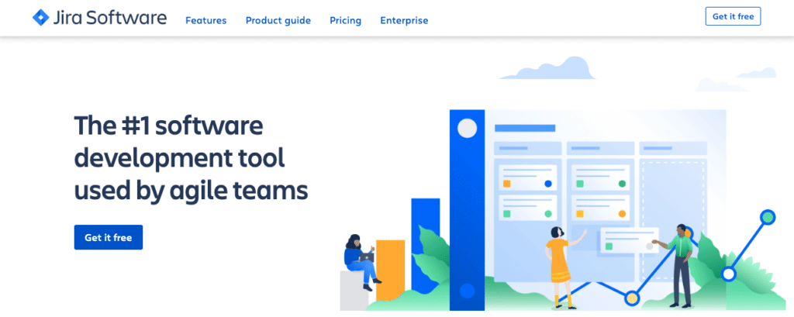
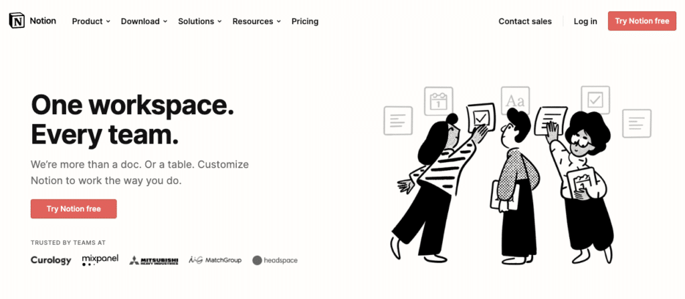

Over the last 20 years as a Project Manager, I’ve helped build many MVPs. Whether that's working with a team directly, or as part of an agency partnering with a startup team to turn their vision into reality.

In that time, I’ve used a number of different tools as the industry has evolved.

In my experience, there are 3 types of tools that are mandatory for any startup looking to build an MVP.

I’ve listed them below – as well as the specific ones I use every day.

But first, I wanted to give you a glimpse into the hurdles of project management, to help contextualise why the tools I’m sharing are so important.

.elementor-12941 .elementor-element.elementor-element-e56f4e6{--display:flex;--flex-direction:column;--container-widget-width:100%;--container-widget-height:initial;--container-widget-flex-grow:0;--container-widget-align-self:initial;--background-transition:0.3s;}.elementor-12941 .elementor-element.elementor-element-f8d1905{--box-background-color:var( --e-global-color-f6f9b04 );--box-border-color:var( --e-global-color-secondary );--box-border-width:1px;--box-border-radius:12px;--box-padding:12px;--header-color:var( --e-global-color-text );--separator-width:0px;--item-text-decoration:underline;--item-text-hover-decoration:underline;--marker-color:var( --e-global-color-primary );--marker-size:5px;}.elementor-12941 .elementor-element.elementor-element-f8d1905 .elementor-toc\_\_spinner{color:var( --e-global-color-secondary );fill:var( --e-global-color-secondary );}.elementor-12941 .elementor-element.elementor-element-f8d1905 .elementor-toc\_\_header, .elementor-12941 .elementor-element.elementor-element-f8d1905 .elementor-toc\_\_header-title{font-family:"Poppins", sans-serif;font-size:2.25rem;font-weight:700;text-transform:capitalize;line-height:1.2;}.elementor-12941 .elementor-element.elementor-element-f8d1905 .elementor-toc\_\_list-item{font-family:var( --e-global-typography-45f602c-font-family ), sans-serif;font-size:var( --e-global-typography-45f602c-font-size );font-weight:var( --e-global-typography-45f602c-font-weight );line-height:var( --e-global-typography-45f602c-line-height );letter-spacing:var( --e-global-typography-45f602c-letter-spacing );word-spacing:var( --e-global-typography-45f602c-word-spacing );}.elementor-12941 .elementor-element.elementor-element-f8d1905 > .elementor-widget-container{padding:32px 32px 32px 32px;}@media(max-width:1024px){.elementor-12941 .elementor-element.elementor-element-f8d1905 .elementor-toc\_\_list-item{font-size:var( --e-global-typography-45f602c-font-size );line-height:var( --e-global-typography-45f602c-line-height );letter-spacing:var( --e-global-typography-45f602c-letter-spacing );word-spacing:var( --e-global-typography-45f602c-word-spacing );}}@media(max-width:767px){.elementor-12941 .elementor-element.elementor-element-f8d1905 .elementor-toc\_\_list-item{font-size:var( --e-global-typography-45f602c-font-size );line-height:var( --e-global-typography-45f602c-line-height );letter-spacing:var( --e-global-typography-45f602c-letter-spacing );word-spacing:var( --e-global-typography-45f602c-word-spacing );}} /\*! elementor-pro - v3.19.0 - 07-02-2024 \*/  .elementor-widget-table-of-contents .elementor-toc\_\_header-title{color:var(--header-color)}.elementor-widget-table-of-contents.elementor-toc--collapsed .elementor-toc\_\_toggle-button--collapse,.elementor-widget-table-of-contents:not(.elementor-toc--collapsed) .elementor-toc\_\_toggle-button--expand{display:none}.elementor-widget-table-of-contents .elementor-widget-container{min-height:var(--box-min-height);border:var(--box-border-width,1px) solid var(--box-border-color,#9da5ae);border-radius:var(--box-border-radius,3px);background-color:var(--box-background-color);transition:min-height .4s;overflow:hidden}.elementor-toc\_\_header{display:flex;align-items:center;justify-content:space-between;padding:var(--box-padding,20px);background-color:var(--header-background-color);border-bottom:var(--separator-width,1px) solid var(--box-border-color,#9da5ae)}.elementor-toc\_\_header-title{font-size:18px;margin:0;color:var(--header-color)}.elementor-toc\_\_toggle-button{cursor:pointer;display:inline-flex}.elementor-toc\_\_toggle-button i{color:var(--toggle-button-color)}.elementor-toc\_\_toggle-button svg{height:1em;width:1em;fill:var(--toggle-button-color)}.elementor-toc\_\_spinner-container{text-align:center}.elementor-toc\_\_spinner{font-size:2em}.elementor-toc\_\_spinner.e-font-icon-svg{height:1em;width:1em}.elementor-toc\_\_body{padding:var(--box-padding,20px);max-height:var(--toc-body-max-height);overflow-y:auto}.elementor-toc\_\_body::-webkit-scrollbar{width:7px}.elementor-toc\_\_body::-webkit-scrollbar-thumb{background-color:#babfc5;border-radius:10px}.elementor-toc\_\_list-wrapper{list-style:none;padding:0}.elementor-toc\_\_list-item{margin-bottom:.5em}.elementor-toc\_\_list-item.elementor-item-active{font-weight:700}.elementor-toc\_\_list-item .elementor-toc\_\_list-wrapper{margin-top:.5em;margin-left:var(--nested-list-indent,1em)}.elementor-toc\_\_list-item-text:hover{color:var(--item-text-hover-color);-webkit-text-decoration:var(--item-text-hover-decoration);text-decoration:var(--item-text-hover-decoration)}.elementor-toc\_\_list-item-text.elementor-item-active{color:var(--item-text-active-color);-webkit-text-decoration:var(--item-text-active-decoration);text-decoration:var(--item-text-active-decoration)}.elementor-toc\_\_list-item-text-wrapper{display:flex;align-items:center}.elementor-toc\_\_list-item-text-wrapper:before,.elementor-toc\_\_list-item-text-wrapper i{margin-right:8px;color:var(--marker-color)}.elementor-toc\_\_list-item-text-wrapper svg{margin-right:8px;fill:var(--marker-color);height:var(--marker-size,.5em);width:var(--marker-size,.5em)}.elementor-toc\_\_list-item-text-wrapper i{font-size:var(--marker-size,.5em)}.elementor-toc\_\_list-item-text-wrapper:before{font-size:var(--marker-size,1em)}.elementor-toc--content-ellipsis .elementor-toc\_\_list-item-text{white-space:nowrap;overflow:hidden;text-overflow:ellipsis}.elementor-toc\_\_list-items--collapsible>.elementor-toc\_\_list-wrapper>.elementor-toc\_\_list-item>.elementor-toc\_\_list-wrapper{display:none}.elementor-toc\_\_heading-anchor{position:absolute}.elementor-toc\_\_body .elementor-toc\_\_list-item-text{color:var(--item-text-color);-webkit-text-decoration:var(--item-text-decoration);text-decoration:var(--item-text-decoration)}.elementor-toc\_\_body .elementor-toc\_\_list-item-text:hover{color:var(--item-text-hover-color);-webkit-text-decoration:var(--item-text-hover-decoration);text-decoration:var(--item-text-hover-decoration)}.elementor-toc\_\_body .elementor-toc\_\_list-item-text.elementor-item-active{color:var(--item-text-active-color);-webkit-text-decoration:var(--item-text-active-decoration);text-decoration:var(--item-text-active-decoration)}ol.elementor-toc\_\_list-wrapper{counter-reset:item}ol.elementor-toc\_\_list-wrapper .elementor-toc\_\_list-item{counter-increment:item}ol.elementor-toc\_\_list-wrapper .elementor-toc\_\_list-item-text-wrapper:before{content:counters(item,".") ". "}

#### Contents

## The Common Pitfalls of Project Management

The role of the Project Manager is a complex one. It requires balancing people, time, cost, scope and quality.

There are two critical elements to keep all those plates spinning: organisation and communication.

First, if you don’t keep things organised, you start to face issues where stakeholders are unclear on aspects of the project scope.

They lose sight of what’s been implemented and what hasn’t. They’re unsure when they should be working on specific elements of the project and deliverables start to fall behind.

The solution to this is clear tracking and managing of the project’s progress that is visible to all stakeholders.

Next, you need to ensure that you’re communicating with your team the right way.

For example, it’s easy to go to a meeting, or jump on a Zoom call, and plan your next sprint with precision specificity.

But did anyone write it down? If they did, is it in a document only they have access to? If they didn’t, how many of your stakeholders already forgot what was decided?

This is where inefficiencies creep in, resulting in miscommunication, a longer time to market and more money spent (wasted) on the development process.

The solution here is a centralised hub to track and store this information – as well as a way to collaboratively brainstorm with your team.

And, as the industry has evolved, the tools available to help you have both advanced considerably and become much easier to access.

Here are the three I recommend to avoid the common pitfalls mentioned above.

/\* widget: Blog: Expert Tip \*/  /\* reset -------------------- \*/  .blog-custom-block \*,  .blog-custom-block ::before,  .blog-custom-block ::after {  box-sizing: border-box;  border-width: 0;  border-style: solid;  border-color: #e5e7eb;  }  /\* vars -------------------- \*/  .blog-custom-block.blog-custom-block\_\_expert-tip {  --color-bg: #F4FAFE;  --color-border: rgb(15 164 234 / 0.50);  --color-text-1: #0F172A;  --color-text-2: #4A4A68;  }  /\* colors -------------------- \*/  .blog-custom-block.blog-custom-block\_\_expert-tip .bg-clr-bg {  background-color: var(--color-bg);  }  .blog-custom-block.blog-custom-block\_\_expert-tip .border-clr-border {  border-color: var(--color-border);  }  .blog-custom-block.blog-custom-block\_\_expert-tip .text-clr-text-1 {  color: var(--color-text-1);  }  .blog-custom-block.blog-custom-block\_\_expert-tip .text-clr-text-2 {  color: var(--color-text-2);  }  /\* utils -------------------- \*/  .blog-custom-block.blog-custom-block\_\_expert-tip .flex {  display: flex;  }  .blog-custom-block.blog-custom-block\_\_expert-tip .flex-shrink-0 {  flex-shrink: 0;  }  .blog-custom-block.blog-custom-block\_\_expert-tip .flex-col {  flex-direction: column;  }  .blog-custom-block.blog-custom-block\_\_expert-tip .gap-4 {  gap: 1rem;  }  .blog-custom-block.blog-custom-block\_\_expert-tip .gap-5 {  gap: 1.25rem;  }  .blog-custom-block.blog-custom-block\_\_expert-tip .rounded-xl {  border-radius: 0.75rem;  }  .blog-custom-block.blog-custom-block\_\_expert-tip .border {  border-width: 1px;  }  .blog-custom-block.blog-custom-block\_\_expert-tip .p-8 {  padding: 2rem;  }  .blog-custom-block.blog-custom-block\_\_expert-tip .text-3xl {  font-size: 1.875rem;  line-height: 2.25rem;  }  .blog-custom-block.blog-custom-block\_\_expert-tip .text-lg {  font-size: 1.125rem;  line-height: 1.75rem;  }  .blog-custom-block.blog-custom-block\_\_expert-tip .font-bold {  font-weight: 700;  } 

Full Transparency

This article does not contain affiliate links. Meaning neither I nor Altar.io receives any commission if you should choose to use any of the tools listed here. This list was created based purely on personal experience.

## 1\. A Ticket Management Tool to Help When Defining the Scope and Tracking Progress

When building an MVP, the first tool your Project Manager should be using is something to manage tasks and processes as you develop the scope of your product.

Setting up the processes that will track the product scope is a key task for your Project Manager.

If you don’t track and manage your scope correctly, your end product will not work as you intend it to. More than once, I’ve seen this lead to a product with a lot of reworks, increasing your time-to-market and eating away at your budget.

Here, resist the temptation to use spreadsheets to manage your scope and track your progress. It’s not a good option as spreadsheets are both prone to errors and require a lot of effort to maintain.

The tool I use with all the startup teams I work with is [Jira.](https://www.atlassian.com/software/jira)

Jira supports pretty much all development methodologies, it’s flexible and allows your team to manage requirements and view and collaborate on stories. More than that, it gives you an overview of what has been done and what’s still missing with the associated estimates.

You can also integrate Jira with a source code control tool – like Github – to give you full traceability from requirements to code.

Of course, this flexibility and versatility comes with downsides. The platform can feel a bit bloated and slow. That being said, the pros still outweigh the cons of this tool.

Other tools exist on the market that are more simple to use and manage, and if your project and processes are simple, then for sure other tools will be OK.

Related: [How to Build a Successful Minimum Viable Product (MVP) in 3 Steps](https://altar.io/features-inside-mvp-3-steps-know-answer/)

## 2\. A Tool to Create a Centralised Information Repository

The second mandatory tool your project manager should be using when building an MVP is a shared “wiki” or documentation repository.

That’s where [Confluence](https://www.atlassian.com/software/confluence) comes into play.

Developed by Atlassian (the creators of Jira, Trello, BitBucket and much more) it allows your team to create and store project documentation in a shared repository.

Documentation plays a critical role in your MVP development process and Confluence makes that process a lot easier.

And, as it’s also developed by Atlassian you can connect it directly to Jira. This eliminates the need for other shared drives and folders, meaning you can find what you need even quicker.

Confluence is not the only tool I would recommend for the task, however. [Notion](https://www.notion.so/) is another great tool to create your MVP’s centralised wiki.

You can also integrate Notion with Jira, and is more collaborative and up-to-date than Confluence.

##### Do you have a brilliant startup idea that you want to bring to life?

From the product and business reasoning to streamlining your MVP to the most important features, our team of product experts and ex-startup founders can help you bring your vision to life.

Let's Talk

## 3\. A Collaborative Brainstorming Tool

The third and final tool your project manager should be using as you set out to build your MVP is a collaborative brainstorming tool.

Here [Miro](https://miro.com/index/) wins outright in my eyes.

The ability to collaboratively create and share visual documentation in real-time is invaluable.

My teams and I use it for everything from brainstorming to defining processes and architecture – and everything in between.

Related: [Successful Entrepreneurs Share the Tools They Can't Live Without](https://altar.io/tools-for-entrepreneurs/)

## Wrapping Up

The above tools will help you ensure your team is able to stay on track. They help you provide visibility to every stakeholder at every stage of the project.

That being said, you still need to have the proper processes in place to scope your product and make full use of these tools. Check out [this article](https://altar.io/features-inside-mvp-3-steps-know-answer/) by my CEO and co-founder to learn more.

Thanks for reading.
