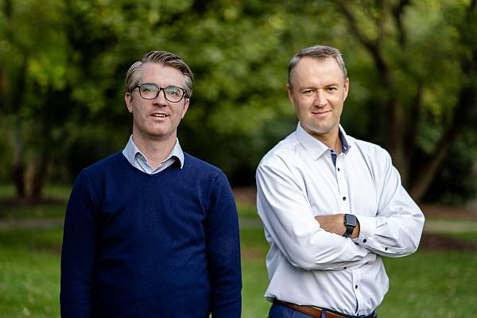

Two minutes into our latest startup founder interview - the ninth in the Startup Journey series - and I knew I was in for a treat.

Just check out my face!

It was during those first two minutes that [Wade Eyerly](https://www.linkedin.com/in/wadeeyerly/) shared a significant part of his background, like how he:

- Built an airline that pioneered subscription-based flying (that's also a [unicorn startup that just completed a successful IPO](https://www.bloomberg.com/news/articles/2022-05-18/surf-air-to-go-public-via-spac-deal-at-1-42-billion-value))
- Worked at the Pentagon as an Economist
- Served a tour in Iraq
- Built an innovative fintech product to solve a national crisis

Throughout our conversation, Wade shared incredible lessons and insights from his startup experience.

I mean, building an airline from scratch because his little brother needed a job?

Moving away from a stable high-paying job in a company about to go public to create a completely disruptive fintech product?

From his passion in explaining his new project (which every startup founder should take as an inspiration when creating a pitch deck), to his explanation of why curiosity is his definitive superpower, this is a conversation every entrepreneur should read at least once.

 \_\_list-item{font-size:var( --e-global-typography-45f602c-font-size );line-height:var( --e-global-typography-45f602c-line-height );letter-spacing:var( --e-global-typography-45f602c-letter-spacing );word-spacing:var( --e-global-typography-45f602c-word-spacing );}}@media(max-width:767px){.elementor-12941 .elementor-element.elementor-element-f8d1905 .elementor-toc\_\_list-item{font-size:var( --e-global-typography-45f602c-font-size );line-height:var( --e-global-typography-45f602c-line-height );letter-spacing:var( --e-global-typography-45f602c-letter-spacing );word-spacing:var( --e-global-typography-45f602c-word-spacing );}}

#### Contents

## About Wade Eyerly

#### Rui: Wade thank you once again for agreeing to share your story. Can you tell us a bit about yourself and your background, please?

**Wade:** Sure. I grew up in Kansas City. I'm the oldest of eight kids and I didn't know you were supposed to apply to college. Instead, I drove to a school an hour from home in August and asked how to sign up for a dorm.

Twenty minutes later, a kindhearted registrar took pity on me and eventually let me in.

I spent some time there, and then I moved to DC. After, I worked for an intelligence agency for a while. Then I was an economist at the Pentagon for a while. I hunted bad guys for a little bit. Served one tour in Iraq. Came back. My little brother was a pilot and needed a job.

So we started an airline. We were the first to do subscription flying.

Then I left aviation about three years ago to invent a new financial product.

I’m also a dad of three little boys – I guess that's a very quick overview of me.

## The Idea Behind Degree Insurance

#### R: I can already tell this is going to be an interesting conversation.

#### Let’s start with your latest startup venture – can you tell us a bit more about this new financial product?

**W:**  So the idea for this project came up when working on the first airline I built with my brother.

One of our pilots was moving boxes over the weekend – he was moving apartments – and tweaked his back.

Now, he’s not disabled. However, he can’t sit in a chair for eight hours a day without taking some sort of pain medication.

At most jobs, you get up, you walk around or you use a standing desk. There are 101 ways to address this problem.

You can’t do that in a cockpit. It doesn’t work like that.

I need you to sit in a chair for eight-plus hours. More than that, I can’t have you on pain meds when you’re piloting an aeroplane with humans in it!

So in a freak accident, and through no fault of his own, our pilot lost his career – just like that.

A career he had spent, probably around, $250,000 investing in.

Learning to fly, literally burning jet fuel in college, etc.

At the time I lamented to one of my co-founders how tragic it was. He’d made this huge investment that was never going to pay off.

And that was a little bit of a light bulb moment for me.

Thinking of higher education as an investment – framing it that way. Because, at the end of the day, you go to college to increase the amount of money you’re going to make. You’re looking for a new ROI.

That was the moment I realized that higher education is essentially the largest uninsured investment market in the world.

It's the only time you would counsel someone you love to borrow 10 or 20 times their net worth and make a single investment with it. And then just hope that it works.

/\* widget: Blog: Top Quote \*/  /\* reset -------------------- \*/  .blog-custom-block \*,  .blog-custom-block ::before,  .blog-custom-block ::after {  box-sizing: border-box;  border-width: 0;  border-style: solid;  border-color: #e5e7eb;  }  /\* vars -------------------- \*/  .blog-custom-block.blog-custom-block\_\_top-quote {  --color-bg: #F4FAFE;  --color-border: rgb(15 164 234 / 0.50);  --color-text-1: #0F172A;  }  /\* colors -------------------- \*/  .blog-custom-block.blog-custom-block\_\_top-quote .border-clr-border {  border-color: var(--color-border);  }  .blog-custom-block.blog-custom-block\_\_top-quote .bg-clr-bg {  background-color: var(--color-bg);  }  .blog-custom-block.blog-custom-block\_\_simple-quote .text-clr-text-1 {  color: var(--color-text-1);  }  /\* utils -------------------- \*/  .blog-custom-block.blog-custom-block\_\_top-quote .flex {  display: flex;  }  .blog-custom-block.blog-custom-block\_\_top-quote .flex-shrink-0 {  flex-shrink: 0;  }  .blog-custom-block.blog-custom-block\_\_top-quote .flex-col {  flex-direction: column;  }  .blog-custom-block.blog-custom-block\_\_top-quote .items-center {  align-items: center;  }  .blog-custom-block.blog-custom-block\_\_top-quote .gap-4 {  gap: 1rem;  }  .blog-custom-block.blog-custom-block\_\_top-quote .rounded-xl {  border-radius: 0.75rem;  }  .blog-custom-block.blog-custom-block\_\_top-quote .border {  border-width: 1px;  }  .blog-custom-block.blog-custom-block\_\_top-quote .p-8 {  padding: 2rem;  }  .blog-custom-block.blog-custom-block\_\_top-quote .text-center {  text-align: center;  }  .blog-custom-block.blog-custom-block\_\_top-quote .text-2xl {  font-size: 1.5rem;  line-height: 2rem;  }  .blog-custom-block.blog-custom-block\_\_top-quote .font-bold {  font-weight: 700;  } 

Going to college is a huge bet. You’re betting that you’re going to do well, get good grades, that you’ll outperform the mean. It’s a bet on you.

Not to mention, this is probably the first legal document you’ve signed at 18 years old. And 18-year-olds aren't yet financially literate. That's partly why they're going to college!

It’s also a very dangerous debt because it’s non-dischargeable debt. This means, in the US, that if you go through bankruptcy, this debt doesn’t go away. It’s mob money. You will have to pay no matter what!

And all the factors most people think determine your success after college actually don’t matter that much.

Things like where you go to school,  what you study, who you study under, your GPA, etc.

The thing that actually determines whether or not your degree will make you money is what happens in the state of the macroeconomy in the year you graduate.

Say you start college in 2005. In your junior year, Apple unveils the iPhone and unlocks a tremendous amount of economic potential.

Your senior year, [Lehman Brothers goes bust](https://www.investopedia.com/articles/economics/09/lehman-brothers-collapse.asp) and there are no jobs.

And either one of those two things was more predictive of what you were going to earn than anything you did in college.

/\* widget: Blog: Top Quote \*/  /\* reset -------------------- \*/  .blog-custom-block \*,  .blog-custom-block ::before,  .blog-custom-block ::after {  box-sizing: border-box;  border-width: 0;  border-style: solid;  border-color: #e5e7eb;  }  /\* vars -------------------- \*/  .blog-custom-block.blog-custom-block\_\_top-quote {  --color-bg: #F4FAFE;  --color-border: rgb(15 164 234 / 0.50);  --color-text-1: #0F172A;  }  /\* colors -------------------- \*/  .blog-custom-block.blog-custom-block\_\_top-quote .border-clr-border {  border-color: var(--color-border);  }  .blog-custom-block.blog-custom-block\_\_top-quote .bg-clr-bg {  background-color: var(--color-bg);  }  .blog-custom-block.blog-custom-block\_\_simple-quote .text-clr-text-1 {  color: var(--color-text-1);  }  /\* utils -------------------- \*/  .blog-custom-block.blog-custom-block\_\_top-quote .flex {  display: flex;  }  .blog-custom-block.blog-custom-block\_\_top-quote .flex-shrink-0 {  flex-shrink: 0;  }  .blog-custom-block.blog-custom-block\_\_top-quote .flex-col {  flex-direction: column;  }  .blog-custom-block.blog-custom-block\_\_top-quote .items-center {  align-items: center;  }  .blog-custom-block.blog-custom-block\_\_top-quote .gap-4 {  gap: 1rem;  }  .blog-custom-block.blog-custom-block\_\_top-quote .rounded-xl {  border-radius: 0.75rem;  }  .blog-custom-block.blog-custom-block\_\_top-quote .border {  border-width: 1px;  }  .blog-custom-block.blog-custom-block\_\_top-quote .p-8 {  padding: 2rem;  }  .blog-custom-block.blog-custom-block\_\_top-quote .text-center {  text-align: center;  }  .blog-custom-block.blog-custom-block\_\_top-quote .text-2xl {  font-size: 1.5rem;  line-height: 2rem;  }  .blog-custom-block.blog-custom-block\_\_top-quote .font-bold {  font-weight: 700;  } 

So now you’re not just making a bet on yourself. You're making a bet on the macro economy with no hedge or protection.

I mean, you wouldn't counsel somebody you love to borrow 10x their net worth and put it into Amazon or Bitcoin or whatever – right?

You wouldn’t tell them to bet on a five-year time horizon, put everything on red and spin the roulette wheel.

Not when it takes 21 years to pay back those loans on average.

Even though it’s a roulette wheel where 90% of spaces pay off. Because on average nine out of ten years are good.

But then there’s that one year where you get a pandemic, or a housing crisis, or 9/11. Whatever it is, on average one in every 10 years is a bad year.

So as a society, in aggregate, it works. 90% of the time college hits and delivers great ROI. So we should put more money into it and we should have as much of society do this as possible. Everybody should go to college and society and the economy wins.

But you're not average, right? You believe you're going to outperform the average. But in reality, you don't control whether or not it works for you in many ways.

So what happens if you graduate in the wrong year?

I was the first graduating class after 9/11.  A ton of kids graduated in the middle of the housing crisis. Kids today are finishing college in a pandemic they certainly didn’t anticipate.

So, you come out and you anchor your market rate at a low point. The economy will rebound but your career won't. You'll go back to a 3% annual wage increase.

/\* widget: Blog: Top Quote \*/  /\* reset -------------------- \*/  .blog-custom-block \*,  .blog-custom-block ::before,  .blog-custom-block ::after {  box-sizing: border-box;  border-width: 0;  border-style: solid;  border-color: #e5e7eb;  }  /\* vars -------------------- \*/  .blog-custom-block.blog-custom-block\_\_top-quote {  --color-bg: #F4FAFE;  --color-border: rgb(15 164 234 / 0.50);  --color-text-1: #0F172A;  }  /\* colors -------------------- \*/  .blog-custom-block.blog-custom-block\_\_top-quote .border-clr-border {  border-color: var(--color-border);  }  .blog-custom-block.blog-custom-block\_\_top-quote .bg-clr-bg {  background-color: var(--color-bg);  }  .blog-custom-block.blog-custom-block\_\_simple-quote .text-clr-text-1 {  color: var(--color-text-1);  }  /\* utils -------------------- \*/  .blog-custom-block.blog-custom-block\_\_top-quote .flex {  display: flex;  }  .blog-custom-block.blog-custom-block\_\_top-quote .flex-shrink-0 {  flex-shrink: 0;  }  .blog-custom-block.blog-custom-block\_\_top-quote .flex-col {  flex-direction: column;  }  .blog-custom-block.blog-custom-block\_\_top-quote .items-center {  align-items: center;  }  .blog-custom-block.blog-custom-block\_\_top-quote .gap-4 {  gap: 1rem;  }  .blog-custom-block.blog-custom-block\_\_top-quote .rounded-xl {  border-radius: 0.75rem;  }  .blog-custom-block.blog-custom-block\_\_top-quote .border {  border-width: 1px;  }  .blog-custom-block.blog-custom-block\_\_top-quote .p-8 {  padding: 2rem;  }  .blog-custom-block.blog-custom-block\_\_top-quote .text-center {  text-align: center;  }  .blog-custom-block.blog-custom-block\_\_top-quote .text-2xl {  font-size: 1.5rem;  line-height: 2rem;  }  .blog-custom-block.blog-custom-block\_\_top-quote .font-bold {  font-weight: 700;  } 

The fact is you dramatically depress your lifetime earnings by graduating in the wrong year.

So what do you do?

Well if you’re wealthy, you self-insure and go to grad school. Graduate enrollment spikes in a down economy. Those who can double down and spin the wheel again.

After all, two shots at a 90% payout will probably work. And it does – consistently.

So, you hide from the economy in a socially acceptable way for a couple of years and spin again. After all, nobody’s embarrassed that you’re going to grad school.

If you’re a first-generation American, a first-gen student, an underrepresented minority,  [Pell-eligible](https://studentaid.gov/understand-aid/types/grants/pell), or otherwise poor, you probably don't have that chance.

You have to go to work now. Remember it takes 21 years to pay back your student loans, on average.

So now your family has been set back a full generation.

You’ll still be paying back your loan when your kid says: Mom, can you co-sign on my loans?

This is not how it was 10, or 15 years ago. This is uncharted territory.

/\* widget: Blog: Top Quote \*/  /\* reset -------------------- \*/  .blog-custom-block \*,  .blog-custom-block ::before,  .blog-custom-block ::after {  box-sizing: border-box;  border-width: 0;  border-style: solid;  border-color: #e5e7eb;  }  /\* vars -------------------- \*/  .blog-custom-block.blog-custom-block\_\_top-quote {  --color-bg: #F4FAFE;  --color-border: rgb(15 164 234 / 0.50);  --color-text-1: #0F172A;  }  /\* colors -------------------- \*/  .blog-custom-block.blog-custom-block\_\_top-quote .border-clr-border {  border-color: var(--color-border);  }  .blog-custom-block.blog-custom-block\_\_top-quote .bg-clr-bg {  background-color: var(--color-bg);  }  .blog-custom-block.blog-custom-block\_\_simple-quote .text-clr-text-1 {  color: var(--color-text-1);  }  /\* utils -------------------- \*/  .blog-custom-block.blog-custom-block\_\_top-quote .flex {  display: flex;  }  .blog-custom-block.blog-custom-block\_\_top-quote .flex-shrink-0 {  flex-shrink: 0;  }  .blog-custom-block.blog-custom-block\_\_top-quote .flex-col {  flex-direction: column;  }  .blog-custom-block.blog-custom-block\_\_top-quote .items-center {  align-items: center;  }  .blog-custom-block.blog-custom-block\_\_top-quote .gap-4 {  gap: 1rem;  }  .blog-custom-block.blog-custom-block\_\_top-quote .rounded-xl {  border-radius: 0.75rem;  }  .blog-custom-block.blog-custom-block\_\_top-quote .border {  border-width: 1px;  }  .blog-custom-block.blog-custom-block\_\_top-quote .p-8 {  padding: 2rem;  }  .blog-custom-block.blog-custom-block\_\_top-quote .text-center {  text-align: center;  }  .blog-custom-block.blog-custom-block\_\_top-quote .text-2xl {  font-size: 1.5rem;  line-height: 2rem;  }  .blog-custom-block.blog-custom-block\_\_top-quote .font-bold {  font-weight: 700;  } 

When we looked at that and, once we really understood it, we said, all right, this is a problem we can address.

And higher education works and performs consistently. Look at it as if it were a stock market.

A college degree outperforms the market by 2X delivering about 17% ROI annually. Oh, and it's the most consistent performer in history. So it’s a good thing to do with your money, right?

With that kind of performance, no one has really seen a need for insurance on that investment before.

But, building a startup to spread the risk, cover the margins where it falls short – where it doesn’t deliver on the ROI – that’s a must now.

So we set out to do that.

I had another experience that impacted this idea.

I was serving on the board of a school board in Bridgeport, Connecticut, of a school called Great Oaks. This school is a 90% plus minority school.

We’d take kids that were two years behind and we'd get them caught up by the time they graduate.

So, we'd get them into college. And I wanted to tell the life cycle of this story.

How do we impact their lives? How does it change the trajectory? What do they go on to do, who became a scientist? That kind of a thing.

And I thought that would be great marketing for the school. Moreover, it would feel good to understand how we impacted them.

/\* widget: Blog: Top Quote \*/  /\* reset -------------------- \*/  .blog-custom-block \*,  .blog-custom-block ::before,  .blog-custom-block ::after {  box-sizing: border-box;  border-width: 0;  border-style: solid;  border-color: #e5e7eb;  }  /\* vars -------------------- \*/  .blog-custom-block.blog-custom-block\_\_top-quote {  --color-bg: #F4FAFE;  --color-border: rgb(15 164 234 / 0.50);  --color-text-1: #0F172A;  }  /\* colors -------------------- \*/  .blog-custom-block.blog-custom-block\_\_top-quote .border-clr-border {  border-color: var(--color-border);  }  .blog-custom-block.blog-custom-block\_\_top-quote .bg-clr-bg {  background-color: var(--color-bg);  }  .blog-custom-block.blog-custom-block\_\_simple-quote .text-clr-text-1 {  color: var(--color-text-1);  }  /\* utils -------------------- \*/  .blog-custom-block.blog-custom-block\_\_top-quote .flex {  display: flex;  }  .blog-custom-block.blog-custom-block\_\_top-quote .flex-shrink-0 {  flex-shrink: 0;  }  .blog-custom-block.blog-custom-block\_\_top-quote .flex-col {  flex-direction: column;  }  .blog-custom-block.blog-custom-block\_\_top-quote .items-center {  align-items: center;  }  .blog-custom-block.blog-custom-block\_\_top-quote .gap-4 {  gap: 1rem;  }  .blog-custom-block.blog-custom-block\_\_top-quote .rounded-xl {  border-radius: 0.75rem;  }  .blog-custom-block.blog-custom-block\_\_top-quote .border {  border-width: 1px;  }  .blog-custom-block.blog-custom-block\_\_top-quote .p-8 {  padding: 2rem;  }  .blog-custom-block.blog-custom-block\_\_top-quote .text-center {  text-align: center;  }  .blog-custom-block.blog-custom-block\_\_top-quote .text-2xl {  font-size: 1.5rem;  line-height: 2rem;  }  .blog-custom-block.blog-custom-block\_\_top-quote .font-bold {  font-weight: 700;  } 

We came to find out 90% of those kids are going to drop out in the first two years of college. Which means we didn't help them, we actually made them poorer.

We helped them borrow money and make an investment that doesn't pay off.

Look, not everyone _should_ go to college, that’s for sure. But if you go to college, you n_eed_ to finish.

We had the wrong goalpost.

We believe, and we've said for a long time, going to college is the path of the American dream. Going to college is the way you sort of, level up, right? And it's completely false.

Going to college does not do that. Graduating college does that.

And it's a subtle, but really important distinction: Going to college is step one to graduating.

If you get the bib to run the Boston marathon, you still don't have a recorded time. You still didn't run it.

We've got to get them all the way through to the other side. And realizing that we were failing these kids highlighted something else.

It highlighted that 40% of **all** students in the US that start college this year won’t graduate within six years.

Which means:

/\* widget: Blog: Top Quote \*/  /\* reset -------------------- \*/  .blog-custom-block \*,  .blog-custom-block ::before,  .blog-custom-block ::after {  box-sizing: border-box;  border-width: 0;  border-style: solid;  border-color: #e5e7eb;  }  /\* vars -------------------- \*/  .blog-custom-block.blog-custom-block\_\_top-quote {  --color-bg: #F4FAFE;  --color-border: rgb(15 164 234 / 0.50);  --color-text-1: #0F172A;  }  /\* colors -------------------- \*/  .blog-custom-block.blog-custom-block\_\_top-quote .border-clr-border {  border-color: var(--color-border);  }  .blog-custom-block.blog-custom-block\_\_top-quote .bg-clr-bg {  background-color: var(--color-bg);  }  .blog-custom-block.blog-custom-block\_\_simple-quote .text-clr-text-1 {  color: var(--color-text-1);  }  /\* utils -------------------- \*/  .blog-custom-block.blog-custom-block\_\_top-quote .flex {  display: flex;  }  .blog-custom-block.blog-custom-block\_\_top-quote .flex-shrink-0 {  flex-shrink: 0;  }  .blog-custom-block.blog-custom-block\_\_top-quote .flex-col {  flex-direction: column;  }  .blog-custom-block.blog-custom-block\_\_top-quote .items-center {  align-items: center;  }  .blog-custom-block.blog-custom-block\_\_top-quote .gap-4 {  gap: 1rem;  }  .blog-custom-block.blog-custom-block\_\_top-quote .rounded-xl {  border-radius: 0.75rem;  }  .blog-custom-block.blog-custom-block\_\_top-quote .border {  border-width: 1px;  }  .blog-custom-block.blog-custom-block\_\_top-quote .p-8 {  padding: 2rem;  }  .blog-custom-block.blog-custom-block\_\_top-quote .text-center {  text-align: center;  }  .blog-custom-block.blog-custom-block\_\_top-quote .text-2xl {  font-size: 1.5rem;  line-height: 2rem;  }  .blog-custom-block.blog-custom-block\_\_top-quote .font-bold {  font-weight: 700;  } 

Higher education in the US is dangerously close to making more families poor than wealthy.

Which is mind-boggling – and nobody pays attention to it.

Instead, they look at the fact there's $1.7 trillion in student debt.

The reality is the average student:

- Borrows $7k a year
- Takes five years to graduate
- Graduates $35k grand in debt
- Takes 21 years to pay it back

That means you’re going to have to pay $181 a month on average.

If you graduate college, you're going to increase your lifetime earnings by $1M to $2.4M on average (depending on what study you like).

If you're gonna make a million dollars more in your life, you can pay 181 bucks a month for the next 21 years.

That's a good investment.

The fact is the majority of people who default on their loans borrowed less than 10 grand. But they never graduated college.

**We made them poorer.** 

They can't dig out from it. They can't pay that 181 bucks a month, or whatever it is.

When you look at the overall number sure it looks bad. There are over a thousand people with more than $1M in student loans.

But they’ve got four degrees and they're going to be fine.

They went to elite institutions. They have a divinity degree from Yale and a business degree from Harvard and an undergrad at Princeton. They’re going to be alright!

Those kids didn't go to a school like Central Missouri State where I went. You could not borrow a million dollars and go to Central Missouri State.

All of this to say:

/\* widget: Blog: Top Quote \*/  /\* reset -------------------- \*/  .blog-custom-block \*,  .blog-custom-block ::before,  .blog-custom-block ::after {  box-sizing: border-box;  border-width: 0;  border-style: solid;  border-color: #e5e7eb;  }  /\* vars -------------------- \*/  .blog-custom-block.blog-custom-block\_\_top-quote {  --color-bg: #F4FAFE;  --color-border: rgb(15 164 234 / 0.50);  --color-text-1: #0F172A;  }  /\* colors -------------------- \*/  .blog-custom-block.blog-custom-block\_\_top-quote .border-clr-border {  border-color: var(--color-border);  }  .blog-custom-block.blog-custom-block\_\_top-quote .bg-clr-bg {  background-color: var(--color-bg);  }  .blog-custom-block.blog-custom-block\_\_simple-quote .text-clr-text-1 {  color: var(--color-text-1);  }  /\* utils -------------------- \*/  .blog-custom-block.blog-custom-block\_\_top-quote .flex {  display: flex;  }  .blog-custom-block.blog-custom-block\_\_top-quote .flex-shrink-0 {  flex-shrink: 0;  }  .blog-custom-block.blog-custom-block\_\_top-quote .flex-col {  flex-direction: column;  }  .blog-custom-block.blog-custom-block\_\_top-quote .items-center {  align-items: center;  }  .blog-custom-block.blog-custom-block\_\_top-quote .gap-4 {  gap: 1rem;  }  .blog-custom-block.blog-custom-block\_\_top-quote .rounded-xl {  border-radius: 0.75rem;  }  .blog-custom-block.blog-custom-block\_\_top-quote .border {  border-width: 1px;  }  .blog-custom-block.blog-custom-block\_\_top-quote .p-8 {  padding: 2rem;  }  .blog-custom-block.blog-custom-block\_\_top-quote .text-center {  text-align: center;  }  .blog-custom-block.blog-custom-block\_\_top-quote .text-2xl {  font-size: 1.5rem;  line-height: 2rem;  }  .blog-custom-block.blog-custom-block\_\_top-quote .font-bold {  font-weight: 700;  } 

It was combining those two experiences that made us realise that this is a very real problem. And it's very solvable.

You get insurance on your house, on your car, on your cell phone, etc. But you're going to borrow a hundred grand, put it on red, spin a wheel, and just hope.

With no insurance, no hedge against it. You should not mortgage your future, put it on one thing and hope – it's not a good strategy.

So we built a hedge to correct against it.

We don't sell it to individuals. You get self-selection bias, you get all sorts of issues. Either you get the most financially literate kids who buy it or those that are least confident in their futures.

Instead, we sell it to colleges.

Colleges can now guarantee you get a wage fit for your degree for five years after you graduate. The coverage depends on what you graduate in. Whether it's $56k a year for Physics, $44k for business, $38k for English, you get the idea.

Now colleges can use that to attract more students to go there. And, more importantly, to stay there and not drop out.

Because now as a student you have an angel on your shoulder. And when you think college might not work for you, and that you’ll end up a bartender or whatever, it’s saying:

“It doesn’t matter. If you finish and end up a bartender **you still can’t make less than $44k a year**.”

Or whatever your guarantee would be.

You're just going to send us your tax returns and we're going to cut you a check. That's how it works.

/\* widget: Blog: Top Quote \*/  /\* reset -------------------- \*/  .blog-custom-block \*,  .blog-custom-block ::before,  .blog-custom-block ::after {  box-sizing: border-box;  border-width: 0;  border-style: solid;  border-color: #e5e7eb;  }  /\* vars -------------------- \*/  .blog-custom-block.blog-custom-block\_\_top-quote {  --color-bg: #F4FAFE;  --color-border: rgb(15 164 234 / 0.50);  --color-text-1: #0F172A;  }  /\* colors -------------------- \*/  .blog-custom-block.blog-custom-block\_\_top-quote .border-clr-border {  border-color: var(--color-border);  }  .blog-custom-block.blog-custom-block\_\_top-quote .bg-clr-bg {  background-color: var(--color-bg);  }  .blog-custom-block.blog-custom-block\_\_simple-quote .text-clr-text-1 {  color: var(--color-text-1);  }  /\* utils -------------------- \*/  .blog-custom-block.blog-custom-block\_\_top-quote .flex {  display: flex;  }  .blog-custom-block.blog-custom-block\_\_top-quote .flex-shrink-0 {  flex-shrink: 0;  }  .blog-custom-block.blog-custom-block\_\_top-quote .flex-col {  flex-direction: column;  }  .blog-custom-block.blog-custom-block\_\_top-quote .items-center {  align-items: center;  }  .blog-custom-block.blog-custom-block\_\_top-quote .gap-4 {  gap: 1rem;  }  .blog-custom-block.blog-custom-block\_\_top-quote .rounded-xl {  border-radius: 0.75rem;  }  .blog-custom-block.blog-custom-block\_\_top-quote .border {  border-width: 1px;  }  .blog-custom-block.blog-custom-block\_\_top-quote .p-8 {  padding: 2rem;  }  .blog-custom-block.blog-custom-block\_\_top-quote .text-center {  text-align: center;  }  .blog-custom-block.blog-custom-block\_\_top-quote .text-2xl {  font-size: 1.5rem;  line-height: 2rem;  }  .blog-custom-block.blog-custom-block\_\_top-quote .font-bold {  font-weight: 700;  } 

And the kicker is colleges actually make money from our product by the time they're done.

Imagine for every student that drops out the college makes three semesters worth of tuition when they thought they were going to make ten.

If that student stays because of our product,  we’ve given the school seven more semesters of tuition. That means our product pays for itself very quickly.

So for the school, it makes sense.

For the student, they're still free in that period to discover who they are and figure that out. Safe in the knowledge when they leave they have a safety net.

Hey, I thought I was wanting to be a graphic designer when I went to college.

I took one class, looked around and realized what I had was an **interest** in graphic design. What other people had was **talent**.

And talent was going to be much more important in an art-based career. I sucked – and it didn't take 20 minutes to figure out.

I had to switch my major and that's fine. That's a period of self-discovery.

I took an econ class, fell in love, knew what I wanted to do. And that's great. And that’s how it’s supposed to be!

You know, it’s pretty safe to say nowadays that a STEM major will make more than a non-STEM major. We know that directionality.

But what about magnitude? How _much_ more does a maths major make than an English major, for example?

What if it's 1800 bucks a year? Is it worth the switch if you'd be way happier as an English Lit major, as a writer?

/\* widget: Blog: Top Quote \*/  /\* reset -------------------- \*/  .blog-custom-block \*,  .blog-custom-block ::before,  .blog-custom-block ::after {  box-sizing: border-box;  border-width: 0;  border-style: solid;  border-color: #e5e7eb;  }  /\* vars -------------------- \*/  .blog-custom-block.blog-custom-block\_\_top-quote {  --color-bg: #F4FAFE;  --color-border: rgb(15 164 234 / 0.50);  --color-text-1: #0F172A;  }  /\* colors -------------------- \*/  .blog-custom-block.blog-custom-block\_\_top-quote .border-clr-border {  border-color: var(--color-border);  }  .blog-custom-block.blog-custom-block\_\_top-quote .bg-clr-bg {  background-color: var(--color-bg);  }  .blog-custom-block.blog-custom-block\_\_simple-quote .text-clr-text-1 {  color: var(--color-text-1);  }  /\* utils -------------------- \*/  .blog-custom-block.blog-custom-block\_\_top-quote .flex {  display: flex;  }  .blog-custom-block.blog-custom-block\_\_top-quote .flex-shrink-0 {  flex-shrink: 0;  }  .blog-custom-block.blog-custom-block\_\_top-quote .flex-col {  flex-direction: column;  }  .blog-custom-block.blog-custom-block\_\_top-quote .items-center {  align-items: center;  }  .blog-custom-block.blog-custom-block\_\_top-quote .gap-4 {  gap: 1rem;  }  .blog-custom-block.blog-custom-block\_\_top-quote .rounded-xl {  border-radius: 0.75rem;  }  .blog-custom-block.blog-custom-block\_\_top-quote .border {  border-width: 1px;  }  .blog-custom-block.blog-custom-block\_\_top-quote .p-8 {  padding: 2rem;  }  .blog-custom-block.blog-custom-block\_\_top-quote .text-center {  text-align: center;  }  .blog-custom-block.blog-custom-block\_\_top-quote .text-2xl {  font-size: 1.5rem;  line-height: 2rem;  }  .blog-custom-block.blog-custom-block\_\_top-quote .font-bold {  font-weight: 700;  } 

If you don’t have a safety net you’re scared of changing your major and discovering your passion. A safety net will empower you as a student to make better decisions

And that’s what we've provided. We're not telling you you're going to make $41,000 a year. We're telling you you're going to make **at least** $41,000 a year.

A safety net disproportionately supports those who take disproportionate risk.

If you think about walking a high wire in a circus, the safety net catches the guy who's wobbliest.

If your family background, if your race, gender, ethnicity, whatever it is, means you have a different or a diminished outcome the safety net is more likely to catch you.

Say for example, that you’re at a high risk of making 81 cents on the dollar compared to a white male in the same job. If that proves true for you, the safety net picks you back up.

So you get to start, to build your career from a stable position, from a safe place.

Our startup reduces the risk of inequality. That is incredibly important in moving people into the middle class and keeping them there.

##### Do you have a brilliant startup idea that you want to bring to life?

From the product and business reasoning to streamlining your MVP to the most important features, our team of product experts and ex-startup founders can help you bring your vision to life.

Let's Talk

## Going “All-In” on the Startup Idea

#### R: From a problem-solution standpoint it's completely clear.

#### You were at Surf Air when you had the spark for the idea, and your other experiences supported the idea further.

#### But when did you know that you could go 100% dedicated full-time to it?

**W:** So it was around 2013 when the pilot hurt his back. I essentially sat on the idea for five years.

In that time I built an airline. Then I helped kick off a second one. After selling the second back to its parent company I decided to launch a third.

I was doing that largely because I developed this expertise and I thought I needed to double down on it. After all, if you're good at something, why not stick with it.

We were the first company ever to build an “all you can fly” subscription airline.  We were pioneers.

And while I am not in any way famous there's a tiny little niche of people who follow airlines who would actually know who I am.

And so it felt like I needed to continue to develop that – so that’s what I did.

But I couldn't stop thinking about this idea of college insurance, I’d come back to it regularly.

And it's what I wanted to do. But, I felt like I needed to stay in aviation because it was stable and I had the expertise.

Related: [From Being Fired to Building a Multi-Million Dollar Fintech Startup](https://altar.io/from-being-fired-to-building-a-multi-million-dollar-fintech-startup/)

#### R: You actually found your blue ocean and then you felt the urge to go and build something else.

#### That's one of the most entrepreneurial mindsets that I've seen.

**W:**  I often tell people that a good startup entrepreneur is like a good screenwriter.

The screenwriter has a dozen half-written scripts in their drawer. They pull it out and they write the 30 pages, but it's not done.

I feel like good startup entrepreneurs are the same way. It's not just one thing. It's all the things.

I gave a speech just yesterday and I was saying:

/\* widget: Blog: Top Quote \*/  /\* reset -------------------- \*/  .blog-custom-block \*,  .blog-custom-block ::before,  .blog-custom-block ::after {  box-sizing: border-box;  border-width: 0;  border-style: solid;  border-color: #e5e7eb;  }  /\* vars -------------------- \*/  .blog-custom-block.blog-custom-block\_\_top-quote {  --color-bg: #F4FAFE;  --color-border: rgb(15 164 234 / 0.50);  --color-text-1: #0F172A;  }  /\* colors -------------------- \*/  .blog-custom-block.blog-custom-block\_\_top-quote .border-clr-border {  border-color: var(--color-border);  }  .blog-custom-block.blog-custom-block\_\_top-quote .bg-clr-bg {  background-color: var(--color-bg);  }  .blog-custom-block.blog-custom-block\_\_simple-quote .text-clr-text-1 {  color: var(--color-text-1);  }  /\* utils -------------------- \*/  .blog-custom-block.blog-custom-block\_\_top-quote .flex {  display: flex;  }  .blog-custom-block.blog-custom-block\_\_top-quote .flex-shrink-0 {  flex-shrink: 0;  }  .blog-custom-block.blog-custom-block\_\_top-quote .flex-col {  flex-direction: column;  }  .blog-custom-block.blog-custom-block\_\_top-quote .items-center {  align-items: center;  }  .blog-custom-block.blog-custom-block\_\_top-quote .gap-4 {  gap: 1rem;  }  .blog-custom-block.blog-custom-block\_\_top-quote .rounded-xl {  border-radius: 0.75rem;  }  .blog-custom-block.blog-custom-block\_\_top-quote .border {  border-width: 1px;  }  .blog-custom-block.blog-custom-block\_\_top-quote .p-8 {  padding: 2rem;  }  .blog-custom-block.blog-custom-block\_\_top-quote .text-center {  text-align: center;  }  .blog-custom-block.blog-custom-block\_\_top-quote .text-2xl {  font-size: 1.5rem;  line-height: 2rem;  }  .blog-custom-block.blog-custom-block\_\_top-quote .font-bold {  font-weight: 700;  } 

Genuine curiosity is a superpower. It's just rocket fuel for entrepreneurs.

I could sell plastic injection-moulded widgets with the same level of interest as subscription flying or degree insurance.

Everything is interesting to me.

And I like people. I like understanding where they're from and what they do and what interests them and what their problems are. And it means you can really dive into anything.

One thing I hate is that guy we’ve all met at a conference, I call him “finger guns”  you know? It’s that guy who wants to know everybody and he’s super smarmy, he’s not genuine.

No one wants to work with that guy.

What you're drawn to naturally are genuine folks who really do care. And they're interested and they want to know more.

And building those teams with those people is where you want to be.

I was doing that at [Wheels Up](https://www.linkedin.com/company/wheels-up/), but I couldn’t stop thinking about the idea behind [Degree Insurance](https://www.linkedin.com/company/degreeinsurance/).

Then we reached a place where Wheels Up was getting ready to prepare for an IPO.

My job there was new products, new markets, new ventures, government affairs. All the things you stop doing ahead of an IPO.

It's all the places you take a risk. There's a core product and it's working and everybody else in the company is selling that and growing that product.

I'm out there trying to figure out what other stuff we could be doing. I realized we weren't going to do those things. I was going to spin my wheels and sit on my hands through the IPO process.

/\* widget: Blog: Top Quote \*/  /\* reset -------------------- \*/  .blog-custom-block \*,  .blog-custom-block ::before,  .blog-custom-block ::after {  box-sizing: border-box;  border-width: 0;  border-style: solid;  border-color: #e5e7eb;  }  /\* vars -------------------- \*/  .blog-custom-block.blog-custom-block\_\_top-quote {  --color-bg: #F4FAFE;  --color-border: rgb(15 164 234 / 0.50);  --color-text-1: #0F172A;  }  /\* colors -------------------- \*/  .blog-custom-block.blog-custom-block\_\_top-quote .border-clr-border {  border-color: var(--color-border);  }  .blog-custom-block.blog-custom-block\_\_top-quote .bg-clr-bg {  background-color: var(--color-bg);  }  .blog-custom-block.blog-custom-block\_\_simple-quote .text-clr-text-1 {  color: var(--color-text-1);  }  /\* utils -------------------- \*/  .blog-custom-block.blog-custom-block\_\_top-quote .flex {  display: flex;  }  .blog-custom-block.blog-custom-block\_\_top-quote .flex-shrink-0 {  flex-shrink: 0;  }  .blog-custom-block.blog-custom-block\_\_top-quote .flex-col {  flex-direction: column;  }  .blog-custom-block.blog-custom-block\_\_top-quote .items-center {  align-items: center;  }  .blog-custom-block.blog-custom-block\_\_top-quote .gap-4 {  gap: 1rem;  }  .blog-custom-block.blog-custom-block\_\_top-quote .rounded-xl {  border-radius: 0.75rem;  }  .blog-custom-block.blog-custom-block\_\_top-quote .border {  border-width: 1px;  }  .blog-custom-block.blog-custom-block\_\_top-quote .p-8 {  padding: 2rem;  }  .blog-custom-block.blog-custom-block\_\_top-quote .text-center {  text-align: center;  }  .blog-custom-block.blog-custom-block\_\_top-quote .text-2xl {  font-size: 1.5rem;  line-height: 2rem;  }  .blog-custom-block.blog-custom-block\_\_top-quote .font-bold {  font-weight: 700;  } 

I’m self-aware enough to know what I'm not good at – and spinning my wheels is one of those things.

So I went into the office and I said

“Hey, guys I don’t think you need me right now. I've got some other things I want to go do. Why don't I go do that?”

I appreciated that Wheels Up was a good spot for me. And I loved working with the team and I have nothing but good things to say about everybody there.

I learned a lot from Kenny Dichter, Jason Horowitz, Dan Kaufman and everybody. But I didn't need to be there anymore.

And they said:

“You know what? I think you're right. I think we're not going to do those activities ahead of the IPO, which is an indefinite timeline.”

They actually announced just four or five weeks ago that LVMH, Louis Vuitton, has taken them public for more than $2B. So it took another three years, and I could still be there.

And that would've been comfortable. They liked me (I think) and I certainly liked them. But it wouldn’t have been the most productive or best use of my time. Although I’m sure I could have picked up quite a few more lessons from that team (just an incredible group).

However, I would have regretted not doing Degree Insurance. Not solving a real societal problem that I saw.

So that's when I knew it was time. But I marinated on the idea for five years. And I don't think there's anything wrong with that.

/\* widget: Blog: Top Quote \*/  /\* reset -------------------- \*/  .blog-custom-block \*,  .blog-custom-block ::before,  .blog-custom-block ::after {  box-sizing: border-box;  border-width: 0;  border-style: solid;  border-color: #e5e7eb;  }  /\* vars -------------------- \*/  .blog-custom-block.blog-custom-block\_\_top-quote {  --color-bg: #F4FAFE;  --color-border: rgb(15 164 234 / 0.50);  --color-text-1: #0F172A;  }  /\* colors -------------------- \*/  .blog-custom-block.blog-custom-block\_\_top-quote .border-clr-border {  border-color: var(--color-border);  }  .blog-custom-block.blog-custom-block\_\_top-quote .bg-clr-bg {  background-color: var(--color-bg);  }  .blog-custom-block.blog-custom-block\_\_simple-quote .text-clr-text-1 {  color: var(--color-text-1);  }  /\* utils -------------------- \*/  .blog-custom-block.blog-custom-block\_\_top-quote .flex {  display: flex;  }  .blog-custom-block.blog-custom-block\_\_top-quote .flex-shrink-0 {  flex-shrink: 0;  }  .blog-custom-block.blog-custom-block\_\_top-quote .flex-col {  flex-direction: column;  }  .blog-custom-block.blog-custom-block\_\_top-quote .items-center {  align-items: center;  }  .blog-custom-block.blog-custom-block\_\_top-quote .gap-4 {  gap: 1rem;  }  .blog-custom-block.blog-custom-block\_\_top-quote .rounded-xl {  border-radius: 0.75rem;  }  .blog-custom-block.blog-custom-block\_\_top-quote .border {  border-width: 1px;  }  .blog-custom-block.blog-custom-block\_\_top-quote .p-8 {  padding: 2rem;  }  .blog-custom-block.blog-custom-block\_\_top-quote .text-center {  text-align: center;  }  .blog-custom-block.blog-custom-block\_\_top-quote .text-2xl {  font-size: 1.5rem;  line-height: 2rem;  }  .blog-custom-block.blog-custom-block\_\_top-quote .font-bold {  font-weight: 700;  } 

I think a lot of people jump in too quickly because they're afraid someone else will have the same startup idea. And I think it's a faux risk.

You see it happen a lot. It’s like when a first-time startup founder gives a VC an NDA and asks him to sign it. Every VC goes, “Nah, you can't come to me and ask for help and then tie my hands.”

But I understand because you see the startup idea, you see the potential and you start to wonder:

“Why isn’t anyone else doing this?”

I liken it to when you first hold your baby. One look and you’re like: “He's going to be a Supreme Court Justice.” You see every future, all the different things he could be. A pro baseball player, a rocket scientist, whatever it is.

And because you love your baby, and you see their potential, you put all your time and effort and energy into it.

And sure, you’ve seen a lot of other people’s babies out there, and they’re cute too.

But I bet you've never thought to yourself. “I sure hope I get to raise _that_ one.”

And that's the same thing with your startup idea, right? You can tell anybody your startup idea. You can sit on it for ages and let it marinate because no one will steal it.

/\* widget: Blog: Top Quote \*/  /\* reset -------------------- \*/  .blog-custom-block \*,  .blog-custom-block ::before,  .blog-custom-block ::after {  box-sizing: border-box;  border-width: 0;  border-style: solid;  border-color: #e5e7eb;  }  /\* vars -------------------- \*/  .blog-custom-block.blog-custom-block\_\_top-quote {  --color-bg: #F4FAFE;  --color-border: rgb(15 164 234 / 0.50);  --color-text-1: #0F172A;  }  /\* colors -------------------- \*/  .blog-custom-block.blog-custom-block\_\_top-quote .border-clr-border {  border-color: var(--color-border);  }  .blog-custom-block.blog-custom-block\_\_top-quote .bg-clr-bg {  background-color: var(--color-bg);  }  .blog-custom-block.blog-custom-block\_\_simple-quote .text-clr-text-1 {  color: var(--color-text-1);  }  /\* utils -------------------- \*/  .blog-custom-block.blog-custom-block\_\_top-quote .flex {  display: flex;  }  .blog-custom-block.blog-custom-block\_\_top-quote .flex-shrink-0 {  flex-shrink: 0;  }  .blog-custom-block.blog-custom-block\_\_top-quote .flex-col {  flex-direction: column;  }  .blog-custom-block.blog-custom-block\_\_top-quote .items-center {  align-items: center;  }  .blog-custom-block.blog-custom-block\_\_top-quote .gap-4 {  gap: 1rem;  }  .blog-custom-block.blog-custom-block\_\_top-quote .rounded-xl {  border-radius: 0.75rem;  }  .blog-custom-block.blog-custom-block\_\_top-quote .border {  border-width: 1px;  }  .blog-custom-block.blog-custom-block\_\_top-quote .p-8 {  padding: 2rem;  }  .blog-custom-block.blog-custom-block\_\_top-quote .text-center {  text-align: center;  }  .blog-custom-block.blog-custom-block\_\_top-quote .text-2xl {  font-size: 1.5rem;  line-height: 2rem;  }  .blog-custom-block.blog-custom-block\_\_top-quote .font-bold {  font-weight: 700;  } 

At the end of the day, nobody else wants to raise your baby because all the work is yet to be done. And the work is where the money is made!

A hundred people might have the same startup idea as you. But most likely you’re the only person willing to put the work into it to make it succeed. Because the work is the hard bit.

That’s why I'm a big believer in being open and talking to everybody about what you want to do.

Surf Air is a prime example of this. We invented subscription flying.

“All you can fly” for two grand a month, we don't sell tickets. There is nothing that we did that was patentable, trademarkable, or protectable in any way.

We fly planes. We move people, JetBlue could decide to do the same thing. Because all we're doing is selling access to it in a different way.

You can't patent that.

So the risks were like: “Oh no, somebody else could do it”.

And what we found was that all the businesses that could rip off our innovation were too busy. They were too busy running their business to take the risk that we were taking.

What we found is that in our notoriously hyper-competitive industry, everybody was helpful.

Everybody.

If we had a plane that couldn't take off I had direct competitors who would gas up a private jet and fly my customers. And we'd have figured out how to pay for it later or whatever.

/\* widget: Blog: Top Quote \*/  /\* reset -------------------- \*/  .blog-custom-block \*,  .blog-custom-block ::before,  .blog-custom-block ::after {  box-sizing: border-box;  border-width: 0;  border-style: solid;  border-color: #e5e7eb;  }  /\* vars -------------------- \*/  .blog-custom-block.blog-custom-block\_\_top-quote {  --color-bg: #F4FAFE;  --color-border: rgb(15 164 234 / 0.50);  --color-text-1: #0F172A;  }  /\* colors -------------------- \*/  .blog-custom-block.blog-custom-block\_\_top-quote .border-clr-border {  border-color: var(--color-border);  }  .blog-custom-block.blog-custom-block\_\_top-quote .bg-clr-bg {  background-color: var(--color-bg);  }  .blog-custom-block.blog-custom-block\_\_simple-quote .text-clr-text-1 {  color: var(--color-text-1);  }  /\* utils -------------------- \*/  .blog-custom-block.blog-custom-block\_\_top-quote .flex {  display: flex;  }  .blog-custom-block.blog-custom-block\_\_top-quote .flex-shrink-0 {  flex-shrink: 0;  }  .blog-custom-block.blog-custom-block\_\_top-quote .flex-col {  flex-direction: column;  }  .blog-custom-block.blog-custom-block\_\_top-quote .items-center {  align-items: center;  }  .blog-custom-block.blog-custom-block\_\_top-quote .gap-4 {  gap: 1rem;  }  .blog-custom-block.blog-custom-block\_\_top-quote .rounded-xl {  border-radius: 0.75rem;  }  .blog-custom-block.blog-custom-block\_\_top-quote .border {  border-width: 1px;  }  .blog-custom-block.blog-custom-block\_\_top-quote .p-8 {  padding: 2rem;  }  .blog-custom-block.blog-custom-block\_\_top-quote .text-center {  text-align: center;  }  .blog-custom-block.blog-custom-block\_\_top-quote .text-2xl {  font-size: 1.5rem;  line-height: 2rem;  }  .blog-custom-block.blog-custom-block\_\_top-quote .font-bold {  font-weight: 700;  } 

Everybody wanted our airline to work because we were taking the risk they couldn’t take.

As a startup, as an entity, we're trying to prove something they are really interested in seeing. But they can't do it – not at the stage they're at.

So they became very interested and very helpful.

I got advice from David Neeleman who founded JetBlue and we became friends. Actually, I ended up living half a mile down the road from him because he told me that New Canaan, Connecticut, was a good town to raise a family in.

I became good friends with Alex Wilcox who ran JetSuiteX – the closest thing we had to a direct competitor. We'd call each other ahead of our respective board meetings and give the other party the update. So we’d both be in the know and always look good going into the board meeting.

It was very cooperative, in ways that I just wouldn't have anticipated. And I consider Alex a friend to this day. Although, sadly, we probably haven't talked in a year plus.

But I can call him tomorrow because we built a genuine relationship.

All of this to say,

/\* widget: Blog: Top Quote \*/  /\* reset -------------------- \*/  .blog-custom-block \*,  .blog-custom-block ::before,  .blog-custom-block ::after {  box-sizing: border-box;  border-width: 0;  border-style: solid;  border-color: #e5e7eb;  }  /\* vars -------------------- \*/  .blog-custom-block.blog-custom-block\_\_top-quote {  --color-bg: #F4FAFE;  --color-border: rgb(15 164 234 / 0.50);  --color-text-1: #0F172A;  }  /\* colors -------------------- \*/  .blog-custom-block.blog-custom-block\_\_top-quote .border-clr-border {  border-color: var(--color-border);  }  .blog-custom-block.blog-custom-block\_\_top-quote .bg-clr-bg {  background-color: var(--color-bg);  }  .blog-custom-block.blog-custom-block\_\_simple-quote .text-clr-text-1 {  color: var(--color-text-1);  }  /\* utils -------------------- \*/  .blog-custom-block.blog-custom-block\_\_top-quote .flex {  display: flex;  }  .blog-custom-block.blog-custom-block\_\_top-quote .flex-shrink-0 {  flex-shrink: 0;  }  .blog-custom-block.blog-custom-block\_\_top-quote .flex-col {  flex-direction: column;  }  .blog-custom-block.blog-custom-block\_\_top-quote .items-center {  align-items: center;  }  .blog-custom-block.blog-custom-block\_\_top-quote .gap-4 {  gap: 1rem;  }  .blog-custom-block.blog-custom-block\_\_top-quote .rounded-xl {  border-radius: 0.75rem;  }  .blog-custom-block.blog-custom-block\_\_top-quote .border {  border-width: 1px;  }  .blog-custom-block.blog-custom-block\_\_top-quote .p-8 {  padding: 2rem;  }  .blog-custom-block.blog-custom-block\_\_top-quote .text-center {  text-align: center;  }  .blog-custom-block.blog-custom-block\_\_top-quote .text-2xl {  font-size: 1.5rem;  line-height: 2rem;  }  .blog-custom-block.blog-custom-block\_\_top-quote .font-bold {  font-weight: 700;  } 

Be open with what you want to do with your startup idea. Nobody wants to do the work, but you. No one wants to raise your "baby" and you can find great confidence in that.

Related: [How to Build a Successful Minimum Viable Product (MVP) in 3 Steps](https://altar.io/features-inside-mvp-3-steps-know-answer/)

## Why You Should Share Your Startup Idea

#### R: Absolutely.

#### We work with a lot of entrepreneurs and startups. I normally come in to advise on early decisions for marketing. As well as advising on the go-to-market strategies, etc.

#### And what I always say is you need to build a community around your startup six months before you launch your product. Get out there and speak with as many people as you can.

**W:** One hundred percent.

#### R: First you'll be surprised with how many people will help you simply because you ask.

#### Take this conversation. We’re having it because I sent you a message and asked.

#### So I think you're 100% right, and I'm glad that we are able to reinforce this idea and bring it to our community.

**W:** I’ll add one other thing: when you realize that truth, that people want to help you, you also realize that you don't need to hire a board of advisors for your startup.

There’s no point giving somebody stock to take a phone call they would’ve taken anyway. We’ve all needed so much help to get to where we are, that we understand and most of us are still calling people looking for help!

So when you call an entrepreneur or startup founder and say:

“Hey, can I get 20 minutes? I want to bounce an idea off you.”

The answer is: “Yeah. Okay.”

Every single time.

There's nobody you can't engage with at that level. And so the idea that you need to give up equity so that you can have that call once every eight weeks, is kind of bonkers, right?

In the end, you’re giving up stock for something you could do for free. So I've learned, generally, to fire your advisory boards and just call people who will help you.

And if they needed the equity, they probably weren’t a good advisor anyway.

   Full Name  Business Email  Subscribe

## Validating the Startup Idea

#### R: That makes a lot of sense. And I’ll make sure I remember you said that the next time I’m looking for advice (laughs).

#### So, going back to Surf Air, how did you validate the idea?

**W:** With Surf Air it was straightforward. We:

- Put a single image on a website
- Sent out half a dozen emails
- Created a Facebook post

Six weeks later, 12,000 people signed up and we knew we had validated the startup idea.

#### R: The Drew Houston approach. Got it. With Degree Insurance I’m guessing it was a little more complicated.

**W:** Absolutely.

Launching an insurance product is a little like launching a pharmaceutical product. It's so heavily regulated.

Most startups get to prove product-market fit simultaneously.

With Degree Insurance, we can't do it in parallel. We have to do it in serial.

Each of the 50 States regulates insurance separately. Before I can have a conversation with anybody I have to be licensed.

So, just like pharmaceuticals, you build the product first. Then, once the product is clear, then you can go look at market fit.

So it's a different dynamic because it's so heavily regulated.

We spent three and a half years on faith. Not validating our startup in the market, but rather believing in the opportunity and the market size and the acuteness.

We were able to do that because the problem is so immediately evident. Look at the first part of this conversation about the student loan crisis.

You can’t read or hear that and go: “Ehhh I dunno, is that really a problem?”

Everybody gets it.

Late last year, our product was first approved in Illinois. And then Utah and now Arizona. We also have expansion applications into 23 other States.

Utah literally approved this December 23rd. So January 1st we made our first sales hire and we began having sales conversations. We haven't yet sold the product yet.

I still hope it works. But we haven't made a single sale.

/\* widget: Blog: Top Quote \*/  /\* reset -------------------- \*/  .blog-custom-block \*,  .blog-custom-block ::before,  .blog-custom-block ::after {  box-sizing: border-box;  border-width: 0;  border-style: solid;  border-color: #e5e7eb;  }  /\* vars -------------------- \*/  .blog-custom-block.blog-custom-block\_\_top-quote {  --color-bg: #F4FAFE;  --color-border: rgb(15 164 234 / 0.50);  --color-text-1: #0F172A;  }  /\* colors -------------------- \*/  .blog-custom-block.blog-custom-block\_\_top-quote .border-clr-border {  border-color: var(--color-border);  }  .blog-custom-block.blog-custom-block\_\_top-quote .bg-clr-bg {  background-color: var(--color-bg);  }  .blog-custom-block.blog-custom-block\_\_simple-quote .text-clr-text-1 {  color: var(--color-text-1);  }  /\* utils -------------------- \*/  .blog-custom-block.blog-custom-block\_\_top-quote .flex {  display: flex;  }  .blog-custom-block.blog-custom-block\_\_top-quote .flex-shrink-0 {  flex-shrink: 0;  }  .blog-custom-block.blog-custom-block\_\_top-quote .flex-col {  flex-direction: column;  }  .blog-custom-block.blog-custom-block\_\_top-quote .items-center {  align-items: center;  }  .blog-custom-block.blog-custom-block\_\_top-quote .gap-4 {  gap: 1rem;  }  .blog-custom-block.blog-custom-block\_\_top-quote .rounded-xl {  border-radius: 0.75rem;  }  .blog-custom-block.blog-custom-block\_\_top-quote .border {  border-width: 1px;  }  .blog-custom-block.blog-custom-block\_\_top-quote .p-8 {  padding: 2rem;  }  .blog-custom-block.blog-custom-block\_\_top-quote .text-center {  text-align: center;  }  .blog-custom-block.blog-custom-block\_\_top-quote .text-2xl {  font-size: 1.5rem;  line-height: 2rem;  }  .blog-custom-block.blog-custom-block\_\_top-quote .font-bold {  font-weight: 700;  } 

Out of all the schools we've talked to, we've only ever had one who wasn't impressed, wasn't interested.”

That school is called Boudin in Maine. They said: “Rich kids go here. We have a big endowment. Nobody takes out loans to go to school here.”

And honestly, fair enough. It’s not a problem you have and that’s great.

On the other side of the coin is a gentleman I spoke with from Southern Utah University. His reaction was:

“Oh my gosh, this is like the iPhone.”

And I'm like, really? What do you mean? He goes:

“The day before it came out, I didn't need it. And the day after it did, I could never unsee it. I have needed it in my pocket every day since then.

My job is to get students to enrol here. And I don't know how I can convince them to do that knowing the risk isn’t insured, and it could be.”

But Boudin was literally the only school we've ever had that was like: “Nah.”

We’ve also learned that we shouldn’t be calling Harvard, Yale and Princeton and the like. We’ve learned that we should be talking to other folks in the market.

#### R:  Let’s dig a bit more on that. How did you prioritise your startup early adopters? Did you have any kind of segmentation or did you speak with as many colleges as you could?

**W:** We went through a process of prioritisation.

But, ultimately, there are 1800 colleges in America.

I can make a hundred phone calls a day and I can get through to every college in America in 18 days.

We have a thesis, however, that small or private liberal arts colleges can make a purchasing decision faster than a public institution.

Public institutions have a state board of higher education, maybe even state legislature, depending on where they're at, etc. The process just could take longer.

So because the sales cycle is likely shorter we focused on liberal arts colleges for the first outreach.

That being said the closest school to buying is a public flagship institution - a big state college.

But the one that's second closest is the most expensive school in the state. It's a private liberal arts college.

So in our first two, we’ve got people from both buckets. Se we definitely didn't prove out the thesis yet.

It's also possible that because budgets are bigger, and more students are there, they can do pilot schemes at a public institution.

So in the end, the workload isn't such that we can't talk to everybody. Especially when you consider we're currently licensed in two States.

There are 86 colleges in Illinois. There's 13 in Utah. So with our team of four, we can talk to all 100 whenever they want to. We haven't had to prioritise too much.

If we were a B2C startup, if I was selling to individuals, this process would have been wildly different.

Because now I'm optimising for which demographics:

- Student types
- Geographies
- Do I target parents or students?

All that stuff is now gonna matter.

When you're a B2B startup - in this case selling the institutions – they're just a lot easier to find. It's straightforward.

Related: [How an Experience in Turkey Led to a Million-Dollar Startup \[Founder Interview\]](https://altar.io/how-an-experience-in-turkey-led-to-a-million-dollar-startup-founder-interview/)

#### R: Of course, if you can speak with your whole market, not doing it is out of the question.

#### You do it, not only for commercial purposes but because all of them will teach you something new. You’ll learn and your next call will be better.

**W:** That, right there, is an attitudinal thing that the best startup entrepreneurs I know all share.

This attitude of taking advice and learning from it. It’s partly why I love the fundraising aspect of entrepreneurship.

It's easy to take feedback emotionally, come back and be like, those guys hate me.

In reality, if they said, X Y and Z doesn’t work, that’s great for you. You can now fix those three things by the time you get to the next meeting.

Somebody who isn't blinded in the weeds, coming in and saying, here's what's wrong or here's what you're missing.

The feedback isn’t always perfect and they aren't always right. But neither is Bain or BCG or McKinsey.

So every time you ask for advice, your business gets better and it costs you nothing.

So if your approach is that you're always learning and always getting better. If that attitude is your approach, it's a great process.

People will tell a story like “I pitched a hundred people before the first person like cut a check.”

Guess what? **Your startup was not the same a hundred pitches ago.** Your pitch wasn't the same. **You got better**.

And that's a function of the process. So I really liked that. And that's something I like to tell early entrepreneurs who often get beat down. It's very easy to say:

“Oh, it's not me. There's nothing wrong with me. They didn't get it. They didn't like me.”

It emotionally protects you but it doesn’t get your startup anywhere.

## Early-Stage Startup Team

#### R:  No, absolutely. You need to become comfortable with rejection and face it the right way. It’s just the way it is.

#### So we talked about the product. Let's talk about the team.

#### Who did you have with you in the early days?

**W:** So, as I mentioned, with Degree Insurance, I essentially left my job and said I'm gonna go do this.

I had a friend of a friend who posted it on a listserv of our friends saying, Hey, I'm looking for something new.

So I reached out to him and said:

“Do you know anything about insurance?”

He’d been General Counsel to the Governor of Illinois, he goes:

“Sure. We had a massive insurance budget and I handled all the legal work for the state.”

We got together and we hit it off. He joined the startup team as outside counsel. Then inside counsel, then general counsel, then as COO and now as co-founder.

 It’s been an incredible dynamic. If you had handed me Aladdin's lamp and said make a wish for your perfect startup co-founder I couldn't have guessed that he existed.

He immigrated from the Soviet Union at 17. As a fluke, we both speak Russian. I lived in post-Soviet Russia for a couple of years.

When he got here at 17, as he tells it, he was good at math, but not English.

So he was taking the actuarial exams two at a time in high school. That led to an actuarial scholarship. Then he goes to college and becomes an actuary.

After he gets an actuarial science degree he becomes a pension actuary. And then his English is better so he enrols at Northwestern law school.

He clerks at the 10th circuit and the DC circuit court of appeals, he becomes an appellate and Supreme court attorney for Jones Day.

Finally, he ends up as general counsel to the Governor of Illinois.

Then you’ve got me sitting there knowing I'm going to need elite legal and regulatory counsel. But I'm also going to need an elite actuary.

And those skill sets are so disparate that I couldn't have imagined I could find them in one human.

On top of which, we're about a year apart in age. He has four kids. I have three. Our kids are the same age. We're at the same stage of life.

So when I'm like: “Hey. I've got a little league game. Can you cover the meeting with this college?”

He's like: “Yeah, I got it. But remember tomorrow I've got ballet, ok?”

So that dynamic is really great. I think our worldviews are really similar. A lot of our life experiences are similar. I just could not have guessed that someone existed like that.

Related: [8 Traits to Consider if You Want to Find the Perfect Startup Co-founder](https://altar.io/intellectual-humility-and-the-7-traits-of-great-co-founders/)

And quite honestly I met him on an email list server, then he flew out and we chatted.

We worked together a little and then we worked together a lot and it was very clear. He's the co-founder and we restructured the company and made it happen.

I will say that the story was a little bit different at Surf Air.

At Surf Air, my brother needed a job. He’s a pilot and had just graduated from [Embry-Riddle](https://erau.edu/).

He calls me and says: “There are no jobs for pilots. What do I do?”

I told him I didn’t know. I’ve never had a path. I was a white house staffer. Then I joined an intelligence agency, I chased shiny things. I didn't have a career, I didn't know what I wanted to be.

My brother had always wanted to be a pilot. So I asked him, “What's it going to take to keep you in the air?”

He was young and flippant so he goes: ”I don't know, buy a plane, start an  airline.”

I said, ok, I'll look into it. And I hung up the phone.

We’re two kids who grew up on and off government support. So it was a pretty bold idea. It’s not like we came from money and could just buy a few planes and start flying.

We largely launched the website to stop arguing over what to call our imaginary airline. It wasn't until we had 12k people sign up that we realised we didn’t know what to do next.

Neither of us had ever built a startup, I don’t think I even took a business class in college.

I'll forever remember I was playing flag football on a Saturday morning. After the game, we were all cleaning our cleats, banging and getting the mud out of them.

I turned to my buddy [Reed Farnsworth](https://www.linkedin.com/in/reed-farnsworth-a539073/), who was at the Federal Reserve at the time and said:

“Reed,  I'm thinking of leaving my job and starting an airline.”

He hits his cleats together and replies: “And I think you're an idiot. Because all airlines do is lose money.”

It’s like the old joke, what’s the fastest way to become a millionaire? Start with a billion dollars and open an airline.

Anyway, Reed and I went to brunch and we talked about it. Finally, he says: “Maybe there's something there.”

I told him I didn’t know what to do next. And he goes: “Well, I helped launch a nonprofit a couple of years ago and we brought a bunch of people together and did these working groups on a long weekend.

When we were done we all had marching orders. We knew what to do. You should do something like that.”

Then I did the first thing that made me a CEO. I looked at him and said: “Great, will you help me do that?”

And I delegated it right back to him.

So on Veteran's Day weekend, November 11th, 2011, we borrowed a conference room at the Nuclear Energy Institute. We had a friend of a friend whose sister’s uncle's dogwalker worked there or something.

I spent a hundred dollars on snacks from Costco. We had a bucket of red vines and pretzels with peanut butter in them, the whole nine yards.

And we put every smart person we could find in a room together.

We had doctors and attorneys, dentists, people who had nothing to do with the industry – they're just smart people.

We invited them to come and spend two days thinking about a startup project. They said yes because it was exciting because people had seen our post on Facebook.

We broke into working groups on marketing, HR, regulatory and finance. Over the two days, we talked about it a lot and we laid it all out.

And at the end of the two days, the question really was: “I know, it sounds crazy to say let’s start an airline, but how crazy is it?"

Like orange jumpsuit crazy?

There are different levels of crazy.

/\* widget: Blog: Top Quote \*/  /\* reset -------------------- \*/  .blog-custom-block \*,  .blog-custom-block ::before,  .blog-custom-block ::after {  box-sizing: border-box;  border-width: 0;  border-style: solid;  border-color: #e5e7eb;  }  /\* vars -------------------- \*/  .blog-custom-block.blog-custom-block\_\_top-quote {  --color-bg: #F4FAFE;  --color-border: rgb(15 164 234 / 0.50);  --color-text-1: #0F172A;  }  /\* colors -------------------- \*/  .blog-custom-block.blog-custom-block\_\_top-quote .border-clr-border {  border-color: var(--color-border);  }  .blog-custom-block.blog-custom-block\_\_top-quote .bg-clr-bg {  background-color: var(--color-bg);  }  .blog-custom-block.blog-custom-block\_\_simple-quote .text-clr-text-1 {  color: var(--color-text-1);  }  /\* utils -------------------- \*/  .blog-custom-block.blog-custom-block\_\_top-quote .flex {  display: flex;  }  .blog-custom-block.blog-custom-block\_\_top-quote .flex-shrink-0 {  flex-shrink: 0;  }  .blog-custom-block.blog-custom-block\_\_top-quote .flex-col {  flex-direction: column;  }  .blog-custom-block.blog-custom-block\_\_top-quote .items-center {  align-items: center;  }  .blog-custom-block.blog-custom-block\_\_top-quote .gap-4 {  gap: 1rem;  }  .blog-custom-block.blog-custom-block\_\_top-quote .rounded-xl {  border-radius: 0.75rem;  }  .blog-custom-block.blog-custom-block\_\_top-quote .border {  border-width: 1px;  }  .blog-custom-block.blog-custom-block\_\_top-quote .p-8 {  padding: 2rem;  }  .blog-custom-block.blog-custom-block\_\_top-quote .text-center {  text-align: center;  }  .blog-custom-block.blog-custom-block\_\_top-quote .text-2xl {  font-size: 1.5rem;  line-height: 2rem;  }  .blog-custom-block.blog-custom-block\_\_top-quote .font-bold {  font-weight: 700;  } 

I needed to know how crazy the idea was. They said not only is it a good idea, but five guys in the room said, we'll leave our jobs to come to do it with you. So I had a founding team.

I had an attorney, MBA in marketing, Reed was a finance guy. He's actually CFO of a startup that just got bought for 1.6 billion in the last two months. I couldn't be prouder of him.

The attorney who joined the team now runs a venture fund.

Everybody's gone on to these great things. But we were all at an inflexion point in life.

We were all friends who were peers. I was in the middle of applying to graduate school. I ultimately got into Stanford for business school and then ended up not going to build the airline.

Everybody's at that spot where we could take the risk. Or, at least, what everyone else calls a risk. I would have a different definition of risk. I don't think it's very risky to start a business.

You get smarter and you don’t lose your skills. So you're just as employable, as you were before. People tend to overstate the risk.

Anyway, that's how the founding team of Surf Air came together. And it was very much by accident.

But I will tell you one other story there.

I knew Reed and knew I wanted him. So I called and offered him a percentage of the company to come to join the team.

Two days in he goes to me: “I think we can get Cory Cozzens too. He’d be a fantastic addition, he’s great”

I didn’t know Cory. The only interaction I’d had was with a girl Cory used to date, and I didn’t think much of her.

I started wondering if I could trust Cory as a decision-maker because of that (as silly as that is).

Then I thought, I just gave Reed a piece of the business, if he tells me we should hire this guy I can either:

- Trust my co-founder’s decision;
- Second-guess someone I think is worth a percentage of my company.

/\* widget: Blog: Top Quote \*/  /\* reset -------------------- \*/  .blog-custom-block \*,  .blog-custom-block ::before,  .blog-custom-block ::after {  box-sizing: border-box;  border-width: 0;  border-style: solid;  border-color: #e5e7eb;  }  /\* vars -------------------- \*/  .blog-custom-block.blog-custom-block\_\_top-quote {  --color-bg: #F4FAFE;  --color-border: rgb(15 164 234 / 0.50);  --color-text-1: #0F172A;  }  /\* colors -------------------- \*/  .blog-custom-block.blog-custom-block\_\_top-quote .border-clr-border {  border-color: var(--color-border);  }  .blog-custom-block.blog-custom-block\_\_top-quote .bg-clr-bg {  background-color: var(--color-bg);  }  .blog-custom-block.blog-custom-block\_\_simple-quote .text-clr-text-1 {  color: var(--color-text-1);  }  /\* utils -------------------- \*/  .blog-custom-block.blog-custom-block\_\_top-quote .flex {  display: flex;  }  .blog-custom-block.blog-custom-block\_\_top-quote .flex-shrink-0 {  flex-shrink: 0;  }  .blog-custom-block.blog-custom-block\_\_top-quote .flex-col {  flex-direction: column;  }  .blog-custom-block.blog-custom-block\_\_top-quote .items-center {  align-items: center;  }  .blog-custom-block.blog-custom-block\_\_top-quote .gap-4 {  gap: 1rem;  }  .blog-custom-block.blog-custom-block\_\_top-quote .rounded-xl {  border-radius: 0.75rem;  }  .blog-custom-block.blog-custom-block\_\_top-quote .border {  border-width: 1px;  }  .blog-custom-block.blog-custom-block\_\_top-quote .p-8 {  padding: 2rem;  }  .blog-custom-block.blog-custom-block\_\_top-quote .text-center {  text-align: center;  }  .blog-custom-block.blog-custom-block\_\_top-quote .text-2xl {  font-size: 1.5rem;  line-height: 2rem;  }  .blog-custom-block.blog-custom-block\_\_top-quote .font-bold {  font-weight: 700;  } 

I decided there and then I’m going to hire adults and trust them to be adults. I’m not the guy who asks you to be my accountant and then double-checks all your math.

So I called Cory and offered him the same deal as Reed.

That approach of not getting in the way of the people you bring into your team has led to tremendous dividends over time.

And Cory was the right call. I consider him one of my greatest friends. Don’t get me wrong, when we’re on a management team we'll fight like cats and dogs.

We see the world in wildly different ways. But that often means we're complimentary. If you can get both of us on board on the same thing, it's probably the right call.

Basically, don’t be scared to have co-founders who are wildly different to you.

Related: [How to Find a Technical Co-Founder For Your Startup](https://altar.io/how-to-find-a-technical-co-founder-for-your-startup/)

#### R: Agreed.

#### That's something I wish entrepreneurs knew from the get-go -  find someone that is talented and then let them do their thing because that's why you hired them.

**W:** Exactly, I would go a step further and say don't hire for skill sets from day zero.

Everybody's doing everything early on. It's all about fit and commitment.

Later, you're going to buy specialists. Those can be bought in the market.

When you need an accountant, you hire an accountant and then you won’t touch that.

But when you’re founding a startup team and you’re at that early stage of the first 10-20 folks, you don't hire for a skill set. You want to hire for the get it done, figure it out attitude.

Related: [Expert Interview: How to Hire Top Talent in Startups](https://altar.io/expert-interview-how-to-hire-top-talent-in-startups/)

## A "Day in the Life" of an Early-Stage Startup Founder

#### R: Hire for those soft skills of going there, doing it, making sure that everything that needs to happen happens.

#### I couldn't agree more.

#### It leads me perfectly to my next question. What did “a day in the life” look like in the early days of both Surf Air & Degree Insurance?

**W:** It was wildly different at both startups.

When we started Surf I was already married with a kid. My brother was also married with a kid.

The five of us co-founders moved into a two-bedroom apartment in Santa Monica.

We put air mattresses on the ground. I was sharing a room with my little brother when we're both married – I certainly never thought that would happen again.

And it was very much like my deployment to Iraq. You get up in the morning, shower, eat, go to work. When your body stops, you go home.

And we did that every day for months until we raised money and then our families moved out to Santa Monica with us.

So that was the experience with Surf Air.

Degree Insurance was different. I'm further into my career and now I've got three kids. The demands on your time are different.

I'm not a new dad with an 18-month-old. I’ve got dad stuff to do.

So I made a decision to do it a little differently.

At Surf, I carved out two hours a day from six to eight every day. That was my immovable appointment.

And so no matter what, I went home and we had dinner as a family.

I’d give my son a bath, put him to bed and then I could go back to work. And I would take at least half of Saturday as family time. Then I didn't do any work on Sundays.

So everybody knew if I didn't see it by Saturday night, I wasn't gonna see it till Monday morning, which meant everybody at the company could take a day off and recharge, etc.

Everybody follows the CEO’s signals. So when I go home at 17:30,  everybody else could file out of the office.

Then I can come back if I want and it’s fine. But they all took their cue from me. And so it meant they could have a decent work-life balance.

At Degree, it’s a little different.

I actually felt like I was becoming a worse writer. And not getting better as a manager, as a leader, etc.

No one's going to make me smarter, but me. Nobody cares about that, but me.

So I grab a breakfast sandwich on my way to work. I sit at my desk and I read for an hour. Then I write for a half-hour. Only after do I open my email and start my day.

And I do that every day. I have a reading rotation, I read political things. I read business best-practice books, but I also read fiction.

I'll sit at my desk, reading _Ender's Game_, which doesn't look like it's productive. However, when you're creating worlds in your mind you are stretching the creative muscles that you need as an entrepreneur.

I have to say it’s dramatically improved my cognitive throughout. I’ve gotten better.

And then with writing, I don’t often have things I need to write, right?

So I'll answer questions on Quora or I'll journal or whatever it is. But both of those things are really important in centering me.

I've got enough ADHD that it doesn't take a lot for me to be all over the place. That routine was really important in putting me in control of my day.

Email makes you respond to other people's demands. So I established right early that I'm in charge of my day.

I'm going to invest in myself. I'm going to do the things I need to do. Then I'll go answer some emails. After I’ll go to work and then I’ll go home at a reasonable time.

I go home at sunset, which is usually between six and six-thirty.

I actually had an office where the sun would come down and would hit me right in the eyes from where I was sitting. That would wake me out of whatever I was doing and I'd go home.

But yeah, the systems were different for each company. But the key thing here is you have to make a system. Then you need to tell people what that system is.

There are a lot of moments in life where there'll be more demands on your time than there are hours in the day.

If you don’t put controls on it and say “I don’t work at this time.” People will bombard you. It’s hard to do that at first, but once you do it, everyone respects it. Everybody gets it.

Now, if you break that regularly, it doesn't hold any water. So you have to be really consistent on it.

At Surf I always said “I don't take work calls on Sunday. If a plane crashes you can call me, otherwise, don't call on Sunday.”

We kept to that and it worked really well.

## Final Entrepreneurial Insights

#### R: That makes sense, process and consistency play a big role.

#### I wanted to finish on one of my favourite questions which is:

#### What’s one thing that was invaluable for you and for your success? Something you think every entrepreneur should know before they launch a startup.

**W:** Ultimately just do it.

/\* widget: Blog: Top Quote \*/  /\* reset -------------------- \*/  .blog-custom-block \*,  .blog-custom-block ::before,  .blog-custom-block ::after {  box-sizing: border-box;  border-width: 0;  border-style: solid;  border-color: #e5e7eb;  }  /\* vars -------------------- \*/  .blog-custom-block.blog-custom-block\_\_top-quote {  --color-bg: #F4FAFE;  --color-border: rgb(15 164 234 / 0.50);  --color-text-1: #0F172A;  }  /\* colors -------------------- \*/  .blog-custom-block.blog-custom-block\_\_top-quote .border-clr-border {  border-color: var(--color-border);  }  .blog-custom-block.blog-custom-block\_\_top-quote .bg-clr-bg {  background-color: var(--color-bg);  }  .blog-custom-block.blog-custom-block\_\_simple-quote .text-clr-text-1 {  color: var(--color-text-1);  }  /\* utils -------------------- \*/  .blog-custom-block.blog-custom-block\_\_top-quote .flex {  display: flex;  }  .blog-custom-block.blog-custom-block\_\_top-quote .flex-shrink-0 {  flex-shrink: 0;  }  .blog-custom-block.blog-custom-block\_\_top-quote .flex-col {  flex-direction: column;  }  .blog-custom-block.blog-custom-block\_\_top-quote .items-center {  align-items: center;  }  .blog-custom-block.blog-custom-block\_\_top-quote .gap-4 {  gap: 1rem;  }  .blog-custom-block.blog-custom-block\_\_top-quote .rounded-xl {  border-radius: 0.75rem;  }  .blog-custom-block.blog-custom-block\_\_top-quote .border {  border-width: 1px;  }  .blog-custom-block.blog-custom-block\_\_top-quote .p-8 {  padding: 2rem;  }  .blog-custom-block.blog-custom-block\_\_top-quote .text-center {  text-align: center;  }  .blog-custom-block.blog-custom-block\_\_top-quote .text-2xl {  font-size: 1.5rem;  line-height: 2rem;  }  .blog-custom-block.blog-custom-block\_\_top-quote .font-bold {  font-weight: 700;  } 

Nobody ever says, Oh gosh, I wish I'd have waited.

Nobody says that. Even in a failure, they're like, ah, I'm glad I did it. I'm glad I tried.

So the advice, if you're thinking about starting something almost always just do it.

The risks are overstated. It carries a limited downside with an asymmetrical upside. You don't get worse at what you do today.

If you're employable today, if someone's paying you to do a job today, they'll pay you to do that job a year from now.

And if they won’t, somebody else will. You didn't suddenly lose the ability to do that thing. So the risks, the downside risks are really diminutive.

## Thank You, Wade…

… For taking time out of your busy schedule to talk with me.

One thing that was apparent to me throughout Wade’s amazing story is that he shares the traits we often see in successful entrepreneurs.

Things like genuine curiosity and the passion and commitment to do what's needed to solve a problem in the market.

Sharing ideas openly and transparently and applying the feedback to improve that solution.

Leading a startup team in a way that ensures they have a good work-life balance.

And, importantly, not waiting or overstating the risks associated with building a startup.
