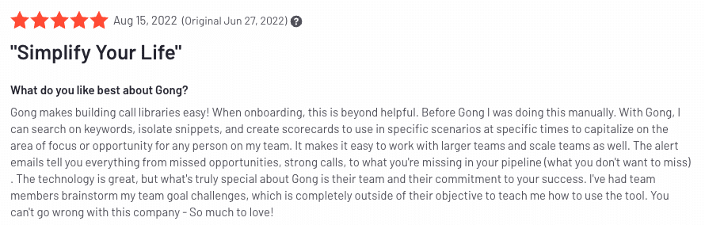
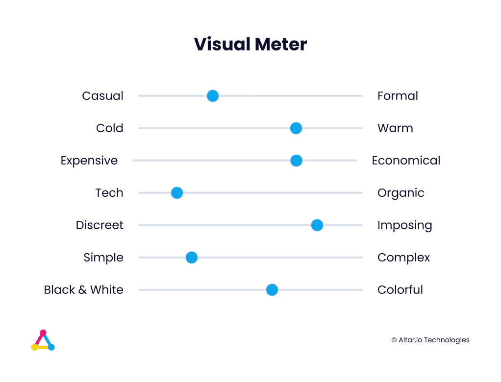
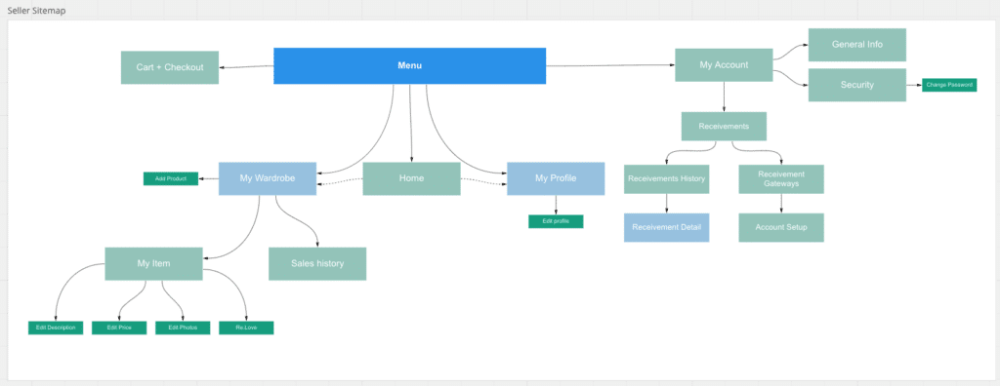

When it comes to building a new startup product, there are a few universal goals that every founding team sets out to achieve.

They want to build a product that solves a real problem for a specific niche of people. And they want that product to be functional, easy to use and beautiful.

When it comes to the former, solving a real problem for your customer, that all comes down to validating your assumptions. This is usually done with an MVP or POC ([more on that here](https://altar.io/features-inside-mvp-3-steps-know-answer/)).

As for the latter, a product that is functional, easy to use and beautiful, well that’s all about how well the product is designed.

This is something I’ve learnt first-hand at Altar. We’ve helped over 80 startups bring their products to life. The majority of them go on to achieve VC funding and win awards like [The 10 Most Innovative Social Media Companies 2022, by Fast Company.](https://altar.io/case_study/fave/)

Without a doubt, the quality of your UX/UI can mean the difference between startup success and startup failure.

Moreover, [research shows](https://www.intechnic.com/blog/100-ux-statistics-every-user-experience-professional-needs-to-know/) that, on average, every $1 invested in UX brings $100 in return. That’s an ROI of a whopping 9,900%. On the other side of the coin, 70% of customers abandon products because of bad user experience.

Take a quick look at G2’s “[Best software products and tools](https://www.g2.com/best-software-companies/top-products)”. It’s easy to see what all of these top products have in common. Regardless of niche, vertical or the problems they solve, they’re all a delight to use.

More than that, users notice it. Take this review of [Gong.io](https://www.g2.com/products/gong/reviews) as an example:

Or this review of [Confluence](https://www.g2.com/products/confluence/reviews):

Or this review of [Salesloft](https://www.g2.com/products/salesloft/reviews):

Three completely different products that solve three different problems. But the reviews all share similarities.

In fact, phrases like **“makes everything easy”, “straightforward”, “seamless integration”, “simple yet powerful”** can be found across the majority of the reviews from the products on G2’s list.

All of this is thanks to great UX/UI.

But the benefits of top-quality design don’t end at customer satisfaction. It will also reduce costs.  A well-designed product will require less training, documentation and development, both now and in the future. This will allow your team to focus on developing the business instead of correcting bad design choices that have left your users confused and frustrated.

The reasoning behind investing time and effort into great product design is clear, but how do you actually get there?

Well, it starts with the process itself.

.elementor-12941 .elementor-element.elementor-element-e56f4e6{--display:flex;--flex-direction:column;--container-widget-width:100%;--container-widget-height:initial;--container-widget-flex-grow:0;--container-widget-align-self:initial;--background-transition:0.3s;}.elementor-12941 .elementor-element.elementor-element-f8d1905{--box-background-color:var( --e-global-color-f6f9b04 );--box-border-color:var( --e-global-color-secondary );--box-border-width:1px;--box-border-radius:12px;--box-padding:12px;--header-color:var( --e-global-color-text );--separator-width:0px;--item-text-decoration:underline;--item-text-hover-decoration:underline;--marker-color:var( --e-global-color-primary );--marker-size:5px;}.elementor-12941 .elementor-element.elementor-element-f8d1905 .elementor-toc\_\_spinner{color:var( --e-global-color-secondary );fill:var( --e-global-color-secondary );}.elementor-12941 .elementor-element.elementor-element-f8d1905 .elementor-toc\_\_header, .elementor-12941 .elementor-element.elementor-element-f8d1905 .elementor-toc\_\_header-title{font-family:"Poppins", sans-serif;font-size:2.25rem;font-weight:700;text-transform:capitalize;line-height:1.2;}.elementor-12941 .elementor-element.elementor-element-f8d1905 .elementor-toc\_\_list-item{font-family:var( --e-global-typography-45f602c-font-family ), sans-serif;font-size:var( --e-global-typography-45f602c-font-size );font-weight:var( --e-global-typography-45f602c-font-weight );line-height:var( --e-global-typography-45f602c-line-height );letter-spacing:var( --e-global-typography-45f602c-letter-spacing );word-spacing:var( --e-global-typography-45f602c-word-spacing );}.elementor-12941 .elementor-element.elementor-element-f8d1905 > .elementor-widget-container{padding:32px 32px 32px 32px;}@media(max-width:1024px){.elementor-12941 .elementor-element.elementor-element-f8d1905 .elementor-toc\_\_list-item{font-size:var( --e-global-typography-45f602c-font-size );line-height:var( --e-global-typography-45f602c-line-height );letter-spacing:var( --e-global-typography-45f602c-letter-spacing );word-spacing:var( --e-global-typography-45f602c-word-spacing );}}@media(max-width:767px){.elementor-12941 .elementor-element.elementor-element-f8d1905 .elementor-toc\_\_list-item{font-size:var( --e-global-typography-45f602c-font-size );line-height:var( --e-global-typography-45f602c-line-height );letter-spacing:var( --e-global-typography-45f602c-letter-spacing );word-spacing:var( --e-global-typography-45f602c-word-spacing );}} /\*! elementor-pro - v3.19.0 - 07-02-2024 \*/  .elementor-widget-table-of-contents .elementor-toc\_\_header-title{color:var(--header-color)}.elementor-widget-table-of-contents.elementor-toc--collapsed .elementor-toc\_\_toggle-button--collapse,.elementor-widget-table-of-contents:not(.elementor-toc--collapsed) .elementor-toc\_\_toggle-button--expand{display:none}.elementor-widget-table-of-contents .elementor-widget-container{min-height:var(--box-min-height);border:var(--box-border-width,1px) solid var(--box-border-color,#9da5ae);border-radius:var(--box-border-radius,3px);background-color:var(--box-background-color);transition:min-height .4s;overflow:hidden}.elementor-toc\_\_header{display:flex;align-items:center;justify-content:space-between;padding:var(--box-padding,20px);background-color:var(--header-background-color);border-bottom:var(--separator-width,1px) solid var(--box-border-color,#9da5ae)}.elementor-toc\_\_header-title{font-size:18px;margin:0;color:var(--header-color)}.elementor-toc\_\_toggle-button{cursor:pointer;display:inline-flex}.elementor-toc\_\_toggle-button i{color:var(--toggle-button-color)}.elementor-toc\_\_toggle-button svg{height:1em;width:1em;fill:var(--toggle-button-color)}.elementor-toc\_\_spinner-container{text-align:center}.elementor-toc\_\_spinner{font-size:2em}.elementor-toc\_\_spinner.e-font-icon-svg{height:1em;width:1em}.elementor-toc\_\_body{padding:var(--box-padding,20px);max-height:var(--toc-body-max-height);overflow-y:auto}.elementor-toc\_\_body::-webkit-scrollbar{width:7px}.elementor-toc\_\_body::-webkit-scrollbar-thumb{background-color:#babfc5;border-radius:10px}.elementor-toc\_\_list-wrapper{list-style:none;padding:0}.elementor-toc\_\_list-item{margin-bottom:.5em}.elementor-toc\_\_list-item.elementor-item-active{font-weight:700}.elementor-toc\_\_list-item .elementor-toc\_\_list-wrapper{margin-top:.5em;margin-left:var(--nested-list-indent,1em)}.elementor-toc\_\_list-item-text:hover{color:var(--item-text-hover-color);-webkit-text-decoration:var(--item-text-hover-decoration);text-decoration:var(--item-text-hover-decoration)}.elementor-toc\_\_list-item-text.elementor-item-active{color:var(--item-text-active-color);-webkit-text-decoration:var(--item-text-active-decoration);text-decoration:var(--item-text-active-decoration)}.elementor-toc\_\_list-item-text-wrapper{display:flex;align-items:center}.elementor-toc\_\_list-item-text-wrapper:before,.elementor-toc\_\_list-item-text-wrapper i{margin-right:8px;color:var(--marker-color)}.elementor-toc\_\_list-item-text-wrapper svg{margin-right:8px;fill:var(--marker-color);height:var(--marker-size,.5em);width:var(--marker-size,.5em)}.elementor-toc\_\_list-item-text-wrapper i{font-size:var(--marker-size,.5em)}.elementor-toc\_\_list-item-text-wrapper:before{font-size:var(--marker-size,1em)}.elementor-toc--content-ellipsis .elementor-toc\_\_list-item-text{white-space:nowrap;overflow:hidden;text-overflow:ellipsis}.elementor-toc\_\_list-items--collapsible>.elementor-toc\_\_list-wrapper>.elementor-toc\_\_list-item>.elementor-toc\_\_list-wrapper{display:none}.elementor-toc\_\_heading-anchor{position:absolute}.elementor-toc\_\_body .elementor-toc\_\_list-item-text{color:var(--item-text-color);-webkit-text-decoration:var(--item-text-decoration);text-decoration:var(--item-text-decoration)}.elementor-toc\_\_body .elementor-toc\_\_list-item-text:hover{color:var(--item-text-hover-color);-webkit-text-decoration:var(--item-text-hover-decoration);text-decoration:var(--item-text-hover-decoration)}.elementor-toc\_\_body .elementor-toc\_\_list-item-text.elementor-item-active{color:var(--item-text-active-color);-webkit-text-decoration:var(--item-text-active-decoration);text-decoration:var(--item-text-active-decoration)}ol.elementor-toc\_\_list-wrapper{counter-reset:item}ol.elementor-toc\_\_list-wrapper .elementor-toc\_\_list-item{counter-increment:item}ol.elementor-toc\_\_list-wrapper .elementor-toc\_\_list-item-text-wrapper:before{content:counters(item,".") ". "}

#### Contents

## The 4-Step Process Behind Achieving Great UX/UI Design

The process behind designing an engaging product that is easy to use, attractive and functional isn’t a complex one.

That being said, it does require the right people on your team to execute it effectively (more on that in a bit).

Here are the four steps that, in my experience, set you up for the best chance of success.

### 1\. Design Brief

Your design brief should start with you giving your designer a thorough, succinct description of the problem you want to solve and the solution you envision.

They will then carry out a series of steps to complete the brief. For example, here’s Google’s design thinking process:

- Empathise - Understand users and stakeholders
- Define - Understand user problems and needs
- Ideate - Brainstorm ideas, evaluate their feasibility and chose the most valuable ones
- Prototype - Design the ideas and create a clickable prototype
- Test - Test the prototype with users before the development phase

This is a great baseline to start with and one many designers will use.

That said, we have a slightly different process at Altar. We’ve found when building an MVP or the first version of a product from scratch, there are several steps that will help set you up for success.

Moreover, we usually carry out many of the following steps pre-design, at the [product scope stage](https://altar.io/service-product-scope/). The information is key to figuring out if you can build a product that is competitive and will be adopted by your users.

As my CEO and Head of Product, Daniel, [points out here](https://altar.io/qualities-product-manager-startup/):

/\* widget: Blog: Simple Quote \*/  /\* reset -------------------- \*/  .blog-custom-block \*,  .blog-custom-block ::before,  .blog-custom-block ::after {  box-sizing: border-box;  border-width: 0;  border-style: solid;  border-color: #e5e7eb;  }  /\* vars -------------------- \*/  .blog-custom-block.blog-custom-block\_\_simple-quote {  --color-accent: #0FA4EA;  --color-bg: #F4FAFE;  --color-text-2: #4A4A68;  }  /\* colors -------------------- \*/  .blog-custom-block.blog-custom-block\_\_simple-quote .bg-clr-bg {  background-color: var(--color-bg);  }  .blog-custom-block.blog-custom-block\_\_simple-quote .border-clr-accent {  border-color: var(--color-accent);  }  .blog-custom-block.blog-custom-block\_\_simple-quote .text-clr-text-2 {  color: var(--color-text-2);  }  /\* utils -------------------- \*/  .blog-custom-block.blog-custom-block\_\_simple-quote .flex {  display: flex;  }  .blog-custom-block.blog-custom-block\_\_simple-quote .flex-shrink-0 {  flex-shrink: 0;  }  .blog-custom-block.blog-custom-block\_\_simple-quote .flex-col {  flex-direction: column;  }  .blog-custom-block.blog-custom-block\_\_simple-quote .gap-4 {  gap: 1rem;  }  .blog-custom-block.blog-custom-block\_\_simple-quote .rounded-xl {  border-radius: 0.75rem;  }  .blog-custom-block.blog-custom-block\_\_simple-quote .border-l-6 {  border-left-width: 6px;  }  .blog-custom-block.blog-custom-block\_\_simple-quote .p-8 {  padding: 2rem;  }  .blog-custom-block.blog-custom-block\_\_simple-quote .text-xl {  font-size: 1.25rem;  line-height: 1.75rem;  }  .blog-custom-block.blog-custom-block\_\_simple-quote .italic {  font-style: italic;  } 

The reason most startups fail is that they don’t spend enough time on product in the early stages.

Moreover, 66% of startups that fail do so because of reasons directly related to product development.

Therefore it’s important to have it before you begin onboarding designers, developers, etc.

Here are the elements that, in my experience, will give you a comprehensive design brief that will set you up for success in the later stages of the design process:

#### Competitor Analysis

The first step your designer should take is to look at your competitive landscape – to get an idea of how current products are solving the problem you’re tackling.

#### Brand Personality

Next on this list is Brand Personality, this is how your brand should be perceived by the world.

At Altar, we use the Millward Brown personality chart (as shown below) but there are other alternatives out there.

Here the question is “what is your brand?” It could be a mixture of two or more. For example, if you were to choose “wise” and “king” your brand would portray trustworthiness and deep knowledge while being in control and assertive.

A note on this step: you may already have a vision for your brand personality. If so, you should share this with your designer and work with them to choose the right fit for you.

#### Visual Meter

To back up your Brand Personality, you can also create a visual meter to show your designer where your brand stands based on the polar opposites shown in the image below.

#### Personas

With all of the information above, your designer will be ready to create UX personas. They will create characters based on your target user, to understand how they will use your product.

A UX Persona will typically include:

- The persona’s name
- An image (e.g. an illustration, avatar, photo or stock image)
- Demographic information such as your persona’s age, gender, family/living situation, employment status and anything else that’s relevant to your product or problem space
- Their needs and goals in relation to your product
- A summary of their challenges, frustrations and pain points in relation to your product or problem space
- Quotes from real users whom the persona should represent

#### Sitemap

The penultimate stage is to create a sitemap – an initial visual representation of how users will navigate through the product.

This will naturally change as your product develops, however, this is a great way for you to visualise how your product will work as early as possible.

#### User Stories

Finally, it’s time for your User Stories.

When you're developing software, it's important to think about how your features will actually benefit people. A user story is an informal explanation of what happens when a certain feature comes into play written from the perspective of end-users (i.e., customers).

Once the brief is complete, your designer can move on to UX wireframes.

### 2\. Wireframes

With the design brief closed, the wireframing process can begin. Here, your designer should focus on building the journey through your product.

This should culminate in a graphic representation that has a low-fidelity design. Only focusing on the key elements and content that will show how your users will get from point A to point Z.

Then, you and your designer will iterate on these wireframes until you’ve found the optimal structure for your product.

Then it’s time to look at the UI.

### 3\. Key Screens

With the UX well underway, it’s time to look at UI. The next step is for your designer to work on your key screens. Here, they take the most important screens of your product and create UI mockups so you can start to see exactly how your product will look.

This step is vital for you, the founder. By seeing the key screens as soon as possible, you’ll be able to validate whether or not it’s what you need _before_ your designer spends months designing something you’re not going to like.

### 4\. All Screens & Clickable Prototype

Once you’ve approved the design for the key screens, your designer will then be able to design the remaining screens, so you can see what your app will look like.

At this stage in the process, your designer should also be able to provide a clickable prototype that simulates users’ interactions with your product.

Ensuring that your user journey is solid before building out your final product.

But your clickable prototypes can be used for more than just internal use, as one of our Partners, Rui, pointed out to me recently:

/\* widget: Blog: Simple Quote \*/  /\* reset -------------------- \*/  .blog-custom-block \*,  .blog-custom-block ::before,  .blog-custom-block ::after {  box-sizing: border-box;  border-width: 0;  border-style: solid;  border-color: #e5e7eb;  }  /\* vars -------------------- \*/  .blog-custom-block.blog-custom-block\_\_simple-quote {  --color-accent: #0FA4EA;  --color-bg: #F4FAFE;  --color-text-2: #4A4A68;  }  /\* colors -------------------- \*/  .blog-custom-block.blog-custom-block\_\_simple-quote .bg-clr-bg {  background-color: var(--color-bg);  }  .blog-custom-block.blog-custom-block\_\_simple-quote .border-clr-accent {  border-color: var(--color-accent);  }  .blog-custom-block.blog-custom-block\_\_simple-quote .text-clr-text-2 {  color: var(--color-text-2);  }  /\* utils -------------------- \*/  .blog-custom-block.blog-custom-block\_\_simple-quote .flex {  display: flex;  }  .blog-custom-block.blog-custom-block\_\_simple-quote .flex-shrink-0 {  flex-shrink: 0;  }  .blog-custom-block.blog-custom-block\_\_simple-quote .flex-col {  flex-direction: column;  }  .blog-custom-block.blog-custom-block\_\_simple-quote .gap-4 {  gap: 1rem;  }  .blog-custom-block.blog-custom-block\_\_simple-quote .rounded-xl {  border-radius: 0.75rem;  }  .blog-custom-block.blog-custom-block\_\_simple-quote .border-l-6 {  border-left-width: 6px;  }  .blog-custom-block.blog-custom-block\_\_simple-quote .p-8 {  padding: 2rem;  }  .blog-custom-block.blog-custom-block\_\_simple-quote .text-xl {  font-size: 1.25rem;  line-height: 1.75rem;  }  .blog-custom-block.blog-custom-block\_\_simple-quote .italic {  font-style: italic;  } 

We've seen some of our clients use a clickable prototype to raise money.

That said, it’s never going to be as strong as having paying users on a fully functional platform. That weaker position may force you to forfeit more equity.

Regardless, in my experience, you should share it with investors, potential clients, and every other stakeholder you have around you. Not only will they provide valuable feedback, but this will also allow you to start building relationships with them that will facilitate your life further down the road.

Clickable prototypes allow you to start user testing before you start developing. This allows you to show off your product (and maybe even prove some assumptions along the way) while saving money.

That concludes the four steps to ensure your startup’s design delights your users.

But, since you’re here, I wanted to go a step further and talk about the next logical step in your journey to create a kickass design: finding the right person to execute it.

##### Do you have a brilliant idea that you want to bring to life?

From the product and business reasoning to streamlining your MVP to the most important features, our team of product experts and ex-startup founders can help you bring your vision to life.

Let's Talk

## What You Should Look for In a UX/UI Designer or Agency

If you’re going to execute great UX/UI design successfully, you’re going to need a top-notch designer or design agency in your corner.

And just like [choosing between in-house developers, freelancers or a software development company](https://altar.io/whats-the-best-way-to-build-your-startup-cto-freelancers-agency/), there are some considerations to keep in mind.

The advice when it comes to developers is the same as designers. Which is, your best option is always to hire someone in-house.

The reason behind this is that, if you’re able to bring in a designer from day zero, you’ll have filled a pivotal position in your startup.

That said, as an early-stage startup, you have to keep in mind that, firstly, designers aren’t cheap. According to [Glassdoor](https://www.glassdoor.com/Salaries/ui-ux-designer-salary-SRCH_KO0,14.htm), the average salary for a designer with 4-6 years of experience is $76,000 a year in the US. And once you’ve onboarded them, you’re locked into paying that salary.

As an early-stage startup, it’s unlikely you’re going to need a designer 100% of the time. So you’ve got to consider whether it’s worth paying for one 100% of the time –  when you could be putting your resources into other vital parts of the startup journey.

Secondly, just like developers, UX/UI designers are in high demand. And while there are a decent amount of designers out there, finding one that has all the skills you need isn’t going to be a five-minute job.

As the first UX/UI designer to join your squad, they won’t just be responsible for executing design decisions. They’ll be a key player in helping you make those design decisions. Decisions that have a long-term impact on your startup.

It’s for these two reasons that many startups turn to alternative choices: freelance designers and design agencies. Mainly because

1. You only need to pay for them when you need them
2. Quite often, it can be faster to find a good agency or freelancer

Both of these options come with their inherent risks – just as hiring someone in-house comes with risks – albeit different ones. The horror stories of outsourcing and working with freelancers are ten a penny across all industries.

And while it’s easy to blame the model, I would argue that you’re no less likely to succeed with a freelancer or agency than you would with an in-house hire.

**As long as you do the right due diligence when onboarding them.** 

By this I mean, onboarding with the same level of scrutiny as you would hiring someone in-house. At the core, it’s all about full alignment and transparency regardless of the model you choose.

(My CMO, Rui, has written [more about this here](https://altar.io/how-to-avoid-failure-when-building-a-startup-with-a-software-development-company/), and while it’s within the context of working with a [custom software development company](https://altar.io/), I believe much of the advice and information stands true here.)

Regardless of the model, you need to find people who have the right set of hard and soft skills for the job.

Here’s a shortlist of the ones you need to look for.

### Technical Skills

When it comes to technical skills, there’s a relatively comprehensive list you need to keep in mind – as a quick search on Google or a five-minute chat with a Senior Designer, will tell you.

They can be classified into six categories.

Many of these will become obvious from looking at their portfolio. That said, I would recommend you talk directly to them about this when interviewing them.

Let’s dive into each of them:

#### 1\. User Research

As I mentioned briefly, your UX/UI designer needs to be able to jump into the shoes of your user. And the only way to truly understand your target users is to research them.

This goes a long way to minimising a bad design, as much of it is based on understanding who you’re designing the product for.

#### 2\. Information Architecture (IA)

Information Architecture (IA) needs to be at the heart of any UX/UI designer’s toolkit.

IA is a visual representation of a product’s infrastructure, features and the hierarchy of those features. An IA may also include navigation, application functions and behaviours, content, etc.

IA skills are essential to the UX designer because they help them see how all of the different pieces fit together and create a larger picture - understanding what items belong where.

#### 3\. Interaction Design (IxD)

Interaction Design (IxD) focuses on how a product behaves. When done well, it contextualises human interaction, making the product more usable and desirable.

Your UX/UI designer needs to be able to design how your product will look feel and behave to truly help you succeed.

#### 4\. Visual Design

While IXD focuses on how a product behaves, visual design is all about drawing the user’s attention to the intended functionality on a screen.

Think of the play button at the top of a playlist on Spotify. The use of colour, size and whitespace makes it pop compared to the rest of the content.

A UX/UI designer that understands this is crucial, as it will ensure the content throughout your product is organised and decluttered, aligned, repeated appropriately, etc.

#### 5\. Usability Evaluation

Your UX/UI designer needs to be able to test quickly and often if they’re going to build a successful product. It will allow them to fail fast and improve the usability of your product much more efficiently and effectively.

#### 6\. Wireframing & UI Prototyping

They need to be able to create wireframes and prototypes so that you and your team can see, use and feedback on the overall design of the product.

This will ensure you catch mistakes before the product reaches the development stage. Miss them and it could be very expensive to resolve them further down the line.

### Soft Skills

When it comes to onboarding a UX/UI designer or agency, soft skills are just as important as technical prowess.

Here’s what you need to look for in a potential partner.

#### 1\. Passion

The UX/UI designer you choose needs to be passionate about what you’re setting out to build.

If they aren’t passionate about your product, if they don’t really care about what you’re building, they won’t have the drive to push through inevitable hurdles that appear.

And when they’ll be responsible for making key decisions about your startup, you can’t risk a lack of passion.

When you speak to a potential designer, make sure they’re excited about the project. Are they showing genuine interest and asking compelling questions about what you’re building? If not, they’re not the right designer for the job.

#### 2\. Commitment

If your product is going to reach its full potential, your designer needs to be fully committed to your startup.

You should share the roadmap you have for your startup. You need to make sure that any potential designer completely understands what you’re proposing and agrees with it.

If they can’t fully commit to your project, it’s highly unlikely they’ll design a great product.

#### 3\. Communication

Finally, you need to work with a UX/UI designer that can communicate with ease.

They’re going to be collaborating with everyone else in your team, from you and your co-founders to developers and beyond.

They need to be able to express complex ideas fluently and concisely so that you know that the designs align with your business goals and users’ expectations.

They need to be able to communicate with developers so that the designs become a reality without any hiccups.

This requires an articulate person who is confident speaking with a range of stakeholders.

.elementor-3329 .elementor-element.elementor-element-f79b780{--display:flex;--flex-direction:column;--container-widget-width:100%;--container-widget-height:initial;--container-widget-flex-grow:0;--container-widget-align-self:initial;--background-transition:0.3s;}.elementor-3329 .elementor-element.elementor-element-aa6dd2a{--display:flex;--flex-direction:column;--container-widget-width:100%;--container-widget-height:initial;--container-widget-flex-grow:0;--container-widget-align-self:initial;--gap:24px 24px;--background-transition:0.3s;--border-radius:12px 12px 12px 12px;--padding-block-start:70px;--padding-block-end:70px;--padding-inline-start:var(--safe-margin);--padding-inline-end:var(--safe-margin);}.elementor-3329 .elementor-element.elementor-element-aa6dd2a:not(.elementor-motion-effects-element-type-background), .elementor-3329 .elementor-element.elementor-element-aa6dd2a > .elementor-motion-effects-container > .elementor-motion-effects-layer{background-color:#29293E;}.elementor-3329 .elementor-element.elementor-element-aa6dd2a, .elementor-3329 .elementor-element.elementor-element-aa6dd2a::before{--border-transition:0.3s;}.elementor-3329 .elementor-element.elementor-element-95ae566{--display:flex;--flex-direction:column;--container-widget-width:100%;--container-widget-height:initial;--container-widget-flex-grow:0;--container-widget-align-self:initial;--background-transition:0.3s;}.elementor-3329 .elementor-element.elementor-element-99ebd14{text-align:center;}.elementor-3329 .elementor-element.elementor-element-99ebd14 .elementor-heading-title{color:var( --e-global-color-eb70be1 );font-family:var( --e-global-typography-0ff79ee-font-family ), sans-serif;font-size:var( --e-global-typography-0ff79ee-font-size );font-weight:var( --e-global-typography-0ff79ee-font-weight );line-height:var( --e-global-typography-0ff79ee-line-height );letter-spacing:var( --e-global-typography-0ff79ee-letter-spacing );word-spacing:var( --e-global-typography-0ff79ee-word-spacing );}.elementor-3329 .elementor-element.elementor-element-0ce57c0{text-align:center;color:var( --e-global-color-eb70be1 );font-size:20px;}.elementor-3329 .elementor-element.elementor-element-28db4d7{--display:flex;--flex-direction:row;--container-widget-width:initial;--container-widget-height:100%;--container-widget-flex-grow:1;--container-widget-align-self:stretch;--justify-content:flex-start;--background-transition:0.3s;}.elementor-3329 .elementor-element.elementor-element-70fbc6a .elementor-field-group{padding-right:calc( 24px/2 );padding-left:calc( 24px/2 );margin-bottom:32px;}.elementor-3329 .elementor-element.elementor-element-70fbc6a .elementor-form-fields-wrapper{margin-left:calc( -24px/2 );margin-right:calc( -24px/2 );margin-bottom:-32px;}.elementor-3329 .elementor-element.elementor-element-70fbc6a .elementor-field-group.recaptcha\_v3-bottomleft, .elementor-3329 .elementor-element.elementor-element-70fbc6a .elementor-field-group.recaptcha\_v3-bottomright{margin-bottom:0;}body.rtl .elementor-3329 .elementor-element.elementor-element-70fbc6a .elementor-labels-inline .elementor-field-group > label{padding-left:8px;}body:not(.rtl) .elementor-3329 .elementor-element.elementor-element-70fbc6a .elementor-labels-inline .elementor-field-group > label{padding-right:8px;}body .elementor-3329 .elementor-element.elementor-element-70fbc6a .elementor-labels-above .elementor-field-group > label{padding-bottom:8px;}.elementor-3329 .elementor-element.elementor-element-70fbc6a .elementor-field-group > label, .elementor-3329 .elementor-element.elementor-element-70fbc6a .elementor-field-subgroup label{color:var( --e-global-color-eb70be1 );}.elementor-3329 .elementor-element.elementor-element-70fbc6a .elementor-field-group > label{font-family:var( --e-global-typography-9730a4e-font-family ), sans-serif;font-size:var( --e-global-typography-9730a4e-font-size );font-weight:var( --e-global-typography-9730a4e-font-weight );line-height:var( --e-global-typography-9730a4e-line-height );letter-spacing:var( --e-global-typography-9730a4e-letter-spacing );word-spacing:var( --e-global-typography-9730a4e-word-spacing );}.elementor-3329 .elementor-element.elementor-element-70fbc6a .elementor-field-type-html{padding-bottom:0px;}.elementor-3329 .elementor-element.elementor-element-70fbc6a .elementor-field-group .elementor-field{color:var( --e-global-color-eb70be1 );}.elementor-3329 .elementor-element.elementor-element-70fbc6a .elementor-field-group .elementor-field, .elementor-3329 .elementor-element.elementor-element-70fbc6a .elementor-field-subgroup label{font-family:var( --e-global-typography-text-font-family ), sans-serif;font-size:var( --e-global-typography-text-font-size );font-weight:var( --e-global-typography-text-font-weight );line-height:var( --e-global-typography-text-line-height );}.elementor-3329 .elementor-element.elementor-element-70fbc6a .elementor-field-group:not(.elementor-field-type-upload) .elementor-field:not(.elementor-select-wrapper){background-color:#3D3D5C;border-color:#65639C;}.elementor-3329 .elementor-element.elementor-element-70fbc6a .elementor-field-group .elementor-select-wrapper select{background-color:#3D3D5C;border-color:#65639C;}.elementor-3329 .elementor-element.elementor-element-70fbc6a .elementor-field-group .elementor-select-wrapper::before{color:#65639C;}.elementor-3329 .elementor-element.elementor-element-70fbc6a .elementor-button{font-family:"Poppins", sans-serif;font-size:14px;font-weight:700;line-height:1.5;}.elementor-3329 .elementor-element.elementor-element-70fbc6a .e-form\_\_buttons\_\_wrapper\_\_button-next{background-color:var( --e-global-color-1e4bfa7 );color:var( --e-global-color-eb70be1 );}.elementor-3329 .elementor-element.elementor-element-70fbc6a .elementor-button\[type="submit"\]{background-color:var( --e-global-color-1e4bfa7 );color:var( --e-global-color-eb70be1 );}.elementor-3329 .elementor-element.elementor-element-70fbc6a .elementor-button\[type="submit"\] svg \*{fill:var( --e-global-color-eb70be1 );}.elementor-3329 .elementor-element.elementor-element-70fbc6a .e-form\_\_buttons\_\_wrapper\_\_button-previous{color:var( --e-global-color-eb70be1 );}.elementor-3329 .elementor-element.elementor-element-70fbc6a .e-form\_\_buttons\_\_wrapper\_\_button-next:hover{color:#ffffff;}.elementor-3329 .elementor-element.elementor-element-70fbc6a .elementor-button\[type="submit"\]:hover{color:#ffffff;}.elementor-3329 .elementor-element.elementor-element-70fbc6a .elementor-button\[type="submit"\]:hover svg \*{fill:#ffffff;}.elementor-3329 .elementor-element.elementor-element-70fbc6a .e-form\_\_buttons\_\_wrapper\_\_button-previous:hover{color:#ffffff;}.elementor-3329 .elementor-element.elementor-element-70fbc6a .elementor-message{font-family:var( --e-global-typography-9730a4e-font-family ), sans-serif;font-size:var( --e-global-typography-9730a4e-font-size );font-weight:var( --e-global-typography-9730a4e-font-weight );line-height:var( --e-global-typography-9730a4e-line-height );letter-spacing:var( --e-global-typography-9730a4e-letter-spacing );word-spacing:var( --e-global-typography-9730a4e-word-spacing );}.elementor-3329 .elementor-element.elementor-element-70fbc6a .elementor-message.elementor-message-success{color:var( --e-global-color-40f63f7 );}.elementor-3329 .elementor-element.elementor-element-70fbc6a .elementor-message.elementor-message-danger{color:var( --e-global-color-8ddb30f );}.elementor-3329 .elementor-element.elementor-element-70fbc6a .elementor-message.elementor-help-inline{color:var( --e-global-color-9acb2f2 );}.elementor-3329 .elementor-element.elementor-element-70fbc6a{--e-form-steps-indicators-spacing:20px;--e-form-steps-indicator-padding:30px;--e-form-steps-indicator-inactive-secondary-color:#ffffff;--e-form-steps-indicator-active-secondary-color:#ffffff;--e-form-steps-indicator-completed-secondary-color:#ffffff;--e-form-steps-divider-width:1px;--e-form-steps-divider-gap:10px;width:100%;max-width:100%;}.elementor-3329 .elementor-element.elementor-element-70fbc6a > .elementor-widget-container{padding:10px 0px 0px 0px;}@media(min-width:768px){.elementor-3329 .elementor-element.elementor-element-aa6dd2a{--content-width:var(--container-md);}}@media(max-width:1024px){.elementor-3329 .elementor-element.elementor-element-99ebd14 .elementor-heading-title{font-size:var( --e-global-typography-0ff79ee-font-size );line-height:var( --e-global-typography-0ff79ee-line-height );letter-spacing:var( --e-global-typography-0ff79ee-letter-spacing );word-spacing:var( --e-global-typography-0ff79ee-word-spacing );}.elementor-3329 .elementor-element.elementor-element-70fbc6a .elementor-field-group > label{font-size:var( --e-global-typography-9730a4e-font-size );line-height:var( --e-global-typography-9730a4e-line-height );letter-spacing:var( --e-global-typography-9730a4e-letter-spacing );word-spacing:var( --e-global-typography-9730a4e-word-spacing );}.elementor-3329 .elementor-element.elementor-element-70fbc6a .elementor-field-group .elementor-field, .elementor-3329 .elementor-element.elementor-element-70fbc6a .elementor-field-subgroup label{font-size:var( --e-global-typography-text-font-size );line-height:var( --e-global-typography-text-line-height );}.elementor-3329 .elementor-element.elementor-element-70fbc6a .elementor-message{font-size:var( --e-global-typography-9730a4e-font-size );line-height:var( --e-global-typography-9730a4e-line-height );letter-spacing:var( --e-global-typography-9730a4e-letter-spacing );word-spacing:var( --e-global-typography-9730a4e-word-spacing );}}@media(max-width:767px){.elementor-3329 .elementor-element.elementor-element-99ebd14 .elementor-heading-title{font-size:var( --e-global-typography-0ff79ee-font-size );line-height:var( --e-global-typography-0ff79ee-line-height );letter-spacing:var( --e-global-typography-0ff79ee-letter-spacing );word-spacing:var( --e-global-typography-0ff79ee-word-spacing );}.elementor-3329 .elementor-element.elementor-element-70fbc6a .elementor-field-group > label{font-size:var( --e-global-typography-9730a4e-font-size );line-height:var( --e-global-typography-9730a4e-line-height );letter-spacing:var( --e-global-typography-9730a4e-letter-spacing );word-spacing:var( --e-global-typography-9730a4e-word-spacing );}.elementor-3329 .elementor-element.elementor-element-70fbc6a .elementor-field-group .elementor-field, .elementor-3329 .elementor-element.elementor-element-70fbc6a .elementor-field-subgroup label{font-size:var( --e-global-typography-text-font-size );line-height:var( --e-global-typography-text-line-height );}.elementor-3329 .elementor-element.elementor-element-70fbc6a .elementor-message{font-size:var( --e-global-typography-9730a4e-font-size );line-height:var( --e-global-typography-9730a4e-line-height );letter-spacing:var( --e-global-typography-9730a4e-letter-spacing );word-spacing:var( --e-global-typography-9730a4e-word-spacing );}}/\* Start custom CSS for form, class: .elementor-element-70fbc6a \*/.elementor-3329 .elementor-element.elementor-element-70fbc6a input {  border-color: #65639C !important;  }  .elementor-3329 .elementor-element.elementor-element-70fbc6a input:is(:focus, :hover) {  border-color: #B9B8CE !important;  }/\* End custom CSS \*/

##### Sign up for our newsletter

Join hundreds of entrepreneurs and business leaders to receive fresh, actionable tech and startup related insights and tips

/\*! elementor-pro - v3.19.0 - 07-02-2024 \*/  .elementor-button.elementor-hidden,.elementor-hidden{display:none}.e-form\_\_step{width:100%}.e-form\_\_step:not(.elementor-hidden){display:flex;flex-wrap:wrap}.e-form\_\_buttons{flex-wrap:wrap}.e-form\_\_buttons,.e-form\_\_buttons\_\_wrapper{display:flex}.e-form\_\_indicators{display:flex;justify-content:space-between;align-items:center;flex-wrap:nowrap;font-size:13px;margin-bottom:var(--e-form-steps-indicators-spacing)}.e-form\_\_indicators\_\_indicator{display:flex;flex-direction:column;align-items:center;justify-content:center;flex-basis:0;padding:0 var(--e-form-steps-divider-gap)}.e-form\_\_indicators\_\_indicator\_\_progress{width:100%;position:relative;background-color:var(--e-form-steps-indicator-progress-background-color);border-radius:var(--e-form-steps-indicator-progress-border-radius);overflow:hidden}.e-form\_\_indicators\_\_indicator\_\_progress\_\_meter{width:var(--e-form-steps-indicator-progress-meter-width,0);height:var(--e-form-steps-indicator-progress-height);line-height:var(--e-form-steps-indicator-progress-height);padding-right:15px;border-radius:var(--e-form-steps-indicator-progress-border-radius);background-color:var(--e-form-steps-indicator-progress-color);color:var(--e-form-steps-indicator-progress-meter-color);text-align:right;transition:width .1s linear}.e-form\_\_indicators\_\_indicator:first-child{padding-left:0}.e-form\_\_indicators\_\_indicator:last-child{padding-right:0}.e-form\_\_indicators\_\_indicator--state-inactive{color:var(--e-form-steps-indicator-inactive-primary-color,#c2cbd2)}.e-form\_\_indicators\_\_indicator--state-inactive \[class\*=indicator--shape-\]:not(.e-form\_\_indicators\_\_indicator--shape-none){background-color:var(--e-form-steps-indicator-inactive-secondary-color,#fff)}.e-form\_\_indicators\_\_indicator--state-inactive object,.e-form\_\_indicators\_\_indicator--state-inactive svg{fill:var(--e-form-steps-indicator-inactive-primary-color,#c2cbd2)}.e-form\_\_indicators\_\_indicator--state-active{color:var(--e-form-steps-indicator-active-primary-color,#39b54a);border-color:var(--e-form-steps-indicator-active-secondary-color,#fff)}.e-form\_\_indicators\_\_indicator--state-active \[class\*=indicator--shape-\]:not(.e-form\_\_indicators\_\_indicator--shape-none){background-color:var(--e-form-steps-indicator-active-secondary-color,#fff)}.e-form\_\_indicators\_\_indicator--state-active object,.e-form\_\_indicators\_\_indicator--state-active svg{fill:var(--e-form-steps-indicator-active-primary-color,#39b54a)}.e-form\_\_indicators\_\_indicator--state-completed{color:var(--e-form-steps-indicator-completed-secondary-color,#fff)}.e-form\_\_indicators\_\_indicator--state-completed \[class\*=indicator--shape-\]:not(.e-form\_\_indicators\_\_indicator--shape-none){background-color:var(--e-form-steps-indicator-completed-primary-color,#39b54a)}.e-form\_\_indicators\_\_indicator--state-completed .e-form\_\_indicators\_\_indicator\_\_label{color:var(--e-form-steps-indicator-completed-primary-color,#39b54a)}.e-form\_\_indicators\_\_indicator--state-completed .e-form\_\_indicators\_\_indicator--shape-none{color:var(--e-form-steps-indicator-completed-primary-color,#39b54a);background-color:initial}.e-form\_\_indicators\_\_indicator--state-completed object,.e-form\_\_indicators\_\_indicator--state-completed svg{fill:var(--e-form-steps-indicator-completed-secondary-color,#fff)}.e-form\_\_indicators\_\_indicator\_\_icon{width:var(--e-form-steps-indicator-padding,30px);height:var(--e-form-steps-indicator-padding,30px);font-size:var(--e-form-steps-indicator-icon-size);border-width:1px;border-style:solid;display:flex;justify-content:center;align-items:center;overflow:hidden;margin-bottom:10px}.e-form\_\_indicators\_\_indicator\_\_icon img,.e-form\_\_indicators\_\_indicator\_\_icon object,.e-form\_\_indicators\_\_indicator\_\_icon svg{width:var(--e-form-steps-indicator-icon-size);height:auto}.e-form\_\_indicators\_\_indicator\_\_icon .e-font-icon-svg{height:1em}.e-form\_\_indicators\_\_indicator\_\_number{width:var(--e-form-steps-indicator-padding,30px);height:var(--e-form-steps-indicator-padding,30px);border-width:1px;border-style:solid;display:flex;justify-content:center;align-items:center;margin-bottom:10px}.e-form\_\_indicators\_\_indicator--shape-circle{border-radius:50%}.e-form\_\_indicators\_\_indicator--shape-square{border-radius:0}.e-form\_\_indicators\_\_indicator--shape-rounded{border-radius:5px}.e-form\_\_indicators\_\_indicator--shape-none{border:0}.e-form\_\_indicators\_\_indicator\_\_label{text-align:center}.e-form\_\_indicators\_\_indicator\_\_separator{width:100%;height:var(--e-form-steps-divider-width);background-color:#babfc5}.e-form\_\_indicators--type-icon,.e-form\_\_indicators--type-icon\_text,.e-form\_\_indicators--type-number,.e-form\_\_indicators--type-number\_text{align-items:flex-start}.e-form\_\_indicators--type-icon .e-form\_\_indicators\_\_indicator\_\_separator,.e-form\_\_indicators--type-icon\_text .e-form\_\_indicators\_\_indicator\_\_separator,.e-form\_\_indicators--type-number .e-form\_\_indicators\_\_indicator\_\_separator,.e-form\_\_indicators--type-number\_text .e-form\_\_indicators\_\_indicator\_\_separator{margin-top:calc(var(--e-form-steps-indicator-padding, 30px) / 2 - var(--e-form-steps-divider-width, 1px) / 2)}.elementor-field-type-hidden{display:none}.elementor-field-type-html{display:inline-block}.elementor-field-type-tel input{direction:inherit}.elementor-login .elementor-lost-password,.elementor-login .elementor-remember-me{font-size:.85em}.elementor-field-type-recaptcha\_v3 .elementor-field-label{display:none}.elementor-field-type-recaptcha\_v3 .grecaptcha-badge{z-index:1}.elementor-button .elementor-form-spinner{order:3}.elementor-form .elementor-button>span{display:flex;justify-content:center;align-items:center}.elementor-form .elementor-button .elementor-button-text{white-space:normal;flex-grow:0}.elementor-form .elementor-button svg{height:auto}.elementor-form .elementor-button .e-font-icon-svg{height:1em}.elementor-select-wrapper .select-caret-down-wrapper{position:absolute;top:50%;transform:translateY(-50%);inset-inline-end:10px;pointer-events:none;font-size:11px}.elementor-select-wrapper .select-caret-down-wrapper svg{display:unset;width:1em;aspect-ratio:unset;fill:currentColor}.elementor-select-wrapper .select-caret-down-wrapper i{font-size:19px;line-height:2}.elementor-select-wrapper.remove-before:before{content:""!important}

   Full Name  Buisness Email  Subscribe

## Where to Find UX/UI Designers & Agencies

There are a number of ways to find a UX/UI designer or a design agency for your startup.

First and foremost, as your network – people you already know and trust. On top of that, build your network and join communities where UX/UI designers are. This is the best way to make contacts in the industry and may lead to finding more than just a designer.

Conferences, like WebSummit, or meetup groups are also a great way to get to know designers.

Aside from that, you can check out the following platforms that UX/UI designers use to find work:

- [UX Jobs Board](https://www.uxjobsboard.com/)
- [Toptal](https://www.toptal.com/)
- [Authentic Jobs](https://authenticjobs.com/)
- [Designer Hangout](https://www.designerhangout.co/)

For agencies that offer [UX/UI services](https://altar.io/service-ux-ui/), I recommend looking at online review platforms like [Clutch](https://clutch.co/profile/altario#summary) or [The Manifest](https://themanifest.com/pt/user-experience/agencies).

You can also [reach out to us](https://altar.io/start-a-project/). We’ve helped bring over 80 products to life successfully.

Our core focus is on the user for every product we help to build. While alignment, motivation and a shared vision with you, the entrepreneur, are mandatory to how we work.

It’s how we helped people like [Philip](https://www.linkedin.com/in/philipschoch/) from [Apiax](https://altar.io/case_study/apiax/) raise over 8.1M, or [Jacquelle](https://www.linkedin.com/in/jacquelle/) from [Fave](https://altar.io/case_study/fave/) raise $2.3M in less than two years and win awards like Fast Company’s [Most Innovative Social Media Companies](https://www.fastcompany.com/90724474/most-innovative-companies-social-media-2022) in the world.

## Wrapping Up

Finding the perfect UX/UI designer is a challenging task. But it’s made a lot easier by understanding the process of designing a successful product and what you need to be looking for in a designer.

I hope the information above has shed some light on both of these key aspects.

Good luck and thanks for reading.
