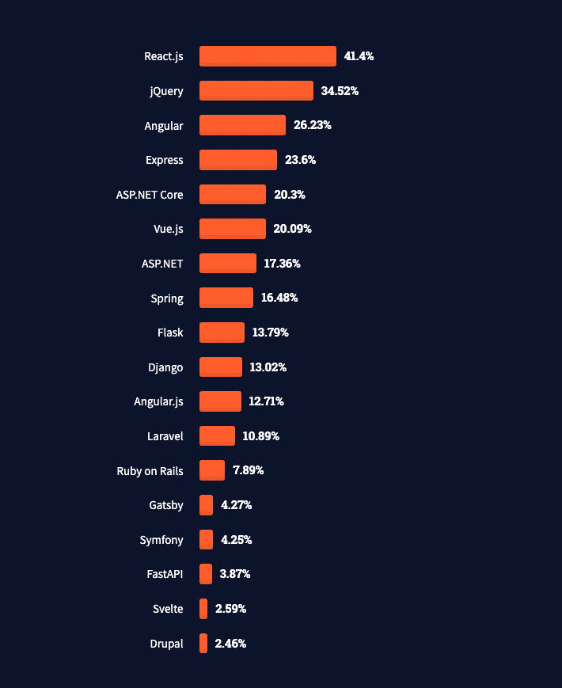

/\* widget: Blog: Top Quote \*/ /\* reset -------------------- \*/ .blog-custom-block \*, .blog-custom-block ::before, .blog-custom-block ::after {  box-sizing: border-box;  border-width: 0;  border-style: solid;  border-color: #e5e7eb; } /\* vars -------------------- \*/ .blog-custom-block.blog-custom-block\_\_top-quote {  --color-bg: #F4FAFE;  --color-border: rgb(15 164 234 / 0.50);  --color-text-1: #0F172A; } /\* colors -------------------- \*/ .blog-custom-block.blog-custom-block\_\_top-quote .border-clr-border {  border-color: var(--color-border); } .blog-custom-block.blog-custom-block\_\_top-quote .bg-clr-bg {  background-color: var(--color-bg); } .blog-custom-block.blog-custom-block\_\_simple-quote .text-clr-text-1 {  color: var(--color-text-1); } /\* utils -------------------- \*/ .blog-custom-block.blog-custom-block\_\_top-quote .flex {  display: flex; } .blog-custom-block.blog-custom-block\_\_top-quote .flex-shrink-0 {  flex-shrink: 0; } .blog-custom-block.blog-custom-block\_\_top-quote .flex-col {  flex-direction: column; } .blog-custom-block.blog-custom-block\_\_top-quote .items-center {  align-items: center; } .blog-custom-block.blog-custom-block\_\_top-quote .gap-4 {  gap: 1rem; } .blog-custom-block.blog-custom-block\_\_top-quote .rounded-xl {  border-radius: 0.75rem; } .blog-custom-block.blog-custom-block\_\_top-quote .border {  border-width: 1px; } .blog-custom-block.blog-custom-block\_\_top-quote .p-8 {  padding: 2rem; } .blog-custom-block.blog-custom-block\_\_top-quote .text-center {  text-align: center; } .blog-custom-block.blog-custom-block\_\_top-quote .text-2xl {  font-size: 1.5rem;  line-height: 2rem; } .blog-custom-block.blog-custom-block\_\_top-quote .font-bold {  font-weight: 700; } 

Which is better for my startup, React or Angular?

This is a question I’m often asked by both developers and entrepreneurs as part of my work as the Lead frontend developer at Altar.io.

It’s also a question I see a lot online.

I have a wealth of experience using both of these frameworks since the day they launched. And, to be completely honest with you, both React and Angular are fantastic technologies.

In this article, I will delve into each of them, to determine _if_ one is better than the other, and if so, _which_ is the best.

Let’s start with a quick overview of both of these frameworks – to get acquainted with them better.

.elementor-12941 .elementor-element.elementor-element-e56f4e6{--display:flex;--flex-direction:column;--container-widget-width:100%;--container-widget-height:initial;--container-widget-flex-grow:0;--container-widget-align-self:initial;--background-transition:0.3s;}.elementor-12941 .elementor-element.elementor-element-f8d1905{--box-background-color:var( --e-global-color-f6f9b04 );--box-border-color:var( --e-global-color-secondary );--box-border-width:1px;--box-border-radius:12px;--box-padding:12px;--header-color:var( --e-global-color-text );--separator-width:0px;--item-text-decoration:underline;--item-text-hover-decoration:underline;--marker-color:var( --e-global-color-primary );--marker-size:5px;}.elementor-12941 .elementor-element.elementor-element-f8d1905 .elementor-toc\_\_spinner{color:var( --e-global-color-secondary );fill:var( --e-global-color-secondary );}.elementor-12941 .elementor-element.elementor-element-f8d1905 .elementor-toc\_\_header, .elementor-12941 .elementor-element.elementor-element-f8d1905 .elementor-toc\_\_header-title{font-family:"Poppins", sans-serif;font-size:2.25rem;font-weight:700;text-transform:capitalize;line-height:1.2;}.elementor-12941 .elementor-element.elementor-element-f8d1905 .elementor-toc\_\_list-item{font-family:var( --e-global-typography-45f602c-font-family ), sans-serif;font-size:var( --e-global-typography-45f602c-font-size );font-weight:var( --e-global-typography-45f602c-font-weight );line-height:var( --e-global-typography-45f602c-line-height );letter-spacing:var( --e-global-typography-45f602c-letter-spacing );word-spacing:var( --e-global-typography-45f602c-word-spacing );}.elementor-12941 .elementor-element.elementor-element-f8d1905 > .elementor-widget-container{padding:32px 32px 32px 32px;}@media(max-width:1024px){.elementor-12941 .elementor-element.elementor-element-f8d1905 .elementor-toc\_\_list-item{font-size:var( --e-global-typography-45f602c-font-size );line-height:var( --e-global-typography-45f602c-line-height );letter-spacing:var( --e-global-typography-45f602c-letter-spacing );word-spacing:var( --e-global-typography-45f602c-word-spacing );}}@media(max-width:767px){.elementor-12941 .elementor-element.elementor-element-f8d1905 .elementor-toc\_\_list-item{font-size:var( --e-global-typography-45f602c-font-size );line-height:var( --e-global-typography-45f602c-line-height );letter-spacing:var( --e-global-typography-45f602c-letter-spacing );word-spacing:var( --e-global-typography-45f602c-word-spacing );}} /\*! elementor-pro - v3.19.0 - 07-02-2024 \*/ .elementor-widget-table-of-contents .elementor-toc\_\_header-title{color:var(--header-color)}.elementor-widget-table-of-contents.elementor-toc--collapsed .elementor-toc\_\_toggle-button--collapse,.elementor-widget-table-of-contents:not(.elementor-toc--collapsed) .elementor-toc\_\_toggle-button--expand{display:none}.elementor-widget-table-of-contents .elementor-widget-container{min-height:var(--box-min-height);border:var(--box-border-width,1px) solid var(--box-border-color,#9da5ae);border-radius:var(--box-border-radius,3px);background-color:var(--box-background-color);transition:min-height .4s;overflow:hidden}.elementor-toc\_\_header{display:flex;align-items:center;justify-content:space-between;padding:var(--box-padding,20px);background-color:var(--header-background-color);border-bottom:var(--separator-width,1px) solid var(--box-border-color,#9da5ae)}.elementor-toc\_\_header-title{font-size:18px;margin:0;color:var(--header-color)}.elementor-toc\_\_toggle-button{cursor:pointer;display:inline-flex}.elementor-toc\_\_toggle-button i{color:var(--toggle-button-color)}.elementor-toc\_\_toggle-button svg{height:1em;width:1em;fill:var(--toggle-button-color)}.elementor-toc\_\_spinner-container{text-align:center}.elementor-toc\_\_spinner{font-size:2em}.elementor-toc\_\_spinner.e-font-icon-svg{height:1em;width:1em}.elementor-toc\_\_body{padding:var(--box-padding,20px);max-height:var(--toc-body-max-height);overflow-y:auto}.elementor-toc\_\_body::-webkit-scrollbar{width:7px}.elementor-toc\_\_body::-webkit-scrollbar-thumb{background-color:#babfc5;border-radius:10px}.elementor-toc\_\_list-wrapper{list-style:none;padding:0}.elementor-toc\_\_list-item{margin-bottom:.5em}.elementor-toc\_\_list-item.elementor-item-active{font-weight:700}.elementor-toc\_\_list-item .elementor-toc\_\_list-wrapper{margin-top:.5em;margin-left:var(--nested-list-indent,1em)}.elementor-toc\_\_list-item-text:hover{color:var(--item-text-hover-color);-webkit-text-decoration:var(--item-text-hover-decoration);text-decoration:var(--item-text-hover-decoration)}.elementor-toc\_\_list-item-text.elementor-item-active{color:var(--item-text-active-color);-webkit-text-decoration:var(--item-text-active-decoration);text-decoration:var(--item-text-active-decoration)}.elementor-toc\_\_list-item-text-wrapper{display:flex;align-items:center}.elementor-toc\_\_list-item-text-wrapper:before,.elementor-toc\_\_list-item-text-wrapper i{margin-right:8px;color:var(--marker-color)}.elementor-toc\_\_list-item-text-wrapper svg{margin-right:8px;fill:var(--marker-color);height:var(--marker-size,.5em);width:var(--marker-size,.5em)}.elementor-toc\_\_list-item-text-wrapper i{font-size:var(--marker-size,.5em)}.elementor-toc\_\_list-item-text-wrapper:before{font-size:var(--marker-size,1em)}.elementor-toc--content-ellipsis .elementor-toc\_\_list-item-text{white-space:nowrap;overflow:hidden;text-overflow:ellipsis}.elementor-toc\_\_list-items--collapsible>.elementor-toc\_\_list-wrapper>.elementor-toc\_\_list-item>.elementor-toc\_\_list-wrapper{display:none}.elementor-toc\_\_heading-anchor{position:absolute}.elementor-toc\_\_body .elementor-toc\_\_list-item-text{color:var(--item-text-color);-webkit-text-decoration:var(--item-text-decoration);text-decoration:var(--item-text-decoration)}.elementor-toc\_\_body .elementor-toc\_\_list-item-text:hover{color:var(--item-text-hover-color);-webkit-text-decoration:var(--item-text-hover-decoration);text-decoration:var(--item-text-hover-decoration)}.elementor-toc\_\_body .elementor-toc\_\_list-item-text.elementor-item-active{color:var(--item-text-active-color);-webkit-text-decoration:var(--item-text-active-decoration);text-decoration:var(--item-text-active-decoration)}ol.elementor-toc\_\_list-wrapper{counter-reset:item}ol.elementor-toc\_\_list-wrapper .elementor-toc\_\_list-item{counter-increment:item}ol.elementor-toc\_\_list-wrapper .elementor-toc\_\_list-item-text-wrapper:before{content:counters(item,".") ". "}

#### Contents

## React & Angular: A Brief Overview

### What is Angular?

[Angular](https://angular.io/) (a.k.a Angular 2+) is a development platform built on [TypeScript](https://www.typescriptlang.org/) and managed by Google’s Angular team, as well as the Angular developer community. It’s an open-source framework used to build scalable web and hybrid applications. It has a collection of well-integrated libraries.

Angular as we know it today was launched in 2016, as a complete redesign of Angular JS (a.k.a Angular 1.0) – which was first released in 2010.

Angular has a steeper learning curve than React, developers are sometimes challenged to adapt and learn the many features – however Angular handles scalability better when developing mid-to-large applications.

It’s grown in popularity and is now used by some of the largest companies in the world including:

- Forbes
- Samsung
- Lego
- Disney
- PayPal
- Microsoft

And many many more. To see the full list of projects made with Angular, [check out this gallery](https://www.madewithangular.com/).

/\* widget: Blog: Small Topic \*/ /\* reset -------------------- \*/ .blog-custom-block \*, .blog-custom-block ::before, .blog-custom-block ::after {  box-sizing: border-box;  border-width: 0;  border-style: solid;  border-color: #e5e7eb; } /\* vars -------------------- \*/ .blog-custom-block.blog-custom-block\_\_small-topic {  --color-accent: #E7107E;  --color-bg: #F4FAFE;  --color-text-1: #0F172A; } /\* colors -------------------- \*/ .blog-custom-block.blog-custom-block\_\_small-topic .bg-clr-bg {  background-color: var(--color-bg); } .blog-custom-block.blog-custom-block\_\_small-topic .text-clr-accent {  color: var(--color-accent); } .blog-custom-block.blog-custom-block\_\_small-topic .text-clr-text-1 {  color: var(--color-text-1); } /\* utils -------------------- \*/ .blog-custom-block.blog-custom-block\_\_small-topic .mt-2 {  margin-top: 0.5rem; } .blog-custom-block.blog-custom-block\_\_small-topic .flex {  display: flex; } .blog-custom-block.blog-custom-block\_\_small-topic .flex-shrink-0 {  flex-shrink: 0; } .blog-custom-block.blog-custom-block\_\_small-topic .flex-col {  flex-direction: column; } .blog-custom-block.blog-custom-block\_\_small-topic .items-center {  align-items: center; } .blog-custom-block.blog-custom-block\_\_small-topic .p-5 {  padding: 1.25rem; } .blog-custom-block.blog-custom-block\_\_small-topic .gap-4 {  gap: 1rem; } .blog-custom-block.blog-custom-block\_\_small-topic .gap-5 {  gap: 1.25rem; } .blog-custom-block.blog-custom-block\_\_small-topic .rounded-xl {  border-radius: 0.75rem; } .blog-custom-block.blog-custom-block\_\_small-topic .p-8 {  padding: 2rem; } .blog-custom-block.blog-custom-block\_\_small-topic .text-xl {  font-size: 1.25rem;  line-height: 1.75rem; } .blog-custom-block.blog-custom-block\_\_small-topic .font-bold {  font-weight: 700; } 

Related: [Angulartics - A Powerful Analytics tool for Angular Applications](https://altar.io/powerful-analytics-tool-for-angular-applications-angulartics2/)

### What is React?

[React.js](https://reactjs.org/) is an open-source [JavaScript](https://www.javascript.com/) library created and managed by Facebook. It’s component-based and uses a declarative style of programming to build User Interfaces (UI).

Just like Angular, it’s used to build web applications. As well as native-rendered apps and mobile applications.

React’s core principle of “learn once, write anywhere” allows developers to build fast and scalable applications for all platforms without rewriting existing code. This makes the learning curve much shallower, however, React doesn’t handle scalability as well as Angular does.

A plethora of tech giants have used React in production for years including:

- Meta (Facebook and Instagram)
- Netflix
- Uber
- Airbnb
- Atlassian
- The New York Times

## Community Popularity

A quick look at Stack Overflow’s [annual developer report](https://insights.stackoverflow.com/survey/2021#most-popular-technologies-webframe-prof) for last year will tell you that React is by far the most popular web framework among professional developers.

/\*! elementor - v3.19.0 - 07-02-2024 \*/ .elementor-widget-image{text-align:center}.elementor-widget-image a{display:inline-block}.elementor-widget-image a img\[src$=".svg"\]{width:48px}.elementor-widget-image img{vertical-align:middle;display:inline-block}

41.4% of developers preferred React. Angular came third with 26.23% of developers favouring the framework. One in four developers who aren’t already using React also wish they were, according to the same survey.

**Among professional developers, the popularity of React is clearly superior to Angular.** 

Let’s delve into why that is, starting with Performance & DOM.

.elementor-16418 .elementor-element.elementor-element-fa6400f{--display:flex;--flex-direction:column;--container-widget-width:100%;--container-widget-height:initial;--container-widget-flex-grow:0;--container-widget-align-self:initial;--overflow:hidden;--background-transition:0.3s;--border-radius:12px 12px 12px 12px;}.elementor-16418 .elementor-element.elementor-element-283e311{--display:flex;--flex-direction:row;--container-widget-width:initial;--container-widget-height:100%;--container-widget-flex-grow:1;--container-widget-align-self:stretch;--gap:64px 64px;--background-transition:0.3s;}.elementor-16418 .elementor-element.elementor-element-283e311:not(.elementor-motion-effects-element-type-background), .elementor-16418 .elementor-element.elementor-element-283e311 > .elementor-motion-effects-container > .elementor-motion-effects-layer{background-color:#F4FAFE;}.elementor-16418 .elementor-element.elementor-element-283e311, .elementor-16418 .elementor-element.elementor-element-283e311::before{--border-transition:0.3s;}.elementor-16418 .elementor-element.elementor-element-857117e{--display:flex;--flex-direction:row;--container-widget-width:initial;--container-widget-height:100%;--container-widget-flex-grow:1;--container-widget-align-self:stretch;--background-transition:0.3s;}.elementor-16418 .elementor-element.elementor-element-857117e.e-con{--flex-grow:0;--flex-shrink:0;}.elementor-16418 .elementor-element.elementor-element-e6af329 img{width:100%;max-width:100%;height:100%;object-fit:cover;object-position:bottom right;}.elementor-16418 .elementor-element.elementor-element-e6af329{width:100%;max-width:100%;bottom:-44px;}body:not(.rtl) .elementor-16418 .elementor-element.elementor-element-e6af329{right:0px;}body.rtl .elementor-16418 .elementor-element.elementor-element-e6af329{left:0px;}.elementor-16418 .elementor-element.elementor-element-ec0de51{--display:flex;--flex-direction:column;--container-widget-width:100%;--container-widget-height:initial;--container-widget-flex-grow:0;--container-widget-align-self:initial;--gap:24px 24px;--background-transition:0.3s;--padding-block-start:112px;--padding-block-end:112px;--padding-inline-start:0px;--padding-inline-end:44px;}.elementor-16418 .elementor-element.elementor-element-ec0de51.e-con{--flex-grow:1;--flex-shrink:1;}.elementor-16418 .elementor-element.elementor-element-c168e59{--display:flex;--flex-direction:column;--container-widget-width:100%;--container-widget-height:initial;--container-widget-flex-grow:0;--container-widget-align-self:initial;--background-transition:0.3s;}.elementor-16418 .elementor-element.elementor-element-4aeb8ec .elementor-heading-title{font-family:"Poppins", sans-serif;font-size:32px;font-weight:700;}.elementor-16418 .elementor-element.elementor-element-8e0cd20{color:#000000;}@media(min-width:768px){.elementor-16418 .elementor-element.elementor-element-857117e{--width:360px;}}@media(max-width:767px){.elementor-16418 .elementor-element.elementor-element-283e311{--padding-block-start:40px;--padding-block-end:40px;--padding-inline-start:var(--safe-margin);--padding-inline-end:var(--safe-margin);}.elementor-16418 .elementor-element.elementor-element-857117e{--min-height:300px;}body:not(.rtl) .elementor-16418 .elementor-element.elementor-element-e6af329{right:0px;}body.rtl .elementor-16418 .elementor-element.elementor-element-e6af329{left:0px;}.elementor-16418 .elementor-element.elementor-element-e6af329{bottom:-76px;}.elementor-16418 .elementor-element.elementor-element-ec0de51{--padding-block-start:40px;--padding-block-end:0px;--padding-inline-start:0px;--padding-inline-end:0px;}}

/\*! elementor - v3.19.0 - 07-02-2024 \*/ .elementor-heading-title{padding:0;margin:0;line-height:1}.elementor-widget-heading .elementor-heading-title\[class\*=elementor-size-\]>a{color:inherit;font-size:inherit;line-height:inherit}.elementor-widget-heading .elementor-heading-title.elementor-size-small{font-size:15px}.elementor-widget-heading .elementor-heading-title.elementor-size-medium{font-size:19px}.elementor-widget-heading .elementor-heading-title.elementor-size-large{font-size:29px}.elementor-widget-heading .elementor-heading-title.elementor-size-xl{font-size:39px}.elementor-widget-heading .elementor-heading-title.elementor-size-xxl{font-size:59px}

##### Looking for Software Development Services?

/\*! elementor - v3.19.0 - 07-02-2024 \*/ .elementor-widget-text-editor.elementor-drop-cap-view-stacked .elementor-drop-cap{background-color:#69727d;color:#fff}.elementor-widget-text-editor.elementor-drop-cap-view-framed .elementor-drop-cap{color:#69727d;border:3px solid;background-color:transparent}.elementor-widget-text-editor:not(.elementor-drop-cap-view-default) .elementor-drop-cap{margin-top:8px}.elementor-widget-text-editor:not(.elementor-drop-cap-view-default) .elementor-drop-cap-letter{width:1em;height:1em}.elementor-widget-text-editor .elementor-drop-cap{float:left;text-align:center;line-height:1;font-size:50px}.elementor-widget-text-editor .elementor-drop-cap-letter{display:inline-block}

Get straight to the point, jargon-free advice from a tech expert that has been building award-winning Startups for the past 10 years.

Let's Talk

## Performance & DOM (Document Object Model)

Both React & Angular are great options for building applications, however, there’s one key difference between the two.

React uses virtual [DOM](https://developer.mozilla.org/en-US/docs/Web/API/Document_Object_Model/Introduction), whereas Angular uses real DOM.

To contextualise this, let's create an example. Say you want to update a user's profile details – like their first name. Real DOM would update the entire tree-like structure of HTML tables until it reaches the correct data point (user’s first name).

Conversely, virtual DOM updates the chosen data (user’s first name) without rewriting the structure of the HTML doc. This means updates to the UI will render much quicker.

## Data Binding

As well as looking at Performance & DOM we need to look at data binding when comparing React vs. Angular.

Data binding is the process of synchronizing data between business logic and UI.

Here, React uses one-way data binding. Meaning that when creating a React App, developers will most likely “nest” child components within higher ranking parent components. Think of it as the hierarchy of headings in an article or web page: Heading 1 is the parent of Heading 2, etc.

Angular uses both [one and two-way data binding](https://angular.io/guide/binding-syntax). Here, changing data impacts the way you view it. More than that, changing the view triggers changes in the data.

The one/two-way data binding of Angular makes the framework much simpler to work with, and much more flexible. That being said, the one-way binding of React gives the code more stability and makes debugging simpler.

## Bundle Size

Another important consideration in the React vs. Angular debate is bundle size. After all, the smaller the bundle, the faster it loads. This has a direct impact on your app's performance and ultimately, conversion rate.

Both Angular and React use Webpack which splits your code into smaller parts to reduce the bundle size. Along with dynamic imports (loading code as it’s needed, as opposed to all at once) and “tree-shaking”. Also known as dead-code elimination, tree-shaking ensures that unused models won’t be included in the bundle as the app is built.

Angular is a fully-fledged framework and ships a lot of features in the core. This produces a larger output and, sometimes can burden your projects. Translating into a heavier application with slower performance compared to React.

On the other hand, if you have a large application with a lot of dependencies, Angular can be better because it has an ecosystem of features built already.

Conversely, React relies on third-party packages to achieve the same goals as Angular in this situation – as we will see in the “scalability” section below.

.elementor-3329 .elementor-element.elementor-element-f79b780{--display:flex;--flex-direction:column;--container-widget-width:100%;--container-widget-height:initial;--container-widget-flex-grow:0;--container-widget-align-self:initial;--background-transition:0.3s;}.elementor-3329 .elementor-element.elementor-element-aa6dd2a{--display:flex;--flex-direction:column;--container-widget-width:100%;--container-widget-height:initial;--container-widget-flex-grow:0;--container-widget-align-self:initial;--gap:24px 24px;--background-transition:0.3s;--border-radius:12px 12px 12px 12px;--padding-block-start:70px;--padding-block-end:70px;--padding-inline-start:var(--safe-margin);--padding-inline-end:var(--safe-margin);}.elementor-3329 .elementor-element.elementor-element-aa6dd2a:not(.elementor-motion-effects-element-type-background), .elementor-3329 .elementor-element.elementor-element-aa6dd2a > .elementor-motion-effects-container > .elementor-motion-effects-layer{background-color:#29293E;}.elementor-3329 .elementor-element.elementor-element-aa6dd2a, .elementor-3329 .elementor-element.elementor-element-aa6dd2a::before{--border-transition:0.3s;}.elementor-3329 .elementor-element.elementor-element-95ae566{--display:flex;--flex-direction:column;--container-widget-width:100%;--container-widget-height:initial;--container-widget-flex-grow:0;--container-widget-align-self:initial;--background-transition:0.3s;}.elementor-3329 .elementor-element.elementor-element-99ebd14{text-align:center;}.elementor-3329 .elementor-element.elementor-element-99ebd14 .elementor-heading-title{color:var( --e-global-color-eb70be1 );font-family:var( --e-global-typography-0ff79ee-font-family ), sans-serif;font-size:var( --e-global-typography-0ff79ee-font-size );font-weight:var( --e-global-typography-0ff79ee-font-weight );line-height:var( --e-global-typography-0ff79ee-line-height );letter-spacing:var( --e-global-typography-0ff79ee-letter-spacing );word-spacing:var( --e-global-typography-0ff79ee-word-spacing );}.elementor-3329 .elementor-element.elementor-element-0ce57c0{text-align:center;color:var( --e-global-color-eb70be1 );font-size:20px;}.elementor-3329 .elementor-element.elementor-element-28db4d7{--display:flex;--flex-direction:row;--container-widget-width:initial;--container-widget-height:100%;--container-widget-flex-grow:1;--container-widget-align-self:stretch;--justify-content:flex-start;--background-transition:0.3s;}.elementor-3329 .elementor-element.elementor-element-70fbc6a .elementor-field-group{padding-right:calc( 24px/2 );padding-left:calc( 24px/2 );margin-bottom:32px;}.elementor-3329 .elementor-element.elementor-element-70fbc6a .elementor-form-fields-wrapper{margin-left:calc( -24px/2 );margin-right:calc( -24px/2 );margin-bottom:-32px;}.elementor-3329 .elementor-element.elementor-element-70fbc6a .elementor-field-group.recaptcha\_v3-bottomleft, .elementor-3329 .elementor-element.elementor-element-70fbc6a .elementor-field-group.recaptcha\_v3-bottomright{margin-bottom:0;}body.rtl .elementor-3329 .elementor-element.elementor-element-70fbc6a .elementor-labels-inline .elementor-field-group > label{padding-left:8px;}body:not(.rtl) .elementor-3329 .elementor-element.elementor-element-70fbc6a .elementor-labels-inline .elementor-field-group > label{padding-right:8px;}body .elementor-3329 .elementor-element.elementor-element-70fbc6a .elementor-labels-above .elementor-field-group > label{padding-bottom:8px;}.elementor-3329 .elementor-element.elementor-element-70fbc6a .elementor-field-group > label, .elementor-3329 .elementor-element.elementor-element-70fbc6a .elementor-field-subgroup label{color:var( --e-global-color-eb70be1 );}.elementor-3329 .elementor-element.elementor-element-70fbc6a .elementor-field-group > label{font-family:var( --e-global-typography-9730a4e-font-family ), sans-serif;font-size:var( --e-global-typography-9730a4e-font-size );font-weight:var( --e-global-typography-9730a4e-font-weight );line-height:var( --e-global-typography-9730a4e-line-height );letter-spacing:var( --e-global-typography-9730a4e-letter-spacing );word-spacing:var( --e-global-typography-9730a4e-word-spacing );}.elementor-3329 .elementor-element.elementor-element-70fbc6a .elementor-field-type-html{padding-bottom:0px;}.elementor-3329 .elementor-element.elementor-element-70fbc6a .elementor-field-group .elementor-field{color:var( --e-global-color-eb70be1 );}.elementor-3329 .elementor-element.elementor-element-70fbc6a .elementor-field-group .elementor-field, .elementor-3329 .elementor-element.elementor-element-70fbc6a .elementor-field-subgroup label{font-family:var( --e-global-typography-text-font-family ), sans-serif;font-size:var( --e-global-typography-text-font-size );font-weight:var( --e-global-typography-text-font-weight );line-height:var( --e-global-typography-text-line-height );}.elementor-3329 .elementor-element.elementor-element-70fbc6a .elementor-field-group:not(.elementor-field-type-upload) .elementor-field:not(.elementor-select-wrapper){background-color:#3D3D5C;border-color:#65639C;}.elementor-3329 .elementor-element.elementor-element-70fbc6a .elementor-field-group .elementor-select-wrapper select{background-color:#3D3D5C;border-color:#65639C;}.elementor-3329 .elementor-element.elementor-element-70fbc6a .elementor-field-group .elementor-select-wrapper::before{color:#65639C;}.elementor-3329 .elementor-element.elementor-element-70fbc6a .elementor-button{font-family:"Poppins", sans-serif;font-size:14px;font-weight:700;line-height:1.5;}.elementor-3329 .elementor-element.elementor-element-70fbc6a .e-form\_\_buttons\_\_wrapper\_\_button-next{background-color:var( --e-global-color-1e4bfa7 );color:var( --e-global-color-eb70be1 );}.elementor-3329 .elementor-element.elementor-element-70fbc6a .elementor-button\[type="submit"\]{background-color:var( --e-global-color-1e4bfa7 );color:var( --e-global-color-eb70be1 );}.elementor-3329 .elementor-element.elementor-element-70fbc6a .elementor-button\[type="submit"\] svg \*{fill:var( --e-global-color-eb70be1 );}.elementor-3329 .elementor-element.elementor-element-70fbc6a .e-form\_\_buttons\_\_wrapper\_\_button-previous{color:var( --e-global-color-eb70be1 );}.elementor-3329 .elementor-element.elementor-element-70fbc6a .e-form\_\_buttons\_\_wrapper\_\_button-next:hover{color:#ffffff;}.elementor-3329 .elementor-element.elementor-element-70fbc6a .elementor-button\[type="submit"\]:hover{color:#ffffff;}.elementor-3329 .elementor-element.elementor-element-70fbc6a .elementor-button\[type="submit"\]:hover svg \*{fill:#ffffff;}.elementor-3329 .elementor-element.elementor-element-70fbc6a .e-form\_\_buttons\_\_wrapper\_\_button-previous:hover{color:#ffffff;}.elementor-3329 .elementor-element.elementor-element-70fbc6a .elementor-message{font-family:var( --e-global-typography-9730a4e-font-family ), sans-serif;font-size:var( --e-global-typography-9730a4e-font-size );font-weight:var( --e-global-typography-9730a4e-font-weight );line-height:var( --e-global-typography-9730a4e-line-height );letter-spacing:var( --e-global-typography-9730a4e-letter-spacing );word-spacing:var( --e-global-typography-9730a4e-word-spacing );}.elementor-3329 .elementor-element.elementor-element-70fbc6a .elementor-message.elementor-message-success{color:var( --e-global-color-40f63f7 );}.elementor-3329 .elementor-element.elementor-element-70fbc6a .elementor-message.elementor-message-danger{color:var( --e-global-color-8ddb30f );}.elementor-3329 .elementor-element.elementor-element-70fbc6a .elementor-message.elementor-help-inline{color:var( --e-global-color-9acb2f2 );}.elementor-3329 .elementor-element.elementor-element-70fbc6a{--e-form-steps-indicators-spacing:20px;--e-form-steps-indicator-padding:30px;--e-form-steps-indicator-inactive-secondary-color:#ffffff;--e-form-steps-indicator-active-secondary-color:#ffffff;--e-form-steps-indicator-completed-secondary-color:#ffffff;--e-form-steps-divider-width:1px;--e-form-steps-divider-gap:10px;width:100%;max-width:100%;}.elementor-3329 .elementor-element.elementor-element-70fbc6a > .elementor-widget-container{padding:10px 0px 0px 0px;}@media(min-width:768px){.elementor-3329 .elementor-element.elementor-element-aa6dd2a{--content-width:var(--container-md);}}@media(max-width:1024px){.elementor-3329 .elementor-element.elementor-element-99ebd14 .elementor-heading-title{font-size:var( --e-global-typography-0ff79ee-font-size );line-height:var( --e-global-typography-0ff79ee-line-height );letter-spacing:var( --e-global-typography-0ff79ee-letter-spacing );word-spacing:var( --e-global-typography-0ff79ee-word-spacing );}.elementor-3329 .elementor-element.elementor-element-70fbc6a .elementor-field-group > label{font-size:var( --e-global-typography-9730a4e-font-size );line-height:var( --e-global-typography-9730a4e-line-height );letter-spacing:var( --e-global-typography-9730a4e-letter-spacing );word-spacing:var( --e-global-typography-9730a4e-word-spacing );}.elementor-3329 .elementor-element.elementor-element-70fbc6a .elementor-field-group .elementor-field, .elementor-3329 .elementor-element.elementor-element-70fbc6a .elementor-field-subgroup label{font-size:var( --e-global-typography-text-font-size );line-height:var( --e-global-typography-text-line-height );}.elementor-3329 .elementor-element.elementor-element-70fbc6a .elementor-message{font-size:var( --e-global-typography-9730a4e-font-size );line-height:var( --e-global-typography-9730a4e-line-height );letter-spacing:var( --e-global-typography-9730a4e-letter-spacing );word-spacing:var( --e-global-typography-9730a4e-word-spacing );}}@media(max-width:767px){.elementor-3329 .elementor-element.elementor-element-99ebd14 .elementor-heading-title{font-size:var( --e-global-typography-0ff79ee-font-size );line-height:var( --e-global-typography-0ff79ee-line-height );letter-spacing:var( --e-global-typography-0ff79ee-letter-spacing );word-spacing:var( --e-global-typography-0ff79ee-word-spacing );}.elementor-3329 .elementor-element.elementor-element-70fbc6a .elementor-field-group > label{font-size:var( --e-global-typography-9730a4e-font-size );line-height:var( --e-global-typography-9730a4e-line-height );letter-spacing:var( --e-global-typography-9730a4e-letter-spacing );word-spacing:var( --e-global-typography-9730a4e-word-spacing );}.elementor-3329 .elementor-element.elementor-element-70fbc6a .elementor-field-group .elementor-field, .elementor-3329 .elementor-element.elementor-element-70fbc6a .elementor-field-subgroup label{font-size:var( --e-global-typography-text-font-size );line-height:var( --e-global-typography-text-line-height );}.elementor-3329 .elementor-element.elementor-element-70fbc6a .elementor-message{font-size:var( --e-global-typography-9730a4e-font-size );line-height:var( --e-global-typography-9730a4e-line-height );letter-spacing:var( --e-global-typography-9730a4e-letter-spacing );word-spacing:var( --e-global-typography-9730a4e-word-spacing );}}/\* Start custom CSS for form, class: .elementor-element-70fbc6a \*/.elementor-3329 .elementor-element.elementor-element-70fbc6a input {  border-color: #65639C !important; } .elementor-3329 .elementor-element.elementor-element-70fbc6a input:is(:focus, :hover) {  border-color: #B9B8CE !important; }/\* End custom CSS \*/

##### Sign up for our newsletter

Join hundreds of entrepreneurs and business leaders to receive fresh, actionable tech and startup related insights and tips

/\*! elementor-pro - v3.19.0 - 07-02-2024 \*/ .elementor-button.elementor-hidden,.elementor-hidden{display:none}.e-form\_\_step{width:100%}.e-form\_\_step:not(.elementor-hidden){display:flex;flex-wrap:wrap}.e-form\_\_buttons{flex-wrap:wrap}.e-form\_\_buttons,.e-form\_\_buttons\_\_wrapper{display:flex}.e-form\_\_indicators{display:flex;justify-content:space-between;align-items:center;flex-wrap:nowrap;font-size:13px;margin-bottom:var(--e-form-steps-indicators-spacing)}.e-form\_\_indicators\_\_indicator{display:flex;flex-direction:column;align-items:center;justify-content:center;flex-basis:0;padding:0 var(--e-form-steps-divider-gap)}.e-form\_\_indicators\_\_indicator\_\_progress{width:100%;position:relative;background-color:var(--e-form-steps-indicator-progress-background-color);border-radius:var(--e-form-steps-indicator-progress-border-radius);overflow:hidden}.e-form\_\_indicators\_\_indicator\_\_progress\_\_meter{width:var(--e-form-steps-indicator-progress-meter-width,0);height:var(--e-form-steps-indicator-progress-height);line-height:var(--e-form-steps-indicator-progress-height);padding-right:15px;border-radius:var(--e-form-steps-indicator-progress-border-radius);background-color:var(--e-form-steps-indicator-progress-color);color:var(--e-form-steps-indicator-progress-meter-color);text-align:right;transition:width .1s linear}.e-form\_\_indicators\_\_indicator:first-child{padding-left:0}.e-form\_\_indicators\_\_indicator:last-child{padding-right:0}.e-form\_\_indicators\_\_indicator--state-inactive{color:var(--e-form-steps-indicator-inactive-primary-color,#c2cbd2)}.e-form\_\_indicators\_\_indicator--state-inactive \[class\*=indicator--shape-\]:not(.e-form\_\_indicators\_\_indicator--shape-none){background-color:var(--e-form-steps-indicator-inactive-secondary-color,#fff)}.e-form\_\_indicators\_\_indicator--state-inactive object,.e-form\_\_indicators\_\_indicator--state-inactive svg{fill:var(--e-form-steps-indicator-inactive-primary-color,#c2cbd2)}.e-form\_\_indicators\_\_indicator--state-active{color:var(--e-form-steps-indicator-active-primary-color,#39b54a);border-color:var(--e-form-steps-indicator-active-secondary-color,#fff)}.e-form\_\_indicators\_\_indicator--state-active \[class\*=indicator--shape-\]:not(.e-form\_\_indicators\_\_indicator--shape-none){background-color:var(--e-form-steps-indicator-active-secondary-color,#fff)}.e-form\_\_indicators\_\_indicator--state-active object,.e-form\_\_indicators\_\_indicator--state-active svg{fill:var(--e-form-steps-indicator-active-primary-color,#39b54a)}.e-form\_\_indicators\_\_indicator--state-completed{color:var(--e-form-steps-indicator-completed-secondary-color,#fff)}.e-form\_\_indicators\_\_indicator--state-completed \[class\*=indicator--shape-\]:not(.e-form\_\_indicators\_\_indicator--shape-none){background-color:var(--e-form-steps-indicator-completed-primary-color,#39b54a)}.e-form\_\_indicators\_\_indicator--state-completed .e-form\_\_indicators\_\_indicator\_\_label{color:var(--e-form-steps-indicator-completed-primary-color,#39b54a)}.e-form\_\_indicators\_\_indicator--state-completed .e-form\_\_indicators\_\_indicator--shape-none{color:var(--e-form-steps-indicator-completed-primary-color,#39b54a);background-color:initial}.e-form\_\_indicators\_\_indicator--state-completed object,.e-form\_\_indicators\_\_indicator--state-completed svg{fill:var(--e-form-steps-indicator-completed-secondary-color,#fff)}.e-form\_\_indicators\_\_indicator\_\_icon{width:var(--e-form-steps-indicator-padding,30px);height:var(--e-form-steps-indicator-padding,30px);font-size:var(--e-form-steps-indicator-icon-size);border-width:1px;border-style:solid;display:flex;justify-content:center;align-items:center;overflow:hidden;margin-bottom:10px}.e-form\_\_indicators\_\_indicator\_\_icon img,.e-form\_\_indicators\_\_indicator\_\_icon object,.e-form\_\_indicators\_\_indicator\_\_icon svg{width:var(--e-form-steps-indicator-icon-size);height:auto}.e-form\_\_indicators\_\_indicator\_\_icon .e-font-icon-svg{height:1em}.e-form\_\_indicators\_\_indicator\_\_number{width:var(--e-form-steps-indicator-padding,30px);height:var(--e-form-steps-indicator-padding,30px);border-width:1px;border-style:solid;display:flex;justify-content:center;align-items:center;margin-bottom:10px}.e-form\_\_indicators\_\_indicator--shape-circle{border-radius:50%}.e-form\_\_indicators\_\_indicator--shape-square{border-radius:0}.e-form\_\_indicators\_\_indicator--shape-rounded{border-radius:5px}.e-form\_\_indicators\_\_indicator--shape-none{border:0}.e-form\_\_indicators\_\_indicator\_\_label{text-align:center}.e-form\_\_indicators\_\_indicator\_\_separator{width:100%;height:var(--e-form-steps-divider-width);background-color:#babfc5}.e-form\_\_indicators--type-icon,.e-form\_\_indicators--type-icon\_text,.e-form\_\_indicators--type-number,.e-form\_\_indicators--type-number\_text{align-items:flex-start}.e-form\_\_indicators--type-icon .e-form\_\_indicators\_\_indicator\_\_separator,.e-form\_\_indicators--type-icon\_text .e-form\_\_indicators\_\_indicator\_\_separator,.e-form\_\_indicators--type-number .e-form\_\_indicators\_\_indicator\_\_separator,.e-form\_\_indicators--type-number\_text .e-form\_\_indicators\_\_indicator\_\_separator{margin-top:calc(var(--e-form-steps-indicator-padding, 30px) / 2 - var(--e-form-steps-divider-width, 1px) / 2)}.elementor-field-type-hidden{display:none}.elementor-field-type-html{display:inline-block}.elementor-field-type-tel input{direction:inherit}.elementor-login .elementor-lost-password,.elementor-login .elementor-remember-me{font-size:.85em}.elementor-field-type-recaptcha\_v3 .elementor-field-label{display:none}.elementor-field-type-recaptcha\_v3 .grecaptcha-badge{z-index:1}.elementor-button .elementor-form-spinner{order:3}.elementor-form .elementor-button>span{display:flex;justify-content:center;align-items:center}.elementor-form .elementor-button .elementor-button-text{white-space:normal;flex-grow:0}.elementor-form .elementor-button svg{height:auto}.elementor-form .elementor-button .e-font-icon-svg{height:1em}.elementor-select-wrapper .select-caret-down-wrapper{position:absolute;top:50%;transform:translateY(-50%);inset-inline-end:10px;pointer-events:none;font-size:11px}.elementor-select-wrapper .select-caret-down-wrapper svg{display:unset;width:1em;aspect-ratio:unset;fill:currentColor}.elementor-select-wrapper .select-caret-down-wrapper i{font-size:19px;line-height:2}.elementor-select-wrapper.remove-before:before{content:""!important}

   Full Name  Buisness Email  Subscribe

## Scalability

You should always have in mind your project’s future scope, even on day one.

Here, Angular takes the cake. It’s packed with core features to help developers add new functionality to an app and scale it easily.

It’s the reason that generally, Angular is used for larger-scale projects.

That being said, React can still be used for larger apps through the development of a maintainable architecture with server-side rendering.

But it’s important to note here that React relies heavily on third-party packages to scale well – whereas Angular has them built-in. When dealing with third-party libraries the authors may not keep them as up-to-date.

This means you could be scaling your app and find that one of the libraries that you’re depending on is left dormant by the author. This could potentially create roadblocks in your development process.

Of course, even though Angulars packages are first-party, you could face a similar situation – but it’s not as likely.

## Which is Better For Your Startup? React vs. Angular

Both React and Angular are great tools for frontend development. There is a laundry list of advantages to each.

That being said, I would say deciding which is “best” for your startup comes down to one simple question:

**What are you building?** 

If you’re building a small, lightweight app with a shortlist of features, React is probably the framework for you. It’s impressively fast thanks to its support for the virtual DOM. This results in a good user experience which directly enhances your SEO.

Simply put, you can use React anywhere without sacrificing performance. It allows you to effortlessly deploy across multiple platforms thanks to the framework ecosystem behind it – like React Native for mobile app development.

Just bear in mind that if you have to scale your app to be much larger, you may find React limiting further down the line.

If you’re setting out to build a large, enterprise-grade application with a myriad of features, I would recommend looking into Angular for your frontend needs.

Angular is great for applications that need to change displayed content dynamically at the will of the user, thanks to its structure and efficient data binding.

Despite its bundle size, Angular’s tools still make it the best choice for enterprise-grade applications.

Lastly, if you’re still unsure which is the right choice for your startup, you can [reach out to me here](mailto:altar@altar.io) – I’d be happy to have an informal conversation to go over your specific project and the pros and cons of both frameworks.
