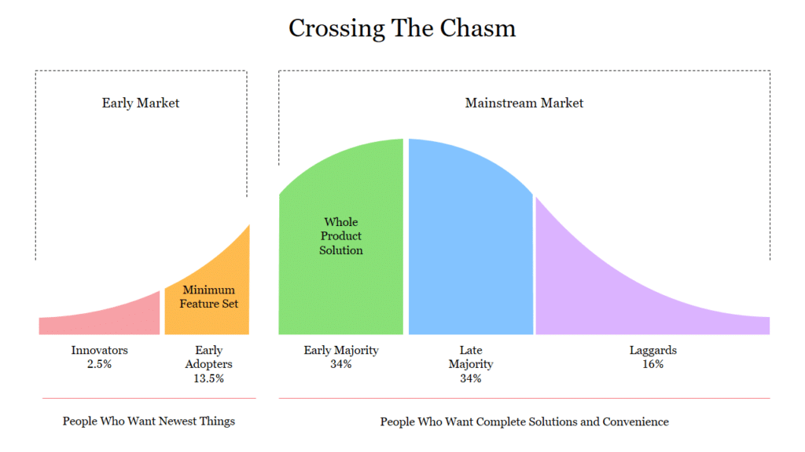

/\* widget: Blog: Simple Quote \*/ /\* reset -------------------- \*/ .blog-custom-block \*, .blog-custom-block ::before, .blog-custom-block ::after {  box-sizing: border-box;  border-width: 0;  border-style: solid;  border-color: #e5e7eb; } /\* vars -------------------- \*/ .blog-custom-block.blog-custom-block\_\_simple-quote {  --color-accent: #0FA4EA;  --color-bg: #F4FAFE;  --color-text-2: #4A4A68; } /\* colors -------------------- \*/ .blog-custom-block.blog-custom-block\_\_simple-quote .bg-clr-bg {  background-color: var(--color-bg); } .blog-custom-block.blog-custom-block\_\_simple-quote .border-clr-accent {  border-color: var(--color-accent); } .blog-custom-block.blog-custom-block\_\_simple-quote .text-clr-text-2 {  color: var(--color-text-2); } /\* utils -------------------- \*/ .blog-custom-block.blog-custom-block\_\_simple-quote .flex {  display: flex; } .blog-custom-block.blog-custom-block\_\_simple-quote .flex-shrink-0 {  flex-shrink: 0; } .blog-custom-block.blog-custom-block\_\_simple-quote .flex-col {  flex-direction: column; } .blog-custom-block.blog-custom-block\_\_simple-quote .gap-4 {  gap: 1rem; } .blog-custom-block.blog-custom-block\_\_simple-quote .rounded-xl {  border-radius: 0.75rem; } .blog-custom-block.blog-custom-block\_\_simple-quote .border-l-6 {  border-left-width: 6px; } .blog-custom-block.blog-custom-block\_\_simple-quote .p-8 {  padding: 2rem; } .blog-custom-block.blog-custom-block\_\_simple-quote .text-xl {  font-size: 1.25rem;  line-height: 1.75rem; } .blog-custom-block.blog-custom-block\_\_simple-quote .italic {  font-style: italic; } 

Is this \[ChatGPT product release from OpenAI\] a pivotal moment? Out of all the GPT versions, 50 years from now when they look back on an early system that was really kind of a leap.

This was the question posed by AI researcher Lex Fridman in a conversation with Sam Altman, former president of Y Combinator and current CEO of OpenAI. Altman's response encapsulates the essence of what truly makes a product successful:

/\* widget: Blog: Simple Quote \*/ /\* reset -------------------- \*/ .blog-custom-block \*, .blog-custom-block ::before, .blog-custom-block ::after {  box-sizing: border-box;  border-width: 0;  border-style: solid;  border-color: #e5e7eb; } /\* vars -------------------- \*/ .blog-custom-block.blog-custom-block\_\_simple-quote {  --color-accent: #0FA4EA;  --color-bg: #F4FAFE;  --color-text-2: #4A4A68; } /\* colors -------------------- \*/ .blog-custom-block.blog-custom-block\_\_simple-quote .bg-clr-bg {  background-color: var(--color-bg); } .blog-custom-block.blog-custom-block\_\_simple-quote .border-clr-accent {  border-color: var(--color-accent); } .blog-custom-block.blog-custom-block\_\_simple-quote .text-clr-text-2 {  color: var(--color-text-2); } /\* utils -------------------- \*/ .blog-custom-block.blog-custom-block\_\_simple-quote .flex {  display: flex; } .blog-custom-block.blog-custom-block\_\_simple-quote .flex-shrink-0 {  flex-shrink: 0; } .blog-custom-block.blog-custom-block\_\_simple-quote .flex-col {  flex-direction: column; } .blog-custom-block.blog-custom-block\_\_simple-quote .gap-4 {  gap: 1rem; } .blog-custom-block.blog-custom-block\_\_simple-quote .rounded-xl {  border-radius: 0.75rem; } .blog-custom-block.blog-custom-block\_\_simple-quote .border-l-6 {  border-left-width: 6px; } .blog-custom-block.blog-custom-block\_\_simple-quote .p-8 {  padding: 2rem; } .blog-custom-block.blog-custom-block\_\_simple-quote .text-xl {  font-size: 1.25rem;  line-height: 1.75rem; } .blog-custom-block.blog-custom-block\_\_simple-quote .italic {  font-style: italic; } 

It wasn’t the underlying model that mattered, it was the usability of it, both the RLHF (Reinforcement Learning from Human Feedback) and the interface to it.

These words underscore the fundamental belief that the core success of a startup is intimately linked to how your product delivers a valuable experience to its users.

Using OpenAI's ChatGPT as a prime example, I wanted to use this article to delve into these crucial aspects of product development in a Startup.

.elementor-12941 .elementor-element.elementor-element-e56f4e6{--display:flex;--flex-direction:column;--container-widget-width:100%;--container-widget-height:initial;--container-widget-flex-grow:0;--container-widget-align-self:initial;--background-transition:0.3s;}.elementor-12941 .elementor-element.elementor-element-f8d1905{--box-background-color:var( --e-global-color-f6f9b04 );--box-border-color:var( --e-global-color-secondary );--box-border-width:1px;--box-border-radius:12px;--box-padding:12px;--header-color:var( --e-global-color-text );--separator-width:0px;--item-text-decoration:underline;--item-text-hover-decoration:underline;--marker-color:var( --e-global-color-primary );--marker-size:5px;}.elementor-12941 .elementor-element.elementor-element-f8d1905 .elementor-toc\_\_spinner{color:var( --e-global-color-secondary );fill:var( --e-global-color-secondary );}.elementor-12941 .elementor-element.elementor-element-f8d1905 .elementor-toc\_\_header, .elementor-12941 .elementor-element.elementor-element-f8d1905 .elementor-toc\_\_header-title{font-family:"Poppins", sans-serif;font-size:2.25rem;font-weight:700;text-transform:capitalize;line-height:1.2;}.elementor-12941 .elementor-element.elementor-element-f8d1905 .elementor-toc\_\_list-item{font-family:var( --e-global-typography-45f602c-font-family ), sans-serif;font-size:var( --e-global-typography-45f602c-font-size );font-weight:var( --e-global-typography-45f602c-font-weight );line-height:var( --e-global-typography-45f602c-line-height );letter-spacing:var( --e-global-typography-45f602c-letter-spacing );word-spacing:var( --e-global-typography-45f602c-word-spacing );}.elementor-12941 .elementor-element.elementor-element-f8d1905 > .elementor-widget-container{padding:32px 32px 32px 32px;}@media(max-width:1024px){.elementor-12941 .elementor-element.elementor-element-f8d1905 .elementor-toc\_\_list-item{font-size:var( --e-global-typography-45f602c-font-size );line-height:var( --e-global-typography-45f602c-line-height );letter-spacing:var( --e-global-typography-45f602c-letter-spacing );word-spacing:var( --e-global-typography-45f602c-word-spacing );}}@media(max-width:767px){.elementor-12941 .elementor-element.elementor-element-f8d1905 .elementor-toc\_\_list-item{font-size:var( --e-global-typography-45f602c-font-size );line-height:var( --e-global-typography-45f602c-line-height );letter-spacing:var( --e-global-typography-45f602c-letter-spacing );word-spacing:var( --e-global-typography-45f602c-word-spacing );}}

#### Contents

## Product Timing

The success of a startup often hinges on timing. [YouTube](https://www.britannica.com/topic/YouTube), for instance, was founded when Adobe's Flash Video player was gaining rapid popularity. This technological trend created the perfect environment for a user-friendly platform for easy video sharing.

Similarly, Google's development of transformer models was foundational to the capabilities of GPT-3 (released in 2020) and, by extension, ChatGPT (released in November 2022).

In this way, timing is not just about market trends but also about technological readiness. Recognising the right moment when technological advancements meet market readiness can make all the difference in a startup's success.

The famous [story of pets.com](https://www.investopedia.com/ask/answers/08/dotcom-pets-dot-com.asp) underlines this.

Pets.com was an iconic failure from the dot-com bubble era, epitomising the perils of premature scaling and misreading market readiness.

Founded in 1998, the company invested heavily in advertising and infrastructure without a sustainable profit model.

Their high customer acquisition costs, challenges in shipping bulky items like pet food, intense competition, and the bursting of the dot-com bubble in 2000 all contributed to its downfall.

Mere months after its IPO in 2000, and without securing additional funding or a buyer, Pets.com shuttered, serving as a stark reminder of the importance of timing and the need for a clear path to profitability in the volatile world of startups.

/\* widget: Blog: Small Topic \*/ /\* reset -------------------- \*/ .blog-custom-block \*, .blog-custom-block ::before, .blog-custom-block ::after {  box-sizing: border-box;  border-width: 0;  border-style: solid;  border-color: #e5e7eb; } /\* vars -------------------- \*/ .blog-custom-block.blog-custom-block\_\_small-topic {  --color-accent: #E7107E;  --color-bg: #F4FAFE;  --color-text-1: #0F172A; } /\* colors -------------------- \*/ .blog-custom-block.blog-custom-block\_\_small-topic .bg-clr-bg {  background-color: var(--color-bg); } .blog-custom-block.blog-custom-block\_\_small-topic .text-clr-accent {  color: var(--color-accent); } .blog-custom-block.blog-custom-block\_\_small-topic .text-clr-text-1 {  color: var(--color-text-1); } /\* utils -------------------- \*/ .blog-custom-block.blog-custom-block\_\_small-topic .mt-2 {  margin-top: 0.5rem; } .blog-custom-block.blog-custom-block\_\_small-topic .flex {  display: flex; } .blog-custom-block.blog-custom-block\_\_small-topic .flex-shrink-0 {  flex-shrink: 0; } .blog-custom-block.blog-custom-block\_\_small-topic .flex-col {  flex-direction: column; } .blog-custom-block.blog-custom-block\_\_small-topic .items-center {  align-items: center; } .blog-custom-block.blog-custom-block\_\_small-topic .p-5 {  padding: 1.25rem; } .blog-custom-block.blog-custom-block\_\_small-topic .gap-4 {  gap: 1rem; } .blog-custom-block.blog-custom-block\_\_small-topic .gap-5 {  gap: 1.25rem; } .blog-custom-block.blog-custom-block\_\_small-topic .rounded-xl {  border-radius: 0.75rem; } .blog-custom-block.blog-custom-block\_\_small-topic .p-8 {  padding: 2rem; } .blog-custom-block.blog-custom-block\_\_small-topic .text-xl {  font-size: 1.25rem;  line-height: 1.75rem; } .blog-custom-block.blog-custom-block\_\_small-topic .font-bold {  font-weight: 700; } 

Related: [Key Product Lessons I Learned Interviewing Successful Entrepreneurs](https://altar.io/key-product-lessons-i-learned-interviewing-successful-entrepreneurs/)

## Problem Definition

Every successful innovation begins with a clearly defined problem. The clarity with which a startup defines its problem can often be the difference between its success and failure. Once again, I call on Sam Altman's reflection on the transition from GPT-3 to ChatGPT as a testament to this:

/\* widget: Blog: Simple Quote \*/ /\* reset -------------------- \*/ .blog-custom-block \*, .blog-custom-block ::before, .blog-custom-block ::after {  box-sizing: border-box;  border-width: 0;  border-style: solid;  border-color: #e5e7eb; } /\* vars -------------------- \*/ .blog-custom-block.blog-custom-block\_\_simple-quote {  --color-accent: #0FA4EA;  --color-bg: #F4FAFE;  --color-text-2: #4A4A68; } /\* colors -------------------- \*/ .blog-custom-block.blog-custom-block\_\_simple-quote .bg-clr-bg {  background-color: var(--color-bg); } .blog-custom-block.blog-custom-block\_\_simple-quote .border-clr-accent {  border-color: var(--color-accent); } .blog-custom-block.blog-custom-block\_\_simple-quote .text-clr-text-2 {  color: var(--color-text-2); } /\* utils -------------------- \*/ .blog-custom-block.blog-custom-block\_\_simple-quote .flex {  display: flex; } .blog-custom-block.blog-custom-block\_\_simple-quote .flex-shrink-0 {  flex-shrink: 0; } .blog-custom-block.blog-custom-block\_\_simple-quote .flex-col {  flex-direction: column; } .blog-custom-block.blog-custom-block\_\_simple-quote .gap-4 {  gap: 1rem; } .blog-custom-block.blog-custom-block\_\_simple-quote .rounded-xl {  border-radius: 0.75rem; } .blog-custom-block.blog-custom-block\_\_simple-quote .border-l-6 {  border-left-width: 6px; } .blog-custom-block.blog-custom-block\_\_simple-quote .p-8 {  padding: 2rem; } .blog-custom-block.blog-custom-block\_\_simple-quote .text-xl {  font-size: 1.25rem;  line-height: 1.75rem; } .blog-custom-block.blog-custom-block\_\_simple-quote .italic {  font-style: italic; } 

It wasn’t the underlying model that mattered, it was the usability of it, both the RLHF and the interface to it.

For startup founders, this brings forth a crucial question: Are you solving a problem that you deeply understand? Experiencing the problem firsthand can offer invaluable insights. It allows founders to empathise with their target audience, ensuring that the solutions they develop are not just technically sound but also resonate with the end-users.

Moreover, in the race to innovate, startups often fall into the trap of overcomplicating their offerings. They attempt to cater to a broad spectrum of use cases, leading to a diluted focus and a product that, despite its many features, fails to address any particular problem effectively. Dalton Caldwell's observation serves as a reminder of the power of simplicity:

/\* widget: Blog: Simple Quote \*/ /\* reset -------------------- \*/ .blog-custom-block \*, .blog-custom-block ::before, .blog-custom-block ::after {  box-sizing: border-box;  border-width: 0;  border-style: solid;  border-color: #e5e7eb; } /\* vars -------------------- \*/ .blog-custom-block.blog-custom-block\_\_simple-quote {  --color-accent: #0FA4EA;  --color-bg: #F4FAFE;  --color-text-2: #4A4A68; } /\* colors -------------------- \*/ .blog-custom-block.blog-custom-block\_\_simple-quote .bg-clr-bg {  background-color: var(--color-bg); } .blog-custom-block.blog-custom-block\_\_simple-quote .border-clr-accent {  border-color: var(--color-accent); } .blog-custom-block.blog-custom-block\_\_simple-quote .text-clr-text-2 {  color: var(--color-text-2); } /\* utils -------------------- \*/ .blog-custom-block.blog-custom-block\_\_simple-quote .flex {  display: flex; } .blog-custom-block.blog-custom-block\_\_simple-quote .flex-shrink-0 {  flex-shrink: 0; } .blog-custom-block.blog-custom-block\_\_simple-quote .flex-col {  flex-direction: column; } .blog-custom-block.blog-custom-block\_\_simple-quote .gap-4 {  gap: 1rem; } .blog-custom-block.blog-custom-block\_\_simple-quote .rounded-xl {  border-radius: 0.75rem; } .blog-custom-block.blog-custom-block\_\_simple-quote .border-l-6 {  border-left-width: 6px; } .blog-custom-block.blog-custom-block\_\_simple-quote .p-8 {  padding: 2rem; } .blog-custom-block.blog-custom-block\_\_simple-quote .text-xl {  font-size: 1.25rem;  line-height: 1.75rem; } .blog-custom-block.blog-custom-block\_\_simple-quote .italic {  font-style: italic; } 

A product with one feature that works is infinitely better than a broken product with numerous features.

OpenAI's journey with ChatGPT exemplifies this principle. They didn't merely expand the model's capabilities for the sake of complexity. Their goal was precise: to enhance AI communication, making it more user-friendly and interactive. By narrowing their focus, they were able to develop a product that not only met but exceeded user expectations.

For startup founders, the art of problem definition is paramount. As Steve Jobs once observed, “When you first start off trying to solve a problem, the first solutions you come up with are very complex, and most people stop there. But if you keep going, and live with the problem and peel more layers of the onion off, you can often times arrive at some very elegant and simple solutions.”

It's not about how many problems you can tackle, but the depth and effectiveness with which you address one. By immersing oneself in the problem, narrowing its scope, and striving for simplicity, startups can ensure that their innovations resonate and make a profound difference.

##### Do you have a brilliant idea that you want to bring to life?

From the product and business reasoning to streamlining your MVP to the most important features, our team of product experts and ex-startup founders can help you bring your vision to life.

Let's Talk

## Product Vision & Agility

Understanding the current landscape of the problem your startup product is trying to solve is paramount. This involves looking at existing solutions, learning from them, and identifying the gaps your product could potentially fill.

Larry Page, the co-founder of Google, [mentioned in an interview from the early 2000s](https://youtu.be/tldZ3lhsXEE?t=226):

/\* widget: Blog: Simple Quote \*/ /\* reset -------------------- \*/ .blog-custom-block \*, .blog-custom-block ::before, .blog-custom-block ::after {  box-sizing: border-box;  border-width: 0;  border-style: solid;  border-color: #e5e7eb; } /\* vars -------------------- \*/ .blog-custom-block.blog-custom-block\_\_simple-quote {  --color-accent: #0FA4EA;  --color-bg: #F4FAFE;  --color-text-2: #4A4A68; } /\* colors -------------------- \*/ .blog-custom-block.blog-custom-block\_\_simple-quote .bg-clr-bg {  background-color: var(--color-bg); } .blog-custom-block.blog-custom-block\_\_simple-quote .border-clr-accent {  border-color: var(--color-accent); } .blog-custom-block.blog-custom-block\_\_simple-quote .text-clr-text-2 {  color: var(--color-text-2); } /\* utils -------------------- \*/ .blog-custom-block.blog-custom-block\_\_simple-quote .flex {  display: flex; } .blog-custom-block.blog-custom-block\_\_simple-quote .flex-shrink-0 {  flex-shrink: 0; } .blog-custom-block.blog-custom-block\_\_simple-quote .flex-col {  flex-direction: column; } .blog-custom-block.blog-custom-block\_\_simple-quote .gap-4 {  gap: 1rem; } .blog-custom-block.blog-custom-block\_\_simple-quote .rounded-xl {  border-radius: 0.75rem; } .blog-custom-block.blog-custom-block\_\_simple-quote .border-l-6 {  border-left-width: 6px; } .blog-custom-block.blog-custom-block\_\_simple-quote .p-8 {  padding: 2rem; } .blog-custom-block.blog-custom-block\_\_simple-quote .text-xl {  font-size: 1.25rem;  line-height: 1.75rem; } .blog-custom-block.blog-custom-block\_\_simple-quote .italic {  font-style: italic; } 

Artificial intelligence would be the ultimate version of Google. If we had the ultimate search engine it would understand everything on the web. It would understand you and know exactly what you wanted and it will give you the right thing.

That’s obviously artificial intelligence. The ability to answer any question, basically, because almost everything is on the web. We’re nowhere near doing that now, however, we can get incrementally closer to that and that’s basically what we work on

Larry Page’s vision was ultimately the creation of Artificial Intelligence and Google's development of transformer models. This was foundational to the capabilities of GPT-3 and, by extension, ChatGPT is an embodiment of this vision.

However, one cannot overlook the fact that agility plays a pivotal role here, and this is where startups have an edge over larger corporations.

Startups, by their very nature, have the flexibility to adapt quickly, take calculated risks, and drive rapid innovation.

This agility allowed OpenAI to leverage the transformer models developed by Google and iterate them into a more user-friendly and versatile product – ChatGPT.

In spite of Google's tremendous resources and technological prowess, they hesitated to fully deploy their transformer models due to concerns about misuse and the resulting bad press. OpenAI, on the other hand, embraced the calculated risk and leveraged its agility to its fullest.

For startup founders, understanding the existing landscape of your domain and where it's headed is essential, as shown by Larry Page's AI vision for the ultimate version of Google’s search engine. But remember, startups like OpenAI succeeded by acting quickly and adapting where bigger players might hesitate. Vision is key, but agility turns vision into reality.

As Paul Graham said: “If you want to make money at some point, remember this because this is one of the reasons startups win. Big companies want to decrease the standard deviation of design outcomes because they want to avoid disasters. But when you damp oscillations, you lose the high points as well as the low. This is not a problem for big companies, because they don't win by making great products. Big companies win by sucking less than other big companies.”

/\* widget: Blog: Small Topic \*/ /\* reset -------------------- \*/ .blog-custom-block \*, .blog-custom-block ::before, .blog-custom-block ::after {  box-sizing: border-box;  border-width: 0;  border-style: solid;  border-color: #e5e7eb; } /\* vars -------------------- \*/ .blog-custom-block.blog-custom-block\_\_small-topic {  --color-accent: #E7107E;  --color-bg: #F4FAFE;  --color-text-1: #0F172A; } /\* colors -------------------- \*/ .blog-custom-block.blog-custom-block\_\_small-topic .bg-clr-bg {  background-color: var(--color-bg); } .blog-custom-block.blog-custom-block\_\_small-topic .text-clr-accent {  color: var(--color-accent); } .blog-custom-block.blog-custom-block\_\_small-topic .text-clr-text-1 {  color: var(--color-text-1); } /\* utils -------------------- \*/ .blog-custom-block.blog-custom-block\_\_small-topic .mt-2 {  margin-top: 0.5rem; } .blog-custom-block.blog-custom-block\_\_small-topic .flex {  display: flex; } .blog-custom-block.blog-custom-block\_\_small-topic .flex-shrink-0 {  flex-shrink: 0; } .blog-custom-block.blog-custom-block\_\_small-topic .flex-col {  flex-direction: column; } .blog-custom-block.blog-custom-block\_\_small-topic .items-center {  align-items: center; } .blog-custom-block.blog-custom-block\_\_small-topic .p-5 {  padding: 1.25rem; } .blog-custom-block.blog-custom-block\_\_small-topic .gap-4 {  gap: 1rem; } .blog-custom-block.blog-custom-block\_\_small-topic .gap-5 {  gap: 1.25rem; } .blog-custom-block.blog-custom-block\_\_small-topic .rounded-xl {  border-radius: 0.75rem; } .blog-custom-block.blog-custom-block\_\_small-topic .p-8 {  padding: 2rem; } .blog-custom-block.blog-custom-block\_\_small-topic .text-xl {  font-size: 1.25rem;  line-height: 1.75rem; } .blog-custom-block.blog-custom-block\_\_small-topic .font-bold {  font-weight: 700; } 

Related: [How to Build a Successful Minimum Viable Product (MVP) in 3 Steps](https://altar.io/features-inside-mvp-3-steps-know-answer/)

## Startup Team & Product Execution

The founder is often the voice of the customer during a startup's early stage, and it is essential to keep the connection alive throughout the product development journey.

If we consider OpenAI, the transition from GPT-3 to the more user-friendly ChatGPT, it's evident that the team has taken a user-centric approach.

The transition didn’t just make the model more useful for developers but also expanded its accessibility to a wider range of end-users.

The ability to interpret customer needs accurately is vital to startup success. As is conveying these insights to the team, enabling them to make better decisions about engineering details, operational details, and customer support.

ChatGPT's evolution underlines this, as OpenAI's iterative improvements in the technology were based on feedback from the user community.

Sam Altman, underscored this approach in his statement:

/\* widget: Blog: Simple Quote \*/ /\* reset -------------------- \*/ .blog-custom-block \*, .blog-custom-block ::before, .blog-custom-block ::after {  box-sizing: border-box;  border-width: 0;  border-style: solid;  border-color: #e5e7eb; } /\* vars -------------------- \*/ .blog-custom-block.blog-custom-block\_\_simple-quote {  --color-accent: #0FA4EA;  --color-bg: #F4FAFE;  --color-text-2: #4A4A68; } /\* colors -------------------- \*/ .blog-custom-block.blog-custom-block\_\_simple-quote .bg-clr-bg {  background-color: var(--color-bg); } .blog-custom-block.blog-custom-block\_\_simple-quote .border-clr-accent {  border-color: var(--color-accent); } .blog-custom-block.blog-custom-block\_\_simple-quote .text-clr-text-2 {  color: var(--color-text-2); } /\* utils -------------------- \*/ .blog-custom-block.blog-custom-block\_\_simple-quote .flex {  display: flex; } .blog-custom-block.blog-custom-block\_\_simple-quote .flex-shrink-0 {  flex-shrink: 0; } .blog-custom-block.blog-custom-block\_\_simple-quote .flex-col {  flex-direction: column; } .blog-custom-block.blog-custom-block\_\_simple-quote .gap-4 {  gap: 1rem; } .blog-custom-block.blog-custom-block\_\_simple-quote .rounded-xl {  border-radius: 0.75rem; } .blog-custom-block.blog-custom-block\_\_simple-quote .border-l-6 {  border-left-width: 6px; } .blog-custom-block.blog-custom-block\_\_simple-quote .p-8 {  padding: 2rem; } .blog-custom-block.blog-custom-block\_\_simple-quote .text-xl {  font-size: 1.25rem;  line-height: 1.75rem; } .blog-custom-block.blog-custom-block\_\_simple-quote .italic {  font-style: italic; } 

We are building in public and we are putting out technology because we think it is important for the world to get access to this early to shape the way it is going to get developed to help us find the good things and the bad things. \[...\]

And so, this, iterative process of putting things out, finding the great parts, the bad parts, improving them quickly and giving people time to feel the technology and shape it with us and provide feedback, we believe, is really important.

The trade-off of that is the trade of building in public, in which we put out things that are going to be deeply imperfect. We wanna make our mistakes while the stakes are low. We want to get better and better at each rep.

For startup founders, this highlights the importance of three things:

- Being the voice of the customer.
- Embracing an iterative, feedback-driven approach to product development.
- Recognizing that imperfections are inevitable, especially when innovating in the public eye.

While the technicalities of product development are crucial, the heart of a startup lies in its connection with its users. Founders must champion this connection, ensuring that their teams are always aligned with the evolving needs and desires of their customers.

Only then can a startup truly thrive in today's competitive landscape.

/\* widget: Blog: Small Topic \*/ /\* reset -------------------- \*/ .blog-custom-block \*, .blog-custom-block ::before, .blog-custom-block ::after {  box-sizing: border-box;  border-width: 0;  border-style: solid;  border-color: #e5e7eb; } /\* vars -------------------- \*/ .blog-custom-block.blog-custom-block\_\_small-topic {  --color-accent: #E7107E;  --color-bg: #F4FAFE;  --color-text-1: #0F172A; } /\* colors -------------------- \*/ .blog-custom-block.blog-custom-block\_\_small-topic .bg-clr-bg {  background-color: var(--color-bg); } .blog-custom-block.blog-custom-block\_\_small-topic .text-clr-accent {  color: var(--color-accent); } .blog-custom-block.blog-custom-block\_\_small-topic .text-clr-text-1 {  color: var(--color-text-1); } /\* utils -------------------- \*/ .blog-custom-block.blog-custom-block\_\_small-topic .mt-2 {  margin-top: 0.5rem; } .blog-custom-block.blog-custom-block\_\_small-topic .flex {  display: flex; } .blog-custom-block.blog-custom-block\_\_small-topic .flex-shrink-0 {  flex-shrink: 0; } .blog-custom-block.blog-custom-block\_\_small-topic .flex-col {  flex-direction: column; } .blog-custom-block.blog-custom-block\_\_small-topic .items-center {  align-items: center; } .blog-custom-block.blog-custom-block\_\_small-topic .p-5 {  padding: 1.25rem; } .blog-custom-block.blog-custom-block\_\_small-topic .gap-4 {  gap: 1rem; } .blog-custom-block.blog-custom-block\_\_small-topic .gap-5 {  gap: 1.25rem; } .blog-custom-block.blog-custom-block\_\_small-topic .rounded-xl {  border-radius: 0.75rem; } .blog-custom-block.blog-custom-block\_\_small-topic .p-8 {  padding: 2rem; } .blog-custom-block.blog-custom-block\_\_small-topic .text-xl {  font-size: 1.25rem;  line-height: 1.75rem; } .blog-custom-block.blog-custom-block\_\_small-topic .font-bold {  font-weight: 700; } 

Related: [Building a Successful Fintech by Listening to the Market (Founder Interview)](https://altar.io/building-a-fintech-by-listening-to-the-market-founder-interview/)

## Early Adopters

Gaining traction with your initial user base is about more than just filling a market gap.

It's about identifying those who frequently encounter the problem and feel its intensity most acutely.

These early adopters, grappling with the issue more often than others, are keenly searching for a solution. Their consistent feedback and deep-rooted engagement can be pivotal, steering your product's evolution to address the problem's frequency and severity.

The early adopters of LLMs (Large Language Models) were users desperately needing a user-friendly conversational AI. These users were most often developers and businesses who understood the power of AI but found existing solutions too unreliable.

They grappled with two extremes in the Conversational AI domain. On one end, early chatbots often misunderstood queries, lacked context, and delivered scripted replies, making interactions feel robotic and unsatisfactory. On the opposite end, while models like GPT-3 showcased brilliance in generating plausible responses, they were unpredictable, occasionally producing outputs that were off-mark or contextually inappropriate.

Users were caught between the frustrations of limited capability and the unpredictability of generative AI. Their feedback was instrumental in the product's iterative improvements, effectively steering the direction of development.

When evaluating the value proposition of your product, it's essential to ask: Is the solution a mere vitamin, or is it a  painkiller that solves an urgent problem?

A vitamin is a nice-to-have—it makes life better but isn't essential. A painkiller, on the other hand, alleviates an immediate pain point; it's a must-have solution.

In the context of ChatGPT, it started as a vitamin (GPT-1, GPT-2, GPT-3) — a technological novelty that showcased the potential of language models.

However, with the incorporation of user feedback and continuous improvements (RLHF: Reinforcement Learning from Human Feedback), it evolved into a painkiller.

By making AI more accessible and user-friendly, it helped solve urgent problems for businesses, developers, and individuals, shifting from a novel tool to a must-have solution.

  --e-global-typography-text-font-size );line-height:var( --e-global-typography-text-line-height );}.elementor-3329 .elementor-element.elementor-element-70fbc6a .elementor-message{font-size:var( --e-global-typography-9730a4e-font-size );line-height:var( --e-global-typography-9730a4e-line-height );letter-spacing:var( --e-global-typography-9730a4e-letter-spacing );word-spacing:var( --e-global-typography-9730a4e-word-spacing );}}@media(max-width:767px){.elementor-3329 .elementor-element.elementor-element-99ebd14 .elementor-heading-title{font-size:var( --e-global-typography-0ff79ee-font-size );line-height:var( --e-global-typography-0ff79ee-line-height );letter-spacing:var( --e-global-typography-0ff79ee-letter-spacing );word-spacing:var( --e-global-typography-0ff79ee-word-spacing );}.elementor-3329 .elementor-element.elementor-element-70fbc6a .elementor-field-group > label{font-size:var( --e-global-typography-9730a4e-font-size );line-height:var( --e-global-typography-9730a4e-line-height );letter-spacing:var( --e-global-typography-9730a4e-letter-spacing );word-spacing:var( --e-global-typography-9730a4e-word-spacing );}.elementor-3329 .elementor-element.elementor-element-70fbc6a .elementor-field-group .elementor-field, .elementor-3329 .elementor-element.elementor-element-70fbc6a .elementor-field-subgroup label{font-size:var( --e-global-typography-text-font-size );line-height:var( --e-global-typography-text-line-height );}.elementor-3329 .elementor-element.elementor-element-70fbc6a .elementor-message{font-size:var( --e-global-typography-9730a4e-font-size );line-height:var( --e-global-typography-9730a4e-line-height );letter-spacing:var( --e-global-typography-9730a4e-letter-spacing );word-spacing:var( --e-global-typography-9730a4e-word-spacing );}}/\* Start custom CSS for form, class: .elementor-element-70fbc6a \*/.elementor-3329 .elementor-element.elementor-element-70fbc6a input {  border-color: #65639C !important; } .elementor-3329 .elementor-element.elementor-element-70fbc6a input:is(:focus, :hover) {  border-color: #B9B8CE !important; }/\* End custom CSS \*/

## Wrapping Up

OpenAI's progression with ChatGPT underscores the importance of timing, team dynamics, and execution in the startup ecosystem.

Success isn't solely rooted in advanced technology; it's about ensuring that tech aligns with real user needs at the right moment.

For founders, the takeaways are clear: prioritise usability, harness user feedback, and maintain agility. But equally crucial is having a team that can execute this vision effectively.

As you navigate your startup journey, remember that while groundbreaking tech can set the stage, it's timing, team cohesion, and consistent adaptation to user needs that truly define success. Stay attuned to market shifts, foster a collaborative team environment, and always prioritise your users in every decision.
