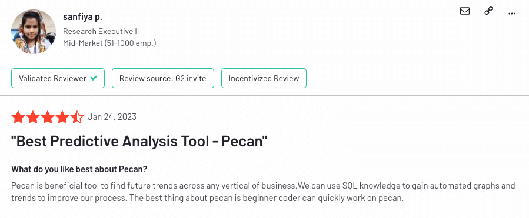
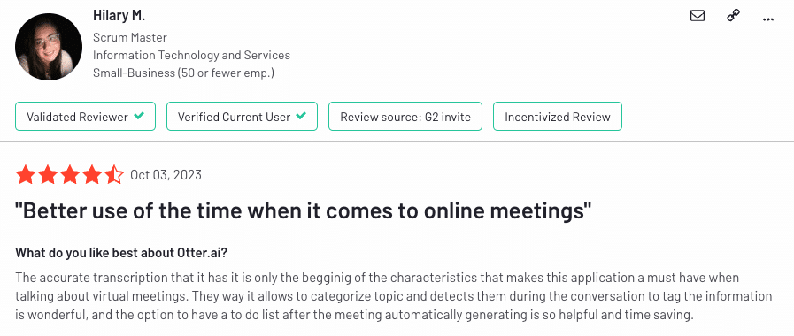

In today’s rapidly evolving business landscape, leveraging cutting-edge AI technology is no longer a luxury but a necessity.

World-famous entrepreneurs like Sundar Pichai and Jeff Bezos have lauded the revolution it will bring – stating that “it has tremendous potential to improve our lives” and “it will transform everything just like electricity did.

Mark Zuckerberg has already adopted the AI revolution in full force, stating that his AI assistant, Jarvis, manages his entire life.

All of this to say, AI tools have emerged as invaluable allies, propelling innovation, streamlining operations, and fostering substantial growth for entrepreneurs and their startups.

I’ve spent the last four years working as a content marketer at Altar.io. In that time, I’ve spent countless hours sitting down with our product and tech teams to learn about the startup ecosystem and what entrepreneurs look for to increase their chances of success.

A lot of the conversations bring up AI and the tools that are pushing the envelope to make our lives better.

More than that, I use AI tools daily to help make my research and writing processes more efficient.

Through those conversations and the time I’ve spent using AI tools, it’s become clear certain offerings stand out for their ability to significantly amplify a startup's capabilities.

In this article, I’ll delve into eight AI tools that are not only pioneering in their respective domains but are also tailored to meet the distinctive needs of entrepreneurs and startups in 2023. Ranging from content creation and code generation to real-time transcription and video production, these tools are designed to ease the entrepreneurial journey and propel startups towards achieving their vision.

/\* widget: Blog: Expert Tip \*/  /\* reset -------------------- \*/  .blog-custom-block \*,  .blog-custom-block ::before,  .blog-custom-block ::after {  box-sizing: border-box;  border-width: 0;  border-style: solid;  border-color: #e5e7eb;  }  /\* vars -------------------- \*/  .blog-custom-block.blog-custom-block\_\_expert-tip {  --color-bg: #F4FAFE;  --color-border: rgb(15 164 234 / 0.50);  --color-text-1: #0F172A;  --color-text-2: #4A4A68;  }  /\* colors -------------------- \*/  .blog-custom-block.blog-custom-block\_\_expert-tip .bg-clr-bg {  background-color: var(--color-bg);  }  .blog-custom-block.blog-custom-block\_\_expert-tip .border-clr-border {  border-color: var(--color-border);  }  .blog-custom-block.blog-custom-block\_\_expert-tip .text-clr-text-1 {  color: var(--color-text-1);  }  .blog-custom-block.blog-custom-block\_\_expert-tip .text-clr-text-2 {  color: var(--color-text-2);  }  /\* utils -------------------- \*/  .blog-custom-block.blog-custom-block\_\_expert-tip .flex {  display: flex;  }  .blog-custom-block.blog-custom-block\_\_expert-tip .flex-shrink-0 {  flex-shrink: 0;  }  .blog-custom-block.blog-custom-block\_\_expert-tip .flex-col {  flex-direction: column;  }  .blog-custom-block.blog-custom-block\_\_expert-tip .gap-4 {  gap: 1rem;  }  .blog-custom-block.blog-custom-block\_\_expert-tip .gap-5 {  gap: 1.25rem;  }  .blog-custom-block.blog-custom-block\_\_expert-tip .rounded-xl {  border-radius: 0.75rem;  }  .blog-custom-block.blog-custom-block\_\_expert-tip .border {  border-width: 1px;  }  .blog-custom-block.blog-custom-block\_\_expert-tip .p-8 {  padding: 2rem;  }  .blog-custom-block.blog-custom-block\_\_expert-tip .text-3xl {  font-size: 1.875rem;  line-height: 2.25rem;  }  .blog-custom-block.blog-custom-block\_\_expert-tip .text-lg {  font-size: 1.125rem;  line-height: 1.75rem;  }  .blog-custom-block.blog-custom-block\_\_expert-tip .font-bold {  font-weight: 700;  } 

In the interest of full transparency...

The following tools are based on my recommendations and those of my team and our extended entrepreneurial community. Neither myself nor Altar.io receives any affiliate profits from listing the AI tools mentioned below.

.elementor-12941 .elementor-element.elementor-element-e56f4e6{--display:flex;--flex-direction:column;--container-widget-width:100%;--container-widget-height:initial;--container-widget-flex-grow:0;--container-widget-align-self:initial;--background-transition:0.3s;}.elementor-12941 .elementor-element.elementor-element-f8d1905{--box-background-color:var( --e-global-color-f6f9b04 );--box-border-color:var( --e-global-color-secondary );--box-border-width:1px;--box-border-radius:12px;--box-padding:12px;--header-color:var( --e-global-color-text );--separator-width:0px;--item-text-decoration:underline;--item-text-hover-decoration:underline;--marker-color:var( --e-global-color-primary );--marker-size:5px;}.elementor-12941 .elementor-element.elementor-element-f8d1905 .elementor-toc\_\_spinner{color:var( --e-global-color-secondary );fill:var( --e-global-color-secondary );}.elementor-12941 .elementor-element.elementor-element-f8d1905 .elementor-toc\_\_header, .elementor-12941 .elementor-element.elementor-element-f8d1905 .elementor-toc\_\_header-title{font-family:"Poppins", sans-serif;font-size:2.25rem;font-weight:700;text-transform:capitalize;line-height:1.2;}.elementor-12941 .elementor-element.elementor-element-f8d1905 .elementor-toc\_\_list-item{font-family:var( --e-global-typography-45f602c-font-family ), sans-serif;font-size:var( --e-global-typography-45f602c-font-size );font-weight:var( --e-global-typography-45f602c-font-weight );line-height:var( --e-global-typography-45f602c-line-height );letter-spacing:var( --e-global-typography-45f602c-letter-spacing );word-spacing:var( --e-global-typography-45f602c-word-spacing );}.elementor-12941 .elementor-element.elementor-element-f8d1905 > .elementor-widget-container{padding:32px 32px 32px 32px;}@media(max-width:1024px){.elementor-12941 .elementor-element.elementor-element-f8d1905 .elementor-toc\_\_list-item{font-size:var( --e-global-typography-45f602c-font-size );line-height:var( --e-global-typography-45f602c-line-height );letter-spacing:var( --e-global-typography-45f602c-letter-spacing );word-spacing:var( --e-global-typography-45f602c-word-spacing );}}@media(max-width:767px){.elementor-12941 .elementor-element.elementor-element-f8d1905 .elementor-toc\_\_list-item{font-size:var( --e-global-typography-45f602c-font-size );line-height:var( --e-global-typography-45f602c-line-height );letter-spacing:var( --e-global-typography-45f602c-letter-spacing );word-spacing:var( --e-global-typography-45f602c-word-spacing );}} /\*! elementor-pro - v3.19.0 - 05-02-2024 \*/  .elementor-widget-table-of-contents .elementor-toc\_\_header-title{color:var(--header-color)}.elementor-widget-table-of-contents.elementor-toc--collapsed .elementor-toc\_\_toggle-button--collapse,.elementor-widget-table-of-contents:not(.elementor-toc--collapsed) .elementor-toc\_\_toggle-button--expand{display:none}.elementor-widget-table-of-contents .elementor-widget-container{min-height:var(--box-min-height);border:var(--box-border-width,1px) solid var(--box-border-color,#9da5ae);border-radius:var(--box-border-radius,3px);background-color:var(--box-background-color);transition:min-height .4s;overflow:hidden}.elementor-toc\_\_header{display:flex;align-items:center;justify-content:space-between;padding:var(--box-padding,20px);background-color:var(--header-background-color);border-bottom:var(--separator-width,1px) solid var(--box-border-color,#9da5ae)}.elementor-toc\_\_header-title{font-size:18px;margin:0;color:var(--header-color)}.elementor-toc\_\_toggle-button{cursor:pointer;display:inline-flex}.elementor-toc\_\_toggle-button i{color:var(--toggle-button-color)}.elementor-toc\_\_toggle-button svg{height:1em;width:1em;fill:var(--toggle-button-color)}.elementor-toc\_\_spinner-container{text-align:center}.elementor-toc\_\_spinner{font-size:2em}.elementor-toc\_\_spinner.e-font-icon-svg{height:1em;width:1em}.elementor-toc\_\_body{padding:var(--box-padding,20px);max-height:var(--toc-body-max-height);overflow-y:auto}.elementor-toc\_\_body::-webkit-scrollbar{width:7px}.elementor-toc\_\_body::-webkit-scrollbar-thumb{background-color:#babfc5;border-radius:10px}.elementor-toc\_\_list-wrapper{list-style:none;padding:0}.elementor-toc\_\_list-item{margin-bottom:.5em}.elementor-toc\_\_list-item.elementor-item-active{font-weight:700}.elementor-toc\_\_list-item .elementor-toc\_\_list-wrapper{margin-top:.5em;margin-left:var(--nested-list-indent,1em)}.elementor-toc\_\_list-item-text:hover{color:var(--item-text-hover-color);-webkit-text-decoration:var(--item-text-hover-decoration);text-decoration:var(--item-text-hover-decoration)}.elementor-toc\_\_list-item-text.elementor-item-active{color:var(--item-text-active-color);-webkit-text-decoration:var(--item-text-active-decoration);text-decoration:var(--item-text-active-decoration)}.elementor-toc\_\_list-item-text-wrapper{display:flex;align-items:center}.elementor-toc\_\_list-item-text-wrapper:before,.elementor-toc\_\_list-item-text-wrapper i{margin-right:8px;color:var(--marker-color)}.elementor-toc\_\_list-item-text-wrapper svg{margin-right:8px;fill:var(--marker-color);height:var(--marker-size,.5em);width:var(--marker-size,.5em)}.elementor-toc\_\_list-item-text-wrapper i{font-size:var(--marker-size,.5em)}.elementor-toc\_\_list-item-text-wrapper:before{font-size:var(--marker-size,1em)}.elementor-toc--content-ellipsis .elementor-toc\_\_list-item-text{white-space:nowrap;overflow:hidden;text-overflow:ellipsis}.elementor-toc\_\_list-items--collapsible>.elementor-toc\_\_list-wrapper>.elementor-toc\_\_list-item>.elementor-toc\_\_list-wrapper{display:none}.elementor-toc\_\_heading-anchor{position:absolute}.elementor-toc\_\_body .elementor-toc\_\_list-item-text{color:var(--item-text-color);-webkit-text-decoration:var(--item-text-decoration);text-decoration:var(--item-text-decoration)}.elementor-toc\_\_body .elementor-toc\_\_list-item-text:hover{color:var(--item-text-hover-color);-webkit-text-decoration:var(--item-text-hover-decoration);text-decoration:var(--item-text-hover-decoration)}.elementor-toc\_\_body .elementor-toc\_\_list-item-text.elementor-item-active{color:var(--item-text-active-color);-webkit-text-decoration:var(--item-text-active-decoration);text-decoration:var(--item-text-active-decoration)}ol.elementor-toc\_\_list-wrapper{counter-reset:item}ol.elementor-toc\_\_list-wrapper .elementor-toc\_\_list-item{counter-increment:item}ol.elementor-toc\_\_list-wrapper .elementor-toc\_\_list-item-text-wrapper:before{content:counters(item,".") ". "}

#### Contents

## 1. [ChatGPT](https://chat.openai.com/auth/login)

OpenAI’s ChatGPT is a conversational AI that's been a game changer in customer support and engagement.

This is by far the most famous AI tool and one I use daily for everything from research and summarising meeting transcripts to structuring and writing content.

Here’s a full rundown of how ChatGPT can help you enhance your startup's operations.

### ChatGPT Features & Benefits

#### Customer Support Automation

ChatGPT excels in handling first-tier customer support queries.

By integrating it into your customer support pipeline, you can ensure that common questions are addressed promptly.

This not only enhances customer satisfaction but also allows your human support staff to focus on more complex, higher-level issues.

#### Content Generation

ChatGPT is adept at drafting coherent and engaging content, making it a handy tool for content marketers.

It can help in creating blog posts, newsletters, or even social media posts. This can be particularly beneficial for lean startups, as it saves time and allows for a consistent content output, which is crucial for brand visibility and SEO.

#### Email Drafting

Efficiency in communication is pivotal in maintaining good relations with stakeholders.

ChatGPT can assist in drafting professional emails, saving valuable time, and ensuring clear, concise communication.

#### Idea Generation and Brainstorming

You can also use ChatGPT as a brainstorming partner to generate ideas or solutions to problems. Its ability to provide diverse perspectives based on the data it's trained on can lead to innovative solutions.

#### Code Snippet Generation

For tech startups, ChatGPT’s ability to generate code snippets based on natural language queries is invaluable. It can aid in speeding up the development process, allowing for quicker iterations and faster time to market.

#### Learning and Development

It can also serve as a resource for learning and development. By querying ChatGPT, team members can gain insights or learn new information related to their field, which is crucial in the fast-evolving startup ecosystem.

#### Cost Efficiency

Implementing ChatGPT is a cost-effective measure. The automation it brings to various operational aspects of a startup reduces the need for additional resources, which is vital for maintaining a lean operation.

#### Data-driven Insights

ChatGPT can process and provide insights from data, aiding in informed decision-making which is crucial for steering the startup in the right direction.

#### Integration Capabilities

Its ability to integrate with various platforms and tools makes it a flexible solution adaptable to different operational needs.

#### Scalability

As the startup grows, the demands on the customer support and content generation front will grow too. ChatGPT is scalable and can handle increasing volumes of queries and content needs without a proportional increase in operational costs.

#### Customisation

With fine-tuning capabilities, such as “custom instructions” you can customise ChatGPT to better align with your brand voice and specific operational needs.

### ChatGPT Limitations

#### Understanding and Context

ChatGPT sometimes lacks a deep understanding of the context or the content it generates. It can provide responses based on patterns in the data it was trained on, but it doesn't understand the information in the way humans do.

#### Long Conversations

It might struggle with maintaining context in long or complex conversations. The longer the dialogue, the more challenging it can be for ChatGPT to provide accurate and contextually relevant responses.

#### Specific or Updated Information

Since its knowledge is based on pre-existing data up to a certain point, it may not have information on recent developments or very specific niche topics.

#### Misinformation and Bias

ChatGPT can inadvertently generate misinformation or reflect biases present in the training data. It's essential to verify the information it provides, especially on sensitive or critical topics.

#### Over-verbosity

It can sometimes be overly verbose or provide more information than needed, which might not always be ideal, especially in a customer service setting where concise responses are often preferred.

#### Customisation

While there's some level of customisation possible, fine-tuning ChatGPT to meet specific needs or to align perfectly with a brand’s voice and guidelines can be a challenge.

#### Error Handling

It might not always handle errors or misunderstandings gracefully, which could potentially lead to confusion or frustration for users.

#### Dependency on Training Data

The quality and relevance of responses heavily depend on the quality and breadth of the training data. If a topic is not well-represented in the training data, the responses may lack accuracy or relevance.

#### Privacy Concerns

Since ChatGPT can process text inputs, there's a need to ensure that sensitive information is handled securely, adhering to privacy laws and regulations.

#### Real-time Performance

Depending on the implementation, there might be challenges with real-time performance, especially as the complexity and volume of queries increase.

### ChatGPT Pricing

ChatGPT offers a free plan which gives you access to the basic features set.

For $20/month you can upgrade to the “Plus” plan, which gives you access to more features such as web browsing and plugins, as well as a more intelligent language model.

### ChatGPT Ratings and Reviews

[**G2**](https://www.g2.com/products/chatgpt/reviews)**:** 4.7/5 (386 reviews) [**Capterra**](https://www.capterra.com/p/10009334/ChatGPT/)**:** 4.5/5 (27 reviews)

/\*! elementor - v3.19.0 - 05-02-2024 \*/  .elementor-widget-image{text-align:center}.elementor-widget-image a{display:inline-block}.elementor-widget-image a img\[src$=".svg"\]{width:48px}.elementor-widget-image img{vertical-align:middle;display:inline-block}

 

Related: [How OpenAI Found Success by Being Product Driven (And How You Can Too)](https://altar.io/how-openai-found-success-by-being-product-driven-and-how-you-can-too/)

## 2. [Notion AI](https://www.notion.so/)

Notion has added an AI tool to its platform. It harnesses the power of generative artificial intelligence to transform the way we handle information, document ideas, and manage tasks.

Designed to enhance productivity, it automates routine tasks, refines documentation, and even assists in content generation, all while being accessible for a monthly fee.

### Notion AI Features & Benefits

#### Enhanced Productivity

Notion AI serves as your digital assistant, taking on the time-consuming tasks that often bog down your workflow. By automating routine tasks such as summarizing texts and generating content outlines, it frees up your schedule, allowing you to concentrate on strategic thinking and innovation.

#### Streamlined Documentation

Crafting notes and documentation can be a breeze with Notion AI. It provides tools to generate, edit, and refine written materials efficiently, ensuring your documents are not only comprehensive but also well-organized and easy to understand.

#### Smart Editing

With the smart editing feature, Notion AI becomes a second pair of eyes, reviewing your text for grammatical errors, spelling mistakes, and even tone inconsistencies. It's like having a personal editor at your fingertips to polish and perfect your writing.

#### Cross-Language Communication

Notion AI breaks down language barriers by providing translation services within your documents. This feature is invaluable for global teams and entrepreneurs looking to engage with international markets.

#### Content Generation

For those looking to create compelling content, Notion AI can jumpstart the process by generating blog post outlines and email drafts. This not only speeds up content creation but also helps overcome writer's block by providing a solid starting point.

#### Actionable Insights from Meetings

Turning meeting notes into action items can often be a tedious task. Notion AI simplifies this by summarizing lengthy discussions and highlighting key points and actions, ensuring that valuable insights lead to tangible outcomes.

### Notion AI Limitations

#### Learning Curve

For those unfamiliar with AI-assisted software, there can be a learning curve in understanding how to effectively utilise Notion AI’s features. It might take time for users to learn the best practices for interacting with the AI to get the most out of its capabilities.

#### Privacy Concerns

As with any AI that processes user data, there are privacy implications to consider. Users may have concerns about sensitive data being processed by AI and how securely this data is handled by the platform.

#### Limited Creative Control

While Notion AI can aid in generating content, it may not always match the unique creative voice or specific style preferences of the user. This can sometimes lead to outputs that feel generic or lack a personalized touch.

#### AI's Interpretative Limitations

AI systems, including Notion AI, may struggle with complex interpretations, especially when dealing with nuanced or specialized topics. This means that for certain tasks, human oversight is still necessary to ensure accuracy and context-appropriateness.

### Notion AI Pricing

is available as an add-on for users of Notion's various plans, including those on the Free Plan. The standard price for adding Notion AI is $10 per member, per month, which grants access to all AI features within Notion.

For customers who opt for annual billing and are subscribed to the Plus, Business, or Enterprise plans, there's a 20% discount available for the AI add-on.

### Notion AI Ratings & Reviews

[**G2**](https://www.g2.com/products/notion/reviews)**:** 4.7/5 (4,832 reviews) [**Capterra**](https://www.capterra.com/p/186596/Notion/)**:** 4.7/5 (1,921 reviews)

**Note:** The above reviews are for the notion platform as a whole. That said, many of the reviews mention the platform's AI capabilities – as seen in the image below.

## 3. [DALL·E2](https://openai.com/dall-e-2)

The second AI tool on the list by OpenAI, DALL·E2 builds on the prowess of its predecessor, DALL·E, and is making waves in the realm of image generation.

Startups in the creative or digital marketing space can leverage DALL·E2 to generate unique visuals for campaigns or product designs, drastically cutting down design time and costs.

For example, the featured image at the top of this article was created by Dall·E 2!

Here’s a deeper look into Dall·E2 and how this AI tool can benefit your startup.

### DALL·E2 Features & Benefits

#### Creative Asset Generation

DALL·E2 shines in generating unique, high-quality visuals. Whether it's for social media campaigns, advertising, or product designs, having the ability to quickly produce visual content is a substantial advantage for startups. This can particularly benefit lean startups where human resources are limited.

#### Cost Efficiency

Traditionally, creating bespoke visuals might require hiring a designer or purchasing stock images, both of which can be costly. DALL·E2 slashes these costs by automating the design process, freeing up funds for other crucial areas of the business.

#### Speed and Scalability

The speed at which DALL·E2 can generate visuals is a game changer, especially in the fast-paced world of digital marketing where timely campaigns are key. As your startup scales, DALL·E2 scales with you, meeting increasing design demands without skipping a beat.

#### Customisation and Branding

With DALL·E2, startups can create visuals that align with their brand aesthetics. This level of customisation ensures a consistent brand image across all platforms, which is pivotal for brand recognition and trust.

#### Prototype and Product Design

For product-based startups, DALL·E2 can be employed in the prototype design phase. It helps in visualising product designs before they are manufactured, saving time and resources in iterations.

#### Augmented Design Capabilities

DALL·E2 can work alongside human designers to augment their capabilities. It can provide a base design which can then be refined, enabling a collaborative effort that maximises creativity and efficiency.

#### AI-Driven Insights

By analysing trends and data, DALL·E2 can suggest or create visuals that resonate with the target audience. This data-driven approach can enhance engagement and conversion rates.

#### Iterative Learning and Improvement

The more it's used, the better it gets. DALL·E2 learns from feedback to improve the relevance and quality of the visuals it generates, ensuring a continuous improvement in the output.

#### Competitive Edge

In a crowded market, having visually compelling, unique assets can set a startup apart from the competition. DALL·E2 provides that competitive edge by enabling the creation of standout visuals.

#### Integration Capabilities

The ability to integrate DALL·E2 with other tools and platforms means it can seamlessly fit into a startup’s existing workflow, aiding in a holistic and streamlined operation.

#### Resource Allocation

By automating the graphic design process, DALL·E2 allows startups to allocate their human resources to more strategic, higher-level tasks, fostering a more effective and innovative work environment.

### DALL·E2 Limitations

#### Creative Depth

While DALL·E2 can generate images based on prompts, it lacks the creative intuition and depth a human designer brings to the table. It might not fully grasp abstract or nuanced concepts.

#### Originality and Uniqueness

The originality and uniqueness of the images generated could be a concern, especially in fields where brand uniqueness is crucial. There could be similar imagery generated for different users based on similar prompts.

#### Understanding of Real-World Physics

DALL·E2 might generate images that defy real-world physics or common sense, which could be problematic, especially in realistic visualizations.

#### Control and Precision

Achieving a high level of control and precision in the generated imagery might be challenging. The images generated may not always align with the specific vision or standards of a project.

#### Data Dependency

The quality and relevance of the generated images heavily depend on the quality and diversity of the training data. It may struggle with topics or styles that are underrepresented in its training data.

#### Training and Tuning

Fine-tuning DALL·E2 to meet specific needs or to align with certain guidelines can be technically challenging and may require a good amount of time and resources.

#### Realism

Achieving a high level of realism in generated images, especially when detailed and accurate visualizations are required, might be a limitation.

#### Content Sensitivity and Ethics

There's potential for generating inappropriate or offensive content, or content that violates copyright laws, which necessitates careful monitoring and control.

#### Privacy Concerns

When generating images based on user data or prompts, privacy concerns arise, and it's essential to have robust measures in place to ensure data privacy and compliance with regulations.

#### Integration and Compatibility

Integrating DALL-E2 into existing workflows and ensuring compatibility with other tools and systems might present challenges.

#### Resource Intensiveness

DALL·E2, like many AI tools, can be resource-intensive, requiring substantial computational resources for training and generation, which could impact its scalability and cost-efficiency.

### DALL·E2 Pricing

DALL·E2 works on a “credits” system in which one credit can be used to generate four images based on one text prompt.

Currently, you can buy a pack of 115 credits for $15.

### DALL·E2 Ratings & Reviews

[**G2**](https://www.g2.com/products/dall-e-2/reviews)**:** 4/5 (27 reviews) [**Capterra**](https://www.capterra.com/p/10009399/DALL-E-2/)**:** 4.7/5 (8 reviews)

 

/\*! elementor - v3.19.0 - 05-02-2024 \*/  .elementor-heading-title{padding:0;margin:0;line-height:1}.elementor-widget-heading .elementor-heading-title\[class\*=elementor-size-\]>a{color:inherit;font-size:inherit;line-height:inherit}.elementor-widget-heading .elementor-heading-title.elementor-size-small{font-size:15px}.elementor-widget-heading .elementor-heading-title.elementor-size-medium{font-size:19px}.elementor-widget-heading .elementor-heading-title.elementor-size-large{font-size:29px}.elementor-widget-heading .elementor-heading-title.elementor-size-xl{font-size:39px}.elementor-widget-heading .elementor-heading-title.elementor-size-xxl{font-size:59px}

##### Do you have a brilliant idea that you want to bring to life?

/\*! elementor - v3.19.0 - 05-02-2024 \*/  .elementor-widget-text-editor.elementor-drop-cap-view-stacked .elementor-drop-cap{background-color:#69727d;color:#fff}.elementor-widget-text-editor.elementor-drop-cap-view-framed .elementor-drop-cap{color:#69727d;border:3px solid;background-color:transparent}.elementor-widget-text-editor:not(.elementor-drop-cap-view-default) .elementor-drop-cap{margin-top:8px}.elementor-widget-text-editor:not(.elementor-drop-cap-view-default) .elementor-drop-cap-letter{width:1em;height:1em}.elementor-widget-text-editor .elementor-drop-cap{float:left;text-align:center;line-height:1;font-size:50px}.elementor-widget-text-editor .elementor-drop-cap-letter{display:inline-block}

From the product and business reasoning to streamlining your MVP to the most important features, our team of product experts and ex-startup founders can help you bring your vision to life.

Let's Talk

## 4. [Jasper.ai](https://www.jasper.ai/)

Jasper.ai is another gem of an AI tool for content creation. Whether it's crafting engaging blog posts or creating compelling copy for marketing collateral, Jasper.ai accelerates the content generation process while ensuring a high level of creativity and relevance.

This was, in fact, the first AI tool I used to assist me with content writing. It greatly sped up my writing process at the draft stages and is very good for generating ideas and structuring content.

Like many AI tools, where it falls down at this stage is its ability to write like a specific person. It is unable to encapsulate someone's tone - at least in its current iteration.

### Jasper.ai Features & Benefits

#### Automated Content Creation

Jasper.ai significantly accelerates the process of content generation. It can draft engaging blog posts, emails, and marketing collateral, reducing the time and effort traditionally required for these tasks. This automation is a boon for lean startups looking to optimise their operations.

#### Cost Efficiency

By automating much of the content creation process, Jasper.ai helps in reducing the costs associated with hiring additional writers or outsourcing content creation. This cost efficiency is critical for startups operating within tight budget constraints.

#### Quality and Creativity

Despite being automated, the quality of the content generated is impressive. Jasper.ai can produce creative and compelling copy that resonates with the target audience, which is crucial for brand positioning and engagement.

#### SEO Optimisation

Jasper.ai has features that help in optimising the content for SEO, which is crucial for online visibility and traffic. Well-optimised content can significantly enhance a startup’s digital presence, leading to better engagement and conversions.

#### Data-Driven Insights

It can provide data-driven insights to improve content strategy. By analysing performance metrics and suggesting improvements, Jasper.ai aids in refining the content strategy for better engagement and results.

#### Customisation and Branding

Customising the tone, style, and other elements to align with a brand’s identity is possible with Jasper.ai. This level of customisation ensures that the content generated is coherent with the brand's voice and messaging.

#### Scaling Content Production

As the content needs of a startup grow, Jasper.ai can scale to meet the increasing demand. This scalability ensures a consistent content output regardless of the volume of content needed.

#### Content Varieties

It's capable of generating a variety of content types including blog posts, social media posts, ad copy, email campaigns, and more. This versatility makes it a one-stop solution for multiple content creation needs.

#### Collaboration

Teams can collaborate on the platform, making it easier to manage content projects. This feature fosters a collaborative environment, enhancing productivity and creativity.

#### Analytics and Performance Tracking

The ability to track the performance of the content generated and gain insights into audience engagement is invaluable for iterating and improving content strategies.

#### Learning and Adaptation

Over time, Jasper.ai can learn from feedback and preferences to improve the relevance and quality of the content it generates, ensuring a continuous improvement in output.

#### Integration Capabilities

Its ability to integrate with various tools and platforms makes it a flexible solution adaptable to different operational needs.

### Jasper.ai Limitations

#### Depth of Understanding

Like other AI tools, Jasper.ai lacks a deep understanding of the topics it's writing about. It generates text based on patterns it learned during training, not on a comprehension of the subject matter.

#### Context Maintenance

It might struggle with maintaining context in longer pieces of content or complex discussions, which could lead to less coherent or accurate information as the text progresses.

#### Specific and Updated Information

Jasper.ai's ability to provide updated or very specific information might be limited by when and what data it was trained on.

#### Misinformation and Bias

There’s a risk of propagating misinformation or bias present in the training data. This could potentially mislead readers or portray a skewed perspective.

#### Creative Originality

While Jasper.ai can generate creative text, it may not match the level of originality and nuance that a human writer with expertise in a particular field could provide.

#### Brand Voice Consistency

Ensuring the consistency of a specific brand voice over a wide range of content can be challenging. It will require a human touch to align the generated content perfectly with the brand’s tone and style.

#### Error Handling

Handling errors or misunderstandings in a graceful or intuitive way can be a challenge. This could lead to less satisfactory user experiences.

#### Over-Generality

There may be instances where the content generated is too general or lacks the specificity required to address certain topics thoroughly.

#### Revision and Editing

The content generated may require revisions or edits by human writers to meet high-quality standards or to ensure accuracy and relevance.

#### Privacy Concerns

If the tool processes sensitive information for content creation, there could be privacy concerns that need to be addressed to ensure compliance with data protection laws.

#### Dependency on Training Data

The quality of output is heavily dependent on the quality and extent of the training data. This could limit its effectiveness in generating high-quality content on less common or niche topics.

### Jasper.ai Pricing

Jasper.ai offers two pricing plans depending on your needs.

The first, Creator, is $49 and allows for one user.

The second, Teams, allows for up to three users at the same time.

### Jasper.ai Ratings & Reviews

[**G2**](https://www.g2.com/products/jasper-ai/reviews)**:** 4.7/5 (1,234 reviews) [**Capterra**](https://www.capterra.com/p/217242/Jasper/)**:** 4.8/5 (1,818 reviews)

## 5. [Lumen5](https://lumen5.com/)

Video marketing is crucial for brand engagement, and Lumen5 stands out as a tool that automates video creation. It’s an ideal solution for startups looking to create impactful video content without the heavy lifting traditionally associated with video production.

### Lumen5 Features & Benefits

#### Ease of Use

Lumen5 offers an intuitive, user-friendly interface that requires little to no prior video editing experience. This is particularly beneficial for startups with limited resources, enabling them to create professional-looking videos with ease.

#### Automated Video Creation

By leveraging AI, Lumen5 automates much of the video creation process. Users simply provide a script or a link to a blog post, and the platform can generate a video draft in minutes. This automation significantly accelerates the video production process.

#### Cost-Effectiveness

Video production usually requires a significant investment in terms of both time and money. Lumen5, by simplifying and automating this process, makes video marketing more accessible for startups operating on tighter budgets.

#### Customisation

Although automated, Lumen5 provides a range of customisation options. Users can modify text, choose images and videos from a rich media library or upload their own, change the music, and much more to align the video with their brand's identity.

#### Media Library

Lumen5 boasts a comprehensive media library with millions of royalty-free images, videos, and music tracks. This vast resource helps in creating visually appealing and engaging video content.

#### Brand Presets

Users can save brand presets including logos, colour schemes, and fonts, ensuring consistency across all videos and reinforcing brand recognition.

#### Text-to-Video

Its text-to-video feature allows for quick conversion of blog posts or scripts into engaging video content, expanding how a startup can repurpose its existing content.

#### Templates

Lumen5 offers a variety of templates catering to different video formats and platforms, which simplifies the creation of videos for multiple social media channels.

#### Performance Analytics

The platform provides analytics to track the performance of videos, enabling startups to measure engagement and ROI and refine their video marketing strategies accordingly.

#### Collaboration

Lumen5 facilitates collaboration among team members, allowing for a collective effort in video creation and editing which is crucial for maintaining a cohesive brand narrative.

#### Educational Resources

There are also educational resources available within the platform to help users make the most out of Lumen5 and improve their video marketing skills.

#### Integration

Lumen5 can integrate with various content management systems and social media platforms, streamlining the publishing process and making it easier to share videos across different channels.

#### AI-Driven Storyboarding

The AI-driven storyboard feature helps in structuring the video, ensuring a coherent flow of information and a compelling narrative.

### Lumen5 Limitations

#### Limited Editing Features

Lumen5 may not offer the depth of customisation or advanced editing features that some other video editing software provides, which could be a hurdle for users looking for more sophisticated editing tools.

#### Learning Curve

Some users find Lumen5 to be non-user-friendly and difficult to use initially, indicating a learning curve that could potentially slow down the video creation process, especially for those unfamiliar with video editing software.

#### Automated Content Relevance

The automated selection of photos and videos to accompany the text may not always relate well to the content, and often, there might be limited resources available to use with the text for the videos.

#### Resolution Limitations

The videos generated are limited to a resolution of 720P, which might not meet the needs of users requiring higher-resolution content.

#### Video Length Limitation

Lumen5 videos are restricted to a maximum length of 10 minutes, which could be a limiting factor for creating longer-form content.

#### Cloud-Based Operation

Being a cloud-based platform, Lumen5 requires a reliable internet connection to function, which could pose challenges in situations where internet connectivity is unstable.

### Lumen5 Pricing

Lumen5 offers several plans based on your needs.

The first is a free subscription that allows for the creation of 5 videos per month.

The Paid Monthly Subscriptions are broken down as follows:

- Starter Plan: Priced at $29 per month.
- Premium Plan: Priced at $79 per month.
- Business Plan: Priced at $199 per month.

The AI tool also offers Annual Subscriptions at a discounted price. For instance, the Starter plan comes down to $19 per month when billed annually (which equates to $228 per year).

### Lumen5 Ratings & Reviews

[**G2**](https://www.g2.com/products/lumen5/reviews)**:** 4.5 (65 reviews) [**Capterra**](https://www.capterra.com/p/167719/Lumen5/)**:** 4.6 (136 reviews)

## 6. [Pecan AI](https://www.pecan.ai/)

Pecan AI is a cutting-edge predictive analytics platform that simplifies complex data processes, offering rapid predictive insights.

Recognised for its excellence in marketing analytics, Pecan AI is transforming how businesses leverage data.

### Pecan AI Features & Benefits

#### Simplified Predictive Analytics

Pecan AI stands out in the predictive analytics space by offering a low-code platform that significantly simplifies the predictive modelling process. Businesses can automatically prepare and process raw, unstructured data for AI models, making it possible to use machine learning algorithms without the technical barriers often involved. This feature democratizes access to advanced analytics, allowing companies to harness the power of AI without needing specialized data science expertise.

#### Speed and Efficiency

With Pecan AI, the wait times traditionally associated with predictive analytics are drastically reduced. Predictive models are built, tested, and deployed at a remarkable speed — predictions that used to take months can now be produced in a matter of days. This rapid turnaround is not just a one-time benefit; the platform provides regularly updated predictions based on fresh data, ensuring that businesses can react quickly to changing circumstances.

#### Award-Winning Marketing Analytics

Recognition by the 2023 Digiday Technology Awards as the Best Marketing Analytics Platform underscores Pecan AI's effectiveness in the marketing domain. The platform's ability to select the best-performing model and refine it for deployment allows marketers to optimise campaigns with precision and confidence.

#### Meta Business Partnership

The accolade of being a Meta Business Partner for Measurement reflects Pecan AI's deep expertise in supporting Meta advertisers. This partnership highlights the platform's specific competencies in leveraging machine learning to reinvent marketing mix modeling — a critical aspect of modern digital marketing.

#### AI-Automated Data Science

Pecan AI employs advanced AI and machine learning techniques to automate various aspects of the analytics process. This automation extends beyond data preparation to feature engineering and model evaluation, ensuring that the insights and predictions generated are both sophisticated and relevant to specific business needs.

#### Actionable Insights

By focusing on the metrics that matter most to a business, Pecan AI ensures that the predictive models it creates are not just technically sound but also commercially actionable. The insights provided enable businesses to make data-driven decisions swiftly, which is crucial in today's fast-paced market environment.

### Pecan AI Limitations

#### Data Quality Dependency

While Pecan AI can handle raw and unstructured data, the quality of the predictions is still highly dependent on the quality of the input data. Garbage in, garbage out remains a principle in data science; if the input data is flawed or biased, the outputs from the predictive models will likely be compromised.

#### Model Transparency

Low-code platforms often abstract complex processes to simplify user experience. This can lead to a 'black box' scenario where users have limited visibility into how models make their predictions. For businesses that require a deep understanding of model mechanics for regulatory or compliance reasons, this could be a limitation.

#### Customisation Constraints

Pecan AI is designed to streamline and automate predictive analytics, which may sometimes come at the cost of customisation. Businesses with highly specific predictive modelling needs might find the platform's automated features somewhat restrictive when compared to bespoke data science solutions.

#### Integration and Compatibility

Integrating Pecan AI into existing IT ecosystems may pose challenges, particularly for companies with legacy systems or those using specialized software. The degree to which Pecan can seamlessly connect with other tools and platforms could be a limiting factor for some businesses.

#### Cost and ROI Considerations

While Pecan AI reduces the need for data scientists, the platform itself comes at a cost. Businesses must evaluate the return on investment (ROI) and consider whether the benefits of rapid predictive analytics will outweigh the subscription or service fees associated with using the platform.

#### Broad Focus Versus Specialised Solutions

Pecan AI aims to serve a broad market, which means it might not offer the level of industry-specific functionality that some specialised predictive analytics tools provide. Companies in niche markets or with highly specialised data analysis needs might find the platform's generalist approach less advantageous.

### Pecan AI Pricing

Pecan AI offers pricing options to cater to diverse user needs, ensuring that businesses of all sizes can harness the power of predictive analytics effectively

- **Starter: $50/month**

- - - Ideal for analysts taking their first steps in predictive analytics.
        - Includes 2 seats for users.
        - Access to training 4 models a month.

- **Professional: $280/month**

- - - Tailored for teams seeking actionable predictions.
        - Offers 5 user seats.
        - Allows training 12 models a month.
        - Includes 4 batches of predictions per month.

- **Enterprise: Custom**

- - Designed for organizations with unique needs.
    - Customized prediction cycles.
    - Tailored trained models to fit specific requirements.
    - Dedicated Customer Success team for personalized assistance.
    - Access to a Pecan Predictive Analytics expert for advanced support.

### Pecan AI Ratings & Reviews

[**G2**](https://www.g2.com/products/pecan/reviews)**:** 4.8/5 (11 reviews) [**Capterra**](https://www.capterra.com/p/199700/Pecan/)**:** 5/5 (1 review)

## 7. [Otter.ai](https://otter.ai/)

Meeting transcriptions and note-taking are made effortless with Otter.ai. This AI tool not only captures discussions accurately but also organises them for easy reference, making follow-ups and action planning a breeze.

### Otter.ai Features & Benefits

#### Real-Time Transcription

Otter.ai shines with its real-time transcription capability, translating speech into text almost instantly. This feature is a culmination of years of refining its speech recognition technology, making it a reliable companion for converting conversations into textual data.

#### Live Meeting and Media Transcription

Otter.ai efficiently transcribes live meetings and media, facilitating better engagement and understanding among participants. This feature is pivotal in professional settings where accurate transcription of discussions is essential.

#### Otter Assistant

The Otter Assistant feature aids in scheduling, joining and capturing conversations from video meetings seamlessly. This feature amplifies the ease of managing digital interactions, saving precious time and ensuring no crucial information is missed.

#### Custom Vocabulary and Name Recognition

Otter.ai’s ability to recognise custom vocabulary and names enhances the accuracy of the transcriptions, making the content more relevant and personalised

#### Outline Summary

This feature provides an outline summary of the discussions, aiding in quick reviews and references. It helps in distilling the key points from conversations without having to go through the entire transcript2.

#### File Synchronisation

File synchronisation ensures that your transcripts are organized and accessible across different devices, making it easier to manage and share content.

#### Mobile App and Chrome Extension

With the Otter Mobile App and Chrome extension, you can extend the functionality of Otter.ai to your mobile devices and web browser, ensuring you can capture and access transcriptions on the go.

#### Collaboration

Otter.ai facilitates collaborative live transcripts where comments and tasks can be incorporated. This is ideal for team settings where collective input and task management are integral for project progression.

#### Automated Summary

During meetings, Otter generates a real-time summary, allowing easy catch-up on missed segments. Post-meeting, a summary is emailed, ensuring that all participants are on the same page with the discussed points.

#### Enhanced Productivity

By streamlining conversations and making them more valuable through transcription and summarisation, Otter.ai significantly enhances productivity, making it a game-changer for individuals and teams alike.

### Otter.ai Limitations

#### Language Support

A notable limitation of Otter.ai is its inability to support languages other than English. This poses a significant hurdle for users who frequently interact or work with audio files in languages other than English. The lack of multilingual support can impede the global usability of Otter.ai, especially in a multilingual and multicultural business landscape.

#### Limited Free Version

For individuals or startups on a shoestring budget, the capped usage of Otter.ai's free version might come off as restrictive. The free version halts further recording after 30 minutes of usage, which could affect those in need of more extensive usage without the financial leeway to upgrade to a paid plan.

#### The Transition between Plans

Transitioning between plans on Otter.ai, especially downgrading from Business to Pro, leads to sub-accounts morphing into separate, standalone accounts. This transition may not be seamless and could potentially cause organizational disruptions, thereby affecting the workflow and account management4.

#### Filler Words

The transcription service of Otter.ai does not filter out filler words like “umm” from the transcriptions. This means users may need to allocate additional time for editing to achieve a polished final transcript, which could be seen as an extra step in the process.

#### Customer Support

The absence of Live Chat support is a limitation for users who prefer real-time assistance. Although Otter.ai compensates for this with thorough documentation for self-service, the lack of immediate human assistance could be a point of contention for users in need of quick resolutions.

### Otter.ai Pricing

Otter.ai has several pricing plans to cater to your specific needs.

#### Basic Plan

For individuals keen on testing the waters with Otter.ai, the Basic plan comes as a cost-effective choice. This plan is free and provides a fundamental set of features including an AI meeting assistant that records, transcribes, captures slides, and generates summaries in real-time. Noteworthy is the inclusion of a feature dubbed Otter AI Chat, allowing live chat interactions with Otter and teammates to get instant answers to meeting queries.

This plan seamlessly integrates with popular virtual meeting platforms such as Zoom, MS Teams, and Google Meet to automatically write and share notes. Users on the Basic plan are allocated 300 monthly transcription minutes with a cap of 30 minutes per conversation, alongside the ability to import and transcribe 3 audio or video files over a lifetime.

#### Pro Plan

Designed to foster better collaboration among small teams, the Pro plan is priced at $16.99 per user per month or $10 per user per month when billed annually. This plan encompasses all features in the Basic plan while introducing additional collaborative features. Users can add teammates to their workspace, utilise shared custom vocabulary, tag speakers, and assign action items to teammates. Advanced search, export, and playback features are also part of the Pro plan, alongside a generous allocation of 1200 monthly transcription minutes with a cap of 90 minutes per conversation. Additionally, users can import and transcribe 10 audio or video files per month.

#### Business Plan

Aiming at elevating productivity for teams, the Business plan is offered at a limited-time price of $35 per user per month, down from the regular price of $40 per user per month, or $20 per user per month when billed annually. This plan builds upon the Pro plan by adding admin features such as usage analytics and prioritised support. A standout feature is the capability to join up to three concurrent virtual meetings to automatically write and share notes, making it a robust choice for larger teams or those with frequent virtual meetings. Users on the Business plan enjoy a whopping 6000 monthly transcription minutes with a cap of 4 hours per conversation, and the liberty to import and transcribe an unlimited number of audio or video files.

### Otter.ai Ratings & Reviews

[**G2**](https://www.g2.com/products/otter-ai/reviews)**:** 4.1/5 (128 reviews) [**Capterra**](https://www.capterra.com/p/202799/Otter/)**:** 4.5/5 (73 reviews)

 

/\*! elementor-pro - v3.19.0 - 05-02-2024 \*/  .elementor-button.elementor-hidden,.elementor-hidden{display:none}.e-form\_\_step{width:100%}.e-form\_\_step:not(.elementor-hidden){display:flex;flex-wrap:wrap}.e-form\_\_buttons{flex-wrap:wrap}.e-form\_\_buttons,.e-form\_\_buttons\_\_wrapper{display:flex}.e-form\_\_indicators{display:flex;justify-content:space-between;align-items:center;flex-wrap:nowrap;font-size:13px;margin-bottom:var(--e-form-steps-indicators-spacing)}.e-form\_\_indicators\_\_indicator{display:flex;flex-direction:column;align-items:center;justify-content:center;flex-basis:0;padding:0 var(--e-form-steps-divider-gap)}.e-form\_\_indicators\_\_indicator\_\_progress{width:100%;position:relative;background-color:var(--e-form-steps-indicator-progress-background-color);border-radius:var(--e-form-steps-indicator-progress-border-radius);overflow:hidden}.e-form

## 8. [Github Copilot](https://github.com/features/copilot)

For tech-centric startups, GitHub Copilot is a boon. It aids developers in writing code faster and with fewer errors, thanks to its AI-powered code suggestions. This accelerates product development cycles, a vital advantage in the highly competitive tech landscape.

### Github Copilot Features & Benefits

#### Enhanced AI Model

GitHub Copilot has undergone improvements with an upgraded AI Codex model, which significantly enhances the quality of code synthesis, delivering more accurate and contextually aware code suggestions. This technical advancement ensures developers receive better results while working on their coding tasks.

#### Autocomplete Capabilities

One of the most praised features of GitHub Copilot is its advanced autocomplete capabilities. It goes beyond simple keyword suggestions to predict entire functions, classes, and even API calls based on the context of your existing code. This feature is highly beneficial for developers aiming to write code more efficiently and with fewer errors.

#### Learning Aid for New Programming Languages

GitHub Copilot serves as a valuable learning aid for developers venturing into new programming languages. By offering code suggestions and examples, it guides users through unfamiliar syntax and libraries, thus accelerating the learning process. This feature is particularly beneficial for developers looking to expand their language repertoire without a steep learning curve.

#### Improved Code Quality

Leveraging AI-generated suggestions, GitHub Copilot aids in enhancing the quality of code by identifying potential errors and offering best-practice solutions. This leads to cleaner, more efficient code, which is crucial for maintaining a high standard of coding and reducing bug occurrences in the development phase.

#### Adaptability and Customisation

GitHub Copilot is praised for its adaptability and customisation according to developers' skill sets. It's capable of offering methods, functions, variables, and even complete code blocks based on the context, making it a highly adaptable tool. Additionally, the ease of integration with different apps further enhances its utility and efficiency in the development process.

#### Assistance in Tackling Bugs

Whether working on bug fixes or learning how to use a new framework, GitHub Copilot provides substantial support. It alleviates the time spent searching through documentation or the web, thus aiding developers in resolving issues more efficiently and focusing on the core development tasks.

#### AI-based Security Vulnerability Filtering

In its business version, GitHub Copilot introduces an AI-based security vulnerability filtering feature. This feature automatically blocks common insecure code suggestions, targeting issues such as hardcoded credentials, SQL injections, and path injections, thereby contributing to the overall security and reliability of the code generated.

### Github Copilot Limitations

#### Code Originality and Licensing

One of the primary concerns revolves around code originality and licensing. GitHub Copilot generates code based on publicly available sources, which may raise questions about code ownership and licensing compliance1. This is a significant concern as it could potentially lead to legal challenges if the generated code infringes on existing licenses or copyrights.

#### Dependency Concerns

There's a risk that developers might become overly dependent on GitHub Copilot, which might limit their creative potential. The convenience of having auto-completed code can lead to a situation where developers might find it hard to work without such assistance, especially when dealing with complex or new tasks.

#### Cost

GitHub Copilot is a paid service, which might be prohibitive for some individuals or small teams. The cost factor could be a barrier to access, especially for developers or startups operating on a tight budget.

#### Risk for Potential Buyers

There could be a risk for potential buyers if GitHub decides to shift the burden through the license associated with the product. The users of Copilot might derive from others' works without being aware of it due to the nature of how Copilot generates code, creating a risk that's described as immense.

### Github Copilot Pricing

GitHub Copilot offers a two of pricing plans to cater to your needs. Here's a breakdown of the pricing plans for GitHub Copilot:

#### Individual Plans

GitHub Copilot is available to individual developers at a rate of $10 USD per month or $100 USD per year. This pricing plan offers flexibility as individuals can switch between monthly and yearly billing cycles at any point, with the change taking effect from the start of the next billing cycle1. Additionally, GitHub Copilot offers a free trial to new users, along with free access for verified students and maintainers of popular open-source software.

#### Business Plan

For larger teams or corporate users, GitHub Copilot has introduced a Business subscription. This plan is priced at $19 USD per user per month, offering a scalable solution for organizations with multiple developers. The GitHub Copilot for Business plan encompasses all the features provided in the individual single-license Copilot tier, along with added corporate licensing and policy provisions

### Github Copilot Ratings & Reviews

[**G2**](https://www.g2.com/products/github-copilot/reviews)**:** 4.5/5 (125 reviews) [**Capterra**](https://www.capterra.com/p/10011215/Copilot/)**:** 4.6/5 (18 reviews)

## Wrapping Up

Navigating the realm of entrepreneurship demands a blend of innovation, agility, and smart tooling.

The AI tools highlighted in this guide are poised to be the allies you need in your entrepreneurial journey. By leveraging these tools, you can automate mundane tasks, bolster your creative output, and accelerate your startup's growth trajectory.

As the digital landscape continues to evolve, staying abreast of cutting-edge tools and technologies is indispensable for gaining a competitive advantage.

Explore these AI tools to optimise your operations, and propel your startup into a future filled with possibilities.

Good luck and thanks for reading.
