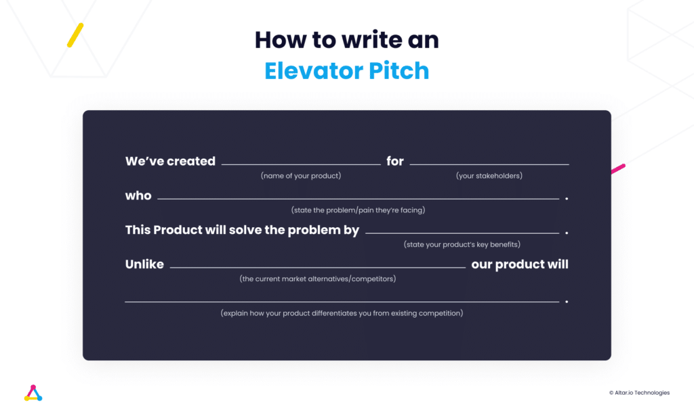

A while back, I read an [article from Sifted](https://email.sifted.eu/the-year-of-rip-posts?ecid=ACsprvufZ322zUznpeA3mvTkjhYaMyGDmaohjI3A3PJ1bp8xOTMzswrfQUemprlEA_OsDjWR1b7j) that talked about LinkedIn posts as indicators of what the next big thing in tech is or where we are in the cycle.

2021, they said, was characterised by exuberant "rocket ship" and "fire" emoji posts heralding the rise of unicorns. In contrast, 2022 was defined by the sombre "crying CEO" meme, reflecting the downturn in the tech market.

In 2023, LinkedIn has witnessed a shift in focus. With many founders and builders hunkering down to weather the storm, the platform has become a stage for AI influencers and founders showcasing their innovative ChatGPT applications.

However, the mood has taken an even more sombre turn in recent weeks, with an increasing number of "RIP" posts announcing the closure of startups. The current landscape is unforgiving, particularly for early-stage ventures setting out to launch a startup MVP.

So if you're about to start something new and want to stand a chance in the current market conditions you better be sure you're building the right product to test the market and prove your assumptions.

Throughout my career as a Product Manager, I've seen amazing projects die because they failed to ask the right questions, and others go on to raise millions simply because they did a better job in this process.

Last year, I joined a team that helped over 90 founders build their startup MVPs, with most of them, like [Fave](https://faveforfans.com/) or [Apiax](https://www.apiax.com/), going on to raise millions and conquer their markets.

Today, based on that experience, I'm sharing a blueprint you can follow to reduce the odds of failing to the minimum possible - a framework from product definition I hope becomes the standard for startup MVP building very soon.

.elementor-12941 .elementor-element.elementor-element-e56f4e6{--display:flex;--flex-direction:column;--container-widget-width:100%;--container-widget-height:initial;--container-widget-flex-grow:0;--container-widget-align-self:initial;--background-transition:0.3s;}.elementor-12941 .elementor-element.elementor-element-f8d1905{--box-background-color:var( --e-global-color-f6f9b04 );--box-border-color:var( --e-global-color-secondary );--box-border-width:1px;--box-border-radius:12px;--box-padding:12px;--header-color:var( --e-global-color-text );--separator-width:0px;--item-text-decoration:underline;--item-text-hover-decoration:underline;--marker-color:var( --e-global-color-primary );--marker-size:5px;}.elementor-12941 .elementor-element.elementor-element-f8d1905 .elementor-toc\_\_spinner{color:var( --e-global-color-secondary );fill:var( --e-global-color-secondary );}.elementor-12941 .elementor-element.elementor-element-f8d1905 .elementor-toc\_\_header, .elementor-12941 .elementor-element.elementor-element-f8d1905 .elementor-toc\_\_header-title{font-family:"Poppins", sans-serif;font-size:2.25rem;font-weight:700;text-transform:capitalize;line-height:1.2;}.elementor-12941 .elementor-element.elementor-element-f8d1905 .elementor-toc\_\_list-item{font-family:var( --e-global-typography-45f602c-font-family ), sans-serif;font-size:var( --e-global-typography-45f602c-font-size );font-weight:var( --e-global-typography-45f602c-font-weight );line-height:var( --e-global-typography-45f602c-line-height );letter-spacing:var( --e-global-typography-45f602c-letter-spacing );word-spacing:var( --e-global-typography-45f602c-word-spacing );}.elementor-12941 .elementor-element.elementor-element-f8d1905 > .elementor-widget-container{padding:32px 32px 32px 32px;}@media(max-width:1024px){.elementor-12941 .elementor-element.elementor-element-f8d1905 .elementor-toc\_\_list-item{font-size:var( --e-global-typography-45f602c-font-size );line-height:var( --e-global-typography-45f602c-line-height );letter-spacing:var( --e-global-typography-45f602c-letter-spacing );word-spacing:var( --e-global-typography-45f602c-word-spacing );}}@media(max-width:767px){.elementor-12941 .elementor-element.elementor-element-f8d1905 .elementor-toc\_\_list-item{font-size:var( --e-global-typography-45f602c-font-size );line-height:var( --e-global-typography-45f602c-line-height );letter-spacing:var( --e-global-typography-45f602c-letter-spacing );word-spacing:var( --e-global-typography-45f602c-word-spacing );}}

#### Contents

## 1\. Contextualising your Startup MVP

Launching a startup MVP (Minimum Viable Product) is like setting off on an exploratory journey. It's crucial to start by gathering as much knowledge as possible. This includes understanding:

- What your business does: Dive deep into the core of your startup. What problem are you solving, and how are you planning to do it?
- User Behaviour: How do potential users interact with your current solution or similar products? Observing this can reveal much about what your MVP should focus on.
- Data Analysis: Look at any existing data you might have. What does it tell you about your current market, users, or the potential for your product? Insights on both present and future prospects are invaluable.
- Sharing Insights: Any key findings or personal insights can be incredibly useful. These pieces of information can act as a springboard, propelling your MVP development forward with greater clarity and focus.

This initial step is more than just a formality; it's a chance to leverage your knowledge and insights as a powerful tool for shaping your startup MVP. It's about breaking the ice with your own vision and using your expertise as a foundation for a successful MVP launch.

## 2\. Identifying the Problem You Intend to Tackle with Your Startup MVP

Understanding the problem is a natural progression from gathering context for your startup MVP. It's pivotal because the problem you're aiming to solve forms the backbone of your MVP's purpose.

Most founders pinpoint problems based on their own experiences, which adds a personal touch and authenticity to the solution they're creating. At this stage, you delve deeper into the problem's context: How did you come across it? What has been your journey in understanding it? This exploration helps to paint a clearer picture of your background and the genesis of your startup idea.

Addressing these two critical questions is essential:

- **What problem am I solving?** This question forces you to crystallise the issue your MVP aims to address.
- **What relief or solution will my product provide?** This is about envisioning the impact of your solution on the problem identified.

This phase often involves discussing specific examples, brainstorming potential use cases, and mapping out various scenarios. It's crucial to consider whether your MVP needs to tackle multiple problems, especially if it's meant to serve different user segments.

Remember, identifying the problem isn't just about having a one-sided conversation with yourself. It's about extracting key insights that will guide the development of your MVP. The problem you identify serves as a guiding star, ensuring that your MVP has a clear, core purpose. If the problem isn't significant enough to warrant a solution, then the need for your product might need to be reassessed.

Related: [The Process to Successfully Build an MVP](https://altar.io/service-mvp-builder/)

## 3\. Stakeholders

Identifying stakeholders is a critical step that often goes hand in hand with understanding the problem you're tackling with your startup MVP. By examining the problem through the perspectives of different stakeholders, you gain a deeper and more nuanced understanding of the issue at hand.

Stakeholders are essentially anyone who has a vested interest in the problem your MVP aims to solve. This includes not just your potential customers but also partners, suppliers, investors, and even competitors. Understanding their viewpoints is crucial because it allows you to:

- **Dive Deeper into the Problem:** By considering the problem from multiple angles, you can uncover aspects of the issue you might not have considered before.
- **Develop Effective Solutions:** With a comprehensive understanding of all stakeholders' needs and pain points, you can devise solutions that are more likely to be effective and well-received.

The process involves listing down all possible stakeholders related to your MVP and then going further to understand their interests, feelings, desires, and frustrations. This isn't just about who they are but also about what they experience and aspire to achieve in relation to the problem your MVP addresses.

By thoroughly mapping out stakeholders, you gain a full perspective of all the elements at play. This comprehensive view is invaluable as it sets the stage for more efficiently finding solutions during the subsequent phases of your MVP's development. Understanding your stakeholders in-depth ensures that when you move forward, you do so with a solution that resonates widely and addresses the problem effectively from all angles.

##### Do you have a brilliant startup idea that you want to bring to life?

From the product and business reasoning to streamlining your MVP to the most important features, our team of product experts and ex-startup founders can help you bring your vision to life.

Let's Talk

## 4\. Crafting Your Targeted Solution and Compelling Startup Value Proposition

Having mapped out the business landscape, understood the pain points and identified all stakeholders involved, we're now at a crucial juncture: **crafting the solution your startup MVP will offer**. This stage is where the journey takes a turn towards the tangible, focusing on what the solution entails and the specific value it brings to the table for those involved.

At this point, the aim is to align the solutions with the needs and problems of your stakeholders. It's about pinpointing exactly how your MVP will alleviate their pain points or enhance their experiences. To do this effectively, consider each stakeholder's perspective and tailor your value proposition to meet their unique needs.

Let's take a straightforward example to illustrate this process. If your target user is someone who walks to work and dislikes getting wet in the rain, a rainproof jacket represents a simple yet effective solution. It keeps them dry and mobile, directly addressing their primary concern. On the other hand, if a stakeholder is a truck driver bothered by the cold, the same jacket, assuming it's also insulated, could serve a dual purpose by keeping them warm.

This simple analogy demonstrates the essence of matching solutions to specific stakeholder problems. However, the actual process involves a more complex and nuanced understanding of each stakeholder's needs. By systematically addressing these needs and clearly articulating what's in it for them, you lay the groundwork for a compelling value proposition.

This stage is not just about listing features or benefits; it's about building a solid foundation for your product. It involves thinking critically about what your MVP must have to effectively solve the problems identified. Through this lens, you begin to shape a product that is not only viable but also deeply rooted in addressing real, tangible needs, setting the stage for its success in the market.

## 5\. Analysing Existing Solutions and Competitor Landscape

Embarking on the journey to develop your startup MVP involves not just innovation but also a keen awareness of the existing market landscape. Understanding current solutions and evaluating competitors are crucial steps in this process. This stage ensures that your efforts in ideation, problem-solving, and MVP development are not in vain by overlooking existing solutions that already address the needs you've identified.

- **Understanding Current Solutions:** It's essential to explore how the problems you aim to solve are currently being addressed. This exploration serves a dual purpose. Firstly, it helps identify if existing workarounds or solutions sufficiently meet user needs, possibly indicating that your proposed product might not offer enough value to change user behaviour. Secondly, it offers the opportunity to discover more efficient solutions. For instance, if a common workaround for remembering passwords is writing them down, an intuitive feature for your product could be a digital password manager. This insight into current problem-solving approaches can inform more user-centred and innovative features for your MVP.
- **Benchmarking Competitors:** Identifying and analysing competitors within your product space is another critical component. This involves a straightforward yet thorough examination of both direct and indirect competitors, assessing their strengths and weaknesses. Being realistic and honest in this assessment is key. It allows you to gauge the competitiveness of your market ("how blue your ocean is"), determine if strategic adjustments are needed, or even reassess the viability of pursuing your product idea given the competitive landscape.

This stage is about ensuring your product concept has a solid foundation and a clear differentiation point. It's not just about knowing who your competitors are but understanding their approach to solving similar problems, their product offerings, and their value propositions. By thoroughly analysing existing solutions and the competitive environment, you position your startup MVP not just as another option in the market but as a thoughtfully crafted solution that addresses gaps and offers distinct value.

## 6\. Adopting the 10x Better Approach

After laying the groundwork through understanding the problem, identifying stakeholders, crafting solutions, and analysing the competitive landscape, the next phase is to aim for a level of innovation that sets your startup MVP apart significantly. This is where the 10x Improvement Strategy comes into play—a concept focused on ensuring your product is not just better, but ten times better than existing alternatives.

This ambitious approach involves a detailed comparison of the solutions you've devised against those offered by your competitors, identified in the previous steps. The goal is to enumerate compelling reasons why your solution stands out markedly. This could involve aspects such as efficiency, cost-effectiveness, user experience, or any other factor that significantly enhances the value your product offers.

Determining whether your solution is indeed 10x better can be both quantitative and qualitative. While some improvements can be measured (e.g., speed, cost reduction), others might be more about the perceived value or user satisfaction, which, although harder to quantify, are equally important. The essence of this strategy is to foster a mindset where you're not just aiming to enter the market but to redefine it, offering something so superior that it shifts user expectations and sets a new benchmark.

Implementing the 10x Improvement Strategy is about striving for excellence and pushing the boundaries of what's currently available. This mindset ensures that the products developed are not just viable but are of such a quality and value that they stand out dramatically in a crowded marketplace. It's a bold target that challenges you to think creatively and innovatively, ensuring that the solution you bring to the market truly exceeds user expectations and offers unparalleled value.

.elementor-3329 .elementor-element.elementor-element-f79b780{--display:flex;--flex-direction:column;--container-widget-width:100%;--container-widget-height:initial;--container-widget-flex-grow:0;--container-widget-align-self:initial;--background-transition:0.3s;}.elementor-3329 .elementor-element.elementor-element-aa6dd2a{--display:flex;--flex-direction:column;--container-widget-width:100%;--container-widget-height:initial;--container-widget-flex-grow:0;--container-widget-align-self:initial;--gap:24px 24px;--background-transition:0.3s;--border-radius:12px 12px 12px 12px;--padding-block-start:70px;--padding-block-end:70px;--padding-inline-start:var(--safe-margin);--padding-inline-end:var(--safe-margin);}.elementor-3329 .elementor-element.elementor-element-aa6dd2a:not(.elementor-motion-effects-element-type-background), .elementor-3329 .elementor-element.elementor-element-aa6dd2a > .elementor-motion-effects-container > .elementor-motion-effects-layer{background-color:#29293E;}.elementor-3329 .elementor-element.elementor-element-aa6dd2a, .elementor-3329 .elementor-element.elementor-element-aa6dd2a::before{--border-transition:0.3s;}.elementor-3329 .elementor-element.elementor-element-95ae566{--display:flex;--flex-direction:column;--container-widget-width:100%;--container-widget-height:initial;--container-widget-flex-grow:0;--container-widget-align-self:initial;--background-transition:0.3s;}.elementor-3329 .elementor-element.elementor-element-99ebd14{text-align:center;}.elementor-3329 .elementor-element.elementor-element-99ebd14 .elementor-heading-title{color:var( --e-global-color-eb70be1 );font-family:var( --e-global-typography-0ff79ee-font-family ), sans-serif;font-size:var( --e-global-typography-0ff79ee-font-size );font-weight:var( --e-global-typography-0ff79ee-font-weight );line-height:var( --e-global-typography-0ff79ee-line-height );letter-spacing:var( --e-global-typography-0ff79ee-letter-spacing );word-spacing:var( --e-global-typography-0ff79ee-word-spacing );}.elementor-3329 .elementor-element.elementor-element-0ce57c0{text-align:center;color:var( --e-global-color-eb70be1 );font-size:20px;}.elementor-3329 .elementor-element.elementor-element-28db4d7{--display:flex;--flex-direction:row;--container-widget-width:initial;--container-widget-height:100%;--container-widget-flex-grow:1;--container-widget-align-self:stretch;--justify-content:flex-start;--background-transition:0.3s;}.elementor-3329 .elementor-element.elementor-element-70fbc6a .elementor-field-group{padding-right:calc( 24px/2 );padding-left:calc( 24px/2 );margin-bottom:32px;}.elementor-3329 .elementor-element.elementor-element-70fbc6a .elementor-form-fields-wrapper{margin-left:calc( -24px/2 );margin-right:calc( -24px/2 );margin-bottom:-32px;}.elementor-3329 .elementor-element.elementor-element-70fbc6a .elementor-field-group.recaptcha\_v3-bottomleft, .elementor-3329 .elementor-element.elementor-element-70fbc6a .elementor-field-group.recaptcha\_v3-bottomright{margin-bottom:0;}body.rtl .elementor-3329 .elementor-element.elementor-element-70fbc6a .elementor-labels-inline .elementor-field-group > label{padding-left:8px;}body:not(.rtl) .elementor-3329 .elementor-element.elementor-element-70fbc6a .elementor-labels-inline .elementor-field-group > label{padding-right:8px;}body .elementor-3329 .elementor-element.elementor-element-70fbc6a .elementor-labels-above .elementor-field-group > label{padding-bottom:8px;}.elementor-3329 .elementor-element.elementor-element-70fbc6a .elementor-field-group > label, .elementor-3329 .elementor-element.elementor-element-70fbc6a .elementor-field-subgroup label{color:var( --e-global-color-eb70be1 );}.elementor-3329 .elementor-element.elementor-element-70fbc6a .elementor-field-group > label{font-family:var( --e-global-typography-9730a4e-font-family ), sans-serif;font-size:var( --e-global-typography-9730a4e-font-size );font-weight:var( --e-global-typography-9730a4e-font-weight );line-height:var( --e-global-typography-9730a4e-line-height );letter-spacing:var( --e-global-typography-9730a4e-letter-spacing );word-spacing:var( --e-global-typography-9730a4e-word-spacing );}.elementor-3329 .elementor-element.elementor-element-70fbc6a .elementor-field-type-html{padding-bottom:0px;}.elementor-3329 .elementor-element.elementor-element-70fbc6a .elementor-field-group .elementor-field{color:var( --e-global-color-eb70be1 );}.elementor-3329 .elementor-element.elementor-element-70fbc6a .elementor-field-group .elementor-field, .elementor-3329 .elementor-element.elementor-element-70fbc6a .elementor-field-subgroup label{font-family:var( --e-global-typography-text-font-family ), sans-serif;font-size:var( --e-global-typography-text-font-size );font-weight:var( --e-global-typography-text-font-weight );line-height:var( --e-global-typography-text-line-height );}.elementor-3329 .elementor-element.elementor-element-70fbc6a .elementor-field-group:not(.elementor-field-type-upload) .elementor-field:not(.elementor-select-wrapper){background-color:#3D3D5C;border-color:#65639C;}.elementor-3329 .elementor-element.elementor-element-70fbc6a .elementor-field-group .elementor-select-wrapper select{background-color:#3D3D5C;border-color:#65639C;}.elementor-3329 .elementor-element.elementor-element-70fbc6a .elementor-field-group .elementor-select-wrapper::before{color:#65639C;}.elementor-3329 .elementor-element.elementor-element-70fbc6a .elementor-button{font-family:"Poppins", sans-serif;font-size:14px;font-weight:700;line-height:1.5;}.elementor-3329 .elementor-element.elementor-element-70fbc6a .e-form\_\_buttons\_\_wrapper\_\_button-next{background-color:var( --e-global-color-1e4bfa7 );color:var( --e-global-color-eb70be1 );}.elementor-3329 .elementor-element.elementor-element-70fbc6a .elementor-button\[type="submit"\]{background-color:var( --e-global-color-1e4bfa7 );color:var( --e-global-color-eb70be1 );}.elementor-3329 .elementor-element.elementor-element-70fbc6a .elementor-button\[type="submit"\] svg \*{fill:var( --e-global-color-eb70be1 );}.elementor-3329 .elementor-element.elementor-element-70fbc6a .e-form\_\_buttons\_\_wrapper\_\_button-previous{color:var( --e-global-color-eb70be1 );}.elementor-3329 .elementor-element.elementor-element-70fbc6a .e-form\_\_buttons\_\_wrapper\_\_button-next:hover{color:#ffffff;}.elementor-3329 .elementor-element.elementor-element-70fbc6a .elementor-button\[type="submit"\]:hover{color:#ffffff;}.elementor-3329 .elementor-element.elementor-element-70fbc6a .elementor-button\[type="submit"\]:hover svg \*{fill:#ffffff;}.elementor-3329 .elementor-element.elementor-element-70fbc6a .e-form\_\_buttons\_\_wrapper\_\_button-previous:hover{color:#ffffff;}.elementor-3329 .elementor-element.elementor-element-70fbc6a .elementor-message{font-family:var( --e-global-typography-9730a4e-font-family ), sans-serif;font-size:var( --e-global-typography-9730a4e-font-size );font-weight:var( --e-global-typography-9730a4e-font-weight );line-height:var( --e-global-typography-9730a4e-line-height );letter-spacing:var( --e-global-typography-9730a4e-letter-spacing );word-spacing:var( --e-global-typography-9730a4e-word-spacing );}.elementor-3329 .elementor-element.elementor-element-70fbc6a .elementor-message.elementor-message-success{color:var( --e-global-color-40f63f7 );}.elementor-3329 .elementor-element.elementor-element-70fbc6a .elementor-message.elementor-message-danger{color:var( --e-global-color-8ddb30f );}.elementor-3329 .elementor-element.elementor-element-70fbc6a .elementor-message.elementor-help-inline{color:var( --e-global-color-9acb2f2 );}.elementor-3329 .elementor-element.elementor-element-70fbc6a{--e-form-steps-indicators-spacing:20px;--e-form-steps-indicator-padding:30px;--e-form-steps-indicator-inactive-secondary-color:#ffffff;--e-form-steps-indicator-active-secondary-color:#ffffff;--e-form-steps-indicator-completed-secondary-color:#ffffff;--e-form-steps-divider-width:1px;--e-form-steps-divider-gap:10px;width:100%;max-width:100%;}.elementor-3329 .elementor-element.elementor-element-70fbc6a > .elementor-widget-container{padding:10px 0px 0px 0px;}@media(min-width:768px){.elementor-3329 .elementor-element.elementor-element-aa6dd2a{--content-width:var(--container-md);}}@media(max-width:1024px){.elementor-3329 .elementor-element.elementor-element-99ebd14 .elementor-heading-title{font-size:var( --e-global-typography-0ff79ee-font-size );line-height:var( --e-global-typography-0ff79ee-line-height );letter-spacing:var( --e-global-typography-0ff79ee-letter-spacing );word-spacing:var( --e-global-typography-0ff79ee-word-spacing );}.elementor-3329 .elementor-element.elementor-element-70fbc6a .elementor-field-group > label{font-size:var( --e-global-typography-9730a4e-font-size );line-height:var( --e-global-typography-9730a4e-line-height );letter-spacing:var( --e-global-typography-9730a4e-letter-spacing );word-spacing:var( --e-global-typography-9730a4e-word-spacing );}.elementor-3329 .elementor-element.elementor-element-70fbc6a .elementor-field-group .elementor-field, .elementor-3329 .elementor-element.elementor-element-70fbc6a .elementor-field-subgroup label{font-size:var( --e-global-typography-text-font-size );line-height:var( --e-global-typography-text-line-height );}.elementor-3329 .elementor-element.elementor-element-70fbc6a .elementor-message{font-size:var( --e-global-typography-9730a4e-font-size );line-height:var( --e-global-typography-9730a4e-line-height );letter-spacing:var( --e-global-typography-9730a4e-letter-spacing );word-spacing:var( --e-global-typography-9730a4e-word-spacing );}}@media(max-width:767px){.elementor-3329 .elementor-element.elementor-element-99ebd14 .elementor-heading-title{font-size:var( --e-global-typography-0ff79ee-font-size );line-height:var( --e-global-typography-0ff79ee-line-height );letter-spacing:var( --e-global-typography-0ff79ee-letter-spacing );word-spacing:var( --e-global-typography-0ff79ee-word-spacing );}.elementor-3329 .elementor-element.elementor-element-70fbc6a .elementor-field-group > label{font-size:var( --e-global-typography-9730a4e-font-size );line-height:var( --e-global-typography-9730a4e-line-height );letter-spacing:var( --e-global-typography-9730a4e-letter-spacing );word-spacing:var( --e-global-typography-9730a4e-word-spacing );}.elementor-3329 .elementor-element.elementor-element-70fbc6a .elementor-field-group .elementor-field, .elementor-3329 .elementor-element.elementor-element-70fbc6a .elementor-field-subgroup label{font-size:var( --e-global-typography-text-font-size );line-height:var( --e-global-typography-text-line-height );}.elementor-3329 .elementor-element.elementor-element-70fbc6a .elementor-message{font-size:var( --e-global-typography-9730a4e-font-size );line-height:var( --e-global-typography-9730a4e-line-height );letter-spacing:var( --e-global-typography-9730a4e-letter-spacing );word-spacing:var( --e-global-typography-9730a4e-word-spacing );}}/\* Start custom CSS for form, class: .elementor-element-70fbc6a \*/.elementor-3329 .elementor-element.elementor-element-70fbc6a input {  border-color: #65639C !important;  }  .elementor-3329 .elementor-element.elementor-element-70fbc6a input:is(:focus, :hover) {  border-color: #B9B8CE !important;  }/\* End custom CSS \*/

##### Sign up for our newsletter

Join hundreds of entrepreneurs and business leaders to receive fresh, actionable tech and startup related insights and tips

   Full Name  Business Email  Subscribe

## 7\. Identifying Your Startup MVP’s Strengths & Weaknesses

An integral part of developing a robust scope for your startup MVP involves a candid assessment of its strengths and weaknesses. While it's natural to focus on why your product is the preferred choice for users, acknowledging its limitations is equally important. This balanced perspective not only enhances credibility but also provides a clear pathway for future improvements.

To implement this approach, consider listing three key reasons why your product stands out as the top choice for your target audience. These could be unique features, superior user experience, cost efficiency, or any other competitive advantage that positions your MVP above others.

Simultaneously, identify three reasons why potential users might hesitate or opt not to choose your product. These reasons could range from features that are still under development, limitations in the current version of the product, to aspects of the user experience that are not yet optimal. The aim isn't to undermine your product but to maintain a realistic perspective on its current state and areas for growth.

This exercise results in a comprehensive list that not only highlights your product's unique selling points but also its potential drawbacks. These insights are invaluable as they guide where to focus development efforts next—whether that means improving weaknesses or leveraging strengths even further.

Acknowledging both the pros and cons of your MVP allows for a more strategic approach to product development. It helps in prioritising features that will truly make a difference to your users and in making informed decisions about where to allocate resources for the greatest impact. This balanced view is crucial for building a product that not only meets but exceeds market expectations, paving the way for success.

## 8\. Crafting the Elevator Pitch: Summarising Your MVP's Essence

The Elevator Pitch serves as the culmination of your product scoping journey. It's a concise yet comprehensive summary that encapsulates the essence of your startup MVP, distilled from the insights gathered through each step of the product scoping process. This pitch is your chance to articulate the unique value of your product in a nutshell, compellingly conveying its purpose, target audience, and competitive edge.

A well-crafted Elevator Pitch should:

- **Highlight Your Target Audience and Their Context:** Begin by painting a picture of your intended users and the specific environment or challenges they face. This sets the stage for the relevance of your MVP. (e.g., "Designed for individuals overwhelmed by the multitude of passwords, in a digital age where security is paramount.")
- **Introduce Your Product/Business and Strengths:** Clearly state what your MVP is and underscore its key strengths. This helps establish your identity and the unique attributes that make your product stand out. (e.g., "ImaginaryProduct stands as a fortress of digital security, offering a user-friendly password vault with unparalleled Tier 1 security levels.")
- **Differentiate from the Competition:** Detail how your solution surpasses others in the market, focusing on what sets you apart. This comparison highlights your competitive advantage and why your MVP is the superior choice. (e.g., "Unlike PasswordCompetitor, ImaginaryProduct boasts an impeccable record of zero data breaches, offering a cloud-based solution for easy access and management of your password library.")

Successfully articulating a compelling Elevator Pitch signifies that you've synthesised the core insights necessary for a thorough product scope. It means you've distilled the essence of your MVP into a succinct message that captures the attention and interest of your audience, effectively communicating the value and uniqueness of your product.

To help you get started, here’s a template you can use as a base:

## Wrapping Up

By this point, I hope to have provided you with a comprehensive overview of the nuances involved in scoping out your startup MVP, along with a glimpse into how we approach this critical process at Altar.

It's crucial to remember that the journey to crafting your MVP is as unique as your business itself, influenced by a myriad of factors including your target users, the specific product you aim to develop, and the unique challenges and opportunities within your market.

If you're keen to dive deeper into the world of startup MVP development or just want a friendly chat to explore how we can help tailor the process to your unique project, [don't hesitate to reach out](https://altar.io/start-a-project/).

Good luck and thanks for reading.
