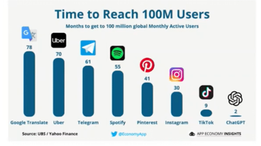
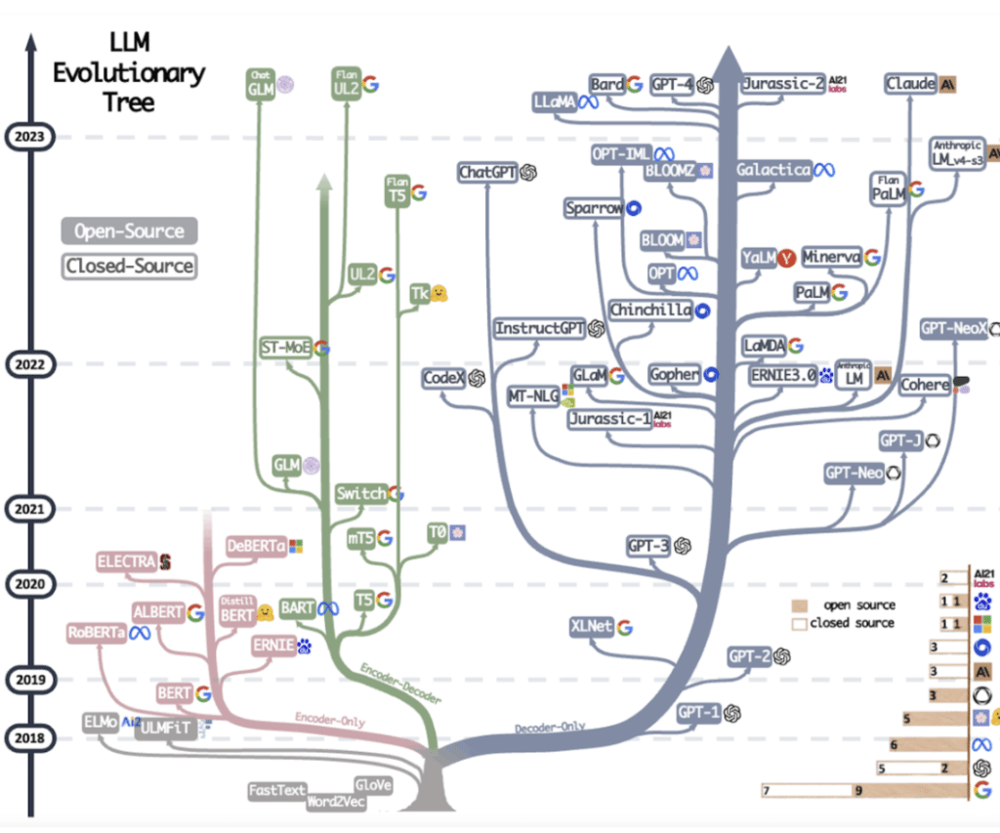
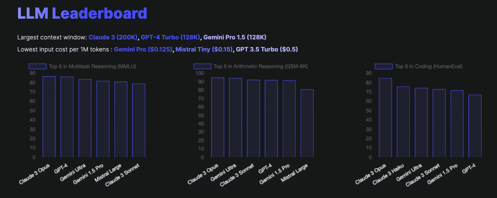
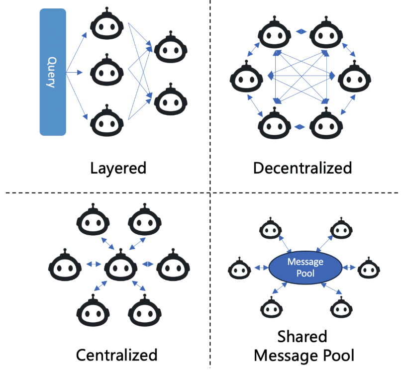
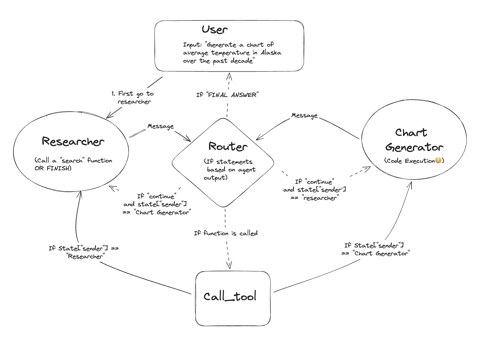
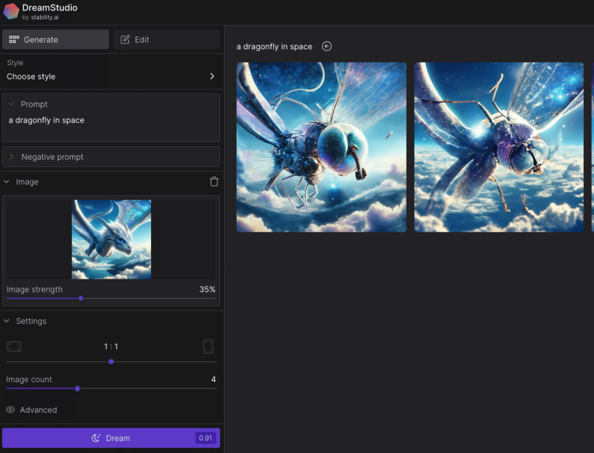
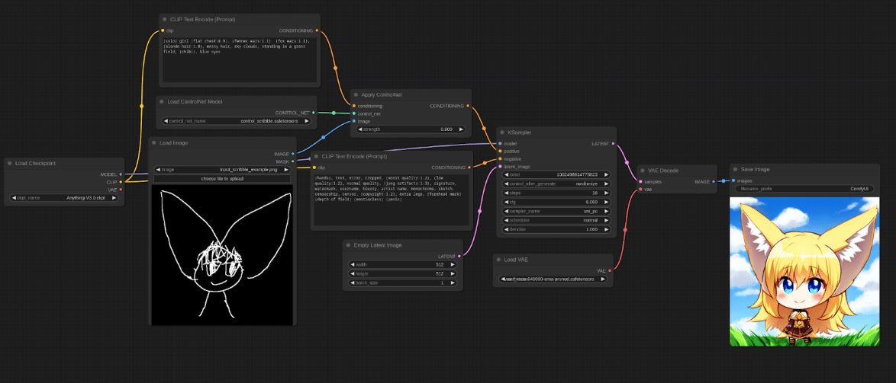
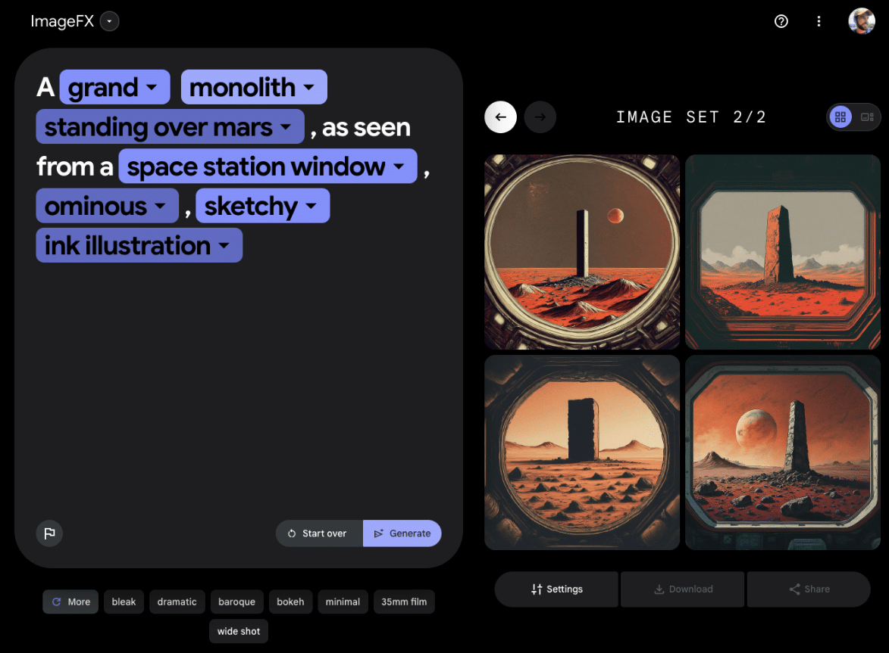
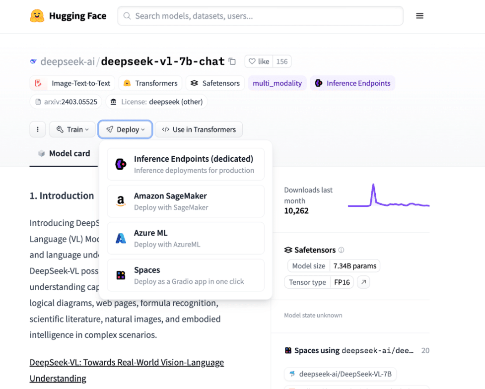
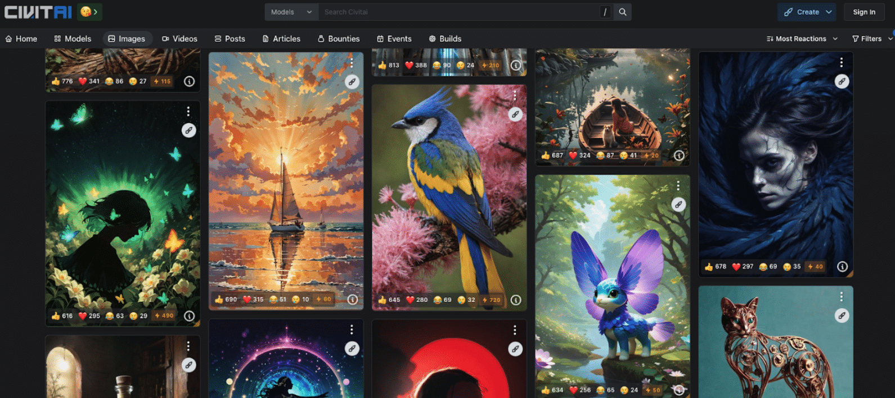

<iframe width="800" height="200" frameborder="no" src="https://w.soundcloud.com/player/?visual=false&amp;url=https%3A%2F%2Fapi.soundcloud.com%2Ftracks%2F1810285260&amp;show_artwork=true&amp;maxheight=1000&amp;maxwidth=800&amp;auto_play=false&amp;buying=true&amp;liking=true&amp;download=true&amp;sharing=true&amp;show_comments=true&amp;show_playcount=true&amp;show_user=true&amp;color=E7107E"></iframe>

For every startup founder out there, it's becoming very clear: AI isn't just a buzzword—it's a pivotal force reshaping the tech landscape and business in general. From the products we use daily to the fundamental ways we interact with technology, AI is at the heart of a rapid transformation in the digitally interconnected world we live in. 

[McKinsey illuminates this potential](https://www.mckinsey.com/capabilities/quantumblack/our-insights/the-state-of-ai-in-2023-generative-AIs-breakout-year), estimating that generative AI (gen AI) will inject between $2.6 trillion and $4.4 trillion into the global economy each year. 

**But what does this mean for the startup ecosystem?** 

It signals a seismic shift in the innovation landscape, [as highlighted by the National Bureau of Economic Research](https://www.nber.org/books-and-chapters/economics-artificial-intelligence-agenda/impact-artificial-intelligence-innovation-exploratory-analysis), AI is no longer just a tool for operational efficiency, it's emerging as a generative force capable of crafting the future of invention itself. 

Although the path to AI integration is not without challenges — accuracy concerns, cybersecurity threats, and regulatory hurdles — for those prepared with a thoughtful approach, the rewards could be substantial. 

In 2024, [over 40% of the startups selected by YCombinator](https://news.ycombinator.com/item?id=35464933#:~:text=Over%2040%25%20of%20the%20latest,AI%2FML%20startups%20%7C%20Hacker%20News), the world's leading startup accelerator, are AI/ML startups. This indicates just how the world’s leading experts in innovation see large potential in AI to transform industries and create new winners. A refusal or failure to adopt AI could come soon to be analogous to Blockbuster’s failure to adapt to a new digital world, with dire consequences.

Organisations that harness the power of AI tools competently stand to gain a significant competitive edge, and the risk of falling behind is present for everyone. Not even tech giants like Google - who dominated search and web browsing over the last two decades - are safeguarded against disruption by fast-paced innovators. 

Having spent my entire career working in tech, from robotics to crypto, to AI, I’ve seen my fair share of “hype trends”. I can confidently say that the latest demand for AI is more than a trend, but here to stay for two reasons: 

1.  **Distribution** - AI has a quick path to distribution across the whole internet layer via API access and integration ([chatGPT set the record for fastest app to ever reach 100M users](https://www.reuters.com/technology/chatgpt-sets-record-fastest-growing-user-base-analyst-note-2023-02-01/))
2. **Added Value** - AI tools can very rapidly and clearly add value to existing or new products.

In this guide, I’ll explore how you can leverage AI's building blocks to position your startup at the forefront of this new era of innovation. Whether it's enhancing your existing products, creating new business lines or revolutionising internal processes, the promise of AI is immense — and it's time to seize it. 

By the end of this article, you will know everything you need to know about: 

- The Building Blocks of AI: Text, Audio, Image, Video
- How to embed AI into your product or service successfully
- Where to find the best AI models for your purpose and how to make an informed decision on which you should choose. 

/\* widget: Blog: Expert Tip \*/ /\* reset -------------------- \*/ .blog-custom-block \*, .blog-custom-block ::before, .blog-custom-block ::after { box-sizing: border-box; border-width: 0; border-style: solid; border-color: #e5e7eb; } /\* vars -------------------- \*/ .blog-custom-block.blog-custom-block\_\_expert-tip { --color-bg: #F4FAFE; --color-border: rgb(15 164 234 / 0.50); --color-text-1: #0F172A; --color-text-2: #4A4A68; } /\* colors -------------------- \*/ .blog-custom-block.blog-custom-block\_\_expert-tip .bg-clr-bg { background-color: var(--color-bg); } .blog-custom-block.blog-custom-block\_\_expert-tip .border-clr-border { border-color: var(--color-border); } .blog-custom-block.blog-custom-block\_\_expert-tip .text-clr-text-1 { color: var(--color-text-1); } .blog-custom-block.blog-custom-block\_\_expert-tip .text-clr-text-2 { color: var(--color-text-2); } /\* utils -------------------- \*/ .blog-custom-block.blog-custom-block\_\_expert-tip .flex { display: flex; } .blog-custom-block.blog-custom-block\_\_expert-tip .flex-shrink-0 { flex-shrink: 0; } .blog-custom-block.blog-custom-block\_\_expert-tip .flex-col { flex-direction: column; } .blog-custom-block.blog-custom-block\_\_expert-tip .gap-4 { gap: 1rem; } .blog-custom-block.blog-custom-block\_\_expert-tip .gap-5 { gap: 1.25rem; } .blog-custom-block.blog-custom-block\_\_expert-tip .rounded-xl { border-radius: 0.75rem; } .blog-custom-block.blog-custom-block\_\_expert-tip .border { border-width: 1px; } .blog-custom-block.blog-custom-block\_\_expert-tip .p-8 { padding: 2rem; } .blog-custom-block.blog-custom-block\_\_expert-tip .text-3xl { font-size: 1.875rem; line-height: 2.25rem; } .blog-custom-block.blog-custom-block\_\_expert-tip .text-lg { font-size: 1.125rem; line-height: 1.75rem; } .blog-custom-block.blog-custom-block\_\_expert-tip .font-bold { font-weight: 700; } In the interest of full transparency…

...In this article, I’ll reference both free, open source and commercial AI tools. The AI tools are referenced impartially and Altar is not in any way affiliated with the referred companies.

.elementor-12941 .elementor-element.elementor-element-e56f4e6{--display:flex;--flex-direction:column;--container-widget-width:100%;--container-widget-height:initial;--container-widget-flex-grow:0;--container-widget-align-self:initial;--background-transition:0.3s;}.elementor-12941 .elementor-element.elementor-element-f8d1905{--box-background-color:var( --e-global-color-f6f9b04 );--box-border-color:var( --e-global-color-secondary );--box-border-width:1px;--box-border-radius:12px;--separator-width:0px;--box-padding:12px;--header-color:var( --e-global-color-text );--item-text-decoration:underline;--item-text-hover-decoration:underline;--marker-color:var( --e-global-color-primary );--marker-size:5px;}.elementor-12941 .elementor-element.elementor-element-f8d1905 .elementor-toc\_\_spinner{color:var( --e-global-color-secondary );fill:var( --e-global-color-secondary );}.elementor-12941 .elementor-element.elementor-element-f8d1905 .elementor-toc\_\_header-title{text-align:start;}.elementor-12941 .elementor-element.elementor-element-f8d1905 .elementor-toc\_\_header, .elementor-12941 .elementor-element.elementor-element-f8d1905 .elementor-toc\_\_header-title{font-family:"Poppins", sans-serif;font-size:2.25rem;font-weight:700;text-transform:capitalize;line-height:1.2;}.elementor-12941 .elementor-element.elementor-element-f8d1905 .elementor-toc\_\_list-item{font-family:var( --e-global-typography-45f602c-font-family ), sans-serif;font-size:var( --e-global-typography-45f602c-font-size );font-weight:var( --e-global-typography-45f602c-font-weight );line-height:var( --e-global-typography-45f602c-line-height );letter-spacing:var( --e-global-typography-45f602c-letter-spacing );word-spacing:var( --e-global-typography-45f602c-word-spacing );}.elementor-12941 .elementor-element.elementor-element-f8d1905 > .elementor-widget-container{padding:32px 32px 32px 32px;}@media(max-width:1024px){.elementor-12941 .elementor-element.elementor-element-f8d1905 .elementor-toc\_\_list-item{font-size:var( --e-global-typography-45f602c-font-size );line-height:var( --e-global-typography-45f602c-line-height );letter-spacing:var( --e-global-typography-45f602c-letter-spacing );word-spacing:var( --e-global-typography-45f602c-word-spacing );}}@media(max-width:767px){.elementor-12941 .elementor-element.elementor-element-f8d1905 .elementor-toc\_\_list-item{font-size:var( --e-global-typography-45f602c-font-size );line-height:var( --e-global-typography-45f602c-line-height );letter-spacing:var( --e-global-typography-45f602c-letter-spacing );word-spacing:var( --e-global-typography-45f602c-word-spacing );}}

#### Contents

## The Building Blocks of AI

A useful method to cut through the noise of the hype and the diversity of available AI tools is to look at the fundamental building blocks as Inputs and Outputs (I/O) to your AI systems.

**The I/O elements for AI models are text, Audio, Image, and Video.**

This way, we can treat every AI solution as a set of operations and transformations - an AI Translation model can be seen as a Text-to-Text operation, and Speech Synthesis as a Text-to-Audio conversion. For a clear structure to this article, we’ll group solutions by the element of the desired output.

### Text as Output: The Language Processing Revolution

The processing, analysis and transformation of text, a sub-field of Machine Learning (ML) named [Natural Language Processing (NLP)](https://www.ibm.com/topics/natural-language-processing), has played a large role in what we call the AI revolution.

Given that a lot of humanity’s knowledge is encoded in text form (from books to databases, to the internet) intelligence applied to text is a domain with large scope. 

In this section, I will start with the latest (and hot) [Large Language Models (LLMs)](https://www.ibm.com/topics/large-language-models), dive into the frontier of AI Agent teams, and finish with relevant building blocks - summarisation, transcription, image-to-text and translation.

#### Large Language Models (LLMs)

[OpenAI’s release of GPT-3](https://openai.com/blog/gpt-3-apps) in June 2020 was probably the most notorious tech release of the decade. It sheds light on the capacity of LLMs for diverse applications and human-like reasoning, making us question how far we are from Artificial General Intelligence (AGI). 

Diverse LLM models have and will continue to come up from players like Google, Meta, [Anthropic](https://www.anthropic.com/), [Mistral AI](https://mistral.ai/), [AI21 Labs](https://www.ai21.com/), [Databricks](https://www.databricks.com/product/machine-learning/large-language-models) and the obvious OpenAI.

For innovators looking to embed and integrate LLMs into their products and services, there are a few considerations before choosing which model to go with

Namely: 

- Cost 
- Performance
- Size 
- Application
- Context window 
- Source (open vs closed).

To simplify this choice, Vellium AI has nicely put together an interactive [LLM Leaderboard and comparison tables](https://www.vellum.ai/llm-leaderboard):

<figure>

<figcaption>

The LLM Leaderboard

</figcaption>

</figure>

<figure>

<figcaption>

LLM Performance Comparison Table

</figcaption>

</figure>

<figure>

<figcaption>

LLM Cost & Context Window Comparison

</figcaption>

</figure>

As we can see, the current top-performing LLMs are [Anthropic’s Claude 3](https://www.anthropic.com/news/claude-3-family), [Google Gemini](https://gemini.google.com/), and [GPT-4](https://openai.com/gpt-4).

LLMs are hot and will continue to evolve. Given the fast-moving space, let me leave you with a few resources for a deeper dive and experimentation that are dynamically updated: 

- To read milestone papers, understand the research and follow the LLM landscape visit [Awesome-LLM](https://github.com/Hannibal046/Awesome-LLM)
- To experiment with the top commercial LLMs via API read the docs on - [Claude API](https://docs.anthropic.com/claude/reference/getting-started-with-the-api), [Chat GPT API](https://platform.openai.com/docs/quickstart?context=python), and [Google’s Gemini API](https://ai.google.dev/tutorials/quickstart).

#### LLM-Based Multi-Agents

At the edge of LLM implementations, is the concept of multi-agent systems, where multiple “expert agents” are capable of joint problem-solving through dialog and access to tools.

It’s still early days, and benchmarks are lacking on the true capabilities of using multi-agent systems, versus a simple LLM implementation, but it looks promising!

The leading AI tools, frameworks and resources in this space are [LangGraph](https://blog.langchain.dev/langgraph-multi-agent-workflows/), [Microsoft Autogen](https://microsoft.github.io/autogen/docs/Use-Cases/agent_chat/), [CrewAI](https://www.crewai.com/), [MetaGPT](https://www.deepwisdom.ai/), [Camel AI](https://github.com/camel-ai/camel), [Langroid](https://github.com/langroid/langroid).

<figure>

<figcaption>

Evolutionary tree of multi-agent systems - by Guo 2024 “Large Language Model based Multi-Agents: A Survey of Progress and Challenges”

</figcaption>

</figure>

#### Summarisation

One of the most exciting capabilities LLMs bring is the capacity to summarise and pre-process large pieces of information in near real-time. 

Startups like [Blinkist](https://www.blinkist.com/) or [Finimize](https://finimize.com/), have successfully monetised the capacity to summarise large pieces of content into “bite-sized” digestible content, proving the consumer value of summarisation for a time-poor society.

Having the power of summarisation on an API is certainly of value, not only in creating front-end, user-facing applications but also for business operations and internal systems. 

Summarisation allows for the processing of large pieces of unstructured data, such as customer feedback, reviews, literature or market research, customer support conversations, and business meetings.

/\* widget: Blog: Expert Tip \*/ /\* reset -------------------- \*/ .blog-custom-block \*, .blog-custom-block ::before, .blog-custom-block ::after { box-sizing: border-box; border-width: 0; border-style: solid; border-color: #e5e7eb; } /\* vars -------------------- \*/ .blog-custom-block.blog-custom-block\_\_expert-tip { --color-bg: #F4FAFE; --color-border: rgb(15 164 234 / 0.50); --color-text-1: #0F172A; --color-text-2: #4A4A68; } /\* colors -------------------- \*/ .blog-custom-block.blog-custom-block\_\_expert-tip .bg-clr-bg { background-color: var(--color-bg); } .blog-custom-block.blog-custom-block\_\_expert-tip .border-clr-border { border-color: var(--color-border); } .blog-custom-block.blog-custom-block\_\_expert-tip .text-clr-text-1 { color: var(--color-text-1); } .blog-custom-block.blog-custom-block\_\_expert-tip .text-clr-text-2 { color: var(--color-text-2); } /\* utils -------------------- \*/ .blog-custom-block.blog-custom-block\_\_expert-tip .flex { display: flex; } .blog-custom-block.blog-custom-block\_\_expert-tip .flex-shrink-0 { flex-shrink: 0; } .blog-custom-block.blog-custom-block\_\_expert-tip .flex-col { flex-direction: column; } .blog-custom-block.blog-custom-block\_\_expert-tip .gap-4 { gap: 1rem; } .blog-custom-block.blog-custom-block\_\_expert-tip .gap-5 { gap: 1.25rem; } .blog-custom-block.blog-custom-block\_\_expert-tip .rounded-xl { border-radius: 0.75rem; } .blog-custom-block.blog-custom-block\_\_expert-tip .border { border-width: 1px; } .blog-custom-block.blog-custom-block\_\_expert-tip .p-8 { padding: 2rem; } .blog-custom-block.blog-custom-block\_\_expert-tip .text-3xl { font-size: 1.875rem; line-height: 2.25rem; } .blog-custom-block.blog-custom-block\_\_expert-tip .text-lg { font-size: 1.125rem; line-height: 1.75rem; } .blog-custom-block.blog-custom-block\_\_expert-tip .font-bold { font-weight: 700; } Fun Exercise

To understand how we got here with AI, find the list of the [LLM milestone papers](https://github.com/Hannibal046/Awesome-LLM?tab=readme-ov-file#milestone-papers), give them to an LLM to summarise, and ask it to “explain how LLMs work and where we’re going”.

Companies are already embedding summarization into their products, good examples being [Zoom’s AI Companion](https://support.zoom.com/hc/en/article?id=zm_kb&sysparm_article=KB0058013), and [Arc’s “pinch to summarise”](https://techcrunch.com/2024/02/23/arc-browsers-new-ai-powered-pinch-to-summarize-feature-is-clever-but-often-miss-the-mark/?guccounter=1), where “pinching” your iPhone summarises whatever web page you’re on.

#### Transcription/Speech to Text (STT)

AI transcription has been used as a building block for a while, yet it simply keeps getting more accurate and better in terms of multi-language support.

There are [many transcription SaaS solutions](https://clickup.com/blog/ai-transcription-tools/) available, for different use cases. The most trendy and promising include [AI meeting assistants](https://zapier.com/blog/best-ai-meeting-assistant/), [customer service automation](https://www.zendesk.com/blog/ai-customer-service/) and market research. Here voice inputs are pre-processed into text, ingested by an LLM, and turned into insights.

If you want to embed [Speech to Text](https://revoicer.com/speech-to-text/) into your product, I would recommend looking into [OpenAI’s Whisper](https://platform.openai.com/docs/guides/speech-to-text) or a cloud solution like [Amazon Transcribe](https://aws.amazon.com/pm/transcribe/?trk=69ba987a-7f66-49a1-8d95-b574eb677814&sc_channel=ps&ef_id=CjwKCAjwtqmwBhBVEiwAL-WAYRn1p07EU_6UvqIinPrIohSxXHAFiCbqDjKIePBtOyM9MHgUWdV0OxoCguYQAvD_BwE:G:s&s_kwcid=AL!4422!3!655532933931!p!!g!!audio%20to%20text%20converter!20006017891!149032459420&gclid=CjwKCAjwtqmwBhBVEiwAL-WAYRn1p07EU_6UvqIinPrIohSxXHAFiCbqDjKIePBtOyM9MHgUWdV0OxoCguYQAvD_BwE), [Google Speech to Text](https://cloud.google.com/speech-to-text) or [Azure Cognitive Services Speech to Text](https://azure.microsoft.com/en-us/products/ai-services/speech-to-text).

#### Image to Text - OCR

OCR (Optical Character Recognition) allows, as a building block, the processing of any documents or data that is still not digital. Say invoice images uploaded to an accounting app, by converting data that’s in paper or written form into a digital version with high accuracy.

In earlier days of the ML (Machine Learning) buzz, popularised by lead researchers like Stanford’s Andrew Ng, a common problem in the field of computer vision was the classification of images of digits into the digits “0” to “9”, using algorithms like [K-means](https://towardsdatascience.com/understanding-k-means-clustering-in-machine-learning-6a6e67336aa1) and [PCA](https://www.geeksforgeeks.org/principal-component-analysis-pca/). 

Given the maturity of this problem, OCR is now widely available and you can find reliable open-source and commercial APIs.

#### Translation/Localisation

Translation has been a focus problem for Machine Learning and Natural Language Processing (NLP) models for decades and improvements continue happening, though incremental. 

The surge of LLMs does not necessarily change the game of translation, as LLMs are not particularly trained for this purpose, yet, LLMs can be used for additional revision and output enhancement steps in a translation pipeline.

[DeepL API](https://www.deepl.com/en/pro-api) is still the best bet for embedding translation into your solution. 

For use cases where the quality of the translation is crucial, human-in-the-loop (HITL) solutions like [Unbabel](https://unbabel.com/) and [ModernMT](https://www.modernmt.com/) are also an option.

.elementor-16757 .elementor-element.elementor-element-fa6400f{--display:flex;--flex-direction:column;--container-widget-width:100%;--container-widget-height:initial;--container-widget-flex-grow:0;--container-widget-align-self:initial;--overflow:hidden;--background-transition:0.3s;--border-radius:12px 12px 12px 12px;}.elementor-16757 .elementor-element.elementor-element-283e311{--display:flex;--flex-direction:row;--container-widget-width:initial;--container-widget-height:100%;--container-widget-flex-grow:1;--container-widget-align-self:stretch;--gap:64px 64px;--background-transition:0.3s;}.elementor-16757 .elementor-element.elementor-element-283e311:not(.elementor-motion-effects-element-type-background), .elementor-16757 .elementor-element.elementor-element-283e311 > .elementor-motion-effects-container > .elementor-motion-effects-layer{background-color:#F4FAFE;}.elementor-16757 .elementor-element.elementor-element-283e311, .elementor-16757 .elementor-element.elementor-element-283e311::before{--border-transition:0.3s;}.elementor-16757 .elementor-element.elementor-element-857117e{--display:flex;--flex-direction:row;--container-widget-width:initial;--container-widget-height:100%;--container-widget-flex-grow:1;--container-widget-align-self:stretch;--background-transition:0.3s;}.elementor-16757 .elementor-element.elementor-element-857117e.e-con{--flex-grow:0;--flex-shrink:0;}.elementor-16757 .elementor-element.elementor-element-e6af329 img{width:100%;max-width:100%;height:100%;object-fit:cover;object-position:bottom right;}.elementor-16757 .elementor-element.elementor-element-e6af329{width:100%;max-width:100%;bottom:-44px;}body:not(.rtl) .elementor-16757 .elementor-element.elementor-element-e6af329{right:0px;}body.rtl .elementor-16757 .elementor-element.elementor-element-e6af329{left:0px;}.elementor-16757 .elementor-element.elementor-element-ec0de51{--display:flex;--flex-direction:column;--container-widget-width:100%;--container-widget-height:initial;--container-widget-flex-grow:0;--container-widget-align-self:initial;--gap:24px 24px;--background-transition:0.3s;--padding-top:112px;--padding-bottom:112px;--padding-left:0px;--padding-right:44px;}.elementor-16757 .elementor-element.elementor-element-ec0de51.e-con{--flex-grow:1;--flex-shrink:1;}.elementor-16757 .elementor-element.elementor-element-c168e59{--display:flex;--flex-direction:column;--container-widget-width:100%;--container-widget-height:initial;--container-widget-flex-grow:0;--container-widget-align-self:initial;--background-transition:0.3s;}.elementor-16757 .elementor-element.elementor-element-4aeb8ec .elementor-heading-title{font-family:"Poppins", sans-serif;font-size:32px;font-weight:700;}.elementor-16757 .elementor-element.elementor-element-8e0cd20{color:#000000;}@media(min-width:768px){.elementor-16757 .elementor-element.elementor-element-857117e{--width:360px;}}@media(max-width:767px){.elementor-16757 .elementor-element.elementor-element-283e311{--padding-top:40px;--padding-bottom:40px;--padding-left:var(--safe-margin);--padding-right:var(--safe-margin);}.elementor-16757 .elementor-element.elementor-element-857117e{--min-height:300px;}body:not(.rtl) .elementor-16757 .elementor-element.elementor-element-e6af329{right:0px;}body.rtl .elementor-16757 .elementor-element.elementor-element-e6af329{left:0px;}.elementor-16757 .elementor-element.elementor-element-e6af329{bottom:-76px;}.elementor-16757 .elementor-element.elementor-element-ec0de51{--padding-top:40px;--padding-bottom:0px;--padding-left:0px;--padding-right:0px;}} 

##### Looking to Integrate AI into Your Business?

Get straight to the point, jargon-free advice on transforming your tech strategy by leveraging AI from an expert that has been building award-winning Startups for the past 10 years.

Let's Talk

### Audio as Output: Seamless Communication

In this section, I’ll cover how AI tools are revolutionising traditional audio production by introducing high-quality synthetic generation of background sounds, music and voice. 

I’ll explore the latest developments and tools of synthetic generation, as well as interesting use cases like voice cloning and AI audio mastering.

#### Text-to-Sound & Text-to-Music (Audio Generation)

Generative audio marks a thrilling frontier in AI's creative capacities. By transforming text inputs into soundscapes or musical compositions, these technologies are not just enhancing user experiences but also opening new avenues for artistic expression. 

Innovations in this space are leveraging the nuances of language and music theory, synthesised through advanced AI models, to produce rich, dynamic auditory content from written text. 

A true revolution for content creation and entertainment, offering personalisation and copyright-free content, in a blend of creativity and technology that was previously unimaginable.

The top solutions to look into here are: 

1. [AudioCraft by Meta](https://about.fb.com/news/2023/08/audiocraft-generative-ai-for-music-and-audio/): designed for generating high-quality audio and music from text, it includes models like MusicGen for music generation and AudioGen for sound effects​​.
2. [Jukebox by OpenAI](https://openai.com/research/jukebox): Uses VQ-VAE-2's approach for music generation, capable of creating musical compositions with attention to pitch, timbre, and volume from text inputs​​.
3. [MusicLM by Google](https://google-research.github.io/seanet/musiclm/examples/): A highly advanced model capable of converting detailed text descriptions into high-fidelity music pieces​​.
4. [Stable Audio by Stability AI](https://www.stableaudio.com/): Uses cutting-edge audio diffusion models to produce stereo-quality music, allowing for detailed customization through text prompts.

A few other companies offer text-to-music embedded into their products, see - [Mubert](https://mubert.com/render/tags/text-to-music), [AIVA](https://www.aiva.ai/), [Soundraw](https://soundraw.io/), and [Google's Magenta Studio](https://magenta.tensorflow.org/studio/).

#### Text to Speech (TTS) / Speech Synthesis

Speech Synthesis, a.k.a. Text-to-Speech, is a building block that converts text into spoken words using computer-generated or “computer-replicated” voices. 

In 2021, I found myself so excited with the possibilities brought up by human-like synthetic speech generation that I left the safety of my job working with the founder of Ubuntu Linux to start [Radiobooks](https://radiobooks.webflow.io/) - a text-to-speech startup focused on audiobooks. A few months later Google launched [auto-narrated audiobooks](https://play.google.com/books/publish/autonarrated/).

TTS leverages advanced AI/ML algorithms to produce speech that closely mimics human voices, with high fidelity of emotions and accentuation. 

This technology has been around for a while but until recently it sounded “robotic”, limiting its applications. 

Today, the quality standard of AI tools like [ElevenLabs](https://elevenlabs.io/) or [PlayHT](https://play.ht/) has reached a human-like quality, where it is hardly distinguishable from human voices. So much so that an audiobook produced entirely with ElevenLabs technology, in the cloned voice of the author, can pass Audible’s “humanity” tests (in fact, [I published one myself](https://www.audible.com/pd/How-to-Live-Audiobook/B0CLS7FH9Q)).

If you want your product to literally “speak” to your users, TTS is an important building block to integrate into your solution.

_**You can listen to this article (top of page) thanks to ElevenLabs TTS**_

Every major cloud provider today has a TTS solution - [Azure Cognitive Services TTS](https://azure.microsoft.com/en-us/products/ai-services/text-to-speech), [Google Text to Speech](https://cloud.google.com/text-to-speech?hl=en), [Amazon Polly](https://aws.amazon.com/polly/) - which makes it easy to integrate. Cloud solutions have been improving in quality, providing hundreds of stock voices in 70+ languages and allowing for some level of customization via [SSML](https://cloud.google.com/text-to-speech/docs/ssml), a kind of XML for audio. 

Yet, when comparing quality, startups like [ElevenLabs](https://elevenlabs.io/) and [PlayHT](https://play.ht/) have done a remarkable job of providing better quality with an equal level of integration, at an additional cost.

A final consideration in implementing TTS into your product is which voices to use. There are a lot of stock voices, but why not use your own voice?

**Voice Cloning** 

An exciting possibility for TTS is using your voice! 

You can find voice cloning options by startups like [ElevenLabs](https://elevenlabs.io/) (top choice), [PlayHT](https://play.ht/), [Speechify](https://speechify.com/voice-cloning/), [Resemble AI](https://www.resemble.ai/), [Descript](https://www.descript.com/tools/text-to-speech), or by cloud infrastructure providers - [Google Custom Voices](https://cloud.google.com/blog/products/ai-machine-learning/create-custom-voices-with-google-cloud-text-to-speech), [Azure TTS Custom Neural Voice](https://speech.microsoft.com/customvoice), [AWS Polly Brand Voice](https://aws.amazon.com/it/blogs/machine-learning/build-a-unique-brand-voice-with-amazon-polly/). The Cloud solutions are developer-focused, while startups focus on a simpler UX for a non-technical user.

Note: the potential for fraudulent use of voice cloning is high, and safety measures need to be in place.

Currently, a verification process is used to guarantee consent by the “owner” of the voice. [According to The Guardian](https://www.theguardian.com/technology/2024/mar/31/openai-deems-its-voice-cloning-tool-too-risky-for-general-release), OpenAI has been delaying their own release of this technology exactly for safety reasons. 

#### AI Audio Enhancement (AI Mastering)

Finally, AI algorithms are also being used in audio enhancement (audio-to-audio), in the traditional role of a mastering studio. 

You can find turn-key AI tools for mastering like [Landr](https://www.landr.com/pt/), which provides a nice [Online Mastering API](https://www.landr.com/pro-audio-mastering-api/), AI plugins that work with existing [Digital Audio Workstations (DAWs)](https://www.musicradar.com/news/the-best-daws-the-best-music-production-software-for-pc-and-mac) like [Google Magenta Studio Ableton Plugin](https://magenta.tensorflow.org/studio/ableton-live/) and integrated solutions that already leverage this functionality like [Adobe Podcast’s AI-enhanced audio recording](https://podcast.adobe.com/).

/\* widget: Blog: Small Topic \*/ /\* reset -------------------- \*/ .blog-custom-block \*, .blog-custom-block ::before, .blog-custom-block ::after { box-sizing: border-box; border-width: 0; border-style: solid; border-color: #e5e7eb; } /\* vars -------------------- \*/ .blog-custom-block.blog-custom-block\_\_small-topic { --color-accent: #E7107E; --color-bg: #F4FAFE; --color-text-1: #0F172A; } /\* colors -------------------- \*/ .blog-custom-block.blog-custom-block\_\_small-topic .bg-clr-bg { background-color: var(--color-bg); } .blog-custom-block.blog-custom-block\_\_small-topic .text-clr-accent { color: var(--color-accent); } .blog-custom-block.blog-custom-block\_\_small-topic .text-clr-text-1 { color: var(--color-text-1); } /\* utils -------------------- \*/ .blog-custom-block.blog-custom-block\_\_small-topic .mt-2 { margin-top: 0.5rem; } .blog-custom-block.blog-custom-block\_\_small-topic .flex { display: flex; } .blog-custom-block.blog-custom-block\_\_small-topic .flex-shrink-0 { flex-shrink: 0; } .blog-custom-block.blog-custom-block\_\_small-topic .flex-col { flex-direction: column; } .blog-custom-block.blog-custom-block\_\_small-topic .items-center { align-items: center; } .blog-custom-block.blog-custom-block\_\_small-topic .p-5 { padding: 1.25rem; } .blog-custom-block.blog-custom-block\_\_small-topic .gap-4 { gap: 1rem; } .blog-custom-block.blog-custom-block\_\_small-topic .gap-5 { gap: 1.25rem; } .blog-custom-block.blog-custom-block\_\_small-topic .rounded-xl { border-radius: 0.75rem; } .blog-custom-block.blog-custom-block\_\_small-topic .p-8 { padding: 2rem; } .blog-custom-block.blog-custom-block\_\_small-topic .text-xl { font-size: 1.25rem; line-height: 1.75rem; } .blog-custom-block.blog-custom-block\_\_small-topic .font-bold { font-weight: 700; } Related: [With Generative Web on the Horizon, is Your Product Due a UX Audit?](https://altar.io/generative-web-product-ux-audit/)

### Image as Output: The Science of Art

In this section, we cover all the image-related building blocks that have emerged in the advent of AI. 

Starting with chronologically older technologies of image processing and computer vision, and then diving into the more recent trend of AI image generation.

#### Image Processing/Computer Vision

By 2017, computer vision was hot. After the early problems of object and character recognition described above in “image-to-text”, the leading research was focused on recognising objects and relationships between objects given an image - e.g. “dog bites apple”. 

Interestingly today, image generation from text has become much more popular than image processing, even if the former was only possible by the research and dataset building of the ladder.

Computer vision as a field treats many subproblems which typically output an enhanced image - e.g. “an image with faces identified and squares drawn around the contours of the face“ - or attribution of the image to a specific category. Some examples of applications are: 

- Image tagging
- [Visual search](https://lens.google/)
- Facial recognition 
- [Image classification](https://huggingface.co/tasks/image-classification)
- [Image segmentation](https://www.analyticsvidhya.com/blog/2019/04/introduction-image-segmentation-techniques-python/)
- [Explicit content detection](https://www.edenai.co/post/top-10-explicit-content-detection-apis) 
- Colour extraction
- Content-aware cropping. 

Given the maturity of this technology, high-quality commercial APIs are available for integration within your solution by all major cloud providers. 

See [Google’s Vision API](https://cloud.google.com/vision?hl=en), [Azure Vision AI](https://azure.microsoft.com/en-us/products/ai-services/ai-vision) or [Amazon Rekognition](https://docs.aws.amazon.com/rekognition/latest/dg/what-is.html).

#### Generative AI Images: Text-to-Image & Image-to-Image

A more recent trend (and so exciting for the awesome images it produces) is AI image generation. This technology, popularised by labs like [Midjourney](https://www.midjourney.com/), is the idea of generating high-quality images from text prompts and being able to iterate on the output. 

**Stable Diffusion by Stability AI**

[Stable diffusion by Stability AI](https://github.com/Stability-AI/stablediffusion) is one of the most popular image generation AI tools for the high-quality of the images it generates. 

It is fully open source, which means you can embed both the model and the generated images into your products and services copyright-free. 

This is particularly awesome for creatives and entrepreneurs! Until now, the use of stock images from platforms like [Unsplash](https://unsplash.com/) was the way to go if you just wanted to get something going, but with these free high-quality options, there is no reason not to ask for precisely what you want.

To generate images, you can run stable diffusion on your own infrastructure, by running the “txt2img.py” or “img2img.py” scripts available in the open-source repo. For easier testing, [Stability AI’s Dream Studio (beta)](https://beta.dreamstudio.ai/generate) is the place to go. 

The Dream Studio allows you to play with parameters such as negative prompt, image input, image strength, and style. You can embed stable diffusion into your products via the [Stability AI REST API](https://platform.stability.ai/docs/api-reference).

Generating amazing images, with stable diffusion requires iteration and creating a graph of rules and prompts. For deeper control over the generation process take a look at [ComfyUI](https://stable-diffusion-art.com/comfyui/)

**Imagen 2 by Google Deepmind**

[Imagen 2](https://deepmind.google/technologies/imagen-2/) is Google’s most advanced text-to-image diffusion model. It is already available on Gemini, and it’s easy to test on [Google Labs’ ImageFX](https://aitestkitchen.withgoogle.com/tools/image-fx). It is also available via the [Imagen API on Vertex AI](https://cloud.google.com/vertex-ai/generative-ai/docs/image/overview), Google’s Machine Learning Ops (MLOps) platform.

**DALL·E 3 by OpenAI**

Probably the most used diffusion model by now, given its integration within the popular ChatGPT, [DALL-](https://openai.com/dall-e-3)[E 3](https://openai.com/dall-e-3) offers incredible quality images, and the possibility to embed into your product or solution via the [Dall-](https://platform.openai.com/docs/guides/images?context=node)[E 3 API](https://platform.openai.com/docs/guides/images?context=node). 

For artist copyright reasons, “DALL·E 3 is designed to decline requests that ask for an image in the style of a living artist. Creators can now also opt their images out from training of our future image generation models.”

**Midjourney** 

Popularised for its fantastic image quality, [Midjourney](https://www.midjourney.com/) is a wonderful image generation tool. It impressed every tech enthusiast when it came out as a simpler, higher-quality way of generating images from simple prompts than stable diffusion. The combination of LLMs and diffusion models behind the scenes makes for an awesome white-glove experience.

For creators, Midjourney is a fantastic AI tool, with a paid subscription starting at $10 per month, and available via Discord. For builders, it does not allow for easy embedding since the models are closed-source and not available via API.

  .elementor-3329 .elementor-element.elementor-element-f79b780{--display:flex;--flex-direction:column;--container-widget-width:100%;--container-widget-height:initial;--container-widget-flex-grow:0;--container-widget-align-self:initial;--background-transition:0.3s;}.elementor-3329 .elementor-element.elementor-element-aa6dd2a{--display:flex;--flex-direction:column;--container-widget-width:100%;--container-widget-height:initial;--container-widget-flex-grow:0;--container-widget-align-self:initial;--gap:24px 24px;--background-transition:0.3s;--border-radius:12px 12px 12px 12px;--padding-top:70px;--padding-bottom:70px;--padding-left:var(--safe-margin);--padding-right:var(--safe-margin);}.elementor-3329 .elementor-element.elementor-element-aa6dd2a:not(.elementor-motion-effects-element-type-background), .elementor-3329 .elementor-element.elementor-element-aa6dd2a > .elementor-motion-effects-container > .elementor-motion-effects-layer{background-color:#29293E;}.elementor-3329 .elementor-element.elementor-element-aa6dd2a, .elementor-3329 .elementor-element.elementor-element-aa6dd2a::before{--border-transition:0.3s;}.elementor-3329 .elementor-element.elementor-element-95ae566{--display:flex;--flex-direction:column;--container-widget-width:100%;--container-widget-height:initial;--container-widget-flex-grow:0;--container-widget-align-self:initial;--background-transition:0.3s;}.elementor-3329 .elementor-element.elementor-element-99ebd14{text-align:center;}.elementor-3329 .elementor-element.elementor-element-99ebd14 .elementor-heading-title{color:var( --e-global-color-eb70be1 );font-family:var( --e-global-typography-0ff79ee-font-family ), sans-serif;font-size:var( --e-global-typography-0ff79ee-font-size );font-weight:var( --e-global-typography-0ff79ee-font-weight )  --e-global-typography-text-font-size );line-height:var( --e-global-typography-text-line-height );}.elementor-3329 .elementor-element.elementor-element-70fbc6a .elementor-message{font-size:var( --e-global-typography-9730a4e-font-size );line-height:var( --e-global-typography-9730a4e-line-height );letter-spacing:var( --e-global-typography-9730a4e-letter-spacing );word-spacing:var( --e-global-typography-9730a4e-word-spacing );}}@media(max-width:767px){.elementor-3329 .elementor-element.elementor-element-99ebd14 .elementor-heading-title{font-size:var( --e-global-typography-0ff79ee-font-size );line-height:var( --e-global-typography-0ff79ee-line-height );letter-spacing:var( --e-global-typography-0ff79ee-letter-spacing );word-spacing:var( --e-global-typography-0ff79ee-word-spacing );}.elementor-3329 .elementor-element.elementor-element-70fbc6a .elementor-field-group > label{font-size:var( --e-global-typography-9730a4e-font-size );line-height:var( --e-global-typography-9730a4e-line-height );letter-spacing:var( --e-global-typography-9730a4e-letter-spacing );word-spacing:var( --e-global-typography-9730a4e-word-spacing );}.elementor-3329 .elementor-element.elementor-element-70fbc6a .elementor-field-group .elementor-field, .elementor-3329 .elementor-element.elementor-element-70fbc6a .elementor-field-subgroup label{font-size:var( --e-global-typography-text-font-size );line-height:var( --e-global-typography-text-line-height );}.elementor-3329 .elementor-element.elementor-element-70fbc6a .elementor-message{font-size:var( --e-global-typography-9730a4e-font-size );line-height:var( --e-global-typography-9730a4e-line-height );letter-spacing:var( --e-global-typography-9730a4e-letter-spacing );word-spacing:var( --e-global-typography-9730a4e-word-spacing );}}/\* Start custom CSS for form, class: .elementor-element-70fbc6a \*/.elementor-3329 .elementor-element.elementor-element-70fbc6a input { border-color: #65639C !important; } .elementor-3329 .elementor-element.elementor-element-70fbc6a input:is(:focus, :hover) { border-color: #B9B8CE !important; }/\* End custom CSS \*/

##### Sign up for our newsletter

Join hundreds of entrepreneurs and business leaders to receive  
fresh, actionable tech and startup related insights and tips

   Full Name  Business Email  Subscribe

### Video as Output: The Evolution of Storytelling

AI video generation stands at the forefront of digital innovation, transforming how engaging content is created, shared, and experienced. This technology automates and enhances video production, making it incredibly more accessible, efficient, and personalised. 

From TikTok ads to Hollywood, video content creation is on the brink of disruption. At the heart of this evolution are several key concepts we will dive into - digital avatars, clones, text-to-video, image-to-video and video-to-video, each offering unique paths for creative magic! 

#### Digital Avatars and Clones

Digital avatars represent a significant leap forward in video content creation. 

These avatars can mimic human expressions, movements, and speech, creating a lifelike digital representation of a person, following a text script. 

AI avatars that deliver scripted dialogues are particularly useful for creating educational content, corporate training videos, and personalised marketing messages, eliminating the need for camera-shy individuals to appear on screen, and the long hours of video recording and editing.

Platforms like [Synthesia](http://synthesia.io) and [Colossyan](https://www.colossyan.com/?via=pekka) are pioneers in this space, offering users the ability to create custom videos with “stock” avatars that can speak multiple languages, embodying expression and emotion. 

Video content creation has never been faster, cheaper, more versatile or inclusive. Both tools are available via API - [Synthesia API](https://docs.heygen.com/docs/quick-start), [Colossyan API](https://docs.colossyan.com/getting-started).

One step further is the creation of **digital clones.** 

These are almost indistinguishable from the real person they replicate, allowing the content creator to recreate himself and generate hours of content in minutes. 

We can envision a future where digital creation is separate from the person on display, having agencies that focus solely on creating ads from avatars of famous individuals - says Marilyn Monroe drinking a Coca-Cola in 2025.

[HeyGen](https://www.heygen.com/) is at the forefront of this technology, offering unparalleled realism in the digital clones it creates. It captures nuances of a person's appearance, speech, and mannerisms. 

You can embed HeyGen into your product using [HeyGen API](https://docs.heygen.com/docs/quick-start), which includes functionalities like video generation, avatar streaming, and video translation.

For further automation, connect these solutions to your app via [Zapier integrations for HeyGen](https://zapier.com/apps/heygen/integrations) and [Zapier integrations for Synthesia](https://zapier.com/apps/synthesia/integrations).

#### Text to Video

Beyond the frame of a human speaking to a virtual camera, the possibility of generating a video of whatever your creative mind can conjure is here. 

Storytelling is transcending traditional boundaries, with the capacity to generate impossible scenes from a text prompt - like a “racoon trying to reach a burrito in space”:

Text-to-video technology can already generate impressive videos, with interesting use cases for many industries from video advertising to the traditional film industry. 

When it comes to marketing products, we can imagine a world where ads become so personalised that a video ad is generated taking into account the demographics and preferences of the individual it is reaching. 

For the film industry, this means it is now possible for creative directors to generate scenes of a movie before pitching it to investors at a fraction of the cost.

A few platforms and solutions are at the forefront of this innovative trend. Next, I’ll list such solutions and attempt to describe their differences and unique features.

**Invideo**

[Invideo](https://invideo.io/) stands out for its user-friendly interface and extensive library of templates, making video creation accessible to creators regardless of their technical skills. 

By converting simple text prompts into engaging videos, Invideo empowers marketers, educators, and content creators to produce professional-quality videos in minutes. Its versatility and ease of use make it a favoured AI tool for creating social media content, promotional videos, and educational materials.

Invideo does not currently provide a public-facing API.

**Canva AI Video Generator**

[Canva AI Video Generator](https://www.canva.com/features/ai-video-generator/) extends the platform's well-known design capabilities into the realm of video production. 

Canva is extremely well positioned for this “race” as it has one of the largest user bases of design tools, already integrates with social media platforms like Instagram and Linkedin, and includes a video creation and editing tool. 

By allowing users to convert text into videos, Canva adds to its existing functionality, making it easy to create compelling visual stories without the need for an additional tool or extensive video editing experience. 

This new feature integrates seamlessly with Canva's vast array of design elements, offering endless possibilities for customisation and creativity.

**Runway Gen 2**

[Runway](https://research.runwayml.com/gen2) goes beyond text-to-video, offering a suite of AI tools for image, audio and video generation and editing. It offers apps for both web and iOS which allow for the generation of video and audio from image and/or text inputs. The video quality is remarkable and it caters to creatives seeking to refine and augment their creations with advanced effects, animations, and editing features. 

Runway does not offer a public API.

**Pika**

[Pika](https://pika.art/) is a self-proclaimed “idea-to-video” platform offering an array of interesting features for video creators. It allows you to create a video from a text prompt, an image, or an existing video that you want to modify. In addition, it has very cool video features like region modification, lip-sync, sound effects, expanded canvas and extended video length.

Although Pika does not offer an official API, there is an [unofficial paid API for Pika](https://www.pikapikapika.io/docs/getting-started) developed by the community as a path to integrating it into your app.

**Open AI Sora (Beta)**

[Sora](https://openai.com/sora) is OpenAI’s latest text-to-video model, which, at the time of writing, is only available to beta testers. It can generate movies up to a minute-long. 

The quality is very realistic, though the examples still appear fairly simple and the time cap limits its application. 

This platform is particularly notable for its ability to understand and interpret the nuances of the text, ensuring that the resulting videos are not only relevant but also rich in context and meaning. The lack of a post-production editing tool makes the iterative process of video creation more challenging.

It is expected that (hopefully soon) a commercial public API will be released.

Downside: hard to integrate into your product

Despite the astonishing quality of video output that can already be produced with text-to-video solutions, contrary to digital avatars and clones, as of April 2024 there is a lack of available APIs to build upon. 

This could change quickly if OpenAI decides to open access to Sora, but until then there is no clear “safe” path to integration. 

I hope to see more integration paths emerge soon!

/\* widget: Blog: Small Topic \*/ /\* reset -------------------- \*/ .blog-custom-block \*, .blog-custom-block ::before, .blog-custom-block ::after { box-sizing: border-box; border-width: 0; border-style: solid; border-color: #e5e7eb; } /\* vars -------------------- \*/ .blog-custom-block.blog-custom-block\_\_small-topic { --color-accent: #E7107E; --color-bg: #F4FAFE; --color-text-1: #0F172A; } /\* colors -------------------- \*/ .blog-custom-block.blog-custom-block\_\_small-topic .bg-clr-bg { background-color: var(--color-bg); } .blog-custom-block.blog-custom-block\_\_small-topic .text-clr-accent { color: var(--color-accent); } .blog-custom-block.blog-custom-block\_\_small-topic .text-clr-text-1 { color: var(--color-text-1); } /\* utils -------------------- \*/ .blog-custom-block.blog-custom-block\_\_small-topic .mt-2 { margin-top: 0.5rem; } .blog-custom-block.blog-custom-block\_\_small-topic .flex { display: flex; } .blog-custom-block.blog-custom-block\_\_small-topic .flex-shrink-0 { flex-shrink: 0; } .blog-custom-block.blog-custom-block\_\_small-topic .flex-col { flex-direction: column; } .blog-custom-block.blog-custom-block\_\_small-topic .items-center { align-items: center; } .blog-custom-block.blog-custom-block\_\_small-topic .p-5 { padding: 1.25rem; } .blog-custom-block.blog-custom-block\_\_small-topic .gap-4 { gap: 1rem; } .blog-custom-block.blog-custom-block\_\_small-topic .gap-5 { gap: 1.25rem; } .blog-custom-block.blog-custom-block\_\_small-topic .rounded-xl { border-radius: 0.75rem; } .blog-custom-block.blog-custom-block\_\_small-topic .p-8 { padding: 2rem; } .blog-custom-block.blog-custom-block\_\_small-topic .text-xl { font-size: 1.25rem; line-height: 1.75rem; } .blog-custom-block.blog-custom-block\_\_small-topic .font-bold { font-weight: 700; } Related: [AI's Unfulfilled Promise For Business Leaders: The Gap Between Potential and Practice](https://altar.io/navigating-ai-enablement-business/)

## Embedding Great AI models Into Your Product

To ensure the success of your Startup offering, whether in an MVP or a mature set of products and services, it's crucial to utilise the best AI models available. The integration process involves:

1. **Selecting the appropriate building blocks based on your application’s needs** - key considerations include user experience, scalability, and compliance with data protection regulations
2. **Finding reliable sources of models (assuming you are not training them from scratch)** - this involves researching and comparing different AI services and platforms, across factors such as model performance, ease of integration, cost, and support for customization. 
3. **Customising the models to fit your specific requirements** - whether that means adapting the parameters on an existing model, or enhancing a model with your own data through [transferred learning](https://machinelearningmastery.com/transfer-learning-for-deep-learning/). GitHub, academic papers, and AI community forums are excellent resources for discovering and iterating through to getting your models right. 
4. **Ensuring a clear path to production** where your ML systems are operationalised ([MLOps](https://ml-ops.org/)) alongside your existing DevOps systems and routines. 

Aside from the resources linked for every building block, here are a few places you can look for great AI models:

#### Open Source Models & Container Repos

Open-source communities (with large contributions by Google and Meta) have played a key role in the advancement of AI, through frameworks like TensorFlow and PyTorch, competitions on Kaggle, open data and model repositories. 

These resources not only provide the flexibility of being able to customise and optimise for specific needs but also a vast community for support and collaboration. 

They are also copyright-free, which means you can call it your own after a couple of changes, and start strengthening your startup’s IP.

In 2024, the place to go for open-source models is [Hugging Face](https://huggingface.co/models), where you can find all types of models, and use them by deploying directly into your infrastructure of choice.

For a while Nvidia has also offered numerous CUDA-enabled container models in their [Nvidia NGC Catalog](https://catalog.ngc.nvidia.com/?filters=&orderBy=weightPopularDESC&query=). 

Container models can be easily deployed in various environments, ensuring consistency across development, testing, and production -simplifying dependency management and making your application more scalable and portable. 

Yet, as of March 18 2024, Nvidia is migrating its models to [Nvidia’s New API Catalog](https://build.nvidia.com/explore/discover), with an interesting array of models and applications - definitely worth a look!

Despite its lesser focus on AI, [Docker Hub](https://hub.docker.com/), as a large container repository, does have some ML containers, worth testing. 

Finally, if you’re looking for stable diffusion models for image and short-video generation, [CivitAI](https://civitai.com/) is a good repository of [LoRA models](https://stable-diffusion-art.com/lora/).

LoRA Models are a small type of stable diffusion model that offers a good trade-off between file size and training power required to get to the image quality you desire.

#### Commercial APIs & Cloud ML Platforms

Leveraging commercial APIs for AI services can significantly accelerate development time, and, if problems arise you always have the warranty of a provider who can support you in the testing and development phases.

As mentioned above, cloud enablers such as Google, AWS and Microsoft offer robust, scalable, and easy-to-integrate solutions covering a wide spectrum of AI capabilities, from vision and speech to language understanding. These services are backed by ongoing support and SLAs, ensuring reliability for critical applications. The ML cloud solutions - [AWS SageMaker,](https://aws.amazon.com/sagemaker/) [Google Cloud AI Platform](https://cloud.google.com/products/ai?hl=en), [Azure Machine Learning Studio](https://azure.microsoft.com/en-us/products/machine-learning#features) - offer a seamless environment to develop, test, and deploy AI models. These platforms provide comprehensive tools for machine learning, including data preprocessing, model training, and deployment pipelines, for an end-to-end [Machine Learning Operations (MLOPS)](https://ml-ops.org/) experience.

For specific needs that the cloud providers can not cover, the commercial APIs offered by innovative smaller companies are a great bet, as explored above.

## In Conclusion

The rapid evolution of AI technology offers an unprecedented opportunity for startup founders to innovate, differentiate, and scale their ventures with efficiency and precision. From embedding Text-to-Speech to the transformative power of text-to-video technology for marketing, AI provides a toolkit for creating compelling, personalised user experiences and streamlining operations. 

In this article we explored the diversity of AI tools that you can leverage in creating a competitive offering in this fast-paced tech landscape, going over both traditional uses of ML algorithms such as OCR and the most recent gen-AI models, with the hopes of providing you with all you need to build upon.

The future of startups is intrinsically linked to the evolution of AI, and those who harness this power wisely will shape the innovations and breakthroughs of tomorrow. Have fun!

/\* widget: Blog: Expert Tip \*/ /\* reset -------------------- \*/ .blog-custom-block \*, .blog-custom-block ::before, .blog-custom-block ::after { box-sizing: border-box; border-width: 0; border-style: solid; border-color: #e5e7eb; } /\* vars -------------------- \*/ .blog-custom-block.blog-custom-block\_\_expert-tip { --color-bg: #F4FAFE; --color-border: rgb(15 164 234 / 0.50); --color-text-1: #0F172A; --color-text-2: #4A4A68; } /\* colors -------------------- \*/ .blog-custom-block.blog-custom-block\_\_expert-tip .bg-clr-bg { background-color: var(--color-bg); } .blog-custom-block.blog-custom-block\_\_expert-tip .border-clr-border { border-color: var(--color-border); } .blog-custom-block.blog-custom-block\_\_expert-tip .text-clr-text-1 { color: var(--color-text-1); } .blog-custom-block.blog-custom-block\_\_expert-tip .text-clr-text-2 { color: var(--color-text-2); } /\* utils -------------------- \*/ .blog-custom-block.blog-custom-block\_\_expert-tip .flex { display: flex; } .blog-custom-block.blog-custom-block\_\_expert-tip .flex-shrink-0 { flex-shrink: 0; } .blog-custom-block.blog-custom-block\_\_expert-tip .flex-col { flex-direction: column; } .blog-custom-block.blog-custom-block\_\_expert-tip .gap-4 { gap: 1rem; } .blog-custom-block.blog-custom-block\_\_expert-tip .gap-5 { gap: 1.25rem; } .blog-custom-block.blog-custom-block\_\_expert-tip .rounded-xl { border-radius: 0.75rem; } .blog-custom-block.blog-custom-block\_\_expert-tip .border { border-width: 1px; } .blog-custom-block.blog-custom-block\_\_expert-tip .p-8 { padding: 2rem; } .blog-custom-block.blog-custom-block\_\_expert-tip .text-3xl { font-size: 1.875rem; line-height: 2.25rem; } .blog-custom-block.blog-custom-block\_\_expert-tip .text-lg { font-size: 1.125rem; line-height: 1.75rem; } .blog-custom-block.blog-custom-block\_\_expert-tip .font-bold { font-weight: 700; } To learn more...

...about the topics I’ve covered in this article or would like help and advice on implementing AI tools into your startup venture, drop me a message [here](mailto:altar@altar.io) – I’d be happy to help!
