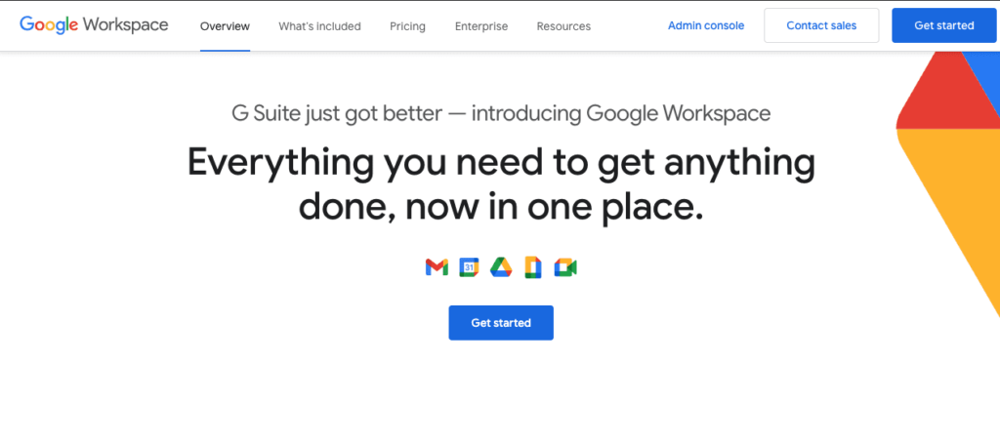
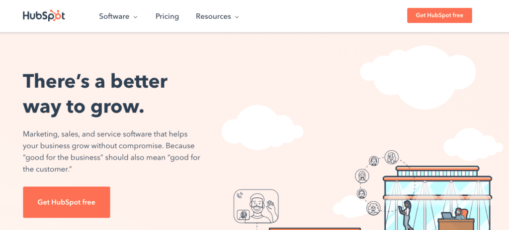
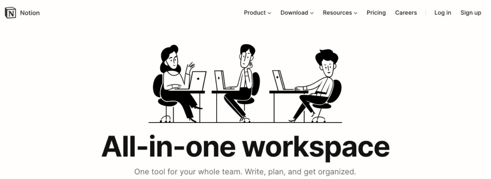
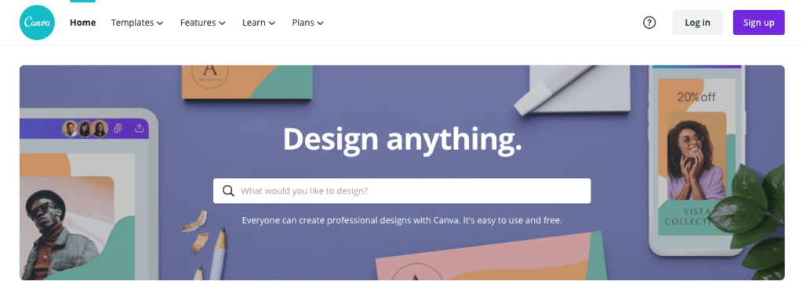
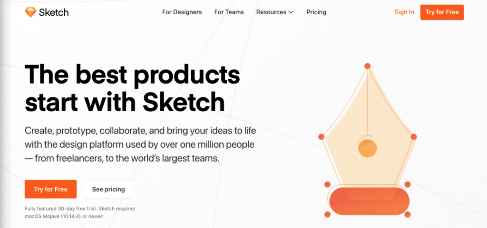
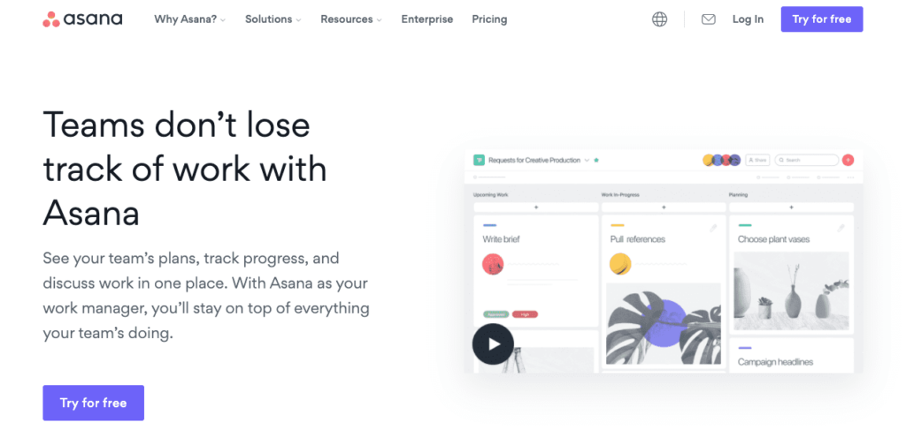
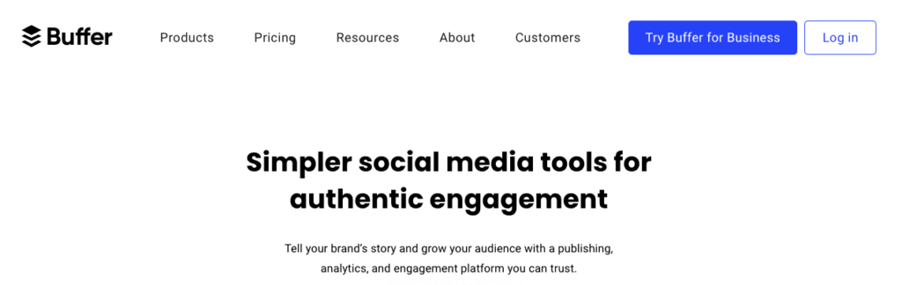
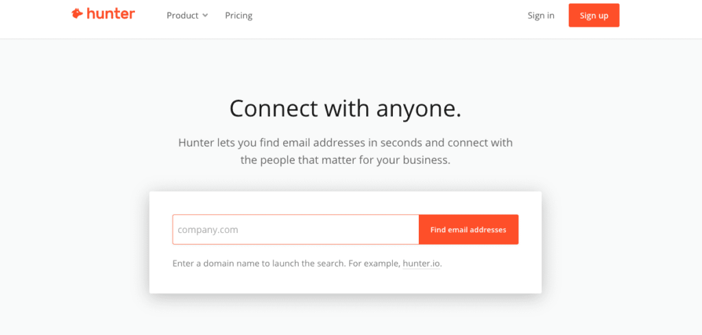
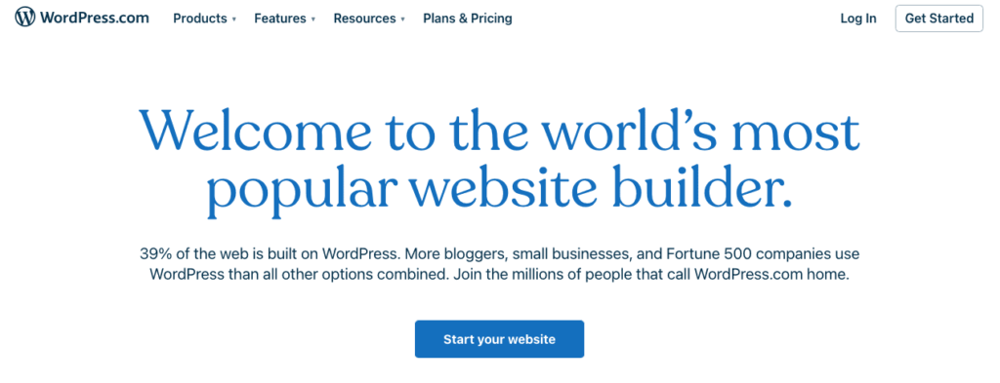

Think about someone you know. A family member, a friend, a colleague.

I'll bet that at some point you've heard that person say something like: " there aren’t enough hours in the day."

For an entrepreneur that's an everyday rule.

Marketing. Product Development. That quick chat but turned into an hour-long meeting. Remembering to eat.  Enhancing your social media presence. Project Management. The list goes on.

Luckily, there are a plethora of tools for entrepreneurs out there to keep you organised and make life easier.

Slack for easy communication, Trello to stay on track of tasks, LinkedIn to build your network, the list goes on.

So I reached out to some entrepreneurs in my network, to find out which tools they can’t live without.

/\* widget: Blog: Expert Tip \*/ /\* reset -------------------- \*/ .blog-custom-block \*, .blog-custom-block ::before, .blog-custom-block ::after {  box-sizing: border-box;  border-width: 0;  border-style: solid;  border-color: #e5e7eb; } /\* vars -------------------- \*/ .blog-custom-block.blog-custom-block\_\_expert-tip {  --color-bg: #F4FAFE;  --color-border: rgb(15 164 234 / 0.50);  --color-text-1: #0F172A;  --color-text-2: #4A4A68; } /\* colors -------------------- \*/ .blog-custom-block.blog-custom-block\_\_expert-tip .bg-clr-bg {  background-color: var(--color-bg); } .blog-custom-block.blog-custom-block\_\_expert-tip .border-clr-border {  border-color: var(--color-border); } .blog-custom-block.blog-custom-block\_\_expert-tip .text-clr-text-1 {  color: var(--color-text-1); } .blog-custom-block.blog-custom-block\_\_expert-tip .text-clr-text-2 {  color: var(--color-text-2); } /\* utils -------------------- \*/ .blog-custom-block.blog-custom-block\_\_expert-tip .flex {  display: flex; } .blog-custom-block.blog-custom-block\_\_expert-tip .flex-shrink-0 {  flex-shrink: 0; } .blog-custom-block.blog-custom-block\_\_expert-tip .flex-col {  flex-direction: column; } .blog-custom-block.blog-custom-block\_\_expert-tip .gap-4 {  gap: 1rem; } .blog-custom-block.blog-custom-block\_\_expert-tip .gap-5 {  gap: 1.25rem; } .blog-custom-block.blog-custom-block\_\_expert-tip .rounded-xl {  border-radius: 0.75rem; } .blog-custom-block.blog-custom-block\_\_expert-tip .border {  border-width: 1px; } .blog-custom-block.blog-custom-block\_\_expert-tip .p-8 {  padding: 2rem; } .blog-custom-block.blog-custom-block\_\_expert-tip .text-3xl {  font-size: 1.875rem;  line-height: 2.25rem; } .blog-custom-block.blog-custom-block\_\_expert-tip .text-lg {  font-size: 1.125rem;  line-height: 1.75rem; } .blog-custom-block.blog-custom-block\_\_expert-tip .font-bold {  font-weight: 700; } 

Full Transparency

This article does **not** contain affiliate links. Meaning neither I nor Altar.io receives any commission if you should choose to use any of the tools for entrepreneurs listed here. This list was created based on personal recommendations, the recommendations of entrepreneurs I work with.

.elementor-12941 .elementor-element.elementor-element-e56f4e6{--display:flex;--flex-direction:column;--container-widget-width:100%;--container-widget-height:initial;--container-widget-flex-grow:0;--container-widget-align-self:initial;--background-transition:0.3s;}.elementor-12941 .elementor-element.elementor-element-f8d1905{--box-background-color:var( --e-global-color-f6f9b04 );--box-border-color:var( --e-global-color-secondary );--box-border-width:1px;--box-border-radius:12px;--box-padding:12px;--header-color:var( --e-global-color-text );--separator-width:0px;--item-text-decoration:underline;--item-text-hover-decoration:underline;--marker-color:var( --e-global-color-primary );--marker-size:5px;}.elementor-12941 .elementor-element.elementor-element-f8d1905 .elementor-toc\_\_spinner{color:var( --e-global-color-secondary );fill:var( --e-global-color-secondary );}.elementor-12941 .elementor-element.elementor-element-f8d1905 .elementor-toc\_\_header, .elementor-12941 .elementor-element.elementor-element-f8d1905 .elementor-toc\_\_header-title{font-family:"Poppins", sans-serif;font-size:2.25rem;font-weight:700;text-transform:capitalize;line-height:1.2;}.elementor-12941 .elementor-element.elementor-element-f8d1905 .elementor-toc\_\_list-item{font-family:var( --e-global-typography-45f602c-font-family ), sans-serif;font-size:var( --e-global-typography-45f602c-font-size );font-weight:var( --e-global-typography-45f602c-font-weight );line-height:var( --e-global-typography-45f602c-line-height );letter-spacing:var( --e-global-typography-45f602c-letter-spacing );word-spacing:var( --e-global-typography-45f602c-word-spacing );}.elementor-12941 .elementor-element.elementor-element-f8d1905 > .elementor-widget-container{padding:32px 32px 32px 32px;}@media(max-width:1024px){.elementor-12941 .elementor-element.elementor-element-f8d1905 .elementor-toc\_\_list-item{font-size:var( --e-global-typography-45f602c-font-size );line-height:var( --e-global-typography-45f602c-line-height );letter-spacing:var( --e-global-typography-45f602c-letter-spacing );word-spacing:var( --e-global-typography-45f602c-word-spacing );}}@media(max-width:767px){.elementor-12941 .elementor-element.elementor-element-f8d1905 .elementor-toc\_\_list-item{font-size:var( --e-global-typography-45f602c-font-size );line-height:var( --e-global-typography-45f602c-line-height );letter-spacing:var( --e-global-typography-45f602c-letter-spacing );word-spacing:var( --e-global-typography-45f602c-word-spacing );}}

#### Contents

## The Tools Entrepreneurs Can’t Live Without

### 1\. Adi Azaria, CEO of [Workiz Inc.](https://www.linkedin.com/company/workizinc/)

Workiz Inc. is a SaaS CRM platform for small to medium-sized on-demand field service businesses, such as locksmith services, carpet cleaning and appliance repair.

**Tool Choice**: _“_[**_MixMax_**](https://www.mixmax.com/)_,_ [**_Canva_**](https://www.canva.com/en_gb/) _and_ [**_Headspace_**](https://www.headspace.com/)_.”_

### 2\. Alon Hendelman,Co-Founder & CEO of [Engie](https://www.linkedin.com/company/engie1/)

Engie is a connected car maintenance solution for every car on the road. Engie's technology provides fault diagnostics and maintenance information in a simple way.  

As well as being the Co-Founder of Engie, Alon is a Forbes 30 Under 30 Entrepreneur.

**Tool Choice**: _“_[**_Trello_**](https://trello.com/)_,_ [**_Google Drive_**](https://workspace.google.com/) _and_ [**_WhatsApp_**](https://www.whatsapp.com/?lang=en)_.”_

### 3\. André Lopes, Co-Founder of [Altar.io](https://altar.io/)

Before co-founding Altar.io André built Table & Friends, a themed dinner & social restaurant booking platform that allowed anyone to create their own event, lock in a discount (10-50%), book a table within 3500 restaurants and invite friends for the dinner event.

**Tool Choice**: _“I use_ [**_WhatsApp_**](https://www.whatsapp.com/?lang=en) _with long term clients, teams and even interviews._

_My overall CRM with flexibility for almost anything that needs sorting is_ [**_Google Sheets_**](https://workspace.google.com/) _from recruiting to finance management._

_For inspiration and learning my go to's are_ [**_Kindle_**](https://www.amazon.com/Kindle-Now-with-Built-in-Front-Light/dp/B07978J597) _(I read one book a month on average via Kindle) and_ [**_Twitter_**](https://twitter.com/?lang=en)_.”_ 

### 4\. Bar Mor,  Co-Founder & CEO of [Agora](https://www.agorareal.com/)

Agora is a designated Investment management SaaS solution for real estate investment firms and funds.

**Tool Choice**: _“_[**_Notion_**](https://www.notion.so/)_,_ [**_Hubspot_**](https://www.hubspot.com/) _&_ [**_Seamless_**](https://www.seamless.com/)_.”_

### 5\. Dotan Galron, Project Management at [Asurion](https://www.asurion.com/)

Asurion is the go-to solution for all things tech – their Experts can repair, replace and resolve nearly any tech issue. They’re easy to reach via call, chat, and in-person, too.

**Tool Choice**: _“My core stack includes,_ [**_Slack_**](https://slack.com/)_,_ [**_Notion_**](https://www.notion.so/)_,_ [**_Figma_**](https://www.figma.com/)_.”_

### 6\. Dudley Gould, Founder of [Audapio](https://www.audapio.com/)

Audapio provides secure, real-time access to auditors clients’ bank statements directly from their bank, and provides stakeholders with advanced analytics.

**Tool Choice**: _“_[**_LinkedIn_**](https://www.linkedin.com/)_,_ [**_Spotify_**](https://www.spotify.com/) _&_ **_Boxing_**_. I think about work all the time – unless I’m boxing – it’s the only time I completely switch off. Oh, and_ [**_UberEats_**](https://www.ubereats.com/)_, I’m so busy I often forget I need to eat.”_

### 7\. Giacomo De Lorenzo - Founder of [Moneymour](https://www.linkedin.com/company/moneymour/)

Moneymour (acquired by [Klarna](https://www.klarna.com/us/)) can estimate people’s creditworthiness better than a bank, allowing instant, simple and transparent access to credit.

Their revolutionary credit scoring algorithm uses customers’ bank accounts information, enabled by PSD2, to make a highly informed decision in an instant.

**Tool Choice:** _“Here are the tools I can’t live without –_  [**_LinkedIn_**](https://www.linkedin.com/) _for anything, from networking with investors and partners to new hires._ 

[**_Mailtrack_**](https://mailtrack.io/en/)_, a Gmail plugin to see opens and clicks for my emails. It’s the best litmus test for interest._ 

**_[Google Workplace](https://workspace.google.com/), mainly for spreadsheets_**  

### 8\. Hector Quintanilla, Founder of [Be Business Smart](https://www.bebusinesssmart.com/3pillars)

Hector Quintanilla is a Startup Expert, Investor, Mentor & Founder.

**_Tool Choice_**_: “My Thinking weapons: My_ **_Moleskine notebook_** _+ my three pens (black, blue, red)_

_The best way to brainstorming is WITHOUT distractions and electronics._

_I never use electronic devices when I want to solve a difficult problem or to be creative._

_My attention-grabbing weapons:_ [**_Quora_**](https://pt.quora.com/)_._

_I've been posting almost daily on Quora for years. Attention is the most valuable asset in today's world. You either pay for it (ads) or you gain it. Traffic without trust is extremely expensive._

_Get yourself out there!_

_My sales leads weapons:_ [**_Clickfunnels_**](https://www.clickfunnels.com/) _to create my landing page together with Mailchimp to track and keep in touch with those who are interested in what I have to offer them._

_DO NOT wait to have something to sell to start building your audience.”_

### 9\. Jan-Philipp Kruip, Co-Founder of [FitSense](https://www.linkedin.com/company/fitsense/)

FitSense is a B2B health and fitness fintech startup that is being used by some of the biggest multinational insurance companies in the world.

**Tool choice:** _“I’ve become a big fan of_ [**_Miro_**](https://miro.com/) _which is a great way to workshop efficiently remotely._

**_Pen & paper_**_: my brain works differently when I scribble down my ideas and can mind map_

[**_Audible_**](https://www.audible.com/) **_& podcasts_**_: I rarely have the time and patience to sit down and read but listening while I go for a walk or during commutes allows me to get so much input/stimulation”_

### 10\. Marco Caputo, Founder of [Hotbox Food](https://www.linkedin.com/company/hotboxfood/)

Hotbox Food has invented and patented a novel technology that allows you to transport food at 85ºC with a dehumidifier to extract the excess steam that makes food soggy.

This allows delivery companies to keep food hot for over 40mins while keeping the quality high.

**Tool Choice**: “_There are three tools I use on a daily basis, they’re without a doubt my holy grails. The first is [**Hubspot**](https://www.hubspot.com/)._  _I use it for basically anything to do with customers, it just makes my life easier._ 

_The next is my notebook. I have a little_ **_Moleskine notebook_** _that is with me everywhere I go. I tend to write things down or create a quick sketch before putting it online._ 

_Finally, is my_ **_water bottle_**_. I tend to drink with a certain frequency, it basically gives me a daily rhythm.”_ 

### 11\. Maria Rybak, Founder & CEO of [PVLSE](https://thepvlse.com/)

PVLSE is a passion economy platform that enables users to monetise their skills and start their “side-hustle”. The company provides an all in one solution for users offering online and offline services, with a built-in billing engine, booking engine, custom portfolio and more.

**Tool Choice**: _“My picks are_ [**_Slack_**](https://slack.com/)_,_ [**_Zoom_**](https://zoom.us/) _and_ [**_Google Drive_**](https://workspace.google.com/)_.”_

### 12\. Nelly Yusupova – Founder of [TechSpeak](https://www.techspeakforentrepreneurs.com/)

TechSpeak for Entrepreneurs is an online platform that teaches entrepreneurs the most efficient and effective way to manage development teams and projects.

Nelly is a CTO, Startup Advisor and Entrepreneur with 18 years of industry experience.

**Tool Choice:** _“Here are the tools I use all the time._ [**_Adobe XD_**](https://www.adobe.com/products/xd.html) _or_ [**_Sketch_**](https://www.sketch.com/) _for prototyping._ [**_Calendly_**](https://calendly.com/) _for more efficient scheduling._ [**_Optimizely_**](https://www.optimizely.com/) _for A/B testing.”_ 

### 13\. Paolo Dotta, Co-Founder of [Altar.io](https://altar.io/)

Before building Altar.io, Paolo built Venga - a Social Events Marketplace to enable hosts and participants to come together at amazing events such as themed dinners and retreats.

**Tool Choice**: _“ The first one has to be_ [**_Google Workspace_**](https://workspace.google.com/)_. Moving from banking, where everything was Excel-based, to the collaborative workflows of the startup ecosystem changed my life._ 

_The next has got to be my_ [**_Kindle_**](https://www.amazon.com/Kindle-Now-with-Built-in-Front-Light/dp/B07978J597)_. I take over 60 flights a year, and having my entire library in one, easy to use device is amazing._ 

_Finally, my **notebook**. I use it to note down ideas for everything from presentations, to spreadsheets, to documents.”_

### 14\. Paul O’Brien, CEO & Founder of [MediaTech Ventures](https://mediatech.ventures/)

MediaTech Ventures is a venture development group and holding company connecting innovation with capital.

**Tool Choice**: _“_**_Analytics_**_,_  [**_LinkedIn_**](https://www.linkedin.com/) _&_ **_Coffee_**_!”_ 

### 15\. Yaron Samid, Founder of [TechAviv](https://www.techaviv.com/)

TechAviv is one of the largest founder clubs in the world.

Yaron is a multi-exit founder whose companies have been acquired by the likes of Microsoft and Cisco, to name but two.

Yaron is also a regular lecturer at Stanford and Columbia business schools.

**Tool Choice**: _“The ones I couldn’t live without?_ [**_Airtable_**](https://airtable.com/)_,_ [**_Google Workspace_**](https://workspace.google.com/)_,_ [**_Trello_**](https://trello.com/)_,_ [**_WhatsApp_**](https://www.whatsapp.com/?lang=en) _&_ [**_Superhuman Email_**_._](https://superhuman.com/)_”_

### 16\. Doron Myersdorf, Co-Founder CEO of [StoreDot](https://www.store-dot.com/)

StoreDot is a battery developer currently working on extreme fast charging for electric vehicles.

The company’s FlashBattery technology allows you to fully charge an electric car in five minutes.

**Tool Choice**: _“_**_Strong team_**_,_ **_innovation across the board_** _and a_ **_go big or go home attitude_**_.”_

### 17\. Gal Nachum, Co-Founder & Chairman of [CogniShape](https://www.cognishape.com/)

Gal is an entrepreneur, seven-time founder, startup mentor and advisor.

His company CogniShape empowers seniors to strengthen their mind and sharpen their memory through a series of daily brain exercises.

**Tool Choice**: “[**_LinkedIn_**](https://www.linkedin.com/)_,_ [**_OneNote_**](https://www.microsoft.com/pt-pt/microsoft-365/onenote/digital-note-taking-app?ms.url=onenotecom&rtc=1)_,_ [**_Todoist_**](https://todoist.com/)_.”_

### 18\. Elad Walach, Co-Founder & CEO of [Aidoc](https://www.aidoc.com/).

Aidoc is a medical company that utilises AI to flag abnormalities in the radiology workflow.

Aidoc eases the work list and frees up time allowing radiologists to pay attention to what matters.

**Tool Choice:** “_For me, it’s the obvious ones_ [**_Salesforce_**](https://www.salesforce.com/eu/)_,_ [**_Monday_**](https://monday.com/) _and_ [**_Slack_**](https://slack.com/)_._ 

### 19\. Doron Ben-David, CEO and Co-Founder of [Indoor Robotics](https://www.indoor-robotics.com/)

Indoor Robotics is on a mission to create a better, more convenient world using robotics.

Their first step to complete this mission is Tando, the first indoor drone fleet that carries out security, inspections and operational tasks.

Doron is also the co-founder of Israel robotics and a seasoned CTO.

**Tool Choice:** _“_[**_G Suite_**](https://workspace.google.com/) _for almost everything,_ [**_Jira_**](https://www.atlassian.com/software/jira) _for product and R&D,_ [**_Salesforce_**](https://www.salesforce.com/eu/) _for CRM.”_ 

### 20\. Gal Bareket, Founder and CEO of [Routier](https://www.routier.io/)

Routier is an “all in one” AI Operations and Marketing Platform for the hospitality industry.

Features include back of house ticketing systems, seamless guest engagement, a full digital marketing platform, performance analytics and much more.

**Tool Choice:** _“_[**_WhatsApp_**](https://www.whatsapp.com/?lang=en)_,_ [**_Slack_**](https://slack.com/)_,_ [**_Asana_**](https://asana.com/)_.”_

### 21\. Lior Moyal, CEO of [Kitov.ai](https://www.kitov.ai/)

Kitov.ai is a platform that empowers robots to perform automated visual 3D inspection by leveraging machine learning and artificial intelligence.

Lior is a serial entrepreneur with executive-level experience in sales, business development, product and marketing.

**Tool Choice:** _“_[**_Zoom_**](https://zoom.us/)_,_ [**_LinkedIn_**](https://www.linkedin.com/)_,_ [**_WhatsApp_**](https://www.whatsapp.com/?lang=en)_”_

### 22\. Jacob Ner-David CEO & Co-Founder of [Vinsent](https://vinsent.wine/)

Vinsent is a marketplace that enables wineries to connect directly to their clients.

The platform enables early access to fine wines at an exclusive price – enabling users to become part of the winemaking story.

Jacob is a serial entrepreneur who’s been working on bringing disruption to the wine industry for the past decade. As part of that, he is now managing partner of VinoVentures –  allowing people to pool capital and generate short and long-term capital gains within the wine industry.

**Tool Choice:** “**_Email_**_: the most universal social network._ [**_LinkedIn_**](https://www.linkedin.com/)_: for business, best quick cheat as to someone’s background._ [**_Slack_**](https://slack.com/)_: it simply became a business chat default. Tremendous room for improvement but the MVP was good enough and that’s what we still have!”_

### 23\. Lia Kislev, Founder of [Wishi](https://www.wishi.me/)

Wishi is for anyone who’s ever thought “I wish I had a stylist”. They help you build a wardrobe from scratch with their expertise and personalised analysis.

Lis is a serial entrepreneur and specialist in marketing, business development and community development and management.

**Tool Choice:** _“Sure! I couldn’t live without_ [**_Jira_**](https://www.atlassian.com/software/jira)_,_ [**_Slack_**](https://slack.com/) _and_ [**_Zeplin_**](https://zeplin.io/)_._

### 24\. Lior Sion, Founder of [Bringg](https://www.bringg.com/)

Bringg is the #1 unified delivery and fulfilment cloud solution. It rapidly improves your delivery capacity, pickup services, and customer experience on a large scale.

Lion is a founder and executive of a number of unicorn companies. On top of this, he is an advisor and investor.

**Tool Choice:** _“_**_Email_**_,_ [**_Google Docs_**](https://workspace.google.com/)_,_ [**_WhatsApp_**](https://www.whatsapp.com/?lang=en)_. Those are the basic building blocks of communication. Real-time (WhatsApp), asynchronous (email) and in-depth (docs),_

##### Do you have a brilliant startup idea that you want to bring to life?

From the product and business reasoning to streamlining your MVP to the most important features, our team of product experts and ex-startup founders can help you bring your vision to life.

Let's Talk

## Detailed Overview of the Tools for Entrepreneurs

Here’s a detailed rundown of all of the tools for entrepreneurs mentioned above, aside from the obvious ones like coffee and a notebook, as well as a few extras based on our experience.

### 1\. Trello

[Trello](https://trello.com/) is, by far, one of the easiest ways to organise, assign and keep track of tasks as a team. It’s one of the most popular project management tools for entrepreneurs on the market.

It follows the [Kanban structure](https://medium.com/paymo/12-kanban-board-examples-for-beginners-d56cee5df832#:~:text=A%20basic%20Kanban%20board%20structure,as%20your%20chosen%20workflow%20allows.), allowing you to organise projects into topics (or boards as Trello calls them). In each board, you and your team members can create cards for specific tasks and track its progress.

As well as being fantastic for project management, this tool for entrepreneurs can be used for brainstorming, agenda planning, and any other list-based activities.

#### Pricing

Trello operates a “freemium model”. The free tier provides all the functionalities you’ll need as a small startup team.

When it’s time to upgrade they offer a “Business Class” model for $9.99 per user per month, which unlocks additional admin & security features, integrations and automation.

### 2\. Google Workspace – Formerly G Suite

[Google Workspace](https://workspace.google.com/) is Google’s suite of apps. It’s one of the dream tools for entrepreneurs for its many, unparalleled benefits

#### Gmail

It all starts with Gmail, arguably the most popular email client in the world. When you upgrade Gmail through Google Workspace, you get an enhanced version of the client, and the ability to create email addresses with your business domain.

#### Google Calendar

Organisation is key to successful entrepreneurship. And google calendar is one of those tools many of us couldn’t live without.

One of the great things about using Google Calendar with a Google Workspace subscription is the ability to create multiple calendars that are accessible by everyone in your company.

So whether it’s setting deadlines, company-wide reminders or scheduling calls, you can keep your team up to date from one shared source of truth.

#### Drive, Docs, Sheets & Slides

Google’s version of Microsoft Office 365, Drive offers a one-stop-shop to create, save & share documents, spreadsheets & presentations.

With the ability to edit as a team in real-time, it’s a tool we use at Altar.io every day.

Whether you’re writing blog content, crunching the numbers, drafting website copy or creating a presentation for your next investment pitch,  Google Workplace makes it simple and easy to collaborate as a team.

#### Google Meet

In the age of the video call, Google Meet is invaluable. It’s easy to integrate with Google Calendar, it offers screen sharing, video & audio recording (on mid-tier plans and above) and is accessible on iOS and Android devices.

A major benefit of Google Meet is that it’s included in the Google Workspace price, so you don’t have to pay a separate fee just for video conferencing.

#### Pricing

Google Workplace start’s at $6 per user per month on their _Business Starter_ plan. For $6 you get 100 participant video meetings, 30GB cloud storage per user & 24/7 support.

The most popular subscription, however, is _Business Standard._ 

It’s double the price at $12 per user per month. But enables you to record video meetings (with up to 150 participants) and gives you a whopping 2TB of cloud storage per user.

At 18$ per user per month, you can upgrade to _Business Plus_ which unlocks 250 participant video meetings + recording and attendance tracking, as well as 5TB of cloud storage per user.

They also offer an _Enterprise_ plan which adds noise cancellation and in-domain live streaming to Google Meet and as much storage per user as you need per user.

### 3\. MailChimp

[MailChimp](https://mailchimp.com/) is one of the markets leading email tools for entrepreneurs.

Email marketing is a time-tested strategy for both B2B & B2C companies. And MailChimp makes it easy to create professional, well-designed newsletters. So all you need to focus on is the copy.

#### Pricing

The free version gives you all the tools you need to grow your audience. This includes a website builder with built-in marketing tools and integrations.

The premium versions, starting at $9.99/month open the door to email templates, custom branding, A/B testing and 24/7 support.

### 4\. Google Analytics

[Google Analytics](https://analytics.google.com/analytics/web/provision/#/provision) helps you track the incoming traffic to your website. It’s by far one of the most useful marketing tools for entrepreneurs.

Essentially, it allows you to see what’s working and what’s not. This crucial information can help you create better marketing campaigns and increase your conversion rate.

#### Pricing

Google Analytics is free as long as one of your website pages doesn’t exceed 5M [impressions](https://support.google.com/webmasters/answer/7042828?hl=en) per month.

### 5\. Hubspot CRM

[Hubspot](https://www.hubspot.com/) is one of the most popular customer relationship management platforms on the market.

The platform centralises your contacts and offers a range of features that make expediting sales and marketing workflows convenient and easy.

One of the reasons Hubspot is so popular is because of its shallow learning curve. It’s extremely easy to use and isn’t as complex as other CRM alternatives.

#### Pricing

The free version of Hubspot offers a powerful range of tools that will help you build landing pages and manage your contacts & website activity – to name but two.

At $50 per month, you can upgrade to the marketing and sales starter bundle unlocking additional features including ad retargeting, reporting dashboards & automations.

### 6\. Slack

[Slack](https://slack.com/) is one of the go-to tools for entrepreneurs and their teams. The communication tool makes it easy to reach out to your colleagues in both group conversations and direct messages.

Features include the ability to create channels, to organise discussion by topic, voice calls and video calls (for premium users). One of the benefits of using Slack is its integration with other tools (such as Trello & Google Workplace).

For example, if a colleague shares a file with you via google drive, Slack will notify you the moment it happens. Or allow you to edit tasks on Trello directly from Slack.

Slack offers apps for iOS, Android, PC & Mac. It can also be used directly from the browser.

#### Pricing

Slack offers a free plan for teams of any size, allowing you an archive of up to 10k recent messages, 10 integrations and 1:1 voice and video calls with teammates.

For $6.67 per active user per month, you get the full archive of chats, unlimited integrations and group voice and video calls of up to 15 people.

If you choose Slack’s _Plus_ subscription you will gain access to advanced identity management and 24/7 support. The _Plus_ subscription comes in at  $12.50 per active user per month.

### 7\. Zoom

[Zoom](https://zoom.us/) has quickly become one of the most used communication tools for entrepreneurs on the planet.

It offers video and web conferencing, cross-platform messaging and file-sharing features. It supports screen sharing, recording and HD audio & visual quality.

#### Pricing

Zoom is free for 40-minute group meetings with up to 100 participants. On the free plan, you can also host 1:1 meetings with no time limit.

Zoom’s _Pro_ plan starts at $14.99 per license per month. On this plan, the time cap on group meetings is removed. You also get 1GB of cloud recording per license and the ability to stream in social media.

### 8\. Notion

From note-taking to kanban boards, [Notion](https://www.notion.so/) is one of the best all-in-one tools for entrepreneurs.

It’s adaptable to any type of team from software development and design to marketing and HR.

The only notable downside to Notion is that it can be tough to get started. It's so customisable that you're greeted with a lot of options. When we first started using it at Altar, there was a definite learning curve. That being said, once you've become accustomed to how the tool works, you won't look back. Also, there’s a huge community of users all with tips and tricks on how to get going.

#### Pricing

Notion provides everything you need to get organised for free, with a _Personal Pro_ plan starting at $4 per month.

Their _Team_ plan starts at $8 per member per month and includes unlimited team members and a collaborative workspace.

### 9\. LinkedIn

[LinkedIn](https://www.linkedin.com/) is one of the best tools for entrepreneurs to build their professional network.

It enables entrepreneurs an unprecedented ability to locate and connect with a variety of stakeholders. Investors, employees, partners, customers are all with reach for practically zero cost.

#### Pricing

LinkedIn is completely free to use but offers several premium plans.

Arguably the best premium plan for entrepreneurs is their Business plan. It gives you access to InMail messages allowing you to contact anyone even if you’re not connected. As well as profile views and business insights.

### 10\. Adobe Express

Adobe Express is a professional-grade tool for entrepreneurs, offering a user-friendly platform for graphic design, featuring customizable templates, a rich stock image library, and powerful design elements to create professional visuals quickly.

A key feature of Adobe Express is its video editing capability. Users can [edit videos with Adobe Express](https://www.adobe.com/express/feature/video/editor) using straightforward tools that simplify video adjustments and enhancements, ideal for social media and marketing videos.

The platform connects easily with other Adobe services, such as Adobe Stock and Creative Cloud, ensuring a consistent experience across all creative projects. Adobe Express is available for iOS, Android, PC, and Mac, and can be accessed directly through a web browser.

Pricing

Adobe Express offers a free tier with basic tools and templates. The premium plan costs $11.99 a month and includes premium templates, extensive editing features, and bespoke branding tools, which are ideal for improving business communications and brand presence.

### 11\. Canva

[Canva](https://www.canva.com/) is an easy-to-use, no-experience-required graphic design platform. It’s one of the essential tools for entrepreneurs looking to create graphic elements for everything from social media to infographics.

It’s a simple, drag-and-drop tool that offers a library of over one million photos, graphic elements and fonts.

#### Pricing

Canva is committed to being free to use, forever. On the free plan, you gain access to 250k+ templates and over 100 design types. You will also get 5GB of cloud storage and the ability to invite members to your team.

The _Pro_ version is $12.95 a month for up to five people. The _Pro_ plan allows you to create a brand kit, with custom fonts and logos. It also gives you access to 420k free templates, 100GB of cloud storage and over 75M stock photos, videos and graphics.

You can also schedule and publish social media content to seven platforms, directly from Canva.

### 12\. Miro

[Miro](https://miro.com/) is one of the go-to tools for entrepreneurs for collaboration. The digital whiteboard is a must-have for any teams working remotely.

It allows teams to brainstorm together in real-time. With features like pre-built templates, freeform digital pens and wireframing – all built on an “infinite canvas” you can keep throwing out ideas until you find your diamond.

#### Pricing

The free version of Miro allows you to have unlimited team members and up to three editable boards. It includes all the premade templates and board integrations.

Starting at 8$ a month, the premium features include unlimited boards, project organisation. Custom template, Kanban frameworks, remote meetings toolkit, and much more.

### 13\. ClickFunnels

[ClickFunnels](https://www.clickfunnels.com/) is a landing page builder that focuses on building a sales funnel for your business.

It boasts an easy-to-use drag-and-drop editor, A/B testing capabilities and integrations to email and payment platforms.

As tools for entrepreneurs go, this one has proven extremely popular. In the words of [Forbes](https://www.forbes.com/sites/robertadams/2017/05/16/this-entrepreneur-built-a-360-million-dollar-saas-business-and-it-was-entirely-self-funded/?sh=1bf2c4cbbed3), ClickFunnels is “silently revolutionizing the online marketing industry.”

It's easy to use and focuses on making you money.

#### Pricing

ClickFunnels offers a 14-day free trial, with pricing starting at $97 per month. With this option, you can build up to 20 funnels across 100 pages and up to three domains.

$297 will get you unlimited funnels across unlimited pages, with the ability to connect to up to nine domains.

### 14\. Quora

[Quora](https://www.quora.com/) is one of the most popular Q&A platforms on the web. It’s quickly become one of the best tools for entrepreneurs to ask their target users questions, and drive business growth.

Many entrepreneurs leverage Quora by:

- Asking customers to post questions related to their product, so it’s seen by a larger community.
- Identifying topics relevant to their business
- Using quora as a customer support & marketing platform

#### Pricing

Quora is free to use and offers advertising on a CPC bidding system.

  --e-global-typography-text-font-size );line-height:var( --e-global-typography-text-line-height );}.elementor-3329 .elementor-element.elementor-element-70fbc6a .elementor-message{font-size:var( --e-global-typography-9730a4e-font-size );line-height:var( --e-global-typography-9730a4e-line-height );letter-spacing:var( --e-global-typography-9730a4e-letter-spacing );word-spacing:var( --e-global-typography-9730a4e-word-spacing );}}@media(max-width:767px){.elementor-3329 .elementor-element.elementor-element-99ebd14 .elementor-heading-title{font-size:var( --e-global-typography-0ff79ee-font-size );line-height:var( --e-global-typography-0ff79ee-line-height );letter-spacing:var( --e-global-typography-0ff79ee-letter-spacing );word-spacing:var( --e-global-typography-0ff79ee-word-spacing );}.elementor-3329 .elementor-element.elementor-element-70fbc6a .elementor-field-group > label{font-size:var( --e-global-typography-9730a4e-font-size );line-height:var( --e-global-typography-9730a4e-line-height );letter-spacing:var( --e-global-typography-9730a4e-letter-spacing );word-spacing:var( --e-global-typography-9730a4e-word-spacing );}.elementor-3329 .elementor-element.elementor-element-70fbc6a .elementor-field-group .elementor-field, .elementor-3329 .elementor-element.elementor-element-70fbc6a .elementor-field-subgroup label{font-size:var( --e-global-typography-text-font-size );line-height:var( --e-global-typography-text-line-height );}.elementor-3329 .elementor-element.elementor-element-70fbc6a .elementor-message{font-size:var( --e-global-typography-9730a4e-font-size );line-height:var( --e-global-typography-9730a4e-line-height );letter-spacing:var( --e-global-typography-9730a4e-letter-spacing );word-spacing:var( --e-global-typography-9730a4e-word-spacing );}}/\* Start custom CSS for form, class: .elementor-element-70fbc6a \*/.elementor-3329 .elementor-element.elementor-element-70fbc6a input {  border-color: #65639C !important; } .elementor-3329 .elementor-element.elementor-element-70fbc6a input:is(:focus, :hover) {  border-color: #B9B8CE !important; }/\* End custom CSS \*/

   Full Name  Business Email  Subscribe

### 15\. Adobe XD

[Adobe XD](https://www.adobe.com/products/xd.html) is a vector-based design tool for websites and apps.

This user-experience design tool is quickly becoming one of the most popular on the market for wireframing and prototyping. One of the reasons for this is the easy-to-use interface and cross-platform support Adobe offers.

#### Pricing

Adobe XD starts at $9.99 for professionals and small teams. However, as it is part of the Adobe Creative Cloud you can choose to subscribe to full suite of apps (including Photoshop & Illustrator) for $52.99 a month.

### 16\. Sketch

A competitor to Adobe XD, [Sketch](https://www.sketch.com/) is a digital design tool for mobile, wearable & web apps and icon design.

Sketch is currently one of the leading tool for UX/UI design. It can be used for everything from prototyping and wireframing to creating vector illustrations and social media images.

#### Pricing

Sketch offers a free 30-day trial. Once you’ve completed the trial you can buy a personal license at a one-time fee of $99.

If you plan to use Sketch as a team, it will set you back $99 per year per contributor.

### 17\. Optimizely

[Optimizely](https://www.optimizely.com/) is “the world's leading experience optimization platform.”

It has a long list of features, for everything from product & marketing to Engineering and Data. But one of the most popular is its A/B testing feature.

Optimizely allows you to easily collect and track data through their platform as you carry out A/B testing.

#### Pricing

Optimizely’s Pricing plans are available on request.

### 18\. Asana

[Asana](https://asana.com/), like Trello, is a project management tool for entrepreneurs and businesses.

There is a steeper learning curve with Asana than with Trello. That being said, Asana offers some more powerful tools for delegating tasks and managing multiple projects.

It comes down to taste. Asana also offers a freemium model, so there’s no harm in trying out both to determine which is better for your startup, before implementing it.

#### Pricing

Asana’s basic model is free for up to 15 people and will give you everything you need as a small team.

The premium plan will set you back $10.99 per user per month (billed annually) and offers advanced reporting, project timelines, dashboards and more.

Moving to the Business plan will get you everything in the premium plan plus portfolios and advanced integrations. The business plan comes in at $24.99 per user per month (billed annually)

As with many of the tools for entrepreneurs in this list, Asana offers an enterprise model for a more customisable plan, with prices on request.

### 19\. Calendly

[Calendly](https://calendly.com/) allows you to easily schedule meetings by simply sharing a link, and has quickly become one of the must-have tools from entrepreneurs.

Calendly’s simple yet effective interface allows you to sync multiple calendar accounts and block out the hours you’re available.

When a meeting is booked it sends out an automatic invite to both parties. The tool can integrate with several major video conferencing apps (including Zoom).

More than this, you can create a widget of your calendar and include it on your website, so potential clients can book a call with ease.

#### Pricing

The basic feature is free and includes all the features needed to set up one on one meetings.

The premium version, starting at $8 a month, allows you to book group events, pooled availability options for teams and add custom branding to Calendly widgets.

### 20\. Buffer

[Buffer](https://buffer.com/) allows you to take your social media game to the next level.

It’s one of the best tools for entrepreneurs looking to easily schedule, publish and analyse social media content.

Buffer integrates with Instagram, Facebook, Twitter, LinkedIn & Pinterest.

#### Pricing

When signing up to Buffer you will be asked to start a 14-day free trial for one of their paid plans. However, after the trial, you may downgrade to the free basic account.

- The free plan allows you to schedule 10 posts a month across three social channels of your choice.
- For $15 a month, you can schedule 100 posts across eight channels.
- For $65 a month, you can schedule 2,000 posts across eight channels.
- For $99 a month, you can schedule 2,000 posts across 25 channels.

### 21\. Hunter.io

[Hunter.io](https://hunter.io/) allows you to discover business emails quickly and easily.

By simply inputting a company name into the search bar, Hunter.io will find any email address associated with the URL.

This is one of the most powerful tools for entrepreneurs to connect with relevant contacts. Hunter.io has over 200 million indexed email addresses in its database and offers a handy chrome extension for free.

#### Pricing

Hunter.io is free for up to 50 searches a month.

The premium plans start at $49 per month and allow you to increase your searches per month, depending on the plan. They also offer premium features such as bulk domain search.

### 22\. WordPress

[WordPress](https://wordpress.com/) is the world's most popular website builder and CMS on the market, powering [43.2](https://www.manaferra.com/wordpress-statistics/)% of the internet. All companies need a website, from startup to enterprise. And if you plan to build yours yourself, WordPress is a must-have tool.

WordPress offers social sharing features, design customisation, SEO tools and a vast range of widgets and plugins. It is the ideal place to start generating online traffic easily and cheaply

#### Pricing

It’s free to get started with WordPress, with premium plans starting at $8 a month. This plan allows you access to custom design tools and a custom domain name.

If you choose to upgrade to the business plan (at $25 a month, you gain access to 200GB of storage and the [list of features becomes immense](https://wordpress.com/pricing/).

### 23\. Salesforce

[Salesforce](https://www.salesforce.com/eu/) is one of the best Customer Relationship Management (CRM) solutions on the market. It’s used by some of the biggest companies in the world such as Unilever, Aston Martin & Virgin Media.

Salesforce changed the business model when it came to CRMs. Before Salesforce, CRM solutions were hosted on a company’s own server. This meant lengthy installation processes and a huge cost.

Salesforce disrupted the market by creating a cloud base SaaS solution. Today Salesforce has grown to become the fifth-biggest company in the world.

#### Pricing

The “Sales Essential” CRM solution starts from $25 a month, but plans extend to $300 a month for the “Unlimited” version.

## Wrapping Up

From writing content and publishing a website to keeping your schedule organised and staying in touch with your team, there is a tool on this list that can make your life easier.

They help you focus on what matters. Turning your vision into reality and building a successful business.

How about you? What tools do you use regularly that feel like lifesavers? Drop me a [message](https://www.messenger.com/t/jamie.russellcurtis) and let me know.
