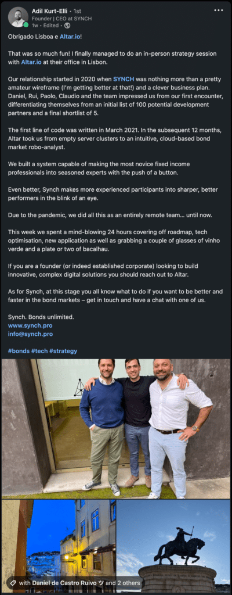
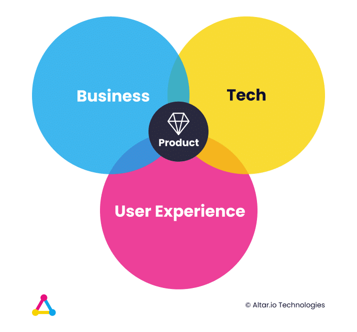

Since you're looking for information on how to choose the best software development company for you, I'll assume you did your reasoning on the matter of [in-house vs outsourcing](https://altar.io/should-a-startup-outsource-its-software-development/) and decided this is the best choice for your particular case.

Regardless, I'll still say that in most circumstances, finding a tech co-founder or a CTO is the idyllic option. Even if you end up working with an agency all the same. [More on that here](https://altar.io/whats-the-best-way-to-build-your-startup-cto-freelancers-agency/).

The problem is, this can take months of searching – and even then you can end up empty-handed – [this entrepreneur's story is living proof of that](https://altar.io/building-a-startup-without-a-technical-co-founder/).

If that's you, don't worry. The world won't be left without your product because of that - [and this story from a former managing director of HSBC turned entrepreneur is another testament to that](https://altar.io/finding-a-software-development-company-startup/).

Whatever the case, what actually matters is the people you do it with.

Whether it’s a CTO, a team of freelancers or an agency,  more than tech ability, they need to have full alignment and a shared vision for your startup.

Or, as I call it, philosophical alignment.

Let me give you an example of what I mean by this.

Let’s go back to the example from the HSBC guy to give you some more context.

Here’s what he had to say about his relationship with an agency:

In fact, he had even more to say about his experience, as the video below shows:

https://youtu.be/rVsP-54tMUk

It signals exactly what you need to look for – Alignment and the human element.

This is why it’s the first thing on my list of the six crucial things you should look for when working with a software development company.

.elementor-12941 .elementor-element.elementor-element-e56f4e6{--display:flex;--flex-direction:column;--container-widget-width:100%;--container-widget-height:initial;--container-widget-flex-grow:0;--container-widget-align-self:initial;--background-transition:0.3s;}.elementor-12941 .elementor-element.elementor-element-f8d1905{--box-background-color:var( --e-global-color-f6f9b04 );--box-border-color:var( --e-global-color-secondary );--box-border-width:1px;--box-border-radius:12px;--separator-width:0px;--box-padding:12px;--header-color:var( --e-global-color-text );--item-text-decoration:underline;--item-text-hover-decoration:underline;--marker-color:var( --e-global-color-primary );--marker-size:5px;}.elementor-12941 .elementor-element.elementor-element-f8d1905 .elementor-toc\_\_spinner{color:var( --e-global-color-secondary );fill:var( --e-global-color-secondary );}.elementor-12941 .elementor-element.elementor-element-f8d1905 .elementor-toc\_\_header-title{text-align:start;}.elementor-12941 .elementor-element.elementor-element-f8d1905 .elementor-toc\_\_header, .elementor-12941 .elementor-element.elementor-element-f8d1905 .elementor-toc\_\_header-title{font-family:"Poppins", sans-serif;font-size:2.25rem;font-weight:700;text-transform:capitalize;line-height:1.2;}.elementor-12941 .elementor-element.elementor-element-f8d1905 .elementor-toc\_\_list-item{font-family:var( --e-global-typography-45f602c-font-family ), sans-serif;font-size:var( --e-global-typography-45f602c-font-size );font-weight:var( --e-global-typography-45f602c-font-weight );line-height:var( --e-global-typography-45f602c-line-height );letter-spacing:var( --e-global-typography-45f602c-letter-spacing );word-spacing:var( --e-global-typography-45f602c-word-spacing );}.elementor-12941 .elementor-element.elementor-element-f8d1905 > .elementor-widget-container{padding:32px 32px 32px 32px;}@media(max-width:1024px){.elementor-12941 .elementor-element.elementor-element-f8d1905 .elementor-toc\_\_list-item{font-size:var( --e-global-typography-45f602c-font-size );line-height:var( --e-global-typography-45f602c-line-height );letter-spacing:var( --e-global-typography-45f602c-letter-spacing );word-spacing:var( --e-global-typography-45f602c-word-spacing );}}@media(max-width:767px){.elementor-12941 .elementor-element.elementor-element-f8d1905 .elementor-toc\_\_list-item{font-size:var( --e-global-typography-45f602c-font-size );line-height:var( --e-global-typography-45f602c-line-height );letter-spacing:var( --e-global-typography-45f602c-letter-spacing );word-spacing:var( --e-global-typography-45f602c-word-spacing );}}

#### Contents

## 1\. Alignment & “The Human Element”

I’ve already touched on this, but arguably the most crucial thing you should look for in a software development company is alignment and the human element.

You can find an agency that’s fantastic technically, but unless they align with your vision and mission, it may never be a truly successful relationship.

They need to be excited to be part of your startup journey. They need to get behind you, fly the flag and be obsessed with your product’s success.

People, in my opinion, are the most important aspect of your startup. And just because you’re not directly onboarding a software development company, as you would an employee, doesn’t mean that you shouldn’t look for the same soft skills you would in an employee. Or set up similar processes.

Commitment, drive, passion, responsibility, all these things are mandatory.

When you speak with them, do they:

- Sound passionate and emotionally invested?
- Act like someone you’d consider onboarding as a co-founder – or one of your internal team?
- Challenge your vision?
- Actively engage when you talk about your product?
- Do they really listen to understand the _why_ behind your startup?
- Is the communication open and transparent?

If not, walk away.

It’s as simple as that.

And if you’re on the fence as to whether or not they will get behind you after speaking with them, reach out to their clients. Ask them about all of the questions I’ve listed above.

/\* widget: Blog: Top Quote \*/  /\* reset -------------------- \*/  .blog-custom-block \*,  .blog-custom-block ::before,  .blog-custom-block ::after {  box-sizing: border-box;  border-width: 0;  border-style: solid;  border-color: #e5e7eb;  }  /\* vars -------------------- \*/  .blog-custom-block.blog-custom-block\_\_top-quote {  --color-bg: #F4FAFE;  --color-border: rgb(15 164 234 / 0.50);  --color-text-1: #0F172A;  }  /\* colors -------------------- \*/  .blog-custom-block.blog-custom-block\_\_top-quote .border-clr-border {  border-color: var(--color-border);  }  .blog-custom-block.blog-custom-block\_\_top-quote .bg-clr-bg {  background-color: var(--color-bg);  }  .blog-custom-block.blog-custom-block\_\_simple-quote .text-clr-text-1 {  color: var(--color-text-1);  }  /\* utils -------------------- \*/  .blog-custom-block.blog-custom-block\_\_top-quote .flex {  display: flex;  }  .blog-custom-block.blog-custom-block\_\_top-quote .flex-shrink-0 {  flex-shrink: 0;  }  .blog-custom-block.blog-custom-block\_\_top-quote .flex-col {  flex-direction: column;  }  .blog-custom-block.blog-custom-block\_\_top-quote .items-center {  align-items: center;  }  .blog-custom-block.blog-custom-block\_\_top-quote .gap-4 {  gap: 1rem;  }  .blog-custom-block.blog-custom-block\_\_top-quote .rounded-xl {  border-radius: 0.75rem;  }  .blog-custom-block.blog-custom-block\_\_top-quote .border {  border-width: 1px;  }  .blog-custom-block.blog-custom-block\_\_top-quote .p-8 {  padding: 2rem;  }  .blog-custom-block.blog-custom-block\_\_top-quote .text-center {  text-align: center;  }  .blog-custom-block.blog-custom-block\_\_top-quote .text-2xl {  font-size: 1.5rem;  line-height: 2rem;  }  .blog-custom-block.blog-custom-block\_\_top-quote .font-bold {  font-weight: 700;  } 

I can’t stress this enough, you need to work with a group of people, not a faceless organisation.

Take this example from another entrepreneur I know, Dudley Gould.

Like Adil, [he wrote about his experience working with an agency](https://altar.io/building-a-startup-without-a-technical-co-founder/). In the end, for him, the software development aspect wasn’t the only important thing he took away from the process:

/\* widget: Blog: Simple Quote \*/  /\* reset -------------------- \*/  .blog-custom-block \*,  .blog-custom-block ::before,  .blog-custom-block ::after {  box-sizing: border-box;  border-width: 0;  border-style: solid;  border-color: #e5e7eb;  }  /\* vars -------------------- \*/  .blog-custom-block.blog-custom-block\_\_simple-quote {  --color-accent: #0FA4EA;  --color-bg: #F4FAFE;  --color-text-2: #4A4A68;  }  /\* colors -------------------- \*/  .blog-custom-block.blog-custom-block\_\_simple-quote .bg-clr-bg {  background-color: var(--color-bg);  }  .blog-custom-block.blog-custom-block\_\_simple-quote .border-clr-accent {  border-color: var(--color-accent);  }  .blog-custom-block.blog-custom-block\_\_simple-quote .text-clr-text-2 {  color: var(--color-text-2);  }  /\* utils -------------------- \*/  .blog-custom-block.blog-custom-block\_\_simple-quote .flex {  display: flex;  }  .blog-custom-block.blog-custom-block\_\_simple-quote .flex-shrink-0 {  flex-shrink: 0;  }  .blog-custom-block.blog-custom-block\_\_simple-quote .flex-col {  flex-direction: column;  }  .blog-custom-block.blog-custom-block\_\_simple-quote .gap-4 {  gap: 1rem;  }  .blog-custom-block.blog-custom-block\_\_simple-quote .rounded-xl {  border-radius: 0.75rem;  }  .blog-custom-block.blog-custom-block\_\_simple-quote .border-l-6 {  border-left-width: 6px;  }  .blog-custom-block.blog-custom-block\_\_simple-quote .p-8 {  padding: 2rem;  }  .blog-custom-block.blog-custom-block\_\_simple-quote .text-xl {  font-size: 1.25rem;  line-height: 1.75rem;  }  .blog-custom-block.blog-custom-block\_\_simple-quote .italic {  font-style: italic;  } 

On my first call with Altar.io, my product owner spent two hours challenging me. He wanted to understand how strong the value proposition was and whether I had the resources, experience and network required to make it a success.

His experience developing dozens of products for the likes of McKinsey and various asset managers and MVPs for entrepreneurs is invaluable.

He has a lot of advice to offer and a lot of experience on the business development side.

## 2.  Portfolio & Results

The next step is to look at the results they produce. This will tell you everything you need to know about their experience.

First, look at what they’ve done.

Are they well versed in just one industry? Or are they cross-industry? Were they part of [award-winning startups](https://altar.io/case_study/apiax/) that were able to go on to successfully raise money?

To answer these questions, look at their Portfolio (this should be easily accessible via their website – on a “work” or “client” page, for example).

Looking at their portfolio, what have they done that’s relevant to your project?

Do they have some industry experience that will help you shortcut some of the hurdles you may face on your road to market?

Let’s say, for example, you’re looking to build an online bank. If the agency has already worked on a similar project they’ll be able to quickly develop basic features that all online banking platforms need. Because they’ve most likely already done it.

More than that, they may also have other insights within your industry that can help you.

That’s not to say that you should avoid cross-industry agencies. You just have to check that they have proven success across those industries. Again, see the awards the startups they work with have won. Head to [Crunchbase](https://www.crunchbase.com/) to see if they’ve gone on to raise significant funding.

The important part here is to find out how relevant the agency will be to your startup – and one of the easiest ways to find out that is to look at the results they’ve produced in the past.

## 3\. Technology

Next, there’s no point in onboarding a software development company unless they focus on the right technologies for your startup.

Start by seeing if the agency is open about the technologies they use. Again, this should be very easy to find on their website. If it’s not, reach out to them and they should be more than happy to tell you.

Next, if possible, find a tech advisor to help you validate:

1. If the tech stack they favour is cutting edge or outdated
2. Whether the stack they recommend for your project is the right one for you, or them

You may be asking why you need a tech advisor when you’re speaking with agencies.

The reason is that some agencies will recommend a tech stack based on **their** preferred technologies.

You want to choose your stack, again, based on **your** project’s needs.

An unbiased tech advisor will prove invaluable in helping you spot the difference.

Something else that will prove beneficial to you is to also [learn the basics of tech](https://altar.io/what-the-non-technical-entrepreneur-needs-to-know-about-tech/).

Taking the time to gain this fundamental knowledge will undoubtedly help you keep up with these conversations. But it’s a “nice-to-have” whereas a tech advisor is far more important.

Next, you need to look at how product-centric the software development company is.

## 4\. Product-Centricity

Let me caveat this section by saying, if you have a great product person on your founding team, you may not need this in your software development agency.

If you don’t, product-centricity is a crucial factor you should look for.

Let me expand a little on what I mean by product centricity.

They’ll have a deep understanding of what “product” is:

**The intersection of business, user experience and technology.**

This is important because they’ll be able to apply that knowledge throughout the product development process. This deep understanding will help shape your product. They may even be able to create a blueprint for your product through a full [product scope](https://altar.io/service-product-scope/). From helping to define your unique value proposition to UX/UI design and trimming the fat to only focus on features necessary to prove your assumptions launching this product.

Finally, they’ll implement all of this in an Agile methodology (like [Scrum](https://altar.io/agile-scrum-startup-guide/) or Kanban) – developing the product to make sure you and the team can learn and iterate as you go.

Talking of methodologies, the next step is to look at the processes they’ll use to execute your project.

Related: [How to Build a Successful Minimum Viable Product (MVP) in 3 Steps](https://altar.io/features-inside-mvp-3-steps-know-answer/)

## 5\. Process

When we talk about the software development company’s processes there are three critical factors to consider:

- Roadmap
- Timeframe
- How they will execute the roadmap in that timeframe (the process itself)

Here, the important question to ask is: are the roadmap and timeframe clear? Do they give you full visibility of these aspects? Have you got a clear estimate of which modules will be developed (and when)? Do you have options to participate at the appropriate time to ensure everything is on schedule?

Now, software is a living organism. Projects should always have the flexibility to change – especially when developing startup products. That doesn’t take away from the fact, however, that you should have a clear estimate from day one.

More than a clear estimate, it’s also about a detailed understanding of how they work.

Then, talk about contact points. Firstly, who will you be speaking to? It’s important to clearly define the people that will be helping you bring your product to life.

On top of that, you’ll want to verify how you should reach them for both urgent and non-urgent issues. For example a Slack channel for non-urgent matters and direct phone calls for urgent issues.

When talking to a software development company about their processes, look for behaviour that mimics how you would work with an internal team.

Mimicking the behaviour is about knowing the people (the human element comes back again), the roadmap, the process and the tools. You know who they are, how to get in touch with them and which tools to use to do so.

Once you’ve done this, you’re ready for the final step, making sure they’re actually real.

.elementor-3329 .elementor-element.elementor-element-f79b780{--display:flex;--flex-direction:column;--container-widget-width:100%;--container-widget-height:initial;--container-widget-flex-grow:0;--container-widget-align-self:initial;--background-transition:0.3s;}.elementor-3329 .elementor-element.elementor-element-aa6dd2a{--display:flex;--flex-direction:column;--container-widget-width:100%;--container-widget-height:initial;--container-widget-flex-grow:0;--container-widget-align-self:initial;--gap:24px 24px;--background-transition:0.3s;--border-radius:12px 12px 12px 12px;--padding-top:70px;--padding-bottom:70px;--padding-left:var(--safe-margin);--padding-right:var(--safe-margin);}.elementor-3329 .elementor-element.elementor-element-aa6dd2a:not(.elementor-motion-effects-element-type-background), .elementor-3329 .elementor-element.elementor-element-aa6dd2a > .elementor-motion-effects-container > .elementor-motion-effects-layer{background-color:#29293E;}.elementor-3329 .elementor-element.elementor-element-aa6dd2a, .elementor-3329 .elementor-element.elementor-element-aa6dd2a::before{--border-transition:0.3s;}.elementor-3329 .elementor-element.elementor-element-95ae566{--display:flex;--flex-direction:column;--container-widget-width:100%;--container-widget-height:initial;--container-widget-flex-grow:0;--container-widget-align-self:initial;--background-transition:0.3s;}.elementor-3329 .elementor-element.elementor-element-99ebd14{text-align:center;}.elementor-3329 .elementor-element.elementor-element-99ebd14 .elementor-heading-title{color:var( --e-global-color-eb70be1 );font-family:var( --e-global-typography-0ff79ee-font-family ), sans-serif;font-size:var( --e-global-typography-0ff79ee-font-size );font-weight:var( --e-global-typography-0ff79ee-font-weight );line-height:var( --e-global-typography-0ff79ee-line-height );letter-spacing:var( --e-global-typography-0ff79ee-letter-spacing );word-spacing:var( --e-global-typography-0ff79ee-word-spacing );}.elementor-3329 .elementor-element.elementor-element-0ce57c0{text-align:center;color:var( --e-global-color-eb70be1 );font-size:20px;}.elementor-3329 .elementor-element.elementor-element-28db4d7{--display:flex;--flex-direction:row;--container-widget-width:initial;--container-widget-height:100%;--container-widget-flex-grow:1;--container-widget-align-self:stretch;--justify-content:flex-start;--background-transition:0.3s;}.elementor-3329 .elementor-element.elementor-element-70fbc6a .elementor-field-group{padding-right:calc( 24px/2 );padding-left:calc( 24px/2 );margin-bottom:32px;}.elementor-3329 .elementor-element.elementor-element-70fbc6a .elementor-form-fields-wrapper{margin-left:calc( -24px/2 );margin-right:calc( -24px/2 );margin-bottom:-32px;}.elementor-3329 .elementor-element.elementor-element-70fbc6a .elementor-field-group.recaptcha\_v3-bottomleft, .elementor-3329 .elementor-element.elementor-element-70fbc6a .elementor-field-group.recaptcha\_v3-bottomright{margin-bottom:0;}body.rtl .elementor-3329 .elementor-element.elementor-element-70fbc6a .elementor-labels-inline .elementor-field-group > label{padding-left:8px;}body:not(.rtl) .elementor-3329 .elementor-element.elementor-element-70fbc6a .elementor-labels-inline .elementor-field-group > label{padding-right:8px;}body .elementor-3329 .elementor-element.elementor-element-70fbc6a .elementor-labels-above .elementor-field-group > label{padding-bottom:8px;}.elementor-3329 .elementor-element.elementor-element-70fbc6a .elementor-field-group > label, .elementor-3329 .elementor-element.elementor-element-70fbc6a .elementor-field-subgroup label{color:var( --e-global-color-eb70be1 );}.elementor-3329 .elementor-element.elementor-element-70fbc6a .elementor-field-group > label{font-family:var( --e-global-typography-9730a4e-font-family ), sans-serif;font-size:var( --e-global-typography-9730a4e-font-size );font-weight:var( --e-global-typography-9730a4e-font-weight );line-height:var( --e-global-typography-9730a4e-line-height );letter-spacing:var( --e-global-typography-9730a4e-letter-spacing );word-spacing:var( --e-global-typography-9730a4e-word-spacing );}.elementor-3329 .elementor-element.elementor-element-70fbc6a .elementor-field-type-html{padding-bottom:0px;}.elementor-3329 .elementor-element.elementor-element-70fbc6a .elementor-field-group .elementor-field{color:var( --e-global-color-eb70be1 );}.elementor-3329 .elementor-element.elementor-element-70fbc6a .elementor-field-group .elementor-field, .elementor-3329 .elementor-element.elementor-element-70fbc6a .elementor-field-subgroup label{font-family:var( --e-global-typography-text-font-family ), sans-serif;font-size:var( --e-global-typography-text-font-size );font-weight:var( --e-global-typography-text-font-weight );line-height:var( --e-global-typography-text-line-height );}.elementor-3329 .elementor-element.elementor-element-70fbc6a .elementor-field-group:not(.elementor-field-type-upload) .elementor-field:not(.elementor-select-wrapper){background-color:#3D3D5C;border-color:#65639C;}.elementor-3329 .elementor-element.elementor-element-70fbc6a .elementor-field-group .elementor-select-wrapper select{background-color:#3D3D5C;border-color:#65639C;}.elementor-3329 .elementor-element.elementor-element-70fbc6a .elementor-field-group .elementor-select-wrapper::before{color:#65639C;}.elementor-3329 .elementor-element.elementor-element-70fbc6a .elementor-button{font-family:"Poppins", sans-serif;font-size:14px;font-weight:700;line-height:1.5;}.elementor-3329 .elementor-element.elementor-element-70fbc6a .e-form\_\_buttons\_\_wrapper\_\_button-next{background-color:var( --e-global-color-1e4bfa7 );color:var( --e-global-color-eb70be1 );}.elementor-3329 .elementor-element.elementor-element-70fbc6a .elementor-button\[type="submit"\]{background-color:var( --e-global-color-1e4bfa7 );color:var( --e-global-color-eb70be1 );}.elementor-3329 .elementor-element.elementor-element-70fbc6a .elementor-button\[type="submit"\] svg \*{fill:var( --e-global-color-eb70be1 );}.elementor-3329 .elementor-element.elementor-element-70fbc6a .e-form\_\_buttons\_\_wrapper\_\_button-previous{color:var( --e-global-color-eb70be1 );}.elementor-3329 .elementor-element.elementor-element-70fbc6a .e-form\_\_buttons\_\_wrapper\_\_button-next:hover{color:#ffffff;}.elementor-3329 .elementor-element.elementor-element-70fbc6a .elementor-button\[type="submit"\]:hover{color:#ffffff;}.elementor-3329 .elementor-element.elementor-element-70fbc6a .elementor-button\[type="submit"\]:hover svg \*{fill:#ffffff;}.elementor-3329 .elementor-element.elementor-element-70fbc6a .e-form\_\_buttons\_\_wrapper\_\_button-previous:hover{color:#ffffff;}.elementor-3329 .elementor-element.elementor-element-70fbc6a .elementor-message{font-family:var( --e-global-typography-9730a4e-font-family ), sans-serif;font-size:var( --e-global-typography-9730a4e-font-size );font-weight:var( --e-global-typography-9730a4e-font-weight );line-height:var( --e-global-typography-9730a4e-line-height );letter-spacing:var( --e-global-typography-9730a4e-letter-spacing );word-spacing:var( --e-global-typography-9730a4e-word-spacing );}.elementor-3329 .elementor-element.elementor-element-70fbc6a .elementor-message.elementor-message-success{color:var( --e-global-color-40f63f7 );}.elementor-3329 .elementor-element.elementor-element-70fbc6a .elementor-message.elementor-message-danger{color:var( --e-global-color-8ddb30f );}.elementor-3329 .elementor-element.elementor-element-70fbc6a .elementor-message.elementor-help-inline{color:var( --e-global-color-9acb2f2 );}.elementor-3329 .elementor-element.elementor-element-70fbc6a{--e-form-steps-indicators-spacing:20px;--e-form-steps-indicator-padding:30px;--e-form-steps-indicator-inactive-secondary-color:#ffffff;--e-form-steps-indicator-active-secondary-color:#ffffff;--e-form-steps-indicator-completed-secondary-color:#ffffff;--e-form-steps-divider-width:1px;--e-form-steps-divider-gap:10px;width:100%;max-width:100%;}.elementor-3329 .elementor-element.elementor-element-70fbc6a > .elementor-widget-container{padding:10px 0px 0px 0px;}@media(min-width:768px){.elementor-3329 .elementor-element.elementor-element-aa6dd2a{--content-width:var(--container-md);}}@media(max-width:1024px){.elementor-3329 .elementor-element.elementor-element-99ebd14 .elementor-heading-title{font-size:var( --e-global-typography-0ff79ee-font-size );line-height:var( --e-global-typography-0ff79ee-line-height );letter-spacing:var( --e-global-typography-0ff79ee-letter-spacing );word-spacing:var( --e-global-typography-0ff79ee-word-spacing );}.elementor-3329 .elementor-element.elementor-element-70fbc6a .elementor-field-group > label{font-size:var( --e-global-typography-9730a4e-font-size );line-height:var( --e-global-typography-9730a4e-line-height );letter-spacing:var( --e-global-typography-9730a4e-letter-spacing );word-spacing:var( --e-global-typography-9730a4e-word-spacing );}.elementor-3329 .elementor-element.elementor-element-70fbc6a .elementor-field-group .elementor-field, .elementor-3329 .elementor-element.elementor-element-70fbc6a .elementor-field-subgroup label{font-size:var( --e-global-typography-text-font-size );line-height:var( --e-global-typography-text-line-height );}.elementor-3329 .elementor-element.elementor-element-70fbc6a .elementor-message{font-size:var( --e-global-typography-9730a4e-font-size );line-height:var( --e-global-typography-9730a4e-line-height );letter-spacing:var( --e-global-typography-9730a4e-letter-spacing );word-spacing:var( --e-global-typography-9730a4e-word-spacing );}}@media(max-width:767px){.elementor-3329 .elementor-element.elementor-element-99ebd14 .elementor-heading-title{font-size:var( --e-global-typography-0ff79ee-font-size );line-height:var( --e-global-typography-0ff79ee-line-height );letter-spacing:var( --e-global-typography-0ff79ee-letter-spacing );word-spacing:var( --e-global-typography-0ff79ee-word-spacing );}.elementor-3329 .elementor-element.elementor-element-70fbc6a .elementor-field-group > label{font-size:var( --e-global-typography-9730a4e-font-size );line-height:var( --e-global-typography-9730a4e-line-height );letter-spacing:var( --e-global-typography-9730a4e-letter-spacing );word-spacing:var( --e-global-typography-9730a4e-word-spacing );}.elementor-3329 .elementor-element.elementor-element-70fbc6a .elementor-field-group .elementor-field, .elementor-3329 .elementor-element.elementor-element-70fbc6a .elementor-field-subgroup label{font-size:var( --e-global-typography-text-font-size );line-height:var( --e-global-typography-text-line-height );}.elementor-3329 .elementor-element.elementor-element-70fbc6a .elementor-message{font-size:var( --e-global-typography-9730a4e-font-size );line-height:var( --e-global-typography-9730a4e-line-height );letter-spacing:var( --e-global-typography-9730a4e-letter-spacing );word-spacing:var( --e-global-typography-9730a4e-word-spacing );}}/\* Start custom CSS for form, class: .elementor-element-70fbc6a \*/.elementor-3329 .elementor-element.elementor-element-70fbc6a input {  border-color: #65639C !important;  }  .elementor-3329 .elementor-element.elementor-element-70fbc6a input:is(:focus, :hover) {  border-color: #B9B8CE !important;  }/\* End custom CSS \*/

##### Sign up for our newsletter

Join hundreds of entrepreneurs and business leaders to receive fresh, actionable tech and startup related insights and tips

   Full Name  Business Email  Subscribe

## 6\. Are they Real?

Here the critical thing to look at is the relationships they have with the people they’ve worked with in the past.

Look for the stories about the entrepreneurs they work with. Does it go beyond testimonials and case studies?

For example, I recently asked a few of the entrepreneurs we worked with to write articles about their journeys finding and working with us. Here are two examples:

1. [How I Found the Right Software Development Company for My Startup](https://altar.io/finding-a-software-development-company-startup/)
2. [My Experience Building a Tech Startup Without a Technical Co-Founder](https://altar.io/building-a-startup-without-a-technical-co-founder/)

Next look for other sources of information beyond their website. Platforms like [Clutch](https://clutch.co/profile/altario#summary) or [GoodFirms](https://www.goodfirms.co/company/altar-io) offer ways to collect verified independent reviews, where reviewers have to log in via LinkedIn and prove they’re real before submitting a review.

That being said, take these with a pinch of salt, as there are certain providers out there who’ll offer agencies “verified reviews” on popular B2B platforms.

Don’t believe me? Check out this email I received recently asking if we would be interested in this service (an offer I not so politely declined - as a marketer these kinds of shady things make me sick):

Finally, ask the agency if they’ll put you in touch with some of the people they’ve worked with (or, even better, see if they suggest it!).

## Wrapping Up

Finding a software development company is more than about technical prowess.

It’s about finding a group of people who can mimic the behaviours of an internal team. They should be open and transparent, passionate, committed and above all **excited by the opportunity to be involved in your startup journey**.

Do this, and you’ll have found a team of people who can genuinely add value to your startup – not just execute a requirements list.

Finding this kind of software development company will take work. But rest assured it will pay dividends in the end.

And while these six crucial things won’t guarantee success, they will help you have a much better chance of it.
