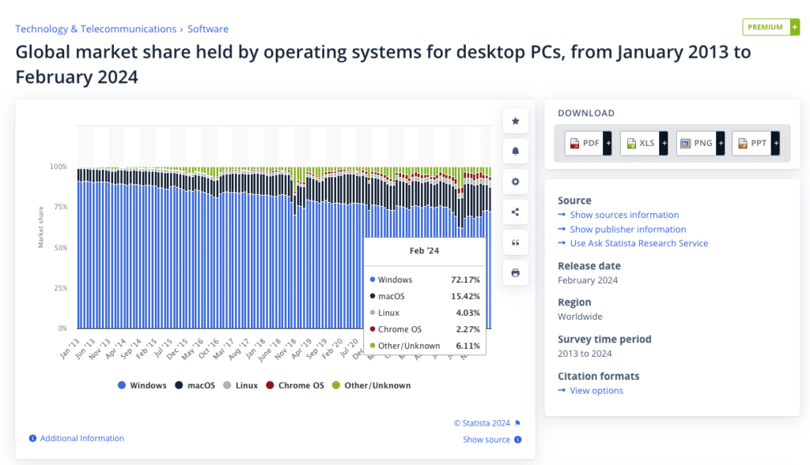

#### A New Era of Computer Interfaces

The introduction of Microsoft Copilot and Apple Intelligence spearheads a transformative era for computer interfaces, redefining how users interact with their devices.

The earlier surge of challengers to the smartphone like [Rabbit R1](https://www.rabbit.tech/) and [Humane Pin](https://humane.com/), and now the ubiquitous integration of AI models into the most used devices, signal that computer interfaces are about to change.

Microsoft Copilot, deeply integrated into Windows 11, offers a seamless, context-aware user experience that adapts to individual needs across various applications and devices. It simplifies tasks by intelligently orchestrating apps, operating systems, and devices, allowing users to focus on their work rather than managing their tools.

/\* widget: Blog: Simple Box \*/  /\* reset -------------------- \*/  .blog-custom-block \*,  .blog-custom-block ::before,  .blog-custom-block ::after {  box-sizing: border-box;  border-width: 0;  border-style: solid;  border-color: #e5e7eb;  }  /\* vars -------------------- \*/  .blog-custom-block.blog-custom-block\_\_simple-quote {  --color-accent: #0FA4EA;  --color-bg: #F4FAFE;  --color-text-2: #4A4A68;  }  /\* colors -------------------- \*/  .blog-custom-block.blog-custom-block\_\_simple-quote .bg-clr-bg {  background-color: var(--color-bg);  }  .blog-custom-block.blog-custom-block\_\_simple-quote .border-clr-accent {  border-color: var(--color-accent);  }  .blog-custom-block.blog-custom-block\_\_simple-quote .text-clr-text-2 {  color: var(--color-text-2);  }  /\* utils -------------------- \*/  .blog-custom-block.blog-custom-block\_\_simple-quote .flex {  display: flex;  }  .blog-custom-block.blog-custom-block\_\_simple-quote .flex-shrink-0 {  flex-shrink: 0;  }  .blog-custom-block.blog-custom-block\_\_simple-quote .flex-col {  flex-direction: column;  }  .blog-custom-block.blog-custom-block\_\_simple-quote .gap-4 {  gap: 1rem;  }  .blog-custom-block.blog-custom-block\_\_simple-quote .rounded-xl {  border-radius: 0.75rem;  }  .blog-custom-block.blog-custom-block\_\_simple-quote .border-l-6 {  border-left-width: 6px;  }  .blog-custom-block.blog-custom-block\_\_simple-quote .p-8 {  padding: 2rem;  }  .blog-custom-block.blog-custom-block\_\_simple-quote .text-xl {  font-size: 1.25rem;  line-height: 1.75rem;  }  .blog-custom-block.blog-custom-block\_\_simple-quote .italic {  font-style: italic;  } 

“You no longer have to be the orchestrator of your apps, operating systems and devices.”

**Satya Nadella - CEO, Microsoft**

Apple Intelligence, on the other hand, brings a suite of AI-powered features to iOS 18, iPadOS 18, and macOS Sequoia. Apple's approach ensures that AI is deeply embedded into the core user experience, making it more personal and context-aware than ever.

These advancements by Microsoft and Apple signify a major shift towards more intelligent, integrated, personalised and user-friendly computer interfaces.

According to Statista, both releases combined will be able to reach 90% of desktop PC devices.

In this article, I explore how startup founders must consider this new era of computing when defining their winning strategy, what changes, and how to stay competitive in a new world infused with AI.

.elementor-12941 .elementor-element.elementor-element-e56f4e6{--display:flex;--flex-direction:column;--container-widget-width:100%;--container-widget-height:initial;--container-widget-flex-grow:0;--container-widget-align-self:initial;--flex-wrap-mobile:wrap;--background-transition:0.3s;}.elementor-12941 .elementor-element.elementor-element-f8d1905{--box-background-color:var( --e-global-color-f6f9b04 );--box-border-color:var( --e-global-color-secondary );--box-border-width:1px;--box-border-radius:12px;--separator-width:0px;--box-padding:12px;--header-color:var( --e-global-color-text );--item-text-decoration:underline;--item-text-hover-decoration:underline;--marker-color:var( --e-global-color-primary );--marker-size:5px;}.elementor-12941 .elementor-element.elementor-element-f8d1905 .elementor-toc\_\_spinner{color:var( --e-global-color-secondary );fill:var( --e-global-color-secondary );}.elementor-12941 .elementor-element.elementor-element-f8d1905 .elementor-toc\_\_header-title{text-align:start;}.elementor-12941 .elementor-element.elementor-element-f8d1905 .elementor-toc\_\_header, .elementor-12941 .elementor-element.elementor-element-f8d1905 .elementor-toc\_\_header-title{font-family:"Poppins", sans-serif;font-size:2.25rem;font-weight:700;text-transform:capitalize;line-height:1.2;}.elementor-12941 .elementor-element.elementor-element-f8d1905 .elementor-toc\_\_list-item{font-family:var( --e-global-typography-45f602c-font-family ), sans-serif;font-size:var( --e-global-typography-45f602c-font-size );font-weight:var( --e-global-typography-45f602c-font-weight );line-height:var( --e-global-typography-45f602c-line-height );letter-spacing:var( --e-global-typography-45f602c-letter-spacing );word-spacing:var( --e-global-typography-45f602c-word-spacing );}.elementor-12941 .elementor-element.elementor-element-f8d1905 > .elementor-widget-container{padding:32px 32px 32px 32px;}@media(max-width:1024px){.elementor-12941 .elementor-element.elementor-element-f8d1905 .elementor-toc\_\_list-item{font-size:var( --e-global-typography-45f602c-font-size );line-height:var( --e-global-typography-45f602c-line-height );letter-spacing:var( --e-global-typography-45f602c-letter-spacing );word-spacing:var( --e-global-typography-45f602c-word-spacing );}}@media(max-width:767px){.elementor-12941 .elementor-element.elementor-element-f8d1905 .elementor-toc\_\_list-item{font-size:var( --e-global-typography-45f602c-font-size );line-height:var( --e-global-typography-45f602c-line-height );letter-spacing:var( --e-global-typography-45f602c-letter-spacing );word-spacing:var( --e-global-typography-45f602c-word-spacing );}} /\*! elementor-pro - v3.22.0 - 16-06-2024 \*/  .elementor-widget-table-of-contents .elementor-toc\_\_header-title{color:var(--header-color)}.elementor-widget-table-of-contents.elementor-toc--collapsed .elementor-toc\_\_toggle-button--collapse,.elementor-widget-table-of-contents:not(.elementor-toc--collapsed) .elementor-toc\_\_toggle-button--expand{display:none}.elementor-widget-table-of-contents .elementor-widget-container{min-height:var(--box-min-height);border:var(--box-border-width,1px) solid var(--box-border-color,#9da5ae);border-radius:var(--box-border-radius,3px);background-color:var(--box-background-color);transition:min-height .4s;overflow:hidden}.elementor-toc\_\_header{display:flex;align-items:center;justify-content:space-between;padding:var(--box-padding,20px);background-color:var(--header-background-color);border-bottom:var(--separator-width,1px) solid var(--box-border-color,#9da5ae)}.elementor-toc\_\_header-title{font-size:18px;margin:0;color:var(--header-color);flex-grow:1}.elementor-toc\_\_toggle-button{cursor:pointer;display:inline-flex}.elementor-toc\_\_toggle-button i{color:var(--toggle-button-color)}.elementor-toc\_\_toggle-button svg{height:1em;width:1em;fill:var(--toggle-button-color)}.elementor-toc\_\_spinner-container{text-align:center}.elementor-toc\_\_spinner{font-size:2em}.elementor-toc\_\_spinner.e-font-icon-svg{height:1em;width:1em}.elementor-toc\_\_body{padding:var(--box-padding,20px);max-height:var(--toc-body-max-height);overflow-y:auto}.elementor-toc\_\_body::-webkit-scrollbar{width:7px}.elementor-toc\_\_body::-webkit-scrollbar-thumb{background-color:#babfc5;border-radius:10px}.elementor-toc\_\_list-wrapper{list-style:none;padding:0}.elementor-toc\_\_list-item{margin-bottom:.5em}.elementor-toc\_\_list-item.elementor-item-active{font-weight:700}.elementor-toc\_\_list-item .elementor-toc\_\_list-wrapper{margin-top:.5em;margin-inline-start:var(--nested-list-indent,1em)}.elementor-toc\_\_list-item-text{transition-duration:var(--item-text-transition-duration)}.elementor-toc\_\_list-item-text:hover{color:var(--item-text-hover-color);-webkit-text-decoration:var(--item-text-hover-decoration);text-decoration:var(--item-text-hover-decoration)}.elementor-toc\_\_list-item-text.elementor-item-active{color:var(--item-text-active-color);-webkit-text-decoration:var(--item-text-active-decoration);text-decoration:var(--item-text-active-decoration)}.elementor-toc\_\_list-item-text-wrapper{display:flex;align-items:center}.elementor-toc\_\_list-item-text-wrapper:before,.elementor-toc\_\_list-item-text-wrapper i{margin-inline-end:8px;color:var(--marker-color)}.elementor-toc\_\_list-item-text-wrapper svg{margin-inline-end:8px;fill:var(--marker-color);height:var(--marker-size,.5em);width:var(--marker-size,.5em)}.elementor-toc\_\_list-item-text-wrapper i{font-size:var(--marker-size,.5em)}.elementor-toc\_\_list-item-text-wrapper:before{font-size:var(--marker-size,1em)}.elementor-toc--content-ellipsis .elementor-toc\_\_list-item-text{white-space:nowrap;overflow:hidden;text-overflow:ellipsis}.elementor-toc\_\_list-items--collapsible>.elementor-toc\_\_list-wrapper>.elementor-toc\_\_list-item>.elementor-toc\_\_list-wrapper{display:none}.elementor-toc\_\_heading-anchor{position:absolute}.elementor-toc\_\_body .elementor-toc\_\_list-item-text{color:var(--item-text-color);-webkit-text-decoration:var(--item-text-decoration);text-decoration:var(--item-text-decoration);transition-duration:var(--item-text-transition-duration)}.elementor-toc\_\_body .elementor-toc\_\_list-item-text:hover{color:var(--item-text-hover-color);-webkit-text-decoration:var(--item-text-hover-decoration);text-decoration:var(--item-text-hover-decoration)}.elementor-toc\_\_body .elementor-toc\_\_list-item-text.elementor-item-active{color:var(--item-text-active-color);-webkit-text-decoration:var(--item-text-active-decoration);text-decoration:var(--item-text-active-decoration)}ol.elementor-toc\_\_list-wrapper{counter-reset:item}ol.elementor-toc\_\_list-wrapper .elementor-toc\_\_list-item{counter-increment:item}ol.elementor-toc\_\_list-wrapper .elementor-toc\_\_list-item-text-wrapper:before{content:counters(item,".") ". "}

#### Contents

## Apple Intelligence: AI for the Rest of Us

If you visit the [Apple Intelligence Preview](https://www.apple.com/apple-intelligence/) website, you will find the subtitle “AI for the rest of us.” This beautifully encapsulates how, despite the widespread adoption of tools like ChatGPT, access to AI models is still not seamlessly integrated into everyday products as of mid-2024.

This gap has, so far, presented a unique opportunity for startups to differentiate based on how quickly they integrate AI tooling into their products. However, Apple Intelligence promises to seamlessly integrate AI functionalities into its over 2.2 billion active devices, which will lead to massive consumer adoption and commoditisation of AI tooling.

Here are some of the features Apple released at WWDC24.

Apple’s New AI-Powered Features:

- Notifications: Reduce interruptions with automatic prioritisation and filtered notifications by urgency.
- Email & Messages: Automatic summaries, AI-assisted writing for summaries, key points, tables, and lists.
- Image Generation: Genmoji, image generation in notes, image playground.
- Photos: Natural language search, clean-up photos.
- Phone Calls: Recording and AI summaries.
- Siri: Cross-app observability and ChatGPT integration for more dynamic and context-aware interactions.

.elementor-16757 .elementor-element.elementor-element-fa6400f{--display:flex;--flex-direction:column;--container-widget-width:100%;--container-widget-height:initial;--container-widget-flex-grow:0;--container-widget-align-self:initial;--flex-wrap-mobile:wrap;--overflow:hidden;--background-transition:0.3s;--border-radius:12px 12px 12px 12px;}.elementor-16757 .elementor-element.elementor-element-283e311{--display:flex;--flex-direction:row;--container-widget-width:initial;--container-widget-height:100%;--container-widget-flex-grow:1;--container-widget-align-self:stretch;--flex-wrap-mobile:wrap;--gap:64px 64px;--background-transition:0.3s;}.elementor-16757 .elementor-element.elementor-element-283e311:not(.elementor-motion-effects-element-type-background), .elementor-16757 .elementor-element.elementor-element-283e311 > .elementor-motion-effects-container > .elementor-motion-effects-layer{background-color:#F4FAFE;}.elementor-16757 .elementor-element.elementor-element-283e311, .elementor-16757 .elementor-element.elementor-element-283e311::before{--border-transition:0.3s;}.elementor-16757 .elementor-element.elementor-element-857117e{--display:flex;--flex-direction:row;--container-widget-width:initial;--container-widget-height:100%;--container-widget-flex-grow:1;--container-widget-align-self:stretch;--flex-wrap-mobile:wrap;--background-transition:0.3s;}.elementor-16757 .elementor-element.elementor-element-857117e.e-con{--flex-grow:0;--flex-shrink:0;}.elementor-16757 .elementor-element.elementor-element-e6af329 img{width:100%;max-width:100%;height:100%;object-fit:cover;object-position:bottom right;}.elementor-16757 .elementor-element.elementor-element-e6af329{width:100%;max-width:100%;bottom:-44px;}body:not(.rtl) .elementor-16757 .elementor-element.elementor-element-e6af329{right:0px;}body.rtl .elementor-16757 .elementor-element.elementor-element-e6af329{left:0px;}.elementor-16757 .elementor-element.elementor-element-ec0de51{--display:flex;--flex-direction:column;--container-widget-width:100%;--container-widget-height:initial;--container-widget-flex-grow:0;--container-widget-align-self:initial;--flex-wrap-mobile:wrap;--gap:24px 24px;--background-transition:0.3s;--padding-top:112px;--padding-bottom:112px;--padding-left:0px;--padding-right:44px;}.elementor-16757 .elementor-element.elementor-element-ec0de51.e-con{--flex-grow:1;--flex-shrink:1;}.elementor-16757 .elementor-element.elementor-element-c168e59{--display:flex;--flex-direction:column;--container-widget-width:100%;--container-widget-height:initial;--container-widget-flex-grow:0;--container-widget-align-self:initial;--flex-wrap-mobile:wrap;--background-transition:0.3s;}.elementor-16757 .elementor-element.elementor-element-4aeb8ec .elementor-heading-title{font-family:"Poppins", sans-serif;font-size:32px;font-weight:700;}.elementor-16757 .elementor-element.elementor-element-8e0cd20{color:#000000;}@media(min-width:768px){.elementor-16757 .elementor-element.elementor-element-857117e{--width:360px;}}@media(max-width:767px){.elementor-16757 .elementor-element.elementor-element-283e311{--padding-top:40px;--padding-bottom:40px;--padding-left:var(--safe-margin);--padding-right:var(--safe-margin);}.elementor-16757 .elementor-element.elementor-element-857117e{--min-height:300px;}body:not(.rtl) .elementor-16757 .elementor-element.elementor-element-e6af329{right:0px;}body.rtl .elementor-16757 .elementor-element.elementor-element-e6af329{left:0px;}.elementor-16757 .elementor-element.elementor-element-e6af329{bottom:-76px;}.elementor-16757 .elementor-element.elementor-element-ec0de51{--padding-top:40px;--padding-bottom:0px;--padding-left:0px;--padding-right:0px;}}

##### Looking to Integrate AI into Your Business?

Get straight to the point, jargon-free advice on transforming your tech strategy by leveraging AI from an expert that has been building award-winning Startups for the past 10 years.

Let's Talk

## Microsoft Copilot: Revolutionising User Interactions

Microsoft Copilot represents a transformative shift in user-device interaction, emphasising a unified, context-aware experience across applications, operating systems, and devices.

This AI-powered tool adapts to individual needs, providing seamless integration and intelligent assistance in tools like Word, Excel, PowerPoint, Edge, and Bing.

Copilot simplifies complex tasks, enhancing productivity by summarising email threads, drafting responses, generating presentations, and analysing data for insights.

It understands user context to offer relevant suggestions and actions across applications, making tasks like scheduling meetings and organising documents more intuitive.

Additionally, Copilot enhances tools like Paint, Photos, and Notepad with AI capabilities, streamlining creativity and productivity through features like background removal, intelligent photo editing, and session state saving.

Overall, Copilot is poised to redefine user interactions in Windows laptops by making technology more adaptive and contextually aware, ultimately empowering users to achieve more with less effort.

https://www.youtube.com/watch?v=5rEZGSFgZVY

## Staying Competitive in an Age of Ubiquitous AI

### Commoditisation

One outcome of ubiquitous AI is the commoditisation of the technology.

[OpenAI’s launch of GPT-4o](https://openai.com/index/hello-gpt-4o/) made it free for everyone, moving away from “pay-to-play” and making high-quality responses accessible to all end consumers. It still has strong limits that justify the subscription payment, but those can fade away at any moment.

Apple Intelligence, with Siri’s integration with GPT-4o, takes this commoditisation even further, making it harder for startups to justify charging subscriptions for access to their models. Time will tell how much access will be free and how much will be paid when it comes to using GPT on Siri.

### Compete on Model: The Story of Midjourney

A few months ago, Midjourney became a popular go-to product for image generation without even having a front-end. They were able to monetise a product on Discord - bravo!

The company developed top-tier image generation models ahead of everyone else, which brought them lots of users.

However, their success might be short-lived in a world where high-quality image generation is available for free, baked in at an OS level, on every Apple device. In order to survive, Midjourney - with lower distribution than Dall-E- will have to provide better models to justify consumer choice continuously.

### Compete on Usefulness: The Story of GPT for Work

A successful case when it comes to capturing value from the recent AI trend has been [GPT for Work](https://gptforwork.com/).

In a very smart move, Talassian, the company behind GPT for Work, has created a Chrome extension that allows you to use GPT on Excel and Google Suite. A “quick win” that afforded the company 6M+ downloads and (presumably) lots of paid subscribers, without ever developing an AI model. However, the moment Google and Microsoft integrate GPT into Excel and Google Sheets natively, GPT for Work will face significant challenges.

### Harder to Differentiate on Product

Built-in AI features that once made products stand out are becoming the norm. Apple’s move means that every iPhone, iPad, or macOS user will have easy access to AI tooling, raising consumer expectations. Android will likely follow.

Continuous innovation remains critical. Startups should invest in R&D to stay ahead of the curve, exploring new applications of AI that can provide significant user benefits.

Emerging fields such as AI ethics, explainability, and AI for social good present opportunities for differentiation.

If they can’t differentiate on product, companies will need to compete on other fronts, such as operations or marketing.

### Partnerships and Ecosystems

Collaborating with other players in the tech ecosystem has become critical to a startup’s reach and capabilities. Forming partnerships with established tech companies, integrating with third-party platforms, and participating in AI research communities can provide strategic advantages.

.elementor-3329 .elementor-element.elementor-element-f79b780{--display:flex;--flex-direction:column;--container-widget-width:100%;--container-widget-height:initial;--container-widget-flex-grow:0;--container-widget-align-self:initial;--flex-wrap-mobile:wrap;--background-transition:0.3s;}.elementor-3329 .elementor-element.elementor-element-aa6dd2a{--display:flex;--flex-direction:column;--container-widget-width:100%;--container-widget-height:initial;--container-widget-flex-grow:0;--container-widget-align-self:initial;--flex-wrap-mobile:wrap;--gap:24px 24px;--background-transition:0.3s;--border-radius:12px 12px 12px 12px;--padding-top:70px;--padding-bottom:70px;--padding-left:var(--safe-margin);--padding-right:var(--safe-margin);}.elementor-3329 .elementor-element.elementor-element-aa6dd2a:not(.elementor-motion-effects-element-type-background), .elementor-3329 .elementor-element.elementor-element-aa6dd2a > .elementor-motion-effects-container > .elementor-motion-effects-layer{background-color:#29293E;}.elementor-3329 .elementor-element.elementor-element-aa6dd2a, .elementor-3329 .elementor-element.elementor-element-aa6dd2a::before{--border-transition:0.3s;}.elementor-3329 .elementor-element.elementor-element-95ae566{--display:flex;--flex-direction:column;--container-widget-width:100%;--container-widget-height:initial;--container-widget-flex-grow:0;--container-widget-align-self:initial;--flex-wrap-mobile:wrap;--background-transition:0.3s;}.elementor-3329 .elementor-element.elementor-element-99ebd14{text-align:center;}.elementor-3329 .elementor-element.elementor-element-99ebd14 .elementor-heading-title{color:var( --e-global-color-eb70be1 );font-family:var( --e-global-typography-0ff79ee-font-family ), sans-serif;font-size:var( --e-global-typography-0ff79ee-font-size );font-weight:var( --e-global-typography-0ff79ee-font-weight );line-height:var( --e-global-typography-0ff79ee-line-height );letter-spacing:var( --e-global-typography-0ff79ee-letter-spacing );word-spacing:var( --e-global-typography-0ff79ee-word-spacing );}.elementor-3329 .elementor-element.elementor-element-0ce57c0{text-align:center;color:var( --e-global-color-eb70be1 );font-size:20px;}.elementor-3329 .elementor-element.elementor-element-28db4d7{--display:flex;--flex-direction:row;--container-widget-width:initial;--container-widget-height:100%;--container-widget-flex-grow:1;--container-widget-align-self:stretch;--flex-wrap-mobile:wrap;--justify-content:flex-start;--background-transition:0.3s;}.elementor-3329 .elementor-element.elementor-element-70fbc6a .elementor-field-group{padding-right:calc( 24px/2 );padding-left:calc( 24px/2 );margin-bottom:32px;}.elementor-3329 .elementor-element.elementor-element-70fbc6a .elementor-form-fields-wrapper{margin-left:calc( -24px/2 );margin-right:calc( -24px/2 );margin-bottom:-32px;}.elementor-3329 .elementor-element.elementor-element-70fbc6a .elementor-field-group.recaptcha\_v3-bottomleft, .elementor-3329 .elementor-element.elementor-element-70fbc6a .elementor-field-group.recaptcha\_v3-bottomright{margin-bottom:0;}body.rtl .elementor-3329 .elementor-element.elementor-element-70fbc6a .elementor-labels-inline .elementor-field-group > label{padding-left:8px;}body:not(.rtl) .elementor-3329 .elementor-element.elementor-element-70fbc6a .elementor-labels-inline .elementor-field-group > label{padding-right:8px;}body .elementor-3329 .elementor-element.elementor-element-70fbc6a .elementor-labels-above .elementor-field-group > label{padding-bottom:8px;}.elementor-3329 .elementor-element.elementor-element-70fbc6a .elementor-field-group > label, .elementor-3329 .elementor-element.elementor-element-70fbc6a .elementor-field-subgroup label{color:var( --e-global-color-eb70be1 );}.elementor-3329 .elementor-element.elementor-element-70fbc6a .elementor-field-group > label{font-family:var( --e-global-typography-9730a4e-font-family ), sans-serif;font-size:var( --e-global-typography-9730a4e-font-size );font-weight:var( --e-global-typography-9730a4e-font-weight );line-height:var( --e-global-typography-9730a4e-line-height );letter-spacing:var( --e-global-typography-9730a4e-letter-spacing );word-spacing:var( --e-global-typography-9730a4e-word-spacing );}.elementor-3329 .elementor-element.elementor-element-70fbc6a .elementor-field-type-html{padding-bottom:0px;}.elementor-3329 .elementor-element.elementor-element-70fbc6a .elementor-field-group .elementor-field{color:var( --e-global-color-eb70be1 );}.elementor-3329 .elementor-element.elementor-element-70fbc6a .elementor-field-group .elementor-field, .elementor-3329 .elementor-element.elementor-element-70fbc6a .elementor-field-subgroup label{font-family:var( --e-global-typography-text-font-family ), sans-serif;font-size:var( --e-global-typography-text-font-size );font-weight:var( --e-global-typography-text-font-weight );line-height:var( --e-global-typography-text-line-height );}.elementor-3329 .elementor-element.elementor-element-70fbc6a .elementor-field-group:not(.elementor-field-type-upload) .elementor-field:not(.elementor-select-wrapper){background-color:#3D3D5C;border-color:#65639C;}.elementor-3329 .elementor-element.elementor-element-70fbc6a .elementor-field-group .elementor-select-wrapper select{background-color:#3D3D5C;border-color:#65639C;}.elementor-3329 .elementor-element.elementor-element-70fbc6a .elementor-field-group .elementor-select-wrapper::before{color:#65639C;}.elementor-3329 .elementor-element.elementor-element-70fbc6a .elementor-button{font-family:"Poppins", sans-serif;font-size:14px;font-weight:700;line-height:1.5;}.elementor-3329 .elementor-element.elementor-element-70fbc6a .e-form\_\_buttons\_\_wrapper\_\_button-next{background-color:var( --e-global-color-1e4bfa7 );color:var( --e-global-color-eb70be1 );}.elementor-3329 .elementor-element.elementor-element-70fbc6a .elementor-button\[type="submit"\]{background-color:var( --e-global-color-1e4bfa7 );color:var( --e-global-color-eb70be1 );}.elementor-3329 .elementor-element.elementor-element-70fbc6a .elementor-button\[type="submit"\] svg \*{fill:var( --e-global-color-eb70be1 );}.elementor-3329 .elementor-element.elementor-element-70fbc6a .e-form\_\_buttons\_\_wrapper\_\_button-previous{color:var( --e-global-color-eb70be1 );}.elementor-3329 .elementor-element.elementor-element-70fbc6a .e-form\_\_buttons\_\_wrapper\_\_button-next:hover{color:#ffffff;}.elementor-3329 .elementor-element.elementor-element-70fbc6a .elementor-button\[type="submit"\]:hover{color:#ffffff;}.elementor-3329 .elementor-element.elementor-element-70fbc6a .elementor-button\[type="submit"\]:hover svg \*{fill:#ffffff;}.elementor-3329 .elementor-element.elementor-element-70fbc6a .e-form\_\_buttons\_\_wrapper\_\_button-previous:hover{color:#ffffff;}.elementor-3329 .elementor-element.elementor-element-70fbc6a .elementor-message{font-family:var( --e-global-typography-9730a4e-font-family ), sans-serif;font-size:var( --e-global-typography-9730a4e-font-size );font-weight:var( --e-global-typography-9730a4e-font-weight );line-height:var( --e-global-typography-9730a4e-line-height );letter-spacing:var( --e-global-typography-9730a4e-letter-spacing );word-spacing:var( --e-global-typography-9730a4e-word-spacing );}.elementor-3329 .elementor-element.elementor-element-70fbc6a .elementor-message.elementor-message-success{color:var( --e-global-color-40f63f7 );}.elementor-3329 .elementor-element.elementor-element-70fbc6a .elementor-message.elementor-message-danger{color:var( --e-global-color-8ddb30f );}.elementor-3329 .elementor-element.elementor-element-70fbc6a .elementor-message.elementor-help-inline{color:var( --e-global-color-9acb2f2 );}.elementor-3329 .elementor-element.elementor-element-70fbc6a{--e-form-steps-indicators-spacing:20px;--e-form-steps-indicator-padding:30px;--e-form-steps-indicator-inactive-secondary-color:#ffffff;--e-form-steps-indicator-active-secondary-color:#ffffff;--e-form-steps-indicator-completed-secondary-color:#ffffff;--e-form-steps-divider-width:1px;--e-form-steps-divider-gap:10px;width:100%;max-width:100%;}.elementor-3329 .elementor-element.elementor-element-70fbc6a > .elementor-widget-container{padding:10px 0px 0px 0px;}@media(min-width:768px){.elementor-3329 .elementor-element.elementor-element-aa6dd2a{--content-width:var(--container-md);}}@media(max-width:1024px){.elementor-3329 .elementor-element.elementor-element-99ebd14 .elementor-heading-title{font-size:var( --e-global-typography-0ff79ee-font-size );line-height:var( --e-global-typography-0ff79ee-line-height );letter-spacing:var( --e-global-typography-0ff79ee-letter-spacing );word-spacing:var( --e-global-typography-0ff79ee-word-spacing );}.elementor-3329 .elementor-element.elementor-element-70fbc6a .elementor-field-group > label{font-size:var( --e-global-typography-9730a4e-font-size );line-height:var( --e-global-typography-9730a4e-line-height );letter-spacing:var( --e-global-typography-9730a4e-letter-spacing );word-spacing:var( --e-global-typography-9730a4e-word-spacing );}.elementor-3329 .elementor-element.elementor-element-70fbc6a .elementor-field-group .elementor-field, .elementor-3329 .elementor-element.elementor-element-70fbc6a .elementor-field-subgroup label{font-size:var( --e-global-typography-text-font-size );line-height:var( --e-global-typography-text-line-height );}.elementor-3329 .elementor-element.elementor-element-70fbc6a .elementor-message{font-size:var( --e-global-typography-9730a4e-font-size );line-height:var( --e-global-typography-9730a4e-line-height );letter-spacing:var( --e-global-typography-9730a4e-letter-spacing );word-spacing:var( --e-global-typography-9730a4e-word-spacing );}}@media(max-width:767px){.elementor-3329 .elementor-element.elementor-element-99ebd14 .elementor-heading-title{font-size:var( --e-global-typography-0ff79ee-font-size );line-height:var( --e-global-typography-0ff79ee-line-height );letter-spacing:var( --e-global-typography-0ff79ee-letter-spacing );word-spacing:var( --e-global-typography-0ff79ee-word-spacing );}.elementor-3329 .elementor-element.elementor-element-70fbc6a .elementor-field-group > label{font-size:var( --e-global-typography-9730a4e-font-size );line-height:var( --e-global-typography-9730a4e-line-height );letter-spacing:var( --e-global-typography-9730a4e-letter-spacing );word-spacing:var( --e-global-typography-9730a4e-word-spacing );}.elementor-3329 .elementor-element.elementor-element-70fbc6a .elementor-field-group .elementor-field, .elementor-3329 .elementor-element.elementor-element-70fbc6a .elementor-field-subgroup label{font-size:var( --e-global-typography-text-font-size );line-height:var( --e-global-typography-text-line-height );}.elementor-3329 .elementor-element.elementor-element-70fbc6a .elementor-message{font-size:var( --e-global-typography-9730a4e-font-size );line-height:var( --e-global-typography-9730a4e-line-height );letter-spacing:var( --e-global-typography-9730a4e-letter-spacing );word-spacing:var( --e-global-typography-9730a4e-word-spacing );}}/\* Start custom CSS for form, class: .elementor-element-70fbc6a \*/.elementor-3329 .elementor-element.elementor-element-70fbc6a input {  border-color: #65639C !important;  }  .elementor-3329 .elementor-element.elementor-element-70fbc6a input:is(:focus, :hover) {  border-color: #B9B8CE !important;  }/\* End custom CSS \*/

##### Sign up for our newsletter

Join hundreds of entrepreneurs and business leaders to receive fresh, actionable tech and startup related insights and tips

   Full Name  Business Email  Subscribe

## Marketing in the Age of AI

**“Attention is All You Need”, yet Increasingly Hard to Get**

Marketing has become more relevant than ever, and yet increasingly challenging. Finding product-market fit means understanding and speaking to the market, rather than just building a perfect product.

/\* widget: Blog: Simple Box \*/  /\* reset -------------------- \*/  .blog-custom-block \*,  .blog-custom-block ::before,  .blog-custom-block ::after {  box-sizing: border-box;  border-width: 0;  border-style: solid;  border-color: #e5e7eb;  }  /\* vars -------------------- \*/  .blog-custom-block.blog-custom-block\_\_simple-quote {  --color-accent: #0FA4EA;  --color-bg: #F4FAFE;  --color-text-2: #4A4A68;  }  /\* colors -------------------- \*/  .blog-custom-block.blog-custom-block\_\_simple-quote .bg-clr-bg {  background-color: var(--color-bg);  }  .blog-custom-block.blog-custom-block\_\_simple-quote .border-clr-accent {  border-color: var(--color-accent);  }  .blog-custom-block.blog-custom-block\_\_simple-quote .text-clr-text-2 {  color: var(--color-text-2);  }  /\* utils -------------------- \*/  .blog-custom-block.blog-custom-block\_\_simple-quote .flex {  display: flex;  }  .blog-custom-block.blog-custom-block\_\_simple-quote .flex-shrink-0 {  flex-shrink: 0;  }  .blog-custom-block.blog-custom-block\_\_simple-quote .flex-col {  flex-direction: column;  }  .blog-custom-block.blog-custom-block\_\_simple-quote .gap-4 {  gap: 1rem;  }  .blog-custom-block.blog-custom-block\_\_simple-quote .rounded-xl {  border-radius: 0.75rem;  }  .blog-custom-block.blog-custom-block\_\_simple-quote .border-l-6 {  border-left-width: 6px;  }  .blog-custom-block.blog-custom-block\_\_simple-quote .p-8 {  padding: 2rem;  }  .blog-custom-block.blog-custom-block\_\_simple-quote .text-xl {  font-size: 1.25rem;  line-height: 1.75rem;  }  .blog-custom-block.blog-custom-block\_\_simple-quote .italic {  font-style: italic;  } 

“The best product doesn't always win. The one everyone uses wins”

**Andrew Bosworth, Facebook**

AI, particularly Apple Intelligence, will likely change the game of marketing in several ways:

### Less Effective Email Marketing & Push Notifications

With Apple’s enhancements to email, cutting through the noise and reaching clients through email marketing will become increasingly difficult. Intelligent email filtering and prioritisation will ensure that only messages that deliver true value will be read.

Value-based marketing is the way to go.

Push notifications will also become less effective at capturing attention and ensuring user retention. Notifications will need to be valuable and well-timed to even be received by users.

### Next-Generation Search Engine Optimization (SEO)

The rise of LLMs is transforming search. So much that even [Google found the need to re-invent its Search Engine](https://www.theverge.com/2024/5/14/24155321/google-search-ai-results-page-gemini-overview).

Moving forward, queries to a Search Engine are more likely to return a generated response, than a list of links.

Companies will need to find ways to ensure their products or services are referenced in these responses. This will require innovative strategies to maintain visibility.

## The Role of Founders Amidst the AI Revolution

### Understanding Customers

In the midst of rapid technological shifts driven by AI, it is crucial for founders to deeply understand their customers. This means leveraging AI tools for advanced analytics to gain insights into customer behaviour, preferences, and pain points. Founders must actively engage with their target audience, using feedback loops and real-time data to continually refine their products. By staying attuned to the evolving needs of customers, founders can ensure their offerings remain relevant and valuable in a highly competitive market.

### Vision and Leadership

With the AI revolution reshaping the tech landscape, visionary leadership is more important than ever. Founders must stay informed about the latest AI advancements and market trends to anticipate future developments. They should foster a culture of agility and innovation within their organisations, encouraging teams to experiment with new technologies and adapt quickly to changes. This proactive approach will help startups not only survive but thrive in an era where AI capabilities are rapidly evolving.

### Strategic Decision Making

Strategic decision-making becomes critical as AI integration impacts every facet of business operations. Founders must make informed choices about product development, market positioning, and resource allocation, balancing immediate needs with long-term goals. Utilising AI-driven insights can enhance decision-making processes, allowing for more accurate forecasting, risk assessment, and opportunity identification. This strategic foresight will enable startups to navigate the complexities of the AI-driven market effectively.

### Building a Strong Company Culture

In the context of AI advancements, building a strong, adaptive company culture is essential. Founders should cultivate an environment that embraces change, promotes continuous learning, and encourages innovative thinking.

By integrating AI tools to enhance productivity and collaboration, startups can maintain a competitive edge. A positive, inclusive culture not only attracts and retains top talent but also ensures that the organisation can swiftly adapt to technological disruptions.

### Networking and Building Relationships

As AI technologies redefine industry standards, networking and building strategic relationships are vital. Founders should actively engage with AI research communities, industry experts, and potential partners to stay ahead of trends and gain access to cutting-edge innovations. These connections can provide valuable resources, collaborative opportunities, and insights into emerging technologies. Effective networking can also facilitate strategic partnerships and funding opportunities, crucial for scaling AI-driven initiatives.

## Conclusion

The advancements introduced by Microsoft Copilot and Apple Intelligence mark a significant shift in computer interfaces, fundamentally changing user interactions with technology.

For startup founders, adapting to this AI-driven era is essential for staying competitive. As AI functionalities become standard across devices, differentiating products based on unique AI capabilities will be increasingly challenging. Continuous innovation and exploring new AI applications will be crucial for maintaining a competitive edge and providing significant user benefits.

Strategic partnerships and ecosystem integration will be vital for startups. Collaborating with established tech companies and participating in AI research communities can enhance a startup's reach and capabilities, fostering innovation and market penetration. Leveraging third-party platforms and forming strategic alliances provide access to cutting-edge technologies and valuable resources, essential for growth and scalability in an AI-driven world.

Visionary leadership and a strong, adaptive company culture are paramount in this new landscape. Founders must stay informed about AI advancements and market trends to make strategic decisions that balance immediate needs with long-term goals. Fostering a culture of agility, continuous learning, and innovation will attract and retain top talent, ensuring resilience amidst technological disruptions.

By understanding customer needs and forming strategic partnerships, startups can successfully navigate the complexities of the AI revolution and secure their place in the competitive landscape.

Thanks for reading.
