In an increasingly competitive business landscape, it’s more important than ever for startups to reach their target users quickly and efficiently. [Building a Minimum Viable Product (MVP)](https://altar.io/features-inside-mvp-3-steps-know-answer/) has become the de facto process to achieve this.

I’ve lined the ultimate list of  MVP examples, from a range of industries, to share with you – One of which, you probably aren’t expecting to be included in this list.

#### Contents

## 1\. Uber

Back in 2008, Travis Kalanick and Stumbleupon founder Garrett Camp were just two guys with an idea. The problem they wanted to solve? The cost of black car services.

They built a simple, quick, low-budget MVP to test a simple theory.

**People can’t necessarily afford a black car service but they don’t like taxis — what if we can create something that bridges the gap and solves the problem?**

Uber was born. Originally dubbed UberCab, their MVP allowed people in San Francisco to order black car services through an iPhone app and SMS on other devices.

Two years later, Kalanick [tweeted](https://twitter.com/travisk/status/7422828552) what is arguably one of the most valuable tweets in the history of Twitter.

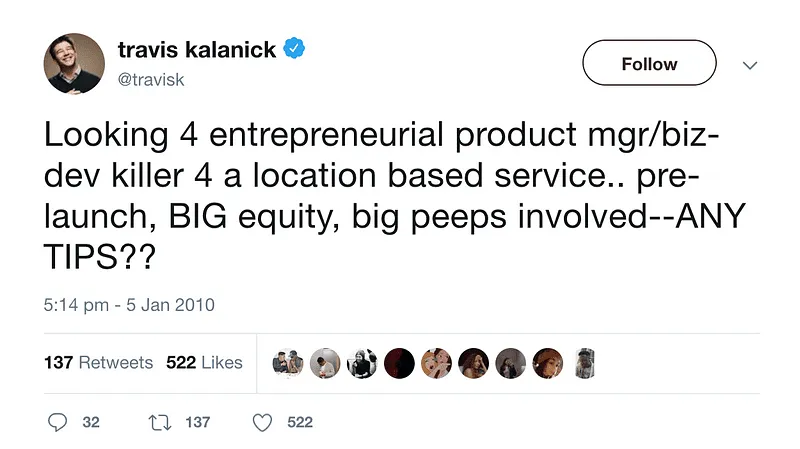

[Ryan Graves](https://www.forbes.com/profile/ryan-graves/#7e4d309a4a51)  responded to this tweet simply saying: Here’s a tip. email me :)  graves.ryan\[at\]gmail.com

He would later become Uber’s first CEO and now has a personal net worth of $1.6 billion with Uber’s net worth sitting at $75.5 billion when it [went public](https://www.entrepreneur.com/article/333583) in May 2019.

 The app has evolved through several iterations from this simple MVP platform over the years — with lots of newer features such as fare splitting and live driver tracking to name but a few.

/\* widget: Blog: Expert Tip \*/  /\* reset -------------------- \*/  .blog-custom-block \*,  .blog-custom-block ::before,  .blog-custom-block ::after {  box-sizing: border-box;  border-width: 0;  border-style: solid;  border-color: #e5e7eb;  }  /\* vars -------------------- \*/  .blog-custom-block.blog-custom-block\_\_expert-tip {  --color-bg: #F4FAFE;  --color-border: rgb(15 164 234 / 0.50);  --color-text-1: #0F172A;  --color-text-2: #4A4A68;  }  /\* colors -------------------- \*/  .blog-custom-block.blog-custom-block\_\_expert-tip .bg-clr-bg {  background-color: var(--color-bg);  }  .blog-custom-block.blog-custom-block\_\_expert-tip .border-clr-border {  border-color: var(--color-border);  }  .blog-custom-block.blog-custom-block\_\_expert-tip .text-clr-text-1 {  color: var(--color-text-1);  }  .blog-custom-block.blog-custom-block\_\_expert-tip .text-clr-text-2 {  color: var(--color-text-2);  }  /\* utils -------------------- \*/  .blog-custom-block.blog-custom-block\_\_expert-tip .flex {  display: flex;  }  .blog-custom-block.blog-custom-block\_\_expert-tip .flex-shrink-0 {  flex-shrink: 0;  }  .blog-custom-block.blog-custom-block\_\_expert-tip .flex-col {  flex-direction: column;  }  .blog-custom-block.blog-custom-block\_\_expert-tip .gap-4 {  gap: 1rem;  }  .blog-custom-block.blog-custom-block\_\_expert-tip .gap-5 {  gap: 1.25rem;  }  .blog-custom-block.blog-custom-block\_\_expert-tip .rounded-xl {  border-radius: 0.75rem;  }  .blog-custom-block.blog-custom-block\_\_expert-tip .border {  border-width: 1px;  }  .blog-custom-block.blog-custom-block\_\_expert-tip .p-8 {  padding: 2rem;  }  .blog-custom-block.blog-custom-block\_\_expert-tip .text-3xl {  font-size: 1.875rem;  line-height: 2.25rem;  }  .blog-custom-block.blog-custom-block\_\_expert-tip .text-lg {  font-size: 1.125rem;  line-height: 1.75rem;  }  .blog-custom-block.blog-custom-block\_\_expert-tip .font-bold {  font-weight: 700;  } 

Key Takeaway

Starting lean, focussing on a core feature, in a small niche allows you to test your idea in the market at a lower cost.

The more features you build the more your product development costs. Targeting multiple geographies forces you to multiply your marketing efforts to reach that wider market, which also increases your costs.

##### Do you have a brilliant startup idea that you want to bring to life?

From the product and business reasoning to streamlining your MVP to the most important features, our team of product experts and ex-startup founders can help you bring your vision to life.

Let's Talk

## 2\. Airbnb

We can’t talk about successful MVP examples without mentioning Airbnb.

In 2007, roommates and former schoolmates Brian Chesky and Joe Gebbia Moved to San Francisco to start a business. The problem? They couldn’t afford the rent of their San Francisco loft apartment.

Their solution? They opened up their apartment as cheap accommodation for attendees of a nearby design conference.

This not only solved their problem of paying the rent, but it also solved the attendee’s problem attendees who had lucked out on hotel bookings.

They took pictures of the apartment, uploaded it to Craigslist and had three paying guests in no time.

They quickly realised there was a market for this and built an MVP to validate their assumptions and prove that people would be willing to use their product (called AirBed&Breakfast).

The rest, as they say, is history. Airbnb is now valued at $18B all from creating an MVP to solve a simple problem.

/\* widget: Blog: Expert Tip \*/  /\* reset -------------------- \*/  .blog-custom-block \*,  .blog-custom-block ::before,  .blog-custom-block ::after {  box-sizing: border-box;  border-width: 0;  border-style: solid;  border-color: #e5e7eb;  }  /\* vars -------------------- \*/  .blog-custom-block.blog-custom-block\_\_expert-tip {  --color-bg: #F4FAFE;  --color-border: rgb(15 164 234 / 0.50);  --color-text-1: #0F172A;  --color-text-2: #4A4A68;  }  /\* colors -------------------- \*/  .blog-custom-block.blog-custom-block\_\_expert-tip .bg-clr-bg {  background-color: var(--color-bg);  }  .blog-custom-block.blog-custom-block\_\_expert-tip .border-clr-border {  border-color: var(--color-border);  }  .blog-custom-block.blog-custom-block\_\_expert-tip .text-clr-text-1 {  color: var(--color-text-1);  }  .blog-custom-block.blog-custom-block\_\_expert-tip .text-clr-text-2 {  color: var(--color-text-2);  }  /\* utils -------------------- \*/  .blog-custom-block.blog-custom-block\_\_expert-tip .flex {  display: flex;  }  .blog-custom-block.blog-custom-block\_\_expert-tip .flex-shrink-0 {  flex-shrink: 0;  }  .blog-custom-block.blog-custom-block\_\_expert-tip .flex-col {  flex-direction: column;  }  .blog-custom-block.blog-custom-block\_\_expert-tip .gap-4 {  gap: 1rem;  }  .blog-custom-block.blog-custom-block\_\_expert-tip .gap-5 {  gap: 1.25rem;  }  .blog-custom-block.blog-custom-block\_\_expert-tip .rounded-xl {  border-radius: 0.75rem;  }  .blog-custom-block.blog-custom-block\_\_expert-tip .border {  border-width: 1px;  }  .blog-custom-block.blog-custom-block\_\_expert-tip .p-8 {  padding: 2rem;  }  .blog-custom-block.blog-custom-block\_\_expert-tip .text-3xl {  font-size: 1.875rem;  line-height: 2.25rem;  }  .blog-custom-block.blog-custom-block\_\_expert-tip .text-lg {  font-size: 1.125rem;  line-height: 1.75rem;  }  .blog-custom-block.blog-custom-block\_\_expert-tip .font-bold {  font-weight: 700;  } 

Key Takeaway

The decision made by Airbnb to create a functional MVP was paramount to their success. They needed to test more than just market interest. They needed to make sure all stakeholders would continually use their platform.

A non-functional MVP, such as Dropbox (See #3 in the list of  MVP examples), wouldn’t have gone far enough to test the hypothesis of recurring users.

## 3\. Dropbox

Dropbox approached their MVP a little differently to the MVP examples we’ve discussed so far. Their MVP was entirely non-functional.

They created a simple video explaining what the first iteration of their product would look and work.

https://www.youtube.com/watch?v=xy9nSnalvPc

It was a success and enabled them to collect the feedback they needed to validate their core assumptions such as market need.

/\* widget: Blog: Expert Tip \*/  /\* reset -------------------- \*/  .blog-custom-block \*,  .blog-custom-block ::before,  .blog-custom-block ::after {  box-sizing: border-box;  border-width: 0;  border-style: solid;  border-color: #e5e7eb;  }  /\* vars -------------------- \*/  .blog-custom-block.blog-custom-block\_\_expert-tip {  --color-bg: #F4FAFE;  --color-border: rgb(15 164 234 / 0.50);  --color-text-1: #0F172A;  --color-text-2: #4A4A68;  }  /\* colors -------------------- \*/  .blog-custom-block.blog-custom-block\_\_expert-tip .bg-clr-bg {  background-color: var(--color-bg);  }  .blog-custom-block.blog-custom-block\_\_expert-tip .border-clr-border {  border-color: var(--color-border);  }  .blog-custom-block.blog-custom-block\_\_expert-tip .text-clr-text-1 {  color: var(--color-text-1);  }  .blog-custom-block.blog-custom-block\_\_expert-tip .text-clr-text-2 {  color: var(--color-text-2);  }  /\* utils -------------------- \*/  .blog-custom-block.blog-custom-block\_\_expert-tip .flex {  display: flex;  }  .blog-custom-block.blog-custom-block\_\_expert-tip .flex-shrink-0 {  flex-shrink: 0;  }  .blog-custom-block.blog-custom-block\_\_expert-tip .flex-col {  flex-direction: column;  }  .blog-custom-block.blog-custom-block\_\_expert-tip .gap-4 {  gap: 1rem;  }  .blog-custom-block.blog-custom-block\_\_expert-tip .gap-5 {  gap: 1.25rem;  }  .blog-custom-block.blog-custom-block\_\_expert-tip .rounded-xl {  border-radius: 0.75rem;  }  .blog-custom-block.blog-custom-block\_\_expert-tip .border {  border-width: 1px;  }  .blog-custom-block.blog-custom-block\_\_expert-tip .p-8 {  padding: 2rem;  }  .blog-custom-block.blog-custom-block\_\_expert-tip .text-3xl {  font-size: 1.875rem;  line-height: 2.25rem;  }  .blog-custom-block.blog-custom-block\_\_expert-tip .text-lg {  font-size: 1.125rem;  line-height: 1.75rem;  }  .blog-custom-block.blog-custom-block\_\_expert-tip .font-bold {  font-weight: 700;  } 

Key Takeaway

While Dropbox’s non-functional MVP validated user intent, it didn’t validate user action. Be aware if you consider building a non-functional MVP that just because people say they like your product doesn’t mean they’ll actually use it.

Related: [MVP, Functional or Non-functional? The Early-Stage Startup Dilemma](https://altar.io/mvp-functional-non-functional-startup-early-stage-dilemma/)

## 4\. Facebook

Back in January 2004, Facebook’s MVP, or *thefacebook* as it was then called, was created by Mark Zuckerberg in his Harvard dorm room.

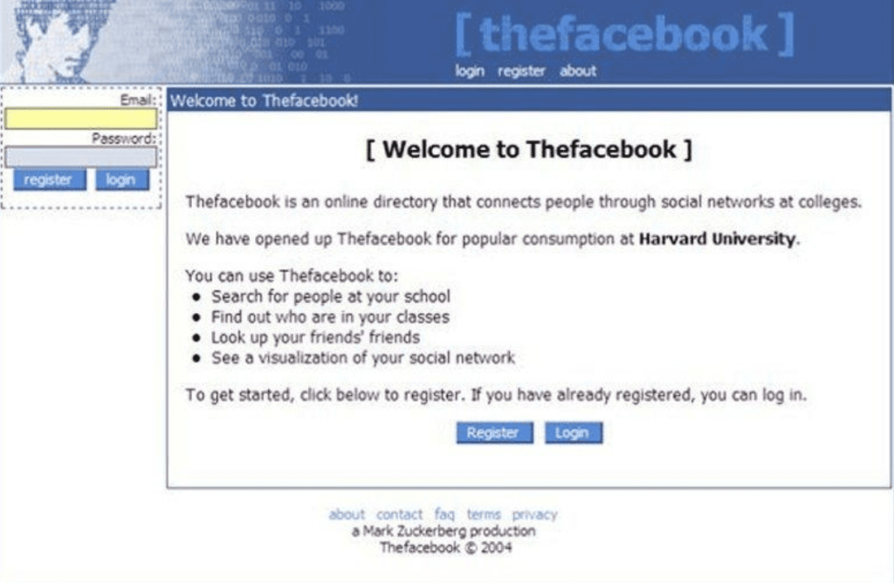 Initially, it served as a universal directory to connect exclusively Harvard students. It became so popular that only a few months later, it expanded to three other prestigious colleges – Yale, Stanford & Columbia.

The expansion continued in 2005, it now included universities in the United Kingdom, Mexico, Puerto Rico, Australia, and New Zealand – as well as over 25,000 high schools located in various countries.

In 2006, after buying the domain name facebook.com for $200k Facebook opened it’s services to the public. Now, anyone over the age of 13 with a valid email address could create a Facebook account.

Today, Facebook boasts a whopping  [2.5 billion monthly users](https://www.facebook.com/business/marketing/facebook#). Not only is it the most popular social media platform on the planet, but it also owns Instagram & WhatsApp.

/\* widget: Blog: Expert Tip \*/  /\* reset -------------------- \*/  .blog-custom-block \*,  .blog-custom-block ::before,  .blog-custom-block ::after {  box-sizing: border-box;  border-width: 0;  border-style: solid;  border-color: #e5e7eb;  }  /\* vars -------------------- \*/  .blog-custom-block.blog-custom-block\_\_expert-tip {  --color-bg: #F4FAFE;  --color-border: rgb(15 164 234 / 0.50);  --color-text-1: #0F172A;  --color-text-2: #4A4A68;  }  /\* colors -------------------- \*/  .blog-custom-block.blog-custom-block\_\_expert-tip .bg-clr-bg {  background-color: var(--color-bg);  }  .blog-custom-block.blog-custom-block\_\_expert-tip .border-clr-border {  border-color: var(--color-border);  }  .blog-custom-block.blog-custom-block\_\_expert-tip .text-clr-text-1 {  color: var(--color-text-1);  }  .blog-custom-block.blog-custom-block\_\_expert-tip .text-clr-text-2 {  color: var(--color-text-2);  }  /\* utils -------------------- \*/  .blog-custom-block.blog-custom-block\_\_expert-tip .flex {  display: flex;  }  .blog-custom-block.blog-custom-block\_\_expert-tip .flex-shrink-0 {  flex-shrink: 0;  }  .blog-custom-block.blog-custom-block\_\_expert-tip .flex-col {  flex-direction: column;  }  .blog-custom-block.blog-custom-block\_\_expert-tip .gap-4 {  gap: 1rem;  }  .blog-custom-block.blog-custom-block\_\_expert-tip .gap-5 {  gap: 1.25rem;  }  .blog-custom-block.blog-custom-block\_\_expert-tip .rounded-xl {  border-radius: 0.75rem;  }  .blog-custom-block.blog-custom-block\_\_expert-tip .border {  border-width: 1px;  }  .blog-custom-block.blog-custom-block\_\_expert-tip .p-8 {  padding: 2rem;  }  .blog-custom-block.blog-custom-block\_\_expert-tip .text-3xl {  font-size: 1.875rem;  line-height: 2.25rem;  }  .blog-custom-block.blog-custom-block\_\_expert-tip .text-lg {  font-size: 1.125rem;  line-height: 1.75rem;  }  .blog-custom-block.blog-custom-block\_\_expert-tip .font-bold {  font-weight: 700;  } 

Key Takeaway

The idea for Facebook was nothing new. Competitors, such as MySpace, were already operating similar social media platforms. Proving you don’t need to be the first one with an idea to succeed.

What you need to do is execute your idea in a way that outshines your competitors and solidifies your foothold in the market.

## 5\. Instagram — Originally Burbn

Instagram’s predecessor, Burbn, was initially designed to allow users to check-in and share their experiences at various locations with friends.

Like many of the MVP examples, it wasn’t all plain sailing for Founder, Kevin Systrom. The initial app, in his words, “felt cluttered and overrun with features”. Adoption was poor, and users found the app confusing.

There was one feature, however, that users loved. Easy photo-sharing. So Systrom made a tough choice. He took the Burbn MVP and completely overhauled it:

We went out on a limb, and basically cut everything in the Burbn app except for its photo, comment, and like capabilities. What remained was Instagram.

They iterated on their MVP and now boast over [500 million active daily users](https://www.facebook.com/business/marketing/instagram#).

/\* widget: Blog: Expert Tip \*/  /\* reset -------------------- \*/  .blog-custom-block \*,  .blog-custom-block ::before,  .blog-custom-block ::after {  box-sizing: border-box;  border-width: 0;  border-style: solid;  border-color: #e5e7eb;  }  /\* vars -------------------- \*/  .blog-custom-block.blog-custom-block\_\_expert-tip {  --color-bg: #F4FAFE;  --color-border: rgb(15 164 234 / 0.50);  --color-text-1: #0F172A;  --color-text-2: #4A4A68;  }  /\* colors -------------------- \*/  .blog-custom-block.blog-custom-block\_\_expert-tip .bg-clr-bg {  background-color: var(--color-bg);  }  .blog-custom-block.blog-custom-block\_\_expert-tip .border-clr-border {  border-color: var(--color-border);  }  .blog-custom-block.blog-custom-block\_\_expert-tip .text-clr-text-1 {  color: var(--color-text-1);  }  .blog-custom-block.blog-custom-block\_\_expert-tip .text-clr-text-2 {  color: var(--color-text-2);  }  /\* utils -------------------- \*/  .blog-custom-block.blog-custom-block\_\_expert-tip .flex {  display: flex;  }  .blog-custom-block.blog-custom-block\_\_expert-tip .flex-shrink-0 {  flex-shrink: 0;  }  .blog-custom-block.blog-custom-block\_\_expert-tip .flex-col {  flex-direction: column;  }  .blog-custom-block.blog-custom-block\_\_expert-tip .gap-4 {  gap: 1rem;  }  .blog-custom-block.blog-custom-block\_\_expert-tip .gap-5 {  gap: 1.25rem;  }  .blog-custom-block.blog-custom-block\_\_expert-tip .rounded-xl {  border-radius: 0.75rem;  }  .blog-custom-block.blog-custom-block\_\_expert-tip .border {  border-width: 1px;  }  .blog-custom-block.blog-custom-block\_\_expert-tip .p-8 {  padding: 2rem;  }  .blog-custom-block.blog-custom-block\_\_expert-tip .text-3xl {  font-size: 1.875rem;  line-height: 2.25rem;  }  .blog-custom-block.blog-custom-block\_\_expert-tip .text-lg {  font-size: 1.125rem;  line-height: 1.75rem;  }  .blog-custom-block.blog-custom-block\_\_expert-tip .font-bold {  font-weight: 700;  } 

Key Takeaway

Start lean and focus on the core features that solve your users’ key problem – in the case of Instagram, photo sharing.

Then, iterate your product based on your user feedback. As opposed to what happened to Burbn – Spending time and money building lots of features, only to cut them out when users don’t use them.

Related: [Expert Interview: The One Thing You Can't Miss When Building an MVP](https://altar.io/expert-interview-building-an-mvp/)

## 6\. LinkedIn

LinkedIn launched its MVP in May 2003. It’s basic features included user profiles, the ability to search for other users & send email requests to users.

In the beginning, you could only send requests to someone if you knew their email address, which is still an optional feature today.

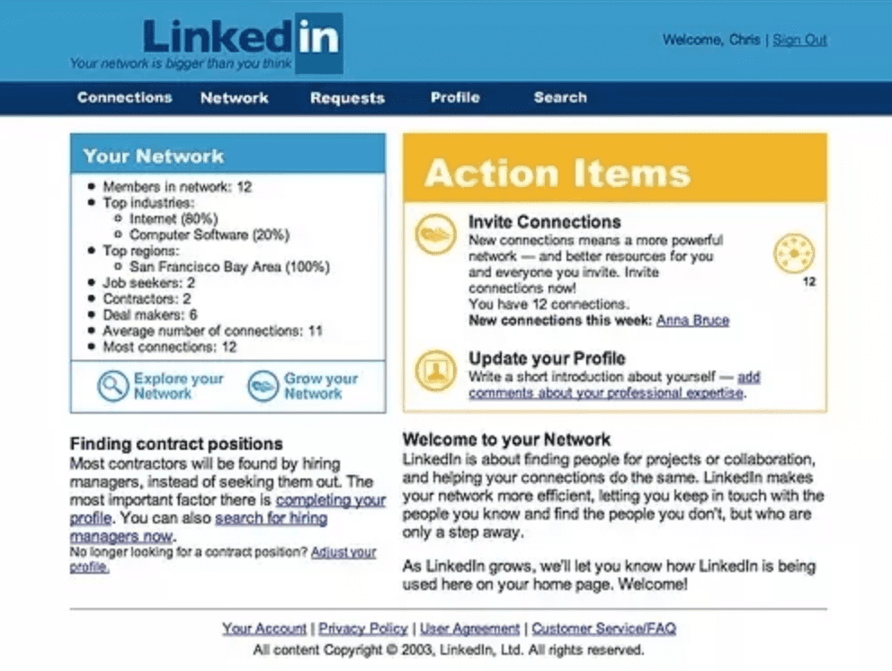

After a successful release, they quickly iterated; adding features such as uploading an address book for bulk invitations and colleague endorsements.

They’ve continued adding features, and now have [706M users in 200 countries and regions](https://news.linkedin.com/about-us#Statistics).

/\* widget: Blog: Expert Tip \*/  /\* reset -------------------- \*/  .blog-custom-block \*,  .blog-custom-block ::before,  .blog-custom-block ::after {  box-sizing: border-box;  border-width: 0;  border-style: solid;  border-color: #e5e7eb;  }  /\* vars -------------------- \*/  .blog-custom-block.blog-custom-block\_\_expert-tip {  --color-bg: #F4FAFE;  --color-border: rgb(15 164 234 / 0.50);  --color-text-1: #0F172A;  --color-text-2: #4A4A68;  }  /\* colors -------------------- \*/  .blog-custom-block.blog-custom-block\_\_expert-tip .bg-clr-bg {  background-color: var(--color-bg);  }  .blog-custom-block.blog-custom-block\_\_expert-tip .border-clr-border {  border-color: var(--color-border);  }  .blog-custom-block.blog-custom-block\_\_expert-tip .text-clr-text-1 {  color: var(--color-text-1);  }  .blog-custom-block.blog-custom-block\_\_expert-tip .text-clr-text-2 {  color: var(--color-text-2);  }  /\* utils -------------------- \*/  .blog-custom-block.blog-custom-block\_\_expert-tip .flex {  display: flex;  }  .blog-custom-block.blog-custom-block\_\_expert-tip .flex-shrink-0 {  flex-shrink: 0;  }  .blog-custom-block.blog-custom-block\_\_expert-tip .flex-col {  flex-direction: column;  }  .blog-custom-block.blog-custom-block\_\_expert-tip .gap-4 {  gap: 1rem;  }  .blog-custom-block.blog-custom-block\_\_expert-tip .gap-5 {  gap: 1.25rem;  }  .blog-custom-block.blog-custom-block\_\_expert-tip .rounded-xl {  border-radius: 0.75rem;  }  .blog-custom-block.blog-custom-block\_\_expert-tip .border {  border-width: 1px;  }  .blog-custom-block.blog-custom-block\_\_expert-tip .p-8 {  padding: 2rem;  }  .blog-custom-block.blog-custom-block\_\_expert-tip .text-3xl {  font-size: 1.875rem;  line-height: 2.25rem;  }  .blog-custom-block.blog-custom-block\_\_expert-tip .text-lg {  font-size: 1.125rem;  line-height: 1.75rem;  }  .blog-custom-block.blog-custom-block\_\_expert-tip .font-bold {  font-weight: 700;  } 

Key Takeaway

Co-founder of LinkedIn, Reid Hoffman, famously said:

"If you’re not embarrassed by the first version of your product, you’ve launched too late"

The point of your MVP is to rapidly get to market and prove your assumptions. That should be your focus. Not building the most beautiful product on the market.

## 7\. Amazon

One of the most famous MVP examples in the world is Amazon.

In the early 90s, when Jeff Bezos saw the rise of the internet he came up with the idea of selling books online. While some entrepreneurs would’ve sunk their entire bank account into a fully-functioning e-commerce store, he did something different.

He left his job as an investment banker, moved back home with his parents and built an MVP in the form of a simple website.

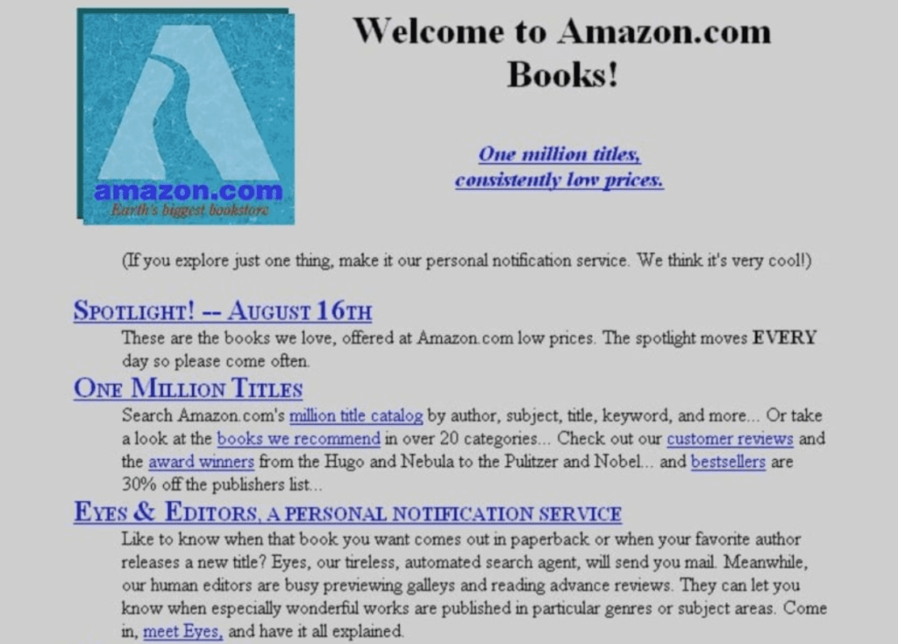

/\* widget: Blog: Expert Tip \*/  /\* reset -------------------- \*/  .blog-custom-block \*,  .blog-custom-block ::before,  .blog-custom-block ::after {  box-sizing: border-box;  border-width: 0;  border-style: solid;  border-color: #e5e7eb;  }  /\* vars -------------------- \*/  .blog-custom-block.blog-custom-block\_\_expert-tip {  --color-bg: #F4FAFE;  --color-border: rgb(15 164 234 / 0.50);  --color-text-1: #0F172A;  --color-text-2: #4A4A68;  }  /\* colors -------------------- \*/  .blog-custom-block.blog-custom-block\_\_expert-tip .bg-clr-bg {  background-color: var(--color-bg);  }  .blog-custom-block.blog-custom-block\_\_expert-tip .border-clr-border {  border-color: var(--color-border);  }  .blog-custom-block.blog-custom-block\_\_expert-tip .text-clr-text-1 {  color: var(--color-text-1);  }  .blog-custom-block.blog-custom-block\_\_expert-tip .text-clr-text-2 {  color: var(--color-text-2);  }  /\* utils -------------------- \*/  .blog-custom-block.blog-custom-block\_\_expert-tip .flex {  display: flex;  }  .blog-custom-block.blog-custom-block\_\_expert-tip .flex-shrink-0 {  flex-shrink: 0;  }  .blog-custom-block.blog-custom-block\_\_expert-tip .flex-col {  flex-direction: column;  }  .blog-custom-block.blog-custom-block\_\_expert-tip .gap-4 {  gap: 1rem;  }  .blog-custom-block.blog-custom-block\_\_expert-tip .gap-5 {  gap: 1.25rem;  }  .blog-custom-block.blog-custom-block\_\_expert-tip .rounded-xl {  border-radius: 0.75rem;  }  .blog-custom-block.blog-custom-block\_\_expert-tip .border {  border-width: 1px;  }  .blog-custom-block.blog-custom-block\_\_expert-tip .p-8 {  padding: 2rem;  }  .blog-custom-block.blog-custom-block\_\_expert-tip .text-3xl {  font-size: 1.875rem;  line-height: 2.25rem;  }  .blog-custom-block.blog-custom-block\_\_expert-tip .text-lg {  font-size: 1.125rem;  line-height: 1.75rem;  }  .blog-custom-block.blog-custom-block\_\_expert-tip .font-bold {  font-weight: 700;  } 

Key Takeaway Despite his MVP’s basic design and minimal feature set, the original Amazon platform proved Bezos’ assumptions. Selling books online at a low cost was something everybody wanted.

## 8\. Spotify

Nowadays, music streaming has become the norm, but it wasn’t always that way.  In 2006, there weren’t many music streaming services on the market and the ones that were available were horrible.

In an era where pirating music was common, Spotify was founded on a shortlist of key assumptions:

1. People are happy to stream (rather than own) music
2. Labels and artists are happy to let people do that legally
3. Fast and stable streaming is technically feasible

Co-founder, Daniel Ek, and his team started their MVP process by tackling the third assumption, their driving metric? How many milliseconds does it take from when I press Play to when I hear the music? It should play instantly and continue to play smoothly. Daniel recalls:

We spent an insane amount of time focusing on latency, when no one cared, because we were hell-bent on making it feel like you had all the world’s music on your hard drive. Obsessing over small details can sometimes make all the difference. That’s what I believe is the biggest misunderstanding about the minimum viable product concept. That is the V in the MVP.

Once they had a basic MVP they began testing, on themselves, family & friends. It was a success, so they extended the beta release to influential music bloggers in Sweden.

They loved the experience and began to spread the word about this incredible new desktop app. Spotify began to gain traction and it was released to the public.

New features were added, a mobile app was created and today Spotify has [299M active monthly users & 138M premium subscribers](https://newsroom.spotify.com/company-info/).

/\* widget: Blog: Expert Tip \*/  /\* reset -------------------- \*/  .blog-custom-block \*,  .blog-custom-block ::before,  .blog-custom-block ::after {  box-sizing: border-box;  border-width: 0;  border-style: solid;  border-color: #e5e7eb;  }  /\* vars -------------------- \*/  .blog-custom-block.blog-custom-block\_\_expert-tip {  --color-bg: #F4FAFE;  --color-border: rgb(15 164 234 / 0.50);  --color-text-1: #0F172A;  --color-text-2: #4A4A68;  }  /\* colors -------------------- \*/  .blog-custom-block.blog-custom-block\_\_expert-tip .bg-clr-bg {  background-color: var(--color-bg);  }  .blog-custom-block.blog-custom-block\_\_expert-tip .border-clr-border {  border-color: var(--color-border);  }  .blog-custom-block.blog-custom-block\_\_expert-tip .text-clr-text-1 {  color: var(--color-text-1);  }  .blog-custom-block.blog-custom-block\_\_expert-tip .text-clr-text-2 {  color: var(--color-text-2);  }  /\* utils -------------------- \*/  .blog-custom-block.blog-custom-block\_\_expert-tip .flex {  display: flex;  }  .blog-custom-block.blog-custom-block\_\_expert-tip .flex-shrink-0 {  flex-shrink: 0;  }  .blog-custom-block.blog-custom-block\_\_expert-tip .flex-col {  flex-direction: column;  }  .blog-custom-block.blog-custom-block\_\_expert-tip .gap-4 {  gap: 1rem;  }  .blog-custom-block.blog-custom-block\_\_expert-tip .gap-5 {  gap: 1.25rem;  }  .blog-custom-block.blog-custom-block\_\_expert-tip .rounded-xl {  border-radius: 0.75rem;  }  .blog-custom-block.blog-custom-block\_\_expert-tip .border {  border-width: 1px;  }  .blog-custom-block.blog-custom-block\_\_expert-tip .p-8 {  padding: 2rem;  }  .blog-custom-block.blog-custom-block\_\_expert-tip .text-3xl {  font-size: 1.875rem;  line-height: 2.25rem;  }  .blog-custom-block.blog-custom-block\_\_expert-tip .text-lg {  font-size: 1.125rem;  line-height: 1.75rem;  }  .blog-custom-block.blog-custom-block\_\_expert-tip .font-bold {  font-weight: 700;  } 

Key Takeaways

Spotify could’ve tried to build in cool features like album artwork and lyrics into the first version of their product. Those (admittedly nice to have) features would have taken more time and money to develop.

Critically, however, those features wouldn’t have got them any closer to proving their main assumptions.

There’s no point putting the cherry on the cake if no one wants the cake.

## 9\. Twitter

Twitter, originally known as *twittr* began as an internal app. It was developed by [Odeo](https://odeo.com/) to give its employees a platform to send messages and display them to a group.

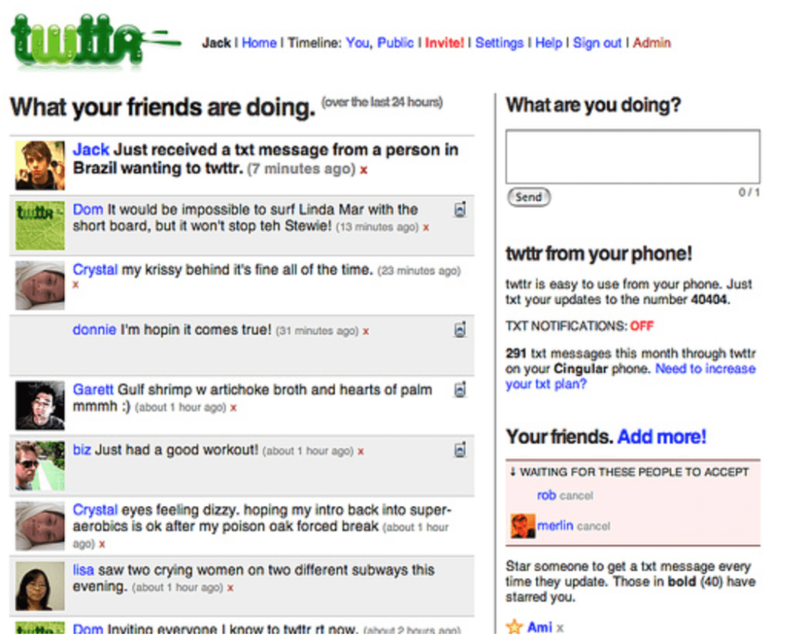

#### After internal success, Twitter was released to the public in July 2006. However, it wasn’t until 2007 that it saw real success. At the South by Southwest Interactive conference that year, daily tweets increased from 20,000 to 60,000.

After the conference, Twitter’s popularity exploded and it’s user base grew exponentially.

/\* widget: Blog: Expert Tip \*/  /\* reset -------------------- \*/  .blog-custom-block \*,  .blog-custom-block ::before,  .blog-custom-block ::after {  box-sizing: border-box;  border-width: 0;  border-style: solid;  border-color: #e5e7eb;  }  /\* vars -------------------- \*/  .blog-custom-block.blog-custom-block\_\_expert-tip {  --color-bg: #F4FAFE;  --color-border: rgb(15 164 234 / 0.50);  --color-text-1: #0F172A;  --color-text-2: #4A4A68;  }  /\* colors -------------------- \*/  .blog-custom-block.blog-custom-block\_\_expert-tip .bg-clr-bg {  background-color: var(--color-bg);  }  .blog-custom-block.blog-custom-block\_\_expert-tip .border-clr-border {  border-color: var(--color-border);  }  .blog-custom-block.blog-custom-block\_\_expert-tip .text-clr-text-1 {  color: var(--color-text-1);  }  .blog-custom-block.blog-custom-block\_\_expert-tip .text-clr-text-2 {  color: var(--color-text-2);  }  /\* utils -------------------- \*/  .blog-custom-block.blog-custom-block\_\_expert-tip .flex {  display: flex;  }  .blog-custom-block.blog-custom-block\_\_expert-tip .flex-shrink-0 {  flex-shrink: 0;  }  .blog-custom-block.blog-custom-block\_\_expert-tip .flex-col {  flex-direction: column;  }  .blog-custom-block.blog-custom-block\_\_expert-tip .gap-4 {  gap: 1rem;  }  .blog-custom-block.blog-custom-block\_\_expert-tip .gap-5 {  gap: 1.25rem;  }  .blog-custom-block.blog-custom-block\_\_expert-tip .rounded-xl {  border-radius: 0.75rem;  }  .blog-custom-block.blog-custom-block\_\_expert-tip .border {  border-width: 1px;  }  .blog-custom-block.blog-custom-block\_\_expert-tip .p-8 {  padding: 2rem;  }  .blog-custom-block.blog-custom-block\_\_expert-tip .text-3xl {  font-size: 1.875rem;  line-height: 2.25rem;  }  .blog-custom-block.blog-custom-block\_\_expert-tip .text-lg {  font-size: 1.125rem;  line-height: 1.75rem;  }  .blog-custom-block.blog-custom-block\_\_expert-tip .font-bold {  font-weight: 700;  } 

Key Takeaway The best way to look for your next opportunity is to look around you at the problems that need solving, just like Odeo did. Don’t try to be the next Zuckerberg or Gates. Look for a [problem to solve](https://www.quora.com/What-are-the-major-sources-of-business-ideas/answer/Rui-Louren%C3%A7o-11), no matter how small it looks. Solve it like no one else has and you’ll be on the right track for success.

## 10\. Zappos

Back in 1999 Zappos’ founder, Nick Swinmurn was frustrated at not finding the perfect pair of shoes at his local mall.

He decided to create a simple website MVP. He would post photos of the shoes from his local mall on that webpage and wait. When someone decided to buy the shoes, he would go back to the mall, buy them and post them.

While this wasn’t a sustainable business model, it did prove the assumption: **People will buy shoes online**.

It was a huge success. Reaching unicorn status, Zappos was [acquired by Amazon in 2009](https://techcrunch.com/2009/11/02/amazon-closes-zappos-deal-ends-up-paying-1-2-billion/) – **to the tune of $1.2B.**

## 11\. Etsy

In 2010, Rob Kalin, Chris Maguire, Jared Tarbell, and Haim Schoppik were working as freelance website builders for a crafting community forum. They saw members complaining on the forum that eBay’s fees were expensive and it was difficult to use.

This sparked the idea for Etsy. The four founders built a simple MVP website that allowed anyone to create an account and sell things they’d produced.

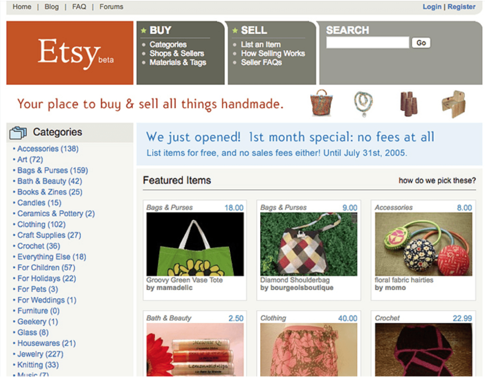

#### Despite its basic functionality and rudimentary design, thousands of sellers signed up within days of launch.

This approach allowed the founders to quickly test their idea while spending little money. They could then use their leftover budget to iterate and scale the website. There are now around 3 million active sellers on the platform reporting a [net income of $96.4M in Q2 2020](https://www.statista.com/statistics/409427/etsy-quarterly-net-income-loss/).

Related: [From Being Fired to Building a Multi-Million Dollar Fintech Startup](https://altar.io/from-being-fired-to-building-a-multi-million-dollar-fintech-startup/)

## 12\. Groupon

Groupon founder, Andrew Mason, didn’t see success straight away. Before Groupon, he launched *The Point.* In an interview with *Mixergy* Andrew recalls that his long time to market was one of the mistakes he made with his first product:

We took between January and November of 2007 to get everything just right and make sure that it aligned with my complete vision of what I wanted this platform to be instead of just getting something started and letting the users tell us if it worked or not

*The Point* was a failure. However, Andrew learnt a valuable lesson from it:

The result of learning it is demonstrated through the creation of Groupon where we went from idea to actual launch product in about a month.

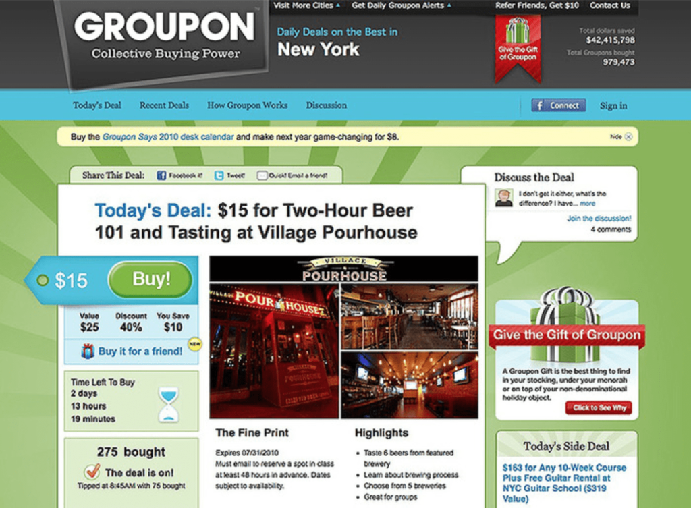

Using a WordPress blog, Groupon posted daily deals as blogposts. Head of customer support Joe Harrow would spend three hours a day [personally emailing customers](https://www.businessinsider.com/inside-groupon-the-truth-about-the-worlds-most-controversial-company-2011-10?r=US&IR=T) who had bought a coupon from the platform.

Despite it’s less than beautiful design, and the leg work needed to reach early adopters, it allowed them to test their model. Instead of spending time and money on a backend infrastructure, they found the shortest road to reach their customers.

Groupon was a huge success and it’s unsurprising, as the saying goes everyone loves a good deal, and this MVP example provided just that.

## 13\. Foursquare

Foursquare is one of many great examples of a single-featured MVP. It encouraged users to check-in at multiple locations. They created a gamification process that would reward users with badges based on the amount and type of check-ins.

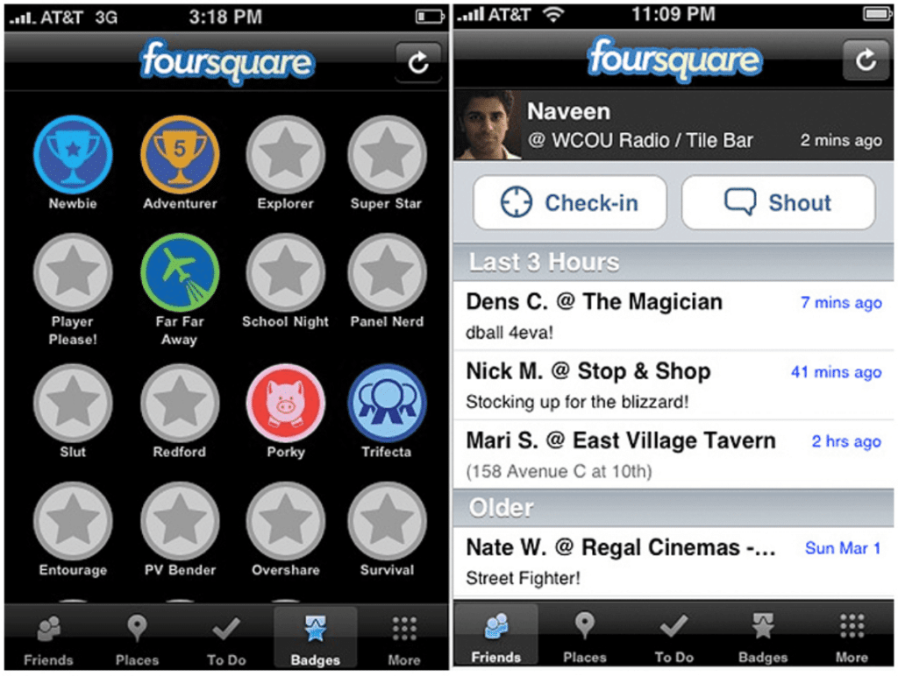

They kept with this single-feature until the platform began to gain traction. Once the user base had started growing, they began to iterate, adding recommendations, city guides and other features.

Today Foursquare [powers location experiences for over 1B people globally](https://99firms.com/blog/foursquare-statistics/#gref).

## 14\. Stripe

Stripe’s story began back in 2010 when John Collison and his brother Patrick started debating why it was so difficult to accept payments on the web.

Patrick was working on several side projects at the time but decided to give this a shot. They started working on a way to solve this problem.

For the first six months, they focused on learning everything they could about the industry and the problems users faced with the solutions available at the time (Paypal).

They shared the idea with friends and family, watching how they interacted with it. Based on that validated learning they began iterating.

The first version wasn’t much to look at, then called /dev/payments:

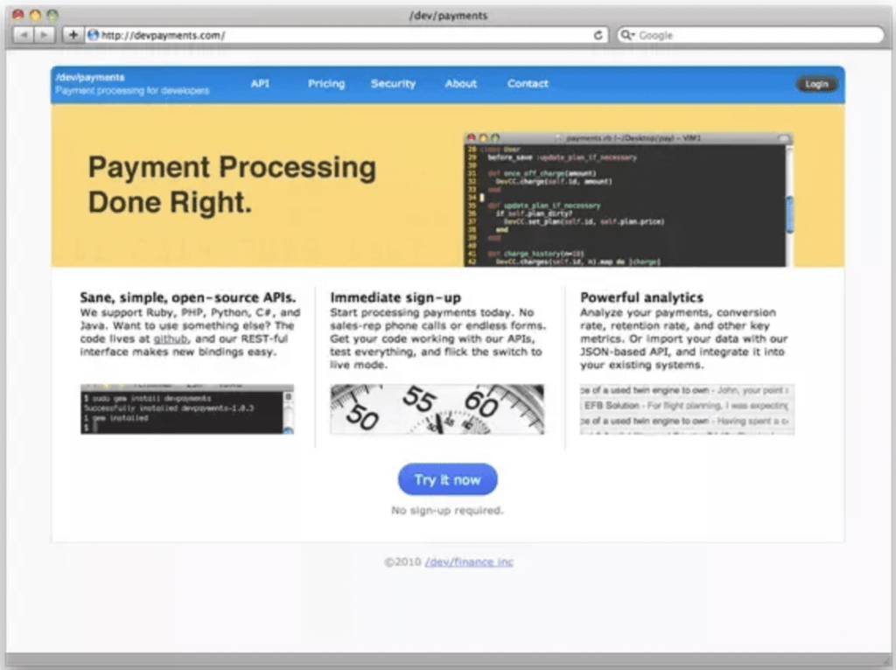

Despite its design and limited features, within 2 weeks of building their initial MVP, they had their first transactions – with a *YCombinator* company *280 North.*

In those initial six months, they accomplished enough to know they were on to something big.

John & Patrick stopped taking on side-projects and focused on Stripe full-time.

Their original plan was to bootstrap the company, but they realized that as a payment startup they could greatly benefit from the credibility a big investor could provide.

Stripe raised a few rounds from VCs and quickly grew into one of the largest mobile payment processing companies in the US, with big clients such as Lyft and Shopify and partnerships with Visa, Apple, Facebook, and Twitter.

By 2016 the Collison brothers had become the youngest self-made billionaires in the world. Stripe is now valued at [$36 billion](https://www.cnbc.com/2020/06/16/stripe-disruptor-50.html).

/\* widget: Blog: Expert Tip \*/  /\* reset -------------------- \*/  .blog-custom-block \*,  .blog-custom-block ::before,  .blog-custom-block ::after {  box-sizing: border-box;  border-width: 0;  border-style: solid;  border-color: #e5e7eb;  }  /\* vars -------------------- \*/  .blog-custom-block.blog-custom-block\_\_expert-tip {  --color-bg: #F4FAFE;  --color-border: rgb(15 164 234 / 0.50);  --color-text-1: #0F172A;  --color-text-2: #4A4A68;  }  /\* colors -------------------- \*/  .blog-custom-block.blog-custom-block\_\_expert-tip .bg-clr-bg {  background-color: var(--color-bg);  }  .blog-custom-block.blog-custom-block\_\_expert-tip .border-clr-border {  border-color: var(--color-border);  }  .blog-custom-block.blog-custom-block\_\_expert-tip .text-clr-text-1 {  color: var(--color-text-1);  }  .blog-custom-block.blog-custom-block\_\_expert-tip .text-clr-text-2 {  color: var(--color-text-2);  }  /\* utils -------------------- \*/  .blog-custom-block.blog-custom-block\_\_expert-tip .flex {  display: flex;  }  .blog-custom-block.blog-custom-block\_\_expert-tip .flex-shrink-0 {  flex-shrink: 0;  }  .blog-custom-block.blog-custom-block\_\_expert-tip .flex-col {  flex-direction: column;  }  .blog-custom-block.blog-custom-block\_\_expert-tip .gap-4 {  gap: 1rem;  }  .blog-custom-block.blog-custom-block\_\_expert-tip .gap-5 {  gap: 1.25rem;  }  .blog-custom-block.blog-custom-block\_\_expert-tip .rounded-xl {  border-radius: 0.75rem;  }  .blog-custom-block.blog-custom-block\_\_expert-tip .border {  border-width: 1px;  }  .blog-custom-block.blog-custom-block\_\_expert-tip .p-8 {  padding: 2rem;  }  .blog-custom-block.blog-custom-block\_\_expert-tip .text-3xl {  font-size: 1.875rem;  line-height: 2.25rem;  }  .blog-custom-block.blog-custom-block\_\_expert-tip .text-lg {  font-size: 1.125rem;  line-height: 1.75rem;  }  .blog-custom-block.blog-custom-block\_\_expert-tip .font-bold {  font-weight: 700;  } 

Key Takeaway

Early-stage advice, from mentors, investors or startup advisors, can be a critical factor in whether or not your startup succeeds.

The Collison brothers knew this. Despite having the talent to bootstrap a beautiful product from day one, they realised it was more important to build their credibility in the fintech industry.

## 15\. Wellfound (Formerly AngelList)

AngelList is a platform designed to help startups connect with investors and raise capital. Founded in 2010, Babak Nivi and Naval Ravikant created a simple test for their idea.

Leveraging their contacts, the offered founders email introductions to investors.

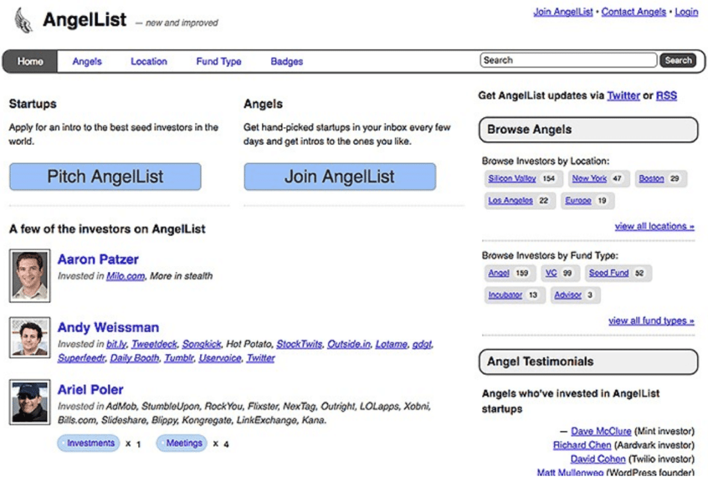

After seeing that their idea had potential, they scaled their idea. They have expanded and now offer employee recruitment opportunities to around [3.6M users](https://expandedramblings.com/index.php/angellist-statistics-and-facts/).

## 16\. Product Hunt

Product Hunt’s founder, Ryan Hoover wanted to build a community for users to share their products and discuss them with others. He could’ve spent months building a fully-fledged platform. Instead, he used a pre-existing technology to build an MVP.

Using a tool called Linkydink, he created a link-sharing group and added his startup friends to it. Using PR and social media to promote his quick MVP he attracted over 170 people within the first two weeks.

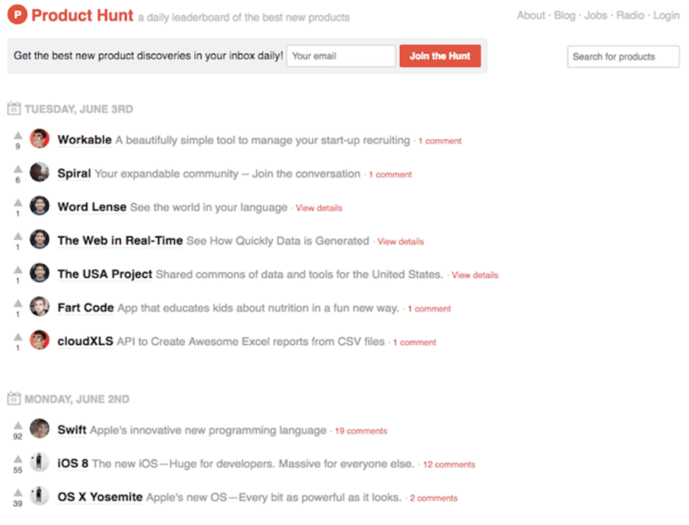

With his idea validated, he moved on to building the full platform. It’s become the go-to for product enthusiasts to share and discover new products.

## 17\. Monzo

Monzo started life as a prepaid card service. Like many of the examples of an MVP, they used pre-existing resources to build the first version of their product, in this case, another banks license and card processor. CEO Tom Blomfield recalled the early days of Monzo’s journey in a recent AMA:

I don’t think we even had cards at first—we just had an API where you could move money around. I think we gave out 15 demo cards at a hackathon. We invited people from our waiting list to come by and see what cool apps they could build atop our API.

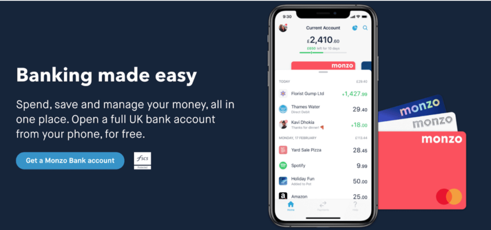

Monzo is now a fully-fledged bank challenging traditional banks in the UK boasting [four million registered customers](https://www.businessofapps.com/data/monzo-statistics/).

## 18\. Kickstarter

As well as a popular platform for many startups as an MVP platform, Kickstarter itself is one of the examples of an MVP.

In 2006 they built the first version of the website with only the minimum features needed to prove their concept.

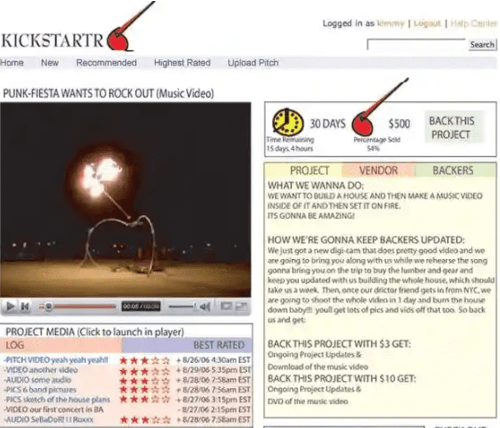

They launched a closed alpha of their MVP in February 2009. In May of the same year, they launched the product to the public. They quickly launched and funded their first project (it raised $35 from three backers).

They kept going in this fashion and today the platform has successfully funded [190,157 projects from over 18M backers](https://www.kickstarter.com/help/stats).

## 19\. Hubspot

Hubspot is a complex product used by marketers across the globe. Differently to the other MVP examples, they started out with a much simpler platform.

In 2005, co-founders Brian Halligan and Dharmesh Shah built a blog – a community for users to discuss topics such as inbound marketing and content.

Seeing the blog gain an audience, the co-founders decided to build it into an actual product and in 2006 they launched the first version in the form of a closed beta.

Today they offer software for Marketing, Sales, Customer Service and Content management. Plus, they’ve carried on with the blog, as well as providing free courses, certifications, ebooks, and many more resources.

## 20\. Curveball – Apple & The Original iPhone

Finally, here’s the one you probably weren’t expecting.

For me, one of the prime examples of an MVP was created by Apple: the first-generation iPhone.

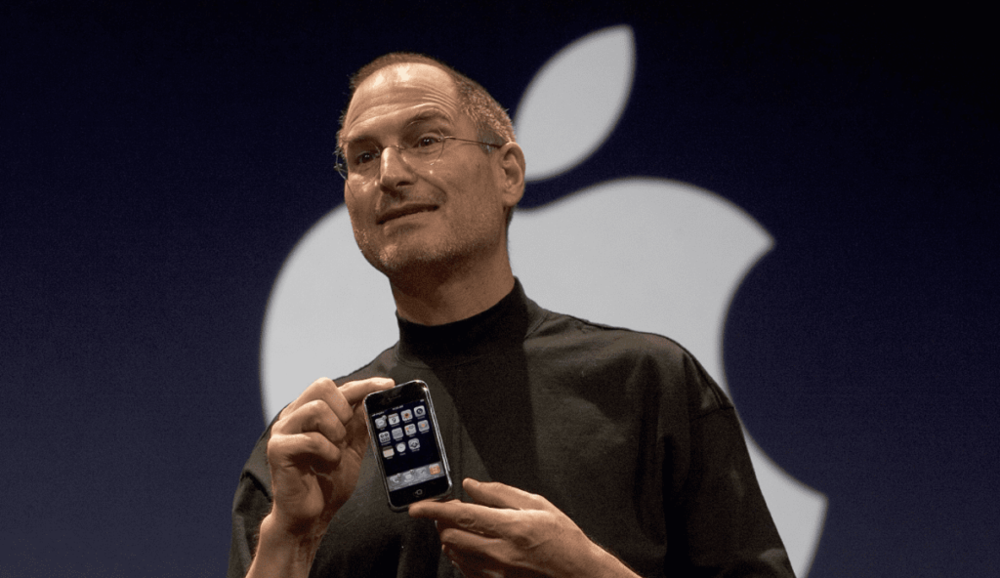

Surprising claim right? But stick with me.

Back in 2007, the original iPhone had a limited number of first-party apps, with no way to download more. There was no notification centre, no copy/paste functionality, no backend exchange server. It was limited to one carrier, AT&T, on a minimum two-year contract.

At the time of launch, [reporters noted](https://appleinsider.com/articles/18/06/29/the-story-of-the-original-iphone-that-nobody-thought-was-possible) that it was flawed and lacked some features found in the most basic phones.

One thing they all agreed on though? **The iPhone was revolutionary.**

Apple wasn’t trying to build a flawless fully-featured product. They were building a product that had the **core features needed to validate several assumptions**:

- Will users adopt the idea of an on-screen keyboard?
- Do users actually need/want access to the full internet on a mobile device?
- Will users adopt the idea of using the browser for applications, as opposed to loading apps onto the device? (As all other computing apps had done before it.)
- Will users adopt the *one device for everything* hypothesis? Or would they rather carry several, distinct devices? (A phone, an iPod, etc.)

They launched it, and one year (and [1.39M iPhones](https://www.statista.com/statistics/276306/global-apple-iphone-sales-since-fiscal-year-2007/) sold) later they moved onto the next stage of the MVP process.

They iterated on their original product, releasing the *iPhone 3G* in 2008*.* This newer iPhone offered:

- Support for third-party apps
- Larger base storage (8GB, up from 4GB)
- Better battery life
- A much cheaper price ($199 for the base model, down from $499)

/\* widget: Blog: Expert Tip \*/  /\* reset -------------------- \*/  .blog-custom-block \*,  .blog-custom-block ::before,  .blog-custom-block ::after {  box-sizing: border-box;  border-width: 0;  border-style: solid;  border-color: #e5e7eb;  }  /\* vars -------------------- \*/  .blog-custom-block.blog-custom-block\_\_expert-tip {  --color-bg: #F4FAFE;  --color-border: rgb(15 164 234 / 0.50);  --color-text-1: #0F172A;  --color-text-2: #4A4A68;  }  /\* colors -------------------- \*/  .blog-custom-block.blog-custom-block\_\_expert-tip .bg-clr-bg {  background-color: var(--color-bg);  }  .blog-custom-block.blog-custom-block\_\_expert-tip .border-clr-border {  border-color: var(--color-border);  }  .blog-custom-block.blog-custom-block\_\_expert-tip .text-clr-text-1 {  color: var(--color-text-1);  }  .blog-custom-block.blog-custom-block\_\_expert-tip .text-clr-text-2 {  color: var(--color-text-2);  }  /\* utils -------------------- \*/  .blog-custom-block.blog-custom-block\_\_expert-tip .flex {  display: flex;  }  .blog-custom-block.blog-custom-block\_\_expert-tip .flex-shrink-0 {  flex-shrink: 0;  }  .blog-custom-block.blog-custom-block\_\_expert-tip .flex-col {  flex-direction: column;  }  .blog-custom-block.blog-custom-block\_\_expert-tip .gap-4 {  gap: 1rem;  }  .blog-custom-block.blog-custom-block\_\_expert-tip .gap-5 {  gap: 1.25rem;  }  .blog-custom-block.blog-custom-block\_\_expert-tip .rounded-xl {  border-radius: 0.75rem;  }  .blog-custom-block.blog-custom-block\_\_expert-tip .border {  border-width: 1px;  }  .blog-custom-block.blog-custom-block\_\_expert-tip .p-8 {  padding: 2rem;  }  .blog-custom-block.blog-custom-block\_\_expert-tip .text-3xl {  font-size: 1.875rem;  line-height: 2.25rem;  }  .blog-custom-block.blog-custom-block\_\_expert-tip .text-lg {  font-size: 1.125rem;  line-height: 1.75rem;  }  .blog-custom-block.blog-custom-block\_\_expert-tip .font-bold {  font-weight: 700;  } 

Key Takeaway

The purpose of an MVP is to excite and attract users, spark conversations about what your product might be able to do next. Your MVP needs to prove that users need your solution and will adopt your product.

Then, once you’ve validated your assumptions, you can build a better product, based on that validated learning.

## Wrapping Up

After reading that list of MVP examples, it’s easy to see why building an MVP has become the de facto process for startups. It allows entrepreneurs to stay at the forefront of innovation and test their ideas, without giving up all of their time, effort and money.

The trend among all these MVP examples is:

1. Think about your target users’ key problem and how to solve it.
2. Cut down your product to the key features needed to prove your value to your target users.
3. Build those features into an MVP.
4. Take what you learn from the adoption of your MVP and use that information to iterate on top of it to create your fully-functioning product.

*For more resources on how to build an MVP and other aspects of the startup journey check out our* [_blog_](https://altar.io/blog/)*, or* [_reach out to us_](https://altar.io/start-a-project/)_, we’d love to hear from you._
