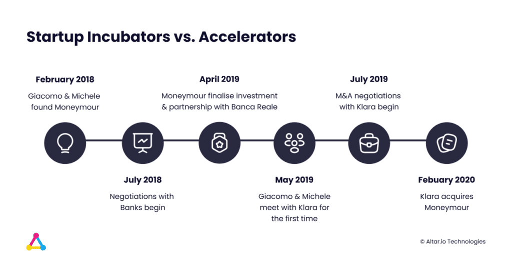
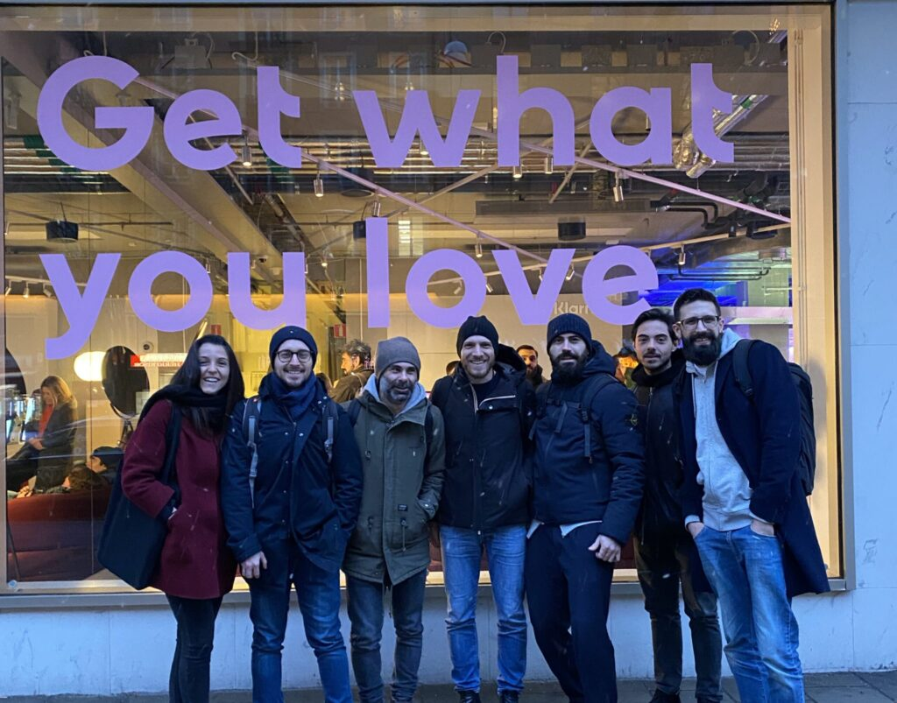

We often talk about how people are the most important aspect of your startup – regardless of if you're in fintech, social media or any other vertical.

Whether it’s your team, advisors, investors or clients, having the right people in your corner can be the critical difference between success and failure.

And when it comes to finding those people, your relationships are as valuable as the money in your pocket.

Something entrepreneur, and co-founder of fintech [Moneymour](https://www.linkedin.com/company/moneymour/), [Giacomo De Lorenzo](https://www.linkedin.com/in/giacomodelorenzo/) knows a thing or two about:

 

I wouldn’t have imagined I could have had so much help from the people I talked to during the early stages of Moneymour, their advice had a hugely beneficial impact.

Not only did Giacomo see a problem that needed solving, but he also took advantage of every opportunity to reach out to his connections and gather valuable feedback on his fintech product.

This led to such a strong project foundation that it sparked the interest of fintech unicorn [Klarna](https://www.klarna.com/us/) before Giacomo had a chance to launch.

My colleague Rui & I sat down with Giacomo to find out more about his incredible journey, and get his advice on building a fintech startup.

## Interview with Fintech Founder Giacomo De Lorenzo

#### Paolo: Can you tell us a bit about yourself and your path leading to Moneymour?

**Giacomo:** I grew up in a family of entrepreneurs: my grandparents built the Garden Hotel in Praia a Mare, a tourist village in the north of Calabria.

My passion for entrepreneurship led me to study business: for three years at Bocconi, then a Masters at ESCP Europe.

In my first work experiences in Vodafone, Rocket Internet and Procter & Gamble I understood what I wanted.

No big companies and titles, I preferred responsibility and freedom of action to structure.

**I wanted to change the status quo, I wanted to be an entrepreneur.**

I started among the founders of Mario App, a marketplace to find the best home-services professionals. Here I greatly enriched my experience and most importantly met Michele Giannotta, who later became the cofounder in our following adventure: Moneymour.

#### Paolo: Can you take a moment to describe Moneymour?

**G:** We started building Moneymour to provide instant loans for online purchases with a simple and transparent process. Something unheard of in the Italian market.

People had to fall in love with the way we would simplify their access to credit, so we called it Moneymour - do you notice the assonance with the French "mon amour"?

For the purpose of this discussion, it’s important to state that **Moneymour never went to market. We were acquired right before launching.**

Moneymour was a technology provider for our partner bank, Banca Reale. We were entitled from the bank to take on the whole user experience and the credit scoring, and pass the client to the bank who disbursed the loan.

#### P: How did you come up with the idea for the fintech?

As I said, we were two co-founders Michele and myself, and we were working for Mario App.

At the time, we needed a new computer, this was early 2017. We were working for a startup, so we didn’t have a whole lot of spare money.

We set out to buy the computer with a loan.

The loan landscape in Italy sucked at the time. In the end, we both asked for an online loan, from the same provider.

We had to fill in countless forms, upload documentation like payslips and bank transactions, ID, etc. After spending half an hour to do that you’d have to wait for someone to decide on your application

This is usually done in 2-4 days. However, for some banks & financial institutions, it can be as long as 7 days.

We waited for two days, and Michele got the loan, but I didn’t. Later, we hypothesized I didn’t get the loan because of my lack of credit history.

We were commuting for around three hours a day together, and we used the journey to talk about new ideas.

This loan experience came up in a few of these conversations to and from the office. We realised that it was a problem that needed solving.

**As entrepreneurs, we want to solve problems, it’s almost like an illness**

We exited Mario App. And the time was right to learn more about the next opportunity.

**I’m a firm believer in doing one thing and doing it well, which is why we waited for one project to finish before starting the next.**

We saw other countries had fintech companies like [Klarna](https://www.klarna.com/us/) doing instant loans for online purchases. We wanted to bring that instant loan model to Italy.

Despite not having any experience in the vertical, we saw that this was a problem that needed solving.

So we went and started talking to people working in Fintech, and asking for feedback. We were asking for introductions to banks so we could present to them and so on.

In August 2017, we were saying to each other “What are we going to do? Is this a real need in the market?”

We were trying to talk to banks through contacts explaining what we wanted to do. Although we understood the problem we wanted to solve, we weren’t set on how to do it per se.

We needed a bank to give us money so we could lend it online through an algorithm, which we’ll talk about in more detail later.

So, we didn’t know who we wanted to build the algorithm, we didn’t know where to get the money etc. We were feeling a bit lost.

Then Michele sent me a link of a fintech expert at a conference. It was very interesting so I reached out to him on LinkedIn with a personalised message.

I asked for his advice on our idea. He gave me the opportunity to meet with him and present it.

So we had a call. It was mid-August. He liked the idea, he liked me. And he gave me some contacts I could speak with.

Then, he invited me to one of the biggest Fintech events in Europe, [Trustech](https://www.trustech-event.com/), in Cannes. We decided to try it out.

It was an interesting event in and of itself. But the key moment was when we met Michele Novelli, a partner from [Digital Magics](http://www.digitalmagics.com/en/), the biggest startup accelerator in Italy. He came to us and asked us about the idea. He told us to apply to their accelerator programme.

The acceleration programme was extremely important because it was there that we found the bank willing to risk the upfront money for us to lend through Moneymour. They also invested in our fintech.

The lesson here is:

Never be ashamed of chasing people, asking for feedback, contacts etc. People won’t come to you and give you a present unless you really chase them.

/\* widget: Blog: Expert Tip - Quotes \*/  /\* reset -------------------- \*/  .blog-custom-block \*,  .blog-custom-block ::before,  .blog-custom-block ::after {  box-sizing: border-box;  border-width: 0;  border-style: solid;  border-color: #e5e7eb;  }  /\* vars -------------------- \*/  .blog-custom-block.blog-custom-block\_\_expert-tip {  --color-bg: #F4FAFE;  --color-border: rgb(15 164 234 / 0.50);  --color-text-1: #0F172A;  --color-text-2: #4A4A68;  }  /\* colors -------------------- \*/  .blog-custom-block.blog-custom-block\_\_expert-tip .bg-clr-bg {  background-color: var(--color-bg);  }  .blog-custom-block.blog-custom-block\_\_expert-tip .border-clr-border {  border-color: var(--color-border);  }  .blog-custom-block.blog-custom-block\_\_expert-tip .text-clr-text-1 {  color: var(--color-text-1);  }  .blog-custom-block.blog-custom-block\_\_expert-tip .text-clr-text-2 {  color: var(--color-text-2);  }  /\* utils -------------------- \*/  .blog-custom-block.blog-custom-block\_\_expert-tip .flex {  display: flex;  }  .blog-custom-block.blog-custom-block\_\_expert-tip .flex-shrink-0 {  flex-shrink: 0;  }  .blog-custom-block.blog-custom-block\_\_expert-tip .flex-col {  flex-direction: column;  }  .blog-custom-block.blog-custom-block\_\_expert-tip .gap-4 {  gap: 1rem;  }  .blog-custom-block.blog-custom-block\_\_expert-tip .gap-5 {  gap: 1.25rem;  }  .blog-custom-block.blog-custom-block\_\_expert-tip .rounded-xl {  border-radius: 0.75rem;  }  .blog-custom-block.blog-custom-block\_\_expert-tip .border {  border-width: 1px;  }  .blog-custom-block.blog-custom-block\_\_expert-tip .p-8 {  padding: 2rem;  }  .blog-custom-block.blog-custom-block\_\_expert-tip .text-3xl {  font-size: 1.875rem;  line-height: 2.25rem;  }  .blog-custom-block.blog-custom-block\_\_expert-tip .text-lg {  font-size: 1.125rem;  line-height: 1.75rem;  }  .blog-custom-block.blog-custom-block\_\_expert-tip .font-bold {  font-weight: 700;  } 

Expert Tip

Start developing relationships with people who’re relevant to your startup as soon as possible. You’ll not only find talent, but you’ll also find customers, advisors – and maybe even investors.

**[Yaron Samid](https://www.linkedin.com/in/yaronsamid/), Serial Entrepreneur & Startup Founder**

##### Building a Startup?

From the product and business reasoning to streamlining your MVP to the most important features, our team of product experts and ex-startup founders can help you bring your vision to life.

Let's Talk

#### P: How did you meet your Co-Founder, Michele?

**G:** We met when co-founding Mario App through a common friend.

It was a random match. But after working together for two and a half years we knew we were the right match when it came to starting Moneymour.

#### P: We have experience working with banks and the sales cycle is long, how was your experience trying to partner with a bank?

**G:** It was a really really _really_ long sales cycle.

We started the accelerator programme in January 2018. We had Banca Reale particularly interested throughout thanks to the push and vision from their Corporate VC department and Andrea Birolo. Then, in June we had the investment day of the accelerator.

But we didn’t finalise the partnership with a bank until April 2019.

**It’s common when working with banks that things get delayed. It’s par for the course when building a fintech.**

As frustrating as it can be, it’s normal to face issues especially when it comes to compliance and the legal side.

We wanted to disrupt an industry, get close to the boundaries of what’s allowed versus not allowed by law. And we wanted to do it in partnership with a bank supervised by the Bank of Italy.

There were a lot of hurdles to overcome, but that’s all part of building a disruptive product.

#### P: What other difficulties have you encountered?

**G:** Pretty much everything in this adventure has been a difficulty.

As I said, we knew the problem but we didn’t know how to solve it. I knew I needed to hire a team, starting with data scientists.

However, I didn’t know how to find the right data scientist for the job.

So, I added around 200 data scientists on LinkedIn and had about 100 calls interviewing them and asking for their feedback. I asked them about our idea and what I should be looking for in candidates.

The feedback told me we needed an expert not just in data science, but in our vertical.

Then, I found Nicholas Parini, a data scientist with a great vision. Since the moment I first spoke to him I understood he was the right person for our mission.

He had experience as a consultant working on banks’ credit scoring algorithms. Which meant he had a wealth of experience talking to banks. He had so much knowledge on that side it was like he was made for the job.

So we onboarded him, and later another data scientist, Leonardo Totò, and a kick-ass full-stack developer, Antonio Trapani.

 We had some help from [Digital Magics](http://www.digitalmagics.com/en/) at this time, in the form of a convertible loan. We used this to pay the employees.

For us, the co-founders, it was a really hard time. We didn’t have any income for a year and a half. It was extremely stressful.

I was surviving on pasta and oil or rice in those early months. Not being able to take my girlfriend out to dinner was really frustrating. I didn’t have any internet at home because those €25 per month could be invested in food. I can look back on it now and smile, but at the time it was tough.

After the capital raise, Michele and I were able to pay ourselves a salary and we completed the team with other 2 key people: Alessandro Paolino, mobile developer, and Sabrina Copertini, designer.

Related: [How to Build a Startup? CTO, Freelancers, Agency?](https://altar.io/whats-the-best-way-to-build-your-startup-cto-freelancers-agency/)

#### P: You mentioned at the beginning of our conversation that you were acquired before launch. This is very rare, how did it come about?

**G:** We didn’t really have any kind of exit in mind when we started.

It just so happened that Klarna was scouting the Italian market at the time.

There aren’t many fintech startups in Italy, maybe 150 or so.

It’s easy to shortlist a dozen startups that could be interesting for a company like Klarna.

And that’s what they did. They called a shortlist of fintech startups and we were on the list.

**Two weeks later they were in our office.** 

We had a three-hour meeting to explain Moneymour. They were clearly interested in us, they organised technical “deep dives” into our technologies and algorithm.

**They recognised the value we had created in a short time. So they drafted a proposal for us and we started the negotiation.**

This was all going on just after we had finalised with the bank. In fact, the first email from Klarna arrived in my inbox just one week after the partnership.

We went from waiting for nine months - while building our top-notch product and algorithm, but still waiting - to everything happening at once.

In July, Klarna booked me for a call and their M&A team told me: "Right, we’ve decided, we want to buy you: let’s start the negotiation."

#### Rui: As you were acquired pre-launch, how much of the product did you build?

**G:** We built the entire product.

And now, with the knowledge I have of Klarna's product, I can tell you despite our limitations we had the best UX possible.

We started with the algorithm, which was supposed to make decisions based on Open Banking data.

We asked the users for access to their bank statements. Then we could read their transactions and establish if the person was eligible to receive credit or not.

We built it based on the information of 40k anonymized people with transactions and loan details. We made sure the algorithm was airtight.

So airtight, in fact, that our algorithm had a very low default rate, also compared to the one the bank was using.

Then we built the fintech platform itself.

We were able to build a nearly fully-featured platform before going to market. I would’ve liked to go to market sooner, but obviously, we had to wait for the bank partnership to be closed.

This was among the reasons Klarna acquired us. We’d created great technology and a great algorithm. We demonstrated the value we had beyond commercial value.

I think we would’ve had different benefits if we'd been able to take a leaner approach.

#### R: Back when you were building the Product, what was a typical "day in the life"?

**G:** I always tried to arrive at the office before everyone else. Around 8:30.

The day depended on the phase in which we were in. But, generally, my main time was used up with:

- Hiring: businesses are made of people, and I wanted to make sure we found the right candidates.
- Negotiations: pretty much the entire time at the early stages I was negotiating with someone, whether it was a bank, investor or service provider.

So those were my priorities. Writing documents, preparing for presentations. Getting paperwork ready for the legal side of everything. Interviewing candidates. Reaching out to people on LinkedIn.

Then the other side was the product.

Related: [How to Build a Successful Minimum Viable Product (MVP) in 3 Steps](https://altar.io/features-inside-mvp-3-steps-know-answer/#how-to-build-an-mvp-3-steps) I wanted to make sure I was involved in the product side from a business standpoint.

We wanted to create this great user experience for applying for loans. We also wanted to use the best providers. The best providers for Open Banking, Know Your Customer, etc.

#### P: One common thing entrepreneurs do is think of HR as the least important part of an early-stage startup. The “people” aspect tends to fall into the background.

#### What do you think?

**G:** I totally agree with you, and it’s something that universities and business schools don’t prepare you for.

I remember when I was studying at university, in some courses we touched topics about culture, vision, mission, principles. At the time I was ignorantly convinced this was something negligible, a nice to have for a company. Now I deeply believe culture is the foundation of a company.

**Culture eats strategy for breakfast.**

You can have the best product vision in the world, but if you don’t have the right people with you you won’t succeed in anything.

/\* widget: Blog: Expert Tip - Quotes \*/  /\* reset -------------------- \*/  .blog-custom-block \*,  .blog-custom-block ::before,  .blog-custom-block ::after {  box-sizing: border-box;  border-width: 0;  border-style: solid;  border-color: #e5e7eb;  }  /\* vars -------------------- \*/  .blog-custom-block.blog-custom-block\_\_expert-tip {  --color-bg: #F4FAFE;  --color-border: rgb(15 164 234 / 0.50);  --color-text-1: #0F172A;  --color-text-2: #4A4A68;  }  /\* colors -------------------- \*/  .blog-custom-block.blog-custom-block\_\_expert-tip .bg-clr-bg {  background-color: var(--color-bg);  }  .blog-custom-block.blog-custom-block\_\_expert-tip .border-clr-border {  border-color: var(--color-border);  }  .blog-custom-block.blog-custom-block\_\_expert-tip .text-clr-text-1 {  color: var(--color-text-1);  }  .blog-custom-block.blog-custom-block\_\_expert-tip .text-clr-text-2 {  color: var(--color-text-2);  }  /\* utils -------------------- \*/  .blog-custom-block.blog-custom-block\_\_expert-tip .flex {  display: flex;  }  .blog-custom-block.blog-custom-block\_\_expert-tip .flex-shrink-0 {  flex-shrink: 0;  }  .blog-custom-block.blog-custom-block\_\_expert-tip .flex-col {  flex-direction: column;  }  .blog-custom-block.blog-custom-block\_\_expert-tip .gap-4 {  gap: 1rem;  }  .blog-custom-block.blog-custom-block\_\_expert-tip .gap-5 {  gap: 1.25rem;  }  .blog-custom-block.blog-custom-block\_\_expert-tip .rounded-xl {  border-radius: 0.75rem;  }  .blog-custom-block.blog-custom-block\_\_expert-tip .border {  border-width: 1px;  }  .blog-custom-block.blog-custom-block\_\_expert-tip .p-8 {  padding: 2rem;  }  .blog-custom-block.blog-custom-block\_\_expert-tip .text-3xl {  font-size: 1.875rem;  line-height: 2.25rem;  }  .blog-custom-block.blog-custom-block\_\_expert-tip .text-lg {  font-size: 1.125rem;  line-height: 1.75rem;  }  .blog-custom-block.blog-custom-block\_\_expert-tip .font-bold {  font-weight: 700;  } 

Expert Tip

Startup advisors and mentors are both necessary and useful. Most of the things that you do, in the real world, aren’t learnt in any school. You learn a lot of academia around business. But what you don’t learn about is startups.

**[Martin Zwilling](https://www.linkedin.com/in/martinzwilling/), Founder, CEO & Startup Advisor**

#### R: Having the right people behind you is one of the key aspects of startup success and something we talk about a lot at Altar.io.

#### Besides your team, did you have any advisors or mentors that helped you?

**G:** This is a very important point. For us, it was Digital Magics, our accelerator.

We participated in their acceleration programme because we wanted a bank. That was the only goal.

As said, we found the bank. But we got much more than that. We gained access to a network with experience in banking and fintech from people with an institutional presence. We received strategic support. Introductions to partners and investors.

Michele, the partner responsible for the fintech acceleration programme, the same person we met in Cannes, was especially helpful in so many ways.

**The accelerator partners had that institutional presence. Having them in our corner when negotiating with banks was invaluable.**

Me going to a bank, or an investor and saying “I’m gonna build this fintech product that will disrupt the industry” is very different to someone with many years of experience and influence at an institutional level saying it.

I was speaking with Michele or Maria Imbesi from Digital Magics a couple of times a day, and it really gave us the support to build what we built.

#### R: What was the biggest lesson you learned with Moneymour that you carry with you?

**G:** The first thing that comes to mind is to not surrender, and not be ashamed and keep pushing. That’s the rule for me.

When we were 14 months in and we had no money, we could’ve given in. But we kept pushing through all our negotiations and it worked out.

**Resilience is an extremely important part of entrepreneurship.**

#### R: What would you do differently at Moneymour now?

**G:** I would’ve looked closer at what other companies in our vertical were offering.

My advice, don’t try and build the solution the way you think it’s best. Look at how the problem is being solved around you and don’t reinvent the wheel.

For example, we went lean with Moneymour as we set up a solid regulated fintech product with the minimum features. But now that I know the market I can say that, had we built a non-regulated product, we could have launched faster.

#### R: Which resource was invaluable for your success?

**G:** I would say, people. Or rather, the ability to ask for people’s help.

I wouldn’t have imagined I could have so much help from the people I talked to at the early stages of Moneymour, and their fintech advice had a hugely beneficial impact.

Let me give you an example.

Digital Magics were extremely helpful, as I mentioned before. But not all of the startups that were part of that acceleration programme made the right use of them.

They were not calling them twice a day. Whereas I knew I had that opportunity so I took it, and it was very valuable for us.

So embrace that ability to ask for help, it’s one of the most valuable resources you have. You’ll be surprised how many people will be happy to help.

## Wrapping Up

It’s never too early to start building bridges. Whether it’s with clients, leads, investors, advisors, investors, mentors.

Regardless of the stakeholder, there’s never a bad time to strengthen relationships and build new ones.

And never be afraid to ask for help or advice, it will help you improve your product, and your business.
