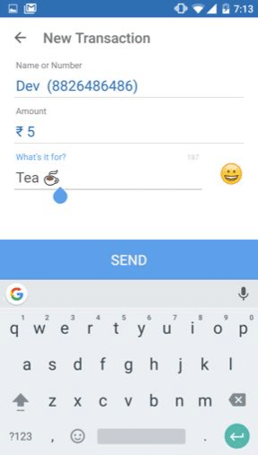

From “challenger banks” to cryptocurrency and blockchain technology, fintech startups such as Stripe & Paypal continue to revolutionise the financial industry. And with over [20,000 fintech startups](https://www.statista.com/statistics/893954/number-fintech-startups-by-region/#:~:text=There%20were%208%2C775%20financial%20technology,in%20the%20Asia%20Pacific%20region.) across the globe breaking into this competitive landscape is no easy task.

I’ve [worked with many fintech startups](https://altar.io/work/) over the years; with each new story, I learn something new.

This time, I'm sharing an action-packed conversation with a [Forbes 30 under 30](https://www.forbes.com/30-under-30/2020/asia/finance-vc/#11ddfd4a56c7) founder with years of experience in the financial technologies landscape.

In 2015, [Ankit Singh](https://www.linkedin.com/in/kmaquasar/) founded fintech startup [MyPoolin](https://www.crunchbase.com/organization/mypoolin) - a peer to peer payment platform that disrupted the Indian fintech market.

Less than four years later MyPoolin was acquired by California-based fintech startup [Wibmo](https://www.wibmo.co/). Ankit remained with Wibmo as director of business and product for a further three years.

In this interview, Ankit spoke candidly about his experience. He also provided some valuable tips on how to build a fintech startup.

## Launching a Fintech Startup: Interview with Ankit Singh

#### Q: Did you always want to be an entrepreneur?

A: With me, there was never a preconceived plan to launch a fintech startup or become an entrepreneur per se. It all started when a friend of mine and I travelled to Harvard in February 2012. We were there for a few weeks, on campus.

During that time we saw students settling money amongst themselves after a meal out using Venmo and Splitwise. [Venmo](https://venmo.com/) was a fintech startup that had just launched their product out of the University of Pennsylvania and all the students were using it. Another Fintech startup, [Splitwise](https://www.splitwise.com/) had just started at Harvard and that was also gaining popularity.

When we saw the ease with which students were settling money among each other, we thought back home to India. Whenever we had to settle money we had to walk a mile or two to withdraw cash from an ATM on campus to settle the bills.

Seeing that stark comparison between the US and India made us feel that “Wow, this is something we should do back home”.

/\* widget: Blog: Top Quote \*/  /\* reset -------------------- \*/  .blog-custom-block \*,  .blog-custom-block ::before,  .blog-custom-block ::after {  box-sizing: border-box;  border-width: 0;  border-style: solid;  border-color: #e5e7eb;  }  /\* vars -------------------- \*/  .blog-custom-block.blog-custom-block\_\_top-quote {  --color-bg: #F4FAFE;  --color-border: rgb(15 164 234 / 0.50);  --color-text-1: #0F172A;  }  /\* colors -------------------- \*/  .blog-custom-block.blog-custom-block\_\_top-quote .border-clr-border {  border-color: var(--color-border);  }  .blog-custom-block.blog-custom-block\_\_top-quote .bg-clr-bg {  background-color: var(--color-bg);  }  .blog-custom-block.blog-custom-block\_\_simple-quote .text-clr-text-1 {  color: var(--color-text-1);  }  /\* utils -------------------- \*/  .blog-custom-block.blog-custom-block\_\_top-quote .flex {  display: flex;  }  .blog-custom-block.blog-custom-block\_\_top-quote .flex-shrink-0 {  flex-shrink: 0;  }  .blog-custom-block.blog-custom-block\_\_top-quote .flex-col {  flex-direction: column;  }  .blog-custom-block.blog-custom-block\_\_top-quote .items-center {  align-items: center;  }  .blog-custom-block.blog-custom-block\_\_top-quote .gap-4 {  gap: 1rem;  }  .blog-custom-block.blog-custom-block\_\_top-quote .rounded-xl {  border-radius: 0.75rem;  }  .blog-custom-block.blog-custom-block\_\_top-quote .border {  border-width: 1px;  }  .blog-custom-block.blog-custom-block\_\_top-quote .p-8 {  padding: 2rem;  }  .blog-custom-block.blog-custom-block\_\_top-quote .text-center {  text-align: center;  }  .blog-custom-block.blog-custom-block\_\_top-quote .text-2xl {  font-size: 1.5rem;  line-height: 2rem;  }  .blog-custom-block.blog-custom-block\_\_top-quote .font-bold {  font-weight: 700;  } 

### _We really wanted to solve this problem, honestly, for ourselves rather than for anybody else._

And that’s how it started - as a side project. We asked ourselves “in our school how can we enable easy P2P payment settlements.” And that is what led to the idea of MyPoolin.

#### Q: Throughout the years did this early vision of enabling P2P payments change or did it remain the same?

A: The vision was always to enable seamless payments. But then as the fintech startup landscape evolved we had to pivot a couple of times.

Eventually, when we went on to set up for acquisition there were a lot of pivots that we made as well.

But at the end of the day, the north star for us was to facilitate easy peer-to-peer payments. When we started out, the fintech startup landscape in India was quite difficult to navigate - a lot of the regulations were very old.

When we were operating the payment settlement act was around eight years old. We had to write to the Indian Central Bank - The Reserve Bank of India; to get clarity from them as to whether or not we could do this.

It was a case of: “Is this legal? Or are you going to come back at us for this?”

Eventually, we went and met them to try and get some clarity on what was happening. We were able to facilitate P2P payments for our users using specific types of payments technology.

For example,

In the early days, in 2014/15, for a P2P payment to take place we were reliant on the wallets available in the country.

/\* widget: Blog: Top Quote \*/  /\* reset -------------------- \*/  .blog-custom-block \*,  .blog-custom-block ::before,  .blog-custom-block ::after {  box-sizing: border-box;  border-width: 0;  border-style: solid;  border-color: #e5e7eb;  }  /\* vars -------------------- \*/  .blog-custom-block.blog-custom-block\_\_top-quote {  --color-bg: #F4FAFE;  --color-border: rgb(15 164 234 / 0.50);  --color-text-1: #0F172A;  }  /\* colors -------------------- \*/  .blog-custom-block.blog-custom-block\_\_top-quote .border-clr-border {  border-color: var(--color-border);  }  .blog-custom-block.blog-custom-block\_\_top-quote .bg-clr-bg {  background-color: var(--color-bg);  }  .blog-custom-block.blog-custom-block\_\_simple-quote .text-clr-text-1 {  color: var(--color-text-1);  }  /\* utils -------------------- \*/  .blog-custom-block.blog-custom-block\_\_top-quote .flex {  display: flex;  }  .blog-custom-block.blog-custom-block\_\_top-quote .flex-shrink-0 {  flex-shrink: 0;  }  .blog-custom-block.blog-custom-block\_\_top-quote .flex-col {  flex-direction: column;  }  .blog-custom-block.blog-custom-block\_\_top-quote .items-center {  align-items: center;  }  .blog-custom-block.blog-custom-block\_\_top-quote .gap-4 {  gap: 1rem;  }  .blog-custom-block.blog-custom-block\_\_top-quote .rounded-xl {  border-radius: 0.75rem;  }  .blog-custom-block.blog-custom-block\_\_top-quote .border {  border-width: 1px;  }  .blog-custom-block.blog-custom-block\_\_top-quote .p-8 {  padding: 2rem;  }  .blog-custom-block.blog-custom-block\_\_top-quote .text-center {  text-align: center;  }  .blog-custom-block.blog-custom-block\_\_top-quote .text-2xl {  font-size: 1.5rem;  line-height: 2rem;  }  .blog-custom-block.blog-custom-block\_\_top-quote .font-bold {  font-weight: 700;  } 

### _The vision was always to enable seamless payments. But then as the market landscape evolved we had to pivot a couple of times._

They were sort of like Paytm or Wechat wallets; very early kinds of wallets.

If you wanted to transfer money to someone you first had to top-up money to your online wallet from your bank account. Then you could transfer from your wallet to theirs.

There were a lot of restrictions and constraints in regard to the operation of the wallet. You could only take money out at certain times, the amount of money you could top-up was limited, etc.

But that’s how we started developing our fintech product. Facilitating an easy payment experience on the back of whatever technology infrastructure existed in the market. As well as whatever the regulator allowed.

While we were doing this something called UPI (Unified Payments Interface) launched in India. This was an open platform that enabled bank-to-bank payments.

Compared to seamless bank-to-bank payment experiences, our wallet-to-wallet P2P payment wasn’t that good an experience. So we then incorporated the UPI into our product - and built on top of it.

That was successful to a good extent. But eventually, we saw the arrival of Google Pay and WhatsApp Pay in India.

We were still focusing on a very niche segment of millennials and college students. But then those students started getting great rewards and cashback for using Google Pay and other fintech products.

We suspected immediately that our model wasn’t going to be strong enough.

So then we started building merchant applications and other fintech products.

Eventually, we realised that we lacked distribution for the products we had built.

We thought the best way to solve this would be by getting acquired by a fintech startup. We wanted to find a company that had the distribution we needed to push our products out. And that’s how we decided to go for the acquisition.

#### Q: When you had the idea for MyPoolin you already realised there was a market - because of your experience in America.

#### But, how did you validate the idea in your market?

A: So, the good thing that we had going for us was that it was a problem we faced ourselves. We could see it almost every day on our school campuses.

The question for us was: is there a critical mass of people who also had this problem? What if they were happy with the other options already available?

So early on we went to the college campuses and started with a very simple “explainer video”. It showed them the problem we were trying to solve.

We paired that with a very basic landing page. It described what they could expect out of the solution we were trying to build.

Quite quickly after the website launched we got, I’d say, 4k - 5k applicants who wanted to get on the waiting list. That gave us the confidence to say “Let’s start developing a fintech app.”

Before building the product, we started building some mock-ups of what we had in mind. We took that to angel investors and we were able to get some investment to start building the product.

/\* widget: Blog: Top Quote \*/  /\* reset -------------------- \*/  .blog-custom-block \*,  .blog-custom-block ::before,  .blog-custom-block ::after {  box-sizing: border-box;  border-width: 0;  border-style: solid;  border-color: #e5e7eb;  }  /\* vars -------------------- \*/  .blog-custom-block.blog-custom-block\_\_top-quote {  --color-bg: #F4FAFE;  --color-border: rgb(15 164 234 / 0.50);  --color-text-1: #0F172A;  }  /\* colors -------------------- \*/  .blog-custom-block.blog-custom-block\_\_top-quote .border-clr-border {  border-color: var(--color-border);  }  .blog-custom-block.blog-custom-block\_\_top-quote .bg-clr-bg {  background-color: var(--color-bg);  }  .blog-custom-block.blog-custom-block\_\_simple-quote .text-clr-text-1 {  color: var(--color-text-1);  }  /\* utils -------------------- \*/  .blog-custom-block.blog-custom-block\_\_top-quote .flex {  display: flex;  }  .blog-custom-block.blog-custom-block\_\_top-quote .flex-shrink-0 {  flex-shrink: 0;  }  .blog-custom-block.blog-custom-block\_\_top-quote .flex-col {  flex-direction: column;  }  .blog-custom-block.blog-custom-block\_\_top-quote .items-center {  align-items: center;  }  .blog-custom-block.blog-custom-block\_\_top-quote .gap-4 {  gap: 1rem;  }  .blog-custom-block.blog-custom-block\_\_top-quote .rounded-xl {  border-radius: 0.75rem;  }  .blog-custom-block.blog-custom-block\_\_top-quote .border {  border-width: 1px;  }  .blog-custom-block.blog-custom-block\_\_top-quote .p-8 {  padding: 2rem;  }  .blog-custom-block.blog-custom-block\_\_top-quote .text-center {  text-align: center;  }  .blog-custom-block.blog-custom-block\_\_top-quote .text-2xl {  font-size: 1.5rem;  line-height: 2rem;  }  .blog-custom-block.blog-custom-block\_\_top-quote .font-bold {  font-weight: 700;  } 

### _Quite quickly after the website launched we got, I’d say, 4k - 5k applicants who wanted to get on the waiting list. That gave us some confidence to say ‘Let’s start building it’._

#### Q: What do you think you should have spent more time on in the beginning?

A: We have thought about this very deeply. In hindsight, we believe that we could’ve spent more time on marketing and distribution; as opposed to just focusing on technology.

/\* widget: Blog: Top Quote \*/  /\* reset -------------------- \*/  .blog-custom-block \*,  .blog-custom-block ::before,  .blog-custom-block ::after {  box-sizing: border-box;  border-width: 0;  border-style: solid;  border-color: #e5e7eb;  }  /\* vars -------------------- \*/  .blog-custom-block.blog-custom-block\_\_top-quote {  --color-bg: #F4FAFE;  --color-border: rgb(15 164 234 / 0.50);  --color-text-1: #0F172A;  }  /\* colors -------------------- \*/  .blog-custom-block.blog-custom-block\_\_top-quote .border-clr-border {  border-color: var(--color-border);  }  .blog-custom-block.blog-custom-block\_\_top-quote .bg-clr-bg {  background-color: var(--color-bg);  }  .blog-custom-block.blog-custom-block\_\_simple-quote .text-clr-text-1 {  color: var(--color-text-1);  }  /\* utils -------------------- \*/  .blog-custom-block.blog-custom-block\_\_top-quote .flex {  display: flex;  }  .blog-custom-block.blog-custom-block\_\_top-quote .flex-shrink-0 {  flex-shrink: 0;  }  .blog-custom-block.blog-custom-block\_\_top-quote .flex-col {  flex-direction: column;  }  .blog-custom-block.blog-custom-block\_\_top-quote .items-center {  align-items: center;  }  .blog-custom-block.blog-custom-block\_\_top-quote .gap-4 {  gap: 1rem;  }  .blog-custom-block.blog-custom-block\_\_top-quote .rounded-xl {  border-radius: 0.75rem;  }  .blog-custom-block.blog-custom-block\_\_top-quote .border {  border-width: 1px;  }  .blog-custom-block.blog-custom-block\_\_top-quote .p-8 {  padding: 2rem;  }  .blog-custom-block.blog-custom-block\_\_top-quote .text-center {  text-align: center;  }  .blog-custom-block.blog-custom-block\_\_top-quote .text-2xl {  font-size: 1.5rem;  line-height: 2rem;  }  .blog-custom-block.blog-custom-block\_\_top-quote .font-bold {  font-weight: 700;  } 

### _That’s what I think a lot of startups do. They build out a very nice product which is technically very sophisticated and it’s doing pretty well. But distribution is something that is not paid attention to in the early days._

So in terms of when we look back at it, we would’ve spent more time on the product distribution rather than creating the ideal tech stack.

Having said that, we realised that there’s also an element of building for distribution while focusing on the product.

What do I mean by this? We were building a social app. This meant we were able to build different ways for people to share data from the app with their friends. For example,

- Share social messages, descriptions of payments being made with emojis etc.
- Invite friends through channels such as WhatsApp

Building the product this way really helped distribute the product.

That was our understanding, learning on that was crucial.

The way we looked at it is:

/\* widget: Blog: Top Quote \*/  /\* reset -------------------- \*/  .blog-custom-block \*,  .blog-custom-block ::before,  .blog-custom-block ::after {  box-sizing: border-box;  border-width: 0;  border-style: solid;  border-color: #e5e7eb;  }  /\* vars -------------------- \*/  .blog-custom-block.blog-custom-block\_\_top-quote {  --color-bg: #F4FAFE;  --color-border: rgb(15 164 234 / 0.50);  --color-text-1: #0F172A;  }  /\* colors -------------------- \*/  .blog-custom-block.blog-custom-block\_\_top-quote .border-clr-border {  border-color: var(--color-border);  }  .blog-custom-block.blog-custom-block\_\_top-quote .bg-clr-bg {  background-color: var(--color-bg);  }  .blog-custom-block.blog-custom-block\_\_simple-quote .text-clr-text-1 {  color: var(--color-text-1);  }  /\* utils -------------------- \*/  .blog-custom-block.blog-custom-block\_\_top-quote .flex {  display: flex;  }  .blog-custom-block.blog-custom-block\_\_top-quote .flex-shrink-0 {  flex-shrink: 0;  }  .blog-custom-block.blog-custom-block\_\_top-quote .flex-col {  flex-direction: column;  }  .blog-custom-block.blog-custom-block\_\_top-quote .items-center {  align-items: center;  }  .blog-custom-block.blog-custom-block\_\_top-quote .gap-4 {  gap: 1rem;  }  .blog-custom-block.blog-custom-block\_\_top-quote .rounded-xl {  border-radius: 0.75rem;  }  .blog-custom-block.blog-custom-block\_\_top-quote .border {  border-width: 1px;  }  .blog-custom-block.blog-custom-block\_\_top-quote .p-8 {  padding: 2rem;  }  .blog-custom-block.blog-custom-block\_\_top-quote .text-center {  text-align: center;  }  .blog-custom-block.blog-custom-block\_\_top-quote .text-2xl {  font-size: 1.5rem;  line-height: 2rem;  }  .blog-custom-block.blog-custom-block\_\_top-quote .font-bold {  font-weight: 700;  } 

### _In the beginning, an average product with great distribution is far more valuable than a great product with an average distribution._

With great distribution, you’re able to push the product out and get as much feedback as possible.

More feedback loops mean you can better iterate the product. So, during that time, the product naturally becomes more polished and much better.

#### Q: Do you think an MVP should be something that is built for the future?

A: The first important question to answer in this case is: What kind of business are you trying to build?

If I’m trying to build a small startup that is going to be a mom and pop store; then by default I have a business that isn’t going to be super scalable.

On the other hand, looking at a tech business where we want it to scale to millions of users; then I think the two go hand in hand:

/\* widget: Blog: Top Quote \*/  /\* reset -------------------- \*/  .blog-custom-block \*,  .blog-custom-block ::before,  .blog-custom-block ::after {  box-sizing: border-box;  border-width: 0;  border-style: solid;  border-color: #e5e7eb;  }  /\* vars -------------------- \*/  .blog-custom-block.blog-custom-block\_\_top-quote {  --color-bg: #F4FAFE;  --color-border: rgb(15 164 234 / 0.50);  --color-text-1: #0F172A;  }  /\* colors -------------------- \*/  .blog-custom-block.blog-custom-block\_\_top-quote .border-clr-border {  border-color: var(--color-border);  }  .blog-custom-block.blog-custom-block\_\_top-quote .bg-clr-bg {  background-color: var(--color-bg);  }  .blog-custom-block.blog-custom-block\_\_simple-quote .text-clr-text-1 {  color: var(--color-text-1);  }  /\* utils -------------------- \*/  .blog-custom-block.blog-custom-block\_\_top-quote .flex {  display: flex;  }  .blog-custom-block.blog-custom-block\_\_top-quote .flex-shrink-0 {  flex-shrink: 0;  }  .blog-custom-block.blog-custom-block\_\_top-quote .flex-col {  flex-direction: column;  }  .blog-custom-block.blog-custom-block\_\_top-quote .items-center {  align-items: center;  }  .blog-custom-block.blog-custom-block\_\_top-quote .gap-4 {  gap: 1rem;  }  .blog-custom-block.blog-custom-block\_\_top-quote .rounded-xl {  border-radius: 0.75rem;  }  .blog-custom-block.blog-custom-block\_\_top-quote .border {  border-width: 1px;  }  .blog-custom-block.blog-custom-block\_\_top-quote .p-8 {  padding: 2rem;  }  .blog-custom-block.blog-custom-block\_\_top-quote .text-center {  text-align: center;  }  .blog-custom-block.blog-custom-block\_\_top-quote .text-2xl {  font-size: 1.5rem;  line-height: 2rem;  }  .blog-custom-block.blog-custom-block\_\_top-quote .font-bold {  font-weight: 700;  } 

### _It’s important to test out your MVP with a few hundred users who will become your “super-consumers”. But you have to build it for scale from the outset. It’s a balanced approach that startups need to take._

I think building MVPs has become, from a tech standpoint, a lot easier nowadays because the tools are there. Cheap cloud infrastructure is readily available and so on.

Building to get continuous feedback is an activity every startup should do. However, if you are building a business for millions and you want to go for funding or an M&A? Then it’s very important to start building for scale right from the early days.

 

##### Sign up for our newsletter

Join hundreds of entrepreneurs and business leaders to receive fresh, actionable tech and startup related insights and tips

Q: Which primary stakeholder did you target first? And which problem did you solve initially?

A: When we started out it was the college students.

For them, the most high-frequency use case was dining. Whether they would order-in or go out, settling money between friends was quite painful. Maybe somebody wouldn’t have cash with them and so on.

That was the problem we started with and we focused solely on that niche.

Our app was primarily meant for millennials because our app didn’t make sense for anyone older than that.  They didn’t have a need for a social payments app. Frequency of transactions for them was very low - it wasn’t a problem they needed solving.

Ultimately for us, it boiled down to one thing:

Analysing the kinds of settings in which millennials have group interactions.

Group interactions typically have some kind of commerce angle attached to them. Which leads to a use case of payment settlement being required.

We tried to go deeper and deeper into understanding the kind of millennials who were our archetype. The “design persona” so to speak of the customers we wanted to sell to. We came out with three broad categories:

1. The flatmates - They were living together in the city. Young professionals who would need to settle rent payments, utility payments etc.
2. Co-workers - Who would typically go out for drinks and dine out together and they would need to settle payments amongst themselves
3. Classmates - our original segment who, like the coworkers, would dine together or get drinks together.

So, we had our user personas and the relevant use cases. This allowed us to focus on which distribution channels we should focus on.

Initially, we tested the problem, or the pain point, with the “classmates”. We then, eventually, moved further to the other segments. Helping us validate and distribute the product further.

/\* widget: Blog: Top Quote \*/  /\* reset -------------------- \*/  .blog-custom-block \*,  .blog-custom-block ::before,  .blog-custom-block ::after {  box-sizing: border-box;  border-width: 0;  border-style: solid;  border-color: #e5e7eb;  }  /\* vars -------------------- \*/  .blog-custom-block.blog-custom-block\_\_top-quote {  --color-bg: #F4FAFE;  --color-border: rgb(15 164 234 / 0.50);  --color-text-1: #0F172A;  }  /\* colors -------------------- \*/  .blog-custom-block.blog-custom-block\_\_top-quote .border-clr-border {  border-color: var(--color-border);  }  .blog-custom-block.blog-custom-block\_\_top-quote .bg-clr-bg {  background-color: var(--color-bg);  }  .blog-custom-block.blog-custom-block\_\_simple-quote .text-clr-text-1 {  color: var(--color-text-1);  }  /\* utils -------------------- \*/  .blog-custom-block.blog-custom-block\_\_top-quote .flex {  display: flex;  }  .blog-custom-block.blog-custom-block\_\_top-quote .flex-shrink-0 {  flex-shrink: 0;  }  .blog-custom-block.blog-custom-block\_\_top-quote .flex-col {  flex-direction: column;  }  .blog-custom-block.blog-custom-block\_\_top-quote .items-center {  align-items: center;  }  .blog-custom-block.blog-custom-block\_\_top-quote .gap-4 {  gap: 1rem;  }  .blog-custom-block.blog-custom-block\_\_top-quote .rounded-xl {  border-radius: 0.75rem;  }  .blog-custom-block.blog-custom-block\_\_top-quote .border {  border-width: 1px;  }  .blog-custom-block.blog-custom-block\_\_top-quote .p-8 {  padding: 2rem;  }  .blog-custom-block.blog-custom-block\_\_top-quote .text-center {  text-align: center;  }  .blog-custom-block.blog-custom-block\_\_top-quote .text-2xl {  font-size: 1.5rem;  line-height: 2rem;  }  .blog-custom-block.blog-custom-block\_\_top-quote .font-bold {  font-weight: 700;  } 

### _Our app was primarily meant for millennials because our app didn’t make sense for anyone older than that. They didn’t do these P2P transactions - it wasn’t a problem they needed solving._

#### Q: From the beginning was the money handling available “in-app”?

A: Yeah, typically the transaction would look like this:

If I’m going out with four friends of mine then I would make the payment for the entire group.

Next, I could either scan the bill or I could manually punch in the amount and split the bill.

I could then select a group of people through a premade group on the app (for example “Flatmates”) or I could select them one by one.

Then I could initiate a payment request.

They would then receive a notification, select my contact and use their 4 digit PIN to authorise the payment. The money would then transfer directly from their bank account to mine.

#### Q: This is what I like to call SSCC: Stupid Simple, Crystal Clear. And I believe that it’s absolutely mandatory when making a consumer app in its first iteration.

#### The value proposition is simple: “Forget about having to withdraw cash when you’re out with friends. Just download this app and then you have a tool where we can easily split payments instantly.”

#### Before you existed, however, how were your stakeholders solving this problem for themselves?

A: Interestingly, we actually spoke to older potential stakeholders who were in college in the 80s and 90s for our research.

We discovered that they would maintain a physical notebook, sort of a ledger or accounting book. There they would note down the payments that everybody owed one another.

It was based on a system of trust; that whoever was in charge of the accounting was honest and accurate. Then whenever it was time to settle up they could go through the ledger and settle up in cash.

During my time at college, we still settled payments in cash. But people started using spreadsheets to work out who had paid and who still owed.

That was how people solved the problem; until we came to market with MyPoolin.

#### Q: As you said before, you first realised this problem needed solving because you experienced it first-hand.

#### How did you make sure that you built a product for your users and not for yourself?

A: In the early days we had a lot of high-touch feedback.

We would go down to the office campuses and wait outside for them to go to lunch. Then we would offer them candy to just test out our app and check it out.

They would give feedback on what confused them, what they liked and didn’t like etc.

We used a lot of tools like CleverTap & Mixpanel to track the conversion funnels on the app. But we relied heavily on the high-touch feedback and observations in the early days.

We used to actually have a stopwatch in our hand. We would measure how long it took a user to utilise the app from Point A to Point B. A lot of this type of testing isn’t scalable of course. But in the beginning, it helped us get a sense of whether what we were building was required or not.

/\* widget: Blog: Top Quote \*/  /\* reset -------------------- \*/  .blog-custom-block \*,  .blog-custom-block ::before,  .blog-custom-block ::after {  box-sizing: border-box;  border-width: 0;  border-style: solid;  border-color: #e5e7eb;  }  /\* vars -------------------- \*/  .blog-custom-block.blog-custom-block\_\_top-quote {  --color-bg: #F4FAFE;  --color-border: rgb(15 164 234 / 0.50);  --color-text-1: #0F172A;  }  /\* colors -------------------- \*/  .blog-custom-block.blog-custom-block\_\_top-quote .border-clr-border {  border-color: var(--color-border);  }  .blog-custom-block.blog-custom-block\_\_top-quote .bg-clr-bg {  background-color: var(--color-bg);  }  .blog-custom-block.blog-custom-block\_\_simple-quote .text-clr-text-1 {  color: var(--color-text-1);  }  /\* utils -------------------- \*/  .blog-custom-block.blog-custom-block\_\_top-quote .flex {  display: flex;  }  .blog-custom-block.blog-custom-block\_\_top-quote .flex-shrink-0 {  flex-shrink: 0;  }  .blog-custom-block.blog-custom-block\_\_top-quote .flex-col {  flex-direction: column;  }  .blog-custom-block.blog-custom-block\_\_top-quote .items-center {  align-items: center;  }  .blog-custom-block.blog-custom-block\_\_top-quote .gap-4 {  gap: 1rem;  }  .blog-custom-block.blog-custom-block\_\_top-quote .rounded-xl {  border-radius: 0.75rem;  }  .blog-custom-block.blog-custom-block\_\_top-quote .border {  border-width: 1px;  }  .blog-custom-block.blog-custom-block\_\_top-quote .p-8 {  padding: 2rem;  }  .blog-custom-block.blog-custom-block\_\_top-quote .text-center {  text-align: center;  }  .blog-custom-block.blog-custom-block\_\_top-quote .text-2xl {  font-size: 1.5rem;  line-height: 2rem;  }  .blog-custom-block.blog-custom-block\_\_top-quote .font-bold {  font-weight: 700;  } 

### _We relied heavily on high-touch feedback and observations in the early days; offering people candy just to test out our app._

With regards to building the product; We used standard UX/UI frameworks to see whether what we were building made sense or not:

What is the user observing on the screen - what are they thinking? What is the CTA (Call To Action)? If they tap on a CTA what’s the response they expect?

We put ourselves in the shoes of the user to understand how they engaged with and responded to our app.

That acted as the guiding principle for us when building the full product.

Every application page that we would build we would always ask ourselves “Are me making it easier for the customer to use?” And refine it based on that.

After we launched and we were getting regular user feedback we started to look at our retention rate.

For that, we looked at three very basic principles. Which were very relevant for a consumer app like ours. They were:

1. Can we get our users as cheaply as possible onto the app? Whether that’s through word of mouth, referral distribution, etc.
2. Once they download the app, can we quickly show them a clear value proposition? If users didn’t see any immediate value they would just uninstall. Or leave it on their phone but never use it.
3. If they have seen the value and use the app regularly, how can we get them to share the app with others?

/\* widget: Blog: Top Quote \*/  /\* reset -------------------- \*/  .blog-custom-block \*,  .blog-custom-block ::before,  .blog-custom-block ::after {  box-sizing: border-box;  border-width: 0;  border-style: solid;  border-color: #e5e7eb;  }  /\* vars -------------------- \*/  .blog-custom-block.blog-custom-block\_\_top-quote {  --color-bg: #F4FAFE;  --color-border: rgb(15 164 234 / 0.50);  --color-text-1: #0F172A;  }  /\* colors -------------------- \*/  .blog-custom-block.blog-custom-block\_\_top-quote .border-clr-border {  border-color: var(--color-border);  }  .blog-custom-block.blog-custom-block\_\_top-quote .bg-clr-bg {  background-color: var(--color-bg);  }  .blog-custom-block.blog-custom-block\_\_simple-quote .text-clr-text-1 {  color: var(--color-text-1);  }  /\* utils -------------------- \*/  .blog-custom-block.blog-custom-block\_\_top-quote .flex {  display: flex;  }  .blog-custom-block.blog-custom-block\_\_top-quote .flex-shrink-0 {  flex-shrink: 0;  }  .blog-custom-block.blog-custom-block\_\_top-quote .flex-col {  flex-direction: column;  }  .blog-custom-block.blog-custom-block\_\_top-quote .items-center {  align-items: center;  }  .blog-custom-block.blog-custom-block\_\_top-quote .gap-4 {  gap: 1rem;  }  .blog-custom-block.blog-custom-block\_\_top-quote .rounded-xl {  border-radius: 0.75rem;  }  .blog-custom-block.blog-custom-block\_\_top-quote .border {  border-width: 1px;  }  .blog-custom-block.blog-custom-block\_\_top-quote .p-8 {  padding: 2rem;  }  .blog-custom-block.blog-custom-block\_\_top-quote .text-center {  text-align: center;  }  .blog-custom-block.blog-custom-block\_\_top-quote .text-2xl {  font-size: 1.5rem;  line-height: 2rem;  }  .blog-custom-block.blog-custom-block\_\_top-quote .font-bold {  font-weight: 700;  } 

### _We put ourselves in the shoes of the user to understand how they engaged with and responded to our app._

To validate if what we were doing made sense or not we really had to look at our retention numbers.

We analysed the cohorts over a 15-30 day period to get a sense of how many repeat users we had. For us, that number had to be around 60%. So if we had 100 users downloading the app then 30 days later less than 60 were still using it, we had a problem basically.

In a broader sense, we knew the problem to be solved - thanks to our experience in the US.

But the fintech startup landscape differs so much country to country. For example, regulations and payment systems are completely different from the US to India to Europe and so on.

It wasn’t as simple as replicating similar apps in the US market. We had to start again from the bottom up to validate our assumptions within the Indian Fintech landscape.

It was work we were willing to do _because_ the problem was so valid and it needed solving.

On a higher level, we set out some fundamental guiding principles which we felt were going to be true throughout.

For example, we knew the user was always going to want the payment to be settled as quickly as possible.

Irrespective of whatever external factor came to the market that’s not going to change. No customer is going to come back and say: “Hey I want my payments to be slower than they are today.”

These “infinite truths” weren’t only helpful in the early days of testing and validating but also later on. As you’re growing you can make certain decisions guided by these fundamental principles.

#### Q: Which was the moment that made you realise you could go all-in on this idea? Did it coincide with the product-market fit?

A: We didn’t just look at the product-market fit. We also looked at the:

- Problem-solution fit - is it the right time to solve this problem at a macro level?
- Founder-market fit - Do we relate and understand the market enough to be the ones to solve this?

For us, the problem-solution fit was the critical point. That question of “Is this going to be relevant?” had to come first.

We answered this question by simply talking to people: “This is the problem. Does this resonate with you or not? Here is the solution that we are trying to build. It’s coming out soon, would you be interested in it? If so please drop us your email.”

When that led to the first few thousand people signing up we knew we had something.

At that moment, we started looking at MyPoolin as a startup; not a side project.

##### Do you have a brilliant startup idea that you want to bring to life?

From the product and business reasoning to streamlining your MVP to the most important features, our team of product experts and ex-startup founders can help you bring your vision to life.

Let's Talk

#### Q: So how did you move from your MVP to become a successful fintech startup?

A: After we made the decision to become a fintech startup things got more real and much more formal.

We had to ask ourselves: _can_ we actually create a company out of this?

One of the key drivers we focused on was riding certain “waves”. By waves, I mean macro factors which were emerging in the country and economy that we could leverage.

If we could identify them, we could use them as tailwinds to help us progress faster.

We identified several changes that could help us transform into a successful company:

- Technological changes - The UPI - a new technology infrastructure for payments. This allowed us to solve our problem at a higher scale than we could’ve done otherwise.
- Cultural changes - A lot of millennials were getting more comfortable with online transactions. The concerns surrounding online transactions were starting to fade.
- Next-gen smartphones - By the time we set up the company (two to three years after the initial idea), there was a healthy adoption of smartphones in the country. Without that we wouldn’t have succeeded; our product didn’t make sense on a desktop for example.
- Internet Speed - During this time we went from a 2G to a 3G model. The 3G model allowed for much faster payments through our product.

These factors allowed us to better time our launch. We knew a lot of these “waves” would be at their highest peak within an 18-month runway. So we went ahead and raised enough capital for that runway and rode out those waves.

Aside from these factors we also focused on making our product marketing culturally relevant. The pain points had to resonate with the millennial generation.

I read recently:

/\* widget: Blog: Top Quote \*/  /\* reset -------------------- \*/  .blog-custom-block \*,  .blog-custom-block ::before,  .blog-custom-block ::after {  box-sizing: border-box;  border-width: 0;  border-style: solid;  border-color: #e5e7eb;  }  /\* vars -------------------- \*/  .blog-custom-block.blog-custom-block\_\_top-quote {  --color-bg: #F4FAFE;  --color-border: rgb(15 164 234 / 0.50);  --color-text-1: #0F172A;  }  /\* colors -------------------- \*/  .blog-custom-block.blog-custom-block\_\_top-quote .border-clr-border {  border-color: var(--color-border);  }  .blog-custom-block.blog-custom-block\_\_top-quote .bg-clr-bg {  background-color: var(--color-bg);  }  .blog-custom-block.blog-custom-block\_\_simple-quote .text-clr-text-1 {  color: var(--color-text-1);  }  /\* utils -------------------- \*/  .blog-custom-block.blog-custom-block\_\_top-quote .flex {  display: flex;  }  .blog-custom-block.blog-custom-block\_\_top-quote .flex-shrink-0 {  flex-shrink: 0;  }  .blog-custom-block.blog-custom-block\_\_top-quote .flex-col {  flex-direction: column;  }  .blog-custom-block.blog-custom-block\_\_top-quote .items-center {  align-items: center;  }  .blog-custom-block.blog-custom-block\_\_top-quote .gap-4 {  gap: 1rem;  }  .blog-custom-block.blog-custom-block\_\_top-quote .rounded-xl {  border-radius: 0.75rem;  }  .blog-custom-block.blog-custom-block\_\_top-quote .border {  border-width: 1px;  }  .blog-custom-block.blog-custom-block\_\_top-quote .p-8 {  padding: 2rem;  }  .blog-custom-block.blog-custom-block\_\_top-quote .text-center {  text-align: center;  }  .blog-custom-block.blog-custom-block\_\_top-quote .text-2xl {  font-size: 1.5rem;  line-height: 2rem;  }  .blog-custom-block.blog-custom-block\_\_top-quote .font-bold {  font-weight: 700;  } 

### _The best swimmer in the world in calm water will always be defeated by someone riding a tsunami._

That idea really sums up the reasoning behind how we turned this project into a successful company.

#### Q: Is there anything you would have done differently looking back on your experience building a fintech startup?

A: We would’ve been much more thoughtful about the timing. Eventually, we realised that there were three critical components:

1. Product & idea
2. Team and how you assemble them
3. The timing

They are all critical but the timing is everything.

We spoke with some very talented people who had already tried to solve the problem we were trying to solve. They failed because, simply, the timing wasn't right.

#### How did you set up and manage your marketing processes?

A: We didn’t do any paid marketing in the early days. We started with purely organic content marketing to begin with.

We would essentially produce blog posts and share them among different college communities. Then we started creating these funny posters that students related to; sharing them via Facebook communities and Whatsapp groups.

Typically these would be shining a light on an uncomfortable “you owe me” situation that students would relate to. We started creating campaign posters. One, for example, said, “Tag that friend who never pays you back!” People engaged with that, tagging their friends and sharing it on their social feeds.

That was our initial strategy to get people downloading the app. Then what we did _inside_ the app became more important. There wasn’t any point in having the app unless you could use it with your friends. So we had to make it as easy as possible for users to share amongst each other. Getting this right really helped with organic distribution going forward.

Our goal with our content was to create a fun brand image. Normally, anything related to money is very uncomfortable.

You would go out with your friends, have a nice time, have some food and drinks. But then when it came to money it sort of turned a bit awkward and uncomfortable.

We found that shining a light on these uncomfortable moments and putting a funny twist succeeded in two ways. It highlighted the problem, whilst simultaneously attracting users to our platform because of _how_ we were highlighting it.

/\* widget: Blog: Top Quote \*/  /\* reset -------------------- \*/  .blog-custom-block \*,  .blog-custom-block ::before,  .blog-custom-block ::after {  box-sizing: border-box;  border-width: 0;  border-style: solid;  border-color: #e5e7eb;  }  /\* vars -------------------- \*/  .blog-custom-block.blog-custom-block\_\_top-quote {  --color-bg: #F4FAFE;  --color-border: rgb(15 164 234 / 0.50);  --color-text-1: #0F172A;  }  /\* colors -------------------- \*/  .blog-custom-block.blog-custom-block\_\_top-quote .border-clr-border {  border-color: var(--color-border);  }  .blog-custom-block.blog-custom-block\_\_top-quote .bg-clr-bg {  background-color: var(--color-bg);  }  .blog-custom-block.blog-custom-block\_\_simple-quote .text-clr-text-1 {  color: var(--color-text-1);  }  /\* utils -------------------- \*/  .blog-custom-block.blog-custom-block\_\_top-quote .flex {  display: flex;  }  .blog-custom-block.blog-custom-block\_\_top-quote .flex-shrink-0 {  flex-shrink: 0;  }  .blog-custom-block.blog-custom-block\_\_top-quote .flex-col {  flex-direction: column;  }  .blog-custom-block.blog-custom-block\_\_top-quote .items-center {  align-items: center;  }  .blog-custom-block.blog-custom-block\_\_top-quote .gap-4 {  gap: 1rem;  }  .blog-custom-block.blog-custom-block\_\_top-quote .rounded-xl {  border-radius: 0.75rem;  }  .blog-custom-block.blog-custom-block\_\_top-quote .border {  border-width: 1px;  }  .blog-custom-block.blog-custom-block\_\_top-quote .p-8 {  padding: 2rem;  }  .blog-custom-block.blog-custom-block\_\_top-quote .text-center {  text-align: center;  }  .blog-custom-block.blog-custom-block\_\_top-quote .text-2xl {  font-size: 1.5rem;  line-height: 2rem;  }  .blog-custom-block.blog-custom-block\_\_top-quote .font-bold {  font-weight: 700;  } 

### _We started with purely organic content marketing to begin with. We started creating campaign posters that said ‘Tag that friend who never pays you back!’ People engaged with that, tagging their friends and sharing it on their social feeds._

A lot of our competitors at the time would try to frame it as a “cool technological solution”. Customers simply don’t relate to that. It’s not appealing.

We then brought that brand identity to the product itself.

Venmo, for example, had a social feed. You could use it to add messages and emojis to transactions.

We went a step ahead in our social feed by adding GIFs and animated stickers.

We even created GIFs related to Bollywood and Indian pop culture and people loved it.

Again, this helped with distribution. People would receive a funny GIF with their transaction and show it to their friends and vice versa. People would see it and want to get in on the fun.

Eventually, when we did raise subsequent money, the only paid channel that we relied on was Facebook marketing. We ran some campaigns for app installs but that was it.

#### Q: Talking about funding, what advice would you have for first-time founders when it comes to raising capital for a fintech startup?

A: A lot of the stuff we did is pretty common now.

In our seed stage, however, we decided not to create a pitch deck. Instead, we created a mobile prototype to share with our Angel Investors.

We found that to be very engaging. We actually never shared a deck; instead, we shared an FAQ-style document after meeting them. Within it, we tried to answer any questions we thought they may have.

I think being a bit more creative presenting a prototype helped a lot. It was much more engaging than a traditional pitch deck.

We asked ourselves “What are the types of investors we need onboard?” Which investors can add value to our startup beyond capital?

We realised it was important to target investors who were entrepreneurs themselves. In terms of business, they can relate to what you’re going through because they’ve experienced it first-hand.

We also targeted one or two entrepreneur-investors who were a similar age to us. The reason being they could relate to the problem we were trying to solve because they had themselves faced it.

Beyond that, we looked for investors who could help guide us in the technical implementation. Someone who had experience scaling up technological aspects.

/\* widget: Blog: Top Quote \*/  /\* reset -------------------- \*/  .blog-custom-block \*,  .blog-custom-block ::before,  .blog-custom-block ::after {  box-sizing: border-box;  border-width: 0;  border-style: solid;  border-color: #e5e7eb;  }  /\* vars -------------------- \*/  .blog-custom-block.blog-custom-block\_\_top-quote {  --color-bg: #F4FAFE;  --color-border: rgb(15 164 234 / 0.50);  --color-text-1: #0F172A;  }  /\* colors -------------------- \*/  .blog-custom-block.blog-custom-block\_\_top-quote .border-clr-border {  border-color: var(--color-border);  }  .blog-custom-block.blog-custom-block\_\_top-quote .bg-clr-bg {  background-color: var(--color-bg);  }  .blog-custom-block.blog-custom-block\_\_simple-quote .text-clr-text-1 {  color: var(--color-text-1);  }  /\* utils -------------------- \*/  .blog-custom-block.blog-custom-block\_\_top-quote .flex {  display: flex;  }  .blog-custom-block.blog-custom-block\_\_top-quote .flex-shrink-0 {  flex-shrink: 0;  }  .blog-custom-block.blog-custom-block\_\_top-quote .flex-col {  flex-direction: column;  }  .blog-custom-block.blog-custom-block\_\_top-quote .items-center {  align-items: center;  }  .blog-custom-block.blog-custom-block\_\_top-quote .gap-4 {  gap: 1rem;  }  .blog-custom-block.blog-custom-block\_\_top-quote .rounded-xl {  border-radius: 0.75rem;  }  .blog-custom-block.blog-custom-block\_\_top-quote .border {  border-width: 1px;  }  .blog-custom-block.blog-custom-block\_\_top-quote .p-8 {  padding: 2rem;  }  .blog-custom-block.blog-custom-block\_\_top-quote .text-center {  text-align: center;  }  .blog-custom-block.blog-custom-block\_\_top-quote .text-2xl {  font-size: 1.5rem;  line-height: 2rem;  }  .blog-custom-block.blog-custom-block\_\_top-quote .font-bold {  font-weight: 700;  } 

### _We actually never shared a deck with investors; instead, we shared an FAQ-style document after meeting them._

We also targeted investors who could help negotiate with other investors at a later stage. We even looked for investors who could help us negotiate an M&A just in case we chose to take that path - something that proved extremely useful.

Then there was the investor who was just very well-connected. Somebody with a big Rolodex so you can just reach out to them to help you connect with people.

What we realised was that not every investor does all the jobs. The one who can give you great business advice might not have the same sort of tech know-how or connections.

For us, it was about bringing in a range of investors; each with expertise in a specific business aspect

Fortunately, at the time, we weren’t asking for a huge amount of capital. It allowed us to be more selective when it came to investors. There are however certain times that you need to get investors on board because you need that injection of capital. If you are in that position you can’t afford to be that picky.

/\* widget: Blog: Top Quote \*/  /\* reset -------------------- \*/  .blog-custom-block \*,  .blog-custom-block ::before,  .blog-custom-block ::after {  box-sizing: border-box;  border-width: 0;  border-style: solid;  border-color: #e5e7eb;  }  /\* vars -------------------- \*/  .blog-custom-block.blog-custom-block\_\_top-quote {  --color-bg: #F4FAFE;  --color-border: rgb(15 164 234 / 0.50);  --color-text-1: #0F172A;  }  /\* colors -------------------- \*/  .blog-custom-block.blog-custom-block\_\_top-quote .border-clr-border {  border-color: var(--color-border);  }  .blog-custom-block.blog-custom-block\_\_top-quote .bg-clr-bg {  background-color: var(--color-bg);  }  .blog-custom-block.blog-custom-block\_\_simple-quote .text-clr-text-1 {  color: var(--color-text-1);  }  /\* utils -------------------- \*/  .blog-custom-block.blog-custom-block\_\_top-quote .flex {  display: flex;  }  .blog-custom-block.blog-custom-block\_\_top-quote .flex-shrink-0 {  flex-shrink: 0;  }  .blog-custom-block.blog-custom-block\_\_top-quote .flex-col {  flex-direction: column;  }  .blog-custom-block.blog-custom-block\_\_top-quote .items-center {  align-items: center;  }  .blog-custom-block.blog-custom-block\_\_top-quote .gap-4 {  gap: 1rem;  }  .blog-custom-block.blog-custom-block\_\_top-quote .rounded-xl {  border-radius: 0.75rem;  }  .blog-custom-block.blog-custom-block\_\_top-quote .border {  border-width: 1px;  }  .blog-custom-block.blog-custom-block\_\_top-quote .p-8 {  padding: 2rem;  }  .blog-custom-block.blog-custom-block\_\_top-quote .text-center {  text-align: center;  }  .blog-custom-block.blog-custom-block\_\_top-quote .text-2xl {  font-size: 1.5rem;  line-height: 2rem;  }  .blog-custom-block.blog-custom-block\_\_top-quote .font-bold {  font-weight: 700;  } 

### _What we realised was that not every investor does all the jobs. For us, it was about bringing in a range of investors; each with expertise in a specific business aspect._

I come from an MBA background. As a result, I’m well aware that a lot of people from the MBA world talk a lot and do little. We tried to be selective to choose investors who had a track record as entrepreneurs who had helped build startups or companies before.

#### Q: Looking back, is there anything you would do differently when fundraising for a fintech startup?

A: I think it went really well for us. But we had very good guidance. We were very lucky with our investors.

Something that we’ve felt in the industry now is that investment terms are becoming a lot harsher for early-stage startups. Especially since COVID. For example, a lot of investors went back on their deals right after the pandemic first broke in late March. More than this we’ve seen valuations getting cut by 30%-40%.

I think we were lucky to have a good set of investors but equally, I don’t think we were smart enough regarding some aspects. In particular, understanding how to go about raising capital.

Recently, Scott Kupor, one of the managing partners of Andreesen Horowitz, published a book that would’ve really helped me when I started out.

It’s called [_Secrets of the Sand Hill Road_](https://a16z.com/book/secrets-of-sand-hill-road/)_._ It’s a very good book. It basically gives you certain dos and don’ts of raising capital. Including defining what a term sheet is.

When we started out we didn’t understand a lot of the standard terms. Looking back I wish I had been savvier when it came to aspects like this. In the next innings, I would handle it in a much smarter way than I did before.

#### Q: Did you have the experience internally in your team to deal with term sheets or did you hire an external lawyer?

A: We took a combined approach.

First, we did our own homework. I remember getting the term sheet and spent the whole night researching, trying to understand what everything meant.

But we got a lawyer on board to help us out with that as well.

The first lawyer we onboarded didn’t have that much experience with startups. He wasn’t really aware of what the standard terms were at times.

The second lawyer, however, was different. He was much more aware of current affairs; knew what the standard terms were and what they meant for a fintech startup. He was helping a bunch of other startups at the time as well.

I think having a lawyer who understands the startup landscape is a very important asset.

#### Q: So now I want to talk a little bit about building teams for a fintech startup.

#### Specifically, how did you go about it? Was there anything you would have done differently looking back? Do you have any advice for anyone starting out when it comes to hiring?

A: We had certain issues with hiring. We were not sure about how to go about it basically.

Our solution was kind of different from other companies I think.

When I was growing up, my dad was in the Indian Air Force. Part of his work was helping choose which candidates made it as cadets.

He typically carried out psychology tests to understand whether they were a good fit or not. They would ask the candidates to write their answers to the tests down then carry out a handwriting analysis - a bunch of stuff like that.

So I asked my Dad to conduct the interviews with his previous experience. It helped a lot because we didn’t have a lot of experience analysing candidates. Sure, we could understand from a product or tech standpoint how well they could perform. But from an HR standpoint, we found that very tricky

We realised pretty quickly, however, that it’s very difficult to determine what it’s like working with someone after one interview. So we started bringing candidates for a one week trial.

/\* widget: Blog: Top Quote \*/  /\* reset -------------------- \*/  .blog-custom-block \*,  .blog-custom-block ::before,  .blog-custom-block ::after {  box-sizing: border-box;  border-width: 0;  border-style: solid;  border-color: #e5e7eb;  }  /\* vars -------------------- \*/  .blog-custom-block.blog-custom-block\_\_top-quote {  --color-bg: #F4FAFE;  --color-border: rgb(15 164 234 / 0.50);  --color-text-1: #0F172A;  }  /\* colors -------------------- \*/  .blog-custom-block.blog-custom-block\_\_top-quote .border-clr-border {  border-color: var(--color-border);  }  .blog-custom-block.blog-custom-block\_\_top-quote .bg-clr-bg {  background-color: var(--color-bg);  }  .blog-custom-block.blog-custom-block\_\_simple-quote .text-clr-text-1 {  color: var(--color-text-1);  }  /\* utils -------------------- \*/  .blog-custom-block.blog-custom-block\_\_top-quote .flex {  display: flex;  }  .blog-custom-block.blog-custom-block\_\_top-quote .flex-shrink-0 {  flex-shrink: 0;  }  .blog-custom-block.blog-custom-block\_\_top-quote .flex-col {  flex-direction: column;  }  .blog-custom-block.blog-custom-block\_\_top-quote .items-center {  align-items: center;  }  .blog-custom-block.blog-custom-block\_\_top-quote .gap-4 {  gap: 1rem;  }  .blog-custom-block.blog-custom-block\_\_top-quote .rounded-xl {  border-radius: 0.75rem;  }  .blog-custom-block.blog-custom-block\_\_top-quote .border {  border-width: 1px;  }  .blog-custom-block.blog-custom-block\_\_top-quote .p-8 {  padding: 2rem;  }  .blog-custom-block.blog-custom-block\_\_top-quote .text-center {  text-align: center;  }  .blog-custom-block.blog-custom-block\_\_top-quote .text-2xl {  font-size: 1.5rem;  line-height: 2rem;  }  .blog-custom-block.blog-custom-block\_\_top-quote .font-bold {  font-weight: 700;  } 

### _I asked my Dad to use his previous experience from recruiting in the Air Force to conduct the interviews for MyPoolin._

During the trial, we would make sure that everyone on the team would get to know that person. If, at the end of the week, we had even one of our employees say “I’m not sure about them.” Or “I don’t think they’re a good fit.” Then we, generally wouldn’t move forward with that candidate.

We were a small team and it was important to us that everyone had a close bond. So although they weren’t carrying out a formal assessment of the candidates; for one of our employees to say “something is off” was a huge red flag for us.

There was only one instance where we were ready to defy that process. We felt very strongly about getting the team’s feedback before formally saying yes or no to a candidate.

We also believed in keeping the onboarding process quite quick and fully transparent.

#### Q: In our role as managers our day-to-day activity has a lot to do with soft skills rather than hard skills.

#### For a technical role, such as a developer, you need a lot of deep knowledge and hard skills.

#### Do you think hard and soft skills should be treated as equally important in technical roles?

A: In our minds, for technical roles, it was less about soft skills in general, but more about the communication skills. We focused a lot on how they communicated, both verbally and in writing.

For us, it didn’t really matter how technically smart they were if they couldn’t communicate with the team. They just wouldn’t work out.

If someone communicates clearly it actually improves their technical work. Whether its API documentation or how they comment within lines of code for their team members to interpret.

An example of the importance of communication is when a designer outlines their ideas to a developer. I’ve had instances, when the communication is bad, of a developer creating something completely different from what the designer outlined.

So for me, communication is a key part of technical roles.

#### Q: Is there anything else you would do looking back on your experience launching a fintech startup?

A: I thought about this a lot was that I wish I had created a journal at the time to keep a track of everything that was happening so I could look back on it.

## Thank You, Ankit…

I really appreciate Ankit taking the time out of his busy schedule to share his experience and insights on how to launch a fintech startup.

What are your thoughts on this interview? What other questions would you like to know the answers to when it comes to building a fintech startup?
