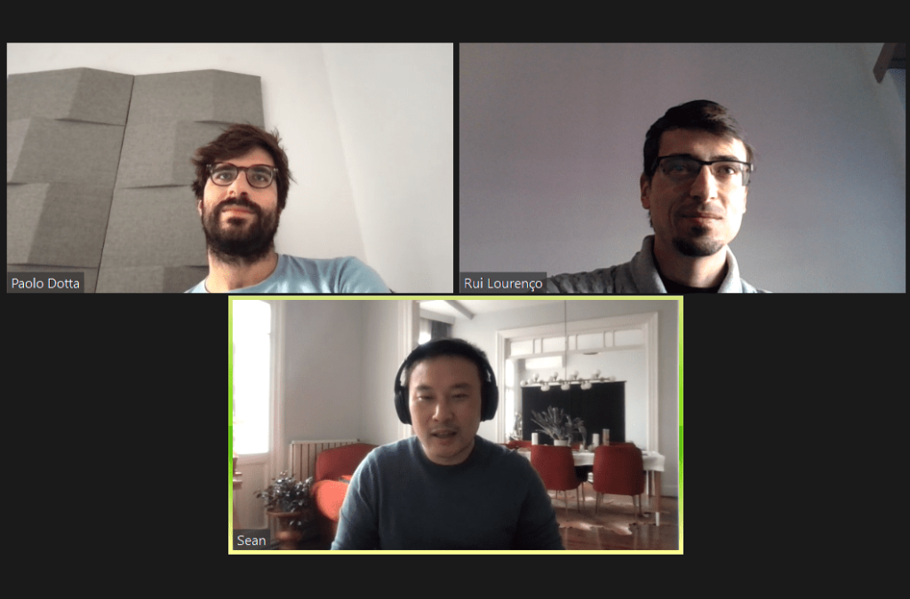

Making the jump into entrepreneurship, and building a startup,  is rarely a rational decision.

A good example of this comes from an entrepreneur I got to know recently, Sean Yu.

He started his career at Lehman Brothers and Gryphon Investors. At this point, the rational decision for Sean was to go to business school in the US and pursue a steady career in finance.

However, his interest in Economic development took him down a different path. An NGO based in Turkey.

It was there, while working with entrepreneurs and their startups, that he found his entrepreneurial itch:

My original goal was to work with the NGO for two years, then go to grad school. But I was inspired by the entrepreneurs here in Turkey and what they were building.

There’s a difference between analysing something and building something. I wanted to be more hands-on – tinkering and building things. So I decided to stay and launch a startup.

Fast forward to today, and I think it’s safe to say he made the right choice. His startup [Paraşüt](https://www.parasut.com/) has since been acquired by the largest private equity firm in Turkey.

As for Sean? Well, he’s still the CEO of the company, with a hundred-person team behind him. Which has brought new challenges – like how to keep the qualities of a startup in a big company.

When I first spoke to him, I knew he had a lot to share - valuable lessons for any entrepreneur to listen to.

So my CMO Rui and I sat down with him to learn more about his story.

Throughout our conversation, he displayed several traits that all successful entrepreneurs share.

From listening to the market to solve a real problem, to launching small and iterating to test that solution. As well as getting stuck in, and doing whatever is needed to get the job done.

Sean’s story is packed with tips and insights that I wish every entrepreneur knew about before launching their startups.

## Full Interview with Sean Yu, Entrepreneur & Startup Founder

#### Paolo: Sean, firstly, thanks for taking the time out of your busy schedule to sit down with us.

#### Could you start by telling us a bit about yourself?

**Sean:** My background is a bit mixed, both for my career and where I grew up.

I grew up in China then moved to the US at 8 years old and lived in a bunch of places around the US.

I ended up going to Harvard to study economics, from where I graduated in 2006.

At the time Wall St. was still pretty hot - this was before the last crisis - so I got recruited by Lehman Brothers (which as you may know [no longer exists](https://www.investopedia.com/articles/economics/09/lehman-brothers-collapse.asp)).

I worked with them until 2008 and then got recruited by a private equity firm that took me to San Francisco.

I did that for a while but I wanted to change my career, I just didn’t really know how to do it. I’ve always been extremely interested in economic development so I contacted an NGO called [Endeavor](https://endeavor.org/).

They’d just established their office in Turkey. Their model is about economic development through the support of entrepreneurs and their startups.

I thought that was really cool, so I hopped on a plane to Turkey to join them.

My original goal was to work with them for two years and then go back to the US for grad school.

But, one thing led to another, as it often does in life and I never left.

**I was inspired by the entrepreneurs here in Turkey and what they were building. So I decided to stay and launch a startup.**

The market opportunity in 2012, and what all the startups were focused on, was the B2C market. There weren’t really any B2B startups. More than that, there were no SaaS or Fintech products at the time here in Turkey.

So I looked at the market, which was pretty sizable at 80M people, with three million small businesses making up 99% of the market.

Then the question was, of course, what do you need to run a business?

Well, you need certain software. You need accounting, maybe a CRM tool, operation management software, the list goes on.

**The accounting space was wide open. Everyone was managing their finances with a calculator and pen and paper.**

And while there was software in the market it was the legacy on-premises guys.

You needed to buy a server, have an IT department or outsource your IT. Also, you needed an expensive and complicated upfront license.

So my co-founders and I thought we could build an easy-to-use cloud-based fintech product and distribute it to these three million small businesses.

That was about six years ago. Two years ago our startup was acquired by the largest private equity firm in Turkey, [Turkven](http://turkven.com/).

Now we have over 100,000 SMEs (small-to-medium enterprises) using our software. It’s growing 60-70% year over year in terms of subscriber numbers. The revenue numbers are still doubling every year.

That being said, there’s still a long way to go. After all, there are over 3M small businesses here. Compare us to more mature markets like Europe and the UK and we still have our work cut out.

#### P: That’s really interesting Sean. Out of interest, what were you doing at Lehman Brothers?

**S:** I was doing healthcare investment banking.

While I was in middle school and high school I took university classes in computer science. There I dabbled with coding and software. Then, when I went on to study at Harvard University, I wasn’t sure if I wanted to be a doctor or study economics.

So healthcare investment banking was a cool way to combine the two. Well, I thought it was a good idea. I was 22 at the time so I didn’t really know what I was doing.

#### P: No one knows I think at that age.

#### I was also in investment banking on the market side doing equity derivatives.

#### I liked the finance and the mathematical side behind the product but about six months after I decided it wasn’t for me, and I started pursuing entrepreneurship.

**S:** There’s a difference between analysing something and building something. I wanted to be more hands-on – tinkering and building things.

#### P:  I couldn’t agree more.

#### You already touched on finding the right idea – disrupting the legacy systems. How did you come up with the idea for Parasut?

**S:** B2B is definitely one of those areas where you have to be in it to identify the opportunities. My experience in economics and finance helped me a lot here because I could identify what a business should be doing.

However, I wouldn’t have completely identified the opportunity if it hadn’t been for Endeavor.

There I was working with a lot of entrepreneurs. When they came to us we looked at their startup’s business model, the story, the “why”, etc. But of course, we also looked at the finances. What’s your P&L, balance sheet, cash flow, how’s it growing?

**All of these successful entrepreneurs didn’t have a clue about the finance side. Which is like driving a  car with no idea how fast you’re going or how much gas is left in the tank.**

You’re running the startup, you’re in the right market, right sector, you’re growing and that’s great. But you still have to do all the monitoring work that allows you to actually run the business.

So I saw the problem first-hand. And it wasn’t that they didn’t _want_ to do it. They didn’t have _the tools_ to do it.

If I hadn’t worked with entrepreneurs at Endeavor, I wouldn’t have seen the need for this.

That’s what I mean when I say with B2B startups you really have to be there, talking to a lot of businesses to identify the pain points.

##### Do you have a brilliant startup idea that you want to bring to life?

From the product and business reasoning to streamlining your MVP to the most important features, our team of product experts and ex-startup founders can help you bring your vision to life.

Let's Talk

#### P: When did you realise you could leave Endeavor and focus on your startup full time?

**S:** I like to think I’m analytical and rational but sometimes the emotions take over.

For example, coming to Turkey probably wasn’t the most rational decision. Starting a business in Turkey probably wasn’t either.

My calculations at the time were:

1. Do I follow the rational thing, go to business school in the US and pursue a steady career;
2. Follow the thing that’s popped up that I really want to do (and live to tell a great story about it!).

Working in finance sort of helped because I had made some capital for myself that made it feel like I could get by.

There was also a period right between working in private equity and joining Endeavor that I didn’t have a job. It made me realise that you could do ok without a job provided you had some savings (at least in your 20s).

That was a sense of safety and security for me. Firstly, I knew I had enough skills to pick up work in the US. Secondly, I knew I had enough savings to get by and allow me to pursue something I’m really passionate about.

It was an itch I had to scratch. And scratching it didn’t come with a whole lot of downsides in my mind. So why not leap?

#### P: It makes sense, and looking back I think you made the right choice!

#### Back to your product – how did you validate your solution in the market?

**S:** When I saw the problem I started talking to a lot of entrepreneurs.

Invoicing was a big problem because it was a paper process.

They had to print the invoice and sign it. Then, in Turkey, there is a company stamp that you have to use on the invoice. After all that you put it in an envelope, take it to the post office and send it.

There are problems here. You have no way of knowing if it actually reached your client. So you’re calling them asking if they received the invoice. If they never get it they can’t release any money.

The obvious solution of course is to make everything digital. However, it’s not as simple as just building a platform – you need to get government certification.

So we started talking to the government. Fortunately, they had also noticed this problem. They were building an e-invoice solution that would make the company stamp digital, not physical.

With that in mind, we went to the companies.

Now you talk to some and they’re biting your hand off saying “Yes yes yes! Give me that solution.” Then others are like “Ok, I could do without it.” So you’re still sort of left unsure.

**At the end of the day, you can talk to 1000 customers, but at some point, you have to pull the trigger, build something and see if it works.**

Overall after talking to the government, businesses and entrepreneurs, it was all starting to come together.

/\* widget: Blog: Expert Tip - Quotes \*/  /\* reset -------------------- \*/  .blog-custom-block \*,  .blog-custom-block ::before,  .blog-custom-block ::after {  box-sizing: border-box;  border-width: 0;  border-style: solid;  border-color: #e5e7eb;  }  /\* vars -------------------- \*/  .blog-custom-block.blog-custom-block\_\_expert-tip {  --color-bg: #F4FAFE;  --color-border: rgb(15 164 234 / 0.50);  --color-text-1: #0F172A;  --color-text-2: #4A4A68;  }  /\* colors -------------------- \*/  .blog-custom-block.blog-custom-block\_\_expert-tip .bg-clr-bg {  background-color: var(--color-bg);  }  .blog-custom-block.blog-custom-block\_\_expert-tip .border-clr-border {  border-color: var(--color-border);  }  .blog-custom-block.blog-custom-block\_\_expert-tip .text-clr-text-1 {  color: var(--color-text-1);  }  .blog-custom-block.blog-custom-block\_\_expert-tip .text-clr-text-2 {  color: var(--color-text-2);  }  /\* utils -------------------- \*/  .blog-custom-block.blog-custom-block\_\_expert-tip .flex {  display: flex;  }  .blog-custom-block.blog-custom-block\_\_expert-tip .flex-shrink-0 {  flex-shrink: 0;  }  .blog-custom-block.blog-custom-block\_\_expert-tip .flex-col {  flex-direction: column;  }  .blog-custom-block.blog-custom-block\_\_expert-tip .gap-4 {  gap: 1rem;  }  .blog-custom-block.blog-custom-block\_\_expert-tip .gap-5 {  gap: 1.25rem;  }  .blog-custom-block.blog-custom-block\_\_expert-tip .rounded-xl {  border-radius: 0.75rem;  }  .blog-custom-block.blog-custom-block\_\_expert-tip .border {  border-width: 1px;  }  .blog-custom-block.blog-custom-block\_\_expert-tip .p-8 {  padding: 2rem;  }  .blog-custom-block.blog-custom-block\_\_expert-tip .text-3xl {  font-size: 1.875rem;  line-height: 2.25rem;  }  .blog-custom-block.blog-custom-block\_\_expert-tip .text-lg {  font-size: 1.125rem;  line-height: 1.75rem;  }  .blog-custom-block.blog-custom-block\_\_expert-tip .font-bold {  font-weight: 700;  } 

Expert Tip

Focus on getting your MVP’s value proposition incredibly clear. If your grandma doesn’t understand it’s probably not clear.

[**Jan-Philipp Kruip**](https://www.linkedin.com/in/janphilippkruip/)**, Founder, CEO & Angel Investor**

#### P: So you started with invoicing only?

**S:** Yeah exactly. We started there because invoicing equals revenue. You don’t invoice, you don’t get revenue.

And I was thinking about cost management. I did a thought experiment. If you say to the small business owner “Would rather make $300 in revenue instead of $100? Or would you rather make $30 instead of $10 in profit?”

They’ll choose revenue. Revenue always comes to people’s minds first.

There’s a second thing here which is something you run into when you’re in a place where labour cost is cheap. Labour efficiency isn’t something people think about.

This is a bit of a chicken and egg problem. If labour is cheap then it isn’t productive, it’s not efficient. If labour isn’t efficient, it’s always going to be cheap.

Related: [The Structured Process Behind Developing a Successful MVP \[Founder's Guide\]](https://altar.io/structured-process-develop-mvp/)

#### Rui: Revenue is always a pain point, but I wanted to ask how big of a pain point it was for the small businesses you work with?

#### Did they feel the need to solve it in a new way?

#### Or did you have to work to change their behaviour due to the market you were in?

**S:** So it’s more complicated than that.

Invoice is a regulation. You have to invoice to collect money (at least officially). If you don’t get the invoice out and they don’t receive it, you don’t get paid.

On paper, it’s a big problem that many people face.

But then, in reality, people may not invoice. They ignore the regulations, pay cash in hand, etc. Then you start to see other stuff happen in the economy.

Looking back at the huge picture, considering all these challenges I might have gotten scared. With so many variables and unknowns, I may have said maybe let’s not get into this.

Instead, I said: "Ok I think there’s a problem but I won’t really know until we’ve built a product, launched it and see what happens. After all, there does seem to be a regulatory tailwind that will bring the market in my direction."

Regulatory tailwinds, of course, are always slower than you think. If the government says they’re going to launch something this year, you can expect it in about three years.

So I decided to build it and see.

I wouldn’t say it’s a perfect calculation. It comes down to intuition and gut.

Related: [Founder Story: Building and Scaling a Fintech Startup by Trusting your Gut](https://altar.io/building-and-scaling-fintech-startup-by-trusting-your-gut/)

#### R: When you launched your startup, were there other invoicing solutions in the market already?

#### What did the competitor landscape look like?

**S:** So Europe and the US had digital invoicing/accounting solutions already. Turkish accounting is different because of the regulations.

Turkey is a big market but not as huge as the EU/US for example. Most companies were focused on those huge markets.

In the Turkish market, you had the legacy software companies that were selling to medium to large companies. This required servers on-premise and IT teams.

**The legacy tech companies didn’t think of SaaS and had in fact dismissed the entire small business market.**

Their thought process was: “This is our technology, it’s expensive, small businesses and startups can’t afford it, let’s not sell to them – we can’t serve them.”

In 2012/13, when I started thinking about starting up in Turkey, SaaS was already in the US and Europe - and it was working.

Most businesses here had internet, computers and smartphones already. So my reasoning was why shouldn’t it work here?

#### R: It makes sense, you found a neglected niche.

#### How did you go about building the initial team and product?

**S:** At that time I had my finance background but I hadn’t touched coding for about 15 years.

So I decided to get back into coding.

I found a top university here, [Bogazici University](http://www.boun.edu.tr/en_us) and managed to convince the professors to let me into their master’s programme for software engineering.

I did that for a while and tried to recruit co-founders from the engineering course. Quickly I realised, though, that I needed someone with more experience in development than me.

/\* widget: Blog: Expert Tip - Quotes \*/  /\* reset -------------------- \*/  .blog-custom-block \*,  .blog-custom-block ::before,  .blog-custom-block ::after {  box-sizing: border-box;  border-width: 0;  border-style: solid;  border-color: #e5e7eb;  }  /\* vars -------------------- \*/  .blog-custom-block.blog-custom-block\_\_expert-tip {  --color-bg: #F4FAFE;  --color-border: rgb(15 164 234 / 0.50);  --color-text-1: #0F172A;  --color-text-2: #4A4A68;  }  /\* colors -------------------- \*/  .blog-custom-block.blog-custom-block\_\_expert-tip .bg-clr-bg {  background-color: var(--color-bg);  }  .blog-custom-block.blog-custom-block\_\_expert-tip .border-clr-border {  border-color: var(--color-border);  }  .blog-custom-block.blog-custom-block\_\_expert-tip .text-clr-text-1 {  color: var(--color-text-1);  }  .blog-custom-block.blog-custom-block\_\_expert-tip .text-clr-text-2 {  color: var(--color-text-2);  }  /\* utils -------------------- \*/  .blog-custom-block.blog-custom-block\_\_expert-tip .flex {  display: flex;  }  .blog-custom-block.blog-custom-block\_\_expert-tip .flex-shrink-0 {  flex-shrink: 0;  }  .blog-custom-block.blog-custom-block\_\_expert-tip .flex-col {  flex-direction: column;  }  .blog-custom-block.blog-custom-block\_\_expert-tip .gap-4 {  gap: 1rem;  }  .blog-custom-block.blog-custom-block\_\_expert-tip .gap-5 {  gap: 1.25rem;  }  .blog-custom-block.blog-custom-block\_\_expert-tip .rounded-xl {  border-radius: 0.75rem;  }  .blog-custom-block.blog-custom-block\_\_expert-tip .border {  border-width: 1px;  }  .blog-custom-block.blog-custom-block\_\_expert-tip .p-8 {  padding: 2rem;  }  .blog-custom-block.blog-custom-block\_\_expert-tip .text-3xl {  font-size: 1.875rem;  line-height: 2.25rem;  }  .blog-custom-block.blog-custom-block\_\_expert-tip .text-lg {  font-size: 1.125rem;  line-height: 1.75rem;  }  .blog-custom-block.blog-custom-block\_\_expert-tip .font-bold {  font-weight: 700;  } 

Expert Tip

Sean already had some coding experience from his time in high school. This allowed him to jump back in when it came to building his startup.

That being said, if you decide to launch a startup with no experience in software development - don’t learn to code! It will take a long time to get to a point where you are able to build a high-quality product.

Focus instead on turning your business vision into a functioning startup, and [bring in developers to help you build your product](https://altar.io/whats-the-best-way-to-build-your-startup-cto-freelancers-agency/).

**Daniel Ruivo, Co-Founder & Head of Product at Altar.io**

Moreover, I realised I’d also need a designer to help me out with this project. I ended up finding them through people I’d met working at Endeavor.

So it was me and my two co-founders, they had full-time jobs, I was studying at university. We worked part-time and got a semblance of a product together.

That's when I saw that things were moving quite slowly and I decided I needed to focus on the startup full-time.

So I quit university, and put all my time, energy (and savings) into getting the MVP finished.

Four months later, we had the MVP.

It wasn’t enough to sell, but it was enough to take to investors and convince them to give us a seed round. This gave us enough financial runway to complete the first version of the product.

Related: [How to Build a Successful Minimum Viable Product (MVP) in 3 Steps](https://altar.io/features-inside-mvp-3-steps-know-answer/)

#### P: Was it tough getting investment without any traction or sales?

**S:** For sure. Turkey is a harder market to raise money in, it’s less developed. But my co-founders and I had a background that made us somewhat proven.

We’d established enough reputation for ourselves that we seemed like a solid startup team. We were lucky and found a Venture Capitalist that believed in us.

Interestingly, he believed more in the co-founding team than he did in the product.

My experience working at Endeavor alongside my financial background definitely helped convince people I had something to contribute.

/\* widget: Blog: Expert Tip - Quotes \*/  /\* reset -------------------- \*/  .blog-custom-block \*,  .blog-custom-block ::before,  .blog-custom-block ::after {  box-sizing: border-box;  border-width: 0;  border-style: solid;  border-color: #e5e7eb;  }  /\* vars -------------------- \*/  .blog-custom-block.blog-custom-block\_\_expert-tip {  --color-bg: #F4FAFE;  --color-border: rgb(15 164 234 / 0.50);  --color-text-1: #0F172A;  --color-text-2: #4A4A68;  }  /\* colors -------------------- \*/  .blog-custom-block.blog-custom-block\_\_expert-tip .bg-clr-bg {  background-color: var(--color-bg);  }  .blog-custom-block.blog-custom-block\_\_expert-tip .border-clr-border {  border-color: var(--color-border);  }  .blog-custom-block.blog-custom-block\_\_expert-tip .text-clr-text-1 {  color: var(--color-text-1);  }  .blog-custom-block.blog-custom-block\_\_expert-tip .text-clr-text-2 {  color: var(--color-text-2);  }  /\* utils -------------------- \*/  .blog-custom-block.blog-custom-block\_\_expert-tip .flex {  display: flex;  }  .blog-custom-block.blog-custom-block\_\_expert-tip .flex-shrink-0 {  flex-shrink: 0;  }  .blog-custom-block.blog-custom-block\_\_expert-tip .flex-col {  flex-direction: column;  }  .blog-custom-block.blog-custom-block\_\_expert-tip .gap-4 {  gap: 1rem;  }  .blog-custom-block.blog-custom-block\_\_expert-tip .gap-5 {  gap: 1.25rem;  }  .blog-custom-block.blog-custom-block\_\_expert-tip .rounded-xl {  border-radius: 0.75rem;  }  .blog-custom-block.blog-custom-block\_\_expert-tip .border {  border-width: 1px;  }  .blog-custom-block.blog-custom-block\_\_expert-tip .p-8 {  padding: 2rem;  }  .blog-custom-block.blog-custom-block\_\_expert-tip .text-3xl {  font-size: 1.875rem;  line-height: 2.25rem;  }  .blog-custom-block.blog-custom-block\_\_expert-tip .text-lg {  font-size: 1.125rem;  line-height: 1.75rem;  }  .blog-custom-block.blog-custom-block\_\_expert-tip .font-bold {  font-weight: 700;  } 

Expert Tip

Early-stage investors back great founders. They know that everything else is going to change. The product, the market, the competitive landscape will all change, but they’re betting on **you**.

[**Yaron Samid**](https://www.linkedin.com/in/yaronsamid/)**, Serial Entrepreneur & Startup Founder**

Related: [What Angel Investors Look For in Entrepreneurs and their Startups \[Expert Interview\]](https://altar.io/what-angel-investors-look-for-in-entrepreneurs-and-their-startups-expert-interview/)

#### P: How long was the gap between having a product and feeling like you were a fully-fledged startup?

**S:** So we had the rough, bootstrapped product that did the invoicing side of things – although we still had regulation getting in the way.

We knew we needed someone at that point to help us market and sell. I had a deficiency at the time because my Turkish was very bad back then. So it was hard for me to do marketing and sales.

We hired a marketing person as our first employee, then we hired developers to help us speed up the development process. That first year there were about seven of us on the team.

We turned that rough, bootstrapped product into a much more sophisticated invoicing platform. We also built in some expense management features because we found that people were asking for that too.

In hindsight, we should’ve just released the invoicing. I think it was too soon to go down the road of multiple features. However, at the time we thought it made for a more complete MVP.

We got a credit card payment gateway onto the platform and just launched it.

We went to a lot of startup conferences to talk about it and marketed it through PR.

**In the first month, we got 20 customers. And we were thinking well sh\*t, is this good or is it bad?** 

It was a lot less than what we had hoped for, but we were making something.

Then it was month-by-month slogging through and talking to customers.

Deciding what to build based on their feedback, testing new features. More and more ideas kept coming and things started piling up and coming together.

There was certainly no magical thing we did, it was a lot of small things and a lot of customer feedback.

#### R: It makes sense, the best way to iterate is talking to users and that’s exactly what you did.

#### The next question I have is about you and your startup team.

#### You already mentioned how you found your co-founders and your initial hires were a marketer and some developers.

#### What did a “day in the life” look like for you in those early years?

**S:** So it was very different before the seed round and after the seed round.

I’ll start with before the seed. Now, we don’t have garages where we are, we’re in the city:

**In those early days, it was me sitting in my living room in my PJs coding non-stop.**

I’m not the most disciplined person but I’m very driven by passion. So I wouldn’t wake up crazy early.  But when I did get up (at around 10 or 11) I would code non-stop until I got tired and went to bed.

My co-founders and I would meet on Saturdays. Our apartments weren’t big enough to meet at home, but fortunately, my co-founder’s mother-in-law let us use her office.

We’d use that time to plan the week's “sprint”. We didn’t really know what sprints were at the time but that’s what we called it.

They had their full-time jobs but they would work weekends and nights to do whatever they had to do to move things forward.

Throughout the week we would keep each other updated through WhatsApp (Slack certainly wasn’t around back then!) Then we would meet again the next Saturday and repeat.

It was all pretty amateur at the beginning. We didn’t really test too much on the code side, we just pushed it and see if it worked or not. Of course, this is normal and those processes come over time.

**Once we had that bootstrapped MVP, we needed some money. I was the closest thing to a CEO because I was the worst at coding and design.**

And I honestly think that's what the “CEO” character is in an early startup. The guy who's a bit of a jack of all trades and does anything needed to get the job done. Whether it’s marketing, sales, project management, being the janitor – whatever is needed to get the job done.

/\* widget: Blog: Expert Tip - Quotes \*/  /\* reset -------------------- \*/  .blog-custom-block \*,  .blog-custom-block ::before,  .blog-custom-block ::after {  box-sizing: border-box;  border-width: 0;  border-style: solid;  border-color: #e5e7eb;  }  /\* vars -------------------- \*/  .blog-custom-block.blog-custom-block\_\_expert-tip {  --color-bg: #F4FAFE;  --color-border: rgb(15 164 234 / 0.50);  --color-text-1: #0F172A;  --color-text-2: #4A4A68;  }  /\* colors -------------------- \*/  .blog-custom-block.blog-custom-block\_\_expert-tip .bg-clr-bg {  background-color: var(--color-bg);  }  .blog-custom-block.blog-custom-block\_\_expert-tip .border-clr-border {  border-color: var(--color-border);  }  .blog-custom-block.blog-custom-block\_\_expert-tip .text-clr-text-1 {  color: var(--color-text-1);  }  .blog-custom-block.blog-custom-block\_\_expert-tip .text-clr-text-2 {  color: var(--color-text-2);  }  /\* utils -------------------- \*/  .blog-custom-block.blog-custom-block\_\_expert-tip .flex {  display: flex;  }  .blog-custom-block.blog-custom-block\_\_expert-tip .flex-shrink-0 {  flex-shrink: 0;  }  .blog-custom-block.blog-custom-block\_\_expert-tip .flex-col {  flex-direction: column;  }  .blog-custom-block.blog-custom-block\_\_expert-tip .gap-4 {  gap: 1rem;  }  .blog-custom-block.blog-custom-block\_\_expert-tip .gap-5 {  gap: 1.25rem;  }  .blog-custom-block.blog-custom-block\_\_expert-tip .rounded-xl {  border-radius: 0.75rem;  }  .blog-custom-block.blog-custom-block\_\_expert-tip .border {  border-width: 1px;  }  .blog-custom-block.blog-custom-block\_\_expert-tip .p-8 {  padding: 2rem;  }  .blog-custom-block.blog-custom-block\_\_expert-tip .text-3xl {  font-size: 1.875rem;  line-height: 2.25rem;  }  .blog-custom-block.blog-custom-block\_\_expert-tip .text-lg {  font-size: 1.125rem;  line-height: 1.75rem;  }  .blog-custom-block.blog-custom-block\_\_expert-tip .font-bold {  font-weight: 700;  } 

Expert Tip

No startup in the history of the world can raise money just to get going. Unless you’re Elon Musk, unless you’re Mark Zuckerberg, no one is going to give anybody money just to start something. You will always have to start with your own savings or debt -  bootstrapping.

[**Paul O’Brien**](https://www.linkedin.com/in/paulobrien/)**, Investor & CEO** 

So I took on the CEO role and got out there and started talking to people. I was talking to as many investors in the market as possible but also talking to target customers and doing that research.

I was still coding at this point but around 30% of my focus had now shifted to talking to investors and potential customers.

Then when we got the seed round my focus changed more.

At that point, I was out there doing PR and recruiting. Thanks to the seed round my co-founders were able to commit full-time and we were co-sharing an office space.

So we had our Monday morning meeting to talk about the week ahead. Then the Friday afternoon “wrap up”, which was a kind of stand up just to talk about what we had achieved.

**We combined our Friday meeting with a little bit of a happy hour afterwards to celebrate the week a little bit. Which is an extremely important aspect of any startup.**

I was still spending a lot of time coding and developing at this point.

Then we launched – and everything changed again.

Once we started getting customers I was kicked out of the development team! We had hired more developers and we agreed my time was much better spent elsewhere.

/\* widget: Blog: Expert Tip \*/  /\* reset -------------------- \*/  .blog-custom-block \*,  .blog-custom-block ::before,  .blog-custom-block ::after {  box-sizing: border-box;  border-width: 0;  border-style: solid;  border-color: #e5e7eb;  }  /\* vars -------------------- \*/  .blog-custom-block.blog-custom-block\_\_expert-tip {  --color-bg: #F4FAFE;  --color-border: rgb(15 164 234 / 0.50);  --color-text-1: #0F172A;  --color-text-2: #4A4A68;  }  /\* colors -------------------- \*/  .blog-custom-block.blog-custom-block\_\_expert-tip .bg-clr-bg {  background-color: var(--color-bg);  }  .blog-custom-block.blog-custom-block\_\_expert-tip .border-clr-border {  border-color: var(--color-border);  }  .blog-custom-block.blog-custom-block\_\_expert-tip .text-clr-text-1 {  color: var(--color-text-1);  }  .blog-custom-block.blog-custom-block\_\_expert-tip .text-clr-text-2 {  color: var(--color-text-2);  }  /\* utils -------------------- \*/  .blog-custom-block.blog-custom-block\_\_expert-tip .flex {  display: flex;  }  .blog-custom-block.blog-custom-block\_\_expert-tip .flex-shrink-0 {  flex-shrink: 0;  }  .blog-custom-block.blog-custom-block\_\_expert-tip .flex-col {  flex-direction: column;  }  .blog-custom-block.blog-custom-block\_\_expert-tip .gap-4 {  gap: 1rem;  }  .blog-custom-block.blog-custom-block\_\_expert-tip .gap-5 {  gap: 1.25rem;  }  .blog-custom-block.blog-custom-block\_\_expert-tip .rounded-xl {  border-radius: 0.75rem;  }  .blog-custom-block.blog-custom-block\_\_expert-tip .border {  border-width: 1px;  }  .blog-custom-block.blog-custom-block\_\_expert-tip .p-8 {  padding: 2rem;  }  .blog-custom-block.blog-custom-block\_\_expert-tip .text-3xl {  font-size: 1.875rem;  line-height: 2.25rem;  }  .blog-custom-block.blog-custom-block\_\_expert-tip .text-lg {  font-size: 1.125rem;  line-height: 1.75rem;  }  .blog-custom-block.blog-custom-block\_\_expert-tip .font-bold {  font-weight: 700;  } 

Key Takeaway **One of the traits we often see in successful founders is humility.** 

This is a prime example of that trait. In the beginning, Sean was doing everything needed to get the job done.

But when he was able to hire true specialists in the development team, he let them get on with it. He made the smart move of stepping back and delegating.

This allowed him to focus on other aspects of the business – where he was more effective.

#### So a lot of my time was recruiting, PR, marketing, talking to customers. Nurturing the investor relationships was another big part of my focus.

So my focus shifted to the business side of the company. Aligning the teams, looking at the business strategy, talking to potential partners, BizDev.

And as we brought on more marketers and the sales team my role naturally kept changing.

And it’s interesting because when you’re in the kitchen it’s a lot easier to manage everything.

**When the team gets bigger you still need to be in the kitchen, without getting in the way and ruining everybody else's work.**

You still need to have your fingers on the pulse in terms of understanding what your customers need and what your team is feeling.

So today we have a hundred-person team. And I’m struggling between being an all-out manager or being that startup founder who still sees and takes initiatives.

#### P: And how are you going about making that huge decision?

**S:** We’ve always been about macro-management. In the beginning, we wrote down our company philosophies. We wanted to document what we believe in and the kind of company we wanted to create – beyond mission and vision.

We didn’t really understand culture decks at the time, we just felt we needed something that outlined our philosophies

And naturally, these philosophies changed over time, but macro-management was always part of it. I think we wrote “Just make an impact” and the how behind that is clear roles and responsibilities and clear decision-making power.

So even though I’m CEO I’m not making marketing decisions – that’s why I have a Head of Marketing. I’m just making sure that those marketing decisions align with the strategy decisions I’m making.

**We’ve all worked in places where we don’t feel comfortable making decisions and it’s a pain in the ass.**

It’s a pain in the ass where you don’t quite understand the company strategy and how your decision impacts that.

So for me, that’s what a bad business looks like and we knew we didn’t want that.

The challenge there is to understand enough about the market and the technology to still be able to say here’s an interesting thing. How do I incorporate that into the company strategy? How do I align the teams on that, how will it fit into their roadmap? What's the best way for me to take those initiatives?

For me, that’s far better than just managing and saying, here’s your KPI.

It’s also a lot harder to do, and it’s still something I need to get better at. You need to be there, have those touchpoints where you help people. Yet you still need to be that CEO and let people do their jobs.

I was watching Gordon Ramsay YouTube videos right before this conversation, and he is a good example of this. He’s still working in the kitchen, helping people, but at the same time, he’s managing his empire of restaurants.

#### R: What is the biggest lesson you learned from launching your startup that you will take with you?

**S:** That’s a hard question because there are so many takeaways.

Maybe that everything has a way of working out. And you should have confidence in that. At times things are challenging. Sometimes you’re gonna be on the edge emotionally because it can be overwhelming.

Just remember things work themselves out. Worst case scenario, even if the business fails, your life is still there and there are opportunities.

Remember that and it will be a lot easier to push through the hurdles.

#### R: What would you do differently? Are there any mistakes that stick out for you?

**S:** I made plenty of mistakes. It’s hard to say pinpoint one because a mistake is relevant for that time. If it’s a different company or time it may not be a mistake, it’s all relative.

One time I had to let go of someone and the manner I approached the situation was wrong. I may have taken an American approach rather than a Turkish approach to the whole situation. That was very badly handled on my part and I didn’t connect emotionally. So I wish I’d had that emotional connection then that I have now.

There’s that meme, “We’re not B-sians we’re A-sians”. And my philosophy, in the beginning, was that perfect wasn’t good enough.

That definitely set a weird tone for everyone. It led to a blame culture rather than a culture of understanding how we can do better. We quickly changed that to a philosophy of “perfection through iteration”.

So now we aim for perfection but if we don’t hit it we analyse why and how we can improve.

#### R: What resources for founders can you recommend?

**S:** Lots of books, Crossing the Chasm for example is a great read. I listen to lots of podcasts.

But I would go back to this idea of the emotional side and the idea of everything working out. Stoicism definitely helps.

Understand how to manage your emotions and focus on the philosophical side alongside technical startup reading.

## Thank You, Sean…

… For taking the time out of your busy schedule to sit down with us.

Sean shows a lot of key traits successful founders share. All of which will help reduce your chances of failure.

So remember as you build your startup, start with an MVP to test your product in the market, then iterate as you go.

In the beginning be prepared to wear many hats, and do whatever it takes to get the job done.

Know when it’s time to take a step back and delegate to the startup team you’ve built around you.

Like David Ogilvy famously said:

/\* widget: Blog: Top Quote \*/  /\* reset -------------------- \*/  .blog-custom-block \*,  .blog-custom-block ::before,  .blog-custom-block ::after {  box-sizing: border-box;  border-width: 0;  border-style: solid;  border-color: #e5e7eb;  }  /\* vars -------------------- \*/  .blog-custom-block.blog-custom-block\_\_top-quote {  --color-bg: #F4FAFE;  --color-border: rgb(15 164 234 / 0.50);  --color-text-1: #0F172A;  }  /\* colors -------------------- \*/  .blog-custom-block.blog-custom-block\_\_top-quote .border-clr-border {  border-color: var(--color-border);  }  .blog-custom-block.blog-custom-block\_\_top-quote .bg-clr-bg {  background-color: var(--color-bg);  }  .blog-custom-block.blog-custom-block\_\_simple-quote .text-clr-text-1 {  color: var(--color-text-1);  }  /\* utils -------------------- \*/  .blog-custom-block.blog-custom-block\_\_top-quote .flex {  display: flex;  }  .blog-custom-block.blog-custom-block\_\_top-quote .flex-shrink-0 {  flex-shrink: 0;  }  .blog-custom-block.blog-custom-block\_\_top-quote .flex-col {  flex-direction: column;  }  .blog-custom-block.blog-custom-block\_\_top-quote .items-center {  align-items: center;  }  .blog-custom-block.blog-custom-block\_\_top-quote .gap-4 {  gap: 1rem;  }  .blog-custom-block.blog-custom-block\_\_top-quote .rounded-xl {  border-radius: 0.75rem;  }  .blog-custom-block.blog-custom-block\_\_top-quote .border {  border-width: 1px;  }  .blog-custom-block.blog-custom-block\_\_top-quote .p-8 {  padding: 2rem;  }  .blog-custom-block.blog-custom-block\_\_top-quote .text-center {  text-align: center;  }  .blog-custom-block.blog-custom-block\_\_top-quote .text-2xl {  font-size: 1.5rem;  line-height: 2rem;  }  .blog-custom-block.blog-custom-block\_\_top-quote .font-bold {  font-weight: 700;  } 

Hire people who are better than you are, then leave them to get on with it… Look for people who will aim for the remarkable, who will not settle for the routine.

Good Luck!
