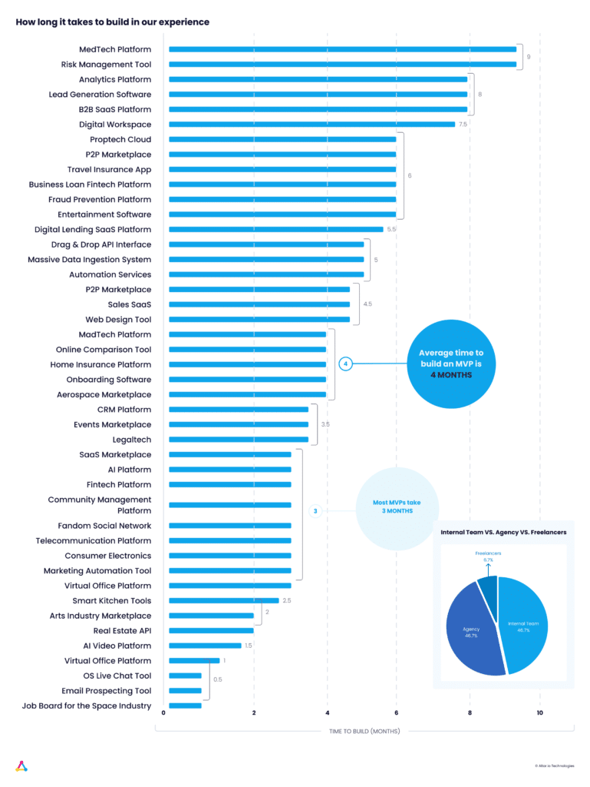
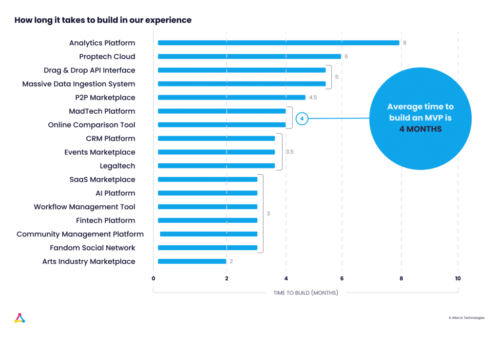
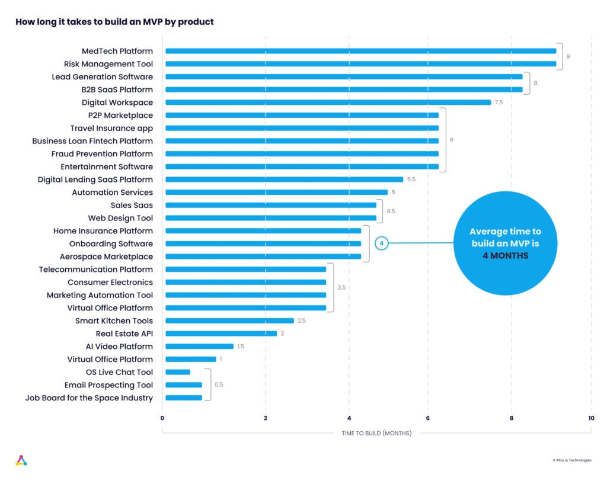

If you’re reading this, chances are that you’re about to take the first step in turning your business vision into a reality by building an MVP.

You’ve probably heard that a short time to market is essential if you’re to succeed – which is why you chose to build a lean, user-centric MVP.

After all, in an ecosystem where 90% of startups fail, it’s best to test quickly and fail or succeed sooner rather than later.

So, you want to know how long it will take for you to [build an MVP](https://altar.io/features-inside-mvp-3-steps-know-answer/) and put it into the hands of your users.

**The short answer is that, in my experience working with dozens of startups at Altar.io, it** **_shouldn’t_** **take more than three to four months to build an MVP.** 

However, that answer comes with some caveats.

Firstly, it depends on how many features you need to build to validate the value of your product.

Secondly, it depends on if you’re going into your MVP process with a fully scoped product or an idea on a napkin.

I’ll cover both of these caveats later in the article.

Before that, however, to fully answer the question “How long does it take to build an MVP” I wanted to gather some data.

 

#### Contents

## How Long Does It Take to Build an MVP? The Data

Gathering data from our experience building MVPs at Altar.io, as well as data from our extended network of entrepreneurs we learned:

1. That **on average** it takes four months to build an MVP
2. However, MVPs **most commonly** take three months to build

We’ve organised the data below taking into account both the types of products surveyed and the team composition used to build them.

 

/\* widget: Blog: Expert Tip \*/  /\* reset -------------------- \*/  .blog-custom-block \*,  .blog-custom-block ::before,  .blog-custom-block ::after {  box-sizing: border-box;  border-width: 0;  border-style: solid;  border-color: #e5e7eb;  }  /\* vars -------------------- \*/  .blog-custom-block.blog-custom-block\_\_expert-tip {  --color-bg: #F4FAFE;  --color-border: rgb(15 164 234 / 0.50);  --color-text-1: #0F172A;  --color-text-2: #4A4A68;  }  /\* colors -------------------- \*/  .blog-custom-block.blog-custom-block\_\_expert-tip .bg-clr-bg {  background-color: var(--color-bg);  }  .blog-custom-block.blog-custom-block\_\_expert-tip .border-clr-border {  border-color: var(--color-border);  }  .blog-custom-block.blog-custom-block\_\_expert-tip .text-clr-text-1 {  color: var(--color-text-1);  }  .blog-custom-block.blog-custom-block\_\_expert-tip .text-clr-text-2 {  color: var(--color-text-2);  }  /\* utils -------------------- \*/  .blog-custom-block.blog-custom-block\_\_expert-tip .flex {  display: flex;  }  .blog-custom-block.blog-custom-block\_\_expert-tip .flex-shrink-0 {  flex-shrink: 0;  }  .blog-custom-block.blog-custom-block\_\_expert-tip .flex-col {  flex-direction: column;  }  .blog-custom-block.blog-custom-block\_\_expert-tip .gap-4 {  gap: 1rem;  }  .blog-custom-block.blog-custom-block\_\_expert-tip .gap-5 {  gap: 1.25rem;  }  .blog-custom-block.blog-custom-block\_\_expert-tip .rounded-xl {  border-radius: 0.75rem;  }  .blog-custom-block.blog-custom-block\_\_expert-tip .border {  border-width: 1px;  }  .blog-custom-block.blog-custom-block\_\_expert-tip .p-8 {  padding: 2rem;  }  .blog-custom-block.blog-custom-block\_\_expert-tip .text-3xl {  font-size: 1.875rem;  line-height: 2.25rem;  }  .blog-custom-block.blog-custom-block\_\_expert-tip .text-lg {  font-size: 1.125rem;  line-height: 1.75rem;  }  .blog-custom-block.blog-custom-block\_\_expert-tip .font-bold {  font-weight: 700;  } 

Disclaimer

Within each industry, the product composition can vary wildly depending on a number of factors, this is for statistical significance Now let’s pick apart the data so you can understand how we arrived at these conclusions.

##### Building a Startup?

From the product and business reasoning to streamlining your MVP to the most important features, our team of product experts and ex-startup founders can help you bring your vision to life.

Let's Talk

## Researching How Long It Takes to Build an MVP

I started by looking back at the MVPs my team and I have built over the last couple of years at Altar.io.

From the entrepreneurs that agreed to share their information publically, I found that, on average, it took around **four months** to build those MVPs – across different industries.

 **Note:** All of the above data takes into account a  fully scoped product (defined in the next section of the article).

However, I didn’t want to leave you with just [examples based on our work](https://altar.io/work/).

So, over the last few weeks, my team and I have reached out to our extended network of entrepreneurs asking for their help.

Here’s the data they shared:

 According to my experience, but also my philosophy (lean methodologies), most MVPs should take 3 to 4 months to bring to the market.

And now that you have an idea of what to expect, let’s talk about the caveats I mentioned earlier and the importance of scoping your product in a way that will allow you to arrive at a precise estimation and stick to it.

## Estimating How Long It Takes to Build an MVP

When estimating how long it will take to build your MVP you have to take into account whether or not you’ve scoped tour product.

If you’re beginning with an idea on a napkin it will take longer than if you’ve already scoped your product.

For the sake of the article, I’ll start by defining the napkin idea. If you’ve already scoped your MVP, feel free to skip ahead.

### Napkin Idea

A napkin idea is exactly what it says on the tin.

You have your business vision and a vague path to accomplish it, but you don’t have a precise and closed blueprint that includes:

- Competitor benchmarks
- User stories
- Standard BPMN (Business Process Model and Notation) diagrams
- Sitemap
- UX/UI
- Go to market strategy

…The  list goes on

So you have no idea, at least in a meaningful way, about the features you need to include in your MVP to prove your main assumptions.

Which will lead to guesswork instead of precise estimations.

What I mean is: there is no point in trying to predict how long it will take to build your MVP until you fully [scope your product](https://altar.io/service-product-scope/).

Sidenote for non-tech founders that will have to look for a tech partner: If you move ahead and start asking for quotes before you have a clear plan, you’ll be comparing apples with oranges.

The only way you can compare estimations for development is if everyone is estimating for a specific blueprint. One source of truth.

### Scoping the MVP

If you have already scoped your product you should’ve already completed the above list.

If not, you should look for a structured process to create it.

Otherwise, you risk building an MBP (Most _Beautiful_ Product) according to what you believe should be there, not a lean, user-centric MVP.

A lot of entrepreneurs fall into the trap of building an **MBP**, planning to build all the features **they** believe to be important.

**Remember**: an MVP is the minimum viable version of a new product. A way to de-risk the operation for you. Less money and less time to prove whether or not you have a market.

But it will always need to provide a solution to a problem in a way that is meaningful for the user. **Otherwise, it’s just a waste of time.**

As entrepreneurs sometimes we struggle to take a helicopter view because we tend to be too close to execution.

We’re so emotionally invested that it’s often difficult to take an objective view on what are the must-have and the nice to have features.

Having a structured process will help you remain objective.

At Altar, we have a full process to do just that. We call it 123 MVP and we use it with all the startups we’ve worked with.

You can find the [full process here](https://altar.io/features-inside-mvp-3-steps-know-answer/), but I’ve included an overview of the process below :

### How to Build an MVP: The 3 Step Process

#### Step One: Nail the Value Proposition

1. What’s the Problem?
2. What’s your Value Proposition?
3. Who’s the main target?
4. How does each target stakeholder deal with the problem today (Benchmark)?
5. Why are you better than the current solution?
6. What is your Elevator Pitch?

#### Step Two — Set the Main Assumptions To Validate

1. What are the relevant assumptions from your Elevator Pitch?
2. From these assumptions, which ones have been already validated?
3. From these assumptions, which ones do we need to validate and which are the KPIs

#### Step Three — The Shortest way to Validate the Assumptions

1. Is it possible to build a non-functional MVP that is faster than an application to implement and is enough to test the main assumptions?
2. If no, go through your extensive list of features and ask if it is absolutely essential to prove your assumptions and showcase value to your target user.
3. Build only the essential features from that list.

### The Real MVP

Once you have a closed list of features it’s time to estimate the time to build your MVP.

If you already have a technical co-founder, a CTO, or a team of developers in place, start by getting their estimation.

Then benchmark that estimation against other tech specialists you trust like an advisor or a reputable agency.

These agencies build dozens to hundreds of MVPs per year. They’ll have a wealth of knowledge on how long it should take.

## Wrapping Up

As I said, in my experience, most MVPs should take no more than four months to build.

That being said, defining how long it will take _you_ to build _your specific_ MVP is not such a simple process.

There are several factors that will change your timeframe, from industry and scope to budget and available talent.

The most important thing, in my experience, is to structure your MVP clearly.

Defining the exact features needed to prove your value proposition will ensure you get to market as quickly as possible.

And the sooner you get to market, the sooner you can test your idea and, hopefully, gain some traction, raise some money and win.

Thanks for reading.
