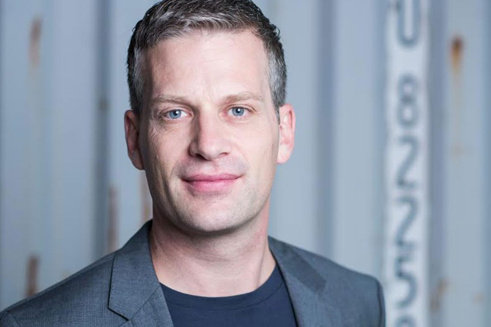

Earlier this year, we were named by Clutch a top development partner in 2021.

Today, I'm happy to announce that we've continued our streak of recognition and have now been named as [one of the top 1000 companies worldwide](https://clutch.co/press-releases/clutch-1000-2021-report?utm_campaign=Awards%20Notifications&utm_medium=email&_hsmi=190415663&_hsenc=p2ANqtz-_zj1RlH0GSKCfTSRkNhJrcZlN55RBWfAnaPmAEAZciOSH673SB8w3YXzRUgisF-rNfc--KdnMNDjhH3Rhsdp4CX3cB8Q&utm_content=190412339&utm_source=hs_email) in their latest round of awards.

The exclusive list contains only the top 1%, most reputable companies who use the platform, and we're honoured to make the cut.

We're very proud to have companies like Clutch and Goodfirms recognize our hard work, just as we are proud to regularly feature in [articles](https://medium.com/@merdekiti/15-top-web-development-companies-in-2020-c666cd178476) and [lists](https://digital.com/custom-software-development-companies/) of the top development companies all over the world.

But, as I’ve said [before](https://altar.io/altar-io-named-leading-b2b-company-by-clutch-co/), we are even prouder to see our clients succeed. 

We know how hard it is for entrepreneurs to decide on a software development partner. It is a decision that carries a lot of [risks](https://altar.io/10-reasons-why-outsourcing-software-development-fails/). 

Finding the right match is a key business decision and there are [many factors you have to consider](https://altar.io/founders-guide-how-to-outsource-software-development-2020/) when you are searching for the ideal candidate. 

But when you do here is what happens: 

/\* widget: Blog: What is Quoting \*/ /\* reset -------------------- \*/ .blog-custom-block \*, .blog-custom-block ::before, .blog-custom-block ::after { box-sizing: border-box; border-width: 0; border-style: solid; border-color: #e5e7eb; } /\* vars -------------------- \*/ .blog-custom-block.blog-custom-block\_\_what-is-quoting { --color-bg: #F4FAFE; --color-border: rgb(15 164 234 / 0.50); --color-text-1: #0F172A; --color-text-2: #4A4A68; } /\* colors -------------------- \*/ .blog-custom-block.blog-custom-block\_\_what-is-quoting .border-clr-border { border-color: var(--color-border); } .blog-custom-block.blog-custom-block\_\_what-is-quoting .bg-clr-bg { background-color: var(--color-bg); } .blog-custom-block.blog-custom-block\_\_what-is-quoting .text-clr-text-1 { color: var(--color-text-1); } .blog-custom-block.blog-custom-block\_\_what-is-quoting .text-clr-text-2 { color: var(--color-text-2); } /\* utils -------------------- \*/ .blog-custom-block.blog-custom-block\_\_what-is-quoting .mt-auto { margin-top: auto; } .blog-custom-block.blog-custom-block\_\_what-is-quoting .flex { display: flex; } .blog-custom-block.blog-custom-block\_\_what-is-quoting .h-44 { height: 11rem; } .blog-custom-block.blog-custom-block\_\_what-is-quoting .w-44 { width: 11rem; } .blog-custom-block.blog-custom-block\_\_what-is-quoting .flex-1 { flex: 1 1 0%; } .blog-custom-block.blog-custom-block\_\_what-is-quoting .flex-shrink-0 { flex-shrink: 0; } .blog-custom-block.blog-custom-block\_\_what-is-quoting .flex-col { flex-direction: column; } .blog-custom-block.blog-custom-block\_\_what-is-quoting .items-center { align-items: center; } .blog-custom-block.blog-custom-block\_\_what-is-quoting .gap-4 { gap: 1rem; } .blog-custom-block.blog-custom-block\_\_what-is-quoting .gap-5 { gap: 1.25rem; } .blog-custom-block.blog-custom-block\_\_what-is-quoting .gap-6 { gap: 1.5rem; } .blog-custom-block.blog-custom-block\_\_what-is-quoting .self-end { align-self: flex-end; } .blog-custom-block.blog-custom-block\_\_what-is-quoting .rounded-xl { border-radius: 0.75rem; } .blog-custom-block.blog-custom-block\_\_what-is-quoting .border { border-width: 1px; } .blog-custom-block.blog-custom-block\_\_what-is-quoting .object-cover { object-fit: cover; } .blog-custom-block.blog-custom-block\_\_what-is-quoting .p-8 { padding: 2rem; } .blog-custom-block.blog-custom-block\_\_what-is-quoting .text-3xl { font-size: 1.875rem; line-height: 2.25rem; } .blog-custom-block.blog-custom-block\_\_what-is-quoting .text-lg { font-size: 1.125rem; line-height: 1.75rem; } .blog-custom-block.blog-custom-block\_\_what-is-quoting .font-bold { font-weight: 700; } .blog-custom-block.blog-custom-block\_\_what-is-quoting .text-inherit { color: inherit; } .blog-custom-block.blog-custom-block\_\_what-is-quoting .underline { text-decoration: underline; }  

With our MVP, we won a pilot project with a global financial institution. The other success story was that we were able to put together a seed round using the MVP.  
Our further development wouldn't have been possible without it.

Philip Schoch, Founder & CEO, [Apiax](https://www.apiax.com/)

Apiax is a fintech startup that provides regulation as a service for financial services companies. 

They went live in the summer of 2018. By the end of that year, they had secured major clients in the banking industry.

They went on to win Early Stage Startup of the Year at the  2019 [Swiss Fintech Awards](https://www.fuw-forum.ch/swiss-fintech-awards-2019/). 

They were recognised as one of the HOT TEN FinTech companies by [FinTech50](https://blog.apiax.com/apiax-one-to-watch-in-2019-a30ba7ca58a0) and have been ranked among the [Top 100 Swiss startups](https://blog.apiax.com/apiax-ranks-among-the-top-100-swiss-startups-for-the-second-time-8c8054635723) for the second year in a row.

Philip‘s success makes us extremely proud but it also shows us that we have achieved something great being part of such a powerful and successful product.

That’s how we measure success here at Altar.io.
