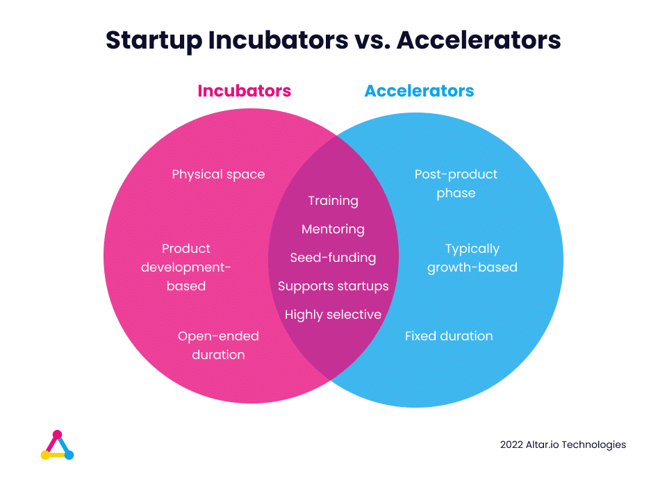

Finding the right incubator or accelerator (or even knowing which model is right for you) is a challenging process that can often leave you feeling overwhelmed.

Which is something I faced first-hand as I set out on my entrepreneurial journey. I’ve written about [those experiences here](https://altar.io/best-startup-incubators/) if you’re interested in knowing a bit more.

There are several factors to take into account when considering a startup accelerator or incubator for your startup.

Things like the industry they specialise in, the amount of funding they provide (and the amount of equity they ask in return), the quality of the alumni community, etc.

It’s a long and arduous process that can quickly distract you from the important task of bringing your startup vision to life.

So, I thought I would give you a headstart and list the 30 best UK-based startup accelerators and incubators.

The top five include in-depth information on where and how to apply, as well as what you can expect from their specific program.

First, however, I wanted to give you a quick overview of what the similarities and differences are between incubator and accelerator programs and how each can help you.

Feel free to skip ahead to the list using the contents section below if you’re already familiar with the two models.

#### Contents

## What Is a Startup Incubator/Accelerator?

There are some key similarities between a startup accelerator and an incubator. For example, they both support entrepreneurs with early-stage startups with training, mentoring and funding.

That being said, there are a few differences between them.

Incubators focus on helping startups that are yet to develop a full product and business model.

Whereas accelerators help startups who already have a basic product (like an MVP or POC) out in the market. They focus on helping startups scale and grow.

## How Startup Incubators & Accelerators Can Help You

My colleague, Rui, recently sat down with a number of alumni from Y Combinator and 500 startups (check out those conversations [here](https://altar.io/founders-share-what-you-can-expect-from-a-startup-accelerator/)).

Of all of the benefits of a startup accelerator or incubator, they selected three that were the most important.

The first? **Opportunities for funding**.

When you are accepted to join a cohort, usually, the accelerator or incubator will give you an injection of capital (at the cost of a percentage of equity).

But more than that, they will put you in contact with angel investors and VCs for further funding opportunities.

The second is the **entrepreneurial community**.

When joining an incubator or accelerator program you get to meet not only the other entrepreneurs in your cohort. You also gain access to a network of alumni who have been where you were.

This allows you to quickly build a virtual Rolodex of professionals you can collaborate with.

Last but not least is **mentorship**.

The best startup accelerators and incubators bring on mentors and advisors who’re at the top of their industries. They’ve already built successful startups and have valuable experience which can help you avoid several hurdles they’ve faced.

Related: [Successful Founders Share What You Can Expect From a Startup Accelerator](https://altar.io/founders-share-what-you-can-expect-from-a-startup-accelerator/)

## The Top 30 Startup Incubators & Accelerators in the UK

Finally, here's the list of the top 30 Startup Incubators and Accelerators in the UK.

Having applied to several accelerator programs in my startup career, I have some experience with the due diligence process.

So, I’ve added some in-depth information on the top five to help you get started. It includes details on the application process for each, and what you can expect from their programs.

/\* widget: Blog: Expert Tip \*/  /\* reset -------------------- \*/  .blog-custom-block \*,  .blog-custom-block ::before,  .blog-custom-block ::after {  box-sizing: border-box;  border-width: 0;  border-style: solid;  border-color: #e5e7eb;  }  /\* vars -------------------- \*/  .blog-custom-block.blog-custom-block\_\_expert-tip {  --color-bg: #F4FAFE;  --color-border: rgb(15 164 234 / 0.50);  --color-text-1: #0F172A;  --color-text-2: #4A4A68;  }  /\* colors -------------------- \*/  .blog-custom-block.blog-custom-block\_\_expert-tip .bg-clr-bg {  background-color: var(--color-bg);  }  .blog-custom-block.blog-custom-block\_\_expert-tip .border-clr-border {  border-color: var(--color-border);  }  .blog-custom-block.blog-custom-block\_\_expert-tip .text-clr-text-1 {  color: var(--color-text-1);  }  .blog-custom-block.blog-custom-block\_\_expert-tip .text-clr-text-2 {  color: var(--color-text-2);  }  /\* utils -------------------- \*/  .blog-custom-block.blog-custom-block\_\_expert-tip .flex {  display: flex;  }  .blog-custom-block.blog-custom-block\_\_expert-tip .flex-shrink-0 {  flex-shrink: 0;  }  .blog-custom-block.blog-custom-block\_\_expert-tip .flex-col {  flex-direction: column;  }  .blog-custom-block.blog-custom-block\_\_expert-tip .gap-4 {  gap: 1rem;  }  .blog-custom-block.blog-custom-block\_\_expert-tip .gap-5 {  gap: 1.25rem;  }  .blog-custom-block.blog-custom-block\_\_expert-tip .rounded-xl {  border-radius: 0.75rem;  }  .blog-custom-block.blog-custom-block\_\_expert-tip .border {  border-width: 1px;  }  .blog-custom-block.blog-custom-block\_\_expert-tip .p-8 {  padding: 2rem;  }  .blog-custom-block.blog-custom-block\_\_expert-tip .text-3xl {  font-size: 1.875rem;  line-height: 2.25rem;  }  .blog-custom-block.blog-custom-block\_\_expert-tip .text-lg {  font-size: 1.125rem;  line-height: 1.75rem;  }  .blog-custom-block.blog-custom-block\_\_expert-tip .font-bold {  font-weight: 700;  } 

In the interest of full transparency...

Should you choose to work with one of the incubators listed below, neither I nor Altar receives any money from an affiliate link. The startup incubators were chosen based on the experience of myself, my co-founders and our extended network of entrepreneurs.

Related: [The Best Startup Incubators Worldwide and How They Can Help You](https://altar.io/best-startup-incubators/)

## 1. [Startupbootcamp](https://www.startupbootcamp.org/)

Startupbootcamp has helped bring over 950 startups to life. They’re based in London but have a global network of over 20 accelerators. Portfolio companies include [Relayr](https://relayr.io/), [Signaturit](https://www.signaturit.com/) and [Obsidian](https://obsidiansuite.com/).

The program runs for three months, during which you’ll be guided by mentors and advisors specific to your industry – as well as networking opportunities with other members of your cohort.

Startupbootcamp will offer €15,000 in cash, €450,000 in partner services and 6-months of free, collaborative office space.

The accelerator culminates in a Demo Day, where you can showcase your product to an audience of over 400 investors, partners, mentors and media.

Once you leave the accelerator, you’re added to Startupbootcamp’s Alumni Network, which gives you continued access to their global network of founders and mentors.

You can find out which accelerators are open for applications [here](https://www.startupbootcamp.org/accelerator/).

/\* widget: Blog: What is Saying \*/  /\* reset -------------------- \*/  .blog-custom-block \*,  .blog-custom-block ::before,  .blog-custom-block ::after {  box-sizing: border-box;  border-width: 0;  border-style: solid;  border-color: #e5e7eb;  }  /\* vars -------------------- \*/  .blog-custom-block.blog-custom-block\_\_what-is-saying {  --color-bg: #F4FAFE;  --color-border: rgb(15 164 234 / 0.50);  --color-text-1: #0F172A;  --color-text-2: #4A4A68;  }  /\* colors -------------------- \*/  .blog-custom-block.blog-custom-block\_\_what-is-saying .border-clr-border {  border-color: var(--color-border);  }  .blog-custom-block.blog-custom-block\_\_what-is-saying .bg-clr-bg {  background-color: var(--color-bg);  }  .blog-custom-block.blog-custom-block\_\_what-is-saying .text-clr-text-1 {  color: var(--color-text-1);  }  .blog-custom-block.blog-custom-block\_\_what-is-saying .text-clr-text-2 {  color: var(--color-text-2);  }  /\* utils -------------------- \*/  .blog-custom-block.blog-custom-block\_\_what-is-saying .mt-auto {  margin-top: auto;  }  .blog-custom-block.blog-custom-block\_\_what-is-saying .flex {  display: flex;  }  .blog-custom-block.blog-custom-block\_\_what-is-saying .h-44 {  height: 11rem;  }  .blog-custom-block.blog-custom-block\_\_what-is-saying .w-44 {  width: 11rem;  }  .blog-custom-block.blog-custom-block\_\_what-is-saying .flex-1 {  flex: 1 1 0%;  }  .blog-custom-block.blog-custom-block\_\_what-is-saying .flex-shrink-0 {  flex-shrink: 0;  }  .blog-custom-block.blog-custom-block\_\_what-is-saying .flex-col {  flex-direction: column;  }  .blog-custom-block.blog-custom-block\_\_what-is-saying .items-center {  align-items: center;  }  .blog-custom-block.blog-custom-block\_\_what-is-saying .gap-4 {  gap: 1rem;  }  .blog-custom-block.blog-custom-block\_\_what-is-saying .gap-5 {  gap: 1.25rem;  }  .blog-custom-block.blog-custom-block\_\_what-is-saying .gap-6 {  gap: 1.5rem;  }  .blog-custom-block.blog-custom-block\_\_what-is-saying .self-end {  align-self: flex-end;  }  .blog-custom-block.blog-custom-block\_\_what-is-saying .rounded-xl {  border-radius: 0.75rem;  }  .blog-custom-block.blog-custom-block\_\_what-is-saying .border {  border-width: 1px;  }  .blog-custom-block.blog-custom-block\_\_what-is-saying .object-cover {  object-fit: cover;  }  .blog-custom-block.blog-custom-block\_\_what-is-saying .p-8 {  padding: 2rem;  }  .blog-custom-block.blog-custom-block\_\_what-is-saying .text-3xl {  font-size: 1.875rem;  line-height: 2.25rem;  }  .blog-custom-block.blog-custom-block\_\_what-is-saying .text-lg {  font-size: 1.125rem;  line-height: 1.75rem;  }  .blog-custom-block.blog-custom-block\_\_what-is-saying .font-bold {  font-weight: 700;  }  .blog-custom-block.blog-custom-block\_\_what-is-saying .text-inherit {  color: inherit;  } 

What the Alumni are Saying 

Startupbootcamp proved invaluable. They have an amazing network and connected us with every investor in our seed round.

Charlie Casey, Co-Founder, [Loyaltylion](https://loyaltylion.com/uk)

### 2. [Entrepreneur First](https://www.joinef.com/)

Based in London, Entrepreneur First runs its “highly-selective” three-month program in six cities across the globe. Portfolio companies include [Tractable](https://tractable.ai/), [Phantasma Labs](https://www.phantasma.global/) and [Flowlity](https://flowlity.com/).

Their focus is on mentoring and advising founders and putting them in contact with other entrepreneurs in the cohort to help them find their co-founders.

During this time, they offer a £2,000 a month stipend while you meet and get to know potential co-founders.

Once you’ve found your co-founder, they’ll guide you for three months to help you develop your startup and hone your value proposition.

Once that stage is complete, Entrepreneur First invests £80,000 in your company, for 10% equity – as well as introducing you to their network of investors for further funding opportunities.

Once the program ends, you’re invited to join their alumni network, which you can use to “hire, advise, buy from, sell to and support each other.”

The application process consists of a short form that allows you to showcase your education, experience and best achievements. All the application forms can be found [here](https://www.joinef.com/apply-now/).

/\* widget: Blog: What is Saying \*/  /\* reset -------------------- \*/  .blog-custom-block \*,  .blog-custom-block ::before,  .blog-custom-block ::after {  box-sizing: border-box;  border-width: 0;  border-style: solid;  border-color: #e5e7eb;  }  /\* vars -------------------- \*/  .blog-custom-block.blog-custom-block\_\_what-is-saying {  --color-bg: #F4FAFE;  --color-border: rgb(15 164 234 / 0.50);  --color-text-1: #0F172A;  --color-text-2: #4A4A68;  }  /\* colors -------------------- \*/  .blog-custom-block.blog-custom-block\_\_what-is-saying .border-clr-border {  border-color: var(--color-border);  }  .blog-custom-block.blog-custom-block\_\_what-is-saying .bg-clr-bg {  background-color: var(--color-bg);  }  .blog-custom-block.blog-custom-block\_\_what-is-saying .text-clr-text-1 {  color: var(--color-text-1);  }  .blog-custom-block.blog-custom-block\_\_what-is-saying .text-clr-text-2 {  color: var(--color-text-2);  }  /\* utils -------------------- \*/  .blog-custom-block.blog-custom-block\_\_what-is-saying .mt-auto {  margin-top: auto;  }  .blog-custom-block.blog-custom-block\_\_what-is-saying .flex {  display: flex;  }  .blog-custom-block.blog-custom-block\_\_what-is-saying .h-44 {  height: 11rem;  }  .blog-custom-block.blog-custom-block\_\_what-is-saying .w-44 {  width: 11rem;  }  .blog-custom-block.blog-custom-block\_\_what-is-saying .flex-1 {  flex: 1 1 0%;  }  .blog-custom-block.blog-custom-block\_\_what-is-saying .flex-shrink-0 {  flex-shrink: 0;  }  .blog-custom-block.blog-custom-block\_\_what-is-saying .flex-col {  flex-direction: column;  }  .blog-custom-block.blog-custom-block\_\_what-is-saying .items-center {  align-items: center;  }  .blog-custom-block.blog-custom-block\_\_what-is-saying .gap-4 {  gap: 1rem;  }  .blog-custom-block.blog-custom-block\_\_what-is-saying .gap-5 {  gap: 1.25rem;  }  .blog-custom-block.blog-custom-block\_\_what-is-saying .gap-6 {  gap: 1.5rem;  }  .blog-custom-block.blog-custom-block\_\_what-is-saying .self-end {  align-self: flex-end;  }  .blog-custom-block.blog-custom-block\_\_what-is-saying .rounded-xl {  border-radius: 0.75rem;  }  .blog-custom-block.blog-custom-block\_\_what-is-saying .border {  border-width: 1px;  }  .blog-custom-block.blog-custom-block\_\_what-is-saying .object-cover {  object-fit: cover;  }  .blog-custom-block.blog-custom-block\_\_what-is-saying .p-8 {  padding: 2rem;  }  .blog-custom-block.blog-custom-block\_\_what-is-saying .text-3xl {  font-size: 1.875rem;  line-height: 2.25rem;  }  .blog-custom-block.blog-custom-block\_\_what-is-saying .text-lg {  font-size: 1.125rem;  line-height: 1.75rem;  }  .blog-custom-block.blog-custom-block\_\_what-is-saying .font-bold {  font-weight: 700;  }  .blog-custom-block.blog-custom-block\_\_what-is-saying .text-inherit {  color: inherit;  } 

What the Alumni are Saying 

Entrepreneur First tells you: ‘you’re here to build billion dollar companies’. I remember thinking ‘that’s ridiculous.’

I guess it isn’t.

Alex Dalyac, CEO, [Tractable](https://tractable.ai/)

### 3. [Bethnal Green Ventures](https://bethnalgreenventures.com/)

Founded in 2012, Bethnal Green Ventures (BGV) has helped bring 166 startups to life. They’re focused on “Tech for Good”  and exclusively help startups that provide a positive social impact on the world. Portfolio companies include [Fairphone](https://www.fairphone.com/en/), [Commonplace](https://www.commonplace.is/) and [DrDoctor](https://www.drdoctor.co.uk/).

The program is 12 weeks long, divided into six sprints – each of which is focused on diving deep into specific early-stage startup topics.

BGV will invest £30k for a 7% stake in your startup. For nine months after you finish the program, they will directly help you on your fundraising journey – with monthly check-ins, funding workshops and investor mentoring.

All the application information can be found [here](https://www.bethnalgreenventures.com/apply#rec126969297). If applications are closed when viewing, you can register to be notified about upcoming cohorts, or contact their team directly.

Related: [The 50 Best Startup Incubators & Accelerators in the USA](https://altar.io/best-startup-accelerators-usa/)

### 4. [Techstars London](https://www.techstars.com/accelerators/london) 

Techstars London has helped bring 119 startups to life – however globally they’ve helped over 3500. [Uber](https://www.uber.com/), [Twilio](https://www.twilio.com/) and [DigitalOcean](https://www.digitalocean.com/) are all among their portfolio companies.

They invest $20,000 in return for 6% equity – which most startups use as a stipend to cover living costs. TechStars also offers every startup an optional $100k [convertible note](https://techcrunch.com/2012/04/07/convertible-note-seed-financings/).

You get in touch with their London office [here](https://www.techstars.com/accelerators/london). It takes around two to five hours to fill out your first application

If your application passes the screening process, you will be invited to interview with TechStars (this process usually takes around four weeks).

After that, you’ll have one more interview with their screening committee.

The program lasts for three months.

In month one, they focus on growing your network by introducing you to over 100 mentors. The aim here is to find people who can help you hone your value proposition, marketing, tech, hiring strategy, etc.

Month two is then taking what you achieved in month one, and using it to execute your vision. Building out your product, onboarding early adopters, achieving KPIs, etc.

Month three is all about telling your story to set you up for fundraising and the demo day at the end of the program. You’ll craft your pitch deck, prepare investor collateral and, critically, learn how to communicate your vision.

/\* widget: Blog: What is Saying \*/  /\* reset -------------------- \*/  .blog-custom-block \*,  .blog-custom-block ::before,  .blog-custom-block ::after {  box-sizing: border-box;  border-width: 0;  border-style: solid;  border-color: #e5e7eb;  }  /\* vars -------------------- \*/  .blog-custom-block.blog-custom-block\_\_what-is-saying {  --color-bg: #F4FAFE;  --color-border: rgb(15 164 234 / 0.50);  --color-text-1: #0F172A;  --color-text-2: #4A4A68;  }  /\* colors -------------------- \*/  .blog-custom-block.blog-custom-block\_\_what-is-saying .border-clr-border {  border-color: var(--color-border);  }  .blog-custom-block.blog-custom-block\_\_what-is-saying .bg-clr-bg {  background-color: var(--color-bg);  }  .blog-custom-block.blog-custom-block\_\_what-is-saying .text-clr-text-1 {  color: var(--color-text-1);  }  .blog-custom-block.blog-custom-block\_\_what-is-saying .text-clr-text-2 {  color: var(--color-text-2);  }  /\* utils -------------------- \*/  .blog-custom-block.blog-custom-block\_\_what-is-saying .mt-auto {  margin-top: auto;  }  .blog-custom-block.blog-custom-block\_\_what-is-saying .flex {  display: flex;  }  .blog-custom-block.blog-custom-block\_\_what-is-saying .h-44 {  height: 11rem;  }  .blog-custom-block.blog-custom-block\_\_what-is-saying .w-44 {  width: 11rem;  }  .blog-custom-block.blog-custom-block\_\_what-is-saying .flex-1 {  flex: 1 1 0%;  }  .blog-custom-block.blog-custom-block\_\_what-is-saying .flex-shrink-0 {  flex-shrink: 0;  }  .blog-custom-block.blog-custom-block\_\_what-is-saying .flex-col {  flex-direction: column;  }  .blog-custom-block.blog-custom-block\_\_what-is-saying .items-center {  align-items: center;  }  .blog-custom-block.blog-custom-block\_\_what-is-saying .gap-4 {  gap: 1rem;  }  .blog-custom-block.blog-custom-block\_\_what-is-saying .gap-5 {  gap: 1.25rem;  }  .blog-custom-block.blog-custom-block\_\_what-is-saying .gap-6 {  gap: 1.5rem;  }  .blog-custom-block.blog-custom-block\_\_what-is-saying .self-end {  align-self: flex-end;  }  .blog-custom-block.blog-custom-block\_\_what-is-saying .rounded-xl {  border-radius: 0.75rem;  }  .blog-custom-block.blog-custom-block\_\_what-is-saying .border {  border-width: 1px;  }  .blog-custom-block.blog-custom-block\_\_what-is-saying .object-cover {  object-fit: cover;  }  .blog-custom-block.blog-custom-block\_\_what-is-saying .p-8 {  padding: 2rem;  }  .blog-custom-block.blog-custom-block\_\_what-is-saying .text-3xl {  font-size: 1.875rem;  line-height: 2.25rem;  }  .blog-custom-block.blog-custom-block\_\_what-is-saying .text-lg {  font-size: 1.125rem;  line-height: 1.75rem;  }  .blog-custom-block.blog-custom-block\_\_what-is-saying .font-bold {  font-weight: 700;  }  .blog-custom-block.blog-custom-block\_\_what-is-saying .text-inherit {  color: inherit;  } 

What the Alumni are Saying 

At critical moments throughout our history, somehow someone in the Techstars network pointed us in a direction that led us to where we are today.

Adam Wilson, Founder, [Sphero](https://sphero.com/)

Related: [How to Build a Successful Minimum Viable Product (MVP) in 3 Steps](https://altar.io/features-inside-mvp-3-steps-know-answer/)

### 5. [Founders Factory](https://foundersfactory.com/)

Founded in 2015, Founders Factory has helped bring over 114 startups to life. Portfolio companies include [Shop Circle](https://shopcircle.co/), [Flourish](https://flourish.studio/) and [Fanbytes](https://fanbytes.co.uk/).

The program lasts for six months. In that time, they’ll give you hands-on support across strategy, fundraising, ops, BizDev, product, design, tech, growth, PR, brand, and talent.

They have a team of over 100 mentors with sector expertise in FinTech, Health, Home, and Mental Health – with more coming soon.

They don’t define a specific amount when it comes to funding. They treat the funding amount on a case-by-case basis. They do say, however, that you can expect to be asked for anywhere between 3%-7% equity depending on your stage and valuation.

You can find the application form [here](https://foundersfactorystartups.typeform.com/to/WlDiIsRh#_ga=2.253600205.574094373.1660906954-2064936495.1660906954). You will be asked to extensively describe your startup and you’ll need to upload several supporting documents like a pitch deck.

/\* widget: Blog: What is Saying \*/  /\* reset -------------------- \*/  .blog-custom-block \*,  .blog-custom-block ::before,  .blog-custom-block ::after {  box-sizing: border-box;  border-width: 0;  border-style: solid;  border-color: #e5e7eb;  }  /\* vars -------------------- \*/  .blog-custom-block.blog-custom-block\_\_what-is-saying {  --color-bg: #F4FAFE;  --color-border: rgb(15 164 234 / 0.50);  --color-text-1: #0F172A;  --color-text-2: #4A4A68;  }  /\* colors -------------------- \*/  .blog-custom-block.blog-custom-block\_\_what-is-saying .border-clr-border {  border-color: var(--color-border);  }  .blog-custom-block.blog-custom-block\_\_what-is-saying .bg-clr-bg {  background-color: var(--color-bg);  }  .blog-custom-block.blog-custom-block\_\_what-is-saying .text-clr-text-1 {  color: var(--color-text-1);  }  .blog-custom-block.blog-custom-block\_\_what-is-saying .text-clr-text-2 {  color: var(--color-text-2);  }  /\* utils -------------------- \*/  .blog-custom-block.blog-custom-block\_\_what-is-saying .mt-auto {  margin-top: auto;  }  .blog-custom-block.blog-custom-block\_\_what-is-saying .flex {  display: flex;  }  .blog-custom-block.blog-custom-block\_\_what-is-saying .h-44 {  height: 11rem;  }  .blog-custom-block.blog-custom-block\_\_what-is-saying .w-44 {  width: 11rem;  }  .blog-custom-block.blog-custom-block\_\_what-is-saying .flex-1 {  flex: 1 1 0%;  }  .blog-custom-block.blog-custom-block\_\_what-is-saying .flex-shrink-0 {  flex-shrink: 0;  }  .blog-custom-block.blog-custom-block\_\_what-is-saying .flex-col {  flex-direction: column;  }  .blog-custom-block.blog-custom-block\_\_what-is-saying .items-center {  align-items: center;  }  .blog-custom-block.blog-custom-block\_\_what-is-saying .gap-4 {  gap: 1rem;  }  .blog-custom-block.blog-custom-block\_\_what-is-saying .gap-5 {  gap: 1.25rem;  }  .blog-custom-block.blog-custom-block\_\_what-is-saying .gap-6 {  gap: 1.5rem;  }  .blog-custom-block.blog-custom-block\_\_what-is-saying .self-end {  align-self: flex-end;  }  .blog-custom-block.blog-custom-block\_\_what-is-saying .rounded-xl {  border-radius: 0.75rem;  }  .blog-custom-block.blog-custom-block\_\_what-is-saying .border {  border-width: 1px;  }  .blog-custom-block.blog-custom-block\_\_what-is-saying .object-cover {  object-fit: cover;  }  .blog-custom-block.blog-custom-block\_\_what-is-saying .p-8 {  padding: 2rem;  }  .blog-custom-block.blog-custom-block\_\_what-is-saying .text-3xl {  font-size: 1.875rem;  line-height: 2.25rem;  }  .blog-custom-block.blog-custom-block\_\_what-is-saying .text-lg {  font-size: 1.125rem;  line-height: 1.75rem;  }  .blog-custom-block.blog-custom-block\_\_what-is-saying .font-bold {  font-weight: 700;  }  .blog-custom-block.blog-custom-block\_\_what-is-saying .text-inherit {  color: inherit;  } 

What the Alumni are Saying 

Working with Founders Factory helped us focus our business in the early stages. This was key to enabling us to structure our business to scale. The continued support and infrastructure has empowered us to go on to build a creative technology platform that is transforming the way the world’s largest brands create video advertising.

Gerard Keeley, CEO & Co-Founder, [Vidsy](https://vidsy.co/)

## The Full List of the Top 30 Startup Incubators & Accelerators in the UK

|     | Company                                                                     | Location   | Founding Date | No. of Investments | Industry Focus                           |
| --- | --------------------------------------------------------------------------- | ---------- | ------------- | ------------------ | ---------------------------------------- |
| 1   | [Startupbootcamp](https://www.startupbootcamp.org/)                         | London     | 2010          | 950                | Software,Financial Services, IT          |
| 2   | [Entrepreneur First](https://www.joinef.com/)                               | London     | 2011          | 500+               | AI, Software, ML                         |
| 3   | [Bethnal Green Ventures](https://bethnalgreenventures.com/)                 | London     | 2012          | 192                | Healthcare, Software, Education          |
| 4   | [Techstars London](https://www.techstars.com/accelerators/london)           | London     | 2006          | 119                | Software, AI, IT                         |
| 5   | [Founders Factory](https://foundersfactory.com/)                            | London     | 2015          | 114                | Software, AI, IT                         |
| 6   | [London Co-Investment Fund](https://fundinglondon.co.uk/)                   | London     | 2014          | 116                | Software, AI, Healthcare                 |
| 7   | [Upscale](https://technation.io/programmes/upscale/)                        | London     | 2011          | 108                | Software, SaaS, E-Commerce               |
| 8   | [Outlier Ventures](https://outlierventures.io/)                             | London     | 2014          | 78                 | Software, Blockchain, IT                 |
| 9   | [Collider](https://www.collider.io/)                                        | London     | 2012          | 78                 | Advertising, Analytics, Software         |
| 10  | [Pario Ventures](https://www.parioventures.com/)                            | London     | 2010          | 71                 | Automotive, Fintech, Software            |
| 11  | [Pi Ventures](https://www.pilabs.co.uk/)                                    | London     | 2015          | 69                 | Software, Real Estate, SaaS              |
| 12  | [CyLon](https://cylonlab.com/)                                              | London     | 2015          | 69                 | Cyber Security, Software                 |
| 13  | [Data Pitch](https://datapitch.eu/)                                         | London     | 2017          | 45                 | Software, IT, Analytics                  |
| 14  | [Chivas Ventures](https://www.linkedin.com/company/the-venture/about/)      | London     | 2014          | 44                 | Food & Beverage, Fashion, Manufacturing  |
| 15  | [Tech Nation](https://technation.io/programmes/fintech/)                    | London     | 2010          | 38                 | Fintech, Financial Services, IT          |
| 16  | [Breed Reply](https://www.reply.com/breed-reply/en/)                        | London     | 2014          | 37                 | Software, IT, IoT                        |
| 17  | [iStarter](https://www.istarter.it/)                                        | London     | 2012          | 35                 | E-Commerce, IT, Healthcare               |
| 18  | [L Marks](https://lmarks.com/)                                              | London     | 2012          | 31                 | Software, IT, Apps                       |
| 19  | [Insurtech Gateway](https://insurtechgateway.com/)                          | London     | 2016          | 30                 | Insurance, Insurtech, Financial Services |
| 20  | [Ignite](https://ignite.io/)                                                | Newcastle  | 2011          | 30                 | Software, SaaS, Travel                   |
| 21  | [CodeBase](https://www.thisiscodebase.com/)                                 | Edinburgh  | 2014          | 28                 | Software, IT, Education                  |
| 22  | [DigitalHealth.London](https://digitalhealth.london/programmes/accelerator) | London     | 2016          | 28                 | Healthcare, Medical, IT                  |
| 23  | [Geovation](https://geovation.uk/)                                          | London     | 2009          | 27                 | Real Estate, Software,                   |
| 24  | [Oxygen Accelerator](https://www.oxygenaccelerator.com/)                    | Birmingham | 2011          | 25                 | E-Commerce, Internet, Mobile             |
| 25  | [Huckletree](https://www.huckletree.com/education/alpha)                    | London     | 2014          | 23                 | E-Commerce, Software, Mobile Apps        |
| 26  | [Carbon Trust](https://www.carbontrust.com/)                                | London     | 2001          | 22                 | Energy, Manufacturing, Chemical          |
| 27  | [Startup Campus](https://www.startupcampus.hu/?lang=en)                     | London     | 2015          | 21                 | Software, Healthcare, Mobile Apps        |
| 28  | [Potential VC](https://potential.co/)                                       | London     | 2015          | 21                 | E-Commerce, Apps, Software               |
| 29  | [ChangeLabs](https://changelabsme.org/)                                     | London     | 2018          | 19                 | Electric Vehicles, Education, E-Commerce |
| 30  | [TechItalia:Lab](https://www.techitalialab.com/)                            | London     | 2017          | 17                 | E-Commerce, Marketing, AI                |

## Wrapping Up

I hope the information above has helped you speed up your application process.

As you send out your applications remember to make sure the pros outweigh the cons for your startup. Look at the funding opportunities and what they expect in return, the mentorship they provide and how relevant it is for you, and their wider alumni network and the value it has.

More than that, if you’re unsuccessful in joining an accelerator or incubator, don’t worry.

While startup incubators and accelerators can prove extremely beneficial to your startup, joining one does not guarantee success. And failing to join one doesn’t mean your startup will fail.

Good luck and thanks for reading.
