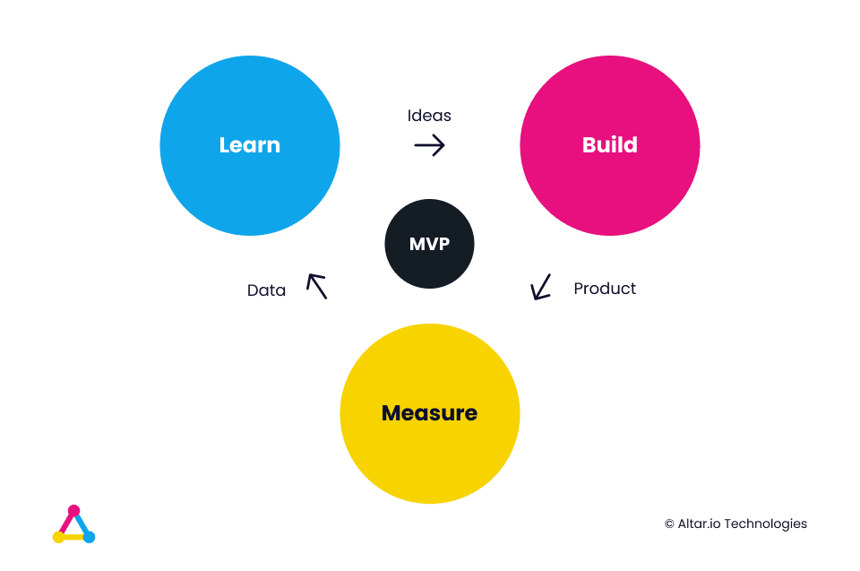

Building a startup is a monumental feat, requiring a perfect blend of vision, strategy, and execution. Not to mention a comprehensive understanding of a laundry list of factors.

Legal, sales, financing, marketing, building a team, technical knowledge, product expertise, and the list goes on.

It can quickly become overwhelming to know what to focus on – and critically when to switch your focus for the good of your business.

It’s something my team and I know a thing or two about.

Our founding team have all launched their own startups in the past, and have been where you’re standing right now multiple times.

More than that, since launching Altar, they’ve partnered with other entrepreneurs and business leaders, helping to bring over 70 startups to life using a tailored, proven process to create high-quality, user-centric software products that innovatively solve complex problems.

Some of those companies raised money from Tiger Global and Disney – and went on to conquer their markets.

Since I joined the team to lead the marketing efforts four years ago, and because we work mostly with entrepreneurs, my main goal has been to share valuable resources for startup founders looking to improve their chances of success and avoid common hurdles.

Over the years, we released a plethora of resources on everything to do with building a startup.

Now, I’m taking all of that collective wisdom and boil it down into one, comprehensive guide.

From product and tech-related articles to lessons on how to find a CTO, we’ve touched pretty much every angle of the Startup Journey. And it’s all in this guide.

I’ve also included stories from some of the world’s leading entrepreneurs, many of whom I’ve had the opportunity to sit down with and learn about their startup journeys.

This content is designed to be your navigational aid, whether you're a first-time entrepreneur or a seasoned one looking to conquer a new challenge.

It covers everything from the ideation phase and setting yourself up for success all the way to building your MVP, finding early adopters and pulling off a successful launch.

It also explores those often-overlooked areas, like the power of doing things that don’t scale or the nuanced difference between mentors and advisors.

Let’s get stuck in.

#### Contents

## The Ideation Phase

Every startup journey begins with the ideation phase. It’s the first step in building a product or service and is a critical part if you are to set yourself up for success. There are several things you need to achieve before you move on to actually trying to turn your idea into a reality.

Starting with how you find that idea in the first place.

### Finding the Next Big Startup Idea vs. Solving Problems

It can be tempting as you start your entrepreneurial journey to look for the “next big startup idea” – that groundbreaking idea that will disrupt an industry and propel you to unicorn stardom.

The problem with this mindset is that it overlooks one fundamental thing that all successful startups have in common – they solve a problem for a certain niche of people.

For this reason, rather than striving to find the next unicorn idea, it’s better to instead focus on identifying a tangible problem in the market.

This approach hones in on the concrete challenges faced by your target customers. Looking for the genuine pain points they face and creating practical solutions for them.

This shift in mindset is valuable for startups for a couple of reasons.

Firstly, it lays the foundation for a rock-solid, sustainable business model. Instead of chasing hypothetical demand, you’re addressing real problems that people are already experiencing.

For you, this means your product or service will have a genuine market need right off the bat. This results in a reduced risk of rejection and keeping your startup relevant in the long run.

Talk about a recipe for sustainability!

Moreover, the problem-solution approach will naturally foster innovation.

To address, complex, real-world problems requires a high degree of creativity, ingenuity and out-of-the-box thinking. In a startup environment, this nurtures the all-important [innovation culture](https://www.braineet.com/blog/innovation-culture-benefits) that contributes to continuous improvement and growth.

Once you’ve found your startup idea – or better yet your problem that needs solving – it’s time to move on to the next step of the ideation phase which focuses on founder-market fit.

/\* widget: Blog: Expert Tip \*/ /\* reset -------------------- \*/ .blog-custom-block \*, .blog-custom-block ::before, .blog-custom-block ::after {  box-sizing: border-box;  border-width: 0;  border-style: solid;  border-color: #e5e7eb; } /\* vars -------------------- \*/ .blog-custom-block.blog-custom-block\_\_expert-tip {  --color-bg: #F4FAFE;  --color-border: rgb(15 164 234 / 0.50);  --color-text-1: #0F172A;  --color-text-2: #4A4A68; } /\* colors -------------------- \*/ .blog-custom-block.blog-custom-block\_\_expert-tip .bg-clr-bg {  background-color: var(--color-bg); } .blog-custom-block.blog-custom-block\_\_expert-tip .border-clr-border {  border-color: var(--color-border); } .blog-custom-block.blog-custom-block\_\_expert-tip .text-clr-text-1 {  color: var(--color-text-1); } .blog-custom-block.blog-custom-block\_\_expert-tip .text-clr-text-2 {  color: var(--color-text-2); } /\* utils -------------------- \*/ .blog-custom-block.blog-custom-block\_\_expert-tip .flex {  display: flex; } .blog-custom-block.blog-custom-block\_\_expert-tip .flex-shrink-0 {  flex-shrink: 0; } .blog-custom-block.blog-custom-block\_\_expert-tip .flex-col {  flex-direction: column; } .blog-custom-block.blog-custom-block\_\_expert-tip .gap-4 {  gap: 1rem; } .blog-custom-block.blog-custom-block\_\_expert-tip .gap-5 {  gap: 1.25rem; } .blog-custom-block.blog-custom-block\_\_expert-tip .rounded-xl {  border-radius: 0.75rem; } .blog-custom-block.blog-custom-block\_\_expert-tip .border {  border-width: 1px; } .blog-custom-block.blog-custom-block\_\_expert-tip .p-8 {  padding: 2rem; } .blog-custom-block.blog-custom-block\_\_expert-tip .text-3xl {  font-size: 1.875rem;  line-height: 2.25rem; } .blog-custom-block.blog-custom-block\_\_expert-tip .text-lg {  font-size: 1.125rem;  line-height: 1.75rem; } .blog-custom-block.blog-custom-block\_\_expert-tip .font-bold {  font-weight: 700; } 

Additional Resources on Startup Ideation

- [101 Entrepreneurs Share Their Best Advice for Starting a Business](https://startupsavant.com/101-best-advice-for-starting-a-business)
- [How Entrepreneurs Can Find the Right Problem to Solve - Harvard Business School Working Knowledge](https://hbswk.hbs.edu/item/how-entrepreneurs-can-find-the-right-problem-to-solve)
- [Entrepreneurs: Here Is How You Can Find Problems to Solve](https://www.inc.com/james-paine/entrepreneurs-here-is-how-you-can-find-problems-to-solve.html)
- [How to get startup ideas: YC Startup Library](https://www.ycombinator.com/library/8g-how-to-get-startup-ideas)

### Are You The Right Founder to Build This?

Founder-market fit is a common phrase that’s bandied around in the startup world, but I want to take a moment to go into it in a bit more detail.

At its core, founder-market fit is the alignment between your experience, knowledge, skills & passion and the market you’re aiming to enter.

It’s not just about asking “Is this a good idea/is this the right problem to tackle?” It’s also about asking “Am I the right person to tackle this problem and build this solution”.

With that in mind, how do you determine if you’re the right person for the job?

#### Experience & Expertise

Some of the most successful startups I’ve seen have been built by someone who’s spent years working in the industry they’re targeting.

It’s why you're [never too old to build a startup](https://altar.io/managers-improve-become-successful-entrepreneurs/). In fact, statistically, [older entrepreneurs are more likely to succeed](https://www.forbes.com/sites/kmehta/2022/08/23/older-entrepreneurs-outperform-younger-foundersshattering-ageism/?sh=6fa694467a36) than their younger counterparts.

Take Jacquelle Horton as an example here. She’s a founder we worked with recently to help her bring the vision for her startup, [Fave](https://altar.io/case_study/fave/), to life.

Fave is a fan-centric social media platform where people can forge deeper connections with both the musicians they love and fellow fans.

She spent over a decade innovating within the music industry before founding Fave. She spent seven years working at Google – five of which she spent at YouTube as a product manager, driving product development for creators and artists.

Her experience and expertise put her in the perfect position to disrupt the way fans interact and follow the artists they love.

In just two years, she’s raised over $2.3M with investments from the likes of Sony Music, Warner Music and Techstars.

Her startup has been named among Fast Company’s “[Most Innovative Companies](https://www.fastcompany.com/90724474/most-innovative-companies-social-media-2022)” and Music Tectonics “Startup of the Year”.

Her experience and expertise allowed her to intuitively grasp what people needed. She found a gap in the market and filled it with an innovative solution that quickly attracted some of the biggest artists in the world to her platform like Taylor Swift and BTS as well as tens of thousands of fans.

All of this to say, before diving down the rabbit hole of building a startup, ask yourself: **“Why me?”**

#### Passion & Perseverance

We can’t talk about Founder Fit without talking about two of the key tenets of the [entrepreneurial mindset](https://altar.io/entrepreneurial-mindset-lessons/), passion and perseverance.

If you’re not passionate, committed and ready to persevere there’s no way you’ll make it through the inevitable hurdles that come with the startup journey.

Whenever I talk about this topic, I [call back to a conversation](https://altar.io/lessons-learned-from-over-25-years-in-silicon-valley-founder-story/) I had with serial entrepreneur and Fortune 500 executive Garret Gafke.

He’s spent almost three decades building, leading and advising startups and corporations in Silicon Valley and has worked with the likes of Elon Musk and Jeff Bezos.

One of his startups, Identity Mind, was launched back in 2007 and pioneered the idea of digital identity.

Critically, this was at a time when the majority of people didn’t think about digital identity as an issue.

Due to this, he faced countless challenges along the way:

/\* widget: Blog: Simple Quote \*/ /\* reset -------------------- \*/ .blog-custom-block \*, .blog-custom-block ::before, .blog-custom-block ::after {  box-sizing: border-box;  border-width: 0;  border-style: solid;  border-color: #e5e7eb; } /\* vars -------------------- \*/ .blog-custom-block.blog-custom-block\_\_simple-quote {  --color-accent: #0FA4EA;  --color-bg: #F4FAFE;  --color-text-2: #4A4A68; } /\* colors -------------------- \*/ .blog-custom-block.blog-custom-block\_\_simple-quote .bg-clr-bg {  background-color: var(--color-bg); } .blog-custom-block.blog-custom-block\_\_simple-quote .border-clr-accent {  border-color: var(--color-accent); } .blog-custom-block.blog-custom-block\_\_simple-quote .text-clr-text-2 {  color: var(--color-text-2); } /\* utils -------------------- \*/ .blog-custom-block.blog-custom-block\_\_simple-quote .flex {  display: flex; } .blog-custom-block.blog-custom-block\_\_simple-quote .flex-shrink-0 {  flex-shrink: 0; } .blog-custom-block.blog-custom-block\_\_simple-quote .flex-col {  flex-direction: column; } .blog-custom-block.blog-custom-block\_\_simple-quote .gap-4 {  gap: 1rem; } .blog-custom-block.blog-custom-block\_\_simple-quote .rounded-xl {  border-radius: 0.75rem; } .blog-custom-block.blog-custom-block\_\_simple-quote .border-l-6 {  border-left-width: 6px; } .blog-custom-block.blog-custom-block\_\_simple-quote .p-8 {  padding: 2rem; } .blog-custom-block.blog-custom-block\_\_simple-quote .text-xl {  font-size: 1.25rem;  line-height: 1.75rem; } .blog-custom-block.blog-custom-block\_\_simple-quote .italic {  font-style: italic; } 

“Of course, my co-founders and I saw the lack of demand. Sure, we were told “no” a million times – like a lot of entrepreneurs.

After all, failure is the primary denominator in the entrepreneurial process.

What it comes down to is your drive, values, and commitment.

Grit and tuning out the naysayers is critical. You must persevere!

You’ve got to “scrap” as I call it.

The best CEOs and entrepreneurs I know are what I call very scrappy people.

And what I mean by that is we work hard.

We work incredibly hard and give everything, every piece of our being to these journeys – even if they end unsuccessfully.

More than that, scrappy people are also very resourceful. You figure out a way to work for very little money.

The other major factor is, that you and your co-founders commit to each other.

Do not underestimate your partners in any journey, business or personal.

When times were tough, often what kept us going was our commitment to each other as a founding team.”

Garrett was truly passionate about what he was trying to accomplish with Identity Mind. It was strong enough that he was able to overcome the odds and persevere, committing fully to his vision.

And it paid off, today IdentityMind is worth over $21M and is used by some of the biggest institutions in the world including Barclays, HSBC and Coinbase.

So, before you set out to bring your vision to life, ensure you’re truly passionate about what you’re setting out to build.

If you’re not, you won’t have the perseverance to get through the inevitable hurdles that come up on your startup journey.

##### Do you have a brilliant idea that you want to bring to life?

From the product and business reasoning to streamlining your MVP to the most important features, our team of product experts and ex-startup founders can help you bring your vision to life.

Let's Talk

### Getting to Know the Market & Initial Idea Validation

As I mentioned in the previous section, a deep understanding of your market is essential if you want to build a successful startup.

And, even if you have worked in your industry for a decent number of years, you still need to make sure you do all the necessary research before building your product.

That means getting to know both your competitors and your potential customers inside out.

Let’s start with competitors.

#### Finding Your Competitors

The first step to benchmarking your competitors is to, well, find them. You may already have an idea of who your key competitors are – but that doesn’t mean you shouldn’t do some extra research to be certain.

Here are some effective methods to discover who your competitors are.

1. **Industry Reports:** Websites like [Statista](https://www.statista.com/), [IBISWorld](https://www.ibisworld.com/), and [MarketResearch](https://www.marketresearch.com/) all offer comprehensive reports that will often list the key players in a particular sector. This can be one of the quickest ways to build a list of competitors to research.
2. **Search Engines:** Searching keywords related to your product or service on Google or other search engines *should* bring up a list of your competitors. Pay close attention to both the top organic results and sponsored ads. These are likely the competitors to do some research on. I would also recommend setting [Google Alerts](https://support.google.com/websearch/answer/4815696?hl=en) for specific keywords. This will notify you when new content is published about your industry or target keywords.
3. **Industry Blogs & Publications:** Subscribe to industry-specific blogs, [business magazines](https://altar.io/business-magazines-for-entrepreneurs/), and online publications. They frequently feature company profiles, reviews, and comparison articles. While this may not bear any fruit leading up to your initial benchmarking efforts - it can be a good way to have new competitors that crop up hand-delivered to your inbox
4. **Social Media:** Platforms like LinkedIn can be particularly useful. Look for groups related to your industry and check out company pages. Also, tools like [BuzzSumo](https://buzzsumo.com/) can show which companies are getting the most attention on social media for specific topics or keywords.
5. **Review Platforms:** Another great way to find competitors is through review platforms. For example, if you’re building software or a service, you could take a look at the top-ranking products in your industry on [G2](https://www.g2.com/). Or check out [Product Hunt](https://www.producthunt.com/) for the latest companies to launch in your market.

Once you have a list of competitors it’s time to start benchmarking them.

#### Benchmarking Your Competitors

Once you’ve identified your competitors you first need to categorise them into two categories:

- **Direct Competitors:** the companies or entities that offer the same product or service as you, target the same customer base and operate in the same market segment. For example, Apple’s iPhone & Samsung’s Galaxy series are direct competitors. They both offer high-end smartphones with similar features that target the same customer segment.

- **Indirect Competitors:** the companies or entities that offer a different product or service than you, but could satisfy the same or similar customer needs or solve the same or similar problems. For example, a cinema and theatre offer different entertainment experiences (movies vs. live performances), but they indirectly compete for the same leisure time and entertainment budget of their audience.

Categorising competitors as either direct or indirect provides you with a clearer, layered understanding of the market landscape. This knowledge drives better decision-making across various aspects of the business, from product development to marketing to strategic planning.

Next, it’s time to carry out your benchmark by systematically comparing your startup's products, services, processes, and metrics against those of your competitors.

This will allow you to gain insights, find improvement opportunities, and set performance standards. Here's a step-by-step process for conducting a thorough pre-product competitor benchmark:

1. **Competitive Landscape Analysis:** Even if your product is not in the market, others in your domain likely are. Examine them in-depth: What are their strengths and weaknesses? What features do they offer? How do they price their product?
2. **Technology and Platform Analysis:** If your startup is tech-based, look into the technologies and platforms your competitors are using. Is there emerging tech that could give you an edge?
3. **Business Model Evaluation:** How are competitors monetizing? Subscription models, one-time fees, freemium models? This can inform your monetization strategy.
4. **Market Trends Analysis:** Look at broader trends in your industry. Is there a shift towards more sustainable solutions? A rising emphasis on privacy? These trends can influence your product development.
5. **Regulatory Environment Scouting:** Especially crucial in sectors like fintech, health tech, and others where regulations might impact product features or operations.
6. **Go-to-Market Strategies of Competitors:** How are competitors reaching their customers? Direct sales, partnerships, online channels? Understanding this can guide your initial launch strategy.
7. **Branding and Positioning Analysis:** How are competitors branding themselves? Is there a space for a unique brand identity or message that will resonate with your target audience?
8. **Cost Structure Analysis:** What are the prevalent cost structures in your industry? Understanding this can help you budget and plan more efficiently.
9. **Channel Analysis:** Where are your competitors most active on the web? Are they posting content on platforms like Medium? Which social media channels are they using the most? Etc. All of these factors will help you when it comes to choosing where you focus your efforts to find and communicate with your target audience.

While this is a great starting point in getting to know your market, it’s not enough on its own.

You need to get out there and actually talk to the people you’re building your product or service for.

#### Finding Potential Users

Engaging with potential users is crucial as it can offer invaluable insights that will guide your product decisions and set you up with a much better chance of startup success.

In fact, it’s mandatory if you hope to succeed. It’s important to also note that talking to users will be a recurring theme throughout your startup journey - and you should never stop doing it.

With that said, before getting into what you should be talking about with potential users at this stage, I want to first give you a list of places where you can find them.

1. **Online Communities:** Websites like [Reddit](https://www.reddit.com/), [Quora](https://www.quora.com/), or specialized forums related to your industry can be gold mines. For example, if you're developing a tech tool, sites like [Product Hunt](https://www.producthunt.com/) or [Hacker News](https://news.ycombinator.com/) might be relevant.
2. **Social Media:** Use platforms like [Twitter](https://twitter.com/), [LinkedIn](https://www.linkedin.com/), [Facebook](https://www.facebook.com/), and [Instagram](https://www.instagram.com/) (depending on your niche) to find users who express interest in related areas. You can also join relevant groups or hashtags to find your audience.
3. **Local Meetups and Networking Events:** Websites like [Meetup](https://www.meetup.com/) often host events related to specific industries or interests.
4. **Industry Conferences and Trade Shows:** Attend industry-specific events, seminars, or workshops. Take [WebSummit](https://websummit.com/) in our HQ city of Lisbon as an example
5. **Surveys:** Use platforms like [SurveyMonkey](https://www.surveymonkey.com/) or [Google Forms](https://www.google.com/forms/about/). You can share these in relevant communities, on your website, or via social media. This is not only a quick way to get feedback, but a great way to build an email list of potential users to reach out to in the future.
6. **Network & Existing Contacts:** Your personal and professional network can be an initial starting point. They might not be the final users but can give preliminary feedback or refer you to potential users. It’s also important to note that growing your network should always be on your mind,
7. **User Research Platforms:** Websites like [UserTesting](https://www.usertesting.com/) or [Respondent](https://www.respondent.io/) can connect you with potential users in specific demographic or interest categories. Keep in mind that these platforms come with a cost.
8. **Competitor Interaction Points:** Observe where your competitors engage with their users. For instance, if a competitor has an active blog or YouTube channel, the comment section can reveal potential users.
9. **Collaborations with Influencers or Bloggers:** Those who have a significant following in your domain can introduce you to potential users.

Keep in mind when using this list that not all of the platforms will work for your specific use case – and you should be using *all* of them. Instead, you should focus on the ones most relevant to your audience. For example, if you’re a B2B startup, it may be more beneficial to focus your efforts on LinkedIn as opposed to Instagram.

If you’re unsure where you should be focusing, revisit the channel analysis you did in the previous section.

#### Engaging & Validating with Potential Users

Once you’ve found potential users, you need to be armed and ready with the right questions to leverage the maximum value possible from them efficiently.

It’s vital you don’t waste your potential users' time at this stage, as they’re giving up their time for free. As the scouts say, be prepared!

Remember, there’s no point in building something nobody wants.

You need to ensure that the solution you’ve conceptualised actually addresses a significant problem and has a potential market.

And it’s important to do this now – before you commit too much time, money and effort into building it.

Engaging with your potential users, and asking the right questions, will go a long way to help you start doing that.

Here’s a list of topics you should consider covering - along with template questions for each.

1. **Problem Validation:** "Have you faced \[specific problem your product aims to solve\]?" "How do you currently solve or cope with this problem?"
2. **Solution Validation:** "Would \[your solution\] be useful to you?" "How would you envision using a product like this?"
3. **Feature Preferences:** "What features are essential for you in a solution like this?" "Are there features in the current solution you use that you think are unnecessary or missing?"
4. **Pricing Sensitivity:** "How much would you be willing to pay for a solution like this?” "Would you prefer a one-time payment, subscription model, or freemium model?"
5. **User Experience and Design:** "What do you like/dislike about the current solutions you use in terms of design and usability?" "Are there particular design elements you'd love to see in a new product?"
6. **Barriers to Switching:** "What would prevent you from trying out or switching to a new solution?" "What would motivate you to change from your current solution?”
7. **Feedback on Prototypes or Mockups** (If you have any preliminary designs or wireframes, gather feedback - if you don’t, revisit these questions once you have them!): "What do you think about this design/layout?" "Is there anything confusing or missing in this interface?"
8. **Pain Points:** "What frustrates you the most about the current solutions you use?" "What do you wish was easier or more intuitive?"
9. **Usage Patterns:** "How often do you encounter the problem?" "How often would you use a solution like ours?"
10. **Additional Offerings:** "Are there any additional services or offerings that you wish came alongside this solution?"

It’s important to note that, while these questions serve to guide the conversation with potential users, it’s essential to maintain an open dialogue.

**Sometimes, the most valuable insights come from unscripted moments.**

Additionally, ensure your conversations are genuine and not just sales pitches in disguise. Users will be more candid and helpful if they feel their feedback is genuinely valued. Conversely, they’ll quickly see through you if you’re just trying to sell them on your product – which could harm your startup further down the road.

Lastly, always be thankful and considerate when people offer their time and insights. If feasible, offering a small token of appreciation can be a nice gesture.

/\* widget: Blog: Expert Tip \*/ /\* reset -------------------- \*/ .blog-custom-block \*, .blog-custom-block ::before, .blog-custom-block ::after {  box-sizing: border-box;  border-width: 0;  border-style: solid;  border-color: #e5e7eb; } /\* vars -------------------- \*/ .blog-custom-block.blog-custom-block\_\_expert-tip {  --color-bg: #F4FAFE;  --color-border: rgb(15 164 234 / 0.50);  --color-text-1: #0F172A;  --color-text-2: #4A4A68; } /\* colors -------------------- \*/ .blog-custom-block.blog-custom-block\_\_expert-tip .bg-clr-bg {  background-color: var(--color-bg); } .blog-custom-block.blog-custom-block\_\_expert-tip .border-clr-border {  border-color: var(--color-border); } .blog-custom-block.blog-custom-block\_\_expert-tip .text-clr-text-1 {  color: var(--color-text-1); } .blog-custom-block.blog-custom-block\_\_expert-tip .text-clr-text-2 {  color: var(--color-text-2); } /\* utils -------------------- \*/ .blog-custom-block.blog-custom-block\_\_expert-tip .flex {  display: flex; } .blog-custom-block.blog-custom-block\_\_expert-tip .flex-shrink-0 {  flex-shrink: 0; } .blog-custom-block.blog-custom-block\_\_expert-tip .flex-col {  flex-direction: column; } .blog-custom-block.blog-custom-block\_\_expert-tip .gap-4 {  gap: 1rem; } .blog-custom-block.blog-custom-block\_\_expert-tip .gap-5 {  gap: 1.25rem; } .blog-custom-block.blog-custom-block\_\_expert-tip .rounded-xl {  border-radius: 0.75rem; } .blog-custom-block.blog-custom-block\_\_expert-tip .border {  border-width: 1px; } .blog-custom-block.blog-custom-block\_\_expert-tip .p-8 {  padding: 2rem; } .blog-custom-block.blog-custom-block\_\_expert-tip .text-3xl {  font-size: 1.875rem;  line-height: 2.25rem; } .blog-custom-block.blog-custom-block\_\_expert-tip .text-lg {  font-size: 1.125rem;  line-height: 1.75rem; } .blog-custom-block.blog-custom-block\_\_expert-tip .font-bold {  font-weight: 700; } 

Additional Resources on Getting to Know Your Market

- [How to Conduct Market Research for Startups](https://www.hubspot.com/startups/resources/market-research-for-startups)
- [Competitive Benchmarking: How App Startups Can Scout Their Competitors](https://www.forbes.com/sites/theyec/2018/09/06/competitive-benchmarking-how-app-startups-can-scout-their-competitors/)
- [How to Perform a Best-in-Class Competitor Analysis (w/ Template)](https://buffer.com/library/competitor-analysis/)
- [How to do customer interviews](https://sifted.eu/articles/how-to-do-customer-interviews)
- [13 Important Customer Interview Questions to Ask Before Building an App](https://www.forbes.com/sites/abdoriani/2019/10/08/13-important-customer-interview-questions-to-ask-before-building-an-app/?sh=13ac65974c15)
- [A Step-by-Step Guide to Early Customer Interviews](https://hackernoon.com/a-step-by-step-guide-to-early-customer-interviews-wp3e3vq5)

### Communicating Your Value

Once you’ve done some research on your competitors and reached out to potential users to get their take, it’s time to start working out how you're going to communicate your value to potential users, investors, advisors, new hires, etc.

Similarly to the previous section, which covered whether or not you’re the right founder to build this solution, this section is also all about answering the question “Why You?”

The key difference here is that you’re answering the “Why You?” not for yourself, but for your potential stakeholders – which is a different kettle of fish entirely.

And it starts with crafting your value proposition.

I suggest [reading my comprehensive guide on effectively communicating your startup's value proposition](https://altar.io/mastering-the-art-of-communicating-your-startups-value-proposition/) for a better understanding.

That said, here’s a summary of the main points.

#### Crafting Your Startup’s Unique Value Proposition

The essence of crafting your unique value proposition can be distilled into one central question:

**Does this product align with the wants and needs of my target market?**

Determining the answer to this is the linchpin in formulating a robust startup value proposition.

The pathway to crafting such a proposition is best approached through this methodology:

1. What is the problem/pain your product aims to solve?
2. What Value will your product bring to your target market?
3. Who is the primary target audience?
4. How does each target stakeholder currently tackle the problem?
5. How is it better than any other solution out there? What sets you apart from the alternatives and current competition?

You’ll have already covered many of these questions in the previous steps – such as competitor benchmarking and user engagement.

Now all you need to do is boil it down into your value proposition.

This will give you everything you need to start structuring how you’ll communicate your value proposition to the market.

And a crucial part of that is creating a kick-ass elevator pitch.

#### Mastering Your Elevator Pitch

Your elevator pitch is the most concise way to communicate your unique value proposition effectively.

And, [in a world where the average human has an 8-second attention span](https://www.independent.co.uk/news/science/our-attention-span-is-now-less-than-that-of-a-goldfish-microsoft-study-finds-10247553.html), it’s crucial you get it right.

That’s why I always recommend that your elevator pitch should be “SSCC”: Simple, Straightforward and Crystal Clear.

It needs to summarise your value proposition in a way that’s easy to understand, memorable and covers all of the key benefits and differentiators your product has to offer.

Here’s a nifty template you can use to help you get started:

To contextualise this template a little, let me give you an example of it in action.

I want to revisit the story of ex-senior Product Manager at Google and YouTube Jacquelle Horton and her startup, [Fave](https://altar.io/case_study/fave/).

We helped her [build an MVP](https://altar.io/service-mvp-builder/) for Fave, in terms of both product rationale and software development.

Here’s the elevator pitch we crafted when [scoping the product](https://altar.io/service-product-scope/):

/\* widget: Blog: Expert Tip \*/ /\* reset -------------------- \*/ .blog-custom-block \*, .blog-custom-block ::before, .blog-custom-block ::after {  box-sizing: border-box;  border-width: 0;  border-style: solid;  border-color: #e5e7eb; } /\* vars -------------------- \*/ .blog-custom-block.blog-custom-block\_\_expert-tip {  --color-bg: #F4FAFE;  --color-border: rgb(15 164 234 / 0.50);  --color-text-1: #0F172A;  --color-text-2: #4A4A68; } /\* colors -------------------- \*/ .blog-custom-block.blog-custom-block\_\_expert-tip .bg-clr-bg {  background-color: var(--color-bg); } .blog-custom-block.blog-custom-block\_\_expert-tip .border-clr-border {  border-color: var(--color-border); } .blog-custom-block.blog-custom-block\_\_expert-tip .text-clr-text-1 {  color: var(--color-text-1); } .blog-custom-block.blog-custom-block\_\_expert-tip .text-clr-text-2 {  color: var(--color-text-2); } /\* utils -------------------- \*/ .blog-custom-block.blog-custom-block\_\_expert-tip .flex {  display: flex; } .blog-custom-block.blog-custom-block\_\_expert-tip .flex-shrink-0 {  flex-shrink: 0; } .blog-custom-block.blog-custom-block\_\_expert-tip .flex-col {  flex-direction: column; } .blog-custom-block.blog-custom-block\_\_expert-tip .gap-4 {  gap: 1rem; } .blog-custom-block.blog-custom-block\_\_expert-tip .gap-5 {  gap: 1.25rem; } .blog-custom-block.blog-custom-block\_\_expert-tip .rounded-xl {  border-radius: 0.75rem; } .blog-custom-block.blog-custom-block\_\_expert-tip .border {  border-width: 1px; } .blog-custom-block.blog-custom-block\_\_expert-tip .p-8 {  padding: 2rem; } .blog-custom-block.blog-custom-block\_\_expert-tip .text-3xl {  font-size: 1.875rem;  line-height: 2.25rem; } .blog-custom-block.blog-custom-block\_\_expert-tip .text-lg {  font-size: 1.125rem;  line-height: 1.75rem; } .blog-custom-block.blog-custom-block\_\_expert-tip .font-bold {  font-weight: 700; } 

Fave Elevator Pitch

**Fave** has been created for **Fans** who **want to be recognized and connect with their idols and like-minded people, but their engagement in current platforms is like a droplet in a sea of content, so they feel they can’t express and connect**.

**Fave** has also been created for **Creators** who **aren’t** **generating meaningful digital revenue streams from their fans. Feeding fans with content on current platforms is too concentrated on the artists’ effort to generate content. They don’t have a lot of intelligence about their fans**.

**Fave** is a **fandom-centric community with highly engaging content where fans can create deeper and lasting connections. We keep a healthy community by rewarding positive and meaningful engagement with points that can be redeemed for discounts and exclusive rewards**.

Unlike **Reddit**, we **focus on positive enforcement because we believe that is the right environment to develop meaningful engagement and connections**.

Unlike **Amino, TikTok, Instagram and Youtube** we **put the Fandom in the centre, enabling one unique channel, condensing the universe of each Artist, making it easier for fans to keep up with all the new information and the right framework for the creator to monetize this engagement**.

If your value proposition isn’t clear, you should revisit the list of questions you used to craft your value proposition to analyse why.

It may show inconsistencies and require you to go back to potential users for more discovery.

### Early-Stage Branding: Picking the Right Name & Domain

It would be impossible to talk about the ideation phase of your startup without mentioning some key aspects of your early-stage branding.

And while it’s too early to go in-depth on your branding at this stage (because a lot of it will be informed by what’s to come in the later stages of your product development) you’ve now answered sufficient questions to start thinking about your company & domain names.

#### Choosing Your Company Name

This is the first impression you’ll give to your target audience and other critical startup stakeholders like investors, advisors, etc.

It’s important, therefore, that you nail the foundational element of your branding journey.

And while I don’t recommend spending a lot of time going back and forth on this, as you have a laundry list of tasks to get done, it does warrant thinking about.

To help you make the process a bit quicker, here’s what you should focus on now:

1. **Simplicity and Memorability:** Your startup's name should be easy to spell, pronounce, and remember. Avoid using complex words or phrases.
2. **Relevance:** The name should ideally hint at what your business does or the value it offers.
3. **Uniqueness:** Ensure that the name is distinctive and doesn’t closely resemble another brand, especially in your industry.
4. **Scalability:** Consider future growth. If you expand into other areas or pivot, will the name still be relevant? Avoid names that are too narrow or niche.
5. **Cultural Check:** If you plan to operate globally, ensure the name doesn’t have negative connotations in other languages or cultures.
6. **Availability:** Check for trademarks and ensure you won't be infringing on another company's intellectual property.
7. **Emotional Resonance:** A good brand name often evokes a feeling or emotion related to the value the business provides.

Once you’ve shortlisted a few names, go to potential users, peers, mentors and other stakeholders for feedback.

Ask them to compare your shortlist with your elevator pitch to analyse it based on the above criteria.

After you’ve settled on a name, you need to give a brief thought to your domain name.

#### Choosing Your Domain Name

Again, there are some topics to consider when choosing a domain name – but it’s not something you should lose a lot of time over.

Here’s what you should focus on:

1. **Dot-Com (.com) Preference:** Despite the influx of new top-level domains (TLDs) like .app, .io, .tech, etc., the .com is still seen as the most professional and widely recognised. However, for certain niches or industries, specific TLDs might be appropriate.
2. **Avoid Hyphens and Numbers:** They can be confusing when speaking or sharing your domain verbally. "MyStartup-100.com" can be mistaken as "MyStartup100.com" or "MyStartupMinus100.com".
3. **Be Brief:** Short domain names are easier to recall, type, and share.
4. **Keyword Consideration:** If possible, include a keyword relevant to your business. For instance, if you sell tech gadgets, having "tech" or "gadget" in the domain can be beneficial.
5. **Avoid Trendy Spellings:** They can lead to confusion. Stick to clear and intuitive spellings.
6. **Domain Availability:** Use domain search tools or registrars to check availability. Sometimes, even if a domain is taken, it might be up for sale.
7. **Domain History:** Before purchasing, check if the domain was previously used and ensure it doesn't have a negative history that might affect your brand.
8. **Future Growth:** Just as with the company name, consider if the domain name can grow with you. Avoid ultra-specific domains unless it's a core part of your brand.

Now, let’s talk about some of the legal considerations that come with this stage of your startup journey.

/\* widget: Blog: Expert Tip \*/ /\* reset -------------------- \*/ .blog-custom-block \*, .blog-custom-block ::before, .blog-custom-block ::after {  box-sizing: border-box;  border-width: 0;  border-style: solid;  border-color: #e5e7eb; } /\* vars -------------------- \*/ .blog-custom-block.blog-custom-block\_\_expert-tip {  --color-bg: #F4FAFE;  --color-border: rgb(15 164 234 / 0.50);  --color-text-1: #0F172A;  --color-text-2: #4A4A68; } /\* colors -------------------- \*/ .blog-custom-block.blog-custom-block\_\_expert-tip .bg-clr-bg {  background-color: var(--color-bg); } .blog-custom-block.blog-custom-block\_\_expert-tip .border-clr-border {  border-color: var(--color-border); } .blog-custom-block.blog-custom-block\_\_expert-tip .text-clr-text-1 {  color: var(--color-text-1); } .blog-custom-block.blog-custom-block\_\_expert-tip .text-clr-text-2 {  color: var(--color-text-2); } /\* utils -------------------- \*/ .blog-custom-block.blog-custom-block\_\_expert-tip .flex {  display: flex; } .blog-custom-block.blog-custom-block\_\_expert-tip .flex-shrink-0 {  flex-shrink: 0; } .blog-custom-block.blog-custom-block\_\_expert-tip .flex-col {  flex-direction: column; } .blog-custom-block.blog-custom-block\_\_expert-tip .gap-4 {  gap: 1rem; } .blog-custom-block.blog-custom-block\_\_expert-tip .gap-5 {  gap: 1.25rem; } .blog-custom-block.blog-custom-block\_\_expert-tip .rounded-xl {  border-radius: 0.75rem; } .blog-custom-block.blog-custom-block\_\_expert-tip .border {  border-width: 1px; } .blog-custom-block.blog-custom-block\_\_expert-tip .p-8 {  padding: 2rem; } .blog-custom-block.blog-custom-block\_\_expert-tip .text-3xl {  font-size: 1.875rem;  line-height: 2.25rem; } .blog-custom-block.blog-custom-block\_\_expert-tip .text-lg {  font-size: 1.125rem;  line-height: 1.75rem; } .blog-custom-block.blog-custom-block\_\_expert-tip .font-bold {  font-weight: 700; } 

Additional Resources on Communicating Your Value

- [Why Startups Must Tirelessly Communicate Their Value Proposition | Entrepreneur](https://www.entrepreneur.com/growing-a-business/why-startups-must-tirelessly-communicate-their-value/346065)
- [7 of the Best Value Proposition Examples We've Ever Seen](https://www.wordstream.com/blog/ws/2016/04/27/value-proposition-examples)
- [14 Elevator Pitch Examples to Inspire Your Own \[+Templates\]](https://blog.hubspot.com/sales/elevator-pitch-examples)
- [16 Tips for Naming Your Startup](https://www.quicksprout.com/tips-for-naming-your-startup/)
- [Naming Your Startup: A Step-by-Step Guide for Success](https://www.failory.com/blog/naming-a-startup)

### The Early-Stage Legal Stuff

Before we move on to topics such as finding your early-stage startup team, building and launching your MVP, looking for funding, etc. It’s important to talk about some of the legal bits.

I want to point out that these are just some of the things that, in my experience, need highlighting. I am not a legal expert and there may be other factors that are specific to your startup that will require some legal help.

If you’re ever unsure about the legal aspects of your startup **reach out to an attorney** (something I’ll cover in a little bit).

#### 1\. NDAs (Non-Disclosure Agreements) - Do You Need Them?

Many will tell you that you should NDA up when sharing your idea, but it’s not a black-and-white decision.

There are a few pros to NDAs in terms of protection as NDAs provide a legal framework to protect your idea or intellectual property when discussing it with potential partners, investors, or employees.

On the other hand, they can cause barriers to conversations.

Many venture capitalists, seasoned investors, advisors and other critical stakeholders are wary of signing NDAs. They hear numerous pitches, many of which have overlapping ideas, and don't want to risk potential legal entanglements.

Moreover, it can be challenging and costly to enforce an NDA, especially if the breach is hard to prove or if the other party is based in a different jurisdiction.

While NDAs can be useful in specific contexts they might not always be practical or welcomed in all scenarios, especially with investors.

If you’re worried about sharing your idea without one, I would take a page out of the book of a [unicorn founder I had the chance to interview recently](https://altar.io/founder-interview-building-an-airline-and-an-innovative-fintech-product/):

/\* widget: Blog: Simple Quote \*/ /\* reset -------------------- \*/ .blog-custom-block \*, .blog-custom-block ::before, .blog-custom-block ::after {  box-sizing: border-box;  border-width: 0;  border-style: solid;  border-color: #e5e7eb; } /\* vars -------------------- \*/ .blog-custom-block.blog-custom-block\_\_simple-quote {  --color-accent: #0FA4EA;  --color-bg: #F4FAFE;  --color-text-2: #4A4A68; } /\* colors -------------------- \*/ .blog-custom-block.blog-custom-block\_\_simple-quote .bg-clr-bg {  background-color: var(--color-bg); } .blog-custom-block.blog-custom-block\_\_simple-quote .border-clr-accent {  border-color: var(--color-accent); } .blog-custom-block.blog-custom-block\_\_simple-quote .text-clr-text-2 {  color: var(--color-text-2); } /\* utils -------------------- \*/ .blog-custom-block.blog-custom-block\_\_simple-quote .flex {  display: flex; } .blog-custom-block.blog-custom-block\_\_simple-quote .flex-shrink-0 {  flex-shrink: 0; } .blog-custom-block.blog-custom-block\_\_simple-quote .flex-col {  flex-direction: column; } .blog-custom-block.blog-custom-block\_\_simple-quote .gap-4 {  gap: 1rem; } .blog-custom-block.blog-custom-block\_\_simple-quote .rounded-xl {  border-radius: 0.75rem; } .blog-custom-block.blog-custom-block\_\_simple-quote .border-l-6 {  border-left-width: 6px; } .blog-custom-block.blog-custom-block\_\_simple-quote .p-8 {  padding: 2rem; } .blog-custom-block.blog-custom-block\_\_simple-quote .text-xl {  font-size: 1.25rem;  line-height: 1.75rem; } .blog-custom-block.blog-custom-block\_\_simple-quote .italic {  font-style: italic; } 

A hundred people might have the same idea as you.

But most likely you’re the only person willing to put the work into it to make it succeed.

Because the work is the hard bit. The work is where the money is made!

A great idea is just the start. To make something truly valuable requires an inordinate amount of effort, commitment, passion and persistence (as I’ve already talked about in this article).

The likelihood of someone stealing your idea is extremely low. And the benefits of sharing your idea with as many people as possible far outweigh the potential risk.

#### 2\. Shareholder Agreements

These are legally binding documents detailing the rights and obligations of the shareholders. You’ll need to consider these when you start bringing in co-founders, investors and in some cases, advisors.

Key considerations when it comes to these agreements include:

1. **Decision Making:** How are decisions made? Is it majority rule, unanimous, or based on specific voting rights?
2. **Share Transfers:** Can shareholders sell or transfer their shares freely, or are there restrictions?
3. **Exit Strategy:** What happens if someone wants out or if there's an offer to buy the company?

It's wise to have a well-drafted shareholder agreement early on to prevent potential disputes or misunderstandings later.

#### 3\. Vesting

Vesting is a process by which an employee or founder earns their equity over time, typically four years with a one-year "cliff".

Having a vesting schedule in place can help ensure that founders and early employees remain committed to the startup. If someone leaves early, they won't take a large portion of the company with them.

Vesting can be a tool to attract and retain talent by offering them equity that they'll earn over time.

Navigating the early stages of a startup requires a blend of business acumen, foresight, and legal prudence. While the excitement of building something new is thrilling, it's crucial to lay a robust foundation with clear agreements and legal protections. This not only safeguards your venture but also sets a professional tone for future interactions and growth.

That’s why I want to cover one more topic on the legal front before moving on to the next section: **finding a lawyer to help you with all of this.**

#### Finding a Specialised Startup Lawyer

As I mentioned, the legal considerations above are just a few that should be considered at this stage in your startup journey.

At the ideation stage of your startup, where your primary activities involve brainstorming and refining the concept, legal representation may not be necessary.

However, we’re about to move on to the sections of the article where you’ll be engaging in activities that involve legal intricacies. Things like co-founder agreements, IP concerns, securing seed funding, etc.

And there are no two ways about it, you should consult with a lawyer on all of these topics and more.

Moreover, you should be looking for an attorney or legal firm that specialises in startups. They’ll be able to identify legal issues that you may not have thought about before they happen.

I recently sat down with Ryan Pokrasso, an experienced startup lawyer and founder of SPZ Legal – a boutique law firm that specialises in legal counselling for startups.

In our interview, [we covered everything you need to know about startup law](https://altar.io/expert-interview-startup-lawyers/). From co-founder and investor agreements to employment law and outsourcing contracts.

He also covered how you should find the right legal counsel and what questions you should ask prospective firms to ensure they have the experience you need.

While in the excitement of building a new startup, it’s easy to ignore the mundane tasks like finding a lawyer. But in this case, it would be a huge mistake.

Think of it this way, imagine building an innovative product that gets adopted by users and flourishes only to lose your shirt because of an overlooked legal issue.

**Get a lawyer.**

## Setting Yourself Up for Success

Once you’ve refined your startup idea, done some competitive research, engaged with users to start validating your idea, chosen a name and prepared for some of the legal stuff, it’s time for the next step of your startup journey - setting yourself up for success.

This section will focus on some of the key activities that come between the ideation phase and actually starting to build your product. Things like starting to build your startup team, creating a business plan, and more.

But before we get to that, I want to take a moment to talk about the importance of doing things that don’t scale.

### The Power of Doing Things That Don’t Scale

At this stage in your startup, you are the driving force that can determine whether or not your startup succeeds.

And, that means doing things that don’t scale. This will be the mindset you need to embody from now until your product starts to see major adoption in the market.

And keep in mind that just because something doesn’t scale doesn’t mean it’s inefficient. Rather, it will allow you to understand the unique nuances of your startup in the early days.

The concept of "doing things that don't scale" has become extremely popular within the startup ecosystem, primarily due to [a notable essay by Paul Graham](http://paulgraham.com/ds.html), co-founder of the startup accelerator Y Combinator, on the topic.

In it, he poses that many would-be founders believe that startups either take off or they don’t.

Or as he puts it:

/\* widget: Blog: Simple Quote \*/ /\* reset -------------------- \*/ .blog-custom-block \*, .blog-custom-block ::before, .blog-custom-block ::after {  box-sizing: border-box;  border-width: 0;  border-style: solid;  border-color: #e5e7eb; } /\* vars -------------------- \*/ .blog-custom-block.blog-custom-block\_\_simple-quote {  --color-accent: #0FA4EA;  --color-bg: #F4FAFE;  --color-text-2: #4A4A68; } /\* colors -------------------- \*/ .blog-custom-block.blog-custom-block\_\_simple-quote .bg-clr-bg {  background-color: var(--color-bg); } .blog-custom-block.blog-custom-block\_\_simple-quote .border-clr-accent {  border-color: var(--color-accent); } .blog-custom-block.blog-custom-block\_\_simple-quote .text-clr-text-2 {  color: var(--color-text-2); } /\* utils -------------------- \*/ .blog-custom-block.blog-custom-block\_\_simple-quote .flex {  display: flex; } .blog-custom-block.blog-custom-block\_\_simple-quote .flex-shrink-0 {  flex-shrink: 0; } .blog-custom-block.blog-custom-block\_\_simple-quote .flex-col {  flex-direction: column; } .blog-custom-block.blog-custom-block\_\_simple-quote .gap-4 {  gap: 1rem; } .blog-custom-block.blog-custom-block\_\_simple-quote .rounded-xl {  border-radius: 0.75rem; } .blog-custom-block.blog-custom-block\_\_simple-quote .border-l-6 {  border-left-width: 6px; } .blog-custom-block.blog-custom-block\_\_simple-quote .p-8 {  padding: 2rem; } .blog-custom-block.blog-custom-block\_\_simple-quote .text-xl {  font-size: 1.25rem;  line-height: 1.75rem; } .blog-custom-block.blog-custom-block\_\_simple-quote .italic {  font-style: italic; } 

You build something, make it available, and if you've made a better mousetrap, people beat a path to your door as promised. Or they don't, in which case the market must not exist.

He goes on to point out that this belief is a fallacy. The fact of the matter is that the majority of startups that take off need a push to get them going. And that comes from you, the founder.

Or as Paul puts it:

/\* widget: Blog: Simple Quote \*/ /\* reset -------------------- \*/ .blog-custom-block \*, .blog-custom-block ::before, .blog-custom-block ::after {  box-sizing: border-box;  border-width: 0;  border-style: solid;  border-color: #e5e7eb; } /\* vars -------------------- \*/ .blog-custom-block.blog-custom-block\_\_simple-quote {  --color-accent: #0FA4EA;  --color-bg: #F4FAFE;  --color-text-2: #4A4A68; } /\* colors -------------------- \*/ .blog-custom-block.blog-custom-block\_\_simple-quote .bg-clr-bg {  background-color: var(--color-bg); } .blog-custom-block.blog-custom-block\_\_simple-quote .border-clr-accent {  border-color: var(--color-accent); } .blog-custom-block.blog-custom-block\_\_simple-quote .text-clr-text-2 {  color: var(--color-text-2); } /\* utils -------------------- \*/ .blog-custom-block.blog-custom-block\_\_simple-quote .flex {  display: flex; } .blog-custom-block.blog-custom-block\_\_simple-quote .flex-shrink-0 {  flex-shrink: 0; } .blog-custom-block.blog-custom-block\_\_simple-quote .flex-col {  flex-direction: column; } .blog-custom-block.blog-custom-block\_\_simple-quote .gap-4 {  gap: 1rem; } .blog-custom-block.blog-custom-block\_\_simple-quote .rounded-xl {  border-radius: 0.75rem; } .blog-custom-block.blog-custom-block\_\_simple-quote .border-l-6 {  border-left-width: 6px; } .blog-custom-block.blog-custom-block\_\_simple-quote .p-8 {  padding: 2rem; } .blog-custom-block.blog-custom-block\_\_simple-quote .text-xl {  font-size: 1.25rem;  line-height: 1.75rem; } .blog-custom-block.blog-custom-block\_\_simple-quote .italic {  font-style: italic; } 

A good metaphor would be the cranks that car engines had before they got electric starters. Once the engine was going, it would keep going, but there was a separate and laborious process to get it going.

I recommend taking the time to read the full essay. He uses case studies from world-famous startups like Stripe and Airbnb to contextualise the power of doing things that don’t scale.

At its core, this approach champions the idea that startups should sometimes pursue initiatives or strategies that might seem inefficient in the traditional sense, especially in their early days.

Here are just a few reasons why it's powerful:

#### 1\. Deep Customer Understanding

By doing things that don't scale, founders often engage closely with their first users. This hands-on approach can provide invaluable insights into customer pain points, desires, and behaviours that can inform product development.

#### 2\. Build Loyalty

When founders personally address user concerns, provide support, or even onboard clients themselves, it can create a strong sense of loyalty among those early users. This personal touch can turn initial users into long-term advocates.

#### 3\. Rapid Iteration

Close engagement with users and manual handling of some operations can allow for quick tweaks and iterations. When processes aren't fully automated, changes can be implemented and tested almost immediately.

#### 4\. Validate Product-Market Fit

Before investing heavily in scaling, founders need to ascertain that there's genuine demand for their product. Doing things that don't scale, like manually matching supply with demand or personally delivering products, can help validate the existence of a market need without a significant upfront investment in infrastructure.

#### 5\. Maintain Cash Efficiency

In the early stages, conserving cash is crucial. Instead of spending heavily on automated systems or large-scale marketing campaigns, doing things manually can help maintain a lean operation until the business model is proven.

#### 6\. Flexibility

Automated systems, once in place, might make pivoting harder. A more hands-on, non-scalable approach, in the beginning, provides flexibility to change direction as market feedback comes in.

#### Examples of Doing Things That Don't Scale

As I mentioned, Paul uses many examples of startups that succeeded in doing things that don’t scale. I wanted to highlight two here that resonated with me.

The first is Airbnb.

In the early days of Airbnb, the founding team would personally visit their hosts to understand their needs. While not scalable, it gave them a deeper understanding of their customers.

Next, Stripe.

One of the most successful startups that have crossed the Y Combinator threshold, the founders of Stripe - the Collison brothers - saw a problem that needed solving urgently.

That solution was so well conceived Paul Graham himself has stated that “If anyone could have sat back and waited for users, it was Stripe.”

Instead, the Collison brothers became famous within Y Combinator for their aggressive early user adoption.

Most startups pitch to early adopters with the famous line “Will you try our beta?” If the response is a yes, they reply by saying they’ll send the early adopter a link.

But the Collison brothers didn’t want to wait or give the chance for the early adopter to change their minds.

When their early adopters agreed to try the beta version of Stripe, the brothers' response was “Right then, give me your laptop.”

They would then integrate Stripe for them there and then, onboard the user on the spot and answer any questions or concerns they had.

While this tactic is not at all scalable, it allowed the Collison brothers to quickly get to know their customers and build loyalty with them.

It also allowed them to iron out any potential initial friction of moving to Stripe before it happened. After all, as a startup founder, no one is going to know your product better than you.

With that said, there is a point where doing things that don’t scale stops working.

#### Limitations & Transition

While there's power in doing things that don't scale, it's also essential to recognise when it's time to transition. As a startup grows, processes that work with 100 users might become untenable with 10,000 or a million users.

You should be prepared to:

- Identify when non-scalable activities start to hamper growth or become significantly inefficient.
- Gradually invest in automation, scalable systems, and broader marketing campaigns.
- Continually gauge user feedback even as the company grows, to retain the essence of the initial close engagement.

That said, at this stage in your startup, the limitations of doing things that don’t scale won’t be kicking in for a while yet.

/\* widget: Blog: Expert Tip \*/ /\* reset -------------------- \*/ .blog-custom-block \*, .blog-custom-block ::before, .blog-custom-block ::after {  box-sizing: border-box;  border-width: 0;  border-style: solid;  border-color: #e5e7eb; } /\* vars -------------------- \*/ .blog-custom-block.blog-custom-block\_\_expert-tip {  --color-bg: #F4FAFE;  --color-border: rgb(15 164 234 / 0.50);  --color-text-1: #0F172A;  --color-text-2: #4A4A68; } /\* colors -------------------- \*/ .blog-custom-block.blog-custom-block\_\_expert-tip .bg-clr-bg {  background-color: var(--color-bg); } .blog-custom-block.blog-custom-block\_\_expert-tip .border-clr-border {  border-color: var(--color-border); } .blog-custom-block.blog-custom-block\_\_expert-tip .text-clr-text-1 {  color: var(--color-text-1); } .blog-custom-block.blog-custom-block\_\_expert-tip .text-clr-text-2 {  color: var(--color-text-2); } /\* utils -------------------- \*/ .blog-custom-block.blog-custom-block\_\_expert-tip .flex {  display: flex; } .blog-custom-block.blog-custom-block\_\_expert-tip .flex-shrink-0 {  flex-shrink: 0; } .blog-custom-block.blog-custom-block\_\_expert-tip .flex-col {  flex-direction: column; } .blog-custom-block.blog-custom-block\_\_expert-tip .gap-4 {  gap: 1rem; } .blog-custom-block.blog-custom-block\_\_expert-tip .gap-5 {  gap: 1.25rem; } .blog-custom-block.blog-custom-block\_\_expert-tip .rounded-xl {  border-radius: 0.75rem; } .blog-custom-block.blog-custom-block\_\_expert-tip .border {  border-width: 1px; } .blog-custom-block.blog-custom-block\_\_expert-tip .p-8 {  padding: 2rem; } .blog-custom-block.blog-custom-block\_\_expert-tip .text-3xl {  font-size: 1.875rem;  line-height: 2.25rem; } .blog-custom-block.blog-custom-block\_\_expert-tip .text-lg {  font-size: 1.125rem;  line-height: 1.75rem; } .blog-custom-block.blog-custom-block\_\_expert-tip .font-bold {  font-weight: 700; } 

Additional Resources on the Power of Doing Things that Don’t Scale

- [LinkedIn's Reid Hoffman: To Scale, Do Things That Don't Scale](https://www.entrepreneur.com/growing-a-business/linkedins-reid-hoffman-to-scale-do-things-that-dont/293393)
- [Sam Altman's Lecture on Doing Things That Don't Scale](https://startupclass.samaltman.com/courses/lec08/)

### Finding Co-Founders to Grow Your Early-Stage Startup Team

One of the most important parts of your startup journey is finding co-founders to join you and fly your flag.

My team and I have written a number of comprehensive guides on finding a co-founder, so as opposed to going into detail on it here, I’ll give you a quick rundown of the best resources.

#### [Traits to Consider if You Want to Find the Perfect Co-Founder](https://altar.io/intellectual-humility-and-the-7-traits-of-great-co-founders/)

Written by one of our co-founders, Paolo, this guide dives deep into the traits you need to find if you want to find your dream co-founder.

He’s founded three startups and has worked with numerous startups as part of his work at Altar. In that time, he’s seen his fair share of co-founders and co-founding teams – both good and bad.

This allowed him to identify several key characteristics that the majority of successful co-founders embody. Namely:

1. Technical Hard Skills
2. Leadership Skills
3. Passion & Commitment
4. Zero-Fear of Failure
5. Fast Learner
6. Lateral Thinker
7. Alignment & Communication
8. Obsessed with Perfection

While finding a co-founder with these characteristics is not a foolproof recipe for startup success – it will greatly increase your chances as your startup journey goes on.

#### [How to Find a Technical Co-Founder For Your Startup](https://altar.io/how-to-find-a-technical-co-founder-for-your-startup/)

Now, for you non-technical founders out there, there’s going to come a time when you need that tech Jedi to help you actually build your startup product.

And while in the early days of building an MVP or POC, [you can do that with freelancers or an agency](https://altar.io/whats-the-best-way-to-build-your-startup-cto-freelancers-agency/) (something we’ll cover fully in a later section) many prefer to onboard a technical co-founder from day one.

Whichever path you decide to take, you’ll most likely still onboard a technical co-founder or CTO at some point in your journey. While the title is different, the path to finding a CTO or technical co-founder, and the qualities they need, are almost identical.

I’ve written a comprehensive guide on how to find one, from the hard and soft skills to advice on equity splits and what a technical co-founder is looking for from *you* before they join your team.

But to sum it up here, successfully finding the right technical co-founder for your startup starts with knowing what you want and need in your partner. They need to be an expert in the technologies you intend to use for your startup and have all the soft skills you need in a partner, such as good communication, leadership skills, management skills, alignment, commitment, etc.

You also need to be in a position to attract them to your startup. The hard truth is that the demand for great technical talent far outweighs the supply. In the US alone, [demand for technical roles](https://www.linkedin.com/pulse/linkedin-jobs-rise-15-opportunities-demand-hiring-now-andrew-seaman/?trackingId=gZZoBj8wRlK+75wYzXIclA==&src=aff-lilpar&veh=aff_src.aff-lilpar_c.partners_pkw.10078_plc.Skimbit%20Ltd._pcrid.449670_learning&trk=aff_src.aff-lilpar_c.partners_pkw.10078_plc.Skimbit%20Ltd._pcrid.449670_learning&clickid=xzFTDZUQLxyLUmQwUx0Mo3EqUkEVtzTZlSGgSU0&irgwc=1) has grown by nearly 25% in recent years.

So you have to prepare yourself for the fact that you may be in for a long search.

It can seem overwhelming, but the full guide breaks it down into a step-by-step process that will help you work the problem in a systematic way.

And don’t forget, when it comes to dishing out equity, get a startup lawyer to help you!

/\* widget: Blog: Expert Tip \*/ /\* reset -------------------- \*/ .blog-custom-block \*, .blog-custom-block ::before, .blog-custom-block ::after {  box-sizing: border-box;  border-width: 0;  border-style: solid;  border-color: #e5e7eb; } /\* vars -------------------- \*/ .blog-custom-block.blog-custom-block\_\_expert-tip {  --color-bg: #F4FAFE;  --color-border: rgb(15 164 234 / 0.50);  --color-text-1: #0F172A;  --color-text-2: #4A4A68; } /\* colors -------------------- \*/ .blog-custom-block.blog-custom-block\_\_expert-tip .bg-clr-bg {  background-color: var(--color-bg); } .blog-custom-block.blog-custom-block\_\_expert-tip .border-clr-border {  border-color: var(--color-border); } .blog-custom-block.blog-custom-block\_\_expert-tip .text-clr-text-1 {  color: var(--color-text-1); } .blog-custom-block.blog-custom-block\_\_expert-tip .text-clr-text-2 {  color: var(--color-text-2); } /\* utils -------------------- \*/ .blog-custom-block.blog-custom-block\_\_expert-tip .flex {  display: flex; } .blog-custom-block.blog-custom-block\_\_expert-tip .flex-shrink-0 {  flex-shrink: 0; } .blog-custom-block.blog-custom-block\_\_expert-tip .flex-col {  flex-direction: column; } .blog-custom-block.blog-custom-block\_\_expert-tip .gap-4 {  gap: 1rem; } .blog-custom-block.blog-custom-block\_\_expert-tip .gap-5 {  gap: 1.25rem; } .blog-custom-block.blog-custom-block\_\_expert-tip .rounded-xl {  border-radius: 0.75rem; } .blog-custom-block.blog-custom-block\_\_expert-tip .border {  border-width: 1px; } .blog-custom-block.blog-custom-block\_\_expert-tip .p-8 {  padding: 2rem; } .blog-custom-block.blog-custom-block\_\_expert-tip .text-3xl {  font-size: 1.875rem;  line-height: 2.25rem; } .blog-custom-block.blog-custom-block\_\_expert-tip .text-lg {  font-size: 1.125rem;  line-height: 1.75rem; } .blog-custom-block.blog-custom-block\_\_expert-tip .font-bold {  font-weight: 700; } 

Additional Resources on Finding a Co-Founder for Your Startup

- [How to find the right co-founder : YC Startup Library](https://www.ycombinator.com/library/8h-how-to-find-the-right-co-founder)
- [5 Key Lessons on Finding a Co-Founder From Award-Winning Entrepreneurs](https://altar.io/key-lessons-on-finding-a-co-founder/)
- [YC Co-Founder Matching Platform](https://www.ycombinator.com/cofounder-matching)
- [Don’t "Look" for a Technical Co-Founder - "Earn" One with These Tips](https://fi.co/insight/don-t-look-for-a-technical-co-founder-earn-one-with-these-tips)
- [Where to Find a Technical Co-Founder for Your Startup \[With Case Studies\]](https://altar.io/where-to-find-a-technical-co-founder-for-your-startup/)

### Defining Your Business Model

Defining your business model begins with market research, competitor analysis and crafting your value proposition. Luckily, if you’ve been following this guide, you’ll already have this information at your fingertips.

If not, jump back to the “getting to know your market” section to read more strategies on how to do that.

Once you’ve done all your research, I recommend filling out a business model canvas.

#### Business Model Canvas

A Business Model Canvas is a tool that's as practical as it is powerful.

Imagine having a single, visual chart to describe, analyse, and iterate your business model. That's precisely what the Business Model Canvas offers.

It's a strategic management template that provides a framework for developing new or documenting existing business models.

Here’s a visual representation of what a business model canvas looks like and the key components you would normally include:

I recommend starting simple when it comes to creating your business model canvas. A Miro board or even using a large piece of paper will do.

Then, brainstorm with your team to fill out the canvas using sticky notes for flexibility.

Validate relevant hypotheses by reaching out to potential customers and getting their feedback.

Once you’ve done that, you can move on to setting your pricing.

Bear in mind that your business model should be treated as a living document, and you should iterate it regularly as your startup grows and evolves.

### Creating a Business Plan

Next comes the infamous business plan.

I’ve spent over a decade working with entrepreneurs, from startup founders to enterprise-level executives.

In all those years, I’ve noticed a common theme among them – they all spend way too much time on their business plans thinking it’s a crucial part of their journey.

**It’s not.** And it can actually harm your progress, especially in a startup environment.

By their nature, startups are constantly evolving and changing. A traditional business plan is an extremely long document that can be very constricting. It assumes that everything is set in stone.

Therefore, the traditional business plan doesn’t work for startups.

However, writing a lean business plan can be beneficial for your startup.

A lean business plan is much shorter than its traditional counterpart. This means it’ll take much less time away from focusing on what really moves the needle at this stage – executing your vision and getting your product in the hands of users ASAP.

It can help you put your ducks in a row and focus on executing your vision effectively. Moreover, you can use it to show potential partners, investors and other critical stakeholders that you’re not only committed to bringing your vision to life, but you’ve also put real thought into how to do it.

Which, if you’ve yet to build anything, can go a long way to helping convince them to get involved vs. an idea on a napkin.

You just need to be mindful of how long you spend on it and be ready for the fact that the reality of your product may be extensively different from what you write down now.

To speed up the process, [**check out this guide**](https://altar.io/what-founders-must-know-before-creating-business-plan/). In it, I go deeper into why you should write one, share the step-by-step process to creating one successfully and give you a [Google Doc template](https://docs.google.com/document/d/1PGUEqwri5hOGVwStXd0nObTCZcJOcHTDlyHpSfQHoeo/edit#heading=h.wv40hv5qyrb) you can make a copy of to help you get started.

### Incorporating Your Startup

Remember when I mentioned that you’re going to start needing a lawyer sooner rather than later? Well, when it comes to incorporating your startup, I would highly recommend seeking legal advice at this stage.

Incorporating your startup provides a legal structure to your business, potentially shielding founders from personal liability, facilitating fundraising, and providing other benefits.

The specific process of incorporation varies by country and sometimes even within regions or states of a country.

My co-founder, Paolo, [has a great guide](https://altar.io/5-steps-to-create-your-uk-startup-in-one-week/) if you’re looking to set yourself up in the U.K.

As for the USA, there are some great guides out there on the web, but [this one](https://www.upcounsel.com/how-to-register-company-in-usa) is definitely one of the more comprehensive resources I’ve come across.

That said, here’s a general outline of what you’ll have to accomplish to successfully incorporate your startup, regardless of region.

#### 1\. Decide on a Business Name

I covered this earlier in the article from a branding perspective, the most relevant factor for this section is the topic of availability. You have to make sure the name you’ve chosen isn’t registered by another entity.

You’ll also need to register which, depending on your location, might involve a separate registration process or be a part of the overall incorporation.

#### 2\. Select a Business Structure

Different structures come with distinct implications for taxation, liability, and management. You need to ensure you choose the right one for you. Again, I would seek legal advice on this, but here are the most common structures you’ll have to choose from.

- **Sole Trader or Sole Proprietorship:** Individual ownership.
- **Partnership:** Ownership is shared between two or more individuals.
- **Limited Company (Ltd. or Inc.):** A separate legal entity distinct from its owners in the USA.
- **Limited Liability Partnership (LLP):** Benefits of a partnership with limited liability for the partners in the USA.
- **Private Limited Company (Ltd.):** Most common in the UK, limits the liability of members to their shares.
- **Gesellschaft mit beschränkter Haftung (GmbH):** Commonly used in German-speaking countries. Equivalent to an Ltd. in English-speaking countries
- **Corporation (C-Corp):** Separate legal entity from its owners with potential tax benefits and clear paths for investors in the USA.
- **Limited Liability Company (LLC):** Offers protection from personal liability with simpler structures than corporations in the USA.
- **Société Anonyme (S.A.)** Equivalent to a corporation in many Francophone countries.

#### 3\. Choose an Incorporation Location

Incorporate where your business will primarily operate. However, consider the unique advantages certain regions or countries might offer regarding taxes, legal frameworks, or investor appeal.

For example, many companies will incorporate in Delaware due to its business-friendly legal environment and well-established corporate law.

#### 4\. File Articles of Incorporation or Equivalent

This foundational document outlines:

- Your business name
- Purpose of the business
- Registered office and agent details
- Details about share capital, if applicable

#### 5\. Obtain a Business Tax Identification Number

This is crucial for tax purposes, resembling the EIN in the U.S. In the UK, it's the Unique Taxpayer Reference (UTR), and in the EU, it varies by country.

#### 6\. Appoint Directors and Hold Initial Meetings

For certain business structures, after incorporation, you'll appoint initial directors and conduct a foundational meeting to establish bylaws or similar guiding principles.

#### 7\. Register for National and Local Taxes

Depending on your business type and location, you might need to register for various taxes, which can include Value Added Tax (VAT), corporate taxes, or local business taxes.

#### 8\. Acquire Necessary Permits and Licences

Based on industry and region, specific licenses or permits might be necessary to operate within legal bounds.

#### 9\. Adhere to Ongoing Requirements

Regular reports, filings, and other periodic obligations are common to maintain a company's good standing.

### Office Space vs. Coworking Space vs. Fully Remote

Another early-stage consideration you’ll face is whether or not to have a physical space for your startup.

At this stage, it may just be you and your small founding team. And it can be more cost-effective and flexible to look for a coworking space if you feel you need that physical “office”.

On top of cost-effectiveness and flexibility, a reputable coworking space can offer fantastic networking opportunities, as you’re surrounded by other startups and their teams.

Coworking spaces usually offer high-speed internet, private meeting rooms and other amenities and resources tailored to make life easier.

That said, you may feel that you don’t actually need a physical space at all. And that is the most cost-effective solution, as you won’t be paying rent on an office or a membership fee at a coworking space.

And that’s understandable, [the remote work versus office debate](https://altar.io/remote-work-vs-the-office-whats-best-for-your-startup/) has become more prominent with the rise of geographically distributed teams and the emergence of digital nomads.

This debate intensified when the COVID-19 pandemic hit, forcing almost all service companies to shift to remote work. Media opinions varied greatly on the topic, with some [heralding the death of traditional offices](https://www.theguardian.com/commentisfree/2020/may/26/the-office-covid-coronavirus-obsolete) and others warning about the [potential mental health implications of isolated home working](https://www.fastcompany.com/90544975/4-major-long-term-psychological-effects-of-continued-remote-work).

While some people argue that eliminating commutes and working from home offers greater work-life balance and increased productivity, others stress the importance of being "part of a team" and the cultural benefits of being in an office.

Working remotely can blur boundaries between work and personal life, often leading to longer work hours. There's also the downside of excessive screen time and the lack of human interaction.

The consensus is that there's no one-size-fits-all solution. The best approach is often determined by your company culture and the preferences of your employees as you grow.

For instance, at Altar, we decided to give our employees the freedom to choose, offering both an always-open office and the flexibility to work remotely.

Whatever you decide, just ensure that you maintain a strong team culture as your company grows, regardless of the work model, and prioritise regular communication and team bonding activities.

## Early-Stage Founder Support & Guidance

Now you’ve started to set up your company for success, I want to take a moment to cover some of the most common doubts that I’ve seen founders face at the pre-product stage of their startup journey.

Here, I’ll focus mainly on investment, incubation and accelerator, mentorship and advisors, starting with fundraising.

### Raising Money - Is Now The Right Time for Investors?

Having enough funds to build and grow your startup is critical and deciding when to seek investors to help you build those funds is an important decision that’s dependent on many factors.

Most likely, up until now, you’ll have been [bootstrapping](https://www.investopedia.com/terms/b/bootstrapping.asp) your startup - or at most, raised some money from friends and family to help you get started.

At this stage, you’ll have already started validating your startup idea and could consider pre-seed and seed funding.

With that said, all funding rounds come with dilution. And giving away equity too soon can come with risks further down the line – including losing control of your startup in the future.

To make sure you weigh all the pros and cons of raising money and working out whether or not it’s the right time to do it for your startup, I recommend [checking out this guide](https://altar.io/startup-series-funding-everything-you-need-to-know/) I wrote on the topic.

There, I go over everything you need to know about startup series funding, including how valuations work, when to go to angel investors vs. when to go to VCs and which type of startup funding is right for your current stage.

### Everything You Need to Know About Startup Incubators & Accelerators

At this stage of your journey, you may be thinking about joining a startup incubator or accelerator.

That’s why I want to take a moment to briefly go over exactly what both an incubator and accelerator are, and how they can help you.

#### Startup Incubators

Firstly, incubators are not for mere ideas; they're for startups with a formed vision and market validation. Secondly, a genuine incubator invests in you, it doesn’t just provide you with office space.

**What Incubators Offer:**

- Mentorship: Access to seasoned entrepreneurs who've been there, done that.
- Funding Opportunities: an early investment to help you get your product off the ground
- Entrepreneurial Environment: A space filled with like-minded individuals, plus perks like cloud credits and SaaS discounts.

**What to Consider Before Joining:**

- Equity: Is the investment worth the equity you're giving up?
- Mentor Profiles: Ensure mentors are successful entrepreneurs, not wannabes.
- Entry Difficulty: A good incubator isn't easy to get into.
- Industry Relevance: Choose one that can introduce you to key players in your field.

**To Incubate or Not?**

If you have the resources and network, maybe you don't need an incubator. But if you do join one, make the most of it.  In short, embrace the ability to ask for help.

To read more about startup incubators, and see a list of the best ones across the globe, [click here](https://altar.io/best-startup-incubators/).

#### Startup Accelerators

Startup accelerators are for startups ready to scale, not just start. They offer more than just capital; they offer a structured programme to accelerate growth.

**What Accelerators Provide**

- Structured Programme: A set curriculum, often lasting 3-6 months, focused on rapid growth.
- Investment: Usually in exchange for equity, accelerators provide seed funding.
- Network Access: Introduction to a network of alumni, mentors, and investors.

**Key Considerations Before Joining**

- Programme Fit: Does the accelerator's focus align with your startup's needs?
- Equity Exchange: Is the seed funding worth the equity you're parting with?
- Quality of Mentors: Look for accelerators led by industry experts.
- Alumni Success: Research the success rate of startups that have gone through the programme.

**To Accelerate or Not?**

If you're past the MVP stage and looking to scale, an accelerator might be your ticket. But if you're still validating your product-market fit, perhaps wait a bit.

My advice? Use the accelerator as a launchpad, not a lifeline.

My team and I have written several more in-depth resources available on Startup Accelerators categorised by location. You’ll find everything you need to start applying as well as guidelines on how to perform due diligence when looking for an accelerator.

Here’s the list:

/\* widget: Blog: Expert Tip \*/ /\* reset -------------------- \*/ .blog-custom-block \*, .blog-custom-block ::before, .blog-custom-block ::after {  box-sizing: border-box;  border-width: 0;  border-style: solid;  border-color: #e5e7eb; } /\* vars -------------------- \*/ .blog-custom-block.blog-custom-block\_\_expert-tip {  --color-bg: #F4FAFE;  --color-border: rgb(15 164 234 / 0.50);  --color-text-1: #0F172A;  --color-text-2: #4A4A68; } /\* colors -------------------- \*/ .blog-custom-block.blog-custom-block\_\_expert-tip .bg-clr-bg {  background-color: var(--color-bg); } .blog-custom-block.blog-custom-block\_\_expert-tip .border-clr-border {  border-color: var(--color-border); } .blog-custom-block.blog-custom-block\_\_expert-tip .text-clr-text-1 {  color: var(--color-text-1); } .blog-custom-block.blog-custom-block\_\_expert-tip .text-clr-text-2 {  color: var(--color-text-2); } /\* utils -------------------- \*/ .blog-custom-block.blog-custom-block\_\_expert-tip .flex {  display: flex; } .blog-custom-block.blog-custom-block\_\_expert-tip .flex-shrink-0 {  flex-shrink: 0; } .blog-custom-block.blog-custom-block\_\_expert-tip .flex-col {  flex-direction: column; } .blog-custom-block.blog-custom-block\_\_expert-tip .gap-4 {  gap: 1rem; } .blog-custom-block.blog-custom-block\_\_expert-tip .gap-5 {  gap: 1.25rem; } .blog-custom-block.blog-custom-block\_\_expert-tip .rounded-xl {  border-radius: 0.75rem; } .blog-custom-block.blog-custom-block\_\_expert-tip .border {  border-width: 1px; } .blog-custom-block.blog-custom-block\_\_expert-tip .p-8 {  padding: 2rem; } .blog-custom-block.blog-custom-block\_\_expert-tip .text-3xl {  font-size: 1.875rem;  line-height: 2.25rem; } .blog-custom-block.blog-custom-block\_\_expert-tip .text-lg {  font-size: 1.125rem;  line-height: 1.75rem; } .blog-custom-block.blog-custom-block\_\_expert-tip .font-bold {  font-weight: 700; } 

The Best Startup Accelerators Worldwide

- [The 50 Best Startup Incubators & Accelerators in the USA \[2023\]](https://altar.io/best-startup-accelerators-usa/)
- [The Top 30 Startup Incubators & Accelerators in the UK](https://altar.io/top-startup-incubators-accelerators-uk/)
- [The Top 6 Startup Accelerators in Norway & How to Apply](https://altar.io/the-top-startup-accelerators-in-norway-how-to-apply/)
- [Switzerland's Leading Startup Accelerators: Top 7 Programs 2023](https://altar.io/switzerlands-leading-startup-accelerators/)

Moreover, I’ve had the opportunity to sit down with some alumni from some of the biggest startup accelerator programs in the world. They’ve all shared an invaluable peek behind the curtain at what an accelerator experience is really like – and there tips on how to take full advantage of the opportunity:

/\* widget: Blog: Expert Tip \*/ /\* reset -------------------- \*/ .blog-custom-block \*, .blog-custom-block ::before, .blog-custom-block ::after {  box-sizing: border-box;  border-width: 0;  border-style: solid;  border-color: #e5e7eb; } /\* vars -------------------- \*/ .blog-custom-block.blog-custom-block\_\_expert-tip {  --color-bg: #F4FAFE;  --color-border: rgb(15 164 234 / 0.50);  --color-text-1: #0F172A;  --color-text-2: #4A4A68; } /\* colors -------------------- \*/ .blog-custom-block.blog-custom-block\_\_expert-tip .bg-clr-bg {  background-color: var(--color-bg); } .blog-custom-block.blog-custom-block\_\_expert-tip .border-clr-border {  border-color: var(--color-border); } .blog-custom-block.blog-custom-block\_\_expert-tip .text-clr-text-1 {  color: var(--color-text-1); } .blog-custom-block.blog-custom-block\_\_expert-tip .text-clr-text-2 {  color: var(--color-text-2); } /\* utils -------------------- \*/ .blog-custom-block.blog-custom-block\_\_expert-tip .flex {  display: flex; } .blog-custom-block.blog-custom-block\_\_expert-tip .flex-shrink-0 {  flex-shrink: 0; } .blog-custom-block.blog-custom-block\_\_expert-tip .flex-col {  flex-direction: column; } .blog-custom-block.blog-custom-block\_\_expert-tip .gap-4 {  gap: 1rem; } .blog-custom-block.blog-custom-block\_\_expert-tip .gap-5 {  gap: 1.25rem; } .blog-custom-block.blog-custom-block\_\_expert-tip .rounded-xl {  border-radius: 0.75rem; } .blog-custom-block.blog-custom-block\_\_expert-tip .border {  border-width: 1px; } .blog-custom-block.blog-custom-block\_\_expert-tip .p-8 {  padding: 2rem; } .blog-custom-block.blog-custom-block\_\_expert-tip .text-3xl {  font-size: 1.875rem;  line-height: 2.25rem; } .blog-custom-block.blog-custom-block\_\_expert-tip .text-lg {  font-size: 1.125rem;  line-height: 1.75rem; } .blog-custom-block.blog-custom-block\_\_expert-tip .font-bold {  font-weight: 700; } 

Conversations with Startup Accelerator Alumni

- [Founders Share What To Expect From a Startup Accelerator](https://altar.io/founders-share-what-you-can-expect-from-a-startup-accelerator/)
- [How Y Combinator Taught me What Really Matters When Building a Startup \[Founder Story\]](https://altar.io/y-combinator-taught-me-what-really-matters-when-building-a-startup/)
- [How a Y Combinator Lesson Helped Our Startup Scale to a $19M Valuation \[Founder Story\]](https://altar.io/how-y-combinator-helped-our-startup-scale-to-a-19m-valuation/)
- [How a Startup Accelerator Catapulted my Entrepreneurial Journey (Founder Interview)](https://altar.io/founder-interview-startup-accelerator-alumni-500-startups/)

### Mentors vs. Advisors, What’s the Difference?

Understanding the difference between startup advisors and startup mentors is crucial for entrepreneurs, especially at this stage of your startup journey.

Both roles offer valuable insights, but they serve different purposes and come with distinct expectations.

Here’s a quick overview of the differences between the two, starting with mentors.

#### Startup Mentors

- General Guidance: Mentors offer more general business advice and emotional support.
- Informal Relationship: The relationship is usually less formal and more flexible, often built on mutual respect and trust.
- Personal Development: Mentors focus on your growth as an entrepreneur, helping you navigate the challenges of startup life.
- Long-term Commitment: Mentors are often in it for the long haul, providing ongoing support as your business evolves.
- No Equity Involved: Mentorship is usually a pro bono arrangement, with no expectation of financial compensation or equity.

#### Startup Advisors

- Expertise: Advisors often have specific industry or functional expertise that can fill a gap in your startup's knowledge base.
- Formal Relationship: The relationship is usually formalised through an advisory board agreement, which might include equity as compensation.
- Strategic Guidance: Advisors are more likely to provide high-level strategic advice on business decisions, such as market entry or fundraising.
- Limited Time Commitment: Advisors typically have a set number of hours they commit to your startup, often around 2-5 hours a month.
- Network: They can introduce you to valuable contacts, including potential investors, customers, or partners.

In regard to this topic, it's crucial to pinpoint the areas where your startup may be lacking expertise. Ask yourself, do you need an advisor for strategic insights, a mentor for personal growth, or perhaps both?

Once you've identified the gaps, the next step is to exercise due diligence. Don't rush into any relationship without conducting comprehensive background checks and in-depth interviews. This ensures you're aligning yourself with individuals who can genuinely add value to your venture.

Lastly, clarity is key. From the outset, make sure to establish a clear framework outlining roles, responsibilities, and expectations. This sets the stage for a mutually beneficial and productive relationship.

/\* widget: Blog: Expert Tip \*/ /\* reset -------------------- \*/ .blog-custom-block \*, .blog-custom-block ::before, .blog-custom-block ::after {  box-sizing: border-box;  border-width: 0;  border-style: solid;  border-color: #e5e7eb; } /\* vars -------------------- \*/ .blog-custom-block.blog-custom-block\_\_expert-tip {  --color-bg: #F4FAFE;  --color-border: rgb(15 164 234 / 0.50);  --color-text-1: #0F172A;  --color-text-2: #4A4A68; } /\* colors -------------------- \*/ .blog-custom-block.blog-custom-block\_\_expert-tip .bg-clr-bg {  background-color: var(--color-bg); } .blog-custom-block.blog-custom-block\_\_expert-tip .border-clr-border {  border-color: var(--color-border); } .blog-custom-block.blog-custom-block\_\_expert-tip .text-clr-text-1 {  color: var(--color-text-1); } .blog-custom-block.blog-custom-block\_\_expert-tip .text-clr-text-2 {  color: var(--color-text-2); } /\* utils -------------------- \*/ .blog-custom-block.blog-custom-block\_\_expert-tip .flex {  display: flex; } .blog-custom-block.blog-custom-block\_\_expert-tip .flex-shrink-0 {  flex-shrink: 0; } .blog-custom-block.blog-custom-block\_\_expert-tip .flex-col {  flex-direction: column; } .blog-custom-block.blog-custom-block\_\_expert-tip .gap-4 {  gap: 1rem; } .blog-custom-block.blog-custom-block\_\_expert-tip .gap-5 {  gap: 1.25rem; } .blog-custom-block.blog-custom-block\_\_expert-tip .rounded-xl {  border-radius: 0.75rem; } .blog-custom-block.blog-custom-block\_\_expert-tip .border {  border-width: 1px; } .blog-custom-block.blog-custom-block\_\_expert-tip .p-8 {  padding: 2rem; } .blog-custom-block.blog-custom-block\_\_expert-tip .text-3xl {  font-size: 1.875rem;  line-height: 2.25rem; } .blog-custom-block.blog-custom-block\_\_expert-tip .text-lg {  font-size: 1.125rem;  line-height: 1.75rem; } .blog-custom-block.blog-custom-block\_\_expert-tip .font-bold {  font-weight: 700; } 

Additional Resources on Mentors & Advisors

- [5 Famous Business Leaders on the Power of Mentorship](https://www.entrepreneur.com/leadership/5-famous-business-leaders-on-the-power-of-mentorship/249233)
- [33 Questions To Ask an Entrepreneurial Mentor](https://blog.hubspot.com/the-hustle/questions-to-ask-entrepreneur)
- [7 Tactics to Get the Most Out of Your Startup's Advisors](https://review.firstround.com/Get-the-Most-Out-of-Your-Startups-Advisors-with-These-7-Tactics)
- [Building Your Startup Advisory Board | Silicon Valley Bank](https://www.svb.com/startup-insights/startup-strategy/building-startup-advisory-board)
- [Expert Interview: The Ultimate Guide to Startup Advisors](https://altar.io/expert-interview-ultimate-guide-to-startup-advisors/)

## Building Your Minimum Viable Product (MVP)

Now’s the time to start building your MVP – that first version of your product that has the minimum number of features needed to fully validate your startup vision.

In this section, I’ll cover everything you need to know to successfully build an MVP.

I’ll start with the process we’ve used at Altar to successfully build over 50 startup products.

Then, I’ll go into the tech behind the MVP - including finding a technical partner and validating which tech stack is right for your startup.

Before that, however, I want to quickly talk about functional vs. non-functional MVPs.

### Functional vs. Non-Functional MVP

When you're at the cusp of launching a startup, one of the pivotal decisions you'll face is whether to go for a [Functional or Non-Functional MVP.](https://altar.io/mvp-functional-non-functional-startup-early-stage-dilemma/) Each has its merits and drawbacks, and your choice could significantly impact your startup's trajectory.

Take Airbnb, for example. The founders started with a functional MVP by renting out their own apartment. This approach allowed them to validate real customer actions, not just intentions.

It gave them a solid foundation to build upon and a community of early adopters who were likely to stick around.

However, the downside is that functional MVPs are generally more expensive and time-consuming to develop. This can be particularly challenging if you're a non-tech founder looking for the right technical partner.

On the flip side, you have the non-functional MVP, exemplified by Dropbox.

The founder, Drew Houston, used a simple landing page and a promotional video to test the waters.

This approach saved him a lot of initial development costs and created a buzz around the product. But here's the catch: a non-functional MVP can only measure customer intent, not actual behaviour.

So, while you might save some money upfront, you're not getting the full picture of market validation.

A non-functional MVP might be quicker and cheaper but may not offer the same depth of market validation. Your decision should hinge on what you need to prove and how quickly you need to prove it. If you can achieve your goals with a non-functional MVP and save time and money, it might be the right choice for you.

However, it's worth underlining that real, actionable KPIs like conversion and retention rates not only tell a fuller story but are also often more appealing to investors.

So, if you're pitching to an investor, having a small number of paying, retained users from a functional MVP could be more compelling than a large list of merely interested users from a non-functional MVP.

With that said, let’s dive into the process of building a successful MVP.

### The 3-Step Process to Build an MVP

At Altar, we have a tailored process to successfully build an MVP. My CEO and Head of Product, Daniel, [has written a full guide on this process](https://altar.io/features-inside-mvp-3-steps-know-answer/). I recommend giving it a full readthrough.

That said, here is an overview of the process.

#### Step One: Revisit Your Value Proposition

By this point, you should have already crafted your startup’s unique value proposition and elevator pitch.

Now the ideation phase is complete, it’s a good time to revisit them and ensure they still align with your goals.

I recommend revisiting the section on crafting and communicating your value proposition to ensure that it’s nailed down before you start building an MVP.

#### Step Two: Set the Main Assumptions to Validate & KPIs

Using your elevator pitch, it’s time to define the main assumptions you have and, critically, which you need to validate.

Start by looking at your elevator pitch to work out your main assumptions. For example, Spotify assumed that people wanted to listen to music online.

Once you have identified your list of assumptions, work out which ones you can validate with research. This is much quicker and cheaper than building them into an MVP.

For example, Spotify already knew people were happy to use their computers for music as people were already using iTunes or pirating their music online.

Finally, look at the assumptions you *can’t* validate with research. These are the ones you need to validate with an MVP and will be the main driver for defining your MVP’s feature list.

At this stage, you should also decide which KPIs you’re going to use to decide when you have validated these assumptions.

#### Step Three: Find the Shortest Road to Validate Those Assumptions

This step is designed to ensure your feature list is hyper-focused on validating your product as quickly as possible.

First, create the full list of features you want to see in your product.

Then, go through that list one by one and ask yourself: Is this feature essential to prove any of your main assumptions and showcase your MVP’s value proposition?

Any features that are absolutely essential become the first ones that are built into your MVP.

Any features that don’t showcase your value proposition or validate your assumptions should be left to the side for now. You can come back to these later, when you’ve started picking up traction, and decide whether you still need them.

Remember, at this stage, your **only** goal is to validate that your product will be adopted.

To make that process as quick as possible, you should **only** be building in essential features that complete that goal.

Now I want to go into some commonly asked questions entrepreneurs usually ask about MVPs, before I dive into the tech side.

### How Long Should It Take to Build an MVP?

I’ll start by saying this is not an easy question to answer. The short answer is that it shouldn’t take more than three to four months.

However, it really depends on the number of features you need to build to validate your product and how well you prepared for the development process.

My team has done extensive research on this, taking into account all the MVPs we’ve built at Altar, as well as reaching out to our extended entrepreneurial community to get their take.

We learned that **most MVPs take three months to build**. While **on average it takes four months to build an MVP**.

Here’s the organised data taking into account both the types of products surveyed and the team composition used to build them.

My co-founder, Paolo, has a resource that goes much more in-depth on this topic – [you can check it out here](https://altar.io/how-long-it-takes-to-build-an-mvp/#the-research).

### How Much Does an MVP Cost?

Again, this is not an easy question to answer. It is highly dependent on your industry, the number of features you need to validate your product and whether you hire an internal team, use freelancers or go to an agency for help.

To get a better understanding of how much your MVP will cost, check out this [pricing calculator](https://altar.io/pricing/).

Now let’s move on to the technical partner you choose to help you build your MVP.

/\* widget: Blog: Expert Tip \*/ /\* reset -------------------- \*/ .blog-custom-block \*, .blog-custom-block ::before, .blog-custom-block ::after {  box-sizing: border-box;  border-width: 0;  border-style: solid;  border-color: #e5e7eb; } /\* vars -------------------- \*/ .blog-custom-block.blog-custom-block\_\_expert-tip {  --color-bg: #F4FAFE;  --color-border: rgb(15 164 234 / 0.50);  --color-text-1: #0F172A;  --color-text-2: #4A4A68; } /\* colors -------------------- \*/ .blog-custom-block.blog-custom-block\_\_expert-tip .bg-clr-bg {  background-color: var(--color-bg); } .blog-custom-block.blog-custom-block\_\_expert-tip .border-clr-border {  border-color: var(--color-border); } .blog-custom-block.blog-custom-block\_\_expert-tip .text-clr-text-1 {  color: var(--color-text-1); } .blog-custom-block.blog-custom-block\_\_expert-tip .text-clr-text-2 {  color: var(--color-text-2); } /\* utils -------------------- \*/ .blog-custom-block.blog-custom-block\_\_expert-tip .flex {  display: flex; } .blog-custom-block.blog-custom-block\_\_expert-tip .flex-shrink-0 {  flex-shrink: 0; } .blog-custom-block.blog-custom-block\_\_expert-tip .flex-col {  flex-direction: column; } .blog-custom-block.blog-custom-block\_\_expert-tip .gap-4 {  gap: 1rem; } .blog-custom-block.blog-custom-block\_\_expert-tip .gap-5 {  gap: 1.25rem; } .blog-custom-block.blog-custom-block\_\_expert-tip .rounded-xl {  border-radius: 0.75rem; } .blog-custom-block.blog-custom-block\_\_expert-tip .border {  border-width: 1px; } .blog-custom-block.blog-custom-block\_\_expert-tip .p-8 {  padding: 2rem; } .blog-custom-block.blog-custom-block\_\_expert-tip .text-3xl {  font-size: 1.875rem;  line-height: 2.25rem; } .blog-custom-block.blog-custom-block\_\_expert-tip .text-lg {  font-size: 1.125rem;  line-height: 1.75rem; } .blog-custom-block.blog-custom-block\_\_expert-tip .font-bold {  font-weight: 700; } 

Additional Resources on Building a Minimum Viable Product (MVP)

- [12 Product Leaders You Should Follow in 2023 as a Startup Founder](https://altar.io/product-leaders-you-should-follow-in-as-a-startup-founder/)
- [How OpenAI Found Success by Being Product Driven (And How You Can Too)](https://altar.io/how-openai-found-success-by-being-product-driven-and-how-you-can-too/)
- [7 Key Product Lessons I Learned Interviewing Successful Entrepreneurs](https://altar.io/key-product-lessons-i-learned-interviewing-successful-entrepreneurs/)
- [The Ultimate List of MVP Examples \[20+ Case Studies\]](https://altar.io/ultimate-list-mvp-examples/)
- [Expert Interview: The One Thing You Can’t Miss When Building an MVP](https://altar.io/expert-interview-building-an-mvp/)

### Finding a Technical Partner: CTO vs. Freelancers vs. Agency vs. Going it Alone

If you’re a non-technical founder, you’re going to need to find a technical partner to help you bring your MVP to life.

You may already have a CTO or Technical Co-Founder on your team, in which case you can skip this section.

If not, it’s important to evaluate the options you have. We already have an in-depth resource topic on this – [which you can find here](https://altar.io/whats-the-best-way-to-build-your-startup-cto-freelancers-agency/).

With that said, I want to take some time to talk about it here.

In short, you have five options on the table – only four of which, in my opinion, are viable.

Let’s start with the one I *wouldn’t* recommend.

#### 1\. Learning to Code

While the thought of becoming a self-taught developer might seem appealing, it's a perilous route.

Your core strength lies in your business vision, strategy, and growth.

Diving into code will only dilute your focus. More than that, it’s very unlikely that you’ll be able to code to the standard of a full-time developer before losing your startup because you’ve run out of money.

That said, it’s vital that you [learn the basics of tech](https://www.altar.io/what-the-non-technical-entrepreneur-needs-to-know-about-tech/), so you can be part of the tech conversation and perform better due diligence on potential tech partners.

#### 2\. The Quest for the Perfect CTO/Technical Co-Founder

Finding a CTO or technical co-founder is often touted as the holy grail for non-technical founders. However, this quest is easier said than done. [This story is a testament to that](https://www.altar.io/building-a-startup-without-a-technical-co-founder/).

I’ve already talked about how to go about finding a technical co-founder earlier in this article – and when it comes to finding a CTO the same rules apply.

You need the perfect partner who embodies traits like passion, expertise, communication alignment, leadership skills commitment and more.

You can find out more about [how to find a perfect CTO in this article](https://www.altar.io/how-to-find-a-cto-for-your-startup-the-founders-guide/). It will give you everything you need to make the right choice.

#### 3\. CTO as a Service: The Interim Solution

If the right CTO is eluding you, consider CTO-as-a-Service. This option offers you the luxury of time and can provide invaluable strategic insights.

Just ensure that you evaluate them properly, using the same process as you would for a permanent CTO/Technical Co-Founder.

#### 4\. Freelance Developers

Another option you have is to find a freelancer to help you get your MVP off the ground. While this is generally quicker than finding a CTO and offers more flexibility (as you only pay for a freelancer when you need them) it too comes with downsides.

Trust and reliability can often be difficult as can managing the freelancer.

It’s not impossible to build an MVP with freelancers however, you just need to properly assess their skills and ensure they adhere to industry standards like TDD (Test-Driven Development) and CI/CD (Continuous Integration/Continuous Delivery)

#### 5\. Partnering with a Software Development Company

Finally, you can partner with a software development company.

This too comes with its inherent risks and you need to make sure you [find an agency with the right qualities for your startup](https://altar.io/crucial-things-to-look-for-in-a-software-development-company/).

That said, in my experience, the most important thing to look for in a software development company is [one that mimics the behaviour of an internal team](https://altar.io/how-to-avoid-failure-when-building-a-startup-with-a-software-development-company/).

And that won’t happen without these two critical factors:

1. **Full Alignment:** You must choose a software development company that's willing to introduce you to their team and is committed to a shared vision. This ensures everyone is on the same page, enhancing project success.
2. **Transparency:** Complete openness about roadmaps, resource allocation, and challenges is crucial. It allows for real-time problem-solving and fosters trust.

It’s the only way to find success when working with an agency.

Before I move on, here are some additional useful resources on the topic of finding a tech partner.

/\* widget: Blog: Expert Tip \*/ /\* reset -------------------- \*/ .blog-custom-block \*, .blog-custom-block ::before, .blog-custom-block ::after {  box-sizing: border-box;  border-width: 0;  border-style: solid;  border-color: #e5e7eb; } /\* vars -------------------- \*/ .blog-custom-block.blog-custom-block\_\_expert-tip {  --color-bg: #F4FAFE;  --color-border: rgb(15 164 234 / 0.50);  --color-text-1: #0F172A;  --color-text-2: #4A4A68; } /\* colors -------------------- \*/ .blog-custom-block.blog-custom-block\_\_expert-tip .bg-clr-bg {  background-color: var(--color-bg); } .blog-custom-block.blog-custom-block\_\_expert-tip .border-clr-border {  border-color: var(--color-border); } .blog-custom-block.blog-custom-block\_\_expert-tip .text-clr-text-1 {  color: var(--color-text-1); } .blog-custom-block.blog-custom-block\_\_expert-tip .text-clr-text-2 {  color: var(--color-text-2); } /\* utils -------------------- \*/ .blog-custom-block.blog-custom-block\_\_expert-tip .flex {  display: flex; } .blog-custom-block.blog-custom-block\_\_expert-tip .flex-shrink-0 {  flex-shrink: 0; } .blog-custom-block.blog-custom-block\_\_expert-tip .flex-col {  flex-direction: column; } .blog-custom-block.blog-custom-block\_\_expert-tip .gap-4 {  gap: 1rem; } .blog-custom-block.blog-custom-block\_\_expert-tip .gap-5 {  gap: 1.25rem; } .blog-custom-block.blog-custom-block\_\_expert-tip .rounded-xl {  border-radius: 0.75rem; } .blog-custom-block.blog-custom-block\_\_expert-tip .border {  border-width: 1px; } .blog-custom-block.blog-custom-block\_\_expert-tip .p-8 {  padding: 2rem; } .blog-custom-block.blog-custom-block\_\_expert-tip .text-3xl {  font-size: 1.875rem;  line-height: 2.25rem; } .blog-custom-block.blog-custom-block\_\_expert-tip .text-lg {  font-size: 1.125rem;  line-height: 1.75rem; } .blog-custom-block.blog-custom-block\_\_expert-tip .font-bold {  font-weight: 700; } 

Additional Resources on Finding a Tech Partner

- [A Tech Founder's Perspective on Collaborating with a Software Development Company](https://altar.io/building-a-startup-with-a-software-development-company-tech-founders-perspective/)
- [How to Outsource Software Development Successfully in 2023](https://altar.io/founders-guide-how-to-outsource-software-development-2020/)
- [The 12 Best Software Development Companies of 2023](https://altar.io/the-best-software-development-companies/)
- [How I Found the Right Software Development Company for My Startup](https://altar.io/finding-a-software-development-company-startup/)
- [12 Reasons Why Outsourcing Software Development Fails in 2022](https://altar.io/10-reasons-why-outsourcing-software-development-fails/)
- [What Founders Should Know Before Hiring a CTO or a Software Agency \[Expert Interview\]](https://altar.io/what-founders-should-know-before-hiring-a-cto-or-software-agency-expert-interview/)
- [How to Find a Technical Co-Founder For Your Startup in 2023](https://altar.io/how-to-find-a-technical-co-founder-for-your-startup/)
- [How to Hire the First Software Developer for Your Startup in 2023](https://altar.io/how-to-hire-the-first-software-developer-for-your-startup/)
- [The 12 Best Websites to Hire Developers for Your Startup in 2023](https://altar.io/best-websites-to-hire-developers-for-startup/)

### How to Validate Which Tech Stack is Right For Your Startup

The tech stack you choose can significantly impact not just the development process but also scalability, maintenance, and, ultimately, your startup's success.

This means it’s not just a tech decision, it’s a critical business decision.

Here’s a step-by-step process to validate your startup’s tech stack.

#### 1\. Consult with Experts

Firstly, if you're not technically inclined, it's essential to consult with someone who is. Whether it's a CTO, a tech co-founder, or an external consultant, their expertise can guide you through the maze of technologies.

#### 2\. Understand Your Product Requirements

Different projects have different needs. An e-commerce site might require a different stack than a mobile app or a data analytics platform. Knowing what you need your product to do is the first step in narrowing down your options. You should’ve already considered this during your research and ideation phase - if not, do it now!

#### 3\. Scalability

Consider both vertical and horizontal scalability. Some technologies are easier to scale than others, and the right choice will depend on your growth expectations.

#### 4\. Community and Ecosystem

A strong community and a plethora of libraries can speed up development time. Popular stacks often have better community support, which can be invaluable for troubleshooting and accelerating development.

#### 5\. Cost Efficiency

Some technologies are open-source and free to use, while others require licensing fees. Also, consider the availability of developers for the stack you choose, as this will affect salaries and, therefore, your budget.

#### 6\. Check Case Studies

Look at other successful startups, especially those in a similar industry. What are they using? This can give you some real-world examples of what might work for you.

#### 7\. Technical SEO Considerations

Don't forget about SEO. Some technologies are more SEO-friendly than others, which is crucial for online businesses. Make sure the stack you choose supports best practices for technical SEO.

#### 8\. Future-Proofing

Opt for technologies that are likely to be around for a while. The last thing you want is to pick a stack that becomes obsolete in a couple of years.

#### 9\. Get a Second Opinion

Before making the final decision, it might be beneficial to get a second or even third opinion. The more advice you can gather, the better informed your decision will be.

Just remember, the tech stack isn't just a bunch of tools and frameworks; it's the foundation of your startup. So, choose wisely!

### How Do You Know When Your MVP is Launch Ready?

/\* widget: Blog: Top Quote \*/ /\* reset -------------------- \*/ .blog-custom-block \*, .blog-custom-block ::before, .blog-custom-block ::after {  box-sizing: border-box;  border-width: 0;  border-style: solid;  border-color: #e5e7eb; } /\* vars -------------------- \*/ .blog-custom-block.blog-custom-block\_\_top-quote {  --color-bg: #F4FAFE;  --color-border: rgb(15 164 234 / 0.50);  --color-text-1: #0F172A; } /\* colors -------------------- \*/ .blog-custom-block.blog-custom-block\_\_top-quote .border-clr-border {  border-color: var(--color-border); } .blog-custom-block.blog-custom-block\_\_top-quote .bg-clr-bg {  background-color: var(--color-bg); } .blog-custom-block.blog-custom-block\_\_simple-quote .text-clr-text-1 {  color: var(--color-text-1); } /\* utils -------------------- \*/ .blog-custom-block.blog-custom-block\_\_top-quote .flex {  display: flex; } .blog-custom-block.blog-custom-block\_\_top-quote .flex-shrink-0 {  flex-shrink: 0; } .blog-custom-block.blog-custom-block\_\_top-quote .flex-col {  flex-direction: column; } .blog-custom-block.blog-custom-block\_\_top-quote .items-center {  align-items: center; } .blog-custom-block.blog-custom-block\_\_top-quote .gap-4 {  gap: 1rem; } .blog-custom-block.blog-custom-block\_\_top-quote .rounded-xl {  border-radius: 0.75rem; } .blog-custom-block.blog-custom-block\_\_top-quote .border {  border-width: 1px; } .blog-custom-block.blog-custom-block\_\_top-quote .p-8 {  padding: 2rem; } .blog-custom-block.blog-custom-block\_\_top-quote .text-center {  text-align: center; } .blog-custom-block.blog-custom-block\_\_top-quote .text-2xl {  font-size: 1.5rem;  line-height: 2rem; } .blog-custom-block.blog-custom-block\_\_top-quote .font-bold {  font-weight: 700; } 

“If you’re not embarrassed by the first version of your product, you’ve launched too late.”

This quote, famously coined by LinkedIn founder Reid Hoffman, sums up perfectly how you should look at your MVP before launch.

You should really embrace the minimum when it comes to your MVP.

Remember, the goal of your MVP is to validate whether the solution you’re building will be adopted by the market in the quickest way possible.

And if you’ve been following this guide, especially the [three-step process to build an MVP,](https://altar.io/features-inside-mvp-3-steps-know-answer/) you should be pretty much launch-ready.

That said, before launching your MVP, you need to ensure that it:

- Aligns with your business goals
- Validates all the assumptions you need it to
- Solves the key problem you’re tackling
- **Has been tested thoroughly by you and your team**

I want to take a moment to go deeper into this last point on internal testing.

#### Test, Test Then Test Again

It’s vital to point out that just because an MVP isn’t a fully-fledged, feature-rich product, it is still going out to the public.

Therefore, it needs to be functional and the User Experience needs to be flawless.

You and your team should test it rigorously to ensure that as many bugs and defects as possible are eliminated (I say as many as possible as there will *always* be a bug once everything is launched – it’s simply Murphy’s Law).

It’s also important that both technical *and* non-technical stakeholders are part of the testing process. As each of them offers very different perspectives and feedback.

--e-global-typography-text-font-size );line-height:var( --e-global-typography-text-line-height );}.elementor-3329 .elementor-element.elementor-element-70fbc6a .elementor-message{font-size:var( --e-global-typography-9730a4e-font-size );line-height:var( --e-global-typography-9730a4e-line-height );letter-spacing:var( --e-global-typography-9730a4e-letter-spacing );word-spacing:var( --e-global-typography-9730a4e-word-spacing );}}@media(max-width:767px){.elementor-3329 .elementor-element.elementor-element-99ebd14 .elementor-heading-title{font-size:var( --e-global-typography-0ff79ee-font-size );line-height:var( --e-global-typography-0ff79ee-line-height );letter-spacing:var( --e-global-typography-0ff79ee-letter-spacing );word-spacing:var( --e-global-typography-0ff79ee-word-spacing );}.elementor-3329 .elementor-element.elementor-element-70fbc6a .elementor-field-group > label{font-size:var( --e-global-typography-9730a4e-font-size );line-height:var( --e-global-typography-9730a4e-line-height );letter-spacing:var( --e-global-typography-9730a4e-letter-spacing );word-spacing:var( --e-global-typography-9730a4e-word-spacing );}.elementor-3329 .elementor-element.elementor-element-70fbc6a .elementor-field-group .elementor-field, .elementor-3329 .elementor-element.elementor-element-70fbc6a .elementor-field-subgroup label{font-size:var( --e-global-typography-text-font-size );line-height:var( --e-global-typography-text-line-height );}.elementor-3329 .elementor-element.elementor-element-70fbc6a .elementor-message{font-size:var( --e-global-typography-9730a4e-font-size );line-height:var( --e-global-typography-9730a4e-line-height );letter-spacing:var( --e-global-typography-9730a4e-letter-spacing );word-spacing:var( --e-global-typography-9730a4e-word-spacing );}}/\* Start custom CSS for form, class: .elementor-element-70fbc6a \*/.elementor-3329 .elementor-element.elementor-element-70fbc6a input {  border-color: #65639C !important; } .elementor-3329 .elementor-element.elementor-element-70fbc6a input:is(:focus, :hover) {  border-color: #B9B8CE !important; }/\* End custom CSS \*/

## Getting Ready to Launch

Once you’ve tested your MVP to its limits (and your internal team has done the same) it’s time to change gears and prepare for your launch.

This means finding those first customers and **launching your MVP.**

### Finding Early Adopters for Your Startup

Your early adopters are crucial for the future of your startup.

And I want to point out here that **early adopters aren’t just “early users”** they play a much more significant role.

Firstly, they help lead you to product-market fit.

As Geoffrey Moore points out in his book, [Crossing the Chasm](https://www.goodreads.com/en/book/show/61329) (a read I highly recommend if you’ve not checked it out), early adopters are a special breed.

Unlike the mainstream market, early adopters care less about perfection. Rather, they care about things like core value, functionality, and your product giving them a competitive advantage.

They’re happy with a product that’s 80% of the way there – which is why they’re the perfect first users.

Why? Because once they’ve used your MVP for a while, it will be their feedback that helps you get your product to the 100% mark.

More than “wanting the newest things” early adopters are heavily invested in the problem you’re trying to solve. So they won’t hold back on their opinions.

This feedback is invaluable and I’ll go into it in more detail when I talk about iterating your MVP later in the article.

The other reason early adopters are so much more than just “early users” is that they can help you discover the growth channel for your business.

Every product has an optimal distribution channel, or “[product-channel fit](https://brianbalfour.com/essays/product-channel-fit-for-growth?ref=kevin-indig.com)” as growth expert Brian Balfour calls it.

By analysing where your early adopters came from, as well as simply asking them directly, you can find your product-channel fit.

With that said, here are some places to find your early adopters.

### 12 Places to Find Early Adopters for Your Startup

1. [**Product Hunt**](https://www.producthunt.com/)**:** Perfect for launching your MVP and gaining visibility. Just make sure your presentation is spot-on to grab attention.
2. [**BetaList**](https://betalist.com/)**:** Another platform specifically designed for startups looking for beta testers and early users.
3. **Reddit Communities:** Subreddits like r/startups, r/Entrepreneur, and others related to your industry can be a treasure trove of potential early adopters.
4. **LinkedIn Groups:** Join groups where your target audience hangs out and become an active contributor before you pitch your product.
5. **Meetups and Networking Events:** Local or industry-specific events provide an excellent platform for in-person interactions. The genuine connections often translate into keen early adopters.
6. **Industry Forums:** Whether it's Slack channels or more traditional forums, find where conversations are happening in your sector and chime in.
7. **University Campuses:** A great spot if your product could appeal to the younger crowd or academic sector.
8. **AngelList:** For a more investor-focused approach, though it also attracts a plethora of early-stage startup enthusiasts.
9. **Social Media Ads:** Targeted Facebook and LinkedIn ads can help you zero in on the demographics most likely to be your early adopters.
10. **Your Own Network:** Never underestimate the power of word-of-mouth and personal relationships. Use your network to start the initial buzz.
11. **Industry Blogs and Publications:** Contributing articles or getting a feature can expose you to a focused group of potential early adopters.
12. **Crowdfunding Platforms:** Sites like Kickstarter and Indiegogo not only provide funding but also a direct line to enthusiastic early adopters.

### Time to Launch… Softly

For the majority of startups, there’s no huge launch involved with fireworks, champagne and confetti.

Instead, the process is more of a soft launch. By this I mean posting your product on the platforms listed above – like [ProductHunt](https://www.producthunt.com/) or [AngelList](https://angel.co/) – launching your email campaign, posting on social media, etc.

To do it successfully you need to plan well, and most importantly become part of the relevant communities listed above **before** you launch.

By this, I don’t just mean joining the groups, subreddits, Slack channels, etc. I mean actively contribute to the community

Here’s a step-by-step rundown of launching your startup.

1. Identify the most important platforms for you and become part of their community.
2. Join relevant subreddits, LinkedIn Groups, Facebook groups, Slack channels etc. and become part of their community too.
3. Plan your launch week. During this week, post regularly on all the communities you signed up to generate some buzz around your product – get people signed up for your newsletter, check out your landing pages, etc.
4. Announce your launch everywhere, newsletter, social channels, with friends, family, and everyone. Get your followers to help you with shares and upvotes during this time.
5. **Launch**
6. Don’t drop the ball and go silent on your followers. Respond to comments and mentions on your social channels. Engage with your followers and keep them informed.

Now for the post-launch next steps.

/\* widget: Blog: Expert Tip \*/ /\* reset -------------------- \*/ .blog-custom-block \*, .blog-custom-block ::before, .blog-custom-block ::after {  box-sizing: border-box;  border-width: 0;  border-style: solid;  border-color: #e5e7eb; } /\* vars -------------------- \*/ .blog-custom-block.blog-custom-block\_\_expert-tip {  --color-bg: #F4FAFE;  --color-border: rgb(15 164 234 / 0.50);  --color-text-1: #0F172A;  --color-text-2: #4A4A68; } /\* colors -------------------- \*/ .blog-custom-block.blog-custom-block\_\_expert-tip .bg-clr-bg {  background-color: var(--color-bg); } .blog-custom-block.blog-custom-block\_\_expert-tip .border-clr-border {  border-color: var(--color-border); } .blog-custom-block.blog-custom-block\_\_expert-tip .text-clr-text-1 {  color: var(--color-text-1); } .blog-custom-block.blog-custom-block\_\_expert-tip .text-clr-text-2 {  color: var(--color-text-2); } /\* utils -------------------- \*/ .blog-custom-block.blog-custom-block\_\_expert-tip .flex {  display: flex; } .blog-custom-block.blog-custom-block\_\_expert-tip .flex-shrink-0 {  flex-shrink: 0; } .blog-custom-block.blog-custom-block\_\_expert-tip .flex-col {  flex-direction: column; } .blog-custom-block.blog-custom-block\_\_expert-tip .gap-4 {  gap: 1rem; } .blog-custom-block.blog-custom-block\_\_expert-tip .gap-5 {  gap: 1.25rem; } .blog-custom-block.blog-custom-block\_\_expert-tip .rounded-xl {  border-radius: 0.75rem; } .blog-custom-block.blog-custom-block\_\_expert-tip .border {  border-width: 1px; } .blog-custom-block.blog-custom-block\_\_expert-tip .p-8 {  padding: 2rem; } .blog-custom-block.blog-custom-block\_\_expert-tip .text-3xl {  font-size: 1.875rem;  line-height: 2.25rem; } .blog-custom-block.blog-custom-block\_\_expert-tip .text-lg {  font-size: 1.125rem;  line-height: 1.75rem; } .blog-custom-block.blog-custom-block\_\_expert-tip .font-bold {  font-weight: 700; } 

Additional Resources to Help You Prepare for Launch

- [If There Aren't Any Typos In This Essay, We Launched Too Late!](https://www.linkedin.com/pulse/arent-any-typos-essay-we-launched-too-late-reid-hoffman/) - Reid Hoffman
- [How to Build an Early Customer Base for Your Startup – Product Hunt](https://blog.producthunt.com/how-to-build-an-early-customer-base-for-your-startup-e932bc33f866)
- [7 Best Ways to Find Your First Customer & Keep Them](https://blog.hubspot.com/sales/first-customer)

## You’ve Launched, What Now?

Getting the MVP into your hands is a massive achievement. The work doesn’t stop.

Assuming your MVP gains traction,  it’s time to look into iterating it to transform it into a fully-fledged product.

Moreover, it may be time to start looking for some investment to help you grow your business.

I’ll start with gathering feedback and executing iterations.

### Gathering User Feedback & Iterating Your MVP

The best way to grow your startup at this stage is to focus on refining your MVP based on real-world insights.

That’s where the **Build, Measure, Learn (BML)** feedback loop comes into play.

It serves as a compass, guiding you in iterating your MVP.

Here’s the framework in a nutshell.

#### The Build, Measure, Learn (BML) Framework

- **Build:** Start by developing a simplified version of your product, i.e., the MVP.
- **Measure:** Once your MVP is live, track how your users are interacting with it. Utilise tools like Google Analytics or Mixpanel to capture key metrics such as user engagement, retention rate, and conversion rates.
- **Learn:** Analyse the data collected. If you see a high user drop-off at a particular feature, dig deeper into why. Conduct user interviews or A/B tests to understand the issue. Is the feature confusing, or is it not valuable to the user?

#### The Cycle in Action

Let's say you’ve launched an e-commerce platform catering to entrepreneurs looking for high-quality, bespoke business software.

You've embedded an AI recommendation engine as your MVP’s distinguishing feature. After a few weeks of data collection, you find that only 20% of users are interacting with it.

Here's how you could apply BML:

- **Build:** Implement changes, perhaps simplifying the UI or making the AI recommendations more accurate.
- **Measure:** Roll out the updated feature to a segment of your users and monitor metrics.
- **Learn:** If you see an uptick in engagement, roll out the changes to everyone. If not, it’s back to the drawing board.

#### Why Is the BML Cycle Crucial for Startups?

This process provides a structured approach to making data-driven decisions. It helps to align your business goals with user needs. It's iterative, allowing you to pivot or refine your business model based on genuine feedback rather than gut feeling.

Remember, in the startup ecosystem, agility trumps all. The faster you can cycle through the Build, Measure, Learn framework, the quicker you'll find the optimal product-market fit.

Finally, let’s look at whether or not now is the right time to seek capital.

### Raising Money - Is *Now* The Right Time for Investors?

I already talked about raising money **before** launching your MVP – and the risks that come with it.

Now I want to briefly discuss it again from a **post MVP launch** perspective. Again, I would [refer to this guide](https://altar.io/startup-series-funding-everything-you-need-to-know/) to help give context about startup series funding and how it works.

Searching for investors after launching your Minimum Viable Product (MVP) first offers you the distinct advantage of gathering concrete data. Serving as indisputable proof of concept.

This empirical evidence can significantly fortify your pitch when seeking investment, making it far more compelling to potential backers. You're no longer selling just an idea or vision; you're selling something tangible that has market validation.

Speaking of validation, investors are often swayed by the metrics, and this is where customer validation comes into play.

Once your MVP is out in the market, you're in a prime position to showcase its traction. Whether it's a steadily growing user base or, even better, a list of paying customers, these are the kinds of metrics that can make investors sit up and take notice.

The benefit of proving your business concept also translates into a higher valuation for your startup. When you're in a position to show that your business is not just a fantastic idea but a viable one with quantifiable success, you're in a much stronger negotiating position.

This means you can realistically demand a higher valuation from investors, which could lead to better terms for you in the investment round.

Lastly, in parallel to looking for investment now, you’ll already be iterating on your MVP based on user feedback (or, at least, you should be).

This means that by the time you're pitching to investors, you've not only launched a product but you've refined it. You've adapted to the market, made necessary tweaks, and perhaps even pivoted in a way that makes your offering more robust.

Investors are more likely to back a business that has shown it can adapt and improve rather than one that is rigid and unresponsive.

Before I finish the article, I want to share a list of success stories that you can draw inspiration from as you embark on this journey as well as advice from the experts.

## Entrepreneurial Success Stories to Draw Inspiration From

- [30-Year-Old Startup Lessons You Can't Afford to Ignore \[Founder Story\]](https://altar.io/30-year-startup-lessons-you-cant-afford-to-ignore/)
- [How a Y Combinator Lesson Helped Our Startup Scale to a $19M Valuation \[Founder Story\]](https://altar.io/how-y-combinator-helped-our-startup-scale-to-a-19m-valuation/)
- [Applying the Startup Mindset to Big Corp & Losing Half Your Your Staff in the Process \[CEO Interview\]](https://altar.io/applying-the-startup-mindset-to-big-corp-losing-half-your-your-staff-in-the-process-ceo-interview/)
- [How a Startup Accelerator Catapulted my Entrepreneurial Journey (Founder Interview)](https://altar.io/founder-interview-startup-accelerator-alumni-500-startups/)
- [Inside the Marketing Playbooks of Unicorn Entrepreneurs: Lessons for Your Startup](https://altar.io/inside-the-marketing-playbooks-of-unicorn-entrepreneurs-lessons-for-your-startup/)
- [How Y Combinator Taught me What Really Matters When Building a Startup \[Founder Story\]](https://altar.io/y-combinator-taught-me-what-really-matters-when-building-a-startup/)
- [5 Key Lessons on Finding a Co-Founder From Award-Winning Entrepreneurs](https://altar.io/key-lessons-on-finding-a-co-founder/)
- [6 Vital Lessons on Building a Startup Team from Multi-Million Dollar Entrepreneurs](https://altar.io/vital-lessons-on-building-a-startup-team/)
- [7 Entrepreneurial Mindset Lessons from Founders that Raised Millions](https://altar.io/entrepreneurial-mindset-lessons/)
- [Lessons Learned From Over 25 Years in Silicon Valley \[Founder Story\]](https://altar.io/lessons-learned-from-over-25-years-in-silicon-valley-founder-story/)
- [How to Build a Million Dollar Startup by Falling in Love With a Problem, Not a Solution \[Founder Story\]](https://altar.io/founder-story-fall-in-love-with-problems-not-solutions/)
- [How a Lot of Rejection and 4 Years in “Stealth Mode” Turned into $21M in Funding \[Founder Story\]](https://altar.io/founder-story-how-rejection-turned-into-21m-in-funding/)
- [From Struggling to Buy a TV to Getting Acquired by a $7.5B Fintech Monster](https://altar.io/from-struggling-to-buy-a-tv-to-startup-acquisition/)
- [How This Unicorn Founder Built an Airline Out of Necessity](https://altar.io/founder-interview-building-an-airline-and-an-innovative-fintech-product/)
- [How an Experience in Turkey Led to a Million-Dollar Startup \[Founder Interview\]](https://altar.io/how-an-experience-in-turkey-led-to-a-million-dollar-startup-founder-interview/)
- [Building a Successful Fintech by Listening to the Market (Founder Interview)](https://altar.io/building-a-fintech-by-listening-to-the-market-founder-interview/)
- [Building a Fintech: 7 Key Lessons from Successful Fintech Founders](https://altar.io/key-lessons-fintech-founders/)
- [Selling a Fintech Before Launch by Leveraging Your Most Valuable Resource: People](https://altar.io/selling-fintech-before-launch-leveraging-people/)
- [Founder Story: The Key Decisions When Building a Fintech](https://altar.io/founder-story-the-key-decisions-when-building-a-fintech/)
- [Lessons Learned from the Early Days of a Fintech Unicorn](https://altar.io/lessons-from-a-fintech-unicorn/)
- [Founder Story: Building and Scaling a Fintech Startup by Trusting your Gut](https://altar.io/building-and-scaling-fintech-startup-by-trusting-your-gut/)
- [From Being Fired to Building a Multi-Million Dollar Fintech Startup](https://altar.io/from-being-fired-to-building-a-multi-million-dollar-fintech-startup/)
- [Founder Story: Starting And Selling a Fintech Startup in Less Than 4 Years](https://altar.io/founder-story-starting-and-selling-a-fintech-startup-in-less-than-4-years/)
- [Raising $3.3M Pre-Launch & Completing Y Combinator to Bridge Europe & Africa's Financial Chasm (Founder Story)](https://altar.io/bridging-europe-africas-financial-chasm-founder-story/)

## Conversations with Entrepreneurial Experts

- [How to Hire Top Talent in Startups](https://altar.io/expert-interview-how-to-hire-top-talent-in-startups/) – Featuring NYT Bestseller, Geoff Smart.
- [What Founders Should Know Before Hiring a CTO or a Software Agency](https://altar.io/what-founders-should-know-before-hiring-a-cto-or-software-agency-expert-interview/) with leading CTO & Startup Advisor, Nelly Yusupova.
- [Early-Stage Marketing Considerations for Startups](https://altar.io/marketing-for-startups-expert-interview/) with 15-year Silicon Valley Marketer, Antonio Lorenzon.
- [What Every Entrepreneur Should Know About Startup Lawyers](https://altar.io/expert-interview-startup-lawyers/) featuring specialist startup attorney, Ryan Pokrasso.
- [What Angel Investors Look For in Entrepreneurs and their Startups](https://altar.io/what-angel-investors-look-for-in-entrepreneurs-and-their-startups-expert-interview/) with Armando Biondi, an angel investor with over 150 successful startups in his portfolio.
- [What Entrepreneurs Should Know Before Hiring a Business Coach](https://altar.io/business-coach-for-entrepreneurs-expert-interview/) featuring serial entrepreneur and business coach, Diane Prince.
- [Expert Interview: The 3 Pillars to Become a Successful Entrepreneur](https://altar.io/expert-interview-become-a-successful-entrepreneur/) with startup expert, Hector Quintanilla.
- [Expert Interview: The One Thing You Can’t Miss When Building an MVP](https://altar.io/expert-interview-building-an-mvp/) featuring product genius and serial entrepreneur Joe Procopio.
- [Expert Interview: The Ultimate Guide to Startup Advisors](https://altar.io/expert-interview-ultimate-guide-to-startup-advisors/) featuring Martin Zwilling – a startup advisor, investor and entrepreneur with over 30 years of experience.
- [Expert Interview: The Hidden Details When Funding Your Startup](https://altar.io/expert-interview-funding-your-startup/) with Paul O’Brien, Seasoned VC & CEO of MediaTech Ventures.

## Wrapping Up

Whether you're at the ideation phase, grappling with early-stage branding, or preparing to scale, remember that Rome wasn't built in a day. The idea is to take one measured step at a time, prioritising focus areas as your startup grows and evolves.

And remember, you're not in this alone. Surround yourself with the right team, mentors, advisors and investors and you'll find the journey a lot more navigable.

Good luck and thanks for reading.
