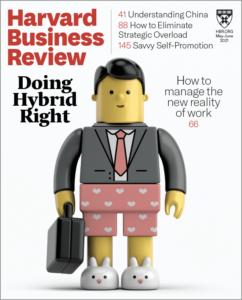
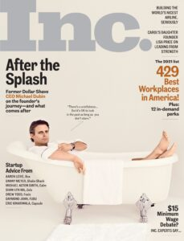
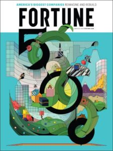
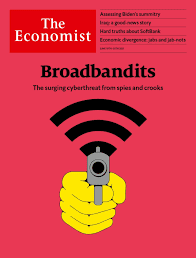

The business landscape is evolving and changing faster than ever. And it’s never been more critical for entrepreneurs to stay at the cutting edge of that evolution. As Wayne Gretsky famously said:

_“Skate to where the puck is going, not where it has been”_

For over a century, business magazines have been helping entrepreneurs stay at the forefront of innovation, through in-depth articles & reports on the current affairs of the business landscape.

And in today’s entrepreneurial landscape, that hasn’t changed.

However, cutting through the noise and finding the magazines that provide true value for entrepreneurs is often easier said than done.

That's why I sat down with our founding team (who have built over 10 startups and helped other entrepreneurs build countless others) as well as some entrepreneurs we work with, to find out which publications help them keep up-to-date with the latest business trends.

I then took their recommendations and built this list: the 10 must-read business magazines for entrepreneurs.

/\* widget: Blog: Expert Tip \*/  /\* reset -------------------- \*/  .blog-custom-block \*,  .blog-custom-block ::before,  .blog-custom-block ::after {  box-sizing: border-box;  border-width: 0;  border-style: solid;  border-color: #e5e7eb;  }  /\* vars -------------------- \*/  .blog-custom-block.blog-custom-block\_\_expert-tip {  --color-bg: #F4FAFE;  --color-border: rgb(15 164 234 / 0.50);  --color-text-1: #0F172A;  --color-text-2: #4A4A68;  }  /\* colors -------------------- \*/  .blog-custom-block.blog-custom-block\_\_expert-tip .bg-clr-bg {  background-color: var(--color-bg);  }  .blog-custom-block.blog-custom-block\_\_expert-tip .border-clr-border {  border-color: var(--color-border);  }  .blog-custom-block.blog-custom-block\_\_expert-tip .text-clr-text-1 {  color: var(--color-text-1);  }  .blog-custom-block.blog-custom-block\_\_expert-tip .text-clr-text-2 {  color: var(--color-text-2);  }  /\* utils -------------------- \*/  .blog-custom-block.blog-custom-block\_\_expert-tip .flex {  display: flex;  }  .blog-custom-block.blog-custom-block\_\_expert-tip .flex-shrink-0 {  flex-shrink: 0;  }  .blog-custom-block.blog-custom-block\_\_expert-tip .flex-col {  flex-direction: column;  }  .blog-custom-block.blog-custom-block\_\_expert-tip .gap-4 {  gap: 1rem;  }  .blog-custom-block.blog-custom-block\_\_expert-tip .gap-5 {  gap: 1.25rem;  }  .blog-custom-block.blog-custom-block\_\_expert-tip .rounded-xl {  border-radius: 0.75rem;  }  .blog-custom-block.blog-custom-block\_\_expert-tip .border {  border-width: 1px;  }  .blog-custom-block.blog-custom-block\_\_expert-tip .p-8 {  padding: 2rem;  }  .blog-custom-block.blog-custom-block\_\_expert-tip .text-3xl {  font-size: 1.875rem;  line-height: 2.25rem;  }  .blog-custom-block.blog-custom-block\_\_expert-tip .text-lg {  font-size: 1.125rem;  line-height: 1.75rem;  }  .blog-custom-block.blog-custom-block\_\_expert-tip .font-bold {  font-weight: 700;  } 

In the interest of full transparency...

Neither myself, Altar.io or the entrepreneurs I spoke to create this list receive any money to recommend the following magazines. They were chosen based on personal experience and the experience of those I spoke to.

#### Contents

## 1\. Entrepreneur Magazine

We can’t talk about business magazines without mentioning [Entrepreneur](https://www.entrepreneur.com/).

It’s become a go-to for many entrepreneurs and business leaders, including the founding team here at Altar.io (In fact, our co-founder Daniel [wrote a piece](https://www.entrepreneur.com/article/307526) for them).

First published in 1997, Entrepreneur focuses on the cutting edge of entrepreneurship.

They regularly feature pioneers such as Elon Musk, Jeff Bezos & Reid Hoffman.

However, they also interview celebrities with an entrepreneurial streak, such as Ryan Reynolds & Maria Sharapova.

This makes this business magazine not just informative, but also entertaining.

### Is this the Right Business Magazine for You?

Entrepreneur is great for anyone looking for easy-to-digest business articles. That being said, this is one of the best magazines for entrepreneurs who’re in the early stages of launching their first business or startup.

#### Subscriptions & Pricing

Subscriptions to Entrepreneur magazine start at **$9.99 per year** for the print or digital edition. Entrepreneur also regularly offers deals such as **$10.99 per year** for both the print & digital editions.

Aside from the magazine itself, Entrepreneur also has an extensive library of online resources which are available for free.

## 2\. Harvard Business Review

[Harvard Business Review](http://hbr.org/) is one of the most trusted business magazines for many entrepreneurs.

They cover a wide range of topics across several facets of entrepreneurship– from leadership and operations to marketing and business strategy.

HBR also has an online library of resources and academic articles to help entrepreneurs increase their chances of success. That being said, many of these are placed behind a paywall.

#### Is this the Right Business Magazine for You?

HBR is one of the best business magazines for entrepreneurs looking to improve their leadership skills and management practices. It is also one of the best resources for the latest business-related academic research.

#### Subscriptions & Pricing

Subscriptions to HBR Start at **$8.25 per month for the digital edition**. The **Digital & Print subscription starts at $10 per month**.

Related: [9 Crucial Lessons I Learned from Interviewing Successful Entrepreneurs](https://altar.io/crucial-lessons-learned-interviewing-successful-entrepreneurs/)

## 3\. Forbes

[Forbes](https://www.forbes.com/) is one of the most famous magazines for entrepreneurs out there, and for good reason.

The focus here is on wealth and money – specifically how billionaires get to where they are through business.

They often include easy-to-digest lists (like [The World’s Billionaires List](https://www.forbes.com/billionaires/)) as well as in-depth analyses into successful entrepreneurs.

#### Is this the Right Business Magazine for You?

This business magazine is great for any entrepreneur looking to learn more about how to make, save and invest money.

It’s also great to get inspired and generate ideas from the stories of some of the worlds top entrepreneurs.

#### Subscriptions & Pricing

Forbes pricing starts at **$6.99 billed monthly**. They also offer a subscription at **$49.99 billed annually** or **$139.99 billed every two years**.

Forbes also provides a back catalogue of useful resources and articles – many of which can be accessed free of charge.

##### Do you have a brilliant idea that you want to bring to life?

From the product and business reasoning to streamlining your MVP to the most important features, our team of product experts and ex-startup founders can help you bring your vision to life.

Let's Talk

## 4\. Inc.

Since 1979, [Inc.](https://www.inc.com/) has been the industry leader in reporting on small companies and startups.

It’s one of the most comprehensive business magazines for entrepreneurs, providing in-depth special reports, startup case studies, guides on every facet of entrepreneurship and much more.

Alongside this, they have the famous “Inc. 500” & “Inc. 5000” lists of the fastest-growing companies in the US. These are great resources that enable you to keep your ear to the ground on trends within the startup ecosystem.

#### Is this the Right Business Magazine for You?

Inc. is a fantastic business magazine for entrepreneurs who run, or are looking to launch, a small business or startup.

#### Subscriptions & Pricing

Inc. offers an **annual digital subscription for $19.99.** New users can also access a **$1 trial for a month** which automatically renews at **$1.99 per month**.

Inc. also offers extensive online resources that can be read free of charge.

Related: [The Best Books for Entrepreneurs Starting a Business](https://altar.io/the-12-best-books-for-entrepreneurs-starting-a-business-in-2021/)

## 5\. Wired

[Wired](https://www.wired.com/) is one of the younger business magazines for entrepreneurs on this list. Founded in 1993, Wired publishes monthly issues and focuses on business, tech, science, lifestyle and culture.

While informative, Wired is one of the more “easy-reading” magazines on the list. They offer a balanced range of entertaining and informative content.

They also attract the “big guns” with cover stars such as Jimmy Fallon, Steve Jobs & Brad Pitt – to name but three.

#### Is this the Right Business Magazine for You?

Wired is one of the more popular magazines for entrepreneurs who focus on technology.

It’s also a great read if you are looking for light, easy-to-digest content.

#### Subscriptions & Pricing

Wired offers **the first year for $5** which automatically renews for **$29.99 a year** thereafter.

Wired also offers articles for free via its website.

## 6\. Fast Company

[Fast Company](https://www.fastcompany.com/) is another, relatively new, business magazine for entrepreneurs.

First published in 1995, Fast Company puts its editorial focus on innovation in technology, leadership and design.

It offers eight issues a year, written by progressive business leaders with the goal of helping shape entrepreneurs of the future.

#### Is this the Right Business Magazine for You?

This is a must-read business magazine for entrepreneurs looking to stay up to date with advances in both technology and the business world.

#### Subscriptions & Pricing

Fast Company offers digital issues for **$1.99 a month**. Alternatively, you can opt for $19.99 **billed annually**.

The Fast Company provides a number of resources and articles for free, outside of the magazine issues.

## 7\. Bloomberg Business Week

[Bloomberg Business Week](https://www.bloomberg.com/businessweek) is one of the only business magazines for entrepreneurs that publishes on a weekly basis.

They focus on keeping you up to date and “ahead of the competition” sharing the latest in business and entrepreneurial news from around the world.

#### Is this the Right Business Magazine for You?

This business magazine for any entrepreneur who wants to keep up with the current affairs of the business and technology world.

#### Subscriptions & Pricing

Annual digital subscriptions of Bloomberg Business Week start at **$415 a year**, which includes access to all content across the Bloomberg umbrella.

Alternatively, you can subscribe for the print issues only, at **$99 for one year** (50 issues)

Bloomberg Business Week provides one article a month for free on its website.

## 8\. Fortune

[Fortune](https://fortune.com/) competes directly with the likes of Forbes and Bloomberg Business Week.

As the name suggests they focus on investment and stories from the wealthiest entrepreneurs in the world, including the infamous “Fortune 500” list.

They publish once a month and pride themselves on writing more “in-depth” articles on wealth and business compared to their competition.

#### Is this the Right Business Magazine for You?

Fortune is a great business magazine for entrepreneurs who want in-depth articles on investment, business and profiles of industry leaders.

#### Subscriptions & Pricing

Fortune provides a **digital subscription for $72 a year**. They also offer a **premium subscription for $108 a year** that provides quarterly investment guides and more.

Related: [The Best Business Podcasts for Entrepreneurs](https://altar.io/best-business-podcasts-for-entrepreneurs/)

## 9\. The Economist

Renowned as one of the forefront business magazines for entrepreneurs, [The Economist](https://www.economist.com/) provides insights into the global state of business.

The Economist has provided weekly issues since 1843. Each issue is filled with articles on world news, politics, economics, business and finance.

#### Is this the Right Business Magazine for You?

The Economist is the perfect business magazine for entrepreneurs looking for a holistic view of world news, and global business news in one publication.

#### Subscriptions & Pricing

Digital subscriptions to The Economist starts at **$189 a year for digital subscriptions**. Alternatively, they offer **print & digital subscriptions for $29 a year**.

The Economist allows you to read up to five articles per month for free.

## 10\. Adweek

As is suggested in the title, [Adweek](https://www.adweek.com/) is a magazine that focuses on the marketing ecosystem.

First published in 1979, they provide weekly actionable insights on tech, creativity, client-agency relationships, global advertising, brand & performance marketing and more.

#### Is this the Right Business Magazine for You?

Adweek is a great business magazine for entrepreneurs who want to stay up-to-date on news from the marketing and advertising industry.

#### Subscriptions & Pricing

Adweek offers subscriptions for **$19.99 a month**.

Once you’ve signed up for free, Adweek allows you to read three digital articles a month for free.

## 11\. Creative Review

[Creative Review](https://www.creativereview.co.uk/) is a magazine that highlights the leading trends and figures in marketing, advertising design, photography, branding and all things to do with commercial creativity.

First published in the UK in 1981, they shine a light on industry trends critical analyses of advertising and branding campaigns and insights from entrepreneurial creative leaders.

The magazine is published bimonthly both in print and online. Moreover, series one of their podcast, [Creativity Sucks](https://www.creativereview.co.uk/creativity-sucks/), was recently released.

#### Subscriptions & Pricing

You can subscribe to the digital version of Creative Review for **$246** a year – with digital and print subscriptions starting at **$345**.

## 12\. Success

[Success Magazine](https://www.success.com/) has been focusing on the people behind successful companies since 1897.

They publish real-life stories and interviews with world-class leaders in the business world with the goal of providing personal and professional development to budding entrepreneurs.

Success Magazine publishes 6 issues a year (once every two months).

#### Subscriptions & Pricing

You can subscribe to the **digital edition for $19.99 a year**. With **pring & digital starting from $29.99 a year**. \[/vc_column_text\]

## Wrapping Up

Whether it’s from [books](https://altar.io/the-12-best-books-for-entrepreneurs-starting-a-business-in-2021/), [podcasts](https://altar.io/best-business-podcasts-for-entrepreneurs/), or magazines, learning from entrepreneurs who’ve faced the challenges you’re about to face can be invaluable for your startup.

It’s something many successful entrepreneurs do, something our CMO Rui learnt first-hand recently.

Just over a year ago, he set out to interview successful entrepreneurs with the goal of building valuable resources for our community of entrepreneurs.

He realised that many successful entrepreneurs [shared similar lessons](https://altar.io/crucial-lessons-learned-interviewing-successful-entrepreneurs/), one of which was the importance of learning from those around you.
