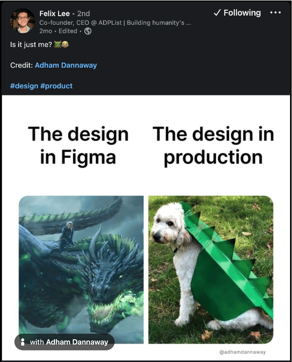
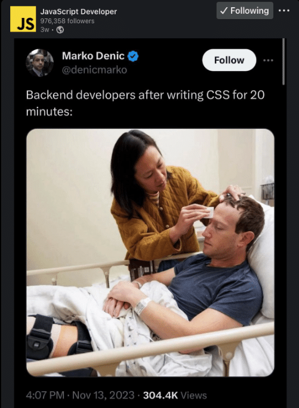

It’s easy for things to get lost in translation. We learn this as kids when we play the telephone game – where a sentence is whispered from one person to another. In the course of the game, either because we misheard something or felt like we could make it more concise and still get the same message across, the original idea turns into something else entirely.

This is just as true in Product Development: you need to [look no further than LinkedIn](https://www.linkedin.com/posts/felixleezd_design-product-activity-7118604042653614080-g9Rx) to find countless posts where designers wonder how the creations they put so much thought and consideration into come to life in a… severely mutated form.

/\*! elementor - v3.19.0 - 05-02-2024 \*/  .elementor-widget-image{text-align:center}.elementor-widget-image a{display:inline-block}.elementor-widget-image a img\[src$=".svg"\]{width:48px}.elementor-widget-image img{vertical-align:middle;display:inline-block}

Even if the product will inevitably evolve due to the [iterative nature of digital product design](https://www.interaction-design.org/literature/article/design-iteration-brings-powerful-results-so-do-it-again-designer), its success will always hinge upon well-designed - and well-implemented - features.

Still, this is just one of the situations that has led to the age-old clash between designers and developers. While both are vital for creating a digital product, they often think and communicate very differently.

Some tools look to minimise the misalignment between UX and Development teams ([Figma](https://www.figma.com/) and [Zeplin](https://zeplin.io/), to name a few) – but they can only go so far.

A new role has arisen as a natural response to this necessity. At Altar we call it the Front-End Styling Developer, though the titles can range from Creative Front-End Developer to UI Developer.

Being one of the first Altarions on the Styling team, I’ve been privileged to learn from the best of the best.

Not only do I get to work directly with our VP of Front-End, but I also have the opportunity to develop my knowledge with all the departments that form Altar’s ecosystem – a team that’s helped successfully bring over 80 products to life.

Before moving into Styling, I worked as both a Web Designer and Front-End Developer on dozens of digital products. However, I felt the need to gain a greater understanding of UX/UI Design to better articulate and defend the product decisions that will make or break the final result, preserving them through the development process.

In fact, each member of the Styling team has a background in both Development and Design, uniquely qualifying us to understand the user experience implications of each visual element and what is necessary for a well-crafted technical execution.

In this article, I will start by delving into what Styling is. Then, I’ll explain why bringing Styling developers into your product development process can pay off in the long run – and lead to a standout product that will set your startup up for a better chance of success.

/\*! elementor-pro - v3.19.0 - 05-02-2024 \*/  .elementor-widget-table-of-contents .elementor-toc\_\_header-title{color:var(--header-color)}.elementor-widget-table-of-contents.elementor-toc--collapsed .elementor-toc\_\_toggle-button--collapse,.elementor-widget-table-of-contents:not(.elementor-toc--collapsed) .elementor-toc\_\_toggle-button--expand{display:none}.elementor-widget-table-of-contents .elementor-widget-container{min-height:var(--box-min-height);

#### Contents

## What is Styling?

The last thing you want is to invest time and money in a design, go through multiple rounds of iterations to achieve the look and feel you want and that will make your users happy, and then pay for an implementation that turns out to look nothing like it.

Styling is what ensures that doesn’t happen, and ensures you get an interface that looks exactly the way you asked for.

In practical terms, Styling involves setting up the layout structure, creating all the components, and guaranteeing everything looks and (visually) behaves as intended.

When performed by someone who doesn’t specialise in Styling, this can often be the stage of development where the UX and Product decisions start being compromised.

## What does a Front-End Styling Developer do?

Front-End Styling Developers specialise in templating and implementing the mythical pixel-perfect design. All to bridge the gap between the Product vision and an accurate final result.

Like other developers, we’ll adapt to the tech stack which is best suited for the specific project. We are, however, most associated with HTML and CSS. Despite often being the least appreciated languages involved in creating a website or app, they are the pillars of much of the development process.

Typically, we’ll create the layout with all its visual components, formatting them and adding the logic necessary for every single element to look exactly as intended.

We then pass the code on to the Front-End Developer, who will implement the remaining functional logic.

Having someone on your project who can understand the intent behind product and user experience decisions as well as the technical execution means they can accurately implement the designs, with far-reaching repercussions.

/\*! elementor - v3.19.0 - 05-02-2024 \*/  .elementor-heading-title{padding:0;margin:0;line-height:1}.elementor-widget-heading .elementor-heading-title\[class\*=elementor-size-\]>a{color:inherit;font-size:inherit;line-height:inherit}.elementor-widget-heading .elementor-heading-title.elementor-size-small{font-size:15px}.elementor-widget-heading .elementor-heading-title.elementor-size-medium{font-size:19px}.elementor-widget-heading .elementor-heading-title.elementor-size-large{font-size:29px}.elementor-widget-heading .elementor-heading-title.elementor-size-xl{font-size:39px}.elementor-widget-heading .elementor-heading-title.elementor-size-xxl{font-size:59px}

##### Do you have a brilliant idea that you want to bring to life?

/\*! elementor - v3.19.0 - 05-02-2024 \*/  .elementor-widget-text-editor.elementor-drop-cap-view-stacked .elementor-drop-cap{background-color:#69727d;color:#fff}.elementor-widget-text-editor.elementor-drop-cap-view-framed .elementor-drop-cap{color:#69727d;border:3px solid;background-color:transparent}.elementor-widget-text-editor:not(.elementor-drop-cap-view-default) .elementor-drop-cap{margin-top:8px}.elementor-widget-text-editor:not(.elementor-drop-cap-view-default) .elementor-drop-cap-letter{width:1em;height:1em}.elementor-widget-text-editor .elementor-drop-cap{float:left;text-align:center;line-height:1;font-size:50px}.elementor-widget-text-editor .elementor-drop-cap-letter{display:inline-block}

From the product and business reasoning to streamlining your MVP to the most important features, our team of product experts and ex-startup founders can help you bring your vision to life.

Let's Talk

## Why Bringing a Styling Developer onto Your Project Pays off in Spades

### Product Quality

If the design delivery is usually a game of telephone between Designers and Developers, then the Front-End Styling Developer is the person who will make sure the message gets from one end to the other exactly as intended.

The truth is that when you don’t understand why a decision was made, you’re less likely to keep the original vision intact.

*“It’s just a visual difference and doing something else instead will cut down development time”* is something every developer has said at some point, but it comes at a cost.

When we see an element as simple as a button, we know there’s a reason why it’s been designed that way. The UX department has considered everything from the best colour to direct attention to it, to the most appropriate size to ensure there’s enough of a clickable area.

To take this even further, UX designers can use [Design Systems](https://www.nngroup.com/articles/design-systems-101/) that, when referenced properly, can help developers create all the necessary components much faster and in a much more reliable manner, boosting scalability.

Styling developers understand the rationale behind these resources and can use them to facilitate the creation of all the components that make up a digital product.

However, we are aware of the technical side of things as well, which makes it possible for us to find the most viable approach to reach the desired visual result without compromising the technical requirements. In other words, we can ensure it’s coded in a way that safeguards its intended functionality.

Knowing how to develop future-proof components is equally invaluable. We understand that writing a few more lines of code to incorporate [defensive CSS](https://defensivecss.dev/articles/intro-defensive-css/) and prevent the future addition or removal of components from breaking the interface is worth the trade-off. We plan for the edge cases that are most likely to occur, and we prepare your product for them.

There are other considerations to ensure that the code can be easily maintained, such as the use of [CSS variables](https://developer.mozilla.org/en-US/docs/Web/CSS/Using_CSS_custom_properties). By allowing changes to be made in a single source of truth, code maintenance is made easier.

As an example, if a shade on the colour palette is modified to better suit your brand, you won’t have to change it in every affected element. You can alter it through a single line of code, massively reducing the implementation effort.

This kind of dynamic thinking is one of the things that led us to create our component library (something you might read about in upcoming articles).

It’s also something that sets the MVPs developed at Altar apart from the rest - your product will already be prepared to be more easily expanded and refined so that you can hit the ground running as soon as you’re funded.

### Talent Retention

There are also advantages for those building a Software Development team of their own.

Other Developers [don’t always have an interest in templating and styling](https://www.linkedin.com/posts/javascript-developer_activity-7130521073313288192-ZEtO) (queue the countless frustrated sighs when an element has to be centred in a container).

So having a dedicated Styling team helps ensure everyone in the tech department is happy and focusing on what they enjoy doing the most.

An added benefit is that they won’t need to make as many mindset shifts throughout their day. If someone is working on [API Integrations](https://tray.io/blog/what-is-an-api-integration-for-non-technical-people), the perspective adjustment required to move into templating and styling tasks, or vice-versa, is significant enough to [reduce productivity](https://ics.uci.edu/~gmark/chi08-mark.pdf).

If these efforts are split up, it will allow everyone to be more effective, resulting in optimised development flows.

Your UX department will also thank you - it can be disheartening to work for hours on perfecting an interface, making thoughtful decisions to best serve the users and meet OKRs, only to see your hard work get lost during development.

When I started writing this article, I spent a while considering how we impact this. Still, the truth is that there’s no one better to explain it than one of our own Senior UX Designers, Ewa, who graciously put her thoughts into words on how she feels Styling devs make a difference to the work we produce as a team:

"A dedicated styling developer is an expert in front-end languages and deeply understands front-end implementation." She told me.

"This expertise allows them to ensure a refined and uniform appearance throughout a project. They stay on top of the latest trends, features, and peculiarities in front-end frameworks and browsers.

Their keen sense for design, aesthetics, and usability aids in effective collaboration with the UX/UI team, even challenging them when necessary.

For designers, a styling developer acts as a valuable second opinion. They possess the technical knowledge to ask critical questions regarding design feasibility, performance, and practicality, such as mobile and 4K compatibility, data display issues, consistency in design elements, and adherence to the design system.

This role significantly contributes to creating user-friendly and cohesive interfaces."

### Making the Most out of Your Time & Money

The UX designers are the ones who will conceptualise and refine the user experience, and the byproducts of their work will translate into higher customer conversion and retention. Some [research has even shown](https://www.uxmatters.com/mt/archives/2021/08/balancing-ux-design-and-conversion-rate-optimization.php#:~:text=Jacob%20Nielsen%E2%80%99s%20research%20indicates%20that%2C,has%20built%20its%20incredible) that just a 10% investment in UX can result in an 83% lift in conversion.

The thing is, your users won’t interact with the Figma files where the designs live. They will interact with your actual product. And the ones responsible for making this user experience tangible are the developers.

Great UX costs money, yet it will be money down the drain if the people bringing the product to life can’t uphold it throughout the development process.

This makes it vital for every line of code to be written with the utmost respect for the product strategy and all the design decisions that shape it.

Styling developers make this their craft and become the main line of defence against losing valuable Product and UX inputs during the development flow.

**Make no mistake: you can only have a UX success story if your developers understand how to reproduce the design as close to pixel-perfect as possible.**

Related: [4 Steps to Ensure Your Startup’s UX/UI Design Delights Your Users](https://altar.io/ensure-startup-ux-ui-design-delights-your-users/)

### Save Money in the Long Run

For all the reasons I’ve mentioned up to this point, kicking off the development stage of a project with Styling results in fewer development hours, since it will contribute to reducing the need to make massive changes to the code or, even worse, scrapping code.

As Ewa mentioned, it can also help improve the UX experience beyond what was initially considered.

When the UX and Tech departments can communicate more effectively from an early stage, both sides will have a greater grasp of what is necessary for the product and what is technically feasible, and the final result will only benefit from it.

You will know, straight off the bat, what features aren’t *quite* as viable as they appear in the design so that adaptations can be made before more significant implementation efforts are made.

On the other hand, the components will be coded with a greater sensibility for what the product must look and behave like to be successful.

/\*! elementor-pro - v3.19.0 - 05-02-2024 \*/  .elementor-button.elementor-hidden,.elementor-hidden{display:none}.e-form\_\_step{width:100%}.e-form\_\_step:not(.elementor-hidden){display:flex;flex-wrap:wrap}.e-form\_\_buttons{flex-wrap:wrap}.e-form\_\_buttons,.e-form\_\_buttons\_\_wrapper{display:flex}.e-form\_\_indicators{display:flex;justify-content:space-between;align-items:center;flex-wrap:nowrap;font-size:13px;margin-bottom:var(--e-form-steps-indicators-spacing)}.e-form\_\_indicators\_\_indicator{display:flex;flex-direction:column;align-items:center;justify-content:center;flex-basis:0;padding:0 var(--e-form-steps-divider-gap)}.e-form\_\_indicators\_\_indicator\_\_progress{width:100%;position:relative;background-color:var(--e-form-steps-indicator-progress-background-color);border-radius:var(--e-form-steps-indicator-progress-border-radius);overflow:hidden}.e-form

## Wrapping Up

The role of Styling in product development is not just about aesthetics; it's about bringing a product's vision to life with precision and care.

In my journey at Altar.io, I've seen firsthand how bringing Front-End Styling Developers on board bridges the (often wide) gap between design and development, ensuring that the final product not only looks as intended but also functions optimally.

The unique position held by Styling Developers, with their dual expertise in design and development, is pivotal in maintaining the integrity of a product's design throughout the development process.

This approach leads to a higher quality final product. It's a testament to the fact that great products are born out of a harmonious blend of art and science, design and technology.

Moreover, the strategic investment in Styling not only enhances the product itself but also streamlines the development process, leading to cost efficiency and better resource management.

It's a win-win scenario: first, the product aligns more closely with the user's needs and the company's vision. Second, the time and resources needed for revisions and troubleshooting are reduced.

Thanks for reading.
