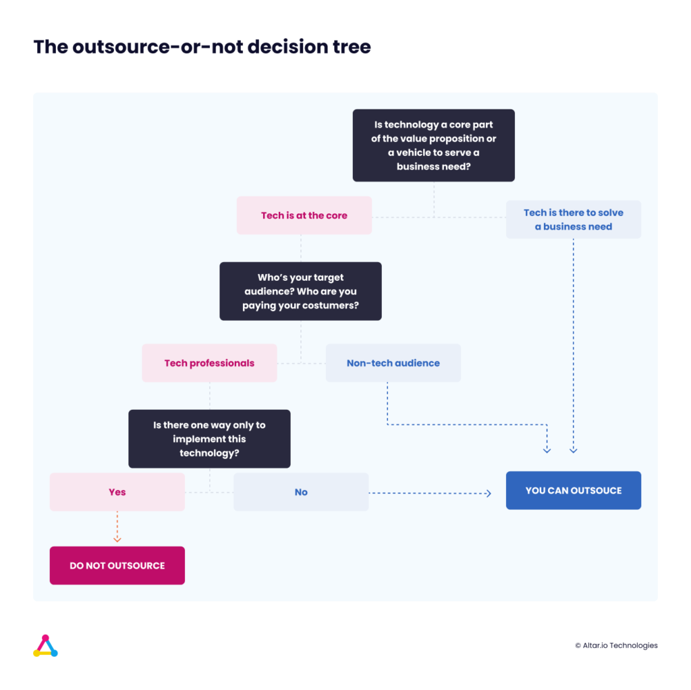

It’s a decision that can make or break a startup: Do you invest in in-house resources to create your product or do you outsource software development to a third-party company?

On the one hand, as a startup, shouldn’t product development be a core competency? On the other, surely it’s better to [go to market as quickly as possible](https://altar.io/blog/why-your-startup-should-take-4-6-weeks-to-launch-not-4-6-months/). So shouldn’t you allow the “experts” to help you get there and avoid all the pitfalls of technology development?

Both approaches have their pros and cons and the decision is by no means straightforward. The answer depends on many business and cultural factors and the type of product you are looking to build.

Nevertheless, whether or not to outsource software development is a decision that needs to be taken early on in a startup’s life. The choice can often leave founders in a quandary as to the best approach.

At Altar.io we’ve worked with several [early-stage businesses](https://altar.io/work/),  as well as provided product innovation for larger corporates. We’ve learned many lessons on how to tackle such a momentous decision.

So if you’re deciding between outsourcing to a software development company or building your tech team in-house: here’s the structured reasoning to help you avoid mistakes.

Related: [3 Steps to Build a Successful Minimum Viable Product (MVP)](https://altar.io/features-inside-mvp-3-steps-know-answer/)

#### Contents

## The Outsource-or-Not Decision Tree

The answer to whether or not to outsource software development requires you to break that complex question down into simpler steps.

### Step #1: Is Technology Part of the Core Value Proposition of Your Product? Or is it a Vehicle to Solve a Business Need?

For most startups there are two possible answers to this, either:

1. Technology is the core proposition;
2. Technology is the means being used to solve a business issue.

In general, if your business comes under **scenario one** then you are more likely to develop the solution in-house. If it’s **scenario two** then it’s more than viable to outsource your startup’s software development.

For example, consider [Loopback](https://loopback.io/), a Node.js framework that enables developers to create dynamic end-to-end REST APIs with little or no coding. Here, technology is pretty much the only proposition so Loopback would come under **scenario one**.

Contrast this with [Airbnb](https://www.airbnb.com/), which enables property owners to monetize their homes and enable travellers to have a unique experience in the city they are visiting. The key value proposition of AirBnB is for property owners and travellers, meaning the business comes under **scenario two**.

Generally, businesses that come under scenario two and are using technology merely as a way to solve a business issue should consider outsourcing. We’ll get to the reasons why a little later.

For now, let’s move on to step two.

Related: [What The Non-Technical Entrepreneur Needs To Know About Tech](https://altar.io/what-the-non-technical-entrepreneur-needs-to-know-about-tech/)

### Step #2: Does your Product Have a Technical “Secret Sauce” That Makes it Unique?

By this, we mean either the technology itself is proprietary to your startup, or the way it’s being implemented is unique.

The best example of this is GitHub. Yes, the target market for GitHub is developers. However, the underlying technology nor its implementation is unique or proprietary – there is no secret sauce.

In theory, this means that outsourcing the development of GitHub would be completely viable.

To sum up, it’s generally inadvisable to outsource software development when:

- The business has technology as its core proposition and/or
- The technology is either proprietary or unique in its implementation

In any other scenario, a software project can either be built in-house or outsourced (or possibly a combination of the two). This is dependent on your willingness and other circumstances that might affect your business case.

To help give some more context, I wanted to share some case studies from successful companies, to help you understand the kinds of businesses that are suited to the outsourcing model.

##### Do you have a brilliant idea that you want to bring to life?

From the product and business reasoning to streamlining your MVP to the most important features, our team of product experts and ex-startup founders can help you bring your vision to life.

Let's Talk

## Case Studies from Successful Companies That Outsourced Software Development

#### Alibaba

Let’s start with [Alibaba](https://www.alibaba.com/?src=sem_ggl&cmpgn=678190955&adgrp=34276573373&fditm=&tgt=kwd-14739453&locintrst=&locphyscl=1011742&mtchtyp=e&ntwrk=g&device=c&dvcmdl=&creative=148007444336&plcmnt=&plcmntcat=&p1=&p2=&aceid=&position=1t1&gclid=Cj0KCQiAjfvwBRCkARIsAIqSWlPOj9m0ZF5ZFttotEgua9p5sAfQFa68YqEJtz9Zswjm0-WPNtaaiHwaAuZLEALw_wcB). The now multibillion-dollar company outsourced software development to a firm in the US.

In Liu Shiying and Martha Avery’s words:

“At the time, overseas development talent was still in short supply. The US had the skills Alibaba needed to compete with e-commerce giants like eBay and did it all behind the Chinese internet restrictions.”

The Alibaba case shows startups come in all shapes and sizes. Not all are co-founded in a garage with the right tech person in charge from day one.

#### Upwork

[Upwork](https://www.upwork.com/) is another company that was built using mostly outsourced staff. 75% of their product and development team were freelancers.

Meaning that Upwork benefited from hiring the best talent from the world. And, as they were using an early version of their platform to actually source their team, they also proved the relevance of their product.

This sort of self-fulfilling advertising is as cheap as it is genius.

#### Skype

[Skype](https://www.skype.com/en/) outsourced its platform construction to an Estonian trio of developers. Founders [Niklas Zennstrom](https://twitter.com/nzennstrom) and Janus Friis proved back in 2003 that international freelance collaboration was no doomed venture, which many thought at the time.

#### WhatsApp

[WhatsApp](https://www.whatsapp.com/) launched with just $250,000 in starting capital. Therefore, their priority was to keep operational costs at a minimum.

To develop from their HQ in Mountain View, California, would have been impossible. So they looked to Russia, where co-founder Jan Koum found some of the world’s best offshore developers to conduct their services.

Chief among them was [Igor Solomennikov](https://www.linkedin.com/in/igorsolomennikov/), famous as WhatsApp’s first iOS developer. He started as a contractor and later joined the team in California on a full-time basis.

All of this to say, don’t worry about looking further afield for outsourced talent. Just make sure you align fully in terms of cultural fit ([more on that here](https://altar.io/founders-guide-how-to-outsource-software-development-2020/)).

#### Wise (Formerly TransferWise)

[Wise](https://transferwise.com/pt) states that they don’t “offshore, outsource or use consultants”.

But they admit to several “independent workers” who, if you dig a little deeper, are developers and technicians emanating mainly from Ukraine.

It is interesting to see that some startups that outsource software development prefer to present an in-house “vibe” to their customers.

Probably, in part, thanks to the first company in the next section, Y Combinator.

## The Anti-Outsourcing Argument

While perceptions have changed in recent years around the idea of outsourcing, some retain their arguments *against* outsourcing.

This is a very traditionalist view from the days when outsourcing was a dirty word synonymous with low-quality code and misaligned goals.

However, that doesn’t mean that they’re wrong. To contextualise my point, let’s start by looking at Y Combinator

### Y Combinator

[YCombinator](https://www.ycombinator.com/) is at the top of the list of institutions that are hardline against outsourcing.

Michael Seibel, partner @YC, puts it bluntly:

Reading YC applications, I’m seeing too many founders who have raised some seed capital and who outsource engineering to cut costs. This is a common error that is a huge red flag for future investors and is often much more expensive in the long term than having a technical co-founder.

Investors with experience in the tech industry will also know that there is a global developer shortage. As such, finding a technical co-founder can be a long and arduous process – something that many early-stage startups with a limited runway don’t have time to complete.

Take Audapio’s founder, [Dudley Gould as an example](https://altar.io/building-a-startup-without-a-technical-co-founder/). He spent months trying to find a tech co-founder and still came up empty-handed. So he built his MVP with a software development company. His product went on to be quickly acquired and he exited successfully.

All of this to say, you should always look to bring your tech team in-house at some point in your startup journey. But if you need to ship an MVP quickly to prove your value proposition – there’s no reason not to, as long as you choose the [right people for the job](https://altar.io/founders-guide-how-to-outsource-software-development-2020/).

Michael’s second point, that outsourcing can lead to higher costs in the long-term, is also not entirely false. Choosing the wrong agency can result in higher costs and a longer time to market.

But this can happen with any technical stakeholder you choose. In my experience, it’s not the **model** that matters, but rather the **person/people** you choose to [work with](https://www.linkedin.com/feed/update/urn:li:activity:6932432741711888384/).

Related: [3 Founders Share What You Can Expect From a Startup Accelerator (Y Combinator & 500 Startups Alumni)](https://altar.io/founders-share-what-you-can-expect-from-a-startup-accelerator/)

### Joel Gascoigne CEO and Founder of Buffer

Joel Gascoigne, [Buffer](https://buffer.com/) CEO and founder, seems to agree with the YC school of thought. He proposes [3 clear points](https://joel.is/3-reasons-you-shouldnt-outsource-your-startup-and-what-to-do-instead/) to support the thesis that tech startups should not outsource software development. These points summarise most of the criticism I’ve heard during my many years attending events and talking with founders.

1. Your goals and an agency’s are completely misaligned
2. It gets you into the wrong mindset of what it takes to get a product off the ground
3. The founding team should wear every hat

While I agree with some of what Joel is saying here, I would say that it is also a broad generalisation – so I would like to address each point, starting with misalignment.

#### 1\. Your Goals and a Freelancer’s Are Completely Misaligned

Yes, the goal of any business is to make money. There is a danger when outsourcing that the freelancer or agency you’re working with will prioritise making money over what's best for your startup.

I would argue once again, however, that this comes down to the people rather than the model.

The best way to combat this risk, should you choose to outsource, is to find a freelancer or agency that is passionate about your project. Do they challenge your vision to make it better? Are they excited by what you’re trying to achieve? Etc.

Also, in an ideal scenario, the right people for you, in whatever form they come, will know their success is bound to yours. They will have the same short, mid, and long-term goals: to see your project succeed and raise millions.

#### 2\. It Gets you into the Wrong Mindset of What it Takes to Get a Product Off the Ground

Joel’s point here is that you should be focusing on product-market fit as opposed to focusing on finding a technical stakeholder to bring your product to life as soon as possible.

He argues that you can validate your product idea by using no-code platforms like [Wufoo](https://www.wufoo.com/), [Google Forms](https://www.google.com/forms/about/), [WordPress](https://wordpress.com/) landing pages, etc.

More than that, he argues that in doing so, a developer or tech co-founder will be far more interested in your idea than if you approach him with an idea on a napkin.

I can’t argue with Joel’s point that you should be validating your product idea as soon as possible.

And certainly, if your product's technical needs aren’t complex it can work.

What I will say is that you need to be aware that you’re forfeiting flexibility with this option. And usually, that leads to scalability issues. In a future iteration, you may find yourself in a position where you can’t add certain functionality. Rewriting it from scratch may not be the end of the world, but I can’t imagine a scenario where that’s a good thing.

Also important to note: when it comes to validating your product with google forms and other Q & A based tools – be aware that you’ll only be validating **customer interest**, not **customer action**.

Take successful entrepreneur [Yaron Samid as an example](https://altar.io/from-being-fired-to-building-a-multi-million-dollar-fintech-startup/). He set out to build a free platform that would check your credit card bills and notify you if there was fraudulent activity on your account.

He went out to validate his idea and almost 100% of people told him “yes I would love a product like that.”

So he put a tech team together and built the full product. But when it launched, nobody stopped to sign up and use it. **They didn’t take action**.

In the end, Yaron had to pivot his product (more than once). This extended his time to market, cost him money and meant he had to change personnel to make the pivot work.

Had Yaron instead built a simple MVP and released it to validate his assumptions, he could’ve saved himself a lot of time and money.

My point here is that while Joel has a point, be careful “validating” your idea this way. You risk garnering a lot of interest only to find that no one actually wants to take action.

#### 3\. The Founding Team Should Wear Every Hat

A common phrase in the startup world, I’m sure the “wear every hat” theory is not foreign to you.

And it’s true, you will be wearing many hats as you launch your startup. As Joel puts it himself:

> In the early days \[of Buffer\], between the two of us, Leo and I did development, design, database and sysadmin work, customer support, marketing, and more. I even built the first version of the Android app before we invited Sunil to the team to take it over.

And that’s great. If, like Joel, you’ve been coding since you were 12 there is no reason for you *not* to build your MVP or POC yourself.

But, if you’re a non-technical with a strong business mind there is no point in you wasting your time focusing on the technical execution of your startup.

Your time is much better spent on reaching out to advisors, mentors, investors and potential customers to grow your business.

Instead, you should find a technical stakeholder to help you cycle through the [build-measure-learn loop](http://theleanstartup.com/principles) and iterate towards product/market fit.

And, once again, I would argue that it comes down to model vs. people. There are great agencies out there that can help you with this, just as there are great CTOs or freelance developers.

Equally true is the fact that there are terrible agencies, freelancers and CTOs out there. It comes down to ensuring you have the right due diligence process to choose correctly

Related: [How to Find a CTO for Your Startup: The Founder's Guide](https://altar.io/how-to-find-a-cto-for-your-startup-the-founders-guide/)

## Still Not Sure Whether to Outsource or Not? Here are The Benefits and Risks

### Benefits of Outsourcing Software Development

#### Timing

You have access to technical resources from the very outset. You’ll need to go through a procurement phase, but that time will be way less than what is required of any stronger commitment (i.e. onboarding the right CTO or identifying your key first employees).

Also, you may not be able to confidently attract top talent with just an idea on a napkin. This could result in you onboarding subpar talent.

Successful CTO and startup tech advisor [Nelly Yusupova](https://www.linkedin.com/in/digitalwoman/) attests to this idea. [She advises](https://altar.io/what-founders-should-know-before-hiring-a-cto-or-software-agency-expert-interview/) early-stage startups to build an MVP with an agency to help attract a CTO:

Attracting a CTO is about traction. Showing technical stakeholders that this isn’t just an idea. It’s a painkiller and people want it. Look what I’ve already done without you, imagine what we could achieve together. From a CTO or technical perspective, that’s how you get someone’s attention.

#### Focus

As a founder, your goal is to validate your idea as soon as possible. The reasons for this are to gather investors and the interest of top talent. The earlier you can begin to do this, the better.

You don’t want to waste time onboarding and managing developers (which is in itself very hard!).

Instead, you want to concentrate on your business/sales/marketing duties to build the foundation of your business's viability *before* committing to expensive developer salaries.

#### Expertise & Experience

A quality established agency will have helped build hundreds of startups across multiple industries.

For you, this means they will have probably built a similar product to the one you’re bringing to life. They’ll have tips and tricks on how to shortcut (or outright avoid) many of the common hurdles early-stage startups face.

Moreover, they’ll have the experience to [challenge your vision](https://altar.io/saying-no-to-a-lead-is-hard-but-brings-value-to-the-lead/) to help you make your product stronger in the long run

### Risks of Outsourcing Software Development

#### Misalignment

As with any business, an agency’s goal is to make money. Your goal is to minimize the product expense as much as you can to then iterate on top of it.

Therefore, there is a risk that they will push you to add features unnecessarily to make you spend more money.

But, if they do, they’re not the right agency. The majority of software development companies will never do this. They will only suggest adding features if they think it’s truly beneficial to you.

Again, it comes down to due diligence on your part to find the right agency for the job.

#### Dependency

Some agencies may not follow the industry standards for project organization and documentation.

If this is the case their code will be very difficult to follow by any other developers that join the team.

If you outsource software development be sure the one you’re outsourcing to follows every relevant standard. Such as TDD (Test Driven Development) or CI/CD (Continuous Integration/Continuous Deployment).

#### Communication Barriers

Several communication issues can arise when outsourcing software development. One of the hidden costs can be a language barrier. Dialect, pronunciation, vocabulary, syntax and accent can all create barriers - especially between native and non-native English speakers.

You also may have to account for timezone issues. Unless you, or the software development agency, are happy to commit to anti-social hours you risk being left waiting for responses from them - staring at an empty email inbox.

You also have to take into account communication technology. As advanced platforms such as Zoom, Google Hangouts, Skype, etc. are they are never 100% reliable.

And, again, unless you are happy to be sitting staring at your email inbox waiting for a response, it's a factor you have to consider.

#### Tricky Agreements

Be aware of the “lock-in nightmare”, especially with agencies. If you want to be able to work with other parties in the future, be sure the contract you sign allows you to bring your code to new players. Otherwise, you’ll end up in marriage by force and have to call upon your lawyers for the divorce.

Make sure that either:

- You own the intellectual property rights to the code they create or;
- They give you a lifetime license to use and adapt the code as you see fit.

### Doing it In-house – Pros

#### Alignment

Your team has the same goal as you do: to grow the business, and to do so while following a lean, iterative approach.

All of you want to minimize the risk of failure while speeding up the validation phase.

#### Growing Professionally and Personally, as a team.

In another [article](https://medium.com/swlh/why-being-in-the-office-can-make-all-the-difference-in-a-startup-25d17400cded), I talked about how an internal team can make all the difference in a Startup. Taking some words from that article:

As entrepreneurs, we love to challenge ourselves. So when we come together, we challenge each other, exponentially. This expands our creative potential. Bouncing ideas, killing bad concepts, collaborating to refine a singular, golden vision.

This research from [Harvard Business Review](https://hbr.org/2017/02/want-to-be-more-productive-sit-next-to-someone-who-is) backs up my theory:

Employees with a neighbour of alternate skills at the desk next door received a 10% “performance spillover”, as observed across three types of worker: productive (who completed tasks quickly but lacked quality), quality (who produced superior work but did so slowly), and generalists (average across both productive and quality dimensions).

Management could also use these combinations of workers to their advantage, say by grouping workers of opposing strengths — a “quality” worker with a “productive” worker, for example. This improved work quality across the pair to the tune of 13% productivity gain and 17% effectiveness gain.

#### Zero Risk of Incurring Tricky IP Agreements

No agreements need to be signed with suppliers, which erases the risk of dealing with any dishonest clauses. Such shady agreements may well prevent you from using, modifying or selling the project at all – unless you pay the supplier a lavish fee.

### Doing It In-House – Cons

#### When Starting a Business There’s a Timing Issue: How Much it Takes to Find the Right Tech Talents

You’ve read a couple of blog posts about “66 Tips to find the perfect CTO for your startup” and you’re on your way, right?

You will hear many people saying that “investors invest in teams” so “you must find your CTO“.

You will start hitting tech meetups, purchasing tickets for the hottest startup events like crazy and listening to many geeky conversations trying to find your co-founder. (Don’t get me wrong, I love tech meetups, events and geeky conversations!)

If you pick the right meetups, you’ll meet lots of interesting people with interesting projects. As well as developers that seem to be geniuses when they start dropping buzzwords you can’t understand. But how do you separate the wheat from the chaff?

It may take months to find the right talent that fits correctly within your team – and still risk coming up empty-handed (again, [see this story as an example](https://altar.io/building-a-startup-without-a-technical-co-founder/)).

#### Management Issues

Have you ever managed a team of developers? If you haven’t, be aware of what you are getting into.

It can very quickly take up most of your time, which takes away from your focus on growing the business side of your startup.

#### If You’re Not an Experienced Recruiter, You Might Need to Fire your Employees/Co-Founder

Serhat Pala [states](https://www.inc.com/serhat-pala/how-to-mentally-prepare-to-fire-your-first-employee.html):

Firing someone never gets easier (unless you’re getting paid big bucks to yell “You’re fired!” at people). Even if you’re happy to see someone go, you know that by firing them you are putting them and possibly their family in a precarious position and that can be tough to swallow. Research done by the Journal of Vocational Behavior says unemployed people are twice as likely to suffer from psychological problems as employed people, so the danger is real.

Plus all the bureaucratic issues firing brings with it (varying from country to country, of course). Then, well, you’ve got to consider the amount of energy and time you should dedicate to the topic.

Firing is never easy, to put it again in [Pala](https://twitter.com/serhatpala)’s words:

The best time to fire someone is before you hire them, which means you should have a thorough process for recruiting and interviewing candidates so you only hire people who you don’t need to worry about firing later.

## Startup Experts on Outsourcing Software Development

Finally, I wanted to share some more advice from successful founders and startup advisors on whether or not you should outsource your software development.

Do You Need to Build Fast? 

The key decision point is around how quickly you need to get to market and what your financial resources are. Remember, outsourcing has been used by many very successful companies to develop their MVP, such as Slack, which is valued at $3.8bn, Skype which sold to Microsoft for $8.5bn, as well as BaseCamp and Github.

Judy Robinett, Startup Expert , [Best Selling Author](https://twitter.com/judyrobinett)

Consider the Cultural Factors 

I personally prefer having an in-house team to work on projects instead of hiring a new team/developer for every project. Most freelancers or outsourced developers care about delivering the project, not the best possible version of it but whatever releases the next payment. Another issue (with outsourcing) is communication. If you have someone in-house, most probably there is chemistry between you so it’s more efficient to talk about projects and get things done.

Evan Varsamis, CEO, [Gadget Flow](https://thegadgetflow.com/)

Utilise an Agency's Expertise 

Experienced software development companies will have muscle memory from having built similar products. Meaning that they’ve experienced the common hurdles already. They can predict when they’re going to happen.

They can use some of the tools and experience to preempt and diffuse the bomb before it’s even planted. The result is that your efficiency goes up and your cost of development comes down.

Adil Kurt-Elli, CEO & Founder, [Synch](https://www.synch.pro/)

Outsource When Tech is Not Key to Your Business 

\[Outsource software development when\] tech is not key to your business. For example, in crowdfunding, if the key to success is about getting projects on the platform or investors then you can white label the platform to kickstart your business”. Don’t do it when: “tech is a barrier to entry to your business. For example, in regtech, you need to build a KYC platform to match EU regulations, etc…

Minh Q. Tran, Managing Partner, [Odysseus Alternative Ventures](https://www.bloomberg.com/profile/company/1685169D:LN#)

Outsource if You Have Cash & Need to Launch Fast! 

If you have cash, want to launch fast, and don’t know lots of developers then pay a quality shop to ship. On the other hand, if you have some cash, don’t want to throw out code, and will be fundraising soon then do it yourself!

Alexander Jarvis, Startup Mentor, [Serial Unicorn Founder](https://www.bloomberg.com/profile/company/1685169D:LN#)

Make Sure You Protect Your IP 

Outsource the job to be done. Not the reason it needs to be done nor the ownership of what needs to be done; outsource the skills and work in the same manner that you’d hire the best resources for any job. The challenge for entrepreneurs is in appreciating that what is built still needs to be your IP. Outsourcing your software build should not be at the expense of losing your understanding, control, or ownership of what you’re doing.

Paul O'Brien, Founder & CEO, [MediaTech Ventures](https://mediatech.ventures/)

### So Should a Startup Outsource Software Development?

If software development outsourcing is a potential solution, the decision to do so will depend on many business and cultural factors. And if you decide to outsource software development, then ensure you find the right partner for the job.

Now that you have reasoned with the Decision Tree diagram, looked at the best-in-class examples, and seen what the experts had to say, you must be close to making a choice.

Whatever your call may be, you should read the full recipe of traits to look for in technical stakeholders right here: [What’s the Best Way to Build Your Startup? CTO, Freelancers, Agency?](https://altar.io/blog/whats-the-best-way-to-build-your-startup-cto-freelancers-agency/)

The choice, as they say, is yours. But whilst there are never any guarantees that the decision you take is entirely right, by ensuring you take it on an informed basis in terms of business needs, cultural fit and financial resources, you stand a much higher probability of success.
