Part of what makes Entrepreneurship hard is the amount of factors involved in striving for success. A lot of variables are outside the control of the innovator. Hence, rigorous hypothesis design and testing ([Riskiest Assumptions Test - RAT](https://www.apptunix.com/blog/riskiest-assumption-test/)) is called for, if a startup is to increase its chances of success against a [staggering 90% failure rate](https://explodingtopics.com/blog/startup-failure-stats).

Decisions within a startup context are often high-stakes, challenging, filled with uncertainty, to be made fast, and on limited amounts of information.

/\* widget: Blog: Simple Quote \*/ /\* reset -------------------- \*/ .blog-custom-block \*, .blog-custom-block ::before, .blog-custom-block ::after { box-sizing: border-box; border-width: 0; border-style: solid; border-color: #e5e7eb; } /\* vars -------------------- \*/ .blog-custom-block.blog-custom-block\_\_simple-quote { --color-accent: #0FA4EA; --color-bg: #F4FAFE; --color-text-2: #4A4A68; } /\* colors -------------------- \*/ .blog-custom-block.blog-custom-block\_\_simple-quote .bg-clr-bg { background-color: var(--color-bg); } .blog-custom-block.blog-custom-block\_\_simple-quote .border-clr-accent { border-color: var(--color-accent); } .blog-custom-block.blog-custom-block\_\_simple-quote .text-clr-text-2 { color: var(--color-text-2); } /\* utils -------------------- \*/ .blog-custom-block.blog-custom-block\_\_simple-quote .flex { display: flex; } .blog-custom-block.blog-custom-block\_\_simple-quote .flex-shrink-0 { flex-shrink: 0; } .blog-custom-block.blog-custom-block\_\_simple-quote .flex-col { flex-direction: column; } .blog-custom-block.blog-custom-block\_\_simple-quote .gap-4 { gap: 1rem; } .blog-custom-block.blog-custom-block\_\_simple-quote .rounded-xl { border-radius: 0.75rem; } .blog-custom-block.blog-custom-block\_\_simple-quote .border-l-6 { border-left-width: 6px; } .blog-custom-block.blog-custom-block\_\_simple-quote .p-8 { padding: 2rem; } .blog-custom-block.blog-custom-block\_\_simple-quote .text-xl { font-size: 1.25rem; line-height: 1.75rem; } .blog-custom-block.blog-custom-block\_\_simple-quote .italic { font-style: italic; }

Every time you make the hard, correct decision you become a bit more courageous and every time you make the easy, wrong decision you become a bit more cowardly. If you are CEO, these choices will lead to a courageous or cowardly company.

**"The Hard Thing About Hard Things" by Ben Horowitz**

In the contemporary fast-evolving tech and business landscapes, data-driven decision-making is crucial.

Throughout my career, I’ve had to make a lot of hard decisions, including shutting down two start-up businesses against the growing [sunk-cost fallacy](https://thedecisionlab.com/biases/the-sunk-cost-fallacy). I know what it feels like to navigate uncertainty. So I keep learning, and sharing as I learn.

If you’re the typical smart innovator who reads this blog, you will often find yourself in complex decision points. Given the high stakes, I want to equip you with the best tools available to track how your start-up is performing.

In this article, I explore:

1. The data you need to track your startup's progress and base your decisions on
2. What are the diverse data types (structured vs unstructured)
3. How AI/ML is changing data analytics
4. Dashboards vs Data Apps
5. How to create a unified view of all your data in a single data app
6. Data tools available for technical and non-technical users
7. A step-by-step approach to building a custom data app that aggregates data from your database
8. How to fetch and visualise financial data from Stripe API into your data app

By the end of this post, you will understand how to implement data apps. My hope is it will be a game-changer for you, and will support you in tracking your KPIs and making the best decisions for your startup.

I will admittedly try to convince you that building your own dashboards, in the age of AI, is not that hard (sshhhhh). And that, the right data will allow you to impress investors, and make informed decisions when operating your business, even when it gets hard.

#### Contents

## Your Data and AI

Data comes in two main forms: structured data that fits neatly into databases and unstructured data like emails, videos, audio calls, and social media posts.

A good first step in any data analysis quest is to list a set of questions, or queries, you would like to ask your data. Traditionally, this was done in [database queries (SQL or No-SQL)](https://www.designgurus.io/answers/detail/What-is-a-database-query-SQL-NoSQL) for structured data, and done in a limited way for unstructured data.

Techniques like [sentiment analysis](https://en.wikipedia.org/wiki/Sentiment_analysis) emerged, allowing companies to get valuable insights from unstructured data, particularly customer reviews and social media posts. Yet, the flexibility that new LLMs provide is unprecedented.

Modern LLMs afford the possibility to query the data in natural language and get answers from a merged understanding of diverse data sources.

/\* widget: Blog: Simple Box \*/ /\* reset -------------------- \*/ .blog-custom-block \*, .blog-custom-block ::before, .blog-custom-block ::after { box-sizing: border-box; border-width: 0; border-style: solid; border-color: #e5e7eb; } /\* vars -------------------- \*/ .blog-custom-block.blog-custom-block\_\_simple-quote { --color-accent: #0FA4EA; --color-bg: #F4FAFE; --color-text-2: #4A4A68; } /\* colors -------------------- \*/ .blog-custom-block.blog-custom-block\_\_simple-quote .bg-clr-bg { background-color: var(--color-bg); } .blog-custom-block.blog-custom-block\_\_simple-quote .border-clr-accent { border-color: var(--color-accent); } .blog-custom-block.blog-custom-block\_\_simple-quote .text-clr-text-2 { color: var(--color-text-2); } /\* utils -------------------- \*/ .blog-custom-block.blog-custom-block\_\_simple-quote .flex { display: flex; } .blog-custom-block.blog-custom-block\_\_simple-quote .flex-shrink-0 { flex-shrink: 0; } .blog-custom-block.blog-custom-block\_\_simple-quote .flex-col { flex-direction: column; } .blog-custom-block.blog-custom-block\_\_simple-quote .gap-4 { gap: 1rem; } .blog-custom-block.blog-custom-block\_\_simple-quote .rounded-xl { border-radius: 0.75rem; } .blog-custom-block.blog-custom-block\_\_simple-quote .border-l-6 { border-left-width: 6px; } .blog-custom-block.blog-custom-block\_\_simple-quote .p-8 { padding: 2rem; } .blog-custom-block.blog-custom-block\_\_simple-quote .text-xl { font-size: 1.25rem; line-height: 1.75rem; } .blog-custom-block.blog-custom-block\_\_simple-quote .italic { font-style: italic; }

An AI Agent could be prompted:

“From this quarter’s active customer engagements, calls and messages, which 10 customers are most likely to buy by the end of the month?”

Creating a [Chain](https://python.langchain.com/docs/modules/chains/) of LLMs, actions and data processing steps to fetch the right answer.

Aside from text-native data, AI technologies like Speech-to-Text or Image-to-Text, have also brought about the capacity to extract, process, and analyse vast amounts of unstructured data from previously untapped data sources. Recordings from a sales, or customer service, call can now be transcribed, summarised and analysed to classify customer purchase intent or overall satisfaction.

For a deeper dive into what’s possible with AI today, see [“AI Building Blocks: The Ultimate Guide to Integrating AI into Your Business”](https://altar.io/ai-building-blocks-business/).

## 10 Key Metrics on Your Startup

Coming back to your company’s top and bottom line, here are 10 important KPIs to track and visualise about your company’s performance:

1. **Revenue Growth Over Time (Line Graph)** - Track total revenue over time (monthly, quarterly, annually) to assess the growth trajectory of the startup and identify patterns or anomalies in income generation.
2. **MRR and Churn Rate (Dual Line Chart)** - Monitor MRR alongside churn rate to evaluate the health of revenue from subscriptions and the rate at which customers are leaving, providing insights into customer retention and revenue stability.
3. **CAC vs LTV (Bar Chart)** - Compare the customer acquisition cost to the revenue generated over the customer’s lifetime, highlighting the profitability and sustainability of your marketing strategies.
4. **Burn Rate and Runway (Line Graph)** \- Track “how much oxygen you have left” - i.e. how quickly the company is spending its capital and how long it can operate before needing additional funding.
5. **Profit and Loss - P&L ([Waterfall Chart](https://www.jaspersoft.com/articles/what-is-a-waterfall-chart))** - Visualise the components of profit and loss over a selected period, detailing revenues, costs, and net profit to help you understand financial health at a glance.
6. **Cash Flow Analysis ([Cumulative Flow Diagram](https://businessmap.io/kanban-resources/kanban-analytics/cumulative-flow-diagram))** \- Track the inflow and outflow of cash within the business, providing insights into liquidity and the ability to finance operations without additional capital.
7. **Sales Conversion Funnel ([Funnel Chart](https://www.atlassian.com/data/charts/funnel-chart-complete-guide))** \- Track the conversion rates at each stage of the sales process, from initial contact to final sale, pinpointing where potential customers drop off and where improvements are needed.
8. **User Engagement Metrics ([Histogram](https://en.wikipedia.org/wiki/Histogram) or [Heatmap](https://en.wikipedia.org/wiki/Heat_map))** \- Study user activity on the product or service, such as session duration, frequency of use, and feature engagement, to inform product development and user experience improvements.
9. **Web Traffic Sources (Pie Chart)** - Break down different sources of web traffic (organic, direct, referrals, social media, etc.), helping you to optimise marketing efforts and allocate resources efficiently.
10. **Team Productivity ([Scatter Plot](https://en.wikipedia.org/wiki/Scatter_plot) or Bar Chart)** - Measure KPIs for the team, such as sales per member, project completion times, or customer ratings, helping you manage human resources effectively and identify areas for staff development or reward.

## Lower Barrier to Coding - thanks to AI 

At this point, you might be asking yourself how you will build a dashboard with all these metrics. In the next section, we dive into BI tools for business analysts and Python-based tools for data scientists.

But before you classify yourself as “technical” or “non-technical”, I want you to consider how AI is reducing the barriers to learning and writing code. And effectively, how the skill gap between a business analyst and a data scientist can be filled with AI.

As [Andrej Karpathy](https://karpathy.ai/), one of the founding members of OpenAI, puts it:

Coding used to be a no-go for many business-oriented “non-technical” users, given the steep learning curve. However, the steepness of the learning curve is lower than ever before. With tools like [Github co-pilot](https://github.com/features/copilot) and [code interpreter](https://platform.openai.com/docs/assistants/tools/code-interpreter), learning to code just enough Python for your needs is fairly accessible.

If you find yourself resisting the writing of code, the next exercise is for you:

#### Exercise for Non-Technical folk - building your first graphs in Python

Let’s do a quick experiment!

1 - Select an Excel (or CSV) file with data that is important to you - say “payments_last_month.csv”.

2 - Upload the Excel file to ChatGPT 4

3 - Prompt it to, based on your data, generate the Python code required to visualise a graph

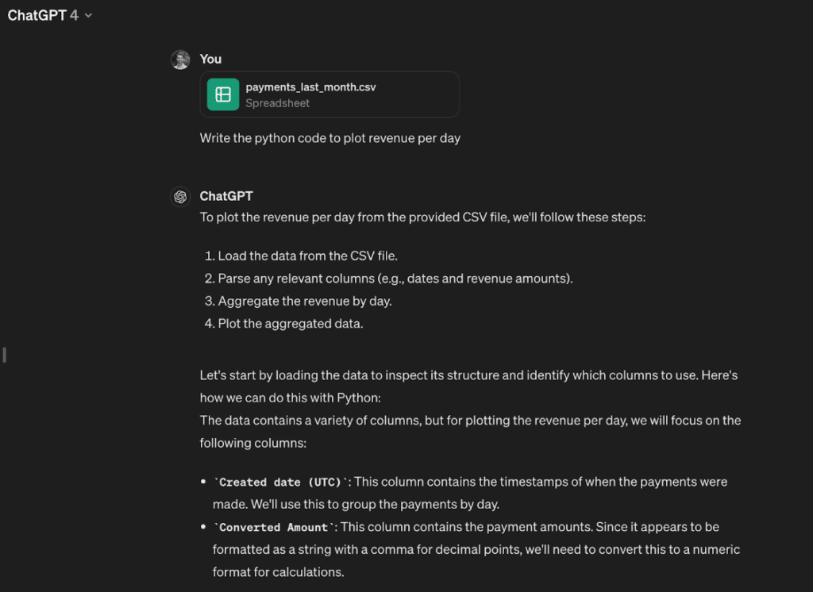 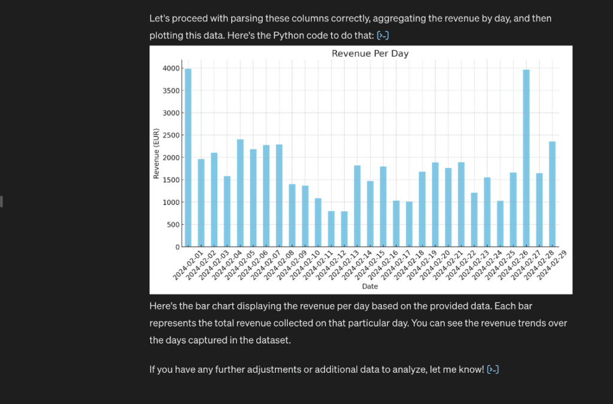

It should already output a graph based on your data. _Easy huh?_

4 - click on the code button at the bottom of the response to review the code that the LLM generated in order to create the graph. In this case:

    				`import matplotlib.pyplot as plt # Convert 'Created date (UTC)' to datetime data['Created date (UTC)'] = pd.to_datetime(data['Created date (UTC)']) # Replace commas in 'Converted Amount' and convert to float data['Converted Amount'] = data['Converted Amount'].str.replace(',', '.').astype(float) # Group by date and sum the amounts daily_revenue = data.groupby(data['Created date (UTC)'].dt.date)['Converted Amount'].sum() # Plotting the revenue per day plt.figure(figsize=(12, 6)) daily_revenue.plot(kind='bar', color='skyblue') plt.title('Revenue Per Day') plt.xlabel('Date') plt.ylabel('Revenue (EUR)') plt.xticks(rotation=45) plt.grid(True) plt.show()`

5 - Read through the code and select a line that you don’t understand right away.

6 - Prompt chatGPT to explain this line to you:

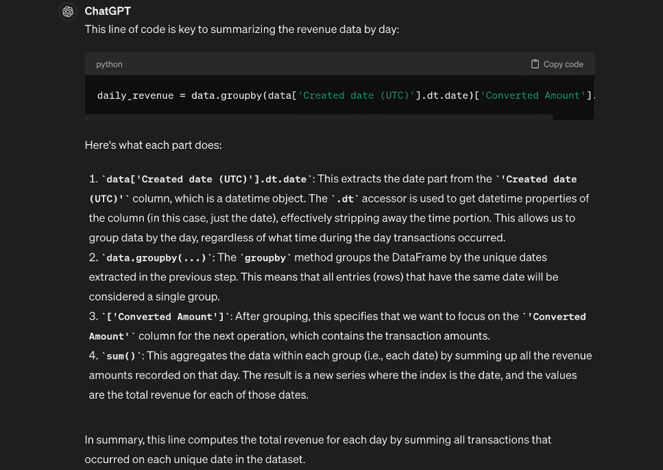

The above exercise should convince you that, much like DeepL allows you to speak Italian fairly well (when you’re in desperate need of a pizza in Napoli 🍕), LLMs allow you to get by with writing the code you need to build the graphs you want.

It won’t be perfect from the start, but AI will remove most of the frustration from learning, and, over time, you will get better.

[According to McKinsey](https://www.mckinsey.com/featured-insights/mckinsey-explainers/whats-the-future-of-generative-ai-an-early-view-in-15-charts), generative AI has the potential to reduce frustration, increase happiness, and foster ‘flow’ states associated with writing code.

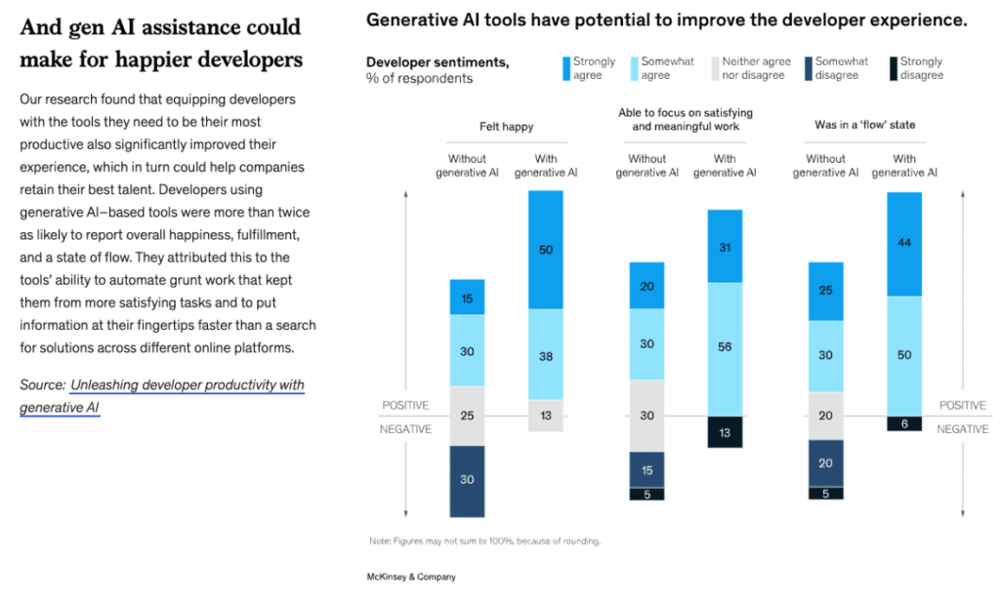 .elementor-16757 .elementor-element.elementor-element-fa6400f{--display:flex;--flex-direction:column;--container-widget-width:100%;--container-widget-height:initial;--container-widget-flex-grow:0;--container-widget-align-self:initial;--overflow:hidden;--background-transition:0.3s;--border-radius:12px 12px 12px 12px;}.elementor-16757 .elementor-element.elementor-element-283e311{--display:flex;--flex-direction:row;--container-widget-width:initial;--container-widget-height:100%;--container-widget-flex-grow:1;--container-widget-align-self:stretch;--gap:64px 64px;--background-transition:0.3s;}.elementor-16757 .elementor-element.elementor-element-283e311:not(.elementor-motion-effects-element-type-background), .elementor-16757 .elementor-element.elementor-element-283e311 > .elementor-motion-effects-container > .elementor-motion-effects-layer{background-color:#F4FAFE;}.elementor-16757 .elementor-element.elementor-element-283e311, .elementor-16757 .elementor-element.elementor-element-283e311::before{--border-transition:0.3s;}.elementor-16757 .elementor-element.elementor-element-857117e{--display:flex;--flex-direction:row;--container-widget-width:initial;--container-widget-height:100%;--container-widget-flex-grow:1;--container-widget-align-self:stretch;--background-transition:0.3s;}.elementor-16757 .elementor-element.elementor-element-857117e.e-con{--flex-grow:0;--flex-shrink:0;}.elementor-16757 .elementor-element.elementor-element-e6af329 img{width:100%;max-width:100%;height:100%;object-fit:cover;object-position:bottom right;}.elementor-16757 .elementor-element.elementor-element-e6af329{width:100%;max-width:100%;bottom:-44px;}body:not(.rtl) .elementor-16757 .elementor-element.elementor-element-e6af329{right:0px;}body.rtl .elementor-16757 .elementor-element.elementor-element-e6af329{left:0px;}.elementor-16757 .elementor-element.elementor-element-ec0de51{--display:flex;--flex-direction:column;--container-widget-width:100%;--container-widget-height:initial;--container-widget-flex-grow:0;--container-widget-align-self:initial;--gap:24px 24px;--background-transition:0.3s;--padding-top:112px;--padding-bottom:112px;--padding-left:0px;--padding-right:44px;}.elementor-16757 .elementor-element.elementor-element-ec0de51.e-con{--flex-grow:1;--flex-shrink:1;}.elementor-16757 .elementor-element.elementor-element-c168e59{--display:flex;--flex-direction:column;--container-widget-width:100%;--container-widget-height:initial;--container-widget-flex-grow:0;--container-widget-align-self:initial;--background-transition:0.3s;}.elementor-16757 .elementor-element.elementor-element-4aeb8ec .elementor-heading-title{font-family:"Poppins", sans-serif;font-size:32px;font-weight:700;}.elementor-16757 .elementor-element.elementor-element-8e0cd20{color:#000000;}@media(min-width:768px){.elementor-16757 .elementor-element.elementor-element-857117e{--width:360px;}}@media(max-width:767px){.elementor-16757 .elementor-element.elementor-element-283e311{--padding-top:40px;--padding-bottom:40px;--padding-left:var(--safe-margin);--padding-right:var(--safe-margin);}.elementor-16757 .elementor-element.elementor-element-857117e{--min-height:300px;}body:not(.rtl) .elementor-16757 .elementor-element.elementor-element-e6af329{right:0px;}body.rtl .elementor-16757 .elementor-element.elementor-element-e6af329{left:0px;}.elementor-16757 .elementor-element.elementor-element-e6af329{bottom:-76px;}.elementor-16757 .elementor-element.elementor-element-ec0de51{--padding-top:40px;--padding-bottom:0px;--padding-left:0px;--padding-right:0px;}} 

##### Looking to Integrate AI into Your Business?

Get straight to the point, jargon-free advice on transforming your tech strategy by leveraging AI from an expert that has been building award-winning Startups for the past 10 years.

Let's Talk

## Choosing a Data Toolkit

Selecting the right tools depends on who is building, maintaining and using the data dashboards. For a while we’ve separated data analysis practitioners into two categories:

1. The Business Analyst - business-oriented
2. The Data Scientist - tech-oriented

There are distinct needs and skill sets of these user groups, however both seek to extract the most valuable insights from the data at hand.

### Business Analyst - BI Tools

In the field of business analysis, professionals often utilise user-friendly platforms such as [Microsoft Power BI](https://www.microsoft.com/pt-pt/power-platform/products/power-bi), [Looker (formerly Google Data Studio)](https://lookerstudio.google.com/), and [Tableau](https://www.tableau.com/). These tools are designed to cater to users who may not have deep technical expertise but need to perform complex data analysis tasks. They enable users to import data from diverse sources and craft visual representations like graphs and charts with ease, thanks to their robust integrations and intuitive interfaces.

However, there are **limitations and downsides**:

1. **Data Preprocessing and Manipulation:** Tasks such as [feature extraction](https://deepai.org/machine-learning-glossary-and-terms/feature-extraction) can be cumbersome within these platforms. The tools are optimised for visualisation rather than data manipulation, which can limit their usefulness in data-intensive scenarios.
2. **Predictive Analytics:** These platforms generally offer limited support for advanced predictive analytics and machine learning algorithms. This restricts users from performing more sophisticated data analysis that could anticipate future trends and patterns.
3. **Painful to Debug:** When dashboards fail or display errors, troubleshooting is often painful. Parts of these systems are built as a black box, making it hard to quickly trace and resolve issues:

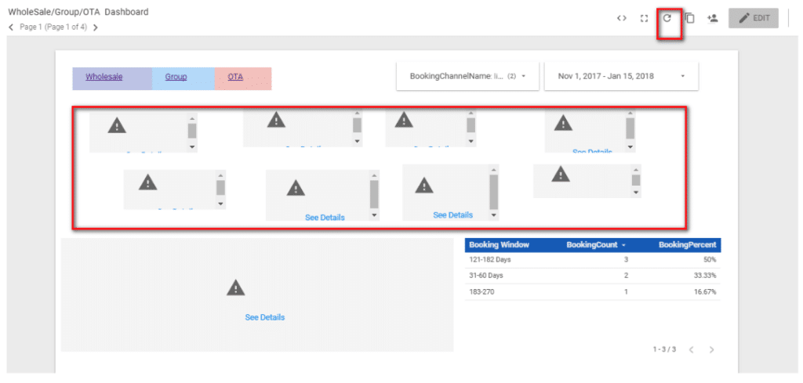 /\* widget: Blog: Simple Box \*/ /\* reset -------------------- \*/ .blog-custom-block \*, .blog-custom-block ::before, .blog-custom-block ::after { box-sizing: border-box; border-width: 0; border-style: solid; border-color: #e5e7eb; } /\* vars -------------------- \*/ .blog-custom-block.blog-custom-block\_\_simple-quote { --color-accent: #0FA4EA; --color-bg: #F4FAFE; --color-text-2: #4A4A68; } /\* colors -------------------- \*/ .blog-custom-block.blog-custom-block\_\_simple-quote .bg-clr-bg { background-color: var(--color-bg); } .blog-custom-block.blog-custom-block\_\_simple-quote .border-clr-accent { border-color: var(--color-accent); } .blog-custom-block.blog-custom-block\_\_simple-quote .text-clr-text-2 { color: var(--color-text-2); } /\* utils -------------------- \*/ .blog-custom-block.blog-custom-block\_\_simple-quote .flex { display: flex; } .blog-custom-block.blog-custom-block\_\_simple-quote .flex-shrink-0 { flex-shrink: 0; } .blog-custom-block.blog-custom-block\_\_simple-quote .flex-col { flex-direction: column; } .blog-custom-block.blog-custom-block\_\_simple-quote .gap-4 { gap: 1rem; } .blog-custom-block.blog-custom-block\_\_simple-quote .rounded-xl { border-radius: 0.75rem; } .blog-custom-block.blog-custom-block\_\_simple-quote .border-l-6 { border-left-width: 6px; } .blog-custom-block.blog-custom-block\_\_simple-quote .p-8 { padding: 2rem; } .blog-custom-block.blog-custom-block\_\_simple-quote .text-xl { font-size: 1.25rem; line-height: 1.75rem; } .blog-custom-block.blog-custom-block\_\_simple-quote .italic { font-style: italic; }

🤔 _Is it just me, or everyone who has ever created a BI dashboard has had the painful moment of seeing its nicely crafted graphs disappear into a wall of warning signs?_

### Data Scientist - Python & Jupyter Notebooks

#### Python

For more technical data analytics practitioners, wearing a hat of “data scientist”, Python has become the language of choice.

Python has been around since 1991, but its popularity has seen a large growth in the last decade, making it today [the most used programming language in the world](https://www.tiobe.com/tiobe-index/):

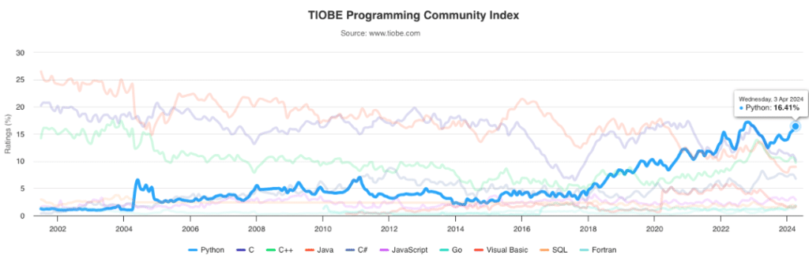

For the data practitioner, Python’s flexibility enables the performance of complex data manipulations, sophisticated predictive models, and custom visualisations. Its open-source nature nurtures shared community resources and means that you are free to embed Python into your commercial applications.

The Python ecosystem has served as a cornerstone of the AI revolution and co-evolved with it. Thousands of developers have contributed to building a robust array of open-source libraries that allow you to “stand on the shoulders of giants” when building your own apps. A few libraries:

- **Data Manipulation:** [Pandas](https://pandas.pydata.org/) and [NumPy](https://numpy.org/) provide extensive capabilities for data structuring and manipulation – essential for preparing data for analysis.
- **Data Visualization:** Libraries such as [Matplotlib](https://matplotlib.org/), [Seaborn](https://seaborn.pydata.org/), and [Plotly](https://plotly.com/) offer powerful tools for creating a wide range of static, interactive, and animated visualisations, from simple charts to complex graphical representations.
- **Machine Learning:** For those looking to dive deeper into machine learning, [TensorFlow](https://www.tensorflow.org/), [PyTorch](https://pytorch.org/), [Keras](https://keras.io/), and [Scikit-learn](https://scikit-learn.org/) facilitate everything from simple regression models to advanced neural networks.

#### Jupyter Notebooks as IDE

Alongside Python, [Jupyter Notebooks](https://jupyter.org/) have been the environment of choice for interactive data science and analytics. This setup allows for the execution of live code, equations, visualisations, and narrative text, making it an ideal tool for collaborative data exploration and visualisation.

While Jupyter Notebooks excel in experimental and developmental stages, they are not made for production environments. Once a data scientist is happy with her/his exploration, she/he needs to prepare the Python code for deployment in production - an extra step.

As we will see shortly, data apps represent a production-ready approach to data analytics, with the flexibility of Python and the speed of built-in visualisations.

## Introducing Data Apps

Data apps offer **dynamic, interactive, and predictive** experiences beyond traditional BI tools, which primarily focus on static visualisations of past data.

**Flexible and community-lead tools** mean that, as AI/ML continues to progress, the risk of finding yourself with an outdated data stack is lowered. New ways to interact with data are rapidly tested and integrated by the community, so you can be at the edge of technology when it comes to data-driven decisions.

Right now, my favourite tool to build data apps is [Streamlit](https://streamlit.io/).

Streamlit allows you to, using Python, create a fully functioning multi-page data app, with [authentication](https://blog.streamlit.io/streamlit-authenticator-part-1-adding-an-authentication-component-to-your-app/) and interactive data visualisations. To understand the potential of data apps to understand data interactively, here is an [example of an interactive Streamlit forecasting data app](https://blog.streamlit.io/forecasting-with-streamlit-prophet/).

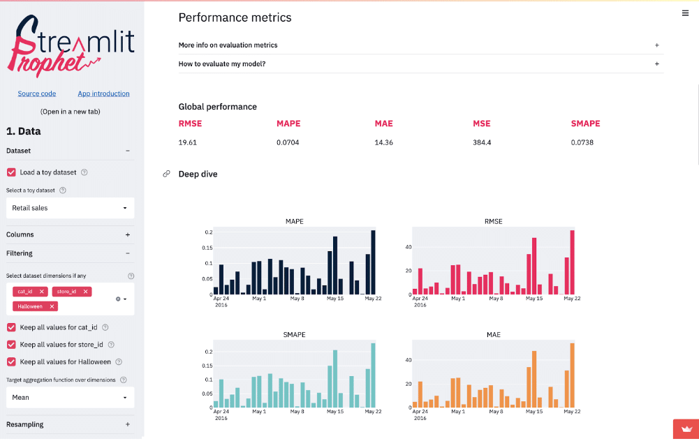 /\* widget: Blog: Simple Box \*/ /\* reset -------------------- \*/ .blog-custom-block \*, .blog-custom-block ::before, .blog-custom-block ::after { box-sizing: border-box; border-width: 0; border-style: solid; border-color: #e5e7eb; } /\* vars -------------------- \*/ .blog-custom-block.blog-custom-block\_\_simple-quote { --color-accent: #0FA4EA; --color-bg: #F4FAFE; --color-text-2: #4A4A68; } /\* colors -------------------- \*/ .blog-custom-block.blog-custom-block\_\_simple-quote .bg-clr-bg { background-color: var(--color-bg); } .blog-custom-block.blog-custom-block\_\_simple-quote .border-clr-accent { border-color: var(--color-accent); } .blog-custom-block.blog-custom-block\_\_simple-quote .text-clr-text-2 { color: var(--color-text-2); } /\* utils -------------------- \*/ .blog-custom-block.blog-custom-block\_\_simple-quote .flex { display: flex; } .blog-custom-block.blog-custom-block\_\_simple-quote .flex-shrink-0 { flex-shrink: 0; } .blog-custom-block.blog-custom-block\_\_simple-quote .flex-col { flex-direction: column; } .blog-custom-block.blog-custom-block\_\_simple-quote .gap-4 { gap: 1rem; } .blog-custom-block.blog-custom-block\_\_simple-quote .rounded-xl { border-radius: 0.75rem; } .blog-custom-block.blog-custom-block\_\_simple-quote .border-l-6 { border-left-width: 6px; } .blog-custom-block.blog-custom-block\_\_simple-quote .p-8 { padding: 2rem; } .blog-custom-block.blog-custom-block\_\_simple-quote .text-xl { font-size: 1.25rem; line-height: 1.75rem; } .blog-custom-block.blog-custom-block\_\_simple-quote .italic { font-style: italic; }

**A quick disclaimer:** Streamlit was acquired in March 2022 by Snowflake. I do not have any affiliation with either organisation, I simply love it for its simplicity.

For highly technical users, alternatives like [Apache Superset](https://superset.apache.org/) or creating a custom data app using [ReactJS](https://react.dev/) are also viable options. However, these options require a significant investment of time and resources to develop and maintain. [Plotly](https://plotly.com/) is also a viable alternative, with an enterprise tier.

If, after all this convincing, you want to take the step to build your own data app, the next sections are for you.

## Building Your Streamlit Data App

Streamlit provides good documentation on how to do this. Here is a [step-by-step guide on how to build a data app](https://blog.streamlit.io/crafting-a-dashboard-app-in-python-using-streamlit/). You can deploy and scale it on your own infrastructure, or at no cost in [Streamlit Community Cloud](https://streamlit.io/cloud).

By connecting your app’s Github repo to Streamlit Cloud, you simply need to push your code to Github and the deployed app will automatically refresh with the new version.

### Connecting to Data Sources

Streamlit allows you to get data from various data sources (S3, Google Sheets and multiple databases), and existing data systems. It includes simple [guides on how to connect your data to Streamlit](https://docs.streamlit.io/develop/tutorials/databases).

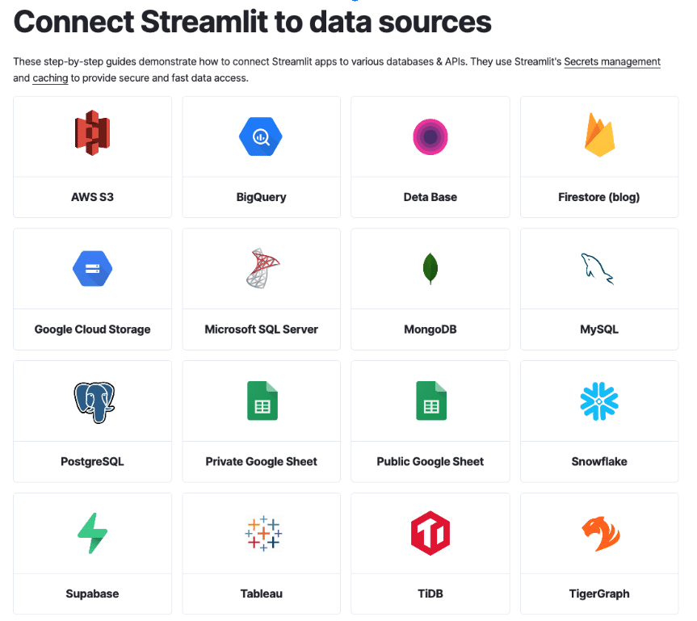 --e-global-typography-text-font-size );line-height:var( --e-global-typography-text-line-height );}.elementor-3329 .elementor-element.elementor-element-70fbc6a .elementor-message{font-size:var( --e-global-typography-9730a4e-font-size );line-height:var( --e-global-typography-9730a4e-line-height );letter-spacing:var( --e-global-typography-9730a4e-letter-spacing );word-spacing:var( --e-global-typography-9730a4e-word-spacing );}}@media(max-width:767px){.elementor-3329 .elementor-element.elementor-element-99ebd14 .elementor-heading-title{font-size:var( --e-global-typography-0ff79ee-font-size );line-height:var( --e-global-typography-0ff79ee-line-height );letter-spacing:var( --e-global-typography-0ff79ee-letter-spacing );word-spacing:var( --e-global-typography-0ff79ee-word-spacing );}.elementor-3329 .elementor-element.elementor-element-70fbc6a .elementor-field-group > label{font-size:var( --e-global-typography-9730a4e-font-size );line-height:var( --e-global-typography-9730a4e-line-height );letter-spacing:var( --e-global-typography-9730a4e-letter-spacing );word-spacing:var( --e-global-typography-9730a4e-word-spacing );}.elementor-3329 .elementor-element.elementor-element-70fbc6a .elementor-field-group .elementor-field, .elementor-3329 .elementor-element.elementor-element-70fbc6a .elementor-field-subgroup label{font-size:var( --e-global-typography-text-font-size );line-height:var( --e-global-typography-text-line-height );}.elementor-3329 .elementor-element.elementor-element-70fbc6a .elementor-message{font-size:var( --e-global-typography-9730a4e-font-size );line-height:var( --e-global-typography-9730a4e-line-height );letter-spacing:var( --e-global-typography-9730a4e-letter-spacing );word-spacing:var( --e-global-typography-9730a4e-word-spacing );}}/\* Start custom CSS for form, class: .elementor-element-70fbc6a \*/.elementor-3329 .elementor-element.elementor-element-70fbc6a input { border-color: #65639C !important; } .elementor-3329 .elementor-element.elementor-element-70fbc6a input:is(:focus, :hover) { border-color: #B9B8CE !important; }/\* End custom CSS \*/

##### Sign up for our newsletter

Join hundreds of entrepreneurs and business leaders to receive  
fresh, actionable tech and startup related insights and tips

Full Name Business Email Subscribe

### Visualising Your Data

The goal of all of this is to be able to visualise how your company is performing.

Streamlit offers lots of pre-built chart elements - see [docs](https://docs.streamlit.io/develop/api-reference/charts) which allow you to generate the graphs you want out of your data.

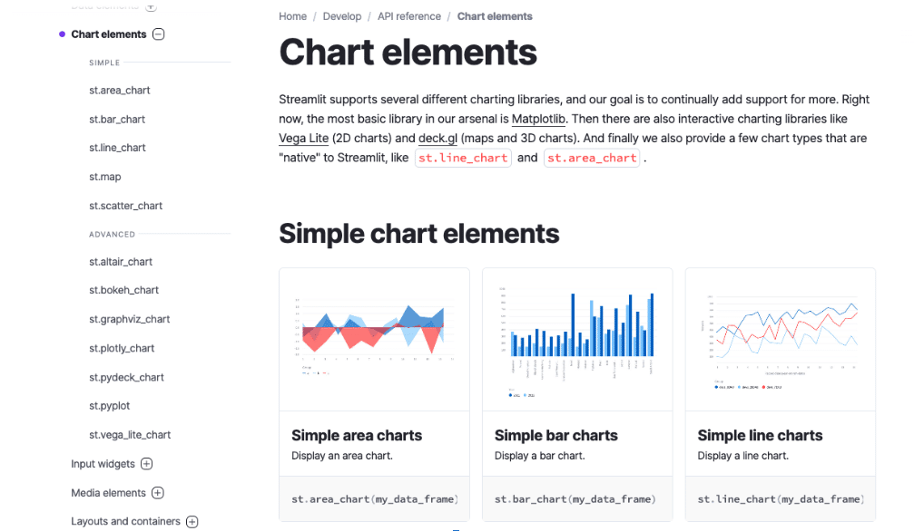

If this is not enough, and you want some special sauce, there are a lot of third-party community-created components which seamlessly add to the built-in functionalities - you can find them [here](https://streamlit.io/components?category=graphs).

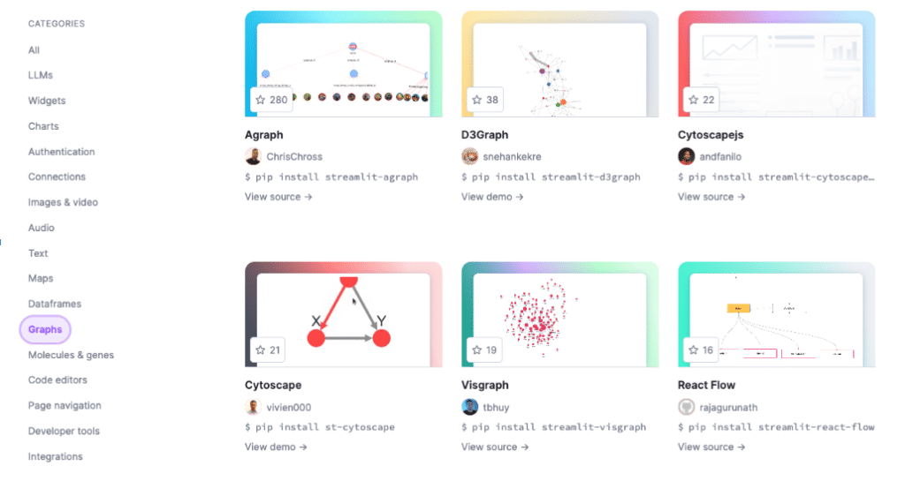

### Fetching Financial Data from Stripe API

Streamlit is well documented, so there was no point in re-writing the guides. But before you go, here are a few more bits of value.

Nowadays, Stripe is the de facto payment gateway for digital businesses. Since financial metrics are crucial for monitoring the health of a startup (as seen above), you will likely need to connect your data app to Stripe.

The right way to do this is to connect to the [Stripe API](https://docs.stripe.com/development/get-started) and convert Stripe logs into a [Pandas dataframe](https://pandas.pydata.org/docs/reference/api/pandas.DataFrame.html) (think of it as a sophisticated table). You can use the following Python function for this:

    				`import streamlit as st import pandas as pd import stripe stripe.api_key = st.secrets["stripe_api_key"] # Function to get data from the Stripe API def stripe_get_data(resource, start_date=None, end_date=None, **kwargs):      if start_date:        # convert to unix timestamp        start_date = int(start_date.timestamp())    if end_date:        # convert to unix timestamp        end_date = int(end_date.timestamp())    resource_list = getattr(stripe, resource).list(created={"gte": start_date,"lt": end_date}, **kwargs)    lst = []    for i in resource_list.auto_paging_iter():        lst.extend([i])    df = pd.DataFrame(lst)    if len(df) &gt; 0:        df['created'] = pd.to_datetime(df['created'], unit='s')    return df`

Then, you can call the stripe_get_data function to get resources like charges, customers, or subscriptions, as shown below.

Here we get the resource and then treat the output by selecting and “flattening” the output, from a JSON-like output to a nicely-looking table that we can use for charts.

    				`def stripe_get_charges(start_date, end_date):    # Get the charges data from the Stripe API into dataframes    charges_df = stripe_get_data("Charge", start_date, end_date)    charges_df = pd.concat([charges_df.drop(['outcome'], axis=1),        charges_df['outcome'].apply(pd.Series)], axis=1) # flatten outcome column    charges_df = charges_df[["created", "id", "customer", "amount", "amount_captured", "amount_refunded", "description", "network_status", "status", "paid", "refunded", "failure_code", "failure_message"]]    charges_df = charges_df.sort_values(by="created")    return charges_df def stripe_get_customers():    # Get the customer data    customers_df = stripe_get_data("Customer")    customers_df = customers_df[["id", "created", "email", "name", "phone", "description", "metadata"]]    customers_df['metadata'] = customers_df['metadata'].apply(lambda x: x if x is not None else {})    customers_df = pd.concat([customers_df.drop(['metadata'], axis=1),    customers_df['metadata'].apply(pd.Series)], axis=1) # flatten metadata column    return customers_df def stripe_get_subscriptions(start_date, end_date):     # Get the subscription data    subscriptions_df = stripe_get_data("Subscription", start_date, end_date)    subscriptions_df = subscriptions_df[["id", "created", "customer"]]    return subscriptions_df`

/\* widget: Blog: Simple Box \*/ /\* reset -------------------- \*/ .blog-custom-block \*, .blog-custom-block ::before, .blog-custom-block ::after { box-sizing: border-box; border-width: 0; border-style: solid; border-color: #e5e7eb; } /\* vars -------------------- \*/ .blog-custom-block.blog-custom-block\_\_simple-quote { --color-accent: #0FA4EA; --color-bg: #F4FAFE; --color-text-2: #4A4A68; } /\* colors -------------------- \*/ .blog-custom-block.blog-custom-block\_\_simple-quote .bg-clr-bg { background-color: var(--color-bg); } .blog-custom-block.blog-custom-block\_\_simple-quote .border-clr-accent { border-color: var(--color-accent); } .blog-custom-block.blog-custom-block\_\_simple-quote .text-clr-text-2 { color: var(--color-text-2); } /\* utils -------------------- \*/ .blog-custom-block.blog-custom-block\_\_simple-quote .flex { display: flex; } .blog-custom-block.blog-custom-block\_\_simple-quote .flex-shrink-0 { flex-shrink: 0; } .blog-custom-block.blog-custom-block\_\_simple-quote .flex-col { flex-direction: column; } .blog-custom-block.blog-custom-block\_\_simple-quote .gap-4 { gap: 1rem; } .blog-custom-block.blog-custom-block\_\_simple-quote .rounded-xl { border-radius: 0.75rem; } .blog-custom-block.blog-custom-block\_\_simple-quote .border-l-6 { border-left-width: 6px; } .blog-custom-block.blog-custom-block\_\_simple-quote .p-8 { padding: 2rem; } .blog-custom-block.blog-custom-block\_\_simple-quote .text-xl { font-size: 1.25rem; line-height: 1.75rem; } .blog-custom-block.blog-custom-block\_\_simple-quote .italic { font-style: italic; }

**Important:** This code is an example from my own exploration of the stripe API to a particular need. Please adjust the code to your specific needs.

My point here is to provide an example of how you can easily fetch payment logs from Stripe via API and manipulate it using [Pandas dataframe](https://pandas.pydata.org/docs/reference/api/pandas.DataFrame.html). Then, you may choose to Load the data into your persistent database or save it to a .csv file. Once you have your data in a table that makes sense, you can use built-in chart elements or community components to get to the visualisations you love.

#### Refreshing Stripe Data Automatically

To finalise, you will need to have a mechanism to refresh new data automatically. Or at least, it has to be possible to trigger a data refresh from the data app, so any user can fetch new data without looking at the code base.

In the last data app I built (a small side project), I chose to simply have a .csv file as the source of truth, before investing more time to create a proper persistent database.

Here is how I handled it:

**1\. Created an “all_time_charges_data.csv” file with entries ordered by date.**

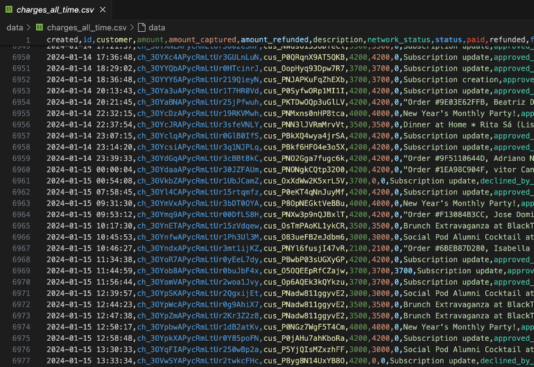

**2\. Wrote the following function to get the last datetime fetched - this way I could know which data timeframe I needed to fetch**

    				`def get_last_charge_datetime(file_path):        with open(file_path, 'rb') as f:            f.seek(-2, os.SEEK_END)            while f.read(1) != b'n':                f.seek(-2, io.SEEK_CUR)            last_line = f.readline().decode()        return last_line.split(',')[0]`

**3\. Wrote a function to update the CSV file**

    				`def update_charges_all_time():         # Get the last charge datetime         last_charge_datetime_str = get_last_charge_datetime('./data/charges_all_time.csv')         print(f"Last recorded charge datetime: {last_charge_datetime_str}")         # Convert the string to datetime object         last_charge_datetime = datetime.strptime(last_charge_datetime_str, '%Y-%m-%d %H:%M:%S')         # Get data from Stripe starting from the last charge datetime         charges = stripe_get_charges(last_charge_datetime, datetime.now())         # Append the new data to the CSV file         charges.to_csv("data/charges_all_time.csv", mode='a', header=False, index=False)`

**4\. Added a button that runs the function and fetches new data:**

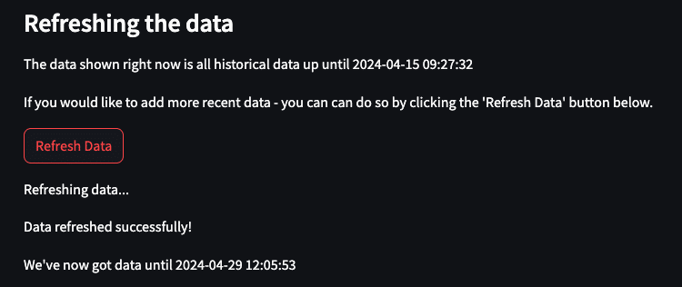

Alternatively, you can create a [cron job](https://en.wikipedia.org/wiki/Cron) to run the update_charges_all_time() function.

**5\. In every app page, I enforced the re-read of the data so that the graphs also update, as the data gets updated. I did this by calling the get_last_charge_datetime function and writing the date-time of last data:**

    				   `last_date_data = get_last_charge_datetime('./data/charges_all_time.csv')    st.write(f"Historical data until {last_date_data}")`

/\* widget: Blog: Simple Box \*/ /\* reset -------------------- \*/ .blog-custom-block \*, .blog-custom-block ::before, .blog-custom-block ::after { box-sizing: border-box; border-width: 0; border-style: solid; border-color: #e5e7eb; } /\* vars -------------------- \*/ .blog-custom-block.blog-custom-block\_\_simple-quote { --color-accent: #0FA4EA; --color-bg: #F4FAFE; --color-text-2: #4A4A68; } /\* colors -------------------- \*/ .blog-custom-block.blog-custom-block\_\_simple-quote .bg-clr-bg { background-color: var(--color-bg); } .blog-custom-block.blog-custom-block\_\_simple-quote .border-clr-accent { border-color: var(--color-accent); } .blog-custom-block.blog-custom-block\_\_simple-quote .text-clr-text-2 { color: var(--color-text-2); } /\* utils -------------------- \*/ .blog-custom-block.blog-custom-block\_\_simple-quote .flex { display: flex; } .blog-custom-block.blog-custom-block\_\_simple-quote .flex-shrink-0 { flex-shrink: 0; } .blog-custom-block.blog-custom-block\_\_simple-quote .flex-col { flex-direction: column; } .blog-custom-block.blog-custom-block\_\_simple-quote .gap-4 { gap: 1rem; } .blog-custom-block.blog-custom-block\_\_simple-quote .rounded-xl { border-radius: 0.75rem; } .blog-custom-block.blog-custom-block\_\_simple-quote .border-l-6 { border-left-width: 6px; } .blog-custom-block.blog-custom-block\_\_simple-quote .p-8 { padding: 2rem; } .blog-custom-block.blog-custom-block\_\_simple-quote .text-xl { font-size: 1.25rem; line-height: 1.75rem; } .blog-custom-block.blog-custom-block\_\_simple-quote .italic { font-style: italic; }

#### 😎 Challenge

You can, at this point, re-create all the 10 key metric graphs (above) for your startup. This will bring peace of mind in navigating the choppy waters of entrepreneurship.

## Conclusion

The journey to adequate tracking of your startup performance might seem daunting, but with the right tools and a bit of perseverance, it's well within your reach. Leveraging tools like Python Libraries, Streamlit and Stripe API, you can gain a clearer understanding of the overall health of your business.

Remember, the goal is not just to survive the tumultuous early stages of entrepreneurship but to thrive, making informed decisions that propel your business forward. Whether you're a technical guru or a business strategist, the insights and techniques covered here are designed to empower you on your way to success.

Embrace these tools, and watch as your startup masters the choppy waters of the business world.

I hope you’ve gotten a lot of value out of this article, and that you do put at least some of it into practice. If at any point you need a hand, feel free to [reach out to me here](mailto:altar@altar.io).
