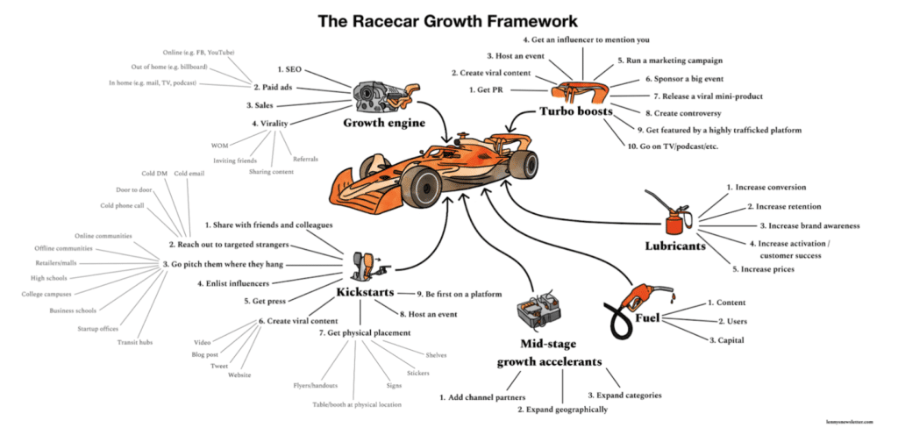

When creating your startup, one of the first (and biggest) challenges you face is finding the right balance between developing your product and acquiring your first customers.

In the physical world, it’s impossible to launch a new product without meeting some minimum requirements and investing lots of time and money.

In the software industry, developing products publicly from day one is increasingly common, even before they are ready for sale. The objective is to gather customer feedback as early as possible to ensure the product meets market demands.

However, figuring out how to do this isn't obvious, and there's no one-size-fits-all recipe for every startup. In the past, it was more common to hear about startups that spent months or even years developing their product, only to launch and find out [people didn't really want it](https://altar.io/founder-story-how-rejection-turned-into-21m-funding/).

Nowadays, we see startups selling anything just to prove they can sell, even when their value proposition isn’t clear, distracted by the potential of unlimited marketing channels and growth hacks.

FOMO is real and you don’t want to miss your opportunity to take your startup to success. But without a process, it's like taking a boat to conquer the world without knowing anything about navigating the seas.

I’m writing this not because I was successful in finding the right path, but quite the opposite.

In this article, I’ll share my journey and the lessons I learned from those hurdles. Then, I’ll provide actionable advice on how to properly prioritise product development and go-to-market strategy.

#### Contents

## My Journey Finding Balance Between Product Development & Go-To-Market Strategy

Nine years ago, when I started my first startup, I made many mistakes – many of which I’ve already dived into [here](https://altar.io/how-i-recovered-from-losing-my-technical-co-founder/).

One of these mistakes, which changed my career, was not having a clear process in place to build and launch my startup.

This led me to realise the importance of bringing method and structure to everything I do. It might seem impossible to apply this to marketing, but it's definitely achievable (more on that in a moment).

In any business, you develop a product or service, and then you need to find ways to get people to buy it. This is true in the tech world as well, where your product and go-to-market (GTM) strategy may be digital.

A GTM strategy is more than just listing channels to promote and sell your product; it's a comprehensive plan to launch your product into the market and reach customers.

Many startups face the problem of not having a proper GTM plan. They often think a GTM strategy is just about listing channels.

However, trying to sell without a process might get some sales, but it won't teach you anything, and scaling your startup will be difficult. And remember, a startup's goal is to scale—otherwise, it's not a startup.

In my startup, we used lean methodologies from the start and quickly developed our product. Our problem was simple but big: people were hesitant to try new wines because they didn't know much about them.

We assumed people needed expert recommendations to try new wines confidently. So, we launched a subscription box featuring the best Portuguese wines, recommended by top sommeliers.

Our challenges began here. We got caught in a cycle, constantly chasing milestones and losing control of the process. Despite using the right methodology, we became 'sales zombies,' focusing only on immediate sales and forgetting our company's vision.

The key lesson here is to balance your GTM strategy with your company's vision. Have a structured plan but stay true to your long-term goals. This way, you can scale your startup without losing sight of what makes your product special.

With that said, let's dive into how you can implement a clear process so you can nail both your product development & go-to-market strategy.

.elementor-16200 .elementor-element.elementor-element-fa6400f{--display:flex;--flex-direction:column;--container-widget-width:100%;--container-widget-height:initial;--container-widget-flex-grow:0;--container-widget-align-self:initial;--flex-wrap-mobile:wrap;--overflow:hidden;--background-transition:0.3s;--border-radius:12px 12px 12px 12px;}.elementor-16200 .elementor-element.elementor-element-283e311{--display:flex;--flex-direction:row;--container-widget-width:initial;--container-widget-height:100%;--container-widget-flex-grow:1;--container-widget-align-self:stretch;--flex-wrap-mobile:wrap;--gap:64px 64px;--background-transition:0.3s;}.elementor-16200 .elementor-element.elementor-element-283e311:not(.elementor-motion-effects-element-type-background), .elementor-16200 .elementor-element.elementor-element-283e311 > .elementor-motion-effects-container > .elementor-motion-effects-layer{background-color:#F4FAFE;}.elementor-16200 .elementor-element.elementor-element-283e311, .elementor-16200 .elementor-element.elementor-element-283e311::before{--border-transition:0.3s;}.elementor-16200 .elementor-element.elementor-element-857117e{--display:flex;--flex-direction:row;--container-widget-width:initial;--container-widget-height:100%;--container-widget-flex-grow:1;--container-widget-align-self:stretch;--flex-wrap-mobile:wrap;--background-transition:0.3s;}.elementor-16200 .elementor-element.elementor-element-857117e.e-con{--flex-grow:0;--flex-shrink:0;}.elementor-16200 .elementor-element.elementor-element-e6af329 img{width:100%;max-width:100%;height:100%;object-fit:cover;object-position:bottom right;}.elementor-16200 .elementor-element.elementor-element-e6af329{width:100%;max-width:100%;bottom:-44px;}body:not(.rtl) .elementor-16200 .elementor-element.elementor-element-e6af329{right:0px;}body.rtl .elementor-16200 .elementor-element.elementor-element-e6af329{left:0px;}.elementor-16200 .elementor-element.elementor-element-ec0de51{--display:flex;--flex-direction:column;--container-widget-width:100%;--container-widget-height:initial;--container-widget-flex-grow:0;--container-widget-align-self:initial;--flex-wrap-mobile:wrap;--gap:24px 24px;--background-transition:0.3s;--padding-top:112px;--padding-bottom:112px;--padding-left:0px;--padding-right:44px;}.elementor-16200 .elementor-element.elementor-element-ec0de51.e-con{--flex-grow:1;--flex-shrink:1;}.elementor-16200 .elementor-element.elementor-element-c168e59{--display:flex;--flex-direction:column;--container-widget-width:100%;--container-widget-height:initial;--container-widget-flex-grow:0;--container-widget-align-self:initial;--flex-wrap-mobile:wrap;--background-transition:0.3s;}.elementor-16200 .elementor-element.elementor-element-4aeb8ec .elementor-heading-title{font-family:"Poppins", sans-serif;font-size:32px;font-weight:700;}.elementor-16200 .elementor-element.elementor-element-8e0cd20{color:#000000;}@media(min-width:768px){.elementor-16200 .elementor-element.elementor-element-857117e{--width:360px;}}@media(max-width:767px){.elementor-16200 .elementor-element.elementor-element-283e311{--padding-top:40px;--padding-bottom:40px;--padding-left:var(--safe-margin);--padding-right:var(--safe-margin);}.elementor-16200 .elementor-element.elementor-element-857117e{--min-height:300px;}body:not(.rtl) .elementor-16200 .elementor-element.elementor-element-e6af329{right:0px;}body.rtl .elementor-16200 .elementor-element.elementor-element-e6af329{left:0px;}.elementor-16200 .elementor-element.elementor-element-e6af329{bottom:-76px;}.elementor-16200 .elementor-element.elementor-element-ec0de51{--padding-top:40px;--padding-bottom:0px;--padding-left:0px;--padding-right:0px;}}

##### Do you have a brilliant startup idea that you want to bring to life?

From the product and business reasoning to streamlining your MVP to the most important features, our team of product experts and ex-startup founders can help you bring your vision to life.

Let's Talk

## Actionable Advice for Founders

### Understanding Your Market Throughout Your Product Development Lifecycle

Understanding your market is crucial throughout the lifecycle of your startup. Initial research, even when data is limited, sets the foundation for your product development.

Identifying your target audience, their pain points, and the existing solutions they use is the first step. Gathering insights through surveys, focus groups, and online forums is essential.

Balancing your intuition with quantitative data ensures you make informed decisions. Analysing market trends, customer behaviour, and competitor strategies helps validate your assumptions.

This is where we failed. We had recurring contact with our customers and received lots of feedback, but it was so disorganised that it was probably worse than not receiving any feedback at all.

Everyone was pushing their own perspectives, and each founder or team member heard different things. Eventually, the original idea was lost, like [a pizza with 20 different ingredients](https://www.reddit.com/r/TwoBestFriendsPlay/comments/xr7brj/can_we_bring_back_brazilian_pizza/).

My recommendation is to build a structured process for staying in contact with your users—through recurring calls, online surveys, offline meetings, or something similarly organised where you can compare feedback and gather significant statistical data.

/\* widget: Blog: Small Topic \*/ /\* reset -------------------- \*/ .blog-custom-block \*, .blog-custom-block ::before, .blog-custom-block ::after {  box-sizing: border-box;  border-width: 0;  border-style: solid;  border-color: #e5e7eb; } /\* vars -------------------- \*/ .blog-custom-block.blog-custom-block\_\_small-topic {  --color-accent: #E7107E;  --color-bg: #F4FAFE;  --color-text-1: #0F172A; } /\* colors -------------------- \*/ .blog-custom-block.blog-custom-block\_\_small-topic .bg-clr-bg {  background-color: var(--color-bg); } .blog-custom-block.blog-custom-block\_\_small-topic .text-clr-accent {  color: var(--color-accent); } .blog-custom-block.blog-custom-block\_\_small-topic .text-clr-text-1 {  color: var(--color-text-1); } /\* utils -------------------- \*/ .blog-custom-block.blog-custom-block\_\_small-topic .mt-2 {  margin-top: 0.5rem; } .blog-custom-block.blog-custom-block\_\_small-topic .flex {  display: flex; } .blog-custom-block.blog-custom-block\_\_small-topic .flex-shrink-0 {  flex-shrink: 0; } .blog-custom-block.blog-custom-block\_\_small-topic .flex-col {  flex-direction: column; } .blog-custom-block.blog-custom-block\_\_small-topic .items-center {  align-items: center; } .blog-custom-block.blog-custom-block\_\_small-topic .p-5 {  padding: 1.25rem; } .blog-custom-block.blog-custom-block\_\_small-topic .gap-4 {  gap: 1rem; } .blog-custom-block.blog-custom-block\_\_small-topic .gap-5 {  gap: 1.25rem; } .blog-custom-block.blog-custom-block\_\_small-topic .rounded-xl {  border-radius: 0.75rem; } .blog-custom-block.blog-custom-block\_\_small-topic .p-8 {  padding: 2rem; } .blog-custom-block.blog-custom-block\_\_small-topic .text-xl {  font-size: 1.25rem;  line-height: 1.75rem; } .blog-custom-block.blog-custom-block\_\_small-topic .font-bold {  font-weight: 700; } 

Related: [How OpenAI Found Success by Being Product Driven (And How You Can Too)](https://altar.io/how-openai-found-success-by-being-product-driven-and-how-you-can-too/)

### Building a Minimum Viable Product (MVP) with a GTM Mindset

Building an MVP is not just about testing your product; it’s also about testing your go-to-market (GTM) strategy. This approach ensures your product launch aligns with sustainable growth strategies. Avoid relying solely on one-off initiatives like leveraging your network or creating initial buzz. Sustainable customer acquisition requires a well-thought-out GTM plan.

Think long-term when building your growth engine. Focus on strategies that drive sustainable growth rather than just quick wins. Aligning your product development with effective growth strategies makes it easier to retain customers and drive ongoing engagement. [Lenny’s comparison of startup growth to a race car is apt](https://www.lennysnewsletter.com/p/the-racecar-growth-frameworkexpanded); don’t just focus on kickstarts but build a strong engine for long-term success.

In our case, we did many of the kickstarts but never worried about the engine, so we created a product that was not ideal for the growth motion we eventually discovered.

Our business was initially based 100% on our online store, which would have been perfect for a Paid Ads strategy, but we didn’t have the budget to compete with all the other wine stores.

Later, we found that offline events and pop-up stores worked well to acquire new customers, but the product was not adapted to that new strategy, making it very hard to retain them.

Despite selling, our MVP was a mess, and we were not providing a new and great experience for our customers. We ended up doing what all the other wine players had been doing for years, which was far from our original idea.

Of course, you’ll never know for sure what will work, but my recommendation is to build an MVP with a growth engine in mind and stick to that strategy long enough to get results and learn something.

/\* widget: Blog: Small Topic \*/ /\* reset -------------------- \*/ .blog-custom-block \*, .blog-custom-block ::before, .blog-custom-block ::after {  box-sizing: border-box;  border-width: 0;  border-style: solid;  border-color: #e5e7eb; } /\* vars -------------------- \*/ .blog-custom-block.blog-custom-block\_\_small-topic {  --color-accent: #E7107E;  --color-bg: #F4FAFE;  --color-text-1: #0F172A; } /\* colors -------------------- \*/ .blog-custom-block.blog-custom-block\_\_small-topic .bg-clr-bg {  background-color: var(--color-bg); } .blog-custom-block.blog-custom-block\_\_small-topic .text-clr-accent {  color: var(--color-accent); } .blog-custom-block.blog-custom-block\_\_small-topic .text-clr-text-1 {  color: var(--color-text-1); } /\* utils -------------------- \*/ .blog-custom-block.blog-custom-block\_\_small-topic .mt-2 {  margin-top: 0.5rem; } .blog-custom-block.blog-custom-block\_\_small-topic .flex {  display: flex; } .blog-custom-block.blog-custom-block\_\_small-topic .flex-shrink-0 {  flex-shrink: 0; } .blog-custom-block.blog-custom-block\_\_small-topic .flex-col {  flex-direction: column; } .blog-custom-block.blog-custom-block\_\_small-topic .items-center {  align-items: center; } .blog-custom-block.blog-custom-block\_\_small-topic .p-5 {  padding: 1.25rem; } .blog-custom-block.blog-custom-block\_\_small-topic .gap-4 {  gap: 1rem; } .blog-custom-block.blog-custom-block\_\_small-topic .gap-5 {  gap: 1.25rem; } .blog-custom-block.blog-custom-block\_\_small-topic .rounded-xl {  border-radius: 0.75rem; } .blog-custom-block.blog-custom-block\_\_small-topic .p-8 {  padding: 2rem; } .blog-custom-block.blog-custom-block\_\_small-topic .text-xl {  font-size: 1.25rem;  line-height: 1.75rem; } .blog-custom-block.blog-custom-block\_\_small-topic .font-bold {  font-weight: 700; } 

Related: [3 Steps to Build a Successful MVP (Minimum Viable Product)](https://altar.io/features-inside-mvp-3-steps-know-answer/)

### Timing Your Market Entry

Timing your product launch is critical and should not be delayed for months. Consider starting with beta users or limited spots to create exclusivity and gather initial feedback. This approach helps build close relationships with early adopters and generates FOMO.

Understand that launching is not an all-or-nothing event. Control who sees your product initially and gradually adds features or users based on feedback and readiness.

### Scaling Your Product and GTM Strategy Simultaneously

Balancing product development and your GTM strategy is essential for sustainable growth. A great product won’t sell itself, and a strong GTM strategy won’t succeed with a poor product. In our startup, we added growth channels but neglected product development, making retention difficult. Both aspects must be given equal attention, evolving together like yin and yang.

Establishing processes that link product development with market strategy ensures both evolve together, supporting each other for overall success. Finding the right balance between these critical aspects is challenging but essential for sustainable growth and long-term success.

.elementor-3329 .elementor-element.elementor-element-f79b780{--display:flex;--flex-direction:column;--container-widget-width:100%;--container-widget-height:initial;--container-widget-flex-grow:0;--container-widget-align-self:initial;--flex-wrap-mobile:wrap;--background-transition:0.3s;}.elementor-3329 .elementor-element.elementor-element-aa6dd2a{--display:flex;--flex-direction:column;--container-widget-width:100%;--container-widget-height:initial;--container-widget-flex-grow:0;--container-widget-align-self:initial;--flex-wrap-mobile:wrap;--gap:24px 24px;--background-transition:0.3s;--border-radius:12px 12px 12px 12px;--padding-top:70px;--padding-bottom:70px;--padding-left:var(--safe-margin);--padding-right:var(--safe-margin);}.elementor-3329 .elementor-element.elementor-element-aa6dd2a:not(.elementor-motion-effects-element-type-background), .elementor-3329 .elementor-element.elementor-element-aa6dd2a > .elementor-motion-effects-container > .elementor-motion-effects-layer{background-color:#29293E;}.elementor-3329 .elementor-element.elementor-element-aa6dd2a, .elementor-3329 .elementor-element.elementor-element-aa6dd2a::before{--border-transition:0.3s;}.elementor-3329 .elementor-element.elementor-element-95ae566{--display:flex;--flex-direction:column;--container-widget-width:100%;--container-widget-height:initial;--container-widget-flex-grow:0;--container-widget-align-self:initial;--flex-wrap-mobile:wrap;--background-transition:0.3s;}.elementor-3329 .elementor-element.elementor-element-99ebd14{text-align:center;}.elementor-3329 .elementor-element.elementor-element-99ebd14 .elementor-heading-title{color:var( --e-global-color-eb70be1 );font-family:var( --e-global-typography-0ff79ee-font-family ), sans-serif;font-size:var( --e-global-typography-0ff79ee-font-size );font-weight:var( --e-global-typography-0ff79ee-font-weight );line-height:var( --e-global-typography-0ff79ee-line-height );letter-spacing:var( --e-global-typography-0ff79ee-letter-spacing );word-spacing:var( --e-global-typography-0ff79ee-word-spacing );}.elementor-3329 .elementor-element.elementor-element-0ce57c0{text-align:center;color:var( --e-global-color-eb70be1 );font-size:20px;}.elementor-3329 .elementor-element.elementor-element-28db4d7{--display:flex;--flex-direction:row;--container-widget-width:initial;--container-widget-height:100%;--container-widget-flex-grow:1;--container-widget-align-self:stretch;--flex-wrap-mobile:wrap;--justify-content:flex-start;--background-transition:0.3s;}.elementor-3329 .elementor-element.elementor-element-70fbc6a .elementor-field-group{padding-right:calc( 24px/2 );padding-left:calc( 24px/2 );margin-bottom:32px;}.elementor-3329 .elementor-element.elementor-element-70fbc6a .elementor-form-fields-wrapper{margin-left:calc( -24px/2 );margin-right:calc( -24px/2 );margin-bottom:-32px;}.elementor-3329 .elementor-element.elementor-element-70fbc6a .elementor-field-group.recaptcha_v3-bottomleft, .elementor-3329 .elementor-element.elementor-element-70fbc6a .elementor-field-group.recaptcha_v3-bottomright{margin-bottom:0;}body.rtl .elementor-3329 .elementor-element.elementor-element-70fbc6a .elementor-labels-inline .elementor-field-group > label{padding-left:8px;}body:not(.rtl) .elementor-3329 .elementor-element.elementor-element-70fbc6a .elementor-labels-inline .elementor-field-group > label{padding-right:8px;}body .elementor-3329 .elementor-element.elementor-element-70fbc6a .elementor-labels-above .elementor-field-group > label{padding-bottom:8px;}.elementor-3329 .elementor-element.elementor-element-70fbc6a .elementor-field-group > label, .elementor-3329 .elementor-element.elementor-element-70fbc6a .elementor-field-subgroup label{color:var( --e-global-color-eb70be1 );}.elementor-3329 .elementor-element.elementor --e-global-typography-text-font-size );line-height:var( --e-global-typography-text-line-height );}.elementor-3329 .elementor-element.elementor-element-70fbc6a .elementor-message{font-size:var( --e-global-typography-9730a4e-font-size );line-height:var( --e-global-typography-9730a4e-line-height );letter-spacing:var( --e-global-typography-9730a4e-letter-spacing );word-spacing:var( --e-global-typography-9730a4e-word-spacing );}}@media(max-width:767px){.elementor-3329 .elementor-element.elementor-element-99ebd14 .elementor-heading-title{font-size:var( --e-global-typography-0ff79ee-font-size );line-height:var( --e-global-typography-0ff79ee-line-height );letter-spacing:var( --e-global-typography-0ff79ee-letter-spacing );word-spacing:var( --e-global-typography-0ff79ee-word-spacing );}.elementor-3329 .elementor-element.elementor-element-70fbc6a .elementor-field-group > label{font-size:var( --e-global-typography-9730a4e-font-size );line-height:var( --e-global-typography-9730a4e-line-height );letter-spacing:var( --e-global-typography-9730a4e-letter-spacing );word-spacing:var( --e-global-typography-9730a4e-word-spacing );}.elementor-3329 .elementor-element.elementor-element-70fbc6a .elementor-field-group .elementor-field, .elementor-3329 .elementor-element.elementor-element-70fbc6a .elementor-field-subgroup label{font-size:var( --e-global-typography-text-font-size );line-height:var( --e-global-typography-text-line-height );}.elementor-3329 .elementor-element.elementor-element-70fbc6a .elementor-message{font-size:var( --e-global-typography-9730a4e-font-size );line-height:var( --e-global-typography-9730a4e-line-height );letter-spacing:var( --e-global-typography-9730a4e-letter-spacing );word-spacing:var( --e-global-typography-9730a4e-word-spacing );}}/\* Start custom CSS for form, class: .elementor-element-70fbc6a \*/.elementor-3329 .elementor-element.elementor-element-70fbc6a input {  border-color: #65639C !important; } .elementor-3329 .elementor-element.elementor-element-70fbc6a input:is(:focus, :hover) {  border-color: #B9B8CE !important; }/\* End custom CSS \*/

Full Name Business Email Subscribe

## Don't Fall into the Temptation of Doing Everything

As mentioned before, building a product and taking it to market must be in total alignment to deliver the best value to the customer. However, the technical skills required for each of these strategies couldn't be more different. No company would hire a marketing person to be the Head of Product or a product/technical expert to be the Head of Marketing. Yet, many founders end up juggling both roles, which is very dangerous.

Ideally, you would have a multi-disciplinary founding team that allows you to distribute these roles among the founders. But if that's not the case, consider hiring a full-time employee, an agency, or a freelancer to be dedicated to one of the roles. You'll still be in touch with that function, but it's crucial to distance yourself from the daily tasks that the job demands. Otherwise, you'll never excel in either role.

This separation is also important to create boundaries between what the founders are doing. It's common to see founders duplicating efforts without realising it, while other essential tasks are neglected.

/\* widget: Blog: Small Topic \*/ /\* reset -------------------- \*/ .blog-custom-block \*, .blog-custom-block ::before, .blog-custom-block ::after {  box-sizing: border-box;  border-width: 0;  border-style: solid;  border-color: #e5e7eb; } /\* vars -------------------- \*/ .blog-custom-block.blog-custom-block\_\_small-topic {  --color-accent: #E7107E;  --color-bg: #F4FAFE;  --color-text-1: #0F172A; } /\* colors -------------------- \*/ .blog-custom-block.blog-custom-block\_\_small-topic .bg-clr-bg {  background-color: var(--color-bg); } .blog-custom-block.blog-custom-block\_\_small-topic .text-clr-accent {  color: var(--color-accent); } .blog-custom-block.blog-custom-block\_\_small-topic .text-clr-text-1 {  color: var(--color-text-1); } /\* utils -------------------- \*/ .blog-custom-block.blog-custom-block\_\_small-topic .mt-2 {  margin-top: 0.5rem; } .blog-custom-block.blog-custom-block\_\_small-topic .flex {  display: flex; } .blog-custom-block.blog-custom-block\_\_small-topic .flex-shrink-0 {  flex-shrink: 0; } .blog-custom-block.blog-custom-block\_\_small-topic .flex-col {  flex-direction: column; } .blog-custom-block.blog-custom-block\_\_small-topic .items-center {  align-items: center; } .blog-custom-block.blog-custom-block\_\_small-topic .p-5 {  padding: 1.25rem; } .blog-custom-block.blog-custom-block\_\_small-topic .gap-4 {  gap: 1rem; } .blog-custom-block.blog-custom-block\_\_small-topic .gap-5 {  gap: 1.25rem; } .blog-custom-block.blog-custom-block\_\_small-topic .rounded-xl {  border-radius: 0.75rem; } .blog-custom-block.blog-custom-block\_\_small-topic .p-8 {  padding: 2rem; } .blog-custom-block.blog-custom-block\_\_small-topic .text-xl {  font-size: 1.25rem;  line-height: 1.75rem; } .blog-custom-block.blog-custom-block\_\_small-topic .font-bold {  font-weight: 700; } 

Related: [How to Shape a Startup Product That Will Be Adopted by The Market](https://altar.io/how-to-shape-a-startup-product-that-will-be-adopted-by-the-market/)

## Final Thoughts

Building a successful startup involves continuous learning and adaptation. By focusing on a structured approach that integrates product development and market strategy, you can navigate complexities and set your startup on a path to success. Remember, it's not just about launching a product—it's about building a sustainable, scalable business that meets market needs.

Stay true to your vision while remaining flexible and open to feedback. Keep learning, stay adaptable, and never lose sight of your core mission. With the right approach, you can create a business that thrives and grows in the ever-changing market landscape.

If this is something you’re struggling with, you can [get in touch with me here](mailto:filipe.matos@altar.io) – I’d be more than happy to help.

Thanks for reading.
