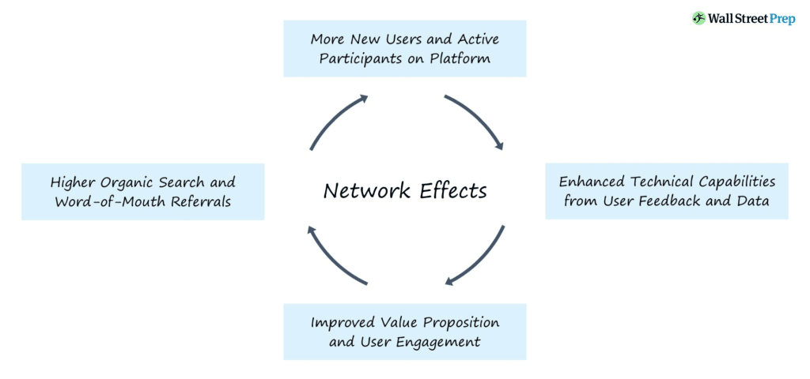
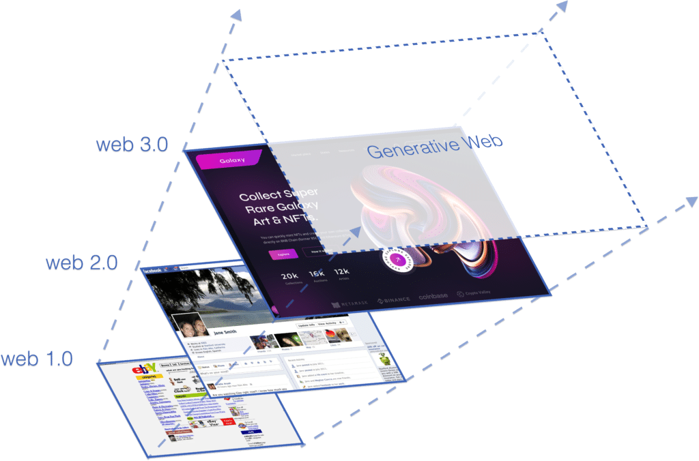

The explosion of AI companies over the past year has been overwhelming.

It seems to have become the norm to feature “AI” in your branding to capitalise on this AI gold rush.

This makes it challenging to navigate the hype and distinguish the wheat from the chaff – even for someone like myself, who’s spent the last year researching this topic, creating articles on it and building workshops on AI.

In this article, I’ll share my experience to ensure you can look beyond the AI hype, understand the current trends and, critically, ensure your startup cuts through the AI noise.

#### Contents

## The Hype of AI-powered Companies

Developing an AI model is very expensive and requires significant resources in both talent and computational power.

Consequently, most of the models in use come from a select few providers whose core business revolves around AI, making them fully **“AI-Driven.”**

Companies like [OpenAI](https://openai.com/), [Google](https://ai.google/), [Anthropic](https://www.anthropic.com/), [Cohere](https://cohere.com/), and [Mistral](https://mistral.ai/) supply their models to the broader market.

Other companies access these models via APIs and adapt them to their specific business cases. This results in a significant portion of the generative AI market being merely **“AI-powered,”** without any proprietary rights over the models themselves, only over their application.

The value of these companies lies solely in investing in the application layer of the **AI Value Chain.** ([see my previous article on this](https://altar.io/launching-a-startup-in-the-age-of-generative-ai/))

While application layer apps were still novel in 2023, by 2024 they have become the norm, reducing their role as differentiators.

As AI becomes more normalised in everyday activities, integrations with core models will no longer be perceived as added value but rather as standard.

Tools that rely solely on AI integrations for their core value will eventually be seen as just more noise amidst the already overwhelming array of tools people use today. Therefore, it’s crucial to understand how to successfully navigate the application layer when building an AI-powered business.

## Navigating the AI Hype & Moving Beyond It

When ideating a new venture within the AI space, it is essential to consider AI resilience factors that will make a company resistant to the constant evolution of the tech landscape.

Many companies offer easy ways to build customised knowledge centres, chatbots, AI agents, or process enhancements with AI.

However, these use cases aren’t particularly resilient to the evolution of AI technology itself.

Building a company reliant on AI integrations is not a sustainable strategy, as users are increasingly integrating AI directly into their own environments.

As models become more powerful, users will easily replicate these dynamics in their setups, reducing dependency on third-party providers beyond the model creators.

So, the question is - **“what builds resilience?”**

Based on my expertise, here are four key focus areas that form the winning formula to navigate the AI hype:

### 1\. Network Effects - Make it Hard to Leave

The most defining success and resilience factor for a company is its capacity to provide a powerful network effect.

A network effect occurs when a product becomes more valuable as the number of its users, tools, or data centres (nodes) increases.

Actively considering strong network effects is crucial for success when starting a future-proof company.

Examples of companies with strong network effects include Google, Facebook, Amazon, and Reddit—products whose value grows with the number of users or nodes in their network.

Companies with strong network effects can easily evolve their business models, capitalising on their network inertia (user base) to drive innovation efforts.

This is crucial in an age where **the tech world is constantly changing**, especially with the hybrid and multimodal nature of Generative AI.

Generative AI can play a decisive role in intermediating these node connections by processing information into more convenient formats.

There is a significant trend of companies implementing AI integrations for text manipulation, not only to accelerate content production but also to simplify its consumption by making it more convenient, easier to read, and faster to deliver.

Here, Generative AI acts as a catalyst for the network itself, enhancing the overall value proposition of the network.

##### Looking to Integrate AI into Your Business?

Get straight to the point, jargon-free advice on transforming your tech strategy by leveraging AI from an expert that has been building award-winning Startups for the past 10 years.

Let's Talk

### 2\. Privileged Data Access - Share What No One Else Can Share

Data is the new gold. If you didn’t believe that 10 years ago when Big Data was the buzzword - with generative AI I think that statement becomes quite trivial.

As such, having privileged access to a specific data set is a big anchor for your business.

Focusing on a specific data point that only you can harvest, that can be converted into a lot of value - especially with the help of Generative AI.

_It’s important to be careful though, as when relying too much on third-party generative models one might be serving those companies with that same data point. Especially the big ones (OpenAI and Google)_

Examples of privileged data access include local user bases gathered through data acquisition mechanisms that extend beyond traditional web surfing. This encompasses private databases, location-specific data from in-person events, and off-grid data sources like old books and other non-digital materials.

Companies like [DT Heritage](https://heritage-digitaltransitions.com/) exemplify this privileged access. They can leverage comprehensive AI-powered mechanisms to enhance their services while maintaining a unique reference database (in this case, old archives) that large general models lack access to.

Related: [AI Agents: How Klarna replaced the work of 700 Humans in 1 Month](https://altar.io/ai-agents-for-startup/)

### 3\. Subject Matter Expertise - Sell Your Specialisation

Specific problems require specific solutions. While the future envisions a world where AI enables users to create virtually anything on demand, current generalist models can only process information within their limited context windows.

Therefore, companies should develop mechanisms tailored to address complex problems within specific subject areas. By combining prompt engineering and fine-tuning generalist models, they can create powerful tools tailored to particular fields of study. This approach provides users with the necessary guidance within more complex realms.

Problems like engineering, hard sciences, corporate management and other complex tasks, can be powered by AI when built within a well-defined user journey.

The possibilities are infinite, and the first players to fully capture solutions for specific fields of expertise can retain a huge portion of the market with an AI-powered solution.

Examples of this are the current explosion of biotech companies powered by AI, such as [NotCo](https://notco.com/) which actively uses AI to facilitate the development of replacement food products.

Full Name Business Email Subscribe

### 4\. Make Lives Easier - a Key to Recurrence

One key aspect of the modern day is the overwhelming existence of noise and entropy within the digital world.

In the attempt to solve many problems, users these days have to deal with a very fragmented environment of apps, accounts and so on.

A powerful system designed, and powered by AI, can create an interesting recurrence in apps if that can solve this challenge.

AI agents make that case, where an AI is designed to enable different services in one’s device to execute tasks that previously would require a lot of enablement steps by the user.

This simplification of the user journey will prove to be crucial in the future - as the tech world will grow into multi-model formats beyond the screen and the keyboard.

Media formats like audio recognition, image recognition, spatial recognition and others are coming to blend with traditional UX practices, opening a lot of space for innovation.

Very shortly, users will be even more demanding regarding apps' capability to offer the past of least resistance to users.

With the massification of AI usage, users will start to be more demanding of the UX capabilities of services. As such this will be a crucial differentiator. See my [previous article](https://altar.io/generative-web-product-ux-audit/) on this.

## Conclusion

Navigating the AI landscape requires more than just riding the wave of the latest trends. It necessitates a thoughtful approach to ensure long-term resilience and value creation.

By focusing on network effects, privileged data access, subject matter expertise, and simplifying user experiences, startups can build sustainable and competitive advantages in the ever-evolving tech ecosystem.

Embracing these strategies will not only help in standing out amidst the AI hype but also in crafting a robust business model that can withstand the constant advancements in AI technology. Ultimately, it's about leveraging AI thoughtfully and strategically to create real, lasting value, rather than merely capitalising on a buzzword.

Companies with strong network effects can easily evolve their business models, capitalising on their network inertia (user base) to drive innovation efforts. This is crucial in an age where the tech world is constantly changing, especially with the hybrid and multimodal nature of Generative AI.

Generative AI can play a decisive role in intermediating these node connections by processing information into more convenient formats. There is a significant trend of companies implementing AI integrations for text manipulation, not only to accelerate content production but also to simplify its consumption by making it more convenient, easier to read, and faster to deliver. Here, Generative AI acts as a catalyst for the network itself, enhancing the overall value proposition of the network.

Thanks for reading.
