Innovation brings about increasing capacity to automate tasks.

At the edge of innovation in AI, we are starting to see teams of specialised autonomous agents perform complex tasks, which would take a team of humans weeks of work to accomplish.

To me, the idea of having a team of AI agents do the boring aspects of my work, while I get to focus on more creative endeavours sounds epic!

[In a previous article](https://altar.io/ai-agents-for-startup/), I explored the concepts behind LLMs, Chains, AI Agents and Multi-Agent Systems (MAS).

When I talked about chains, I pointed to frameworks like [LangChain](https://www.langchain.com/) and [LlammaIndex](https://www.llamaindex.ai/), and later when talking about agents, I referred to frameworks like Microsoft [Autogen](https://microsoft.github.io/autogen/), [CrewAI](https://www.crewai.com/) and [LangGraph](https://www.langchain.com/langgraph) to build multi-agent workflows.

That article felt complete until last month when I got the privilege to sit in at the [Mindvalley AI Summit](https://www.mindvalley.com/mastery/ai). There, I watched a talk from AI Entrepreneur and Investor, [Juan Martitegui](https://www.linkedin.com/in/juanmartitegui/). In it, he showcased how to trigger a team of AI agents to:

1. Automatically generate ideas for YouTube videos based on a given topic
2. Rank the previously generated ideas
3. Do market research of the top performing YouTube videos in the topic, collecting metrics such as views, subscribers, likes
4. Write the script for a video recording of the top-ranked idea
5. Generate copy for social media posts
6. Write a report
7. Send the report to the speaker’s email

**All this was accomplished in under 1 minute, costing less than $1, with a great quality of output, AND very little code!**

**I was impressed!**

The tool used was [Flowise](https://flowiseai.com/).

Disclaimer:

Altar has no commercial affiliation with Flowise. Please note that neither Altar nor I receive any financial benefit should you choose to use Flowise.

For an alternative, you can also look into [LangFlow](https://www.langflow.org/), which, despite being owned by DataStax, maintains its open-source nature.

In this article, I delve into the leading data frameworks that empower the development of LLM-based applications, with a particular focus on Flowise.

I'll share my initial experience with Flowise and explain why I believe it's a game-changer for constructing AI agent workflows. I'll also present a real-world use case where Flowise has already saved me hours of work.

Additionally, I'll discuss the essential components for assembling an AI team and provide a guide on how to build your first AI agent team, even if you have no technical background.

#### Contents

## Building Agent Teams with Low/No-Code

While the idea of building AI agent teams might seem daunting, especially if you lack a technical background, the rise of low and no-code tools has made this more accessible than ever.

These tools are designed to bridge the gap, allowing you to construct sophisticated AI-driven applications without needing to dive deep into code. Let’s dive into how you can get started with Flowise, but first, it’s important to understand the underlying data LLM frameworks that power Flowise, and similar tools.

### LLM Data Frameworks

LLMs are powerful, no doubt.

In order to harness this power in applications, a few so-called data frameworks emerged.

The most used data frameworks today are:

1. [LangChain](https://www.langchain.com/) – which simplifies the process of creating generative AI apps, connecting data sources, vectors, tools and memories with LLMs. As the name suggests, it is used to create Chains - i.e. pre-defined sequences of tasks to be performed via an LLM.
2. [LlamaIndex](https://www.llamaindex.ai/) – which allows LLM applications to ingest, structure, and access private or domain-specific data. It is ideal for search-centric applications.
3. [LangGraph](https://langchain-ai.github.io/langgraph/) – which, like LangChain, simplifies the process of building generative AI apps, however, it goes one step further and is focused on the creation of Autonomous Agents. Similar to AutoGen and CrewAI.

Although extremely useful, putting these data frameworks to use still requires you to be able to understand and manipulate code.

### Flowise: UI on top of Data Frameworks

**To eliminate this barrier, Flowise complements data frameworks, like LangChain, LangGraph and LlamaIndex, offering an open source, drag-and-drop, user interface to building chains and agent workflows.**

Flowise is a no-code platform designed to accelerate the building of AI systems. It allows you to automate complex workflows without the need for extensive programming knowledge.

It increases accessibility to these powerful tools so that anyone can benefit from them. And, simplifying the process of creation of these workflows, also makes it easier to learn what it all means in practice.

The promise is simple - instead of coding, drag and drop elements like - model X and tool Y, to build your agent workflows.

### Getting Started with Flowise

When you first go to the Flowise website, it prompts you to “Request Access”.

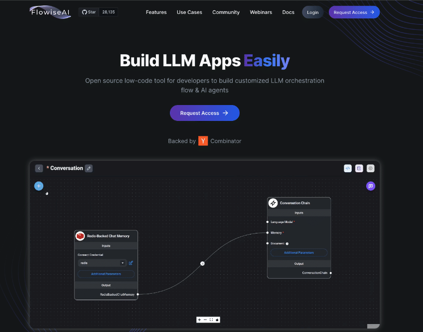

At this point, you could leave your email and wait for a reply.  I haven’t received a reply from the access request I made last month, so my guess is that this is only a way to collect interest for a hosted SaaS service.

However, **it really makes no sense to wait.**

It is an open source project, with an open GitHub [repository](https://github.com/FlowiseAI/Flowise).

You can go ahead and install it directly on your computer, or in the cloud solution of your preference. For simplicity, I’ll go over the steps required to run it directly on your laptop.

#### 1\. Installation: Flowise on your laptop

If you go to [Flowise’s GitHub repository](https://github.com/FlowiseAI/Flowise), you will find installation instructions:

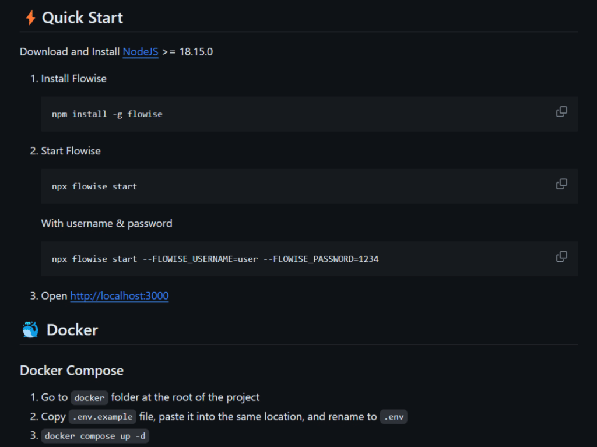

**Failed to run it using npx:**

I first went through the route of installing flowise via NodeJS and npx as indicated in the “Quick Start” and, after a bit of searching and error handling I got it installed. However, when I tried to run my first agent workflow, it would not really work, or provide a traceable error - I opened an issue [here](https://github.com/FlowiseAI/Flowise/issues/2927#event-13763723201).

Then, I installed it via Docker and it worked perfectly!

**Here is my recommended step-by-step installation:**

1 - [Install Docker](https://docs.docker.com/engine/install/) (if you don’t have it yet)

Docker has a beautiful desktop app which helps non-technical users run containers without having to go too deep into the technical concepts.

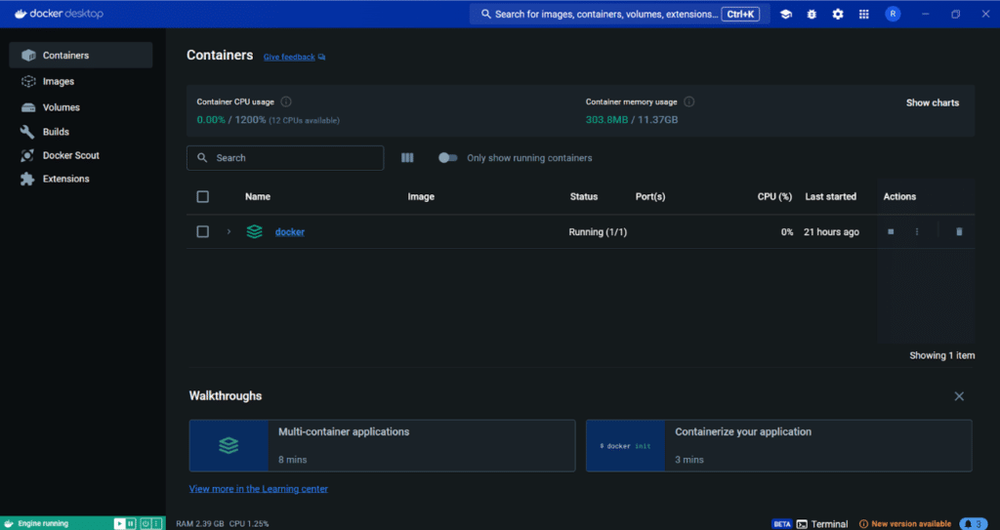

Put very simply, it allows you to run an application alongside everything it needs to operate it (all its dependencies), so other things you have installed in your machine do not interfere - processes are “contained”.

2 - [Install VSCode](https://code.visualstudio.com/download) (if you don’t have it yet)

3 - [Install Git](https://github.com/git-guides/install-git) (if you don’t have it yet)

4 - Download Flowise: Go to [Flowise github repository](https://github.com/FlowiseAI/Flowise), click the green button “code” and copy the url. In your terminal, run:

This will create a folder called “Flowise”.

5 - Open the “Flowise” folder on VSCode and copy-paste ‘.env.example’ into a new file called ‘.env’:

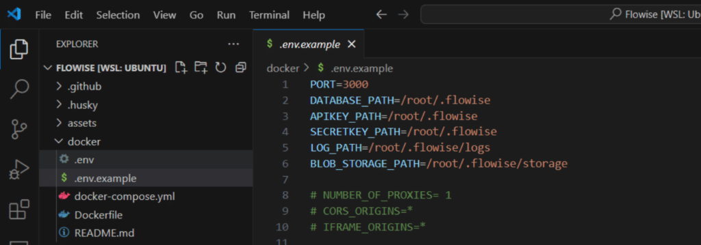

Docker will use this environment file to define key variables like which port will be used to access the dashboard.

6 - On a terminal, run:

7 - Open your browser on _localhost:3000_

Here you have it! 🥳

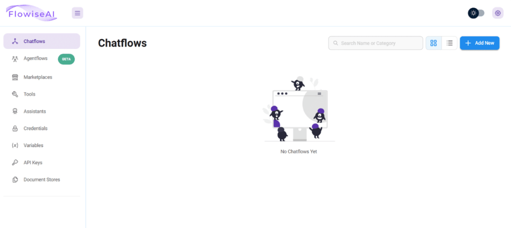

Now you will be able to see the Flowise dashboard, which is running on your computer, and you can start creating your AI agent teams. üéâ

#### 2\. Important Concepts

In this section, I will go over the concepts that are necessary to grasp in order to make good use of Flowise.

**Chatflow vs Agentflow**

Initially, Flowise launched only with ChatFlows which enables you to build workflows with the functionality of LangChain and LlammaIndex. This means that it is directed at the creation of chains, i.e. pre-defined processes that LLMs should perform.

If you run a Chatflow, you will know exactly which steps will be run, which might be exactly what you want - predictability.

Agentflows were launched afterwards (still in beta) and the difference is that they allow you to create truly autonomous teams. It is built on top of LangGraph and comparable to CrewAI or Autogen.

If you run an AgentFlow, a Supervisor Agent will define what happens with your prompt, and orchestrate the team to execute a sequence of actions to best respond to your request.

**Supervisor + Workers**

In Agent Flows, which I used to build my team of AI agents, the default and simpler architecture is the one of a Supervisor Agent, plus, multiple Worker Agents:

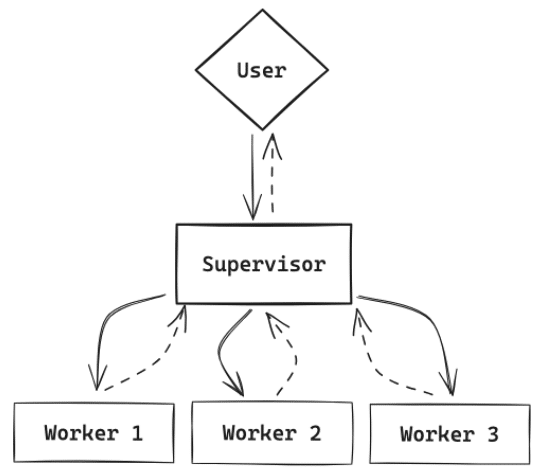

In this architecture, the user will define **roles** for each agent, where different workers have different roles.

Then, the user will initiate a conversation and always interact with the supervisor agent, who will then orchestrate the tasks.

The supervisor defines which sub-tasks need to be performed and selects which worker is more fit for a specific task.

#### 3\. Walkthrough #1: Creating a workflow from a template

Diving into the Flowise dashboard, we can see that there are a few concepts to understand and navigate.

A good place to start is the _Marketplace_ tab, which offers a list of examples of workflows, which you can look into a test for yourself:

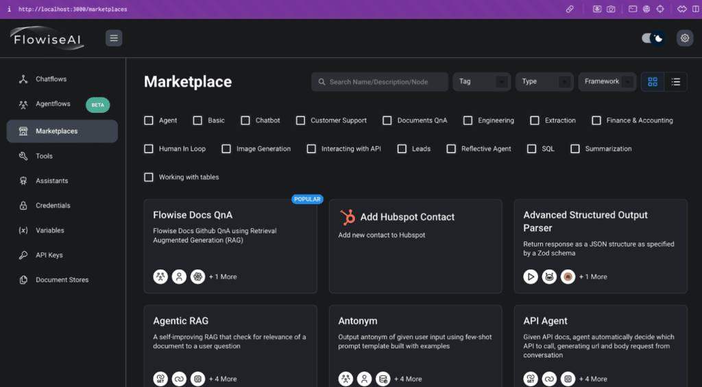

You can select a workflow you like and use it as a template, instead of starting from scratch.

As my first experiment, I tried a WebBrowser Workflow.

Then, I:

1. Clicked “use template”
2. Connected my OpenAI API keys to each ChatOpenAI module
3. Saved this flow as “Website Analysis Flow”

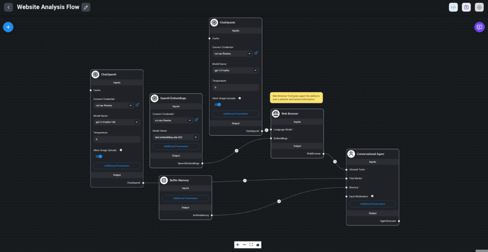

Then, I clicked the purple chat button on the top right corner and started interacting with the workflow:

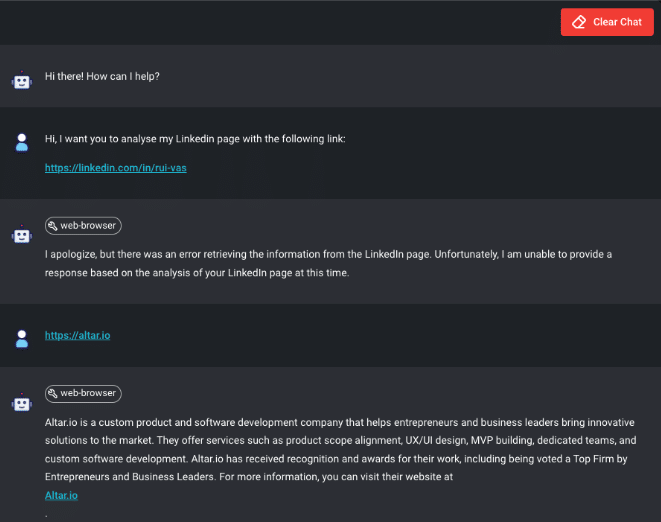

The workflow was not able to extract information from my Linkedin profile. Probably due to restrictions from the Linkedin platform, however it was able to access and extract information from the Altar.io website.

Now, this workflow has been saved persistently under the “ChatFlows” tab, and I can tweak it, and use it anytime.

#### 4\. Walkthrough #2: Creating an Agent workflow from scratch

In order to create my first AI Agent team from scratch, I went to \`Agentflows\` and clicked the “Add New” button:

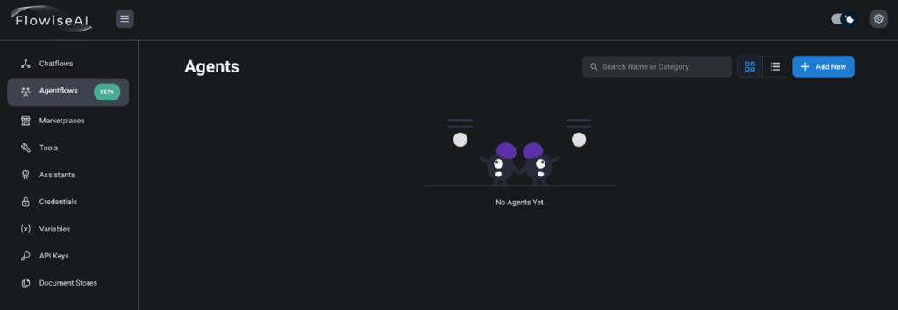

Then, in the empty canvas, I clicked the “+” button.

The first highlighted nodes are - _Supervisor_ and _Worker_. So, I dragged & dropped one _Supervisor_ and two _Workers_ into the canvas:

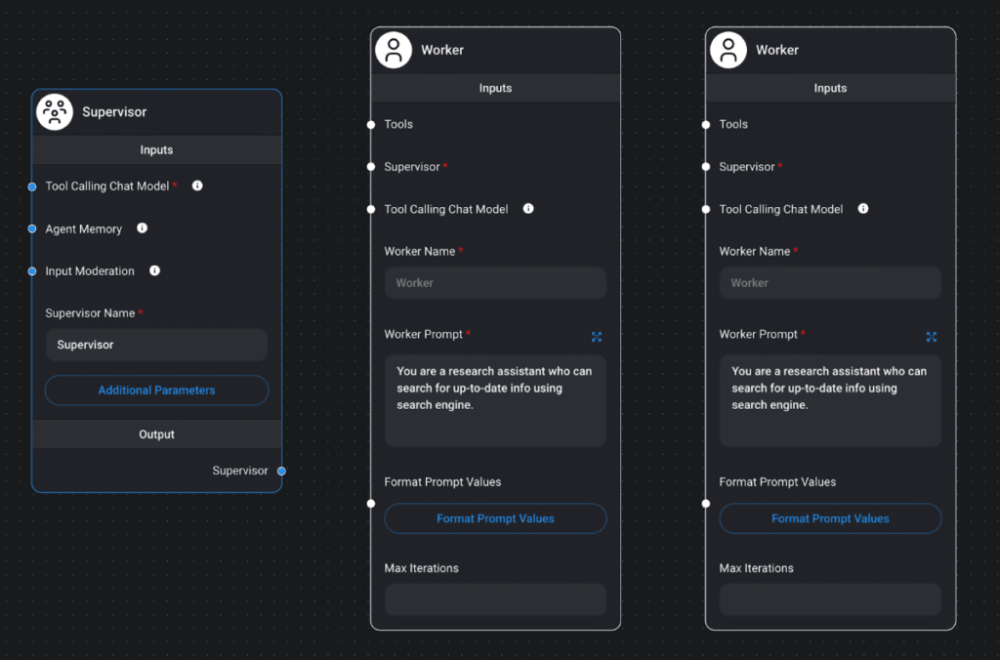

Next, I added a Chat Model as “the brain” of my agent flow and **connected** all the nodes.

For this experiment, I used **Chat Models** > **ChatOpenAI**.

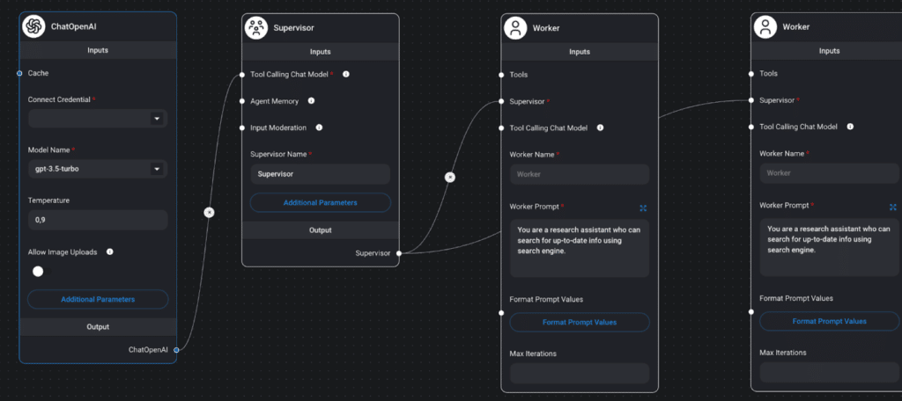

Until now, I focused only on creating a generic team of three agents. Next, to get this team of three AI agents to run, I needed to connect my OpenAI API key to the first node and write prompts for the workers.

Here, I get to assign roles and responsibilities for each worker, and how it should go about solving its tasks.

Now, it’s time to think about real use cases.

### Real World Use Case - AI Event Curation Team

In order to show the capabilities of this technology, I thought of a practical use case that would make my work easier.

As an AI practitioner and a naturally curious person, staying current with the latest trends means attending events where I can find inspiration to keep creating my best work.

However, with so many things going on, choosing where to be is no easy task - as my calculus professor would say - “it’s non-trivial”. With that mission in mind, I thought of creating a team of AI agents that would find and curate events for me.

The way I want the system to work is: Given a city, a topic and a month - e.g. Lisbon, AI, September - the AI team would:

1. Search for events across Google Search, Eventbrite and Meetup
2. Compile a comprehensive list of events with links, organisers and dates
3. Email me the compiled list in a report

My team of AI Agents will need, not only reasoning capabilities, but also access to the following Tools:

1. [Google Custom Search](https://programmablesearchengine.google.com/about/)
2. Capacity to send the report via Email

Hence, I started by testing the capabilities of these tools and later, I put it all together.

#### 1.  Google Search Tool

To test the [Google Custom Search Tool](https://programmablesearchengine.google.com/about/), I started by creating a simpler version of the team, with a supervisor and 2 workers:

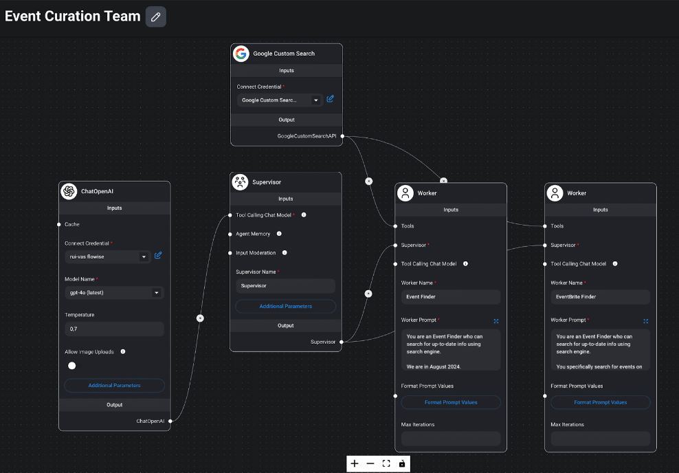

Here, both workers perform searches using the Google Custom Search tool, being that _Worker #1_ performs an open Google Search while _Worker #2_ searches specifically on Eventbrite.

When we open the chat and give it a topic and city:

1. The _Supervisor_ creates a mission - “Find events related to {topic} in {city}.”
2. Calls _Worker #1_ with that prompt
3. _Worker #1_ uses Google Search to find and list events

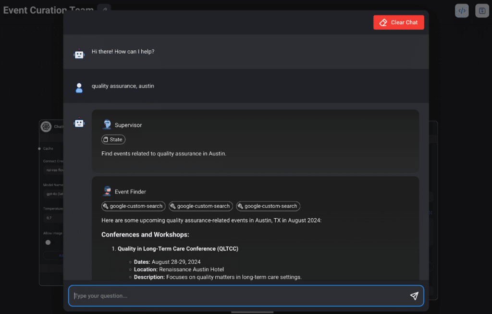

Next, the _Supervisor_ calls _Worker #2_ with a prompt to search for events in Eventbrite

_Worker #2_ then uses the same Google Search tool, to find and list events that are on Eventbrite

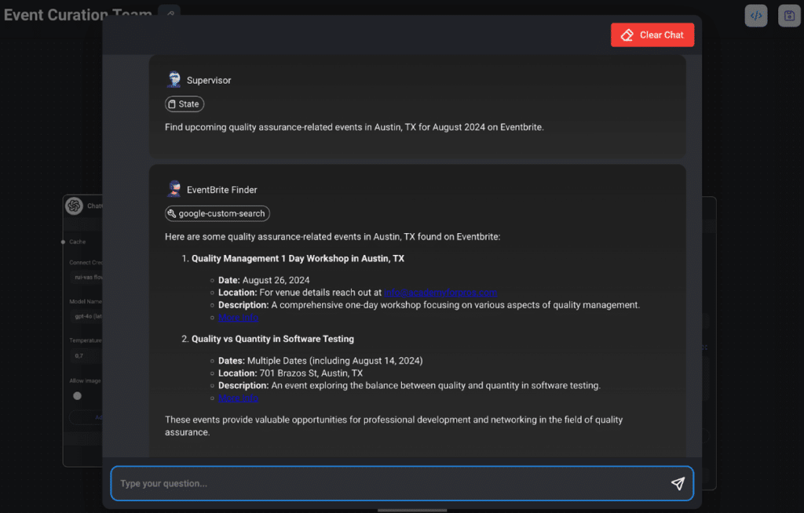

By clicking on “More info”, I can verify that these events are listed on the Eventbrite website.

It works pretty well.

So next, I setup the email automation.

#### 2\. Email Tool

In order to set up email capabilities within Flowise, the [suggested method](https://docs.flowiseai.com/use-cases/webhook-tool) uses [Make.com](http://make.com), where an automation is built by connecting a webhook to Gmail.

Do not worry if this feels complicated, the UX and documentation is VERY straightforward, and it takes about 2 minutes to get it running.

![Setting up an email webhook in Make[dot]com](images/Screenshot-2024-08-26-at-16.34.40.png)

Once I made and tested that the webhook connection to email was running, I added it to the workflow and the Email Sender agent was not able to email me a report.

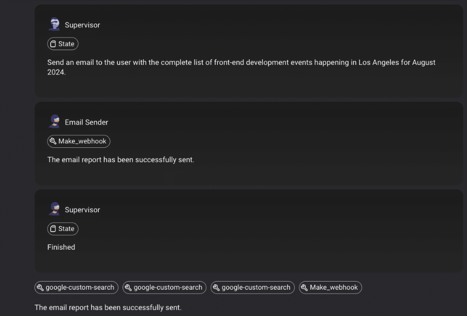

On the Flowise side, I added two more agents to our previously three-agent team, a _Report Writer_ and an _Email Sender_.

The _Email Sender_ agent is connected to a Custom Tool, which is the one that connects to Make.com via webhook as documented [here](https://docs.flowiseai.com/use-cases/webhook-tool).

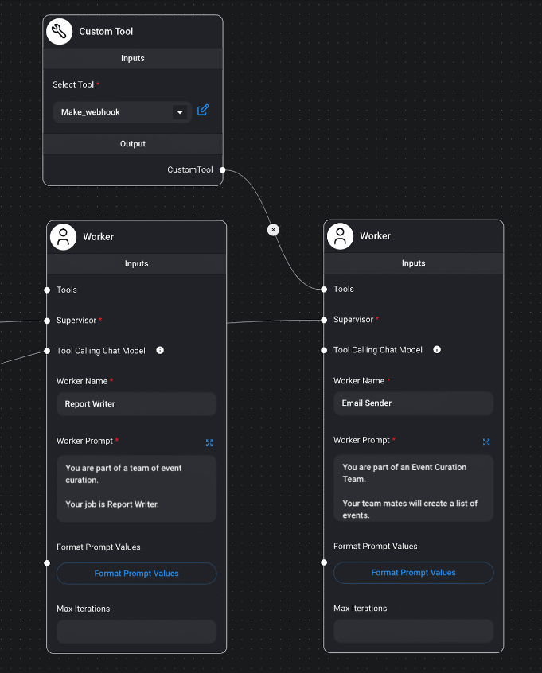

The reason for adding an extra agent as a _Report Writer_ was that I needed to convert the text output into HTML.

At first, I did not do that, and received an email that looked like this:

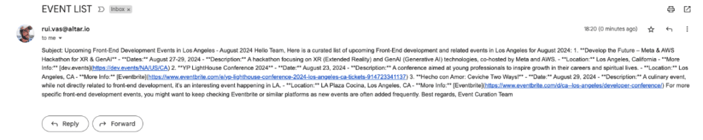

As you can see, not easy to read!

By assigning an agent to report writing, the email arrived much cleaner:

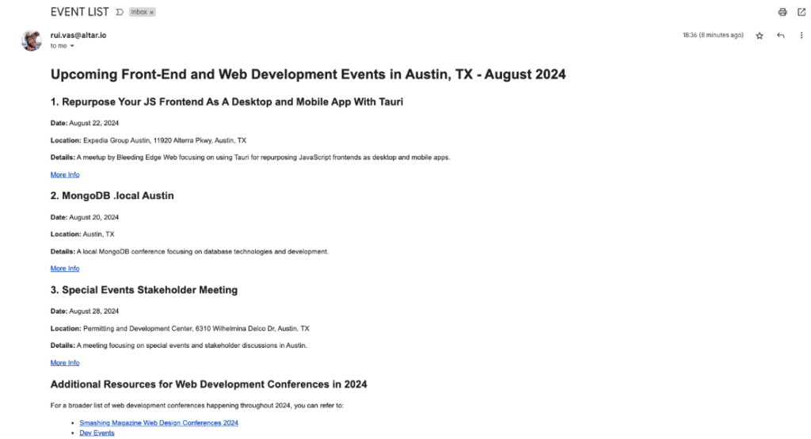

I want to underline, I used very simple prompts for all _Worker_ AI agents. As an example, here is the _Report Writer’s_ prompt:

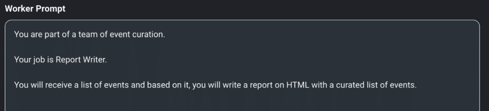

#### 3\. Putting it all together

Now that I tested the functionalities of simple agent teams, Google Search Tool and Email, it is time to tweak and play with the system to get the best results.

I decided it was a good idea to create a team of six AI Agents:

1. **Supervisor:** Oversees the Project
2. **Worker #1:** Event Finder on Google
3. **Worker #2:** Event Finder on Eventbrite
4. **Worker #3:** Event Finder on Meetup
5. **Worker #4:** Data Aggregator + Report Writer
6. **Worker #5:** Emailer - Automates the sending of the email

This is what it looks like on Flowise.

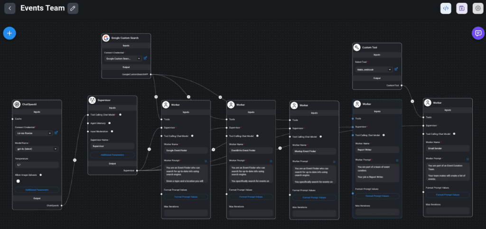

## 3\. Results

Up until this point, the prompts were very simple and did not constrain behaviour too much. And still, you can already see a tremendous benefit to this teamwork.

I’m wondering if I should go to New York in September 2024 for work, so I ask my AI Agent team, and it lists relevant AI events there:

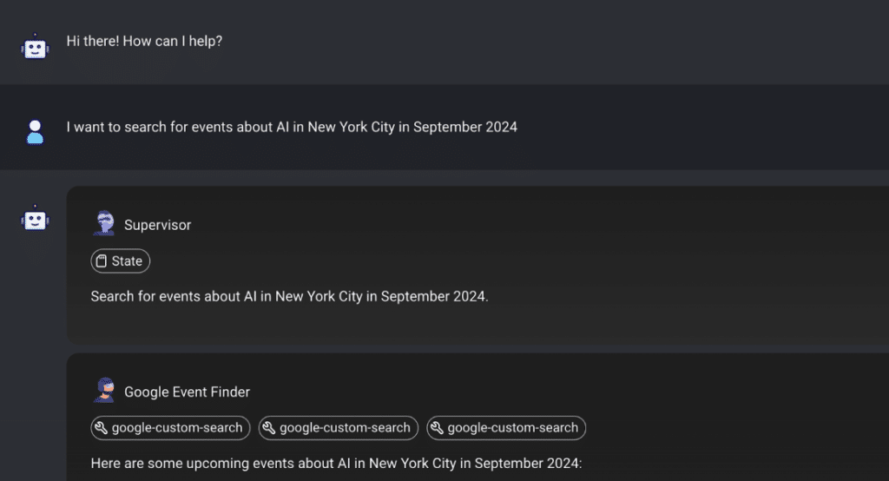

I then received an email with a comprehensive list:

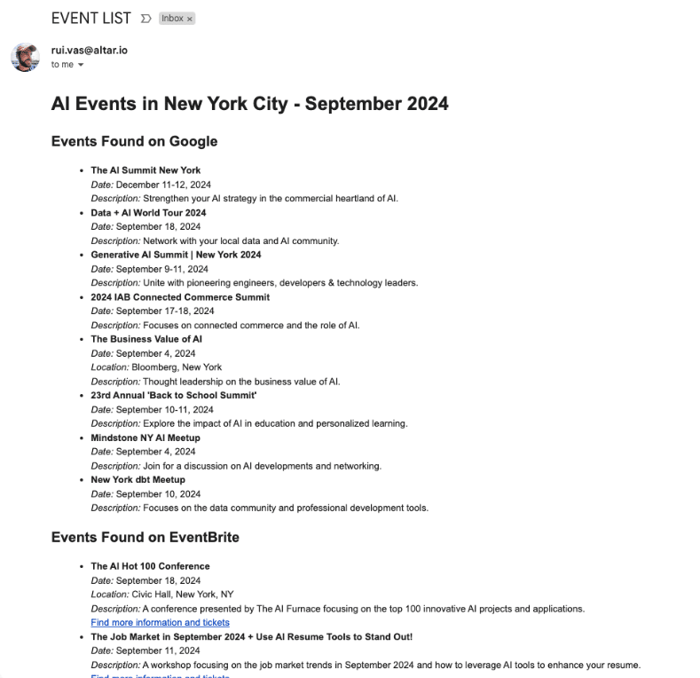

I noted that an event in December is also listed, however, seems pretty relevant for me to know, so I’m even happy about it.

I would like to also have links to every event that gets listed, so I simply add that to the prompt of the _Report Writer_ worker and _voila_:

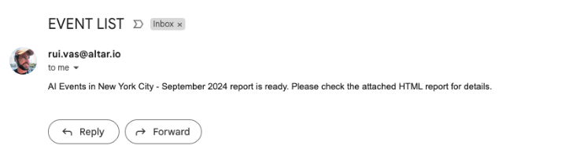

It didn’t work! I received this without an attachment - oops! Haha.

I make a point of this to say that it's clear that my AI agent team needs tweaking to ensure that the responses are consistent and robust enough.

It’s made me realise that it’s smart to put some guardrails in place, to make sure that the desired behaviour is accomplished regularly.

Yet, after some tweaking, the results are pretty exciting!

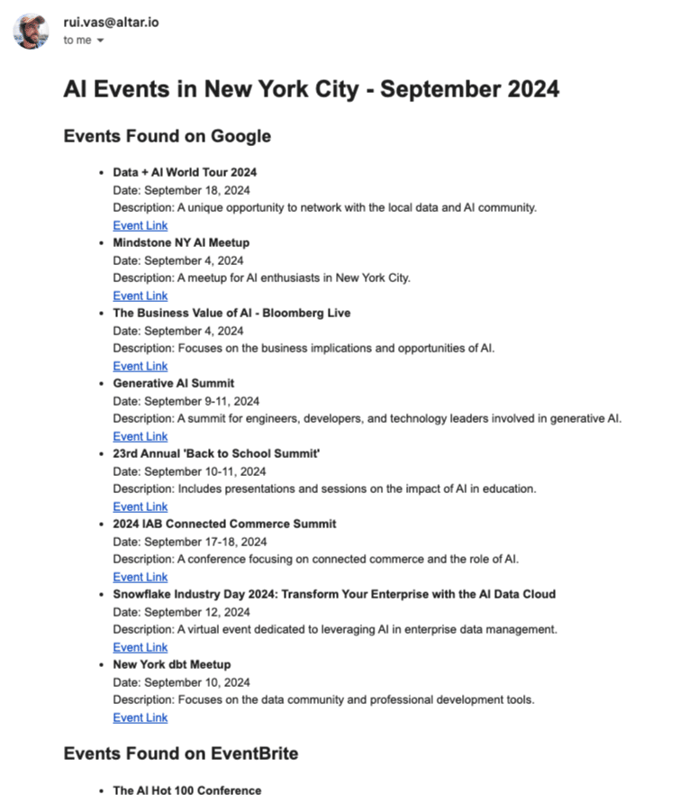

Finally, I received a comprehensive list of events based on a prompt where I have a city, relevant topic and month…

Next, an event scoring/curation agent could score each event depending on speakers, or brand awareness, and add these metrics to the report.

Alternatively, I could make the system more complex to compare cities and times of the year to go to a specific city.

## Wrapping Up

AI agent teams are here, and they are getting easier to build, operate and get value from.

Flowise is a game-changing tool that democratises the creation of AI agent teams by eliminating coding barriers, enabling users to build powerful autonomous workflows that save time and enhance productivity.

Through simple drag-and-drop functionality, users can set up complex AI systems for tasks like event curation, automating tedious work, and focusing on more strategic initiatives. This tool has the potential to revolutionise how individuals and businesses harness AI to achieve their goals.

_**If you’d like to learn more about how to implement AI systems into your startup, reach out to me [here](mailto:rui.vas@altar.io). I’d be happy to help!**_

_**Thanks for reading.**_
