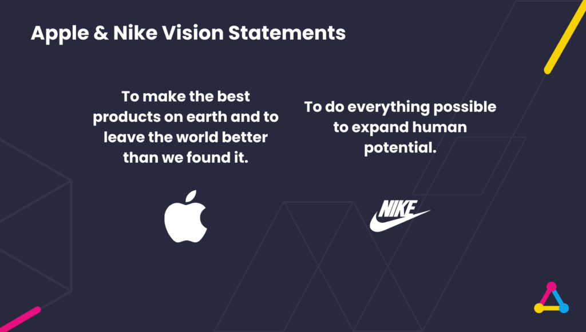

Long before joining Altar, nearly a decade ago, I founded my first tech startup and was quickly thrust into the myriad challenges of entrepreneurship. The learning curve was steep, from [developing the product rationale](https://altar.io/how-to-setup-your-startup-mvp-for-success/) to finding the [right technical stakeholders](https://altar.io/whats-the-best-way-to-build-your-startup-cto-freelancers-agency/) and crafting an early-stage marketing strategy.

Since then, I’ve worked in several early-stage startups, participated in the [500 Global Startup Accelerator](https://500.co/), and helped numerous startups develop their go-to-market strategies.

Throughout this journey, early-stage founders have consistently asked me similar questions: “How should we position ourselves in the market?”, “What’s the best way to ensure all teams are aligned on our narrative?” and “How can I better understand my target market?”

To provide a fresh perspective, I contacted [Maria Cate](https://www.linkedin.com/in/mariacate/), an expert in early-stage startup marketing. With a wealth of experience from working with major corporations like Red Bull to startups like [Whoop](https://www.whoop.com/eu/en/), Maria recently co-founded [Cooth](https://cooth.co/), a consulting meets creative firm dedicated to accelerating growth and building impactful marketing strategies for startups.

In our conversation, Maria shares a comprehensive A-Z guide on crafting your early-stage startup marketing strategy.

Let’s dive in.

#### Contents

## Understanding Your Target Market

**Filipe: Maria, thank you so much for joining me today.**

**My first question is about understanding the market. Startups often struggle with identifying and reaching their target market. In your experience, what are the key steps a startup should take to understand its market and audience?**

**Maria:** There are several key steps involved in understanding your market and ensuring that what you’re building resonates with your target audience. And it can’t be understated just how crucial it is.

The first step is market research. You don’t necessarily need to hire an external firm for this; it’s something you can do yourself.

The goal is to dig deep into understanding your target demographics:

- Who is your audience?
- What do they care about?
- What do they need?
- What are their behaviours and preferences?

Understanding exactly who you’re going after is essential.

Next, you’ll want to conduct a competitive analysis. Looking around your industry and analysing who else is playing in your field.

This should involve a:

- Competitive analysis: where you assess direct competitors
- Comparative analysis: where you also consider indirect competitors.

The purpose here is to understand who the big players are, their positioning strategies, how they communicate with their customers, and how they present their unique value propositions.

Through this process, you’ll begin to identify what we call [white space opportunities](https://www.zendesk.com/blog/white-space-analysis/) – gaps in the market that your competitors are not addressing.

These gaps represent opportunities for your business to carve out a niche and own that segment. This is where market research, competitive analysis, and audience research all converge to help you determine the best way to position your company in the market.

Additionally, performing a [SWOT analysis](https://www.investopedia.com/terms/s/swot.asp)—evaluating your strengths, weaknesses, opportunities, and threats—can be beneficial as you work through your market analysis.

For early-stage startups, where resources are often limited, these are all things you can do on your own without a large budget. I’d also recommend staying informed by consuming as much industry news and coverage as possible.

Becoming an expert in your market is crucial because, ultimately, you need to know it better than anyone else if you’re going to succeed in selling into it.

## Aligning Product & Marketing

**F: I completely agree. I’ve worked with many founders in the past, and I always tell them that they are the best people to know what their business needs.**

**I want to move onto the topic of aligning product and marketing – and the fact that they can’t exist in isolation.**

**In your experience, how important is it for startups to align their product development and marketing strategy from day one?**

**M:** It’s vital. I know we both agree on this but it’s worth stating – you can’t market something that doesn’t exist.

It’s crucial that, first, you have the product roadmap in place. Then you need to state the product and feature milestones. Lastly, the entire organisation must be aligned on all of the above – regardless of its size.

And to do that, you must have regular touchpoints in place. It’s the best way to ensure you’re communicating real value to your customers.

Often, especially in the early stages, you’re selling a vision—what the product will be in two or three years.

That’s fine for getting big players on board and shaping your product around them, but in the initial stages, you must think about what your customer wants and cares about, and build around that.

Customer interviews or prospect interviews are vital to achieve this. You need to understand the “why” behind what you’re building, and this should be done without showing them your product. Focus on learning what they’re currently using and how you can solve the issues they’re facing.

Once you start building the product, you then have to create consistent messaging that your team can align with and support. It’s important to be truthful about what your product can do.

What are the key features of your MVP? How do they align with customer needs? Begin to build messaging around this value proposition in your marketing materials.

There’s a lot to consider. You might have a great product, but you also need users. We’ve seen success with startups running teaser campaigns by creating a landing page, prompting sign-ups for a waitlist, and clearly presenting the value proposition.

This approach helps generate excitement and early user interest, allowing you to bring in beta users, test the product, and gather valuable feedback.

From there, it’s about expanding and scaling the product without breaking it, which you know more about than I do.

Then, think about launches. How will you continue to iterate, improve, and bring more users on board? Building brand campaigns around these iterations is a huge opportunity.

Depending on whether you’re in B2B or B2C, involving your customers in the process can be very powerful. The feedback loop is essential—how are you gathering feedback and turning it into actionable features and updates?

And how are you integrating this into your marketing messaging and the value you bring to customers? There’s a lot to it, but those are the key elements I consider when considering consistency between product development and the marketing message.

## How to Position Your Startup in the Market

**F: Completely, and it’s an especially important point for new founders. Many people still see product and marketing as separate silos, especially in larger companies where these departments might even be in different buildings or floors.**

**But it’s crucial for product and marketing to be aligned from the start.**

**The marketing process for a startup is very similar to the product development process. Both involve talking with your users, gathering feedback regularly, and integrating that feedback to improve.**

**In marketing, it’s about refining your messaging, as you mentioned, and there are so many synergies between marketing and product that are crucial, especially in software development. It couldn’t happen any other way.**

**Let’s move on to a very interesting topic: positioning.**

**Positioning is critical not only for startups but for any company. However, it’s particularly important for startups as they try to figure out how to position themselves in the market and stand out.**

**What strategies do you recommend for startups to position their product in the market?**

**M:** Positioning is something I’m very passionate about. It’s all about brand—it's the essence of who you are. What makes you different? What sets you apart? How do you fit in the market?

Assuming you’ve done the groundwork we discussed earlier, like competitive analysis, market research, and understanding your target audience, the next step is to focus on having a strong brand strategy and brand identity.

Brand strategy is both internal and external:

- Internally, what are your brand’s core values? What resonates with everyone in your organisation?
- Externally, how do you show up in the market through your messaging?

People connect with people—they want to do business with brands they like. So, think of your brand as a personified version of what you’re selling.

What are its core values? What does it believe in? And what do you, as an organisation, stand for?

Developing your mission statement and vision statement is also key. Your mission statement should articulate the value you provide to the market, while your vision statement should express the impact you want to have on the market.

The vision statement should be aspirational, something that scares you a bit, representing the change you want to see in the world that your business is driving forward.

Many say that a vision statement shouldn’t even describe what your company does – if you look at the vision statements of companies like Apple or Nike, they don’t explicitly state what they do but capture the essence of why they exist.

When it comes to strategic brand positioning, there are many messaging components agencies talk about, but for startups, I think the most important ones are the brand **positioning statement** and the **brand promise**.

Your brand positioning statement should clearly define your [unique value proposition (UVP)](https://altar.io/mastering-the-art-of-communicating-your-startups-value-proposition/) – what makes your company stand out and what outcomes your customers can expect. This UVP is something that no one else can take away from you.

The brand promise, on the other hand, is what every customer can expect from you when they do business with you. It’s the foundation of customer support and customer success—it's the promise that everyone will experience the same level of service when they interact with your brand.

Another important element is the tagline. Taglines can be fun and memorable. They’re a quick, hard-hitting way to communicate what your brand does.

Think of Nike’s “Just Do It” or Red Bull’s “Red Bull Gives You Wings”—these are simple yet powerful phrases that people remember and that resonate with them.

Finally, there’s the brand story. We often talk about this because it’s so effective in investor conversations, customer interactions, and internal communication.

A simple exercise to synthesise your brand story involves identifying the hero, the villain, and the guide.

The hero is never you; it’s always the customer. The villain represents their pain points and the challenges they face daily. The guide is where your brand comes in, helping the hero overcome the villain and achieve their goals.

This framework helps to structure your brand story in a way that resonates with your audience and guides them through the customer journey.

So, these are the key elements to consider when positioning your brand in the market. It’s a comprehensive process, but it’s crucial for defining who you are and how you stand out.

.elementor-16200 .elementor-element.elementor-element-fa6400f{--display:flex;--flex-direction:column;--container-widget-width:100%;--container-widget-height:initial;--container-widget-flex-grow:0;--container-widget-align-self:initial;--flex-wrap-mobile:wrap;--overflow:hidden;--background-transition:0.3s;--border-radius:12px 12px 12px 12px;}.elementor-16200 .elementor-element.elementor-element-283e311{--display:flex;--flex-direction:row;--container-widget-width:initial;--container-widget-height:100%;--container-widget-flex-grow:1;--container-widget-align-self:stretch;--flex-wrap-mobile:wrap;--gap:64px 64px;--background-transition:0.3s;}.elementor-16200 .elementor-element.elementor-element-283e311:not(.elementor-motion-effects-element-type-background), .elementor-16200 .elementor-element.elementor-element-283e311 > .elementor-motion-effects-container > .elementor-motion-effects-layer{background-color:#F4FAFE;}.elementor-16200 .elementor-element.elementor-element-283e311, .elementor-16200 .elementor-element.elementor-element-283e311::before{--border-transition:0.3s;}.elementor-16200 .elementor-element.elementor-element-857117e{--display:flex;--flex-direction:row;--container-widget-width:initial;--container-widget-height:100%;--container-widget-flex-grow:1;--container-widget-align-self:stretch;--flex-wrap-mobile:wrap;--background-transition:0.3s;}.elementor-16200 .elementor-element.elementor-element-857117e.e-con{--flex-grow:0;--flex-shrink:0;}.elementor-16200 .elementor-element.elementor-element-e6af329 img{width:100%;max-width:100%;height:100%;object-fit:cover;object-position:bottom right;}.elementor-16200 .elementor-element.elementor-element-e6af329{width:100%;max-width:100%;bottom:-44px;}body:not(.rtl) .elementor-16200 .elementor-element.elementor-element-e6af329{right:0px;}body.rtl .elementor-16200 .elementor-element.elementor-element-e6af329{left:0px;}.elementor-16200 .elementor-element.elementor-element-ec0de51{--display:flex;--flex-direction:column;--container-widget-width:100%;--container-widget-height:initial;--container-widget-flex-grow:0;--container-widget-align-self:initial;--flex-wrap-mobile:wrap;--gap:24px 24px;--background-transition:0.3s;--padding-top:112px;--padding-bottom:112px;--padding-left:0px;--padding-right:44px;}.elementor-16200 .elementor-element.elementor-element-ec0de51.e-con{--flex-grow:1;--flex-shrink:1;}.elementor-16200 .elementor-element.elementor-element-c168e59{--display:flex;--flex-direction:column;--container-widget-width:100%;--container-widget-height:initial;--container-widget-flex-grow:0;--container-widget-align-self:initial;--flex-wrap-mobile:wrap;--background-transition:0.3s;}.elementor-16200 .elementor-element.elementor-element-4aeb8ec .elementor-heading-title{font-family:"Poppins", sans-serif;font-size:32px;font-weight:700;}.elementor-16200 .elementor-element.elementor-element-8e0cd20{color:#000000;}@media(min-width:768px){.elementor-16200 .elementor-element.elementor-element-857117e{--width:360px;}}@media(max-width:767px){.elementor-16200 .elementor-element.elementor-element-283e311{--padding-top:40px;--padding-bottom:40px;--padding-left:var(--safe-margin);--padding-right:var(--safe-margin);}.elementor-16200 .elementor-element.elementor-element-857117e{--min-height:300px;}body:not(.rtl) .elementor-16200 .elementor-element.elementor-element-e6af329{right:0px;}body.rtl .elementor-16200 .elementor-element.elementor-element-e6af329{left:0px;}.elementor-16200 .elementor-element.elementor-element-e6af329{bottom:-76px;}.elementor-16200 .elementor-element.elementor-element-ec0de51{--padding-top:40px;--padding-bottom:0px;--padding-left:0px;--padding-right:0px;}} 

##### Do you have a brilliant startup idea that you want to bring to life?

From the product and business reasoning to streamlining your MVP to the most important features, our team of product experts and ex-startup founders can help you bring your vision to life.

Let's Talk

## How to Tackle Your Digital Marketing Strategy

**F: I’m curious to hear more about digital marketing strategies. When it comes to going to market, digital marketing can be overwhelming for new businesses.**

**What digital strategies do you recommend for startups, especially those with limited budgets?**

**M:** We deal with this frequently with the founders we work with.

The first thing is always going to be focus and prioritisation. You have to know your audience and where they spend their time. What channels do they use? Are they on Instagram, Facebook, TikTok, YouTube?

Also, consider how you can leverage your channels – your website, LinkedIn profile, Instagram profile, etc. – to create and distribute content, both organically and through paid efforts.

We often start with building a strong online presence. Step one is to create your landing page, build your website, and create accounts on the channels that matter most to your market.

We’re big proponents of focus. You can’t do everything well, so pick one or two channels and excel at them. For example, many of our B2B clients focus on LinkedIn and Twitter. Ensuring your company’s online presence is solid is crucial because you can’t run effective digital marketing strategies without a reliable way to capture interest and turn it into action.

Once your channels are set up, build a content strategy. We’re strong advocates of content marketing—creating valuable content that educates, entertains, and resonates with your target audience.

Distribute this content consistently across your chosen channels, whether it’s social media, your website, a blog, or a newsletter.

Some of our clients also use platforms like Medium, where the CEO might post articles to engage with their audience.

When you start thinking about investment, it’s important to consider your budget. We’ve seen a lot of success with paid ads on platforms like LinkedIn & Meta (Facebook and Instagram). Even a small budget, like $500 to $1,000, can go a long way on those platforms.

The key is to carefully consider your strategy: what message are you conveying, and who are you targeting? Remember, it takes seven to twelve interactions for people to remember who you are, let alone take action, so consistency across two to three channels is essential.

In addition to paid ads, SEO is another critical area. Optimising your website content to rank higher in search engine results can drive organic traffic, which is invaluable for long-term growth. Typically, our initial investments with clients focus on paid ads and SEO, as these tend to yield strong results.

Running campaigns with catchy, resonant messaging supported across all your channels, both owned and paid, can also be very effective. These are just a few of the ways we approach digital marketing strategies.

**F: I have some follow-up comments here.**

**First, it’s crucial to establish a strong foundation – your storefront if you like. Your website and social media profiles are your digital storefront, and they need to be at a certain level of quality.**

**If you’re selling to companies, that quality is essential to building the confidence necessary for them to do business with you. Even with consumer products, where it might be easier to sell, consumers are becoming more demanding, so your digital storefront needs to meet their expectations.**

**Next, you’re right that focusing on certain channels and resisting the temptation to do everything at once is vital. I’ve seen many founders who think they need to be on every social media platform, but that’s a mistake. It’s difficult to master every platform, and even harder to maintain consistent quality across all of them.**

**M:** Exactly. Paid marketing can be daunting because it’s hard to know where to invest and how to iterate.

But there are simple tactics you can use to test, learn, and start getting results quickly. Also, when it comes to social media, the worst thing you can do is launch a handle, start posting content, and then stop.

Building a platform is just the first step; consistently posting valuable content is where the magic happens. You’re better off focusing on one or two platforms and cross-posting and then using your website to generate additional content outside of social media.

**F: Let’s move on to the next question, which is about leveraging data analytics.**

**Data analytics can provide a lot of valuable insights for marketing. How should startups leverage data to optimise their marketing efforts?**

**M:** Data is incredibly valuable. But often, there’s either too much of it, or you don’t know what to do with it.

In our experience, identifying key marketing KPIs is crucial, and then you can track data against those KPIs.

A good example of a good early-stage KPI is website traffic. Looking at how many people are visiting your website daily, how to increase that number, and understanding why it might decrease.

Another vital KPI is conversion rates. It’s great to have people visiting your site, but if they’re not converting, it doesn’t matter.

Customer acquisition cost (CAC) is another big one, especially once you start investing in paid ads and SEO. Tracking CAC and setting goals around it is essential, particularly when talking to investors who want to understand how much it costs you to acquire new customers.

Social media engagement is also key. Marketing on your own channels is free, so make sure the content you’re posting is resonating.

Track metrics like engagement, comments, and reposts to ensure your content is relevant and prompting action. Always include a call to action in your social posts to understand why people are taking action or not, and use that feedback to test and learn.

For email marketing, monitor email open rates and click-through rates. Content is king, so iterate based on what’s performing well. A/B testing is huge—use data to experiment with different approaches and identify what works best.

In terms of tools, Google Analytics is fantastic—easy to understand and very informative. We also like tools like Tableau, Mixpanel, and SEMrush. The choice of tool depends on what you’re tracking, what you’re measuring, and your industry’s best practices.

## Examples of Successful Early-Stage Startup Marketing

**F: Setting KPIs is crucial to guide your efforts. Otherwise, you’re just doing things for the sake of doing them, which isn’t what your company needs.**

**Your company needs to grow, and that requires testing different strategies to see what works and what doesn’t.**

**Based on your experience, can you share an example where a robust product development process boosted a startup’s marketing efforts?**

**M:** Sure! We’re currently working with a client who has gone through a long, iterative process for their product.

They conducted numerous customer interviews, using a third party to isolate the customer and understand their needs and wants. They then integrated that feedback into the product and used it as a pipeline for a freemium pilot.

Customers tried the product, loved it, learned from it, and then wanted to implement it—this is the ideal scenario.

When you involve customers in the product development process, it adds huge value for both the customer and your company. Customers feel involved, heard, and seen, and they appreciate having some control over what they’re getting and how they’re getting it. This is incredibly important for building something that works for them.

**F: Do you have any other examples?**

**M:** Yes. We have a client in the defence space who develops language models for their customers. They have a three-month onboarding period for everyone they work with, during which they build a personalised, customised learning language model using generative AI.

They analyse the mission of the customer—because they’re in defence, these missions are critical—and then our client synthesises all this data to generate informed decision-making processes.

In this instance, they are literally building a product tailored to their customer’s needs, which is what the customers are paying them for. This process really highlights how essential it is to ensure that the product truly serves the customer’s needs. No matter how great your product is, if your customer isn’t using it and loving it, it doesn’t matter.

We also have a client in the femtech space. Their product is a healthcare device, a medical device made by women, for women. They conducted numerous focus groups and also had to obtain FDA clearance for the device.

This is a bit different because you can’t go to market with a medical device without FDA clearance, but the look and feel of the device, how it feels to use, and how heavy it is – these were all critical decisions in the product development process that directly impacted their go-to-market strategy.

**F: Your mention of the defence company using AI reminds me of a recent example: ChatGPT.**

**It’s a product that millions of people around the world now use, and they didn’t rely on traditional marketing campaigns or strategies. The product was so good and so different that it spread purely by word of mouth.**

**It’s a great example of how, sometimes, if the product is exceptional, it can drive initial growth on its own without the need for elaborate campaigns.**

**At the end of the day, what matters most is that your customers are happy. If they are, more will come naturally.**

**M:** Exactly. The best thing you can do is build brand loyalists who champion your brand because it’s just that good.

I can think of so many examples from my own life—companies, products, and software that I’ve loved and taken with me from one job to the next, like [Superhuman](https://superhuman.com/), the email platform.

**F: Cool. So, the next topic is special because I feel that you at Cooth are masters at building relationships and networks.**

**I bring it up because it’s an increasingly important strategy nowadays.**

**It’s exactly how we met each other and built the partnership between our two companies.**

**What strategies do you suggest for startups to build meaningful connections within their industry?**

**M:** First and foremost, you have to be comfortable with putting yourself out there. It’s easier to stay home and feel safe doing things online, but people connect with people.

Getting out into the market is the best thing you can do for yourself.

Start by finding the startup ecosystem where you live—there’s always one, you just have to locate it. Whether it’s accelerators, incubators, VCs, or other founders, go meet them, grab a coffee, lunch, whatever it is.

Genuinely take an interest in understanding how they got to where they are, what they’re doing, and how you can help each other. Adding value and supporting one another with no strings attached is a great mindset.

Everyone wants to be successful, but how can you lift others up in the process? The more people you meet, the more opportunities for mutual support.

It’s also important to communicate clearly what you do, understand what others do, and make it easy for people to help you. Have an “ask” ready—everyone needs help with something. Find out what that is, and try to connect the dots.

Next, attending conferences and industry events is key. Identify a few relevant conferences, based on your budget, and make an effort to attend.

Bring business cards, a scannable QR code, whatever it takes to connect with others. It might sound simple, but having the courage to go into a room, smile, shake hands, ask questions, and show genuine interest makes a huge difference.

Almost all of our clients at Cooth have come from referrals and partnerships—people who got to know us, understood the value we bring to startups and thought of us when they encountered a founder in need.

Keeping in touch is crucial. As a startup, it’s great to have a newsletter to stay connected with people in your ecosystem. It’s important to always be mindful of how you’re maintaining those connections—it’s an ongoing process.

Partnerships are another great strategy. Find companies that play in the same space but offer something different and serve the same audience.

There’s often a lot of overlap between what we do and what other companies do. For example, you can’t build a great product without a great brand, and vice versa.

Reach out to complementary companies with no intention other than wanting to help them and refer business to them. When they win, you win, and there’s nothing better than that.

Lastly, don’t overlook online communities. There are plenty of them, like Women in Tech or female startup founders groups.

Some consultants and freelancers may do something similar to what we do but don’t cover everything. Identifying those gaps and bringing each other in to work together can be very beneficial.

And of course, there’s LinkedIn. It’s free and can be highly effective, though it requires a commitment to consistently post content, grow your reach, and add value to your target audience. Lift others up, share insights, and stick with it.

Your following will grow, and you’ll make an impact. People will likely visit your LinkedIn before they meet you or after they meet you, so make sure it’s always updated and shows some life.

/\* widget: Blog: Small Topic \*/ /\* reset -------------------- \*/ .blog-custom-block \*, .blog-custom-block ::before, .blog-custom-block ::after { box-sizing: border-box; border-width: 0; border-style: solid; border-color: #e5e7eb; } /\* vars -------------------- \*/ .blog-custom-block.blog-custom-block\_\_small-topic { --color-accent: #E7107E; --color-bg: #F4FAFE; --color-text-1: #0F172A; } /\* colors -------------------- \*/ .blog-custom-block.blog-custom-block\_\_small-topic .bg-clr-bg { background-color: var(--color-bg); } .blog-custom-block.blog-custom-block\_\_small-topic .text-clr-accent { color: var(--color-accent); } .blog-custom-block.blog-custom-block\_\_small-topic .text-clr-text-1 { color: var(--color-text-1); } /\* utils -------------------- \*/ .blog-custom-block.blog-custom-block\_\_small-topic .mt-2 { margin-top: 0.5rem; } .blog-custom-block.blog-custom-block\_\_small-topic .flex { display: flex; } .blog-custom-block.blog-custom-block\_\_small-topic .flex-shrink-0 { flex-shrink: 0; } .blog-custom-block.blog-custom-block\_\_small-topic .flex-col { flex-direction: column; } .blog-custom-block.blog-custom-block\_\_small-topic .items-center { align-items: center; } .blog-custom-block.blog-custom-block\_\_small-topic .p-5 { padding: 1.25rem; } .blog-custom-block.blog-custom-block\_\_small-topic .gap-4 { gap: 1rem; } .blog-custom-block.blog-custom-block\_\_small-topic .gap-5 { gap: 1.25rem; } .blog-custom-block.blog-custom-block\_\_small-topic .rounded-xl { border-radius: 0.75rem; } .blog-custom-block.blog-custom-block\_\_small-topic .p-8 { padding: 2rem; } .blog-custom-block.blog-custom-block\_\_small-topic .text-xl { font-size: 1.25rem; line-height: 1.75rem; } .blog-custom-block.blog-custom-block\_\_small-topic .font-bold { font-weight: 700; } Related: [Inside the Marketing Playbooks of Unicorn Entrepreneurs: Lessons for Your Startup](https://altar.io/inside-the-marketing-playbooks-of-unicorn-entrepreneurs-lessons-for-your-startup/)

## Final Marketing Recommendations for Startup Founders

**F: Great insights. The first thing you mentioned—going out as an entrepreneur—is crucial.**

**I’d say it’s nearly impossible, or at least much more difficult, to create a company from scratch without getting out there and talking with people. I did this as a founder in the past, and I found that the best connections I made were through networks like incubators and accelerators, especially offline.**

**Thank you for those recommendations.**

**Before we wrap up, do you have any final advice for startups looking to create impactful marketing strategies?**

**M:** Absolutely. First, keep your grit and optimism. Being a startup founder is tough, and operating as a startup is challenging. It’s important to remember that not everything you do will be successful or drive the result you want.

Be realistic about that and give yourself some grace. We’re all doing our best, and all you can do is wake up the next day and keep giving it your best.

Secondly, maintain a bootstrap mindset, no matter how much money you have in the bank.

I’m a firm believer in always remembering where you came from and prioritising cost-effective strategies. Leverage free marketing channels as much as you can—take advantage of your own channels and build your brand there. That’s always the first place to start.

Another key point is to focus on building brand champions. Lean into your community, the people who love your brand and want to advocate for you. Find ways to engage them, whether through referral programs, encouraging reposts, or consumer activations that excite them and reward them for being part of your community. There are many ways to add value for your customers and help them continue to be fans who speak for you when you’re not in the room.

Lastly, don’t silo yourself. Most startups don’t have a dedicated marketing team, but it’s crucial to keep sales, product, finance, marketing, and operations all on the same page.

The worst thing you can do is run marketing strategies in isolation without visibility and buy-in from the rest of the team. Your product person might have the best advice for a marketing strategy you’re running.

**F: We discussed how important it is to have marketing and product working together, but it’s equally important to align all the other teams in a startup.**

**M:** Exactly. You never know what you don’t know, so be transparent about what you’re doing and how you’re doing it. Use your team to help solve problems, brainstorm, and come up with new ideas. Keeping that fire alive is really important.

And beyond marketing, consider your mental and personal health. It’s essential to maintain a healthy work-life balance.

Get outside, go for walks, spend time with friends, and make sure you’re balancing everything. You want to be in this for the long haul, not just a short sprint.

.elementor-3329 .elementor-element.elementor-element-f79b780{--display:flex;--flex-direction:column;--container-widget-width:100%;--container-widget-height:initial;--container-widget-flex-grow:0;--container-widget-align-self:initial;--flex-wrap-mobile:wrap;--background-transition:0.3s;}.elementor-3329 .elementor-element.elementor-element-aa6dd2a{--display:flex;--flex-direction:column;--container-widget-width:100%;--container-widget-height:initial;--container-widget-flex-grow:0;--container-widget-align-self:initial;--flex-wrap-mobile:wrap;--gap:24px 24px;--background-transition:0.3s;--border-radius:12px 12px 12px 12px;--padding-top:70px;--padding-bottom:70px;--padding-left:var(--safe-margin);--padding-right:var(--safe-margin);}.elementor-3329 .elementor-element.elementor-element-aa6dd2a:not(.elementor-motion-effects-element-type-background), .elementor-3329 .elementor-element.elementor-element-aa6dd2a > .elementor-motion-effects-container > .elementor-motion-effects-layer{background-color:#29293E;}.elementor-3329 .elementor-element.elementor-element-aa6dd2a, .elementor-3329 .elementor-element.elementor-element-aa6dd2a::before{--border-transition:0.3s;}.elementor-3329 .elementor-element.elementor-element-95ae566{--display:flex;--flex-direction:column;--container-widget-width:100%;--container-widget-height:initial;--container-widget-flex-grow:0;--container-widget-align-self:initial;--flex-wrap-mobile:wrap;--background-transition:0.3s;}.elementor-3329 .elementor-element.elementor-element-99ebd14{text-align:center;}.elementor-3329 .elementor-element.elementor-element-99ebd14 .elementor-heading-title{color:var( --e-global-color-eb70be1 );font-family:var( --e-global-typography-0ff79ee-font-family ), sans-serif;font-size:var( --e-global-typography-0ff79ee-font-size );font-weight:var( --e-global-typography-0ff79ee-font-weight );line-height:var( --e-global-typography-0ff79ee-line-height );letter-spacing:var( --e-global-typography-0ff79ee-letter-spacing );word-spacing:var( --e-global-typography-0ff79ee-word-spacing );}.elementor-3329 .elementor-element.elementor-element-0ce57c0{text-align:center;color:var( --e-global-color-eb70be1 );font-size:20px;}.elementor-3329 .elementor-element.elementor-element-28db4d7{--display:flex;--flex-direction:row;--container-widget-width:initial;--container-widget-height:100%;--container-widget-flex-grow:1;--container-widget-align-self:stretch;--flex-wrap-mobile:wrap;--justify-content:flex-start;--background-transition:0.3s;}.elementor-3329 .elementor-element.elementor-element-70fbc6a .elementor-field-group{padding-right:calc( 24px/2 );padding-left:calc( 24px/2 );margin-bottom:32px;}.elementor-3329 .elementor-element.elementor-element-70fbc6a .elementor-form-fields-wrapper{margin-left:calc( -24px/2 );margin-right:calc( -24px/2 );margin-bottom:-32px;}.elementor-3329 .elementor-element.elementor-element-70fbc6a .elementor-field-group.recaptcha_v3-bottomleft, .elementor-3329 .elementor-element.elementor-element-70fbc6a .elementor-field-group.recaptcha_v3-bottomright{margin-bottom:0;}body.rtl .elementor-3329 .elementor-element.elementor-element-70fbc6a .elementor-labels-inline .elementor-field-group > label{padding-left:8px;}body:not(.rtl) .elementor-3329 .elementor-element.elementor-element-70fbc6a .elementor-labels-inline .elementor-field-group > label{padding-right:8px;}body .elementor-3329 .elementor-element.elementor-element-70fbc6a .elementor-labels-above .elementor-field-group > label{padding-bottom:8px;}.elementor-3329 .elementor-element.elementor-element-70fbc6a .elementor-field-group > label, .elementor-3329 .elementor-element.elementor-element-70fbc6a .elementor-field-subgroup label{color:var( --e-global-color-eb70be1 );}.elementor-3329 .elementor-element.elementor --e-global-typography-text-font-size );line-height:var( --e-global-typography-text-line-height );}.elementor-3329 .elementor-element.elementor-element-70fbc6a .elementor-message{font-size:var( --e-global-typography-9730a4e-font-size );line-height:var( --e-global-typography-9730a4e-line-height );letter-spacing:var( --e-global-typography-9730a4e-letter-spacing );word-spacing:var( --e-global-typography-9730a4e-word-spacing );}}@media(max-width:767px){.elementor-3329 .elementor-element.elementor-element-99ebd14 .elementor-heading-title{font-size:var( --e-global-typography-0ff79ee-font-size );line-height:var( --e-global-typography-0ff79ee-line-height );letter-spacing:var( --e-global-typography-0ff79ee-letter-spacing );word-spacing:var( --e-global-typography-0ff79ee-word-spacing );}.elementor-3329 .elementor-element.elementor-element-70fbc6a .elementor-field-group > label{font-size:var( --e-global-typography-9730a4e-font-size );line-height:var( --e-global-typography-9730a4e-line-height );letter-spacing:var( --e-global-typography-9730a4e-letter-spacing );word-spacing:var( --e-global-typography-9730a4e-word-spacing );}.elementor-3329 .elementor-element.elementor-element-70fbc6a .elementor-field-group .elementor-field, .elementor-3329 .elementor-element.elementor-element-70fbc6a .elementor-field-subgroup label{font-size:var( --e-global-typography-text-font-size );line-height:var( --e-global-typography-text-line-height );}.elementor-3329 .elementor-element.elementor-element-70fbc6a .elementor-message{font-size:var( --e-global-typography-9730a4e-font-size );line-height:var( --e-global-typography-9730a4e-line-height );letter-spacing:var( --e-global-typography-9730a4e-letter-spacing );word-spacing:var( --e-global-typography-9730a4e-word-spacing );}}/\* Start custom CSS for form, class: .elementor-element-70fbc6a \*/.elementor-3329 .elementor-element.elementor-element-70fbc6a input { border-color: #65639C !important; } .elementor-3329 .elementor-element.elementor-element-70fbc6a input:is(:focus, :hover) { border-color: #B9B8CE !important; }/\* End custom CSS \*/

##### Sign up for our newsletter

Join hundreds of entrepreneurs and business leaders to receive  
fresh, actionable tech and startup related insights and tips

Full Name Business Email Subscribe

## Wrapping Up 

Crafting an effective early-stage startup marketing strategy is no small feat.

The actionable insights Maria and I discussed serve as a practical toolkit for any founder aiming to build a strong foundation for their startup.

However, execution is key—these strategies are only as powerful as the actions you take to implement them.

If you're seeking hands-on help tailored to your startup, feel free to [reach out to me here](mailto:filipe.matos@altar.io)—I’d be happy to assist.
