Every entrepreneur is a life-long learner.

And that’s not just because you have the mindset for it. You don’t have a choice. New challenges appear every day and you need to learn and figure out how to solve them.

That’s true for you, as it is for any one of my founders here at [Altar.io](https://altar.io/). They are all ex-startup founders who learned the lean way by doing it, but also by reading an unhealthy amount of books over the years.

So I sat down with them, as well as many of the entrepreneurs we work with or have interviewed in the past, to discover which books had an impact on them and shaped their entrepreneurial journey.

The result of those conversations is this list. In which I've combined the top 32 recommendations, and why they found them so valuable.

Regardless of your entrepreneurial journey, you’ll be sure to find something on this list that will help you.

/\* widget: Blog: Expert Tip \*/ /\* reset -------------------- \*/ .blog-custom-block \*, .blog-custom-block ::before, .blog-custom-block ::after {  box-sizing: border-box;  border-width: 0;  border-style: solid;  border-color: #e5e7eb; } /\* vars -------------------- \*/ .blog-custom-block.blog-custom-block\_\_expert-tip {  --color-bg: #F4FAFE;  --color-border: rgb(15 164 234 / 0.50);  --color-text-1: #0F172A;  --color-text-2: #4A4A68; } /\* colors -------------------- \*/ .blog-custom-block.blog-custom-block\_\_expert-tip .bg-clr-bg {  background-color: var(--color-bg); } .blog-custom-block.blog-custom-block\_\_expert-tip .border-clr-border {  border-color: var(--color-border); } .blog-custom-block.blog-custom-block\_\_expert-tip .text-clr-text-1 {  color: var(--color-text-1); } .blog-custom-block.blog-custom-block\_\_expert-tip .text-clr-text-2 {  color: var(--color-text-2); } /\* utils -------------------- \*/ .blog-custom-block.blog-custom-block\_\_expert-tip .flex {  display: flex; } .blog-custom-block.blog-custom-block\_\_expert-tip .flex-shrink-0 {  flex-shrink: 0; } .blog-custom-block.blog-custom-block\_\_expert-tip .flex-col {  flex-direction: column; } .blog-custom-block.blog-custom-block\_\_expert-tip .gap-4 {  gap: 1rem; } .blog-custom-block.blog-custom-block\_\_expert-tip .gap-5 {  gap: 1.25rem; } .blog-custom-block.blog-custom-block\_\_expert-tip .rounded-xl {  border-radius: 0.75rem; } .blog-custom-block.blog-custom-block\_\_expert-tip .border {  border-width: 1px; } .blog-custom-block.blog-custom-block\_\_expert-tip .p-8 {  padding: 2rem; } .blog-custom-block.blog-custom-block\_\_expert-tip .text-3xl {  font-size: 1.875rem;  line-height: 2.25rem; } .blog-custom-block.blog-custom-block\_\_expert-tip .text-lg {  font-size: 1.125rem;  line-height: 1.75rem; } .blog-custom-block.blog-custom-block\_\_expert-tip .font-bold {  font-weight: 700; } 

In the interest of full transparency

Neither myself, Altar.io nor the entrepreneurs I spoke to create this list receive any money to recommend the following books. They were chosen based on personal experience and the experience of those I spoke to.

 \_\_list-item{font-size:var( --e-global-typography-45f602c-font-size );line-height:var( --e-global-typography-45f602c-line-height );letter-spacing:var( --e-global-typography-45f602c-letter-spacing );word-spacing:var( --e-global-typography-45f602c-word-spacing );}}@media(max-width:767px){.elementor-12941 .elementor-element.elementor-element-f8d1905 .elementor-toc\_\_list-item{font-size:var( --e-global-typography-45f602c-font-size );line-height:var( --e-global-typography-45f602c-line-height );letter-spacing:var( --e-global-typography-45f602c-letter-spacing );word-spacing:var( --e-global-typography-45f602c-word-spacing );}}

#### Contents

## 1\. The Lean Startup by Eric Reis

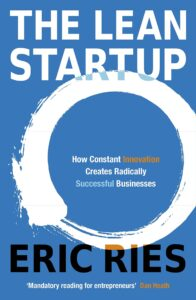[_The Lean Startup_](http://theleanstartup.com/) is a must-read and easily tops the list of the best business books for entrepreneurs. This book is all about how to turn your startup idea into a sustainable business.

The detailed approach Eric Ries takes can help you build a product or service that customers want, and are willing to pay for. All with minimum wasted time or effort.

The book starts with identifying your biggest assumptions. Your Value Assumption & Growth Assumption

The value assumption is the belief that customers are going to find value in what you’re about to build.

The growth assumption is all about how you’re going to attract customers to your business over time in a profitable way.

Ries then takes you through the process of converting these two assumptions into testable hypotheses.

Then he guides you to find quick and inexpensive ways to test and validate those hypotheses, including building a Minimum Viable Product (MVP) or creating a promotional video and landing page.

The combination of these processes and insights will help you navigate the uncertainty all businesses face and give you the tools you need to build a lasting, sustainable company.

 

/\* widget: Blog: Small Topic \*/ /\* reset -------------------- \*/ .blog-custom-block \*, .blog-custom-block ::before, .blog-custom-block ::after {  box-sizing: border-box;  border-width: 0;  border-style: solid;  border-color: #e5e7eb; } /\* vars -------------------- \*/ .blog-custom-block.blog-custom-block\_\_small-topic {  --color-accent: #E7107E;  --color-bg: #F4FAFE;  --color-text-1: #0F172A; } /\* colors -------------------- \*/ .blog-custom-block.blog-custom-block\_\_small-topic .bg-clr-bg {  background-color: var(--color-bg); } .blog-custom-block.blog-custom-block\_\_small-topic .text-clr-accent {  color: var(--color-accent); } .blog-custom-block.blog-custom-block\_\_small-topic .text-clr-text-1 {  color: var(--color-text-1); } /\* utils -------------------- \*/ .blog-custom-block.blog-custom-block\_\_small-topic .mt-2 {  margin-top: 0.5rem; } .blog-custom-block.blog-custom-block\_\_small-topic .flex {  display: flex; } .blog-custom-block.blog-custom-block\_\_small-topic .flex-shrink-0 {  flex-shrink: 0; } .blog-custom-block.blog-custom-block\_\_small-topic .flex-col {  flex-direction: column; } .blog-custom-block.blog-custom-block\_\_small-topic .items-center {  align-items: center; } .blog-custom-block.blog-custom-block\_\_small-topic .p-5 {  padding: 1.25rem; } .blog-custom-block.blog-custom-block\_\_small-topic .gap-4 {  gap: 1rem; } .blog-custom-block.blog-custom-block\_\_small-topic .gap-5 {  gap: 1.25rem; } .blog-custom-block.blog-custom-block\_\_small-topic .rounded-xl {  border-radius: 0.75rem; } .blog-custom-block.blog-custom-block\_\_small-topic .p-8 {  padding: 2rem; } .blog-custom-block.blog-custom-block\_\_small-topic .text-xl {  font-size: 1.25rem;  line-height: 1.75rem; } .blog-custom-block.blog-custom-block\_\_small-topic .font-bold {  font-weight: 700; } 

Related: [How to Build a Successful Minimum Viable Product (MVP) in 3 Steps](https://altar.io/features-inside-mvp-3-steps-know-answer/)

## 2\. Zero to One by Peter Thiel

In [_Zero to One_](https://www.goodreads.com/book/show/18050143-zero-to-one), legendary entrepreneur and investor Peter Thiel explains why you should “focus on businesses that create something new.”

He talks about how many of today’s businesses are focused on moving the world from 1 to N. Or iterating and improving existing products.

In this book, Thiel is calling entrepreneurs, as the title suggests, to take the world from zero to one – to find entirely new solutions and products that create more value.

He breaks this down further into actionable tips on what you need to do (and not do) _before_ jumping in and creating your solution or product.

Written in 2014, this is undoubtedly one of the best books for entrepreneurs out there and well worth adding to your reading list.

## 3\. Start with Why by Simon Sinek

[_Start with Why_](https://simonsinek.com/product/start-with-why/) is an A to Z on how leaders inspire people to take action. If you apply this book to your business, it can help you attract loyal customers. It can also help you create a company culture and have a greater impact on the world.

Sinek does this by sharing his insights on discovering the deeper, underlying purpose of your business, brand & product.

He stipulates that there are two ways to influence human behaviour, manipulation **or** inspiration.

He theorises that brands that are unable to inspire their customers rely on manipulation tactics to get them to take action. This can be in the form of fear or peer pressure to name but two.

And while this tactic may help drive initial sales, Sinek warns that using manipulation will become less effective over time. Importantly, this tactic will rarely result in a customer forming a long-term relationship with your business.

His solution is that you inspire your audience by starting with why. He poses that clarifying and communicating _why_ you’re doing what you do is the key to inspiring your customers and developing a long-term relationship with them. In a nutshell, Sinek is telling us:

/\* widget: Blog: Top Quote \*/ /\* reset -------------------- \*/ .blog-custom-block \*, .blog-custom-block ::before, .blog-custom-block ::after {  box-sizing: border-box;  border-width: 0;  border-style: solid;  border-color: #e5e7eb; } /\* vars -------------------- \*/ .blog-custom-block.blog-custom-block\_\_top-quote {  --color-bg: #F4FAFE;  --color-border: rgb(15 164 234 / 0.50);  --color-text-1: #0F172A; } /\* colors -------------------- \*/ .blog-custom-block.blog-custom-block\_\_top-quote .border-clr-border {  border-color: var(--color-border); } .blog-custom-block.blog-custom-block\_\_top-quote .bg-clr-bg {  background-color: var(--color-bg); } .blog-custom-block.blog-custom-block\_\_simple-quote .text-clr-text-1 {  color: var(--color-text-1); } /\* utils -------------------- \*/ .blog-custom-block.blog-custom-block\_\_top-quote .flex {  display: flex; } .blog-custom-block.blog-custom-block\_\_top-quote .flex-shrink-0 {  flex-shrink: 0; } .blog-custom-block.blog-custom-block\_\_top-quote .flex-col {  flex-direction: column; } .blog-custom-block.blog-custom-block\_\_top-quote .items-center {  align-items: center; } .blog-custom-block.blog-custom-block\_\_top-quote .gap-4 {  gap: 1rem; } .blog-custom-block.blog-custom-block\_\_top-quote .rounded-xl {  border-radius: 0.75rem; } .blog-custom-block.blog-custom-block\_\_top-quote .border {  border-width: 1px; } .blog-custom-block.blog-custom-block\_\_top-quote .p-8 {  padding: 2rem; } .blog-custom-block.blog-custom-block\_\_top-quote .text-center {  text-align: center; } .blog-custom-block.blog-custom-block\_\_top-quote .text-2xl {  font-size: 1.5rem;  line-height: 2rem; } .blog-custom-block.blog-custom-block\_\_top-quote .font-bold {  font-weight: 700; } 

“People don’t buy what you do they buy why you do it.”

_Start with Why_ is one of the best books for entrepreneurs looking to hone their leadership skills and inspire customers, employees & colleagues alike.

##### Do you have a brilliant idea that you want to bring to life?

From the product and business reasoning to streamlining your MVP to the most important features, our team of product experts and ex-startup founders can help you bring your vision to life.

Let's Talk

## 4\. Thinking, Fast and Slow by Daniel Kahnema

[_Thinking, Fast and Slow_](https://www.goodreads.com/book/show/11468377-thinking-fast-and-slow) is one of the best books for entrepreneurs for breaking down the psychology behind decision making and judgement.

He splits this psychology into two systems:

_“System 1 operates automatically and quickly, with little or no effort and no sense of voluntary control. \[Fast Thinking\]_

_System 2 allocates attention to the effortful mental activities that demand it, including complex computations. The operations of System 2 are often associated with the subjective experience of agency, choice, and concentration. \[Slow Thinking\]”_ 

Throughout this book Kahneman looks closely at the differences between System 1 & 2, explaining them in great detail to help you understand how and why you make the decisions you make and how to identify which system you’re using and which you _should_ be using.

## 5\. The Mom Test by Rob Fitzpatrick

Primarily focused on startups that are bringing a new product or service to market, [_The Mom Test_](http://momtestbook.com/) helps you learn how to properly talk to customers and how you can learn more from them.

The book's cover hook sums it up perfectly: _“How to talk to customers & learn if your business is a good idea when everyone is lying to you.”_

It starts by teaching you that, when talking to new customers, you should talk about _their_ lives and not _your_ idea.

When you talk to friends, family or potential customers about your idea they will see the passion you have for it.

The problem with this conversation is that people will often offer what Fitzpatrick calls “blind encouragement & generic support”. The natural, socially polite response.

If you truly want to get genuine feedback Fitzpatrick suggests that you talk to them about their life in the context of the problem you’re trying to solve with your product.

They will then reflect on the problem, and how they would want it to be solved. This allows you to compare what your customers are saying with your idea, to see if the two are aligned.

This is just the first idea Fitzpatrick covers in his book. This is one of the best books for entrepreneurs when it comes to learning the strategies and tips to ensure you’re talking to your customers in a way that garners valuable feedback on your idea.

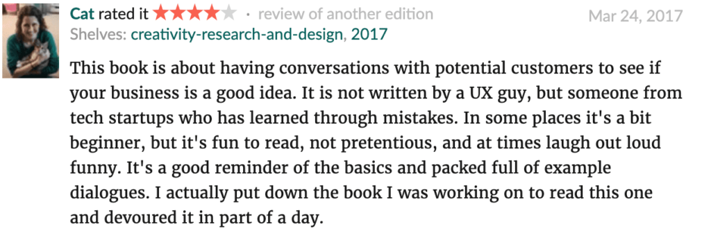 

  --e-global-typography-text-font-size );line-height:var( --e-global-typography-text-line-height );}.elementor-3329 .elementor-element.elementor-element-70fbc6a .elementor-message{font-size:var( --e-global-typography-9730a4e-font-size );line-height:var( --e-global-typography-9730a4e-line-height );letter-spacing:var( --e-global-typography-9730a4e-letter-spacing );word-spacing:var( --e-global-typography-9730a4e-word-spacing );}}@media(max-width:767px){.elementor-3329 .elementor-element.elementor-element-99ebd14 .elementor-heading-title{font-size:var( --e-global-typography-0ff79ee-font-size );line-height:var( --e-global-typography-0ff79ee-line-height );letter-spacing:var( --e-global-typography-0ff79ee-letter-spacing );word-spacing:var( --e-global-typography-0ff79ee-word-spacing );}.elementor-3329 .elementor-element.elementor-element-70fbc6a .elementor-field-group > label{font-size:var( --e-global-typography-9730a4e-font-size );line-height:var( --e-global-typography-9730a4e-line-height );letter-spacing:var( --e-global-typography-9730a4e-letter-spacing );word-spacing:var( --e-global-typography-9730a4e-word-spacing );}.elementor-3329 .elementor-element.elementor-element-70fbc6a .elementor-field-group .elementor-field, .elementor-3329 .elementor-element.elementor-element-70fbc6a .elementor-field-subgroup label{font-size:var( --e-global-typography-text-font-size );line-height:var( --e-global-typography-text-line-height );}.elementor-3329 .elementor-element.elementor-element-70fbc6a .elementor-message{font-size:var( --e-global-typography-9730a4e-font-size );line-height:var( --e-global-typography-9730a4e-line-height );letter-spacing:var( --e-global-typography-9730a4e-letter-spacing );word-spacing:var( --e-global-typography-9730a4e-word-spacing );}}/\* Start custom CSS for form, class: .elementor-element-70fbc6a \*/.elementor-3329 .elementor-element.elementor-element-70fbc6a input {  border-color: #65639C !important; } .elementor-3329 .elementor-element.elementor-element-70fbc6a input:is(:focus, :hover) {  border-color: #B9B8CE !important; }/\* End custom CSS \*/

## 6\. The 4-Hour Workweek by Tim Ferriss

[_The 4-Hour Workweek_](https://fourhourworkweek.com/) is essentially a blueprint to free yourself of your 9-to-5, create a business and live like a millionaire (without actually having to be one).

The key idea Ferriss starts with is to be **effective**, _not_ **efficient**. Here Ferriss uses the idea of the [80/20 rule](https://www.forbes.com/sites/kevinkruse/2016/03/07/80-20-rule/?sh=5dd7a44f3814) – also known as the Pareto Principle to explain this.

One of the more interesting insights in this book is the idea that you don’t have to be a millionaire to live like one, in what Ferriss describes as _The New Rich._

He poses that if you want to live a life of luxury you should focus on **flexibility** and **mobility**. In other words, the ability to do whatever you want, wherever you want. For example, if you’re paid in dollars but spending in Pesos, your money is going yo go a lot further.

Throughout this book, Ferriss provides you with the tools to accomplish this _New Rich_ lifestyle, from outsourcing tasks to virtual assistants to redefining your approach to work.

This is one of the best books for entrepreneurs looking to take their passion and turn it into their full-time job.

## 7\. The Hard Thing About Hard Things by Ben Horowitz

[_The Hard Thing About Hard Things_](https://www.goodreads.com/book/show/18176747-the-hard-thing-about-hard-things) is a candid, brutally honest look at how hard it is to run a business.

Horowitz was very conscious of the fact that he didn’t want to write “just another management book”.

He felt, however, that there was something missing in the market of business books for entrepreneurs.

That gap he saw? No one was writing about what happens when everything goes wrong, and it’s on your shoulders to fix it.

He starts the book by describing his own story and how his career unfolded. He gives you a glimpse behind the curtain at his humble start as an engineer at NetLabs, through to setting up his venture with business partner Marc Andreesen.

The latter half of the book is spent on imparting actionable advice on how to effectively run your business. Horowitz shares anecdotes at various intersections throughout to contextualise his advice.

/\* widget: Blog: Top Quote \*/ /\* reset -------------------- \*/ .blog-custom-block \*, .blog-custom-block ::before, .blog-custom-block ::after {  box-sizing: border-box;  border-width: 0;  border-style: solid;  border-color: #e5e7eb; } /\* vars -------------------- \*/ .blog-custom-block.blog-custom-block\_\_top-quote {  --color-bg: #F4FAFE;  --color-border: rgb(15 164 234 / 0.50);  --color-text-1: #0F172A; } /\* colors -------------------- \*/ .blog-custom-block.blog-custom-block\_\_top-quote .border-clr-border {  border-color: var(--color-border); } .blog-custom-block.blog-custom-block\_\_top-quote .bg-clr-bg {  background-color: var(--color-bg); } .blog-custom-block.blog-custom-block\_\_simple-quote .text-clr-text-1 {  color: var(--color-text-1); } /\* utils -------------------- \*/ .blog-custom-block.blog-custom-block\_\_top-quote .flex {  display: flex; } .blog-custom-block.blog-custom-block\_\_top-quote .flex-shrink-0 {  flex-shrink: 0; } .blog-custom-block.blog-custom-block\_\_top-quote .flex-col {  flex-direction: column; } .blog-custom-block.blog-custom-block\_\_top-quote .items-center {  align-items: center; } .blog-custom-block.blog-custom-block\_\_top-quote .gap-4 {  gap: 1rem; } .blog-custom-block.blog-custom-block\_\_top-quote .rounded-xl {  border-radius: 0.75rem; } .blog-custom-block.blog-custom-block\_\_top-quote .border {  border-width: 1px; } .blog-custom-block.blog-custom-block\_\_top-quote .p-8 {  padding: 2rem; } .blog-custom-block.blog-custom-block\_\_top-quote .text-center {  text-align: center; } .blog-custom-block.blog-custom-block\_\_top-quote .text-2xl {  font-size: 1.5rem;  line-height: 2rem; } .blog-custom-block.blog-custom-block\_\_top-quote .font-bold {  font-weight: 700; } 

"This is not your typical, how-to entrepreneur book. It is however one of the best books for entrepreneurs on the market."

What separates this book is the way Horowitz tackles the real problems and challenges entrepreneurs face. He includes many of the questions he asked his mentors and problems he faced himself.

Furthermore, Horowitz provides advice on how to control your own psychology. As well as insights on how to keep your demons in check as a CEO and founder:

/\* widget: Blog: Simple Quote \*/ /\* reset -------------------- \*/ .blog-custom-block \*, .blog-custom-block ::before, .blog-custom-block ::after {  box-sizing: border-box;  border-width: 0;  border-style: solid;  border-color: #e5e7eb; } /\* vars -------------------- \*/ .blog-custom-block.blog-custom-block\_\_simple-quote {  --color-accent: #0FA4EA;  --color-bg: #F4FAFE;  --color-text-2: #4A4A68; } /\* colors -------------------- \*/ .blog-custom-block.blog-custom-block\_\_simple-quote .bg-clr-bg {  background-color: var(--color-bg); } .blog-custom-block.blog-custom-block\_\_simple-quote .border-clr-accent {  border-color: var(--color-accent); } .blog-custom-block.blog-custom-block\_\_simple-quote .text-clr-text-2 {  color: var(--color-text-2); } /\* utils -------------------- \*/ .blog-custom-block.blog-custom-block\_\_simple-quote .flex {  display: flex; } .blog-custom-block.blog-custom-block\_\_simple-quote .flex-shrink-0 {  flex-shrink: 0; } .blog-custom-block.blog-custom-block\_\_simple-quote .flex-col {  flex-direction: column; } .blog-custom-block.blog-custom-block\_\_simple-quote .gap-4 {  gap: 1rem; } .blog-custom-block.blog-custom-block\_\_simple-quote .rounded-xl {  border-radius: 0.75rem; } .blog-custom-block.blog-custom-block\_\_simple-quote .border-l-6 {  border-left-width: 6px; } .blog-custom-block.blog-custom-block\_\_simple-quote .p-8 {  padding: 2rem; } .blog-custom-block.blog-custom-block\_\_simple-quote .text-xl {  font-size: 1.25rem;  line-height: 1.75rem; } .blog-custom-block.blog-custom-block\_\_simple-quote .italic {  font-style: italic; } 

“By far the most difficult skill I learned as a CEO was the ability to manage my own psychology. \[...\] It’s like the fight club of management: the first rule of the CEO psychological meltdown is don’t talk about the psychological meltdown.

At the risk of violating the sacred rule, I will attempt to describe the condition and prescribe some techniques that helped me. In the end, this is the most personal and important battle that any CEO will face.”

 

/\* widget: Blog: Small Topic \*/ /\* reset -------------------- \*/ .blog-custom-block \*, .blog-custom-block ::before, .blog-custom-block ::after {  box-sizing: border-box;  border-width: 0;  border-style: solid;  border-color: #e5e7eb; } /\* vars -------------------- \*/ .blog-custom-block.blog-custom-block\_\_small-topic {  --color-accent: #E7107E;  --color-bg: #F4FAFE;  --color-text-1: #0F172A; } /\* colors -------------------- \*/ .blog-custom-block.blog-custom-block\_\_small-topic .bg-clr-bg {  background-color: var(--color-bg); } .blog-custom-block.blog-custom-block\_\_small-topic .text-clr-accent {  color: var(--color-accent); } .blog-custom-block.blog-custom-block\_\_small-topic .text-clr-text-1 {  color: var(--color-text-1); } /\* utils -------------------- \*/ .blog-custom-block.blog-custom-block\_\_small-topic .mt-2 {  margin-top: 0.5rem; } .blog-custom-block.blog-custom-block\_\_small-topic .flex {  display: flex; } .blog-custom-block.blog-custom-block\_\_small-topic .flex-shrink-0 {  flex-shrink: 0; } .blog-custom-block.blog-custom-block\_\_small-topic .flex-col {  flex-direction: column; } .blog-custom-block.blog-custom-block\_\_small-topic .items-center {  align-items: center; } .blog-custom-block.blog-custom-block\_\_small-topic .p-5 {  padding: 1.25rem; } .blog-custom-block.blog-custom-block\_\_small-topic .gap-4 {  gap: 1rem; } .blog-custom-block.blog-custom-block\_\_small-topic .gap-5 {  gap: 1.25rem; } .blog-custom-block.blog-custom-block\_\_small-topic .rounded-xl {  border-radius: 0.75rem; } .blog-custom-block.blog-custom-block\_\_small-topic .p-8 {  padding: 2rem; } .blog-custom-block.blog-custom-block\_\_small-topic .text-xl {  font-size: 1.25rem;  line-height: 1.75rem; } .blog-custom-block.blog-custom-block\_\_small-topic .font-bold {  font-weight: 700; } 

Related: [From Being Fired to Building a Multi-Million Dollar Fintech Startup](https://altar.io/from-being-fired-to-building-a-multi-million-dollar-fintech-startup/)

## 8\. Crossing the Chasm by Geoffrey A. Moore

[_Crossing the Chasm_](https://www.goodreads.com/book/show/61329.Crossing_the_Chasm) is all about how to market and sell disruptive products to mainstream customers. It focuses on any new service or product that asks customers to change or alter their behaviour in a significant way.

Moore starts the book by describing what he calls The Technology Adoption Lifecycle – breaking people into five groups and how each group adopts disruptive tech solutions, they are:

- The Innovators (2.5% of Customers)
- Early Adopters (13.5% of Customers)
- Early Majority (34% of Customers)
- Late Majority (34% of Customers)
- The Laggards (16% of Customers)

Each of these groups responds to disruptive products in different ways. For example, an innovator will typically buy a new product because they want the latest and greatest tech innovations. Think of the first people to by Apple Airpods, for example. Innovators want to be first just for the sake of being first.

This is different from the early adopters. They tend to look for new technology that will give them a strategic or competitive advantage in their market and/or everyday life.

/\* widget: Blog: Top Quote \*/ /\* reset -------------------- \*/ .blog-custom-block \*, .blog-custom-block ::before, .blog-custom-block ::after {  box-sizing: border-box;  border-width: 0;  border-style: solid;  border-color: #e5e7eb; } /\* vars -------------------- \*/ .blog-custom-block.blog-custom-block\_\_top-quote {  --color-bg: #F4FAFE;  --color-border: rgb(15 164 234 / 0.50);  --color-text-1: #0F172A; } /\* colors -------------------- \*/ .blog-custom-block.blog-custom-block\_\_top-quote .border-clr-border {  border-color: var(--color-border); } .blog-custom-block.blog-custom-block\_\_top-quote .bg-clr-bg {  background-color: var(--color-bg); } .blog-custom-block.blog-custom-block\_\_simple-quote .text-clr-text-1 {  color: var(--color-text-1); } /\* utils -------------------- \*/ .blog-custom-block.blog-custom-block\_\_top-quote .flex {  display: flex; } .blog-custom-block.blog-custom-block\_\_top-quote .flex-shrink-0 {  flex-shrink: 0; } .blog-custom-block.blog-custom-block\_\_top-quote .flex-col {  flex-direction: column; } .blog-custom-block.blog-custom-block\_\_top-quote .items-center {  align-items: center; } .blog-custom-block.blog-custom-block\_\_top-quote .gap-4 {  gap: 1rem; } .blog-custom-block.blog-custom-block\_\_top-quote .rounded-xl {  border-radius: 0.75rem; } .blog-custom-block.blog-custom-block\_\_top-quote .border {  border-width: 1px; } .blog-custom-block.blog-custom-block\_\_top-quote .p-8 {  padding: 2rem; } .blog-custom-block.blog-custom-block\_\_top-quote .text-center {  text-align: center; } .blog-custom-block.blog-custom-block\_\_top-quote .text-2xl {  font-size: 1.5rem;  line-height: 2rem; } .blog-custom-block.blog-custom-block\_\_top-quote .font-bold {  font-weight: 700; } 

“Early adopters focus on technology that has a practical use for their needs and are willing to adopt that early to leverage the benefits.”

Early majority are customers who want evolution not revolution. They will adopt new technology when they see it becoming the new standard. A good example here is the majority of people using Blackberry phones until they saw that iPhones were becoming the new standard.

Moore continues through these groups in greater detail. But, critically, the book focuses on  “crossing the chasm” between early adopters and (the most valuable segments in the market) Early Majority & Late Majority. A fundamental part of this is learning how to deliver a complete solution to those customers which Moore explains fantastically.

This is one of the best books for entrepreneurs when it comes to working out how to reach the most profitable groups of customers in your market.

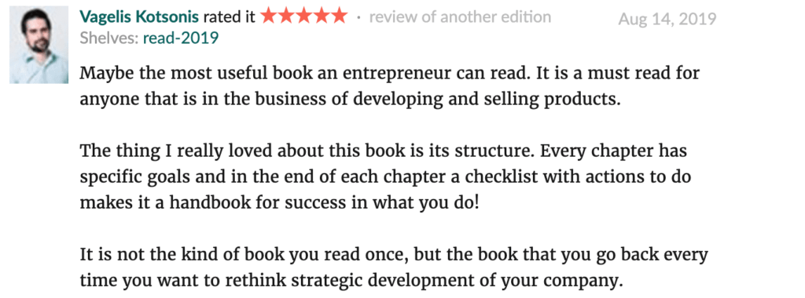

## 9\. The $100 Startup by Chris Guillebeau

The aim of [_The $100 Startup_](https://100startup.com/) is to help prospective entrepreneurs gain awareness of the challenges that come from building a successful small business and escape the 9-to-5.

Throughout the book, Guillebeau lays out the possibility of starting and running a successful business with a small team of one to five people. He uses real-life case studies to achieve this.

The three main lessons Guillebeau covers are:

1. Using your current skills even if they don’t immediately seem relevant
2. When starting small, hustle for good marketing
3. Action beats planning, especially in a small business

Lesson one revolves around the idea of not spending your entire bank balance on learning new skills you think you need.

Instead, it suggests you should focus on utilizing what you’re already good at while working on those other aspects – because odds are you have related skills to help you run your business of choice.

Lesson two focuses on getting creative with your marketing, instead of burning through money on advertising and hoping it pays off.

Guillebeau suggests blogging as a first step to achieve this. Then, he advises you to hustle your way into effective marketing. This could be collaborating with similar businesses, contacting journalists or guest blogging on other websites. Essentially, doing anything you can to get your name out there without spending millions.

Lesson three is exactly what it says on the tin: don’t plan, take action.

/\* widget: Blog: Top Quote \*/ /\* reset -------------------- \*/ .blog-custom-block \*, .blog-custom-block ::before, .blog-custom-block ::after {  box-sizing: border-box;  border-width: 0;  border-style: solid;  border-color: #e5e7eb; } /\* vars -------------------- \*/ .blog-custom-block.blog-custom-block\_\_top-quote {  --color-bg: #F4FAFE;  --color-border: rgb(15 164 234 / 0.50);  --color-text-1: #0F172A; } /\* colors -------------------- \*/ .blog-custom-block.blog-custom-block\_\_top-quote .border-clr-border {  border-color: var(--color-border); } .blog-custom-block.blog-custom-block\_\_top-quote .bg-clr-bg {  background-color: var(--color-bg); } .blog-custom-block.blog-custom-block\_\_simple-quote .text-clr-text-1 {  color: var(--color-text-1); } /\* utils -------------------- \*/ .blog-custom-block.blog-custom-block\_\_top-quote .flex {  display: flex; } .blog-custom-block.blog-custom-block\_\_top-quote .flex-shrink-0 {  flex-shrink: 0; } .blog-custom-block.blog-custom-block\_\_top-quote .flex-col {  flex-direction: column; } .blog-custom-block.blog-custom-block\_\_top-quote .items-center {  align-items: center; } .blog-custom-block.blog-custom-block\_\_top-quote .gap-4 {  gap: 1rem; } .blog-custom-block.blog-custom-block\_\_top-quote .rounded-xl {  border-radius: 0.75rem; } .blog-custom-block.blog-custom-block\_\_top-quote .border {  border-width: 1px; } .blog-custom-block.blog-custom-block\_\_top-quote .p-8 {  padding: 2rem; } .blog-custom-block.blog-custom-block\_\_top-quote .text-center {  text-align: center; } .blog-custom-block.blog-custom-block\_\_top-quote .text-2xl {  font-size: 1.5rem;  line-height: 2rem; } .blog-custom-block.blog-custom-block\_\_top-quote .font-bold {  font-weight: 700; } 

“Guillebeau states that over-planning can lead to a quick death for many small businesses.”

He continues to say that taking action and adjusting your course along the way as needed leads to more results than using all your time to plan every little detail.

This is one of the best books for entrepreneurs who’re looking to start a side-business and scale it to their full-time job. Guillebeau has packed this book with actionable insights and tips that any entrepreneur could benefit from learning or re-learning.

## 10\. The Effective Executive by Peter Drucker

Since its initial publication in 1967, Peter Drucker’s [_The Effective Executive_](https://www.goodreads.com/book/show/48019.The_Effective_Executive) has helped millions of executives (or knowledge workers as Drucker calls them) improve their effectiveness.

Throughout this book, Drucker shows how you can develop personal effectiveness.  The idea behind the book is that in a world that is increasingly dependant on knowledge-based work, the more knowledge workers need to improve their effectiveness.

Drucker poses there are five habits that are crucial to becoming an effective executive:

- Knowing & managing your time
- Focus on results and contributing to your organisation
- Building on strengths, rather than weaknesses
- Set priorities and concentrate on the few major areas that will achieve outstanding results.
- Make effective decisions

Despite the time it was written, Drucker’s insights are just as relevant today as they were then. Drucker’s timeless insights and observations make _The Effective Executive_ one of best books for entrepreneurs to read.

## 11\. The 7 Habits of Highly Effective People by Stephen R. Covey

Similarly to _The Effective Executive,_ [_The 7 Habits of Highly Effective People_](https://www.goodreads.com/book/show/36072.The_7_Habits_of_Highly_Effective_People) sets out a series of behaviours that will make you more effective. Covey takes an integrated approach to help entrepreneurs improve their personal and interpersonal development.

The book is designed in a way that each habit (when implemented in order) will prepare you for the next and strengthen the previous.

Covey’s seven habits that will help you reach your full potential are:

1. **Being proactive** – Don’t react to the world. Instead, take charge of your life.
2. **Beginning with an end in mind** – Visualise your ideal future, and design a roadmap to get there.
3. **Putting first things first** – Prioritise what brings you closer to your vision of your ideal future.
4. **Thinking “win-win”** – Build positive relationships that accelerate you towards your ideal future.
5. **Seeking first to understand,** **_then_** **to be understood** – Learn to listen, then learn to speak.
6. **Synergising** – Find a way to harmonise with both others and yourself so you can achieve more.
7. **Sharpening the saw** – Make sure you find time to recharge so you can be effective in the long term.

The first three habits are designed to help you develop “self-mastery” – or personal victories.

Then habits four through six will focus you on teamwork, cooperation, and communications – or public victories

Finally, habit seven teaches you how to balance and renew the preceding habits.

This is by far one of the best books for entrepreneurs looking to improve their daily habits to become more effective both professionally and personally.

## 12\. How to Win Friends & Influence People by Dale Carnegie

In [_How to Win Friends and Influence People_](https://www.goodreads.com/book/show/4865.How_to_Win_Friends_and_Influence_People)_,_ Dale Carnegie brings us a series of techniques on navigating relationships and influencing the people around you, without offending them.

The first idea Carnegie brings up in the book is the idea that you can’t win an argument, and that they should be avoided at all costs. He poses that nine times out of ten, an argument ends with both parties believing that they are absolutely right.

He also tells us that even if you _win_ an argument you still _lose._ As you’ve made the other person feel inferior and hurt their pride.

This leads to Carnegie’s next lesson, never telling someone they’re wrong. Instead, you should instead collaborate with them through a series of questions to get to the bottom of why they think they’re right.

Carnegie found that, more often than not, this method can go a long way to influencing people to your way of thinking.

These are just two of the many insights Carnegie imparts in what has become one of the best books for entrepreneurs.

The book is packed full of actionable tips from why remembering names is so important to why you should ask people to do things instead of giving orders.

## 13\. Radical Candor by Kim Scott

In [_Radical Candor_](https://www.goodreads.com/book/show/29939161-radical-candor)_,_ successful manager Kim Scott shares what she calls a “vital new approach” to effective management.

Throughout the book, she condenses her years of experience managing at companies like Google and Apple into actionable lessons.

Scott has identified three simple principles to build better relationships with your employees:

- Make it personal
- Get (sh)it done
- Understand why it matters

She explores these throughout the book to help you create an environment where your employees feel both challenged and cared for.

## 14\. Mindset by Carol Dweck

Carol Dweck describes her work as bridging developmental psychology, social psychology, and personality psychology. She examines the mindsets people use to structure the “self” and guide their behaviour.

The result of this extensive research is manifested in [_Mindset: The New Psychology of Success_](https://www.goodreads.com/book/show/34403537-mindset#).

Throughout the book, she explores how both our conscious and unconscious thoughts affect us and how simple factors can have a powerful impact on our ability to improve.

The book is based around two mindsets, the “Fixed Mindset” and the “Growth Mindset”

Essentially those with a fixed mindset, who believe that abilities are fixed, are less likely to succeed compared to those with a growth mindset – the belief that abilities can be developed.

In the latest edition, Dweck has expanded her mindset beyond the individual – applying it to cultures and organisations.

This is one of those books for entrepreneurs that is considered a must-read for anyone looking to motivate and lead their team.

## 15\. Unapologetically Ambitious by Shellye Archambeau

Named a Best Business Book of 2020 by Fortune, [_Unapologetically Ambitious_](https://www.goodreads.com/book/show/50998942-unapologetically-ambitious?ac=1&from_search=true&qid=K9Em17tP69&rank=1) tells the story of Shellye Archambeau – one of Silicon Valley's first female African American CEOs.

Archambeau recounts how she overcame the challenges of managing her personal and professional responsibilities while climbing the ranks at IBM as a young black woman, wife and mother.

On her journey through the busts and booms of Silicon Valley in the early 2000s, she learned that ambition alone is not enough to achieve success.

In the book, she shares practical strategies and tools that you can use to increase your chances of success, including steps on how to:

- Dismantle imposter syndrome
- Develop financial literacy
- Build your network
- Balance your professional and personal life
- Take time for self-care.

This bold and inspiring book teaches you how to carefully navigate the entrepreneurial journey and give yourself the best chances of success.

## 16\. Rework by Jason Fried David and Heinemeier Hansson

From the founders of [37signals](https://37signals.com/) – the company behind [Basecamp](https://basecamp.com/) and [Ruby on Rails](https://rubyonrails.org/) – [_Rework_](https://basecamp.com/books/rework) explores personal experiences of building startups.

But, their approach to entrepreneurship is far from traditional. There are several, disruptive themes that appear throughout the book.

Starting with their ideas about growth and size. Unlike other books, they will tell you that increasing size can often actually be detrimental to your success if you do it too soon. At least in their extensive experience.

The book goes on to share two more key messages that recur throughout the read.

First, is the idea that plans can be dangerous as they’re inconsistent with flexibility and improvisation.

Second is the theory that workaholics aren’t heroes. They're, in fact, the real heroes are those who’re already home, because they figured out a faster way to get the job done.

The book’s language is straightforward, with the focus being on actionable insights as opposed to grandeur for grandeur’s sake.

It shows you a better, faster, easier way to succeed in business, with the idea of “stop talking and start working” at its core.

## 17\. Purple Cow by Seth Godin

If you’re looking to gain some knowledge on marketing strategies, Seth Godin’s [_Purple Cow_](https://seths.store/purple-cow/) is a must-read.

Here, Godin uses the analogy of a purple cow to share his secrets to successful marketing strategies.

Simply put, in a field of brown cows, the purple cow stands out. You can’t help but take a closer look at it.

The same should be said for your marketing strategy.

To demonstrate this theory, Godin calls on well-known raid growth companies like Krispy Kreme, Apple and Starbucks. All of these companies left behind traditional marketing norms to pursue the ideas of innovation and reinvention.

The key behind turning your marketing strategy into a purple cow is simple. To be wildly imaginative to the point of disbelief.

Purple Cow is also extremely easy to read. Godin avoids deep analyses in favour of easy-to-consume actionable advice.

## 18\. Influence: The Psychology of Persuasion by Robert Cialdini

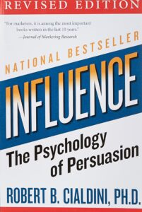[_Influence_](https://www.amazon.com/Influence-Psychology-Persuasion-Robert-Cialdini/dp/006124189X) is one of the classic books for entrepreneurs on persuasion.

It explains the psychology of why people say yes, and how to apply these understandings.

Author Dr. Robert Cialdini is an expert in the field of influence and persuasion, and throughout the book outlines seven key principles:

- Weapons of Influence
- Reciprocation: The Old Give and Take…and Take
- Commitment and Consistency: Hobgoblins of the Mind
- Social Proof: Truths Are Us
- Liking: The Friendly Thief
- Authority: Directed Deference
- Scarcity: The Rule of the Few

This is one of the best books for entrepreneurs looking to understand the psychology behind why people are able to sell you their ideas. It's also a great read for anyone interested in human psychology – despite its direct links to selling and marketing.

## 19\. Mastery by Robert Greene

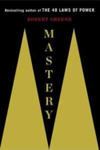In [_Mastery_](https://www.amazon.com/Mastery-Robert-Greene-Collection/dp/178125091X), Robert Greene calls on examples from famous historical figures to help you:

- Extract the best from your mentorship period
- How to find goof mentors
- Cultivate your social intelligence
- How to identify when it’s time to leave your monthly salary in the pursuit of the entrepreneurial journey

Greene brings the lives of “the ancient masters” like Mozart and Darwin to the fore. This is one of the best books for entrepreneurs looking to enrich their personal development and find business success.

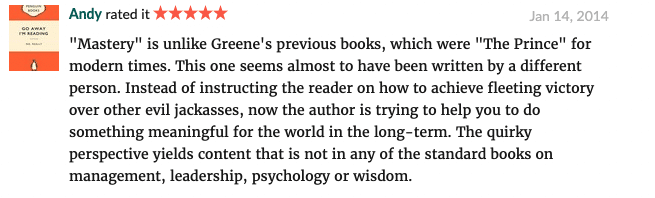

## 20. The 22 Immutable Laws of Marketing by Al Ries and Jack Trout

This book comes recommended directly from my CMO Rui, who describes it as: _“A complete master's degree in marketing.”_

[_The 22 Immutable Laws of Marketing_](https://www.amazon.com/22-Immutable-Laws-Marketing/dp/1861976100) is a short book packed with valuable insights and examples.

In it, Al Ries and Jack Trout share 22 innovative rules to understand and succeed in the international marketplace.

The insights stand the test of time and present a clear path to successful products.

This is a mandatory book for marketers. For entrepreneurs, it’s highly recommended. It will put you ahead of the pack in terms of your startup’s marketing.

## 21\. Crush It! by Gary Vaynerchuk

[_Crush It!_](https://www.goodreads.com/book/show/6474550-crush-it) by Gary Vaynerchuk is a definitive guide for entrepreneurs seeking to maximize their personal brand and influence. Vaynerchuk, a renowned entrepreneur and social media expert, delves into the power of online platforms to build and grow a business.

This book offers practical advice on harnessing social media channels to create a loyal following and turn passions into profitable ventures. Gary’s storytelling weaves in success stories, demonstrating how a strong personal brand can be a game-changer.

_Crush It!_ is not just about becoming successful but about being significant in the digital age, making it an essential read for modern entrepreneurs.

## 22\. The Execution Factor by Kim Perell

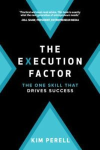In [_The Execution Factor_](https://www.goodreads.com/book/show/38636897-the-execution-factor)_,_ Kim Perell emphasizes one crucial skill for success: execution. This book stands out for its focus on action as the cornerstone of entrepreneurial achievement.

Perell, a successful entrepreneur and angel investor, shares her insights and experiences, outlining the key components necessary for executing a vision. The book is filled with practical strategies to turn ideas into actions and actions into results.

For entrepreneurs looking to transform their vision into a thriving business, _The Execution Factor_ offers the roadmap for success.

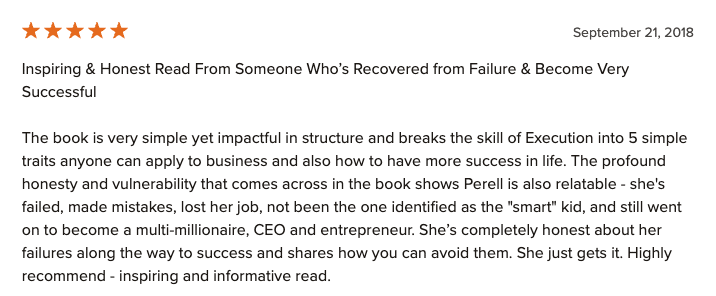

## 23\. How I Built This by Guy Raz

Guy Raz's [_How I Built This_](https://www.goodreads.com/book/show/48930275-how-i-built-this?from_search=true&from_srp=true&qid=t6WxbeBXZ8&rank=1) offers an inspiring look at the paths taken by some of the world's most influential entrepreneurs. Based on his popular podcast, Raz shares stories of innovators, entrepreneurs, and idealists, revealing the challenges and triumphs of building a successful business.

The book provides an in-depth exploration of the entrepreneurial journey, showcasing the unexpected routes to success. It's a compilation of wisdom, failures, and victories, making it an invaluable resource for anyone eager to understand the realities of starting and growing a business.

## 24\. Why Didn’t Anybody Tell Me This Sh\*t Before? by Marcella Allison and Laura Gale

[_Why Didn’t Anybody Tell Me This Sh\*t Before?_](https://www.goodreads.com/book/show/45732580-why-didn-t-anybody-tell-me-this-sh-t-before)" by Marcella Allison and Laura Gale is a candid collection of wisdom from successful women in business. This book brings together stories and lessons that are often left out of traditional business narratives.

The authors provide a diverse range of experiences and insights, offering valuable perspectives on navigating the business world as a woman.

It’s an honest, witty, and empowering read, especially for female entrepreneurs who seek guidance and inspiration from those who have paved the way.

## 25\. Your Next Level Life by Karen Arrington

Karen Arrington’s [_Your Next Level Life_](https://www.goodreads.com/book/show/45836033-your-next-level-life?ac=1&from_search=true&qid=fuD1lxMGyk&rank=1) is a powerful guide for African-American women striving for success in business. This book offers seven rules of power, confidence, and opportunity, tailored to uplift and inspire.

Arrington, a mentor and coach, provides actionable advice for overcoming obstacles and seizing opportunities. The book is a unique resource, focusing on empowering Black women to achieve their entrepreneurial dreams and create impactful legacies.

## 26\. Black Magic by Chad Sanders

In [_Black Magic_](https://www.goodreads.com/book/show/58438443-black-magic?ac=1&from_search=true&qid=vbW1dum2Uy&rank=1)_,_ Chad Sanders explores the unique experiences and lessons learned by Black leaders. This book provides a deep dive into how trauma and triumph have shaped the journeys of these influential figures.

Sanders weaves together stories that highlight resilience, creativity, and leadership. _Black Magic_ is not just a collection of success stories; it's an exploration of the powerful ways in which adversity can be transformed into strength, making it a crucial read for entrepreneurs of all backgrounds.

## 27\. That Will Never Work by Marc Randolph

Marc Randolph's [_That Will Never Work_](https://www.goodreads.com/book/show/44428950-that-will-never-work) narrates the birth and rise of Netflix, offering an insider’s view of the challenges and triumphs of building a disruptive company. Randolph, a co-founder of Netflix, shares candid stories of the company’s early struggles and unexpected successes.

This book is a testament to the power of innovative ideas and perseverance. Entrepreneurs will find valuable lessons in Randolph’s approach to problem-solving and risk-taking, making _That Will Never Work_ a source of inspiration and practical insights.

## 28\. The Soul-Sourced Entrepreneur by Christine Kane

[_The Soul-Sourced Entrepreneur_](https://www.goodreads.com/book/show/54200442-the-soul-sourced-entrepreneur) by Christine Kane is a guide for those who approach entrepreneurship with creativity and sensitivity. Kane, an entrepreneur and coach, presents an unconventional success plan for the highly creative and ambitious.

The book emphasizes the importance of aligning business strategies with one's inner values and strengths. It’s an essential read for entrepreneurs who want to succeed without compromising their creative integrity or personal well-being.

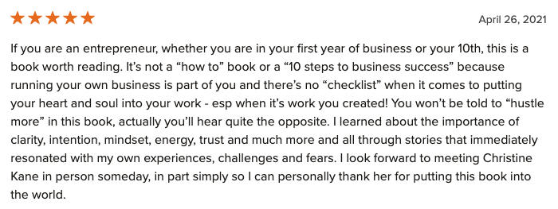

## 29\. The Daily Entrepreneur by S.J. Scott and Rebecca Livermore

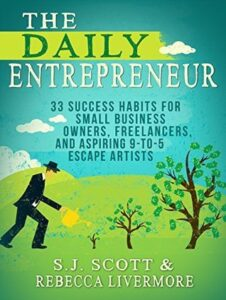[_The Daily Entrepreneur_](https://www.goodreads.com/book/show/23462396-the-daily-entrepreneur) by S.J. Scott and Rebecca Livermore is a practical handbook for small business owners, freelancers, and those aspiring to escape the 9-to-5 routine.

The book outlines 33 success habits that can help entrepreneurs stay productive and motivated.

Scott and Livermore offer actionable tips for daily routines, emphasizing the importance of consistency and discipline in achieving entrepreneurial goals.

This book is a valuable resource for those looking to make every day count on their entrepreneurial journey.

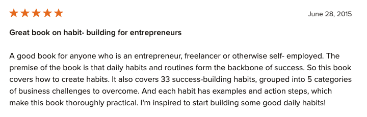

## 30\. Virtual Freedom by Chris Ducker

[_Virtual Freedom_](https://www.goodreads.com/book/show/18406455-virtual-freedom) by Chris Ducker is a must-read for entrepreneurs looking to leverage virtual staff. This book provides insights into how virtual teams can free up time, increase productivity, and support the growth of a dream business.

Ducker, an expert in virtual entrepreneurship, offers strategies for finding, hiring, and managing remote workers effectively.

The book is an invaluable guide for entrepreneurs in the digital age, demonstrating how virtual teams can be a game-changer for business operations.

## 31\. Dare To Lead by Brené Brown

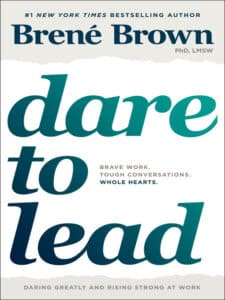[_Dare To Lead_](https://www.goodreads.com/book/show/40109367-dare-to-lead) by Brené Brown is a groundbreaking book on leadership, crucial for entrepreneurs who aspire to lead with courage and empathy. Brown, a renowned researcher and speaker, delves into the qualities that make great leaders.

This book challenges traditional notions of leadership, advocating for vulnerability, resilience, and connection.

Entrepreneurs who want to lead effectively in today’s complex world will find _Dare To Lead_ an insightful and transformative read.

## 32\. Shoe Dog by Phil Knight

Phil Knight's [_Shoe Dog_](https://www.goodreads.com/book/show/27220736-shoe-dog) offers a raw and riveting account of the journey of creating Nike. This exclusive biography details Knight's entrepreneurial path, full of challenges, setbacks, and triumphs.

_Shoe Dog_ provides an honest look at the realities of starting and growing a business, from the perspective of one of the world's most successful entrepreneurs.

Knight's story is not just about building a global brand, but about the passion, perseverance, and spirit needed to make a dream a reality.

## Wrapping Up

I recommend you choose one or two of the books from the list that you think can help you straight away and give them a read.

As an entrepreneur time is always of the essence. Not everyone has the time to sit down and read for hours every day.

I would recommend however getting into a simple daily reading habit. Take five minutes every morning to make a little bit of progress into whichever book you’re reading. Never increase that minimum of five minutes. But if you have time and feel like reading more, don’t limit yourself to that.

If you set the five-minute habit, and stick to it, you’ll have developed a consistent routine. You'll be surprised just how quickly you can go through some great entrepreneurial books.
