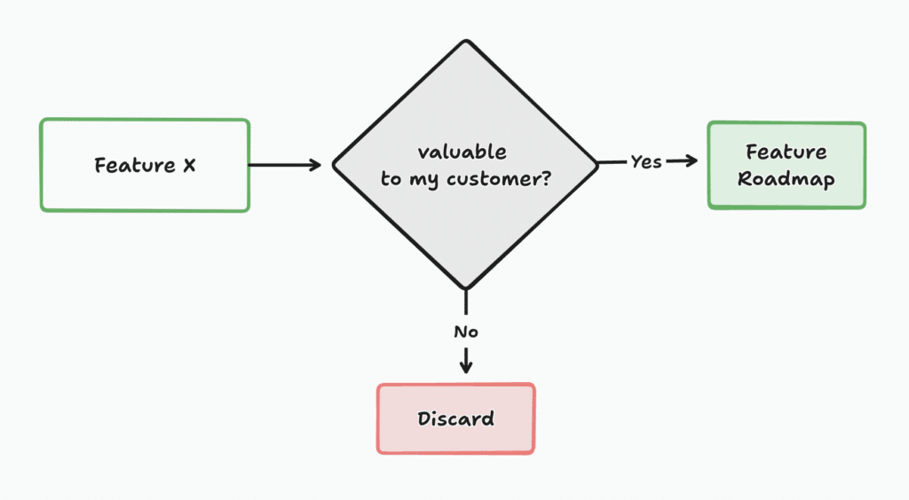

Over the past year, I’ve had weekly conversations with founders, learning about their ideas and working together to develop a plan to bring their product to life. A key part of this process is estimating the cost of software development.

Any diligent and responsible founder wants to understand how much capital is required to realise their vision. However, as the development process unfolds, they quickly realise that their initial idea will evolve - and with it, the overall development cost.

This isn’t a setback, it’s simply the nature of the journey. The sooner founders accept this, the sooner they can start asking the right questions - both before and during development - paving the way for a successful product.

If you plan to hire an agency, your success is not just dependent on a perfectly secure roadmap. Success relies on finding the right team , fostering trust, and establishing a shared understanding of how to approach the project. This is the foundation for achieving your goals and to be prepared for the constant evolution of your idea.

.elementor-12941 .elementor-element.elementor-element-e56f4e6{--display:flex;--flex-direction:column;--container-widget-width:100%;--container-widget-height:initial;--container-widget-flex-grow:0;--container-widget-align-self:initial;--flex-wrap-mobile:wrap;--background-transition:0.3s;}.elementor-12941 .elementor-element.elementor-element-f8d1905{--box-background-color:var( --e-global-color-f6f9b04 );--box-border-color:var( --e-global-color-secondary );--box-border-width:1px;--box-border-radius:12px;--separator-width:0px;--box-padding:12px;--header-color:var( --e-global-color-text );--item-text-decoration:underline;--item-text-hover-decoration:underline;--marker-color:var( --e-global-color-primary );--marker-size:5px;}.elementor-12941 .elementor-element.elementor-element-f8d1905 .elementor-toc\_\_spinner{color:var( --e-global-color-secondary );fill:var( --e-global-color-secondary );}.elementor-12941 .elementor-element.elementor-element-f8d1905 .elementor-toc\_\_header-title{text-align:start;}.elementor-12941 .elementor-element.elementor-element-f8d1905 .elementor-toc\_\_header, .elementor-12941 .elementor-element.elementor-element-f8d1905 .elementor-toc\_\_header-title{font-family:"Poppins", sans-serif;font-size:2.25rem;font-weight:700;text-transform:capitalize;line-height:1.2;}.elementor-12941 .elementor-element.elementor-element-f8d1905 .elementor-toc\_\_list-item{font-family:var( --e-global-typography-45f602c-font-family ), sans-serif;font-size:var( --e-global-typography-45f602c-font-size );font-weight:var( --e-global-typography-45f602c-font-weight );line-height:var( --e-global-typography-45f602c-line-height );letter-spacing:var( --e-global-typography-45f602c-letter-spacing );word-spacing:var( --e-global-typography-45f602c-word-spacing );}.elementor-12941 .elementor-element.elementor-element-f8d1905 > .elementor-widget-container{padding:32px 32px 32px 32px;}@media(max-width:1024px){.elementor-12941 .elementor-element.elementor-element-f8d1905 .elementor-toc\_\_list-item{font-size:var( --e-global-typography-45f602c-font-size );line-height:var( --e-global-typography-45f602c-line-height );letter-spacing:var( --e-global-typography-45f602c-letter-spacing );word-spacing:var( --e-global-typography-45f602c-word-spacing );}}@media(max-width:767px){.elementor-12941 .elementor-element.elementor-element-f8d1905 .elementor-toc\_\_list-item{font-size:var( --e-global-typography-45f602c-font-size );line-height:var( --e-global-typography-45f602c-line-height );letter-spacing:var( --e-global-typography-45f602c-letter-spacing );word-spacing:var( --e-global-typography-45f602c-word-spacing );}}

#### Contents

## The Complexity of Software Estimation

When seeking a quote, it’s important to remember that software estimation is both an art and a science.

The process involves predicting future work and accounting for uncertainties in scope, technology, and unforeseen challenges.

This creates a **“software estimation variability curve,"** where project costs and timelines can significantly fluctuate. On one end, a simpler project may closely align with its initial software estimation. On the other hand, more complex, evolving projects often grow beyond the original scope.

As project complexity increases, so does the variability of estimates. With more moving parts and decision trees to navigate, unforeseen obstacles are more likely to arise.

### Don’t Decide on Software Estimation—Learn From It

Every software development team has its own method for estimating project costs. Common techniques include:

- **Poker Estimation:** Team members estimate tasks using cards, discuss their differences, and reach a consensus on the complexity (story points).
- **Three-Point Estimation:** This method calculates project duration using optimistic, pessimistic, and realistic scenarios to account for uncertainty.
- **PERT Estimation:** This technique estimates project timelines by analyzing task dependencies and using a weighted average of expected durations.
- **Analogous Estimation:** Teams compare the current project with a similar one from the past to estimate costs and timelines.

No method is inherently better; each fits a team’s internal dynamics. However, remember that a good price doesn’t guarantee good quality, and a precise software estimate doesn’t ensure on-time delivery.

Instead of letting an estimate be the deciding factor, view it as a learning opportunity. Use it to **understand the building blocks of your idea**, identify where costs could escalate, and explore alternatives.

Additionally, it helps gauge the reasoning ability of the team giving you the software estimation. The way an estimate is presented often reflects the type of working relationship you’ll have with the team.

In the end, a software estimation should serve as a learning tool—not a deciding factor. It will help you better understand your product and assess the team you’re considering as a partner.

.elementor-16200 .elementor-element.elementor-element-fa6400f{--display:flex;--flex-direction:column;--container-widget-width:100%;--container-widget-height:initial;--container-widget-flex-grow:0;--container-widget-align-self:initial;--flex-wrap-mobile:wrap;--overflow:hidden;--background-transition:0.3s;--border-radius:12px 12px 12px 12px;}.elementor-16200 .elementor-element.elementor-element-283e311{--display:flex;--flex-direction:row;--container-widget-width:initial;--container-widget-height:100%;--container-widget-flex-grow:1;--container-widget-align-self:stretch;--flex-wrap-mobile:wrap;--gap:64px 64px;--background-transition:0.3s;}.elementor-16200 .elementor-element.elementor-element-283e311:not(.elementor-motion-effects-element-type-background), .elementor-16200 .elementor-element.elementor-element-283e311 > .elementor-motion-effects-container > .elementor-motion-effects-layer{background-color:#F4FAFE;}.elementor-16200 .elementor-element.elementor-element-283e311, .elementor-16200 .elementor-element.elementor-element-283e311::before{--border-transition:0.3s;}.elementor-16200 .elementor-element.elementor-element-857117e{--display:flex;--flex-direction:row;--container-widget-width:initial;--container-widget-height:100%;--container-widget-flex-grow:1;--container-widget-align-self:stretch;--flex-wrap-mobile:wrap;--background-transition:0.3s;}.elementor-16200 .elementor-element.elementor-element-857117e.e-con{--flex-grow:0;--flex-shrink:0;}.elementor-16200 .elementor-element.elementor-element-e6af329 img{width:100%;max-width:100%;height:100%;object-fit:cover;object-position:bottom right;}.elementor-16200 .elementor-element.elementor-element-e6af329{width:100%;max-width:100%;bottom:-44px;}body:not(.rtl) .elementor-16200 .elementor-element.elementor-element-e6af329{right:0px;}body.rtl .elementor-16200 .elementor-element.elementor-element-e6af329{left:0px;}.elementor-16200 .elementor-element.elementor-element-ec0de51{--display:flex;--flex-direction:column;--container-widget-width:100%;--container-widget-height:initial;--container-widget-flex-grow:0;--container-widget-align-self:initial;--flex-wrap-mobile:wrap;--gap:24px 24px;--background-transition:0.3s;--padding-top:112px;--padding-bottom:112px;--padding-left:0px;--padding-right:44px;}.elementor-16200 .elementor-element.elementor-element-ec0de51.e-con{--flex-grow:1;--flex-shrink:1;}.elementor-16200 .elementor-element.elementor-element-c168e59{--display:flex;--flex-direction:column;--container-widget-width:100%;--container-widget-height:initial;--container-widget-flex-grow:0;--container-widget-align-self:initial;--flex-wrap-mobile:wrap;--background-transition:0.3s;}.elementor-16200 .elementor-element.elementor-element-4aeb8ec .elementor-heading-title{font-family:"Poppins", sans-serif;font-size:32px;font-weight:700;}.elementor-16200 .elementor-element.elementor-element-8e0cd20{color:#000000;}@media(min-width:768px){.elementor-16200 .elementor-element.elementor-element-857117e{--width:360px;}}@media(max-width:767px){.elementor-16200 .elementor-element.elementor-element-283e311{--padding-top:40px;--padding-bottom:40px;--padding-left:var(--safe-margin);--padding-right:var(--safe-margin);}.elementor-16200 .elementor-element.elementor-element-857117e{--min-height:300px;}body:not(.rtl) .elementor-16200 .elementor-element.elementor-element-e6af329{right:0px;}body.rtl .elementor-16200 .elementor-element.elementor-element-e6af329{left:0px;}.elementor-16200 .elementor-element.elementor-element-e6af329{bottom:-76px;}.elementor-16200 .elementor-element.elementor-element-ec0de51{--padding-top:40px;--padding-bottom:0px;--padding-left:0px;--padding-right:0px;}}

##### Do you have a brilliant startup idea that you want to bring to life?

From the product and business reasoning to streamlining your MVP to the most important features, our team of product experts and ex-startup founders can help you bring your vision to life.

Let's Talk

### Beyond the Quote: Finding the Right Team

While the quote is essential, finding the right team is equally—if not more—important. A great team won’t just give you numbers; they’ll explain the logic behind their estimates.

They’ll walk you through their decision-making process, offering transparency about risks, trade-offs, and uncertainties, and providing insights into how they’ll manage these challenges.

Your relationship with the agency should be built on trust, not just numbers. A team that takes the time to explain their technical decisions, provides regular updates, and is transparent about changes in scope will save you time, money, and headaches down the line.

Ultimately, your commitment should be to your customers, not the features or technology. You need a team that shares this vision and works with you to deliver value efficiently—essentially, a team that you can eventually call your “extended co-founding team.”

My CMO, Rui, has written a [great resource](https://altar.io/how-to-avoid-failure-when-building-a-startup-with-a-software-development-company/) that dives deep into the importance of finding the right team – and how you can do it successfully. I highly recommend checking it out.

### The Importance of Transparency

An agency that operates as your extended co-founding team will prioritize transparency. In this model, estimates serve as a decision-making tool rather than a sales pitch.

A black-box software estimation, typical of fixed-bid contracts, don’t work well because the agency’s profit margin remains hidden, which can skew decision-making and diminish the ideation process's quality.

**A transparent software estimation process, on the other hand, allows both sides to collaborate without bias.**

As the project progresses, a transparent team will keep you informed about what they’re building and provide regular updates on progress and roadblocks.

Scope changes are inevitable, but an experienced team will have processes to manage these shifts. Regular communication keeps things aligned and gives you the flexibility to make necessary adjustments.

When deviations occur, a transparent team will discuss them immediately, helping you make informed decisions on scope or budget changes.

### What Drives Price? The Cost of Quality

Understanding what drives software development costs is crucial. At a high level, you’re dealing with both functional and non-functional requirements. Functional requirements refer to specific features or capabilities (like user authentication), while non-functional requirements include security, scalability, and performance. These non-functional elements often drive up costs.

It’s common for founders to seek multiple quotes and be surprised by the wide range of software estimates they receive. Often, lower-cost options seem appealing, but this can lead to overlooking critical non-functional requirements, resulting in "technical debt"—the need for costly fixes or overhauls in the future.

A cheap solution may work at the beginning, but as your user base grows, performance issues or infrastructure limitations could require expensive fixes. If these challenges aren’t accounted for from the start, you could risk losing customers and damaging your business’s credibility. An experienced agency will guide you through these considerations so you can make informed decisions.

.elementor-3329 .elementor-element.elementor-element-f79b780{--display:flex;--flex-direction:column;--container-widget-width:100%;--container-widget-height:initial;--container-widget-flex-grow:0;--container-widget-align-self:initial;--flex-wrap-mobile:wrap;--background-transition:0.3s;}.elementor-3329 .elementor-element.elementor-element-aa6dd2a{--display:flex;--flex-direction:column;--container-widget-width:100%;--container-widget-height:initial;--container-widget-flex-grow:0;--container-widget-align-self:initial;--flex-wrap-mobile:wrap;--gap:24px 24px;--background-transition:0.3s;--border-radius:12px 12px 12px 12px;--padding-top:70px;--padding-bottom:70px;--padding-left:var(--safe-margin);--padding-right:var(--safe-margin);}.elementor-3329 .elementor-element.elementor-element-aa6dd2a:not(.elementor-motion-effects-element-type-background), .elementor-3329 .elementor-element.elementor-element-aa6dd2a > .elementor-motion-effects-container > .elementor-motion-effects-layer{background-color:#29293E;}.elementor-3329 .elementor-element.elementor-element-aa6dd2a, .elementor-3329 .elementor-element.elementor-element-aa6dd2a::before{--border-transition:0.3s;}.elementor-3329 .elementor-element.elementor-element-95ae566{--display:flex;--flex-direction:column;--container-widget-width:100%;--container-widget-height:initial;--container-widget-flex-grow:0;--container-widget-align-self:initial;--flex-wrap-mobile:wrap;--background-transition:0.3s;}.elementor-3329 .elementor-element.elementor-element-99ebd14{text-align:center;}.elementor-3329 .elementor-element.elementor-element-99ebd14 .elementor-heading-title{color:var( --e-global-color-eb70be1 );font-family:var( --e-global-typography-0ff79ee-font-family ), sans-serif;font-size:var( --e-global-typography-0ff79ee-font-size );font-weight:var( --e-global-typography-0ff79ee-font-weight );line-height:var( --e-global-typography-0ff79ee-line-height );letter-spacing:var( --e-global-typography-0ff79ee-letter-spacing );word-spacing:var( --e-global-typography-0ff79ee-word-spacing );}.elementor-3329 .elementor-element.elementor-element-0ce57c0{text-align:center;color:var( --e-global-color-eb70be1 );font-size:20px;}.elementor-3329 .elementor-element.elementor-element-28db4d7{--display:flex;--flex-direction:row;--container-widget-width:initial;--container-widget-height:100%;--container-widget-flex-grow:1;--container-widget-align-self:stretch;--flex-wrap-mobile:wrap;--justify-content:flex-start;--background-transition:0.3s;}.elementor-3329 .elementor-element.elementor-element-70fbc6a .elementor-field-group{padding-right:calc( 24px/2 );padding-left:calc( 24px/2 );margin-bottom:32px;}.elementor-3329 .elementor-element.elementor-element-70fbc6a .elementor-form-fields-wrapper{margin-left:calc( -24px/2 );margin-right:calc( -24px/2 );margin-bottom:-32px;}.elementor-3329 .elementor-element.elementor-element-70fbc6a .elementor-field-group.recaptcha\_v3-bottomleft, .elementor-3329 .elementor-element.elementor-element-70fbc6a .elementor-field-group.recaptcha\_v3-bottomright{margin-bottom:0;}body.rtl .elementor-3329 .elementor-element.elementor-element-70fbc6a .elementor-labels-inline .elementor-field-group > label{padding-left:8px;}body:not(.rtl) .elementor-3329 .elementor-element.elementor-element-70fbc6a .elementor-labels-inline .elementor-field-group > label{padding-right:8px;}body .elementor-3329 .elementor-element.elementor-element-70fbc6a .elementor-labels-above .elementor-field-group > label{padding-bottom:8px;}.elementor-3329 .elementor-element.elementor-element-70fbc6a .elementor-field-group > label, .elementor-3329 .elementor-element.elementor-element-70fbc6a .elementor-field-subgroup label{color:var( --e-global-color-eb70be1 );}.elementor-3329 .elementor-element.elementor

   Full Name  Business Email  Subscribe

### Don’t Go All at Once

When getting a quote, consider breaking your project into multiple releases rather than trying to build everything in one go.

[Iterative development](https://asana.com/resources/iterative-process) allows you to focus on core features, gather user feedback, and make adjustments along the way. By launching in phases, you can manage costs more effectively and remain flexible in adjusting features or timelines based on real-world needs.

### How to Send a Good Request for Proposal

To tie everything together, here are some tips for writing a solid request for a proposal (RFP):

1. **Focus on the value you want to provide to your customers**—the problem you're trying to solve.
2. **Be specific about the solution you envision** and clearly outline both functional and non-functional requirements.
3. **Stay minimalistic**—focus on essential features that will provide maximum value to your customers in the first iteration

Finally, be transparent about your roadmap and budget. This will help the agency give you a more focused software estimation that aligns with your expectations. A good agency will adapt solutions to fit your constraints while being open about their decision-making process. If you're looking for transparency, you need to lead by example.

If you're looking for a template to help you get started, [I've created one for you](https://docs.google.com/document/d/1krHq8CQfO2B-OrvBLCzvIJ34ly2Th53NCwOmjCkdzbc/edit). Feel free to download it and use it as a foundation for your project.

## Conclusion

Getting a quote from a software agency isn’t just about comparing numbers. It’s about navigating a complex process filled with variables and unknowns.

Founders should look for an agency that offers clear, honest communication and transparency at every step. It’s about finding a team that understands your vision mimics the behaviour of an internal team and can guide you through the process with trust and collaboration.

By preparing clear requirements, thinking long-term, and understanding what truly drives costs, you’ll be in a much stronger position to make the right decision as you will get a more accurate software estimation. This will set your product and your business up for success.

Thanks for reading.
