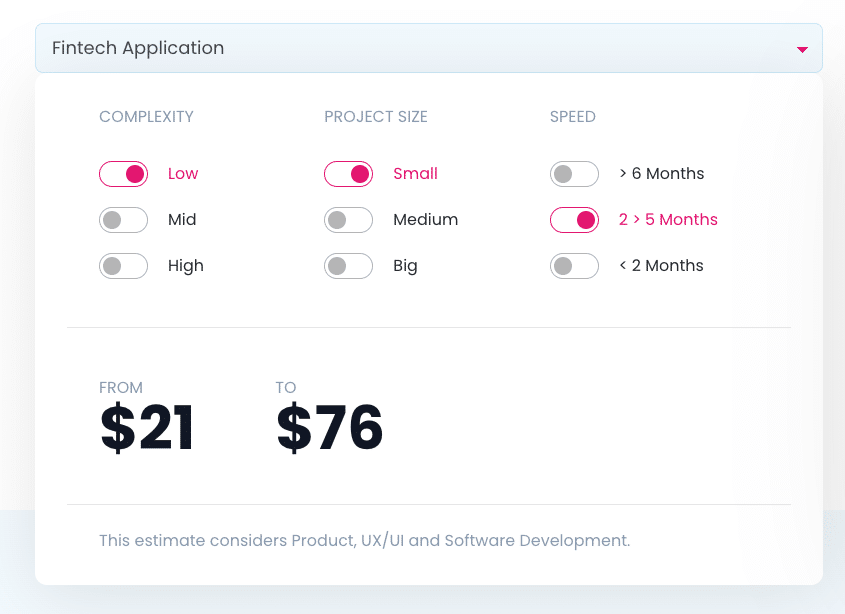
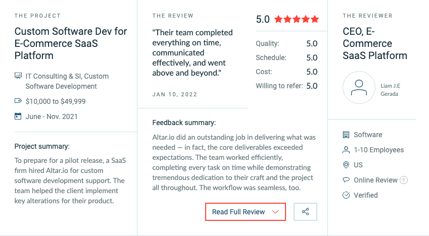

When our founder Daniel first had the idea to build Altar, he’d already built six startups from the ground up.

Earlier in his entrepreneurial career, being a non-tech founder, he faced a challenge that is quite common to anyone in that position, wanting to start a tech startup:

Finding a skilled technical expert to help him out with nothing but an idea on a napkin.

At some point, he even had to learn how to do some basic coding by himself.

That’s when he fell in love with technology.

Although he knew he’d never be proficient enough to build something complex by himself, that started him on a mission to create a company that would make sure no great idea would be lost for the lack of technical talent to execute it.

So he teamed up with a few other startup founders and some highly skilled technical people.

Altar.io was born.

Throughout the years, applying our accumulated startup experience and working with dozens of startup teams, we created and fine-tuned a framework intended to drastically reduce the failure rate of startups.

And it’s safe to say we nailed it.

It’s what’s helped over half of the 60+ founding teams that trusted us with their product development secure VC funding – in an ecosystem where only 0.05% of startups ever reach that goal.

Today I wanted to share not only the exact process we use but also some of the most important patterns we see in successful founding teams.

Of course, there are a million and one factors that will inevitably determine the success or failure of your startup. But I’ve seen how valuable the right process can be to mitigate the risks.

And it all starts with having a problem, not an idea.

#### Contents

## 1\. Make Sure You Have a Problem, Not an Idea

A pattern I’ve seen among the successful entrepreneurs I’ve met is that their ideas tend to be directly related to a problem they’ve seen or experienced.

Usually, having worked in a specific industry for several years, they spot an inefficiency that people within that industry face.

Then they set out to solve it.

Let me give you a more tangible example, from [one of the entrepreneurs I spoke to recently](https://altar.io/founder-story-the-key-decisions-when-building-a-fintech/) as part of our content series *The Startup Journey,* Christian Nothacker.

While working at a fintech startup, Christan noticed his users (small business owners) were facing major inefficiencies in the financing process offered by traditional banks in Italy.

We saw a lot of inefficiencies in the way customers and SMEs interacted with banks. Whether they were opening an account or asking for a loan, submitting an invoice, etc.

For example, we’ve heard stories of customers queuing at their bank with a paper invoice, handing it over at the counter and waiting five days for the information to appear on their bank account. This is just one inefficiency we saw in the relationship with a business owner and their financial needs and the bank.

Our vision was to digitalise the day-to-day interaction between SMEs and their banks. Making it faster, easier and often cheaper for both parties.”

After doing some research (spoiler alert for step two) Christian discovered no other players were tackling this problem.

So he took his industry experience, built a small team, and set out to do it.

By setting out to solve a problem or inefficiency, you’re in a much better position to succeed – and are far more likely to avoid becoming one of the [many startups that fail due to no market need](https://www.cbinsights.com/research/startup-failure-reasons-top/).

Once you’ve identified the problem, it’s time to make sure you have the funds to commit to this journey.

Expert Tip

_“Don’t infer that there will be a demand for the product you’re going to build. You have to quantify customer action – not the intent. The burning question is will users like your product enough to take action at a cost that will enable you to run a sustainable business?”_

[**Yaron Samid**](https://altar.io/from-being-fired-to-building-a-multi-million-dollar-fintech-startup/)**, Serial Entrepreneur & Startup Founder**

## 2\. Work Out How Much Runway You Have

It’s important to not underestimate the amount of money it takes to bring your startup idea to life.

I’ve had entrepreneurs come to me with $10k to build an MVP or initial product, and, in most cases, that’s simply not enough.

Just take a look at this screenshot from our [pricing simulator](https://altar.io/pricing/) to give you an idea of what it takes to build a small, low-complexity fintech product:

 Obviously, this is a generic simulation. A lot more information is needed to get an accurate estimate for a project. But according to our experience, most projects don’t fall far off these numbers.

You need to ask yourself, how far can I get through my startup journey with what I have in the bank?

If like many entrepreneurs, you’re not sitting on millions of dollars, you will arrive at the conclusion you need to raise some money.

The overarching question then becomes: [where are you going to find that funding?](https://altar.io/startup-series-funding-everything-you-need-to-know/)

In today’s landscape, investors won’t give you money for a startup idea on a napkin. Something CEO and veteran startup investor Paul O’Brien made clear [when I spoke to him recently](https://altar.io/expert-interview-funding-your-startup/).

“No startup in the history of the world can raise money just to get going. Unless you’re Elon Musk, unless you’re Mark Zuckerberg, no one is going to give anybody money just to start something. You will always have to start with your own savings or debt - bootstrapping.”

Which may end up being a good thing.

As I’m sure you’ve heard, ideas are worth very little. Execution is what is valuable, and most investors know this.

Then, besides the effort needed to pique their interest with just an idea on a napkin, there isn’t much leverage you can use to avoid seeing a big chunk of equity going out the window. And you’d later regret it.

So here are some ways you can bootstrap your startup:

- Personal savings
- A small business loan
- Crowdfunding — on platforms such as [Seedrs](https://www.seedrs.com/), [Kickstarter](https://www.kickstarter.com/) or [Indiegogo](https://www.indiegogo.com/).
- Investment from friends and family – usually for an equity stake in your startup or convertible note.

Then, once you have a product out in the market, you can use [this guide](https://altar.io/startup-series-funding-everything-you-need-to-know/) to help you raise some money from investors.

The next step is to do some research to ensure you can transform your startup idea into a solid product vision.

##### Do you have a brilliant idea that you want to bring to life?

From the product and business reasoning to streamlining your MVP to the most important features, our team of product experts and ex-startup founders can help you bring your vision to life.

Let's Talk

## 3\. Do Your Research

The next key step in bringing your idea to life is to make sure you build it for the person whose problem you're solving.

Another common mistake I see a lot is a founding team assuming they know what their users want.

Usually, they end up very surprised when they’re met with low adoption rates.

Remember, the user is more demanding than ever. Focus not only on solving the problem but creating the best possible experience while doing it

For this, you’ll need to assess your stakeholders, competitors and the size of your market.

### Stakeholder Analysis

Now you’ve worked out the problem your startup idea will solve, it’s time to look at the people you’re solving it for.

You should describe them in terms of demographics, psychology, geography, observed behaviour and any other relevant factors.

By analysing your stakeholders you’ll be able to discover crucial information that will help you shape the perfect user experience.

Once you’ve analysed the stakeholders involved in your startup, it’s time to look at the competition.

### Competitor Benchmarks

The next logical step in bringing your startup idea to life is to look at the other companies in your market currently solving the problem for your target stakeholder.

It’s important to note here you should be looking at direct, indirect and potential competitors.

You should start by listing all your competitors. Then go into more detail to learn as much as possible about them by identifying their:

- Value proposition;
- Brand positioning;
- Target group;
- User base size;
- Business model;
- Yearly revenue;
- Capital raised.

There are some useful tools out there to help you get started, here are some our product team recommends:

To learn about competitor revenue and capital raised: [Statista](https://www.statista.com/), [Crunchbase](https://www.crunchbase.com/home).

To discover the size of your competitors’ user base: [SimilarWeb](https://www.similarweb.com/).

Alongside the above list, I recommend answering the following questions to gather even more information:

- How long have they been on the market?
- For startups: are they backed up by a big corporation? What were the latest investment rounds they underwent?
- Which sales channels do they use?
- Are they analogue or digital?
- How are they reaching your target market?
- **What will you do to ensure your solution is better than the current market offering? How will you differentiate yourself from the alternatives?**

With all this information in hand, identify your competitors’ main strengths and weaknesses.

This will help you work out where your startup will fit in your competitive market.

Finally, you should assess the size of your market.

### Market Size

To begin to get an idea of your market size, you should look specifically at three, simple factors:

- Total Available Market (TAM)
- Serviceable Available Market (SAM)
- Serviceable Obtainable Market (SOM)

To find statistics on the above, I recommend using tools like [Statista](https://www.statista.com/) &  [Google Trends](https://trends.google.com/).

Bear in mind that the calculation of SOM is mainly based on your estimated potential to penetrate the market. At this stage of your startup journey, it’s normal to not have a precise value in that category.

That being said, it’s good to start thinking about the market share you feel your startup idea could eventually obtain.

With your stakeholder analysis and competitor benchmarking in hand, you’re ready for the next step:

## 4\. Transform Your Research Into an MVP Using a Proven Framework

Having looked outward at the market around you, it’s now time to turn your gaze back inward to transform your startup idea into a set of user stories that are ready for development.

This is where the core [process that we developed at Altar](https://altar.io/service-product-scope/) comes in. It starts with creating an elevator pitch to showcase your value proposition.

### Crafting Your Value Proposition

Having completed steps one and two, you’re in a perfect position to craft your value proposition.

You simply need to combine:

- Your target stakeholders
- The problem they face
- Your startup idea (a.k.a. your solution)
- The key benefit your solution offers
- Your competition
- Why your solution is different/better than the current market offering

Here is a template to help you get started:

Elevator Pitch Template

**\_\_\_\_ (Name of your product)** has been conceived for **\_\_\_\_ (your stakeholders)** who **\_\_\_\_ (state their problem)**. **\_\_\_\_ (Name of your product)** is a**\_\_\_\_\_ (a statement of its key benefit/solution)**. Unlike **\_\_\_\_ (the current solution)** we **\_\_\_\_ (say what differentiates you from the alternatives/your existing competition)**.

If your value proposition isn’t crystal clear from your elevator pitch, you should look again at your target market, competition or even the problem you’re trying to solve.

If your value proposition *is* crystal clear you can start looking at the assumptions surrounding your elevator pitch.

### Defining Your Assumptions

Your value proposition is based on several assumptions. For example, you’re assuming that users aren’t happy with the current solution and need something more.

More than that, you’re assuming that your startup idea is the key to fixing that.

Deconstruct the statements from your elevator pitch/value proposition to find the most relevant assumptions.

Then, revisit your research to identify which assumptions have already been validated by your stakeholders and competitors.

Finally, identify which assumptions you will need to validate with an MVP and the KPIs you can use to measure them

Once you’ve done that, you can start creating your feature list.

### Building Your Feature List

The last step in turning your startup idea into a scoped product vision is to create a feature list for your [Minimum Viable Product (MVP)](https://altar.io/features-inside-mvp-3-steps-know-answer/).

[I recommend the MVP route](https://altar.io/service-mvp/) to any entrepreneur setting out to build a tech startup. Building an MVP allows you to maintain a short time-to-market while gaining the maximum user feedback possible.

To build your feature list, you want to look at your assumptions and consider what feature is needed to prove (or disprove) it.

If you have an idea for a feature that doesn’t directly help you validate your assumptions, it should be put aside. If your assumptions are proven, you can add extra features via iterations.

Don’t waste your money and importantly time on them at this stage.

Once you’ve scoped your product, it’s time to build it – and for that, you’re going to need an extra pair of hands.

Related: [The Right Roadmap to Build an MVP: From Idea to Launch](https://altar.io/the-roadmap-to-build-an-mvp-from-idea-to-launch/)

## 5\. Onboard the Right Team to Help You

As a non-technical founder, finding someone to help you build your product is one of the biggest barriers to bringing your startup idea to life.

As I mentioned in the introduction, our founding team struggled with this first hand – and this was over six years ago, this problem has become much worse since then.

It was one of the reasons they came together to build Altar – so no entrepreneur would struggle to bring their startup idea to life just because they couldn’t find the right technical expertise.

That said, generally speaking, you have three options to build your startup product:

1. Find a CTO or Tech Co-Founder
2. Hire a freelance developer or two
3. Reach out to a software development company

My advice here is if you can find a CTO or technical co-founder that’s right for you, onboard them and never look back.

Which is not always easy.

I’ve seen many entrepreneurs spend months looking, [only to come up empty-handed](https://altar.io/building-a-startup-without-a-technical-co-founder/).

I spent six months trying to find a technical co-founder. The closest I got was Tom. He wasn’t a CTO but had the 5 years of experience I was told a co-founder needed. He was very busy, so when I asked him to leave his job if I secured investment, he had second thoughts. Whilst he wasn’t a CTO on $244k, even the average developer salaries often are too good to give up!

Dudley Gould, Founder, [Audapio](https://altar.io/building-a-startup-without-a-technical-co-founder/)

You need to find someone who has an abundance of technical expertise, leadership and management skills.

On top of that, they have to be passionate about your startup idea and ready to commit 100% of their effort to it.

Finally, you need to be able to communicate with ease and align on the critical factors that will affect your startup.

My founding team and I always describe it as a business marriage. Finding someone that [matches all of these criteria perfectly](https://altar.io/how-to-find-a-cto-for-your-startup-the-founders-guide/#founders-alignment) is extremely difficult – especially when you're working on a short runway.

Let’s look at the other options.

If you are considering the freelancer path, make sure you know what you’re signing up for. You will be the one in charge of managing them. This is a tall order for any non-technical entrepreneur.

I personally wouldn’t recommend this route unless you have prior experience managing tech teams.

On the other hand, software development companies will usually have a project manager in place to ensure the developers tasked with your project are hitting the milestones you laid out.

That being said, working with a software development company comes with a unique [set of challenges](https://altar.io/10-reasons-why-outsourcing-software-development-fails/) as well.

If you choose to go down the agency route, do your due diligence and make sure you choose a partner who will make you [say something like this at the end of the process](https://clutch.co/profile/altario?utm_campaign=Vendor%20Notification%20-%20Refs%20&%20Reviews&utm_medium=email&_hsmi=98448842&_hsenc=p2ANqtz-8aw0F624_J8KFHheCBkGVfKgGPkjx7t6-Bmero8h1tcRVgef7ghkyQBUHMN89vYISPoeoYymueujY8q8QuXnmXd98dqg&utm_content=98448842&utm_source=hs_automation#reviews):

For more tips and insights on forming a successful founder-agency relationship, [check out this resource](https://altar.io/founders-guide-how-to-outsource-software-development-2020/).

## 6\. Share Your Startup Idea as Much as Possible

Many entrepreneurs are cautious about sharing their startup idea. The reason always being: “if I share my idea, someone might steal it”.

This, in my experience, is a mistake.

You should share your idea as much as possible to gather help and feedback.

Ideas alone are worth nothing – it’s the work you put into them that is valuable.

Plus, you never know what you can gain by openly talking about your startup idea with the right people.

Take Giacomo De Lorenzo as an example. He sold his fintech before it even launched and attributes much of this success to talking about your startup idea:

"Don’t underestimate the importance of sharing your idea and being able to ask for people’s help. I wouldn’t have imagined I could have so much help from the people I talked to at the early stages of Moneymour, their advice had a hugely beneficial impact.

Let me give you an example:

Our startup incubator was extremely helpful. But not all of the startups that were part of that acceleration programme made the right use of them.

They were not calling them twice a day. Whereas I knew I had that opportunity so I took it, and it was very valuable for us.

So embrace that ability to ask for help, it’s one of the most valuable resources you have. You’ll be surprised how many people will be happy to help.”

If you’re on the fence with this one send a couple of Linkedin messages to successful founders and ask them about it. Not only will they say the exact same thing, but that will also validate most of what I’ve said about this step.

## 7\. Target the Right Early Adopters

Earlier in the article, I talked about the importance of knowing your stakeholders from the lens of product development.

Now it’s time to address that topic again, from the lens of early adopters and go-to-market strategy.

By now, you should already have narrowed down your target market to the people who are most affected by the problem you’re solving.

This will make your go-to-market both more effective and less expensive.

Now it’s time to get out there and talk to them.

I see many founders hide behind a brand that is yet to be created. They think that they need a flashy website, full of bells and whistles to attract early adopters. This is a fallacy.

The person who will be attracting, and ideally selling to early adopters is you, the founder.

In short:

**Early adopters buy your vision, not your product.**

At this stage, your product is at an MVP level. Without a doubt, there is still a lot of work to do to make it the best solution on the market.

Early adopters are investing in what your product *will be,* not what it is today.

And the best person to sell them the vision is you – the person who has seen this from startup idea to early-stage product.

## Wrapping Up

As I’m sure you know already, there are a million factors that will influence the success of your startup.

Your industry knowledge, connections, the industry itself, the team you build around you, timing, luck, the list goes on.

**But if I have to boil everything down into one piece of advice to reduce your odds of failure, I would tell you that having a proven framework to blueprint your product takes the cake.**

As I mentioned at the start of this article, it’s a proven framework that helped over half of the founders that trusted us with their product development secure VC funding – in an ecosystem where only 0.05% of startups ever reach that goal.

Thanks for reading and good luck with your entrepreneurial journey.
