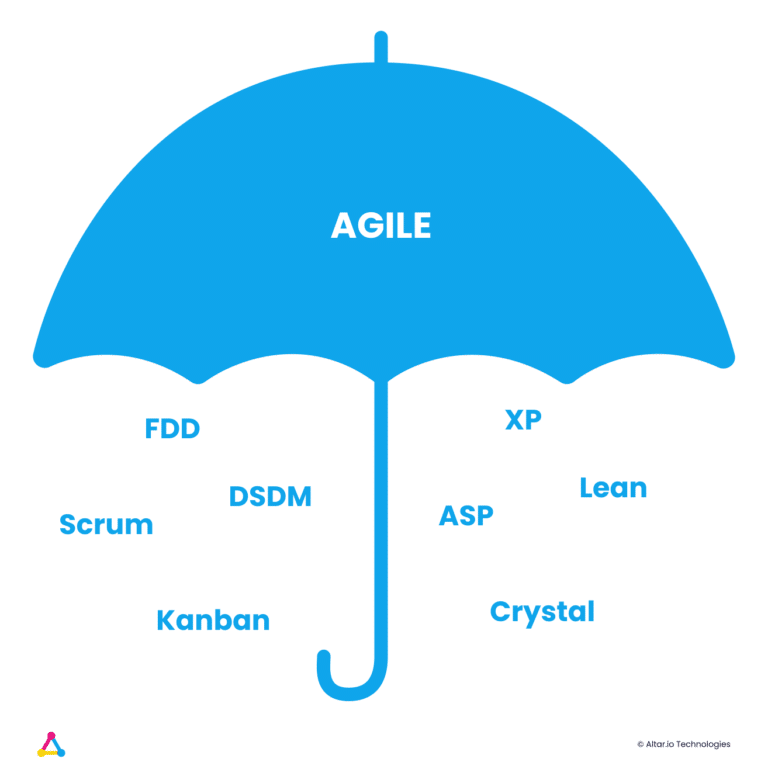

If you’re an entrepreneur beginning your tech startup journey, you’ve probably heard the terms Agile and Scrum get thrown around.

They’re often used interchangeably – which can cause a lot of confusion if you’re new to the two methodologies.

Having spent the last three years as a Scrum Master, I’ve seen first-hand how daunted early-stage entrepreneurs can feel when presented with these, seemingly confusing terms.

However, defining Agile and Scrum is actually pretty straightforward.

The short answer is, that Agile is an approach to software development, while Scrum is one of the methodologies that fall under the Agile umbrella, alongside other key methodologies such as XP (Extreme Programming) & Kanban.

But to define why Agile and Scrum have risen in popularity, we need to dig a bit deeper.

Throughout this article, I will explore the Agile approach. I will go on to contextualise how it can benefit your startup using Scrum methodology (and the roles you usually see in Scrum teams) as an example.

To get started, I want to give you a more in-depth understanding of both Agile and Scrum.

 

#### Contents

## What is Agile?

Agile allows project teams to adapt to changing priorities, rapidly respond to problems as they arise and learn from frequent feedback from other product stakeholders – saving time and money.

It’s an approach to software development where the emphasis is on breaking the product development down into smaller, shorter increments.

It was created in 2001 when 17 software developers came together to create a set of principles they thought would lead to better organisational communities.

The result was the [Agile Manifesto](https://agilemanifesto.org/history.html), which they wrote to define the way they organise and execute their work.

The manifesto can be boiled down into four key values that guide the Agile philosophy:

- Individuals and interactions over processes and tools
- Working software over comprehensive documentation
- Customer collaboration over contract negotiation
- Responding to change over sticking to the plan

While these key values are an excellent starting point to guide the way you can effectively build your startup, they don’t give you a way to actively implement them into your day to day product development.

That’s why several frameworks and methodologies have been developed to help you do just that. One of which is Scrum.

##### Do you have a brilliant idea that you want to bring to life?

From the product and business reasoning to streamlining your MVP to the most important features, our team of product experts and ex-startup founders can help you bring your vision to life.

Let's Talk

## What is Scrum?

Scrum is a structured framework that teams can use to implement Agile principles.

The framework is built on delivery cycles known as “sprints” that generally last between one and four weeks. This system is designed to enable teams to deliver work incrementally that builds on the previous sprints’ work.

The co-creators of Scrum, Jeff Sutherland and Ken Schwaber outline Scrum as being built on three key pillars:

- **Transparency** – Where all stakeholders have complete access to information on the project, from progress to goals
- **Inspection** – The team continuously works to improve the product and process
- **Adaptation** – The team are happy to quickly refocus to address new priorities

These three pillars are backed up with five core values every Scrum team member should embody:

- Courage
- Focus
- Commitment
- Respect
- Openness

Scrum, and its variants, are arguably the most common Agile methodologies in use. [Around 72% of Agile teams use Scrum](https://digital.ai/resource-center/analyst-reports/state-of-agile-report) or one of its derivatives, according to the 15th State of Agile Report.

The respondents also shared why they’ve switched to using Agile and Scrum. Among the top reasons were increased team productivity, accelerated software delivery and reduced project costs.

Before we move on to how Scrum can benefit a startup, I first want to give you a quick overview of a common Scrum team composition.

Related: [How to Build a Successful Minimum Viable Product (MVP) in 3 Steps](https://altar.io/features-inside-mvp-3-steps-know-answer/)

## The Agile Scrum Team

An Agile Scrum team usually consists of up to nine people – however, there are only three key roles within the team composition.

### The Product Owner

The Product Owner (PO) is the single person responsible for maximising the value of what the development team produce.

The PO does this by prioritising tasks, translating the product vision to the development team and validating completed tasks.

### The Development Team

The Development Team are responsible for the execution of the work. This includes all the specialists we need to achieve the sprint’s goals and gather fast feedback on that sprint.

The individual developers themselves are cross-functional to match the flexibility of the Agile methodology.

## The Scrum Master

The final vital member of the Scrum team is the Scrum Master. Just like the Product Owner, this is a single person role. They’re responsible for facilitating Scrum theory within the team and supporting them.

They’re often referred to as the “servant” of the Scrum team. This sums up the role perfectly – they’re there to create an environment that enables an effective product development process.

They’re passionate about Scrum values. They execute their role by clearly defining the Scrum rules and rituals ensuring that each team member follows them effectively.

Often, they’ll coach each team member individually as well as create their own variant of the Scrum rituals to suit their needs. While this approach is not “by the book” Scrum, it ensures that the methodology is tailor-made for the project.

Unlike traditional project management, the Scrum Master is _not_ the manager of the team. The Scrum Master is a self-organised advisor, there to make sure that sprints are being executed correctly by the above stakeholders.

Finally, let’s take a closer look at how Agile Scrum can benefit your startup.

## How Agile Scrum Methodology can Benefit Your Startup

I’ve already mentioned some of the benefits of Scrum, but here I wanted to dig a bit deeper to give you a better understanding of why so many startups have adopted this methodology.

The greatest benefit of Scrum methodology is, without a doubt, its flexibility. Due to its sprint-based approach, the Scrum team can gain regular feedback from stakeholders and, more importantly, users.

Meaning that every one to four weeks (depending on your sprint length) the team can easily adjust the product requirements according to feedback from users or customers and address their real needs.

This information also allows them to adjust the project’s goals as they build to provide stakeholders with more valuable iterations.

This is very different to traditional project management, known as the Waterfall Model. When building under the Waterfall Model, stakeholders only see the product when it’s finished and ready to launch.

Additionally, it’s hard to enact changes in requirements under the Waterfall Model due to contract and bureaucracy.

For these reasons, the Waterfall Model brings with it several risks. If for whatever reason, the stakeholders are not happy with elements of the product, it’s impossible to go back and develop something different.

This is because the allotted time and money for the product development has passed already.

This is something that not the majority of startups can’t afford to do – and even if they can, the increase in time-to-market can have serious effects on the product’s success in the long run.

Using Scrum, these potentially startup-killing hurdles are easily avoided.

The team can adapt at a sprint's notice, improving iteration by iteration to deliver a product that has the best chance of success as it is far more likely to address the users’ real needs due to their continuous feedback.

It also allows you to bring a product to market much faster, usually at a cheaper cost.

## Wrapping Up

Scrum is excellent when dealing with complex projects that are built in a changing environment.

It’s for this reason that it’s so well suited to early-stage startup products. If your product is innovative and you’re dealing with unchartered waters, Scrum gives you the flexibility to guide the product with precision as it matures.

More than this, early-stage startups often have a limited budget and runway. Again Scrum comes to the rescue. Scrum helps you ensure you’re only developing features that you _know_ users want, thanks to the real-time feedback. This means you’re both:

- Building fewer features (reducing development time and cost)
- Building a higher quality product (as you won’t be adding unnecessary features that the user doesn’t want or need)

If you have any questions about Agile Scrum, and how to implement it in your startup, [click here](https://altar.io/start-a-project/). We’ll be happy to answer any questions you may have.

Thanks for reading.
