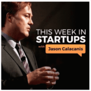
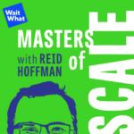
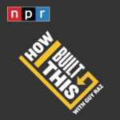
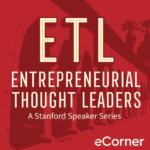
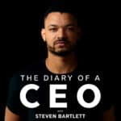
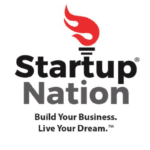

Bill Gates, Elon Musk, Sir Richard Branson, Steve Jobs.

What do all these successful entrepreneurs all have in common?

They never stop learning.

The hunger to learn new skills and strategies that drive your entrepreneurial journey to the next milestone is essential for any entrepreneur.

As I’m sure you know, trying to find time to learn new skills while managing a delicate work-life balance is no mean feat.

That’s where podcasts come in.

Packed with fascinating conversations, insightful lessons and excellent entertainment, business podcasts have become the go-to knowledge source for leading entrepreneurs.

Whether you’re cooking, hitting the treadmill, waiting for a flight or commuting, podcasts provide easily digestible content that is immediately applicable to you and your business.

So I set out to find the 20 best business podcasts for entrepreneurs, with a summary of what they offer, so you can easily discover which one is right for you, stick on those headphones and get learning.

Full Transparency...

This article does not contain affiliate links. Meaning neither I nor Altar.io receives any commission if you should choose to listen to one of them.

To ensure this article remains impartial, I did not reach out of the following podcast hosts, or their teams, when creating this list. It was created through personal experience, the experiences of friends and colleagues and [reviews](https://www.podparadise.com/).

#### Contents

## 1\. The Tim Ferriss Show

Tim Ferriss is a successful entrepreneur, probably best known by most for his New York Times #1 bestselling book [_The 4-Hour Workweek_](https://fourhourworkweek.com/)*.* His podcast, [_The Tim Ferriss Show_](https://tim.blog/podcast/), is one of the best business podcasts for entrepreneurs. It is regularly ranked as the number one business podcast on Apple Podcasts. It’s the first podcast to surpass 1M downloads and has now surpassed the 500M download mark.

In each episode, Tim interviews leaders in an eclectic range of industries from business to art, extracting tactics, tools and processes that you can use in your day-to-day. This includes morning routines and exercise habits and more business focussed advice like time-management tips to name but one.

His long-form podcasts are both enjoyable and incredibly informative. He achieves this in the way he deconstructs what his guests share, transforming it into easy-to-digest valuable nuggets of information.

The 400+ list of past guests on the *Tim Ferriss Show* includes Peter Thiel, Jamie Foxx, Seth Godin, Hugh Jackman, Doris Kearns Goodwin and Jon Favreau.

What Entrepreneurs Are Saying:

“Huge variety of world-leading guests from all walks of life. If you’re looking for something to consistently challenge you to open to new ideas, concepts, habits, or strategies— this podcast is unmatched”

“Been listening for a few years now. I’ve also read two of his books. Ferris is able to straddle the line between informative and entertaining. His podcast has helped me evolve. Episode #464 is clearly his swan song that reveals his deeply personal revelations that gives the listener an insight that goes beyond the pale in terms of its healing potential. I don’t see Ferris as a podcaster. He’s one of my teachers on the journey."

## 2\. This Week In Startups

One of the top-rated business podcasts for entrepreneurs, guests join host Jason Calacanis to bring you a weekly digest of the best, worst, and “most outrageous stories” from the tech industry.

This Week In Startups gives listeners valuable insights on how to build a startup, how angel investment works and everything in between. His knowledge of the tech industry twinned with a trademark blunt humorous style makes this business podcast a must-hear.

What Entrepreneurs Are Saying:

“Jason and the team have been an incredible source of content, inspiration, and entertainment for over 6 years for me personally. It's an incredible source for information I've used in my career and has helped orient my own desires towards investing.” 4/5

“I love this podcast. Any entrepreneur should start listening. I find this a great way to stay motivated and educated in the startup world without having to live in the Bay Area. Also, Jason is fun... this isn't a mono-tone bland conversation.... it is entertaining and educational!” 4/5

## 3\. Masters of Scale

[_Masters of Scale_](https://mastersofscale.com/) is not only one of the most popular business podcasts for entrepreneurs on the web, it comes personally recommended to me by serial entrepreneur [Yaron Samid](https://www.linkedin.com/in/yaronsamid/), who we [recently interviewed](https://altar.io/from-being-fired-to-building-a-multi-million-dollar-fintech-startup/).

In each episode of this podcast host Reid Hoffman, the co-founder of LinkedIn & Investor at Greylock gives us a close look at legendary entrepreneurs and their companies. He deconstructs their stories to show how they have grown from anonymity to global recognition.

Aside from the long-list of legendary guests and valuable insights Hoffman provides, the podcast is brilliantly edited and snappy. The use of sounds brings another level to the storytelling experience, making this podcast as entertaining as it is informative.

What Entrepreneurs Are Saying:

“As an exec in the tech industry, I often find myself looking for inspiration and ideas on how to approach my work. This podcast provides wisdom and insights that help propel me toward sound professional decisions. At times, I am also able to apply lessons learned to my personal life. Double win.” 4/5

“Reid, the host of the Masters of Scale podcast, highlights all aspects of business, entrepreneurship and more in this can’t miss podcast! The host and expert guests offer insightful advice and information that is helpful to anyone who listens!” 5/5

## 4\. The School of Greatness with Lewis Howes

*[The School of Greatness](https://lewishowes.com/sogpodcast/)* sits high on the list of business podcasts for entrepreneurs on all the popular podcast platforms. Hosted by Lewis Howes, best-selling author of *The School of Greatness* and *The Mask of Masculinity* has gained over 150 million downloads.

Joined by an impressive list of guests, he shares stories from entrepreneurship to fitness, mental health and mindset.

Past guests include Tony Robbins, Alanis Morrisette and Arriana Huffington to name a few.

Howes' uncanny skill of getting deep, insightful answers from his guests makes this business podcast a great font of information for any entrepreneur.

What Entrepreneurs Are Saying:

“I started listening to Lewis years ago and he has been a mentor from afar since I started listening to his podcast! His insight, research, passion, and inspiration have helped me step into the next level of my career and personal growth journey. Thank you, Lewis, you’re heart-centred leadership is one of few in this world” 5/5

“I started listening to the podcast a few years ago when Brené Brown was on. I’ve been hooked ever since! So grateful for the incredible thought leaders Lewis has introduced me to. I’ve gained so much wisdom & insight plus an incredible community of likeminded people. Thanks for all the work you pour into this podcast-it’s impacting so many lives!” 5/5

## 5\. The GaryVee Audio Experience

[_The GaryVee Audio Experience_](https://www.garyvaynerchuk.com/podcast/) is one of the most popular business podcasts for entrepreneurs. Why? Because of its host Gary Vaynerchuk.

Vaynerchuk is entirely irreverent, to say he doesn’t give a s\*\*t  is an understatement. Of course, this alone wouldn’t be enough to make this business podcast successful.

However, Vaynerchuk backs up his brutally blunt hosting style with a wealth of business and marketing knowledge that shows why he’s considered one of the leading entrepreneurs of our generation.

This podcast is great for if you want quick, punchy information straight into your eardrums, with episodes as short as 7 minutes. As well as longer-form audio content lasting around an hour.

What Entrepreneurs Are Saying:

“If your first thought is “man this guy interrupts too much he’s so self-centred”, please please please reconsider. Gary’s intent is always to give value to the audience and through that he might interject, pivot and direct the interaction towards whatever he feels might resonate best at that moment, but it’s all for the greater good always. The intent is the game and if it feels like this isn’t the usual back-and-forth casual conversational podcast, it’s cause it’s not. It’s much much better.” 4/5

“It's simple: Listen + Apply = Improved Outcomes. Take even a shred of the content and put it into action. You will see a difference. You may not always like the style, the words, the delivery, etc - but you will gain an advantage by trying what's suggested in this podcast.” 5/5

##### Do you have a brilliant startup idea that you want to bring to life?

From the product and business reasoning to streamlining your MVP to the most important features, our team of product experts and ex-startup founders can help you bring your vision to life.

Let's Talk

## 6\. How to Start a Startup

Originally a series of class lectures at *Stanford University*, [_How to Start a Startup_](https://startupclass.samaltman.com/) offers a series of 20 business podcasts in building a business.

Spearheaded by [_Y Combinator’s_](https://www.ycombinator.com/) Sam Altman, this series of video podcast provides firsthand, hard-won knowledge on everything startup.

Featuring Paul Graham, Peter Thiel, Dustin Moskovitz and Marc Andreesen and Marrisa Mayer, this series of lectures covers how to hire, raise money, build, sell and market your product and so much more.

If you’re serious about building a startup, it’s well worth investing the time into this business podcast for entrepreneurs.

What Entrepreneurs Are Saying:

“I sat down to watch one of the lectures, and ended up marathoning the entire 20 podcast series; it was informative and entertaining. I’ve been able to apply these lessons to my day-to-day career.” 5/5

## 7\. a16z

Due to its insightful conversations, range of topics and an impressive list of guests, [_a16z_](https://a16z.com/a16z-podcast/) has become one of the de facto business podcasts for entrepreneurs.

Produced by [Andreesen Horrowitz](https://a16z.com/), a Silicon Valley-based VC firm, this podcast provides great insights on tech trends to how to grow a business with venture capital and everything in between.

The advice and information given here are valuable to any entrepreneur, regardless of what stage of the entrepreneurial journey you are on.

What Entrepreneurs Are Saying:

“Andreesen, the host of the a16z Podcast, highlights all aspects of technology, business and more in this can’t miss podcast! The host and expert guests offer insightful advice and information that is helpful to anyone who listens!” 4/5

“Maybe the most underrated podcast out there.” 5/5

## 8\. She Did It Her Way

What started out as a hobby for host and entrepreneur Amanda Boelyn, [_She Did It Her Way_](https://shediditherway.com/) has been recognised by Forbes as one of the best business podcasts for entrepreneurs.

Designed to help women “navigate the journey from Corporate Cubicle to Becoming Your Own Boss”, Boelyn and her guests provide actionable tips in topics such as motivation, mindset and taking the leap to become an entrepreneur.

Her candour and wealth of knowledge have inspired female entrepreneurs across the globe to ditch their 9-to-5 and become a full-time business owner.

What Entrepreneurs Are Saying:

“This podcast is positive, inspiring, tangible, and practical. Amanda makes this show feel like you're sitting down with one of your best friends and your business coach at the same time. You feel both seen and cared for, and walk away with tangible ways to pursue your dream business. Thank you, Amanda!” 5/5

“Every time I listen to this podcast, I learn something and get inspired. Real-world examples and tactics for biz!”

## 9\. How I Built This

One of many business podcasts from *NPR,* Guy Raz takes a close look at the stories behind some of the most successful businesses in the world.

[_How I Built This_](https://www.npr.org/podcasts/510313/how-i-built-this?t=1603992592543) features companies like Yelp and Lush Cosmetics. Raz’s interview style is perfect for bringing the most valuable insights and details to the fore whilst tying it together with entertaining storytelling.

What Entrepreneurs Are Saying:

“Too much to say the best podcast of all time? I think not. Seriously, it's one of the greatest finds of my life. You’ll get business insight, and motivation, and learn of failures and successes. Guy Raz is an amazing host” 4/5

“Guy has a way of helping his guests tell their amazing stories. Each episode is fantastic and eye-opening. Best podcast out there..” 4/5

## 10\. Youpreneur

[_Youpreneur_](https://youpreneur.com/podcast/) is the latest business podcast for entrepreneurs from British bestselling author and entrepreneur Chris Ducker.

This business podcast is dedicated to helping entrepreneurs develop their personal brand and understand what that takes in the 21st Century.

Ducker brings his extensive knowledge to cover everything from delegation to establishing industry authority to help you succeed in today’s business landscape.

What Entrepreneurs Are Saying:

“Chris is an incredible human being. You'll have a tough time finding anyone else with his level of entrepreneurship wisdom, personal branding expertise, and overall business lessons. He's a pleasure to listen to and runs a knockout show. Must-listen” 5/5

“I look forward to learning from Chris and his guests every week. The practical tips and tools shared here have and continue to be invaluable for my business development. Keep up the great work of adding immense value to the entrepreneurial community.” 5/5

## 11\. The James Altucher Show

In [_The James Altucher Show_](https://jamesaltucher.com/podcasts/) Altucher interviews some of the worlds most successful people, including Sir Richard Branson, Tony Hawk & Peter Thiel.

Instead of just talking about their success, Alturcher strives to find what he calls his guests’ “Choose Yourself” story. Focusing on the moment when the person rose up from a personal struggle.

This interview style from the successful entrepreneur, writer and chess master draws you into the lives of these ultra-successful people and provides meaningful insights behind that success.

What Entrepreneurs Are Saying:

“Smart, educational, empowering. Great guests, great questions. Encourages critical thinking and general self-expansion.” 5/5

“James Altucher is one of my favourite podcasters. Business, entrepreneurship, and side hustles! Side Hustle Friday is a must-listen for anyone wanting to relieve the pressure of the 9-5 lifestyle. Great ideas, great content…” 4/5

## 12\. Mixergy

[_Mixergy_](https://podcasts.apple.com/ee/podcast/recession-proof-startups-mixergy/id348690336?mt=2) features over 1,000 interviews with some of the most prosperous entrepreneurs in the world.

Host Andrew Warner doesn’t hold back, asking his guests challenging questions to uncover the reasons behind the successes and failure of his guests.

This blunt interview style brings out real stories behind how successful startups are built – which is where the true value lies for entrepreneurs in this business podcast.

What Entrepreneurs Are Saying:

"Mixergy is one fo those podcasts that reminds you why you started your biz and that there is an entire community of entrepreneurs that exists who have been where you've been and understand the biz owner struggle. It’s not only informative but fun to be able to listen to awesome stories and relate to other people's entrepreneurial challenges and successes!” 5/5

“Andrew isn’t afraid to make his interviewees a little uncomfortable by asking personal questions that we all want the answers to. Great energy and insight!” 5/5

Full Name Business Email Subscribe

## 13\. The Ambitious Entrepreneur Show

Another award-winning business podcast for entrepreneurs, [*The* *Ambitious Entrepreneur Show*](https://ambitiousentrepreneurnetwork.com/ambitious-entrepreneur-show/) is a must-listen for any up and coming entrepreneur.

In this business podcast, host Annemarie Cross helps entrepreneurs navigate the rapidly changing and competitive business landscape. Providing actionable insights that change the way entrepreneurs do business.

Cross is recognised as an industry leader and has been dubbed “The Podcasting Queen”- as she also hosts other podcasts such as [_Industry Thought Leader_](https://ambitiousentrepreneurnetwork.com/industry-thought-leader-podcast-2/).

What Entrepreneurs Are Saying:

“What I love most about this show is the variety of guests and topics. There are so many great episodes on different aspects of starting and running a business. Furthermore, Annemarie does a great job getting the most valuable information from her guests.” 4/5

“Annemarie has put together an awesome resource for business owners! The topic and information is timely, easy to understand and definitely what any serious business owner needs! Great resource...thanks, Annemarie!” 5/5

## 14\. Smart Passive Income

In this popular business podcast, host Pat Flynn shares with entrepreneurs his strategies for building an online business, income success and marketing tips and tricks to help you stay ahead of the curve.

In [_Smart Passive Income_](https://www.smartpassiveincome.com/shows/spi/) Flynn shares how he has amassed a six-figure salary all with passive income, while only working a few hours a week.

What Entrepreneurs Are Saying:

“I can’t say enough good things about Pat and Smart Passive Income. There is a lot of noise about how to build an online business today. I am so appreciative of having one place that I can go where I know I will be the best, most relevant, authentic information on everything from growing your email list, to affiliate marketing, to starting a podcast.”

## 15\. Entrepreneurs On Fire

With over 2,600 episodes the award-winning business podcast [_Entrepreneurs On Fire_](https://www.eofire.com/podcast/) brings lessons that inspire and educate entrepreneurs.

Guests include Seth Godin, Gary Vaynerchuk and Time Ferriss. Alongside this impressive guestlist host, John Lee Dumas strives to release a new episode nearly every weekday.

What Entrepreneurs Are Saying:

“The name really says it all, as EOFire is a MUST for any entrepreneur or aspiring entrepreneur out there. John Lee Dumas talks the talk and he IS walking the walk, there is no better resource out there for entrepreneurs “ 5/5

“Quality. Consistency. Insight. Just some of the words that come to mind when listening to JLD's EOF! I've been a long time listener and his show delivers time and time again. I love how I can always take away something new from each episode.” 5/5

## 16\. Entrepreneurial Thought Leaders

[_Entrepreneurial Thought Leaders_](https://ecorner.stanford.edu/series/etl/) is a candid exploration of the entrepreneurial journey.

Produced by Stanford University, this weekly business podcast brings valuable lessons and personal stories from entrepreneurs and innovators, to help you avoid the common hurdles faced by many business leaders.

Originally, the availability of this podcast was exclusive to Stanford’s students & alumni. However it’s now been released to the public, and entrepreneurs of all walks of life can benefit from its information.

What Entrepreneurs Are Saying:

“This podcast is fantastic. The speakers are all greatly successful and share some incredible insights. Particularly the interviews with Tom Kelley of IDEO and Steve Young are some I've listened to countless times. You will be sure to come away inspired and with some new useful knowledge to grow yourself and your business.” 4/5

“This is a really great resource for individuals who wants to improve and develop themselves into great leaders.” 5/5

## 17\. BizChix

[_BizChix_](https://bizchix.com/category/bizchix/) is a popular podcast targeting women entrepreneurs. Host Natalie Eckdahl shares business advice, on-air coaching calls and expert interviews to help grow their companies and entrepreneurial mindset.

Eckdahl’s candid approach to podcasting means that listeners gain true answers to burning questions many entrepreneurs have.

What Entrepreneurs Are Saying:

“Natalie’s style is so honest and she answers the real questions that I have as a new entrepreneur. I truly get the message that she is rooting for me!” 5/5 “Real, authentic, relatable, practical content that you won’t hear on every business podcast” 4/5

## 18\. As Told By Nomads

[_As Told By Nomads_](https://play.acast.com/s/astoldbynomads) brings interviews from entrepreneurs and multicultural global nomads who’re leaders in business, culture, travel and global affairs.

Host, author and digital marketing specialist Tayo Rockson takes a unique, imaginative approach to his business podcast. With the help of his guests, he focuses on embracing global identity to build and develop your business and marketing strategies.

What Entrepreneurs Are Saying:

“Super engaging, and lots of in-depth questions, all of which lead to interesting conversations and loads of lessons and takeaways.” 4/5

“Seriously one of my favourite podcasts. The guests are always unique and interesting, the conversations are organic and thoughtful.” 5/5

## 19\. The Diary of a CEO

In [_The Diary of a CEO_](https://stevenbartlett.com/the-diary-of-a-ceo-podcast/), Steven Bartlett sits down with some of the world's most influential entrepreneurs, startup experts and thor leaders to discover their stories, insights and lessons.

Past guests include Simon Sinek, Sir Richard Branson, Stephen Fry and Tom Blomfield. So it’s no surprise that Steven Bartlett has accrued over [one million subscribers on Youtube](https://www.youtube.com/channel/UCGq-a57w-aPwyi3pW7XLiHw) alone.

What Entrepreneurs Are Saying:

“This has quickly become my favourite “self-growth “ podcast to listen to weekly. I literally stumbled across this one and I’ve been going back and listening to older episodes. Steven's voice is so relaxing. He’s a great interviewer. Gives his guests the room and validation to feel the feels of their stories and the journey they’re sharing with him. Give him a listen! You won’t regret it! 5/5

Steven is a rare gem of a host. Listens well, but also shares about himself and his experiences so it’s a conversation and an interview. He asks non-generic, super thought-provoking questions and consistently has incredibly interesting guests, beyond just CEO's and thought leaders, and just so many people of interest. His conversations feel real and raw, and it comes through. 5/5

20\. Startup Nation Radio

[_Startup Nation Radio_](https://startupnation.com/radio/) combines the “in-the-trenches” wisdom of brothers and business partners, Jeff & Rich Sloan. Every week, they’re joined by everyday entrepreneurs and breakthrough innovators. They share stories of both successes and failures so you can learn how (and how not) to build a successful business.

The wisdom they provide has proven valuable to millions of entrepreneurs across the globe.

What Entrepreneurs Are Saying:

“I love the content, and the fact that actual practical business advice is shared on this podcast.”

## Bonus: The Startup Journey Podcast by Altar.io

I couldn’t share the list of the best business podcasts podcasts for entrepreneurs without mentioning our very own podcast, [The Startup Journey](https://altar.io/podcast/).

Hosted by our Managing Partner & CMO, Rui, this podcast dives deep into the critical first few months of startup life, covering essential topics like product development, hiring the right talent, and go-to-market strategies.

In each episode, he sits down with the successful founders behind multi-million dollar startups to deconstruct their journey.

The conversations are rich with practical advice, offering listeners a blueprint for navigating the complex world of startups.

With its focus on the initial stages of startup development, The Startup Journey Podcast is a must-listen for any aspiring entrepreneur or business leader looking to gain a competitive edge.

## Left Wanting More?

If you’re looking for more content to help drive your business forward, check out our [blog](https://altar.io/blog/).

There, you’ll find articles on all aspects of your startup journey – from building an MVP to raising capital to grow your business.

Thanks for reading and enjoy the podcasts.
