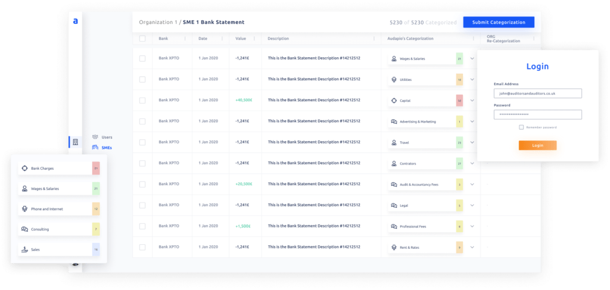
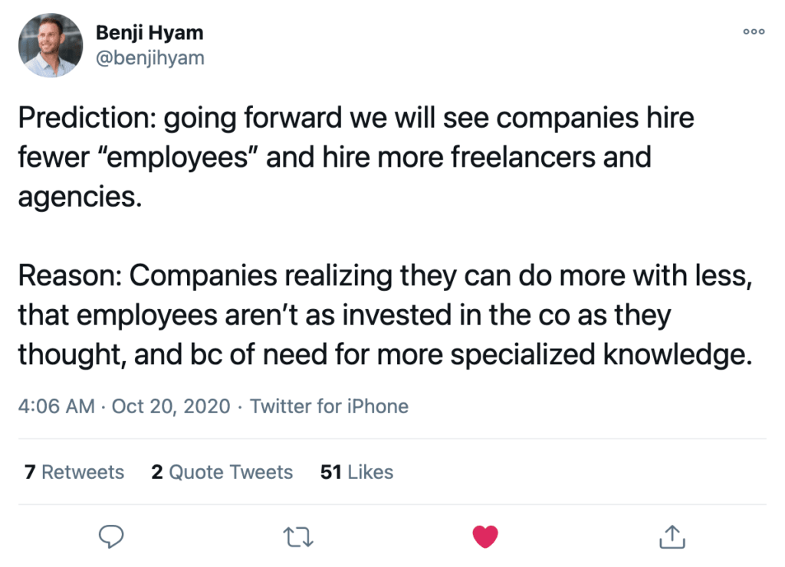
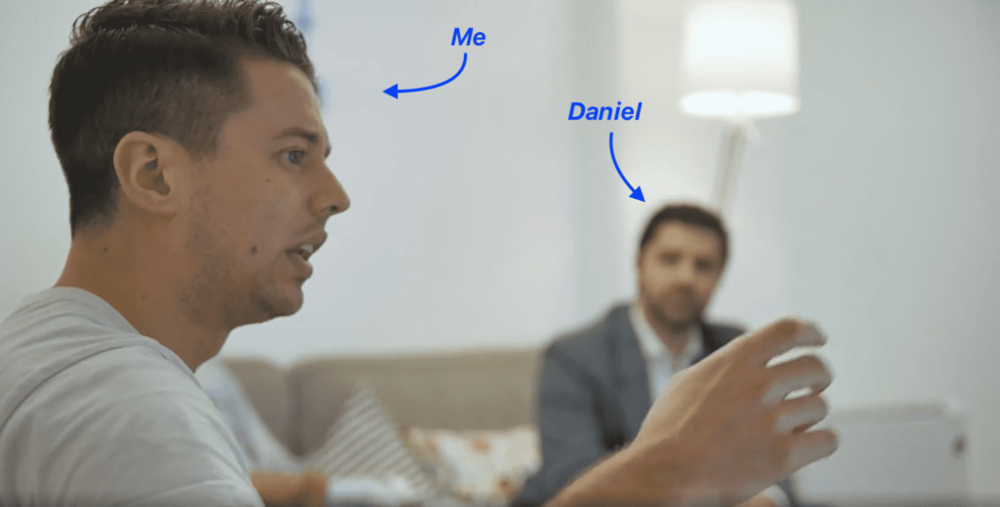

**_Finding a technical co-founder is one of the biggest challenges faced by startup founders. Here’s how Audapio’s Founder Dudley Gould overcame this common startup hurdle._**

I started my entrepreneurial journey like most first-time founders.

I had a great idea, with the industry knowledge to turn it into a business vision. But I had no idea how to actually bring it to life.

No experience. Limited technical expertise. And no technical co-founders.

I was convinced I needed a technical co-founder, that dream partner who could help turn my vision into a product.

So I started looking for them.

I went to meetups. Reached out to friends and friends of friends. Reached out to ex-colleagues. Joined online groups.

You name it, I tried it.

The days quickly turned into weeks. The weeks started going by quicker and quicker and I felt like I was going nowhere.

So I made a decision. Arguably one of the most important ones in the early stages of Audapio. But more on that in a bit.

First, let me start by expanding on the idea behind Audapio.

#### Contents

## The Idea

Whilst I worked in audit, I spent far too much time, re-keying data, searching for paper, and only testing samples of transactions. None more so, than when working with bank statements.

Auditors work with bank statements every day. These come in various PDF, paper or CSV forms, all of which are a pain to work with.

It would take a long time to go through every transaction in the bank, especially if you’re dealing with paper, so auditors pick samples. This means that **auditors often only look at about 1% of transactions!**

But these outdated practices are not only inefficient, they can also lead to **vital audit evidence being completely missed**.

Having worked in audit, I knew that Open Banking could bring new opportunities and completely transform the way auditors work with their clients’ bank statements.

Just have a look at the [Open Banking App Store](https://www.openbanking.org.uk/app-store/) to see some of the opportunities that Open Banking has enabled.

My idea was to **use open banking to provide auditors with secure, real-time access to client bank statements directly from the bank**.

Not only is this much easier for auditors to work with but it also gives auditors the much-needed assurance that they are working with complete and accurate bank statements**.**

**This alone would have prevented the recent** [**Wirecard audit failure**](https://www.ft.com/content/a9deb987-df70-4a72-bd41-47ed8942e83b)**.**

But most importantly, we’re leveraging robotic process automation (RPA) and providing advanced analytics and dashboards. **This gives auditors a complete picture of what goes through their clients’ bank in real-time.**

## The Search for a Technical Co-Founder

So, I started my search for a technical co-founder by going to as many networking events and meetups as I could.

From DevOps to Open Banking to generic tech events I tried them all. Some were good. Others I went to and I didn’t talk to a single person.

And whilst I learnt a lot about Open Banking and met some interesting people at the meetups, I didn’t find a technical co-founder. I didn’t even come close.

I also went through my contacts to see if anyone I knew could help me out. Friends, friends of friends, colleagues of friends, I reached out to a lot of people.

Bingo, I thought I’d found my technical co-founder. A good friend of a friend with the six years of development experience I’d been told my co-founder needed.

We started working together for a few months. However, he was incredibly busy with his job and didn’t have a lot of time to help me build a startup.

Some days he was getting up at four in the morning to do a couple of hours development before starting work. But naturally, that’s not sustainable and progress was slow.

Eventually, when I wanted him to quit his job and come on board as co-founder, he was honest and said the timing wasn’t right for him.

Which was completely understandable.

Giving up a good salary and job he liked to take on the risks associated with trying to build a startup is not something many people are prepared to do. I appreciated his honesty.

He did, however, put me in touch with a couple of friends of his who he thought might be interested.

But again, after various meetings with them, it never worked out.

Time was rushing by and my product wasn’t any closer to being built.

So I started researching other options.

Related: [From Being Fired to Building a Multi-Million Dollar Fintech Startup](https://altar.io/from-being-fired-to-building-a-multi-million-dollar-fintech-startup/)

## Changing Tactics

It was clear my search for a technical co-founder wasn’t bearing any fruit. So I decided to explore the option of working with a custom software development company.

A friend of mine put me in touch with a software development company in London that he was working with. But naturally, their being a top agency in central London meant that they were too expensive.

So I decided to search for other top software development companies outside of London, broadening my search to European agencies. These companies offer the same quality assurance at a much more competitive rate.

In total, I reached out to around 15 agencies, had meetings with 10 and whittled the list down to the top two.

One agency was based in Estonia and the other, Altar.io, in Lisbon.

I decided to go with Altar.io based on a mix of:

- Gut feeling
- A past project they had worked on in the Open Banking space
- The fact that they had worked with the likes of McKinsey and IMB – as well as various fintech startups.

Related: [Founder Story: Building and Scaling a Fintech Startup by Trusting your Gut](https://altar.io/building-and-scaling-fintech-startup-by-trusting-your-gut/)

I was just about to pull the trigger and sign the contract when I was approached by another early-stage startup. They offered to build my product for an equity stake.

The team was very experienced, and this opportunity felt too good to turn down. We worked together for three months and had a great relationship.

But then, our lawyers flagged a potential problem.  Taking an equity stake, potentially, meant both companies losing any SEIS/EIS tax relief (tax relief for investors who invest in early-stage startups), not something either could afford to lose.

We explored other options including merging the two startups, but we didn’t come to an agreement. **Ultimately, it would’ve meant me giving up the dream of starting my own business, and being an employee again. I had to walk away.**

I was back to square one.

So, I got back in touch with Daniel at Altar.io and told him what happened.

**10 minutes later, I had booked my flights to Lisbon**.

##### Looking for Software Development Services?

Get straight to the point, jargon-free advice from a tech expert that has been building award-winning Startups for the past 10 years.

Let's Talk

## Testing the Waters with Altar.io

My initial commitment was fairly small as I signed up to a [Product Scope](https://altar.io/service-product-scope/). I flew to Lisbon to spend a week with the team at Altar.io in their offices.

I remember arriving at their offices in Lisbon and my first thought was “thank goodness, they *actually* exist”.

The Product Scope was an intensive 5-day structured process. It started with an immersive focus session with the team to dive into the product vision from a business standpoint. From there, we created the user stories for the design of the Minimum Viable Product.

I was very impatient and excited to get started. I remember sitting down to do the Product Scope; the last thing I wanted to do was start from the beginning again. But it allowed us to all get on the same page and clearly define the business case.

For me, the Product Scope was less about brand new, magical, ideas surrounding my product. But it allowed me to fly back to London with confidence, knowing I’d met the team that was going to build my MVP.

I’d sat down with Daniel and aligned my vision with him and we’d made some great decisions about the product.

Related: [How to Build a Successful Minimum Viable Product (MVP) in 3 Steps](https://altar.io/features-inside-mvp-3-steps-know-answer/)

Expert Tip

The key decision point around hiring an agency is how quickly you need to get to market and what your financial resources are. Remember, outsourcing has been used by many very successful companies to develop their MVP, such as Slack, which is valued at $3.8bn, Skype which sold to Microsoft for $8.5bn, as well as BaseCamp and Github.

**Judy Robinett, startup expert and best-selling author of Crack The Funding Code**

## Going All-In

Then I opted to move on to the software development stage. I was finally about to start building my MVP. And then the first bump in the road appeared.

From the information provided by the Product Scope, the team realised the budget estimate was too low.

But instead of just telling me “tough, the price has gone up” Altar.io gave me three options:

1. Make adjustments to the MVP to keep it at the same price
2. Do it the original way, which would cost a lot more than estimated
3. Find a middle ground where it would cost slightly more, but keeps some of the features I wanted from the original way.

So even though the pricing wasn’t as I originally expected, I appreciated their willingness to be transparent and provide some options.

**Trust plays a huge part in working with an agency. You can’t watch what they are doing, and even if you could, you wouldn’t necessarily fully understand it anyway.**

You have to work with an agency [you can trust](https://www.inc.com/wanda-thibodeaux/want-to-know-if-someone-is-trustworthy-look-for-these-15-signs.html) otherwise, **making decisions becomes impossible**.

That same trust has to work both ways. For the team to put the maximum effort into building a startup MVP they want to know there’s a good shot at it succeeding. I’ve been lucky that Altar.io have backed me all the way.

**On paper, it’s an agency relationship, but in reality, the business will only work if you act as one team. If you don’t the project will fail.**

It’s definitely not always plain sailing.

Along the way, there have been changes in the estimated time and budget for various features. I was also inexperienced and not aware of how big a part bug fixing plays in software development.

Initially, a lot of our communication was quite ad hoc, no formal check-ins/updates – which was a bit messy. There were some teething issues, nothing major, but enough to make me nervous.

I had to go with the flow, I didn’t want to push too much, because I also felt that Altar.io were taking a bit of a risk on me and believing in my product. So I trusted them and believed in the fact they know what they’re doing.

Related: [Founder Story: The Key Decisions When Building a Fintech](https://altar.io/founder-story-the-key-decisions-when-building-a-fintech/)

## Not Just a Team of Developers

When I started working with Altar.io I thought I’d found a team of developers. But in the first few weeks, I learnt that actually, my biggest asset was Daniel, Head of Product.

He [challenged me on every decision](https://altar.io/saying-no-to-a-lead-is-hard-but-brings-value-to-the-lead/), making sure the user experience was always seamless.

In fact, even on my first call with Altar.io, Daniel spent two hours challenging me. He wanted to understand how strong the value proposition was and whether I had the resources, experience and network required to make it a success.

There’s always something Daniel thinks of that would never have crossed my mind. His experience developing dozens of products for the likes of McKinsey and various asset managers and MVPs for entrepreneurs is invaluable.

Altar.io is the seventh startup Daniel has built. So he has a lot of advice to offer and a lot of experience on the business development side. And then there’s Rui. Starting Audapio has taught me that building a startup is not just about finding a problem and creating a solution. There are hundreds of problems and solutions out there waiting to be tackled.

The real challenge to building an MVP  is marketing. To me, I’m building something that is obvious. Changing the way people work with bank statements from sampling transactions from Paper, CSV or PDFs to testing 100% of transactions on a secure digital platform.

But working out how to [find and approach your target market](https://www.quicksprout.com/how-to-identify-the-target-market-of-your-startup/) and, more importantly, how to quickly, simply and effectively explain the value to potential customers is not as easy!

**Ask any successful business founder what their biggest challenge was. I’m sure 9 times out of 10 it’s marketing-related!**

Rui is Altar.io’s Head of Marketing. He has a lot of experience and knowledge and loves to share it. We’ve ended up having fortnightly calls to catch up and discuss all things marketing and I’ve learnt a huge amount from him.

So I think it’s fair to say that with Altar.io **I’ve not just found a team of developers, I very much feel that I have an extended team of co-founders.**

Just instead of giving them equity, it’s cash.

Expert Tip

By allowing yourself to be challenged you will become wiser throughout your business journey. You will have a clearer idea of where to invest your time & money – thanks, in part, to that outside eye. After all, if you are talking to an experienced agency they have probably faced many of the pitfalls and mistakes you are likely to encounter.

**Paolo Dotta, Co-Founder Altar.io**

## Should You Hold Out Until You Find A Technical Co-Founder

I still really like the classic idea of finding a technical co-founder. Someone that shares your passion, commitment and responsibility, and is equally experienced, just on the tech-side.

And if you’re looking for one, you should [read this](https://altar.io/how-to-find-a-cto-for-your-startup-the-founders-guide/) from the team at Altar.io.

But whether or not that’s a better option, I couldn’t say for sure. I think it would make a lot of things easier. Building an MVP with an agency can be costly, and there is often the perception that solo founders working with agencies are a bad bet. **But the reality is, finding that dream technical co-founder is so hard.**

As I mentioned earlier, I was:

- Going to random tech meetups approaching people to make connections
- Reaching out through my contacts to find someone who could help
- Going through my LinkedIn connections to see if I knew someone who knew someone
- I signed up to various websites

I’m glad I spent the time I did trying to find that perfect technical co-founder. A couple of times I even tried to convince myself I’d found them – as many founders do.

But at the end of the day, no one I met had the perfect combination of skills, passion and willingness to leave their job to join me.

I wouldn’t hesitate to use an agency if you can’t find a technical co-founder. Just [make sure it’s the right agency](https://altar.io/10-reasons-why-outsourcing-software-development-fails/).

Expert Tip

Outsource the job to be done. Not the reason it needs to be done nor the ownership of what needs to be done; outsource the skills and work in the same manner that you’d hire the best resources for any job

**Paul O’Brien, Founder of MediaTech Ventures**

## Final Thoughts

Expect more than a few bumps along the way and prepare to be persistent.

You'll make mistakes, people around you will make mistakes and everything takes longer than you would expect (this bothers me still today).

Ultimately, the secret to surviving the roller coaster is surrounding yourself with people you can trust. People who believe in your idea as much as you do.

Regardless of whether it’s a technical co-founder, CTO or an agency. Focus on finding the right fit for you and go for it.
