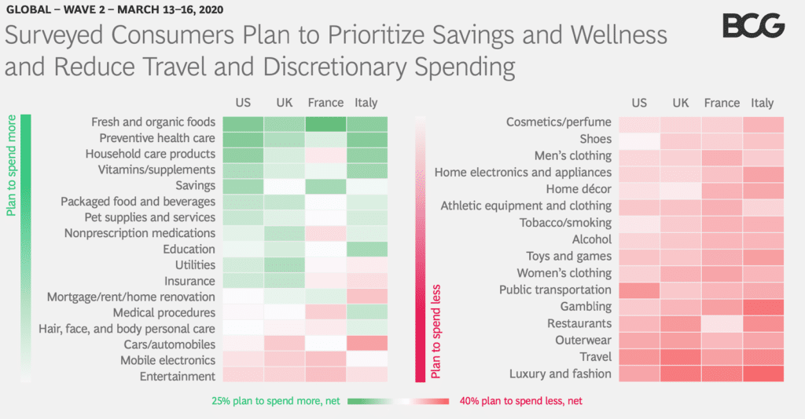
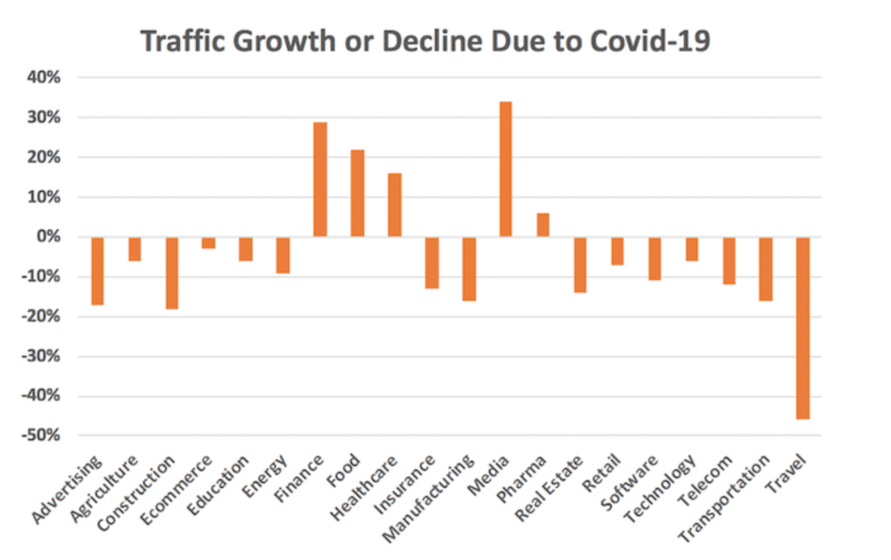
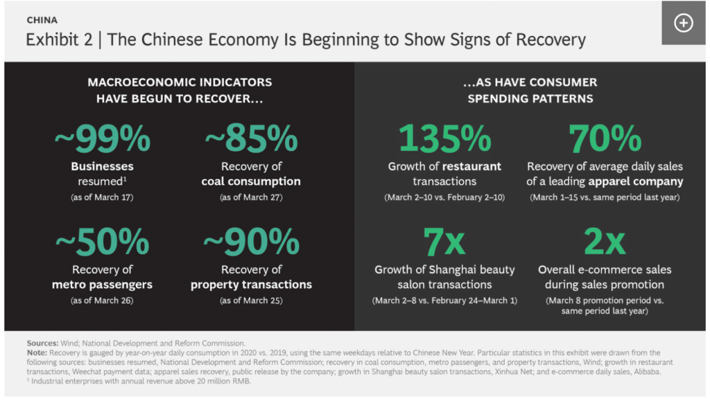
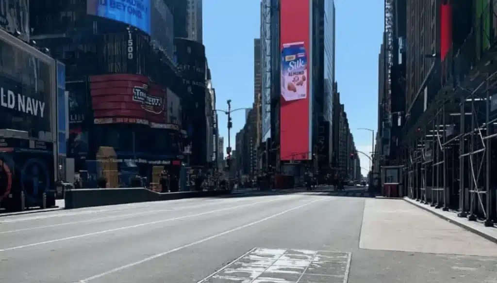

As I write these words we’ve just passed one million known infected with COVID-19 and the economies of the “advanced” world are certainly going into a recession (two quarters of negative growth). In a globalised world physically connected by just over 100,000 flights per day, contagious disease populates the world in a matter of weeks. With a global mortality rate of around 10%, despite modern medicine, this is yet another global “plague”. But we as a globally connected society have new tools (such as lung ventilators) and new tricks (social distancing).

This is also the most controlled and managed global recession ever, with large companies, governments, central banks, healthcare and supranational bodies discussing how to manage the shock of a formidable biological enemy.

We live in the era of the Humans, or Anthropocene. A term popularized by [Yuval Noah Harari](https://en.wikipedia.org/wiki/Yuval_Noah_Harari), author of Homo Sapiens and Homo Deus, that reflects on the novel nature of a hyperconnected human world that has incredible specialization and information. Allowing it to model nature (think antivirals, vaccines) and program the future (think genetic editing and GMO crops).

What’s happening now is at a macro level what immune systems try on viruses. An impressive array of coordinated and highly intelligent systems engulf and drag out invading agents such as toxins, viruses or even parasites. It seems as if the entirety of the body goes into action. Pain is felt, fever, diarrhoea and other nasty symptoms. But Immune systems are not perfect. They do not recognize all threats as they do not have perfect information and often cannot react to novel pathogens. Instead of prevention they often act on fighting a fire that is already raging. That’s the case for many COVID-19 patients these days.

As an information society (highly connected), when facing a grave and global threat, we as a whole share pain, suffer losses and act in coordination to employ the known means to fight off and drag away from our society the virus. Again, information works well with the known but struggles to cope with the unknown. New deadly viruses (and above all highly contagious ones) demand novel approaches. Social isolation for contagion is the medicine of choice as other approaches are found. This is an extremely costly choice but brings an opportunity to act better in the next pandemic or social isolation event.

Governments and companies calculate how to distribute economic pain via short term cost cuts. This impacts employees and suppliers to keep the businesses afloat during a near stoppage of demand. On the Political front, having an organised effort that keeps people at home but with sustenance prevents the shock of the dangerous pandemic _aftermaths_ that killed empires and set back human progress hundreds of years at a time.

### The Economic Front

Businesses that rely on human contact will suffer the biggest shock. COVID-19 is a real-world virus, not a Windows 98 virus, meaning that the tech world stays intact and the real world suffers.

_The viral crisis brings a paradox. On one hand, the economy of closeness suffers tremendously physically. But the economy of tech-enabled closeness thrives even more than until now._

Hence, the businesses of the “FAANG” acronym (Facebook, Apple, Amazon, Netflix, Google) but also Microsoft, Zoom and many others in the tech sector will carry on their road towards global domination in sales, cash in hand and balance sheets.

For the rest of the economy, while central bankers haven’t yet figured out how to stem the downfall in SMEs they have at least made sure credit keeps existing via massive interventions. Keeping interest rates extremely low by purchasing corporate debt at a tremendous scale.

Meanwhile, governments in the developed world have been issuing extraordinary Lay Off conditions in which they subsidize companies to keep them from firing employees.

The damage to demand in a quarantined world is nevertheless pervasive. Below is an analysis of a few sectors and how they will fare during the Physical world Viral Outbreak and subsequent lockdown:

### Short Term Growth

- Basic products E-commerce
- Supply chain enablers such as Postal handling companies
- Communications
- Internet Communication services
- Online Entertainment
- Medical Supplies
- Online Collaboration tools
- Online structural capabilities (the Cloud)
- Dietary supplements
- Frozen food
- Plant-based food
- Savings
- Support Call Centers

Related: [The List of the Most Active Marketplace Investors](https://altar.io/60-active-investors-focus-marketplaces/)

### Resilience (Somewhat Unchanged)

- Supply chains
- Agriculture and Animal Production
- Supermarkets

### Hardship (+75% Drop In Sales)

- General Tourism
- Cruise Tours
- General Entertainment
- Cinemas
- Zoos
- Airlines
- Gas Stations
- Car Industry including maintenance
- Toll-Roads
- Cafes, Restaurants, Bars
- Other Brick and Mortar Retail
- Real Estate Brokerage
- Construction
- Automotive

Despite a lack of hard data at this point besides surveys, [BCG’s](https://www.bcg.com/) Corona March Report tells us that there will be many more losers than winners in this period. Consumers are stopping discretionary spending as they face economic hardship and a cloudy future.

Another good trend forecaster that validates the hypothesis of how staying at home with economic fear changes our buying behaviours is outlined by Kissmetrics. [Here](https://neilpatel.com/blog/coronavirus/) Neil Patel reviews data on traffic and conversion per sector.

People are focused on researching their finances, healthcare, media and pharma. But only committing to food and healthcare whilst broadly shunning everything else.

The human mind keeps up with the day’s flavour and adapts its expectations to a new reality — about which its end we can only speculate about. Maintaining the status quo is now the victory for most.

Looking at previous crises, what we believe will happen after this sudden decrease is that there will also be a sudden, steep increase in demand in the sectors that were most hurt. As well as a re-price as consumers cautiously get back into the market — with many suppliers competing for buyers.

Capital goods such as real estate may face a crunch due to many people having reduced means to buy or rent after a reduction in their salaries. They may be facing unemployment or at least a protracted recovery. Ongoing and delayed contracts will resume — but there could be scepticism towards new transactions.

Services such as (national) Tourism, Air and Road Travel and those related to everyday purchases like restaurants and cafes should, however, see a steep increase. This is due to the fact that people in a long lockdown will be eager to get back to their usual small pleasures and way of life as much as possible.

##### Building a Startup?

From the product and business reasoning to streamlining your MVP to the most important features, our team of product experts and ex-startup founders can help you bring your vision to life.

Let's Talk

The Political Front

Usually “plagues”, as bacterial or viral crises are called, have a decisive social impact. They break down chains of command, religions and trust. They destroy civilizations and bring about anarchy and barbarism.

The likely typhus plague of Athens 426–430 BC killed king Pericles along with his whole family. This precipitated the defeat vs Sparta in the Peloponnesian War, destroyed adherence to law and social customs and belief in religion. More importantly, however, it killed off a quarter of its population due to the disruption of trade routes in the coming years and marked a high watermark for Athens as the central Greek power for good. From a city of one million, the population kept dropping to circa 20,000 people by the early 19th century — before becoming the greek capital once more and enjoying a renaissance.

Like the Athenian plague, the Justinian plague of 541 CE ended Constantinople’s ambition to carry on the Roman empire. In the 14th century, the black plague carried most likely from China via the silk route and later by sea touching base in Italy first (an eerie coincidence with the COVID-19). The Black plague is estimated to have had a death toll of 100 to 200 million people being the biggest single killer in mankind’s history. This resulted in the biggest exodus from cities ever and a sink in economic and social life that would only be reverted with the Age of Discoveries.

Despite viruses, bacteria and parasites still being set above and beyond humans as APEX predators on planet Earth, homo sapiens (or rather Homo Deus in this Anthropocene era) are highly intelligent and above all extremely collaborative beings — that analyse and model nature to their benefit. After creating hundreds of vaccines and antivirals we have also developed a simple capability, possibility and even a unique authority. To regulate and create sustenance without movement and collaboration without physical presence.

These are, it seems, our most brilliant weapons: to stay at home in social isolation. Which is the contrary of what Thucydides saw in the last days of great Athens [“how crowding in Athens, along with inadequate housing and sanitation, helped the disease spread more quickly and added to the number of casualties.”](https://www.theatlantic.com/ideas/archive/2020/03/great-plague-athens-has-eerie-parallels-today/608545/). Where the majority isolate against this pandemic as a small part of us work overtime to solve the puzzle of its cure. This was just not possible in Classical Greece.

### Living in the Technological Now

Nowadays we won’t have the downfall of old empires. We will have a setback limited in scope.

 

Until we leave our homes and can reflect on the momentousness of what we lived through (the months of life _not as usual)_ there will be a few lasting impacts and opportunities for digital transformation that become a priority now that we see that life can go on and we must keep our house/economy in order (Oikos/home + Nomos/law = Economy) and we have the possibility to do so in this advanced period in the extremely connected Anthropocene age:

- Tech transformation of late adopters such as mini/local markets for hyperlocal deliveries
- Tech disruption of the last bits of office work that have not yet been “remotised”
- Conquest of late adopters 50+-year-olds into smartphone video communications
- Development and adoption of emergency structures for remote public services such as education and non-urgent health consultations
- Government adoption of digitized identity verification processes for citizen usage such as passport renewals, benefits applications or tax payments
- Increase in the number of Vegan lifestyle adoption. Coronaviruses and many other viruses have a direct link to animal consumption: HIV from Chimpanzee meat, Ebola from Bat and Chimpanzee meat, Nipah from Bat meat, MERS from camel meat, H1N1 from poultry and pork meat, etc.
- Full digitization of real estate transactions. Currently, in most countries, deeds are done in person although most of the underlying processes are already digital. The handshake formality is pointless. I’ve written about this before [here](https://altar.io/proptech-3-0-rise-crypto-securitization-real-estate/).
- Remote employee management software designed to manage vacation, gym passes, transport and restaurant gift cards, mandatory insurances, email accounts, fiscal declarations and rainy day topics such as lay-offs and firings.
- Subscription-based video cast services (to monetize anything from cooking to gym and meditation classes), a vertical of the [Passion Economy](https://altar.io/the-future-of-marketplaces-the-passion-economy/).
- Increase of the level of sanitary devices and sanitary readiness for future crises, from more soap, sewage and toilets in the developing world to generalization of mask usage in cold weather in the western hemisphere.
- Tech transformation of schools making the computer and internet for remote classrooms a right.
- Company and public services mandatory contingency plans for continuation under emergency statuses.
- Forcing of cash substitutes such as mobile and plastic card cash on sanitary grounds.
- Enhanced surveillance via CCTV, transactions on shops and mobile phone data on sanitary grounds.

And the list goes on. There are many ideas of how to carry on that could exist already but haven’t yet been a priority. Now is the time, especially because we do not know if next year there will be another viral outbreak.

Let us then enjoy the quarantine and self-isolation with more and more tools that allow us to live and work as usual as much as possible. Society needs to keep trading to keep living. This is important because the social upheaval brought about by massive economic declines that (used) to follow the big plagues was magnified by the inexistence of the modern social security and big government safety nets.

The economic despair that is a staple of the pandemic aftermaths bring the kind of misery and to society that usually sticks for a long time, derail democracy, institutions, law and bring tyrants, war and put even more lives at risk.

But that was then, let’s use our magnificent common wisdom as a society to be wholly different now.
