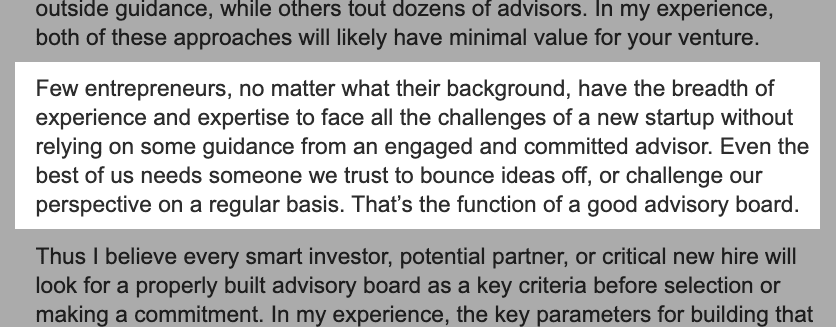
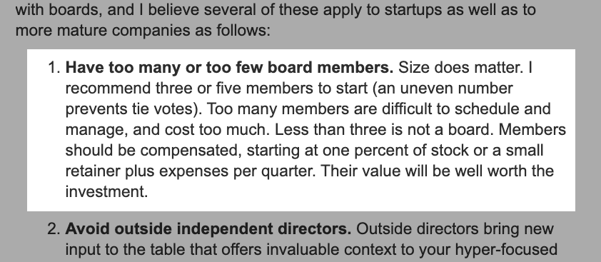
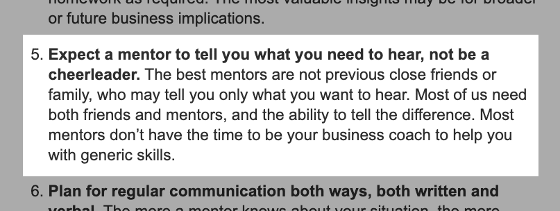
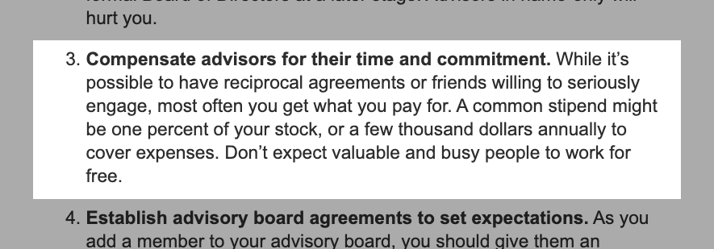
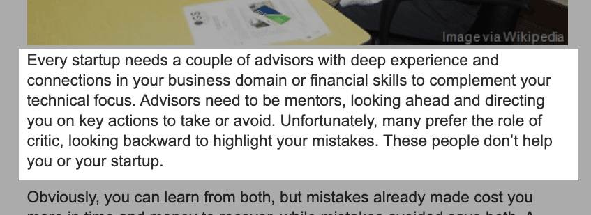
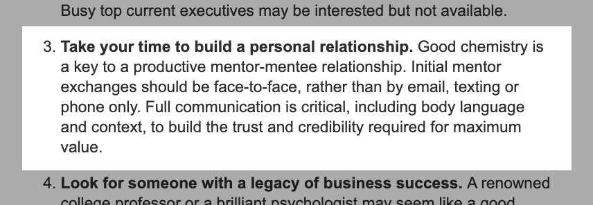

“Startup advisors are crucial to the success of your business.”

No matter the source, I’m sure you’ve heard or seen this statement before. And I agree with it.

Before co-founding [Altar.io](https://altar.io/) I had my own startup. From experience, I know that onboarding the right startup advisors; who have experience, knowledge, expertise and a broad network is only going to benefit your company.

Which is kind of obvious, right?

Problem is, whenever you think about one of the cornerstones of your entrepreneurial journey - be it [co-founders](https://altar.io/intellectual-humility-and-the-7-traits-of-great-co-founders/), [team](https://altar.io/the-well-performing-digital-team-for-your-agile-projects/), [investors](https://altar.io/startup-series-funding-everything-you-need-to-know/) or business advisors - a million questions arise.

What should I expect from a startup advisor? How should I compensate an Advisor? How can I find the perfect startup advisor for my venture?

To answer these questions and more I sat down with Startup expert Martin Zwilling.

Martin is the CEO & Founder of [Startup Professionals](http://www.startupprofessionals.com/) and has more than 30 years of experience as an Advisor & Angel Investor. On top of this, he is a Professor at Embry-Riddle University. He is a published author of three books and has articles featured on Inc., Forbes, Entrepreneur and Huffington Post.

The result of our conversation?

An actionable guide to help you navigate the nuances of the Advisor/Founder relationship.

## Startup Advisors: The Ultimate Guide with Martin Zwilling

#### Q: A lot of the Founders we work with at Altar.io tell us that the best decision they made was to create an Advisory Board for their Startup.

#### We also see a lot of resources and content online with Entrepreneurs saying the same thing. So the first question is more of a definition: What is a Startup Advisory Board?

A: I certainly would agree that a startup advisory board is a necessary and useful thing because first of all most of the things that you do, in the real world, aren’t learnt in any school. Even if you’ve gone to Harvard, or whatever, you learn a lot of academia around business. But what you don’t learn about in school is startups - those are a different beast entirely.

I’ve worked with several startups and I find that not every entrepreneur is really interested in advisory boards. Typically they’re very confident and they say “Well I can’t believe that I can learn anything from these old guys; maybe I know everything better than you do.” That ego and that passion can really get in the way of making rational decisions as they pertain to your business - I’ll give you an example.

I was on an Advisory Board for a software startup, a very good one, here in San Diego and the CEO also developed the product. So he is very *very* knowledgeable, he built the business, he did everything. In fact, as he grew he couldn’t do everything because he was killing himself; so he hired marketing people, for example, salespeople and everything went well for a couple of years.

### _A startup advisory board is a necessary and useful thing because most of the things that you do, in the real world, aren’t learnt in any school. You learn a lot of academia around business. But what you don’t learn about is startups_

Finally, he called me and he said: “You know, I’m just having real trouble because I can’t find any salespeople that are any good. I keep firing them because they can’t sell this product. I have to go out and close every sale.”

So I joined his board of advisors. Then I listened and watched for around three months. I talked to various people and I realised that maybe the CEO was a little too confident about the product.

In other words, the product was great when it started but he hadn’t really done anything to it for a couple of years. And as the interest faded away he thought it was the salespeople that were the problem when in fact I thought it was the product.

So, finally, another fellow and I were able to convince him that maybe he really needed to invest a little more in enhancements or upgrading the product. He finally said at the end: “Wow, that was a real insight I never would’ve come to that conclusion without some outside, unbiased view."

So I’m trying to help entrepreneurs not make those same mistakes that everybody else makes. And also not let their ego and passion [get in the way](https://blog.startupprofessionals.com/2020/02/7-ways-to-use-advisory-board-to.html) of making a good business decision.

Q: Do you think Advisors are useful for some of the specific nuances of a business?

#### For instance, one of the most common things about startup advisors that we keep hearing is they are useful for fundraising because they give you credibility, Would you agree?

A: If you’re in the fundraising stage then that’s very useful in a sense of giving you credibility.

I have been both an Angel Investor and an advisor. I’ll tell you that when I look at a business plan I look at the people first. I think investors invest in people and that certainly includes the leadership and the team. But it also includes any startup mentors and advisors that you have.

Related: [What Startup Investors Look for In Entrepreneurs and Their Teams](https://altar.io/what-startup-investors-look-for-in-entrepreneurs-and-their-teams/)

In other words, if you give me a business plan and say: “I’m the CEO, I did all the coding, I’ve done everything and by the way, this is my first startup,  I’ve never really done this before but I know how to do it.” I’d say you’ll get very little attention from an investor.

On the other hand, if you say “I have a team of three or four people that have complementary skills and I also have a business advisor or two” and you name them and maybe they’ve got some experience - like they’ve been in the software business for years or they’ve run their own startups or they’ve been with IBM etc. Then that gives an investor a new level of confidence that maybe this team has some advantage over their competitors.

### _I think investors invest in people and that certainly includes the leadership and the team. But it also includes any external partners that you have._

#### Q: Do you think the more experienced a founder is the more they need specific advice on a vertical -  a business advisor who is a specialist in a specific pain point they have?

#### Conversely, does a first-time founder need more of a general, startup expert? Or is it elements of both?

A: I think a general, startup expert is much more valuable. However, as an entrepreneur, you may say “Hey I’m a techie, I built this product, I understand the technology but I’m not a marketing or sales kind of guy.” In that case, maybe you should find a marketing advisor whose speciality and add that complementary skill to the ones you already have.

That’s always good, everybody on your team should be complementary. You should find people who can fill in the gaps in your skills. Take the example I gave right at the beginning of the interview, he was a techie.

He needed to look for a business advisor he trusted and believed in who knew about marketing - me.  Then when he fired all the marketing and sales guys because they couldn’t sell he believed me when I said: “It’s not your marketing guys, they’re great; it’s your product that stinks.”

You have to identify the kind of help you need. Whether its financial, marketing, personnel, technical, the list goes on. Then, find the advisor that fits.

I always say, start with a small number. Three to five people on your advisory board are enough to start. Then as your company grows you may end up 10 people on your advisory board because you have specialists. So you can change people or add people as required. I’ve written more on this [here](https://blog.startupprofessionals.com/2018/07/7-mistakes-to-avoid-in-forming-new.html):

#### Q: There are some similarities between Mentors and Advisors. I’m a [Startup Mentor](https://altar.io/lessons-ive-learned-virgin-mentor/) myself and I’m always trying to figure out: What’s the difference?

#### My perception is that mentors are more people that can help you grow as an individual, let’s say, at the early-stage and usually not on the payroll.

#### On the other side, I see advisors more like a professional figure which is really to help the company, not your personal growth and they are really an expert in a specific area, let’s say.

#### What’s your definition of the role of a mentor vs. the role of an advisor? What are the differences?

A: I think all of the points you make are good ones. But in a simpler sense, I see a startup mentor as someone who focusses on the Entrepreneur. In other words, if you’re a CEO and you say “I need some specific focus on whether I’m doing the right job or not” then what you need is a startup mentor.

Whereas a startup advisor is going to focus on the business. I’m gonna help you build the right business. Of course, that may mean some advice to you personally but business advisors look at the bigger picture, rather than *just* you as an entrepreneur.

So as a startup mentor I might say to a CEO: “I think you need to get out of this business, you’re a developer you’re not a CEO, you need to find somebody else.” That may not be good for your business but it’s good for you personally. So that’s the distinction that I make.

### _A startup mentor is someone who focusses on the entrepreneur. Whereas a startup advisor is going to focus on the business. Advisors look at the bigger picture, rather than just you as an entrepreneur._

##### Building a Startup?

From the product and business reasoning to streamlining your MVP to the most important features, our team of product experts and ex-startup founders can help you bring your vision to life.

Let's Talk

Q:  One problem first time founders face is that, although they are smart and have business knowledge, they have no experience in building a startup or the technology they should use.

#### Do you think this kind of founder should start with mentors for personal growth before onboarding advisors? Or do you think there is value in finding startup advisors from day one?

A: Well, actually I think a mentor position is a good position. I think it depends more on where you are in your life.

I live here in Prescott Arizona where there’s not a lot of startups but we have a great university here and so I actually spend time with entrepreneurial students. Obviously you would have to call that a mentoring position because they don’t have a business yet. But I enjoy having coffee with them and going to class with them and I actually am a teacher so I can get to know people.

Very quickly I may be impressed or unimpressed. I may go for a coffee with a student who wants to be an entrepreneur and after 20 minutes I’m already convinced they’re not going to make it as an entrepreneur or not. But I can still give them advice and it doesn’t cost me anything.

Related: [Lessons I’ve Learned Mentoring and Co-Founding Successful Startups](https://altar.io/lessons-ive-learned-virgin-mentor/)

Whereas if they came to me formally and said “I’d like you to be my startup advisor. I want to sign you up at a thousand dollars a meeting.” I would say no sorry I don’t think it’s going to be productive on your side.

So these are like any relationships. Relationships are where value comes from. I have a lot of technical knowledge but I don’t just want to tell someone “Technically this is what you have to do.” I really want to build a relationship where they will listen to my perspective and my mistakes and not repeat them.

#### Q: So, I’m a mentor for Virgin Startups, the Richard Branson vehicle to help startups, and in the intake, they really keep saying you should do it because you’re passionate about it, you don’t do it for any kind of return, etc.

#### Whereas startup advisors are paid or compensated in some way. Do you think that a startup mentor could also be paid or compensated or this should really be more of a friendship?

#### Personally, I mentor because I’m passionate and I really like to help entrepreneurs - and if they can avoid a mistake that I’ve made then I’m really happy about it. Do you think, eventually, mentors should be treated as advisors and be compensated somehow to align the interest?

A: It depends on how active and how much of a role you take as a startup mentor.

I think both mentors and advisors should be compensated. They may be compensated differently - in other words, one might say “I want a share of your business” or another might say “I just need expenses every time we go visit each other” for example.

But those people who say I’m gonna count on my friends to be mentors are making a mistake. I think your friends tend to tell you what you *want* to hear. Whereas a mentor will tell you what you [*need* to hear](https://blog.startupprofessionals.com/2016/12/7-keys-to-teaming-with-right-mentor-for.html). And those may not always be the same answer.

#### As a founder, I want my mentors and advisors to feel like they are appropriately rewarded or appreciated for their efforts. And that this isn’t just something they have to be doing because they’re my family or friend.

It’s as I stated in [this article](https://blog.startupprofessionals.com/2019/10/10-insights-for-locating-perfect.html):

### _Some of the best mentoring relationships don’t involve monetary compensation, but none are free. The first cost is networking to find a mentor who is willing and able to give adequate focus on the relationship. In any case, it is good form to offer compensation, such as a small monthly stipend, plus expenses, and perhaps a 1% ownership in your startup, to show your commitment._

#### Q: What steps should I take before onboarding Startup advisors or mentors?

A: First of all you have to be convinced that you need someone, or that you are willing to work with someone. I find that some entrepreneurs think that startup advisors are just another burden, as I mentioned with my friend before. This type of entrepreneur often thinks and advisor is just going to get in the way and tell them how to do things when they don’t want to do it that way.

So it’s about having a mindset that says: “I actually agree that I have things to learn and that I can benefit from a business advisor.” That means planning what you expect from your advisor.

Expecting praise and satisfaction at every step is probably not very smart. A startup advisor’s responsibility is: to be honest. And that may mean telling you something you don’t want to hear. Or that your business needs to go in a direction you didn’t originally intend it to.

So you need to make an assessment:  what it is you need from an advisor and how much help are you willing to accept?

In terms of advisor compensation, an advisor may say “I want 1% of your company.” Or they may say “I want a thousand dollars for every quarterly meeting that I go to.” You have to make sure, whatever the terms are,  you deem them as reasonable compensation. Otherwise, you’ll just feel like you are getting taken advantage of.

Ultimately, you have to understand what you need from a startup advisor, what it’s going to cost you in terms of time and compensation and everything related to it.

### _Expecting praise and satisfaction at every step is probably not very smart. A startup advisor’s responsibility is: to be honest. And that may mean telling you something you don’t want to hear. Or that your business needs to go in a direction you didn’t originally intend it to._

#### Q: Do you have a best practice when it comes to startup advisor compensation?

#### How would you recommend compensating startup advisors? Should you negotiate a regular salary, cost per quarterly meeting, equity share?

A: Well I think there are two kinds of advisors. One type of advisor really wants a chunk of your business because they want to share in the success of that business. The other is more of a professional who is more like a startup consultant who says “I get paid for my time.”

I, for example, often get offered 1% of a business and I say “Look I have enough wallpaper for my kitchen.” The reality is that most startups take a long time to pay back. I’m not looking for long-term payback; just give me $1k for every meeting. Something that will cover my expenses or make me feel like this is a worthwhile initiative.

As a founder, you’ve kind of got to get to know the people that you want as your business advisors and find out what’s important to them. But you should never expect [good advice to come for free](https://blog.startupprofessionals.com/2020/02/7-ways-to-use-advisory-board-to.html):

#### Q: What about term sheets for advisors. The legal side of startup advisor agreements. Can you share some tips?

A: You know, I’m not really a big proponent of term sheets. Other than to say that as an advisor you forgo any liability on the guidance you give.

Other than that it’s not as serious as bringing in an investor where you want to know when and how each of the terms plays out. So I don’t really negotiate a term sheet for an advisory position.

It’s more of a simple business consultancy agreement. Or in the case of equity for advisors, it’s more of a contract that states the advisor owns X% of the company and that’s it.

#### Q: When it’s too early in a startup to value the company, or if it’s a valuation without any concrete foundations, is it normal practice for startup advisors to accept convertible notes?

#### Or is it more common to negotiate a startup advisor equity agreement straight away?

A: The problem with early-stage startups is valuation. In that, there really is no substantial valuation. So they could offer me 15% of the company and I don’t know what that means. And probably it doesn’t mean much.

I really also don’t go for convertible notes. That’s a further dilution of what the value is in terms of some future statement.

I work, typically, with early-stage startups and that’s the reason I don’t go with equity agreements. Equity doesn’t mean very much at that stage. You still don’t have a valuation. Probably haven’t shipped a product yet. There's no revenue or maybe you don’t have any intellectual property like patents. You don’t have assets.

So valuation is really goodwill. I get into a lot of valuation discussions like you see on shark tank. They think their startup is worth $10M and they offer you 10% for $1M and the sharks all laugh at them.

They say: “Tell me what your revenue is?” and the founder says “Well I sold 5 units and that’s worth $1k.” There is no basis for a valuation there.

Related: [Expert Interview: The Hidden Details When Funding Your Startup](https://altar.io/expert-interview-funding-your-startup/)

I can tell you very quickly, and I think every investor will tell you very quickly, what your valuation is. If you have a patent I’ll probably give you a $1M valuation. If you and your team have done this before I’ll maybe give you a couple of million dollars for that. So it’s not very hard, that way, to get to a three or four million dollar valuation.

But if you are an individual who's doing this all yourself and you don’t have any patents and you’ve never sold your product, except to your mother, you probably don’t have any valuation. I don’t like to get into equity discussions for that reason.

### _Equity doesn’t mean very much in an early-stage startup. You still don’t have a valuation. Probably haven’t shipped a product yet. There's no revenue or maybe you don’t have an intellectual property like patents. You don’t have assets._

#### Q: How should a Founder choose the right startup advisors?

#### Conversely, how do you select startups you want to Advise? What’s the moment that you say “A-Ha, this is a startup I really want to advise”

A: From a founder’s perspective, I think selecting a business advisor is just like selecting an investor. You should do some due diligence to make sure your interests are aligned. In terms of qualifying startup advisors for your new venture, I have [five questions that you should ask yourself](https://blog.startupprofessionals.com/2020/01/5-questions-to-qualify-advisors-for.html).

#### From an advisor’s perspective, if I am considering joining a startup as an advisor I do the same. I do the due diligence on that team. Probably that means I would go and spend a day with that team. Not only would I talk to the CEO but also to the other people.

I want to work out if this is a business that works together. Does this team get along with each other? Is there an autocratic dynamic or is it more collaborative? I also decide whether or not they’re going to listen to me or if they’re actually even interested in a business advisor.

It takes due diligence on both sides. I jokingly say it’s like dating. Don’t make a decision in the first week. Go out together, have dinner together, talk to each other. Eventually, you’ll work out if you can work together or not.

#### Q: I’ve heard from a lot of successful people saying “You should onboard  advisors from day one so that the team makes as few mistakes as possible.”

#### If you are a successful, multi-exit founder then that’s quite easy to do. They are more appealing to advisors. More than this they have the network to reach those high-quality startup experts.

#### But how can first-time founders find startup advisors?

A: I think there are all kinds of situations but the reality is that some people who you want as your advisors just aren’t accessible. Or they don’t have enough time or interest to help you.

I would love to have Bill Gates as my business advisor but he’s got 10,000 things going on so its probably not a rational expectation that he would have the interest or time to focus on my startup.

So you have to do that kind of assessment. Don’t go after someone like Elon Musk who is a great name but probably isn’t that interested in helping you.

What I recommend is, as a startup founder, talk to some of your peers and say “You’re a software company like me, you worked with this advisor, can you recommend him?” And they’ll say “Don’t touch Martin Zwilling he’s a guy who will sign up but I never hear from him.” Or he doesn’t have a positive attitude or whatever the issue might be.

So it’s just like finding an investor you need to do your due diligence. Talk to your peers, go to the networking groups and talk to the potential advisor directly.

### _I would love to have Bill Gates as my advisor but he’s got 10,000 things going on so its probably not a rational expectation that he would have the interest or time to focus on my startup._

#### Q: Imagine a first-time founder. They already know they need to find help and they want to. What would be your best tip for them to find the right startup advisor?

A: Like we’ve talked about it's not a simple thing. But I think the advice I would always give is to find somebody that you can have a trusted relationship with. In other words, a business advisor has got to be someone you trust and respect.

I think it’s all about relationships when it comes to startup advisors and mentors. Relationships are necessary for every CEO. In other words, he has to trust his partners, he has to trust the key people on the team. He has to trust his investors, advisors and so on.

I often run into entrepreneurs who seem paranoid. They think someone is out to get them. They think someone is going to steal their idea. That somebody is going to take advantage of them or lead them astray.

I think that’s a very bad attitude. That’s the kind of entrepreneur I typically walk away from because in fact, I think somehow you have to be trusting yet verify. So you can listen to a business advisor, then go and ask people, talk to people, trust your gut ultimately.

Overall, find someone you can trust who can become your [confidant](https://blog.startupprofessionals.com/2015/11/7-criteria-for-selecting-entrepreneur.html) and build that relationship:

#### Thank You, Martin.

I really appreciate Martin taking the time out of his busy schedule to share his insights on startup advisors. What are your main takeaways from the interview? Is there anything else you would like to know about startup advisors that we didn’t cover here?
