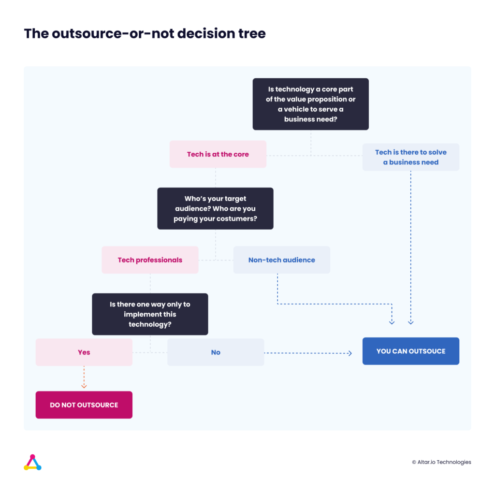

Building a Startup? Hopefully, that means you’ve found a problem or inefficiency, you thought long and hard about it, and now have a vision on the best way to solve it with a technical solution.

Problem is, as a non-tech founder, you're probably struggling with the best way to bring this idea to life.

If you’re already doing some research, you’ll know by now that there is no definitive answer as to what the best approach is.

Some people believe you need to onboard technical talent from day one, not only to please investors but also for the overall success of the project. Others will tell you to refrain from hiring anyone before proving your concept.

At the end of the day, you have more questions than answers. And knowing that “bad code” [costs companies around $85B annually](https://go.stripe.global/reports-developer-coefficient.html?utm_source=linkedin&utm_medium=cpc&utm_campaign=EMEA_All_EN_Remarketing_Traffic_All-Site_Visitors_Static_LP_&utm_content=Static_LP_Technical_Developer_Coefficient#Form__success), getting the right answers is kind of a big deal.

But there’s no need to panic. While it’s going to take time and considerable effort to find the right technical partner for your startup; by following a structured process you’ll be one step closer to making the right choice.

#### Contents

## The Basics of Tech

As a non-technical founder, you don’t need Wozniak-level tech expertise to build a great company.

You should be focused on the business-driven vision - just like Jobs.

That being said, it’s important you learn the basics of tech because many technical decisions are business decisions.

If can’t keep up with the conversation on basic tech concepts you will put yourself at a disadvantage because:

1. Technical partners may see you as naive.
2. You risk losing control and accepting whatever your technical partner says as law.
3. If you can’t understand potential technical partners you are not in a position to properly vet them - as we will cover later on.

**Tip:** There are many resources online to learn the tech basics. I would recommend, however, [this one](https://altar.io/what-the-non-technical-entrepreneur-needs-to-know-about-tech/).

It’s specifically tailored to the needs of a non-technical founder. The entire crash course is also available in video format on our [Youtube channel](https://www.youtube.com/channel/UCeEerfXCJcXm9C81tWpJ3qw).

https://youtu.be/CgFWz9f0Gug

Once you have gained the fundamentals of tech knowledge it’s time to **evaluate your options** when it comes to potential technical partners.

## Technical Co-Founder, CTO, Team of Developers, Outsourcing with a Software Development Company?

When looking for a potential technical partner you have four options.

The first of which is to learn to code yourself. I won’t spend long talking about this because it’s the worst of the four solutions.

First, **d\*\***on’t underestimate the difficulty of developing a good piece of software.\*\*

Second, yes you can drop everything today and become a great software developer. But how long will that take?

Bear in mind that every day you spend committed to coding is another day further from launching your startup.

And Slow time-to-market = bigger risk of someone beating you to market.

And with over [23 million developers worldwide](https://www.statista.com/statistics/627312/worldwide-developer-population/#:~:text=Developers%20population%20worldwide%202018%2D2024&text=The%20statistic%20shows%20the%20number,around%2029%20million%20by%202024.) why not put it in the hands of someone experienced?

Splitting your focus and trying to ‘wear all the hats’ in your business will eventually cause you to burn out. As Neil Patel says:

You’re far better off sticking to your strengths: focusing on the business vision. It’s like I said before you are Jobs, not Wozniak.

There are [three other options](https://altar.io/whats-the-best-way-to-build-your-startup-cto-freelancers-agency/) worth considering when it comes to finding a  technical partner - starting with a technical co-founder/CTO.

### Technical Co-Founder or CTO

There are some stark differences between a CTO & Tech Co-Founder.

A technical co-founder is, well, what it says on the tin - **the technical founder of your startup**. They are an enhanced form of CTO. They have a say in the business and are normally compensated with equity.

Conversely, a CTO is strictly an employee. They have a say in the tech but not necessarily the business vision. Commonly they are compensated with a salary.

That being said the day-to-day responsibilities of a Technical Co-Founder & CTO are almost identical:

- Providing strategic, tech-based thinking on the business itself
- Building the Product itself
- Building the tech team (when it comes to growing the company)
- Staying on top of the latest tech trends and advancements

#### **Should You Hire a CTO/Technical Co-Founder?** 

Well, if you can find the right technical co-founder or CTO, go for it.

But it won’t be easy. The last entrepreneur I spoke to spent 9 months trying to find his soulmate.

When he couldn’t he ended up working with a Software Development Company -  [which has its own benefits](https://altar.io/how-a-dev-agency-can-be-your-startups-best-friend/).

Besides the technical ability, your soulmate CTO/Technical Co-Founder needs a lot of soft skills, the right combination of which is extremely hard to find.

**You can find more information** on evaluating the traits of a great co-founder [here](https://altar.io/intellectual-humility-and-the-7-traits-of-great-co-founders/).

They will need to help you represent your company to external parties (investors, advisors, etc.). They will also need to be able to build and lead a team.

In short, your candidate needs to be:

1. A technical Jedi
2. Possess the soft skills needed to lead and communicate effectively with the team and hold his own in external meetings
3. Ready to quit their job to take up your banner
4. Within your price range

So, **the answer** to the question “Should You Hire a CTO/technical co-founder is simple:

If you can find the Wozniak to your Jobs from day one then you should go for it. You may not end up building Apple, but you will be in a good position to succeed

But as I’ve already mentioned, many founders aren’t that lucky. It’s extremely hard to find a CTO/technical co-founder who embodies everything you need.

If that’s you, there’s still hope. Keep reading.

### Build a Team of Freelance Software Developers

At a glance, the idea of hiring freelance developers is a great solution.

It gives you more flexibility and lowers your costs. But it comes with its own set of risks and potential hurdles.

Here are the pros and cons of building a team of freelance web developers.

#### **Pros of Freelance Developers**

When you hire freelancers as your technical partner there is a lower commitment. Instead of hiring indefinitely, you can hire them on an “as-and-when” basis.

Meaning you will only be paying for software development when you need it. This will lower your costs considerably.

This presents a much lower risk than bringing on the wrong technical co-founder/CTO. You can simply thank them for their work and go your separate ways.

Working with freelancers allows you to choose the best person for each challenge; provided you know the fundamentals of tech.

For example, if your backend is built and ready to go. You are free to find the best frontend developer to compliment your product’s architecture.

#### **Cons of Freelance Software  Developers**

As with anything in life, it’s rarely plain sailing. And working with freelance talent is no different.

Without a CTO or technical co-founder, the first developer you hire will be responsible for the architecture of your product.

This critical decision will lay the foundations for your business. It’s vital that you trust them to choose the right coding language for your product.

You have to validate if the freelance developer is choosing the best stack for your is to ask some Software Development Companies to make you a project proposal.

If they all suggest the same stack or language as the freelance developer you know you are on the right track.

Your second stumbling block is potential commitment issues.

Freelance software developers, by definition, are **free to accept any job they want**. You have to make sure that, regardless of how many projects they are involved in, they will complete the work in a timely manner to the highest quality.

**Expert Tip:** When working with freelance software developers, keep an organised database of everyone you have worked with. This should include a detailed profile of their hard & soft skills. As well as a history of work they have completed with you.

You also have to ask yourself, are you ready to manage a team of developers? Managing development teams is no mean feat, especially if you are inexperienced. There are [many characteristics](https://altar.io/looking-developers-10-developer-archetypes-youre-likely-encounter/) that you will have to navigate to create a balanced team.

Ultimately, if you decide to go down this route you will be spending a lot more time managing and communicating with your technical partners.

If you don’t have a lot of experience managing developers you could also consider outsourcing to a [Product & Software Development Company](https://altar.io/).

### Outsourcing to a Software Development Company

The risk when outsourcing software development is the same as outsourcing anything that isn’t a commodity.

Outsourcing comes with its own benefits and risks. And as with any stakeholder [thoroughly vetting them is crucial](https://altar.io/10-reasons-why-outsourcing-software-development-fails/).

The biggest advantage of outsourcing software development is, in my opinion, having an experienced team behind you.

##### Looking for Software Development Services?

Get straight to the point, jargon-free advice from a tech expert that has been building award-winning Startups for the past 10 years.

Let's Talk

#### **Advantages of Outsourcing Software Development** 

Working with the right agency will give you access to multiple resources with years of combined experience in product and software development.

Many software development company founders are ex-startup founders themselves. As well as building their own products, an accomplished agency will have helped build hundreds of products over the years.

This means you will be working with an established team of professionals that have:

- Tackled the hurdles you are about to face.
- Solved similar problems to the one your business idea intends to solve.

They can pass that experience directly to you. Asking [questions and challenging your ideas](https://altar.io/saying-no-to-a-lead-is-hard-but-brings-value-to-the-lead/) to help you gain a competitive edge.

In short, working with the right agency gives you access to an established tech-team, mentors, product experts and business development experts all in one place.

**Shameless self-promotion moment**: we follow this approach at [Altar.io](https://altar.io/), and 75% of the founders we’ve worked with are still in business today. Which isn’t bad, considering [9 out of 10 startups fail](https://www.forbes.com/sites/neilpatel/2015/01/16/90-of-startups-will-fail-heres-what-you-need-to-know-about-the-10/#6c7ad1ec6679).

Working with a software development company also allows you to have flexibility in your team size. Which goes a long way to lower your operational costs.

As your development needs fluctuate you are able to scale the resources you use to fit. Increasing and decreasing the team size as required for your business needs.

#### **Disadvantages of Outsourcing Software Development** 

The first disadvantage of outsourcing to a software development agency is the same as outsourcing to freelancers.

As they work with multiple projects, you need to be sure the agency you choose can deliver high-quality work in a timely manner.

If you go down the route of offshore software development, you also need to take into account potential communication barriers. By this, I mean timezone, culture clash and linguistic differences. If not managed properly this can result in a negative business relationship.

One workaround for this is to nearshore software development. Here you can take advantage of competitive prices within the same, or similar timezone.

Another risk of outsourcing software development is that it will be impossible for you to oversee everything first-hand.

The main risk here is that you lose control of the project. It’s vital you choose an agency that keeps lines of communication open; with regular touchpoints that are agreed between you.

**For more information** on what to look for in a Product & Software Development Company, check out this [handy resource](https://altar.io/founders-guide-how-to-outsource-software-development-2020/) packed with actionable tips.

So, now you know all the options when it comes to onboarding a technical partner.

But it’s still not an easy choice, right?

The next parts should help make the decision a little clearer.

## Should you Outsource Software Development or Develop Your Software In-house?

This is the part where I share the framework I mentioned on the top of the article. It will help you decide **if software development outsourcing is an option for your company**.

I’ll simply ask 3 questions:

### **Is technology the core value proposition? Or is it a vehicle to solve an existing problem?** 

Take WhatsApp, for instance. Long before they were acquired by Facebook for $19B they relied heavily on outsourced talent.

In the beginning, they offshored their app development to Eastern Europe. As well as the development of their first iOS app.

They used technology to enable users to communicate across both mobile and desktop platforms. Technology is purely a vehicle to solve the user problem; which is why they could outsource successfully.

On the other side of the coin, there is Loopback. A Node.js framework that enables developers to create dynamic end-to-end REST APIs with little or no coding.

In this example technology is proprietary to the value proposition. Outsourcing in this scenario simply wouldn’t work.

### **Is your product aimed at technology specialists or non-tech consumers?**

Generally speaking, if your target audience is tech professionals then it’s advisable to build in-house.

But even then there are grey areas such as [Github](https://medium.com/@marcelo.lopez/how-slack-and-4-other-companies-owe-their-success-to-outsourcing-89993f03b2bd) who were able to outsource, as the technology they were implementing wasn’t unique.

Which leads me to the final question:

### **Does your product involve a technological “secret sauce” that makes it unique**

If technology is proprietary to your startup, or the way you intend to implement it is unique; you shouldn’t outsource. Just like Loopback.

So even though Github’s target market is developers; neither the underlying technology nor implementation is unique or proprietary.

Again, It is a vehicle to **solve a business need**.

The final step in finding a technical partner for your startup is vetting prospective stakeholders.

For More Information...

...on whether you should outsource or not, including case studies from successful companies that outsourced, check out this [article](https://altar.io/should-a-startup-outsource-its-software-development/).

## Do Your Homework

There are no two ways about it, you have to verify your potential technical partner **before** committing to onboarding them.

This starts with due diligence: validating their previous work. This step is relatively easy.

### **Track Record & Experience**

I recommend contacting previous employers your potential technical partner has already worked with.

This will not only help you understand if they have the right hard skills for the job. It will also determine if the developer/agency’s soft skills align with your company culture.

Regardless of hard skills, it’s important that you have to like and trust the people you are working with.  And that’s all in the kind of people they are, not what they can do.

In the case of freelancers, you can also check sites such as [Upwork](https://www.upwork.com/cat/developers/) or [Toptal](https://www.toptal.com/developers). These platforms provide ratings and reviews of listed developers. Directories such as [Clutch.co](https://clutch.co/profile/altario) have the same reviews and ratings for Software Development Companies.

### **Technology Stack & Infrastructure** 

As I’ve mentioned before, it’s vital that your technical partner has the right skills for your business.

They need to be specialists in the technology stack/coding language that your product needs.

One way to ensure they are the right fit is to again, look at their previous work.

If you are building a social media platform; target a CTO that has already built one.

If you are building a Fintech; target a Software Development Company that has a vertical in Fintech.

This is the quickest way to evaluate if their technical solution will align with your business needs.

Another way to do this is to talk to a third-party advisor. This person could be a tech Jedi friend.

It could be a developer who is not a contender for your business because they’re skills aren’t what your business needs.

Alternatively, it could be a Mentor or Advisor in the more [traditional sense](https://altar.io/expert-interview-ultimate-guide-to-startup-advisors/).

## In The End…

Whatever you choose, bear in mind that building a business is all about people. Your family, your customers, advisors, investors and most of all **your team**.

It’s like Steve Jobs said:

Great things in business are never done by one person

And that’s true for more than great things. In your Startup journey, everything will go wrong at some point. The right people will have your back and when the chips are down they will be with you and solve the problem.

So make sure you choose people you can trust.

Good luck.
