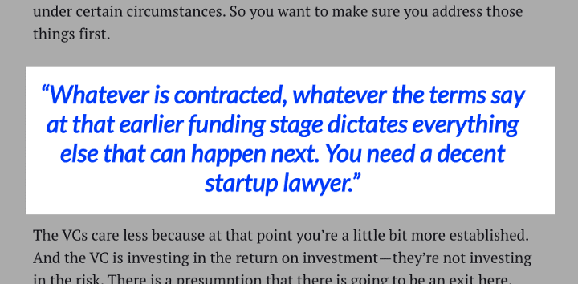

There are [many reasons why](https://altar.io/blog/lisbon-great-place-develop-startup/) choosing Portugal to start your business is a good decision, like the fact it's ranked [the best place in the world to work remotely](https://www.kayak.co.uk/work-from-wherever/rank). But I'm sure you know all of that already. So, I'll just move on to the next step: how to do it.

By following these actionable steps, you will be able to start a business in Portugal and have it up and running in no time.

#### Contents

## 1\. Meet the Legal Residency Requirements 

Before starting your new venture in Portugal, it’s essential you meet the residency requirements and collect all of the necessary paperwork before you begin.

#### **Non-EU/EFTA National**

If you are a **Non-EU/EFTA national,** you will need to obtain a Portuguese work visa and residence permit. You can find more information on how to apply through the Portuguese Immigration Office’s (SEF) [website](https://imigrante.sef.pt/en/solicitar/trabalhar/).  Those wishing to come to Portugal and invest in the country may also be eligible for Portugal’s [Golden Visa](https://imigrante.sef.pt/en/solicitar/residir/art90-a/) programme.

#### **EU/EFTA National**

If you are an **EU/EFTA National**, you are free to travel and work in Portugal. However, to open a business, you will need to get a [registration certificate](https://www.sef.pt/en/pages/faq-detalhe.aspx?nID=8) from your local city council. This formalises your residence and costs around €15.

#### **Tax Number (NIF) and Social Security** 

Regardless of if you are an EU or Non-EU national, you will need to sign up for a Tax Number from the [Portuguese Tax Office](https://www.portaldasfinancas.gov.pt/at/html/index.html). As well as Social Security Number from the [Portuguese Social Security](http://www.seg-social.pt/inicio). Both of which I would recommend doing **as soon as possible**.

## 2\. Register Your Company 

The first thing you need to do is **choose a business name**. The easiest way to do this is to choose from the [list of pre-approved names](http://bolsafirmasdenominacoes.justica.gov.pt/index.php?app=enh)**.** If you want to choose a name that is not on the list you should acquire a [Name or Denomination Approval Certificate](https://eportugal.gov.pt/en/servicos/pedir-o-certificado-de-admissibilidade-de-firma-ou-denominacao) before registering.  You will also need to be able to **register a business address in Portugal**.

Once you have a name and address you need to formally register your company with the Portuguese Government.

#### **Ways to Register** 

Firstly, it might be easier, especially if you’re not Portuguese, to get help from an experienced accountant with this process. Regardless of where you are from an accountant will save you time. Contact this [Annual Return Filing](https://www.cfoacc.com.sg/services/agm-and-filing-of-annual-returns) to help you run your business professionally.

If you feel confident enough to go it alone, then there are two easy ways to set up your business.

The first and arguably the easiest method is [**setting up online (Empresa Online)**](https://eportugal.gov.pt/en/servicos/criar-uma-empresa-online). This allows you to register online for around €360. You will receive your registration within 1-2 business days.

If you don’t want to wait 1-2 business days, or would rather register your business in person then you can. The service is called [**“Establish on-the-spot” (Empresa na Hora)**](https://eportugal.gov.pt/en/servicos/criar-uma-empresa-na-hora). Using this method sole traders and limited companies can be registered within an hour. This will cost the same as setting up online: €360.

There is also a **symbolic initial capital requirement** of €10 for limited companies (called a “Limitada” or “LDA”).

If you are planning to set up the equivalent of a **PLC (Sociedade Anónima)** you will need a minimum of five shareholders and a minimum capital investment of €50,000. Liability of debts is limited to business assets and shareholders are liable for amounts up to their share value.

#### **Registering your Foreign Company in Portugal** 

If you want to open a branch or subsidiary of your company in Portugal you will need to register the branch with the [IRN](https://www.irn.mj.pt/sections/inicio) and the [Commercial Registry Office](https://eportugal.gov.pt/en/espaco-empresa/empresa-online).

If you own a business that has been operating in at least two EU countries for the last two years you can create a [European Company](https://europa.eu/youreurope/business/running-business/developing-business/setting-up-european-company/index_en.htm). This allows you to easily expand into Portugal and other EU countries.

##### Do you have a brilliant idea that you want to bring to life?

From the product and business reasoning to streamlining your MVP to the most important features, our team of product experts and ex-startup founders can help you bring your vision to life.

Let's Talk

## 3\. Get an Accountant

As I’ve already mentioned an experienced accountant is invaluable. There are plenty of English speaking accountants doing business in Portugal’s startup sector. They will provide a no-nonsense approach and help you with all your financial concerns. They can also serve as an advisor when you need one.

At [Altar.io](https://altar.io/) we work with FN24 (you can contact them here: +351 217 575 118). I have also heard good things about other firms such as [Acctax](https://www.facebook.com/acctax.pt/), and [Moneris](https://www.moneris.pt/?lang=en). The monthly costs are usually in the region of €100 — €250.

## 4\. Sign Up for Great Accounting Software

When you start a business in Portugal, it is now a requirement that all invoices are produced by an authorised accounting software product that is linked digitally to the tax authority. Besides this software, we also suggest getting an ERP software as well, you can get [help from Technology Evaluation Centers](https://www3.technologyevaluation.com/selection-tools/p/features-list/c/erp) to get all the details.

This not only saves you time and money but also provides constant visibility on your business. It shows you where you are with your clients and offers you the ability to instantly analyse your company’s financial performance.

The two most startup-friendly products are [Sage One](https://www.sage.com/pt-pt/produtos/sage-one/?utm_source=GOOGLE&utm_medium=Paid-Search&utm_campaign=PT%7CGOOGLE%7CSEM%7CACCOUNTING%7CSage-One%7CNew-Keywords%7CBMM&utm_term=%2Binvoiceexpress&gclid=CjwKCAiAj53SBRBcEiwAT-3A2F0uNjYA-6eiHX9Dhm0eZjOrHKpaGd2V1QP6oU6O8rCniEKRznwk0xoCGusQAvD_BwE) and [InvoiceExpress](https://invoicexpress.com/) – I would advise you to use one of these.

## 5\. Pay Your Taxes

The Portuguese tax year runs from the 1st January until 31st December. As I mentioned above, you must register as a taxpayer before you can start earning money in Portugal.

When you become profitable you will need to start paying a progressive corporate tax. Most companies pay around  [21%](https://tradingeconomics.com/portugal/corporate-tax-rate#:~:text=Corporate%20Tax%20Rate%20in%20Portugal%20is%20expected%20to%20reach%2021.00,according%20to%20our%20econometric%20models.), which is one of the lowest in Europe. If you happen to have a very large company then your profit will be taxed progressively up to slightly above 30%.

Before that, however, you will need to pay some [payroll taxes](https://home.kpmg/xx/en/home/insights/2011/12/portugal-other-taxes-levies.html#:~:text=Social%20security%20tax,-Are%20there%20social&text=*Portuguese%20residents%20and%20non%2Dresident,%E2%80%9D%20or%20%E2%80%9CGerentes%E2%80%9D).). These include a social security tax of 11% (paid by the employee) and a 23.75% levee paid by the company. In addition, there is a progressive [Income Tax](https://europa.eu/youreurope/citizens/work/taxes/income-taxes-abroad/portugal/index_en.htm) that is partly paid by the company.

Your accountant will need to send you a salary sheet with your social security and income tax payment codes .  From experience, I know these take around half an hour to process.

Moreover, it’s worth remembering that the VAT rate in Portugal is 23% and is paid to the state every three months minus VAT spent by the company on its purchases.

##### Sign up for our newsletter

Join hundreds of entrepreneurs and business leaders to receive  
fresh, actionable tech and startup related insights and tips

## 6\. Find A Lawyer 

As you start your business in Portugal it is advisable to speak to a lawyer, or firm, knowledgable in business law. Obtaining the right advice can help you identify any tax breaks. As well as helping you generally navigate Portuguese bureaucracy as you launch your company.

For fiscal law, I would recommend [Mad.Intax](http://madintax.com/). They are a management firm whose services include accounting, legal and tax advice.

For labour law and setting up a company or local branch, we would recommend [Paramount Legal](https://paramountlegal.pt/).

In regard to a more traditional Law firm, I would recommend [PLMJ](https://www.plmj.com/en/). They are one of the biggest firms in Portugal, offering services from Banking & Finance to Corporate M&A. They also offer services in all areas related to technology law.

For a less traditional law firm, you could go to [Linkilaw.](https://linkilaw.com/) Although it’s not based in Portugal; this firm is designed specifically for startups and Entrepreneurs.  The importance of a startup lawyer should not be underestimated. Investment expert [Paul O’Brien](https://www.linkedin.com/in/paulobrien/) pointed out the importance of a startup lawyer in a [recent interview](https://altar.io/expert-interview-funding-your-startup/) with Altar.io co-founder Paolo Dotta:

If you need more institutional help; for example, if you are backed by International Private Equity or Venture Capital, Portugal has you covered. Some of the biggest law firms, such as [Linklaters](https://www.linklaters.com/en/locations/portugal) and [DLA Piper](https://www.dlapiper.com/en/portugal/), operate in here with offices in Lisbon.

## 7\. Employing Staff in Portugal

As your business starts to grow and you start to build your team you will be tapping into the [great talent](https://altar.io/lisbon-great-place-develop-startup/) Portugal has to offer.

Just make sure you account for the cost as you hire. Employers in Portugal are obligated to pay each employee 14 months of salary per year.  The extra two months are because holiday pay and Christmas bonus are equivalent to one month salary each. You are also obligated to social security contributions as mentioned above.

Employees are entitled to 14 public holidays and five weeks annual paid leave.

If you plan to hire non-Portuguese employees, be sure they have a valid work visa if they are a Non-EU/EFTA citizen. If they are an EU/EFTA citizen you can employ them with no extra visa requirements.

As I mentioned in another article, [10 Reasons Why You Should Build A Startup in Lisbon](https://altar.io/lisbon-great-place-develop-startup/), you and your non-Portuguese employees may also be eligible to benefit from the [Non-Habitual Resident](https://www.pwc.pt/pt/fiscalidade/2017/pwc-non-habitual-tax-residents.pdf) (NHR) status. Once you obtain NHR status any Portuguese income you receive is taxed a 20% flat-rate. More than this you’re tax-exempt on any income earned outside of Portugal.

## 8\. Digital Banking

There are only a few global banks operating in Portugal. However, it doesn’t matter as local banks are digital, allowing you to manage your business accounts online or via apps. We recommend [Millennium BCP](https://ind.millenniumbcp.pt/en/particulares/Pages/Welcome.aspx), which we use. [Caixa Geral de Depósitos](https://www.cgd.pt/Empresas/Pages/Empresas_V2.aspx) is another safe and reliable bet.

Both of these banks have made great strides in their tech transformation recently and hardly ever require you to physically visit their branches.

## 9\. Get An Office

If you are looking to co-work in Lisbon, there are many [great places available](https://altar.io/10-best-coworking-spaces-lisbon-entrepreneurs/) with plenty more to come. We’d suggest checking out [Cowork Central](https://www.coworkcentral.pt/en/home) and [Second Home](https://secondhome.io/location/lisboa/). Both round the corner from the trendy, sun-drenched, riverside strip of Lisbon.

Many of these spaces also offer office space for bigger teams. However, you can also find your dream HQ through [Idealista](http://idealista.pt/arrendar-escritorios/lisboa/mapa) or [CBRE](https://www.imoveis.cbre.pt/en-PT), commercial property agents. Both will advise on suitable offices, areas and other property needs.

## 10\. Get Workplace Health and Safety Checks

Every company in Portugal needs a yearly workplace safety check and access to occupational health services. There are now several companies providing these requirements. We’d recommend [Centralmed](https://www.grupocentralmed.pt/) or [Medilabor](http://www.medilabor.pt/).

### It’s Time to Start a Business in Portugal 

By following these steps your company will be open for business in no time. Now you can focus on the fun part. Whether it’s [building your MVP](https://altar.io/features-inside-mvp-3-steps-know-answer/), forming your [startup’s “dream-team”](https://altar.io/the-well-performing-digital-team-for-your-agile-projects/), or enjoying the Portuguese startup tech events and culture.

Just don’t forget to enjoy the sun and explore what this small but amazing country [has to offer](https://www.telegraph.co.uk/travel/destinations/europe/portugal/articles/portugal-best-things-to-see-and-do/).

Enjoy. We know you will.
