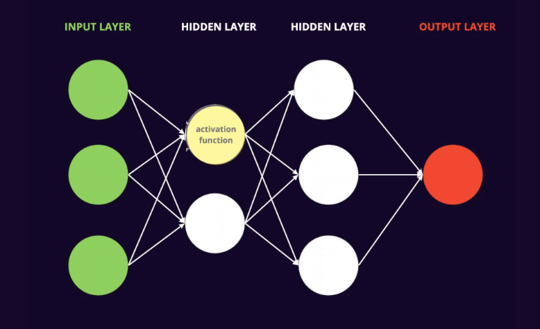
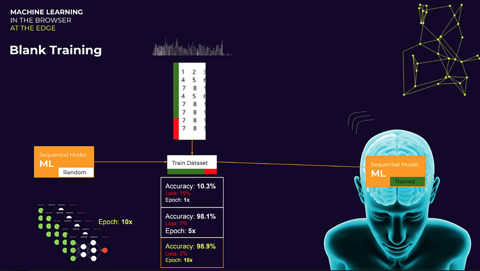
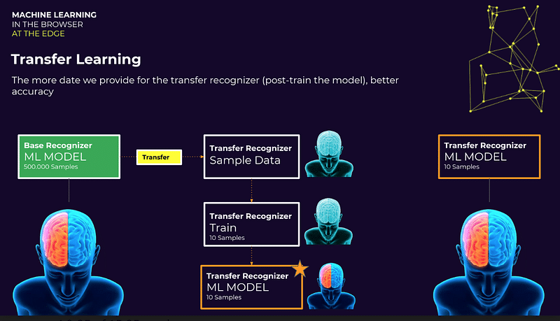

Machine learning in the browser is the newest kid on the block within web edge technologies. By the end of this article, you will know the basics behind machine learning in the browser and how Javascript, with the help of WebGL, allows us to train and run models directly to the client-side.

Machine learning in the browser is only adequate to run smaller models as it runs over the edge. It cannot run the larger models of traditional machine learning. This is where we will focus as developers.

In this article we will cover:

- What is Machine Learning
- Neural Networks
- Heavy Machine Learning vs Edge Machine Learning
- Tensorflow & Tensorflow.js
- Blank Training vs Transfer Learning
- Using Stable Pre-trained Models
- Usage in Production

### Machine Learning

Machine learning is all about mapping real-world problems to numbers. In a nutshell, first, we map the real-world problem to a number. Then we feed the computer some data and the computer processes that information — and predicts some probability (0–100%) based on the labels we’ve defined with our data.

Once it has learnt this information it can answer questions related to it with high accuracy. Some examples of this are:

- - Identifying an image

- - OCR (Optical Character Recognition) on Text

- - Interpreting Audio

- - Creating a conversation

- - Voice Detection

- - Recommendations

- - Profiling Customers

A model, when instantiated, has no capacity for understanding — one must first train the model. Once trained the model becomes usable and can output probabilities (become meaningful to us). Some algorithms used in regard to machine learning date back to the early 1900s such as:

- - Principal Component Analysis (1900)

- - Logistic Regression (1958)

- - K-Means (1957)

As a side note, there are two ways to achieve machine learning either using:

- - Supervised Learning, using a labelled dataset

- - Unsupervised Learning, using an unlabelled dataset

Some algorithms use CPU however most use GPU processing. In relation to machine learning in the browser we will be using GPU power via WebGL, but more on this later.

### Using the Data

When we train a model, most of the frameworks (including Tensorflow) will use 70% of our dataset to train the model and the remaining 30% to quiz the accuracy of the model.

This is the standard flow used by data scientists for machine learning:

1. Data Collection
2. Data Integration
3. Data Preparation & Cleaning
4. Data Vis & Analysis:
    - Model Training
    - Parameter Tuning
    - Model Evaluation
5. Model Deployment:
    - Generate Predictions (%) based on Inputs
    - Monitoring & Debugging

When we use machine learning in the browser — or in the edge, as developers, it’s a bit more straightforward because with Tensorflow.js you only need to:

1. Collect the Data
2. Train the model
3. Evaluate the model
4. Generate Predictions/Probabilities (%) based on Inputs

Meaning we can halve the time it takes to get things off the starting block.

 

##### Sign up for our newsletter

Join hundreds of entrepreneurs and business leaders to receive fresh, actionable tech and startup related insights and tips

Neural Networks

Neural Networks are the engine in Machine Learning. They are nothing more than a bunch of functions wired together to form a net. You have:

- - An input layer, where you feed in your data.

- - Hidden layer(s) where the algorithm processes that data (The size of these layers depends largely on the algorithms and amount of data you are using to train the model)

- - An output layer which gives you our end result

When training the model, on the first run, you get random outputs, at which point the model will begin a backpropagation cycle until it gets smart enough to process any data you passed to it (in accordance with the model labels, of course)

### Heavy Machine Learning

The most used frameworks in traditional machine learning are:

- - TensorFlow (One of the most popular frameworks — of which we use a spinoff: Tensorflow.js)

- - MXNet

- - PyTorch

- - Chainer

- - Caffe 2

- - Onnx

There are two ways to feed data:

1. Collect data sets and train the models with them
2. Use reinforcement learning by modelling a real-world problem in a simulated environment — as seen predominantly in the racing industry. This causes the model to collect information from the simulation and improve itself.

To train and deploy the model here is an example of three used ways ordered by workload:

1. We start a Jupyter notebook (with the algorithm, data sources and fine-tunings), train a cluster of machines and tune the model based on the output. We then create a cluster of machines to run the trained model.
2. We use a cloud provider, such as SageMaker from AWS to automate the process with plenty of off-the-shelf solutions.
3. Use a cloud provider SaaS API, such as Rekognition, to call an API and get results back

This Heavy Machine Learning approach is typically used by the Data Scientist.

##### Building a Startup?

From the product and business reasoning to streamlining your MVP to the most important features, our team of product experts and ex-startup founders can help you bring your vision to life.

Let's Talk

 Edge Machine Learning

This is where things get a little more exciting, and where we are going to focus as IoT, web and mobile developers.

Within Javascript (JS) we already have some cool edge technologies:

- - AWS Lambda functions

- - Cloudflare Workers

- - Browser Service Workers

- - Browser Databases

- - WebGL

I’m sure you use a selection of these — or have done before. We now have Machine Learning within Javascript. This allows us to use Javascript to train, and run, models.

I want to take a moment here to point out one important factor. Machine Learning is the newest guy in town when it comes to Edge Tools. At this stage, Edge Machine Learning is only suited to small models and low performing environments, in the browser, IoT devices, etc.

### Tensorflow & Tensorflow.js

Tensorflow runs on C, as it is the most adequate language to run statistics — and is essentially running matrix calculations.

Tensorflow.js is a rewrite of Tensorflow C in javascript. It makes extensive use of WebGL and provides us with not only a collection of pre-trained models but also a collection of pre-trained modules including:

- - Speech Command

- - Body Pix

- - KNN Classifier

- - MobileNet

- - PoseNet

And [many more](https://github.com/tensorflow/tfjs-models)

[In this article](https://magenta.tensorflow.org/performance-rnn),  we can see an example of machine learning in the browser. Where the model has generated, or “composed” a piano performance, based on its training from real performances.

So how do we get the model to this stage? We have two options — Blank Training or Transfer Learning.

Related: [Angulartics2 – A Powerful Analytics tool for Angular Applications](https://altar.io/powerful-analytics-tool-for-angular-applications-angulartics2/)

Blank Training

When blank training the model you first have to define it. Take a sequential model, the first job is to set the epoch — the number of times the model scans the dataset (70%) and quizzes itself for accuracy (30%).

If we only run the dataset through the model once (Epoch: 1x) we see that it is very inaccurate — and really quite dumb — with only 10% accuracy. By running the epoch to 5x our accuracy jumps to a staggering 98.1% accuracy. Finally, by using an epoch of 10x it will run with 98.9% accuracy.

My point? Your epoch becomes very important. The number of times you repeat the process is highly dependant on your dataset size. For some datasets repeating it 5 times is enough  because  it won’t get smarter after the fifth epoch. The epochs are not linear and your final number will depend highly on your dataset.

### Transfer Learning (Pre-Trained Model)

Here is an example of Transfer Learning:

We pick a pre-trained model — called a Base Recognizer in Tensorflow.js. We then transfer that knowledge from the pre-trained model into our model — the Transfer Recognizer.

The underlying neural network will remain tuned during this process. However, once we create the Transfer Recognizer (our model) the network will forget the previous labels. It’s like a memory wipe — still smart just with no memory.

The Base Recognizer may have been trained with 500,000 samples, whereas our Transfer Recognizer will be trained with a more limited sample.

In a nutshell, we are taking the optimised and tuned neural network and simply re-training it (adjusting) with our new, small, dataset and labels.

Not only do you have an extensive list of pre-trained models available on [Github](https://github.com/tensorflow/tfjs-models) but you can also pick and model generated through MXnet and Tensorflow and import them into Tensorflow.js.

The important thing to remember when we talk about the pre-trained models is that we are only focussed on the neural networks. The important thing is that we have that optimised neural network at our fingertips.

Here is a [demo](https://github.com/claudiotx/ml-edge-playground) I prepared using transfer learning with a pre-trained model.

Related: [Explore The Tech We Use](https://altar.io/tech/)

Wrapping Up

Despite only being released last year Tensorflow.js is already being used in major companies such as Airbnb and Uber.

This is an exciting time for Developers and Edge Machine Learning — and like with all things the platform is only going to grow and evolve.

Here are two more links for you if you would like to explore Edge Machine Learning in more detail:

- - [Move Mirror by Google Creative Lab](https://experiments.withgoogle.com/move-mirror)

- - [Github TensorFlow.js Gallery](https://github.com/tensorflow/tfjs/blob/master/GALLERY.md)
